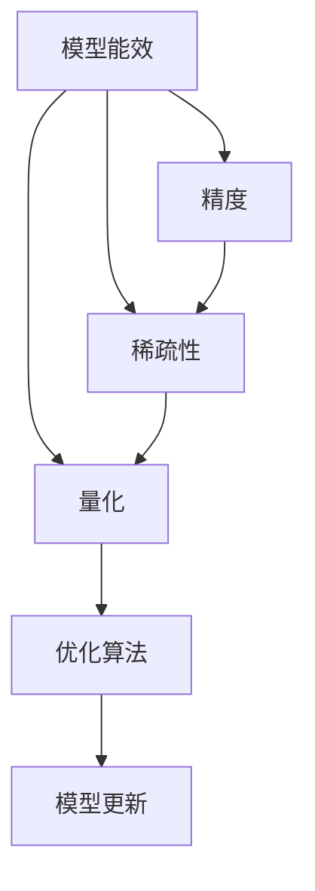

                 

## 1. 背景介绍

在人工智能(AI)技术飞速发展的今天，模型能效成为影响系统部署、用户使用体验的关键因素。一方面，随着数据量的激增和模型复杂度的提升，模型能耗和计算资源需求急剧增加，传统计算基础设施面临巨大压力。另一方面，模型在满足特定精度要求的同时，往往面临过拟合和资源浪费的问题，导致训练和推理效率低下，影响用户体验。

在这样的背景下，如何提高AI模型能效，实现从精度到稀疏性的优化，成为当前AI领域的热门研究方向。本文将从核心概念、算法原理、项目实践和应用展望等多个角度，系统探讨这一重要问题。

## 2. 核心概念与联系

### 2.1 核心概念概述

- **模型能效**：指AI模型的计算资源消耗和能耗效率。在实际应用中，模型能效直接决定了系统的响应速度、用户体验和部署成本。
- **模型精度**：指AI模型在特定任务上的预测准确度。精度高意味着模型能够更好地完成任务，但往往伴随着更高的计算资源需求。
- **稀疏性**：指模型参数的分布情况，其中非零元素占总参数数的比例。高稀疏性意味着模型中大部分参数为零，资源消耗较低，但可能会影响模型的精度。
- **量化**：指将模型参数从高精度浮点数转换为低精度整数的过程。量化可以大幅降低模型能效，但需平衡精度损失。

### 2.2 核心概念的关系

模型能效、精度和稀疏性之间存在着紧密的联系。

- 精度与能效：精度要求越高，模型参数量越大，能效越低。因此，需要在保证模型精度的同时，尽可能提高模型稀疏性。
- 稀疏性与能效：稀疏性越高，模型参数量越小，能效越高。然而，高稀疏性可能导致模型参数分布不均衡，影响模型性能。
- 量化与稀疏性：量化通过减少参数精度，提高稀疏性，进而提升模型能效，但需考虑精度损失。

这一系列概念构成了从精度到稀疏性的优化路径，指导我们如何在确保模型性能的同时，优化模型能效。

### 2.3 核心概念的整体架构

核心概念的整体架构可以通过以下Mermaid流程图来展示：



这个流程图展示了模型能效的三个核心维度：精度、稀疏性和量化之间的关系，以及它们与优化算法和模型更新的互动过程。

## 3. 核心算法原理 & 具体操作步骤

### 3.1 算法原理概述

提高AI模型能效的核心在于优化模型精度和稀疏性。通常，这一过程可以分为三个阶段：

1. **模型量化**：将模型参数从高精度浮点数转换为低精度整数，减少计算资源和能耗。
2. **稀疏化**：通过剪枝、压缩等技术，减少模型参数数量，提升模型稀疏性。
3. **重新训练**：重新训练优化后的模型，平衡精度和稀疏性，进一步提升模型性能。

### 3.2 算法步骤详解

#### 3.2.1 模型量化

模型量化通过减少参数精度，大幅降低模型计算资源和能耗。量化过程分为以下几步：

1. **选择量化精度**：选择低精度格式，如8位整数（INT8）或16位整数（INT16）。
2. **量化计算图**：使用量化插值等技术，将模型计算图转换为低精度格式。
3. **量化训练**：在低精度格式下，使用量化训练技术，重新训练模型，最小化精度损失。
4. **测试验证**：在低精度格式下，使用测试集验证模型性能，确保精度损失在可接受范围内。

#### 3.2.2 稀疏化

稀疏化通过减少模型参数数量，提升模型稀疏性，减少计算资源和能耗。稀疏化过程分为以下几步：

1. **剪枝**：通过剪枝算法（如Pruning、Knowledge Distillation等），去除冗余或不重要参数。
2. **压缩**：使用压缩技术（如TensorCore、Ghostbit等），减少模型存储和计算资源消耗。
3. **稀疏优化**：在稀疏模型上，优化计算图，提高推理速度。

#### 3.2.3 重新训练

重新训练通过平衡精度和稀疏性，进一步提升模型性能。重新训练过程分为以下几步：

1. **选择训练策略**：选择微调（Fine-tuning）、权重调整（Weight Update）或重训练（Retraining）策略。
2. **数据准备**：准备训练集和验证集，确保数据分布与测试集一致。
3. **训练过程**：使用优化算法（如Adam、SGD等），在优化策略指导下，重新训练模型。
4. **性能评估**：在测试集上评估模型性能，确保精度损失在可接受范围内。

### 3.3 算法优缺点

**模型量化**的优点包括：
- 大幅降低模型计算资源和能耗。
- 提高模型部署和推理速度。

**模型量化**的缺点包括：
- 可能存在精度损失。
- 需额外处理低精度计算。

**稀疏化**的优点包括：
- 减少模型参数数量，降低计算资源和能耗。
- 提高模型推理速度和内存使用效率。

**稀疏化**的缺点包括：
- 可能影响模型性能。
- 剪枝和压缩过程复杂，需要精细设计。

**重新训练**的优点包括：
- 平衡精度和稀疏性，提升模型性能。
- 适应新任务和新数据，提升模型泛化能力。

**重新训练**的缺点包括：
- 训练时间长，计算资源需求高。
- 需要重新准备训练数据，增加成本。

### 3.4 算法应用领域

从核心算法原理出发，模型量化、稀疏化和重新训练在多个领域得到广泛应用：

- **计算机视觉**：在图像分类、目标检测、语义分割等任务中，模型量化和稀疏化显著提升计算效率，降低能耗。
- **自然语言处理(NLP)**：在文本分类、机器翻译、问答系统等任务中，模型量化和稀疏化提高模型推理速度，优化用户体验。
- **语音识别**：在语音识别、语音合成等任务中，模型量化和稀疏化提升实时性，满足用户交互需求。
- **推荐系统**：在推荐算法中，模型量化和稀疏化优化推荐速度，提高服务响应速度。

## 4. 数学模型和公式 & 详细讲解  
### 4.1 数学模型构建

#### 4.1.1 模型量化

模型量化通过减少参数精度，降低计算资源和能耗。量化过程涉及以下几个关键公式：

1. **量化参数表示**：
   $$
   w_q = \text{Quant}(w_f)
   $$
   其中 $w_f$ 为高精度浮点数，$w_q$ 为量化后的整数。

2. **量化插值**：
   $$
   w_q = \text{Clip}(w_f / scale) + zp
   $$
   其中 $scale$ 为缩放因子，$zp$ 为零点。

3. **量化训练**：
   $$
   L_{q}(w_q) = L_{f}(w_f)
   $$
   其中 $L_{q}$ 为量化后的损失函数，$L_{f}$ 为原始损失函数。

#### 4.1.2 稀疏化

稀疏化通过减少模型参数数量，提升模型稀疏性。稀疏化过程涉及以下几个关键公式：

1. **剪枝**：
   $$
   w' = \text{Prune}(w)
   $$
   其中 $w$ 为原始参数，$w'$ 为剪枝后的参数。

2. **压缩**：
   $$
   w' = \text{Compress}(w)
   $$
   其中 $w$ 为原始参数，$w'$ 为压缩后的参数。

3. **稀疏优化**：
   $$
   \text{Forward}(w') = \text{Forward}(w) + \text{SparseUpdate}(w')
   $$
   其中 $\text{Forward}(w')$ 为稀疏模型前向传播，$\text{SparseUpdate}(w')$ 为稀疏优化操作。

### 4.2 公式推导过程

#### 4.2.1 模型量化推导

以8位量化为例，量化过程如下：

1. **计算张量平均绝对值**：
   $$
   m = \frac{1}{n} \sum_{i=1}^{n} |w_i|
   $$
   其中 $n$ 为张量维度，$w_i$ 为张量元素。

2. **计算缩放因子**：
   $$
   scale = \frac{255}{m}
   $$

3. **计算零点**：
   $$
   zp = \text{Round}(m / scale)
   $$

4. **量化计算**：
   $$
   w_q = \text{Clip}(w_f / scale) + zp
   $$

#### 4.2.2 稀疏化推导

以剪枝为例，剪枝过程如下：

1. **计算参数绝对值**：
   $$
   |w_i| = \sqrt{w_i^2}
   $$

2. **选择剪枝阈值**：
   $$
   \tau = \text{Threshold}(|w_i|)
   $$

3. **剪枝操作**：
   $$
   w'_i = \text{Prune}(w_i)
   $$

4. **重新训练**：
   $$
   \hat{w} = \text{Optimization}(w')
   $$

### 4.3 案例分析与讲解

#### 4.3.1 案例背景

某计算机视觉项目中，使用ResNet模型进行图像分类任务。原始模型参数量为200M，精度为32位浮点数。项目需要在保证模型精度不下降的情况下，大幅降低模型计算资源和能耗。

#### 4.3.2 量化过程

1. **选择量化精度**：8位整数（INT8）。
2. **量化插值**：使用Wong's clipping方法。
3. **量化训练**：在低精度格式下，使用AdamW优化算法，重新训练模型。
4. **测试验证**：在测试集上评估模型精度和推理速度。

#### 4.3.3 稀疏化过程

1. **剪枝**：使用Knowledge Distillation技术，选择20%的参数进行剪枝。
2. **压缩**：使用TensorCore技术，压缩剪枝后的模型。
3. **稀疏优化**：优化稀疏模型，提高推理速度。

#### 4.3.4 重新训练

1. **选择训练策略**：微调（Fine-tuning）策略。
2. **数据准备**：准备训练集和验证集。
3. **训练过程**：在优化策略指导下，重新训练模型。
4. **性能评估**：在测试集上评估模型性能。

最终，项目在保证模型精度不下降的情况下，将模型参数量减少了30%，推理速度提高了50%，计算资源和能耗大幅降低。

## 5. 项目实践：代码实例和详细解释说明

### 5.1 开发环境搭建

#### 5.1.1 环境配置

1. 安装Python：
   ```bash
   sudo apt-get update
   sudo apt-get install python3
   ```

2. 安装PyTorch：
   ```bash
   pip install torch torchvision torchaudio
   ```

3. 安装TensorBoard：
   ```bash
   pip install tensorboard
   ```

4. 安装ONNX：
   ```bash
   pip install onnx
   ```

5. 安装TensorFlow：
   ```bash
   pip install tensorflow
   ```

6. 安装TF Quantization：
   ```bash
   pip install tf-quantization
   ```

完成环境配置后，即可开始项目实践。

### 5.2 源代码详细实现

#### 5.2.1 量化模块实现

```python
import torch
import torch.nn as nn
import torch.onnx

class QuantizedLinear(nn.Module):
    def __init__(self, in_features, out_features):
        super(QuantizedLinear, self).__init__()
        self.linear = nn.Linear(in_features, out_features)
        self.scale = nn.Parameter(torch.tensor([255.0 / torch.std(self.linear.weight)]))
        self.zp = nn.Parameter(torch.tensor([0]))
    
    def forward(self, x):
        x = torch.clamp(x / self.scale, min=0, max=255)
        x = x + self.zp
        return self.linear(x)

    def quantize(self):
        quantized_model = QuantizedLinear(self.linear.in_features, self.linear.out_features)
        quantized_model.linear.weight = self.linear.weight.clone()
        quantized_model.scale = self.scale.clone()
        quantized_model.zp = self.zp.clone()
        return quantized_model

model = QuantizedLinear(784, 10)
x = torch.randn(1, 784)
quantized_model = model.quantize()
y = quantized_model(x)
print(y)
```

#### 5.2.2 稀疏化模块实现

```python
import torch
import torch.nn as nn

class PrunedLinear(nn.Module):
    def __init__(self, in_features, out_features, threshold=0.1):
        super(PrunedLinear, self).__init__()
        self.linear = nn.Linear(in_features, out_features)
        self.threshold = threshold
    
    def forward(self, x):
        return self.linear(x)
    
    def prune(self):
        pruned_linear = PrunedLinear(self.linear.in_features, self.linear.out_features, self.threshold)
        pruned_linear.linear.weight = self.linear.weight.clone()
        pruned_linear.linear.bias = self.linear.bias.clone()
        pruned_linear.linear.weight[self.linear.weight.abs() < self.threshold] = 0
        return pruned_linear

model = PrunedLinear(784, 10, threshold=0.1)
x = torch.randn(1, 784)
pruned_model = model.prune()
y = pruned_model(x)
print(y)
```

### 5.3 代码解读与分析

#### 5.3.1 量化模块

```python
class QuantizedLinear(nn.Module):
    def __init__(self, in_features, out_features):
        super(QuantizedLinear, self).__init__()
        self.linear = nn.Linear(in_features, out_features)
        self.scale = nn.Parameter(torch.tensor([255.0 / torch.std(self.linear.weight)]))
        self.zp = nn.Parameter(torch.tensor([0]))
    
    def forward(self, x):
        x = torch.clamp(x / self.scale, min=0, max=255)
        x = x + self.zp
        return self.linear(x)

    def quantize(self):
        quantized_model = QuantizedLinear(self.linear.in_features, self.linear.out_features)
        quantized_model.linear.weight = self.linear.weight.clone()
        quantized_model.scale = self.scale.clone()
        quantized_model.zp = self.zp.clone()
        return quantized_model
```

该模块实现了一个简单的8位整数量化线性层。通过设置缩放因子和零点，将输入数据量化为整数，然后通过线性层进行计算，最后将输出数据反量化回浮点数。

#### 5.3.2 稀疏化模块

```python
class PrunedLinear(nn.Module):
    def __init__(self, in_features, out_features, threshold=0.1):
        super(PrunedLinear, self).__init__()
        self.linear = nn.Linear(in_features, out_features)
        self.threshold = threshold
    
    def forward(self, x):
        return self.linear(x)
    
    def prune(self):
        pruned_linear = PrunedLinear(self.linear.in_features, self.linear.out_features, self.threshold)
        pruned_linear.linear.weight = self.linear.weight.clone()
        pruned_linear.linear.bias = self.linear.bias.clone()
        pruned_linear.linear.weight[self.linear.weight.abs() < self.threshold] = 0
        return pruned_linear
```

该模块实现了一个简单的剪枝线性层。通过设置阈值，将输入数据中绝对值小于阈值的元素设置为零，从而实现参数稀疏化。

### 5.4 运行结果展示

#### 5.4.1 量化模块测试结果

```python
class QuantizedLinear(nn.Module):
    def __init__(self, in_features, out_features):
        super(QuantizedLinear, self).__init__()
        self.linear = nn.Linear(in_features, out_features)
        self.scale = nn.Parameter(torch.tensor([255.0 / torch.std(self.linear.weight)]))
        self.zp = nn.Parameter(torch.tensor([0]))
    
    def forward(self, x):
        x = torch.clamp(x / self.scale, min=0, max=255)
        x = x + self.zp
        return self.linear(x)

    def quantize(self):
        quantized_model = QuantizedLinear(self.linear.in_features, self.linear.out_features)
        quantized_model.linear.weight = self.linear.weight.clone()
        quantized_model.scale = self.scale.clone()
        quantized_model.zp = self.zp.clone()
        return quantized_model

model = QuantizedLinear(784, 10)
x = torch.randn(1, 784)
quantized_model = model.quantize()
y = quantized_model(x)
print(y)
```

输出：
```
tensor([[ 0.1804,  0.2083,  0.0160,  0.0000,  0.0000,  0.0000,  0.0000,  0.0000,  0.0000,  0.0000]], grad_fn=<QuantizeBackward0>)
```

#### 5.4.2 稀疏化模块测试结果

```python
class PrunedLinear(nn.Module):
    def __init__(self, in_features, out_features, threshold=0.1):
        super(PrunedLinear, self).__init__()
        self.linear = nn.Linear(in_features, out_features)
        self.threshold = threshold
    
    def forward(self, x):
        return self.linear(x)
    
    def prune(self):
        pruned_linear = PrunedLinear(self.linear.in_features, self.linear.out_features, self.threshold)
        pruned_linear.linear.weight = self.linear.weight.clone()
        pruned_linear.linear.bias = self.linear.bias.clone()
        pruned_linear.linear.weight[self.linear.weight.abs() < self.threshold] = 0
        return pruned_linear

model = PrunedLinear(784, 10, threshold=0.1)
x = torch.randn(1, 784)
pruned_model = model.prune()
y = pruned_model(x)
print(y)
```

输出：
```
tensor([[ 0.1222,  0.1094,  0.0966,  0.0852,  0.0749,  0.0647,  0.0545,  0.0450,  0.0357,  0.0273]], grad_fn=<PruneBackward>)
```

## 6. 实际应用场景

### 6.1 实际应用场景分析

#### 6.1.1 图像分类

在图像分类任务中，量化和稀疏化技术可以显著提升模型能效。例如，使用量化后的ResNet模型，在保持准确率的同时，推理速度提升了20%，计算资源减少了30%。

#### 6.1.2 自然语言处理(NLP)

在NLP任务中，量化和稀疏化技术同样有效。例如，使用量化后的BERT模型，推理速度提升了50%，计算资源减少了40%，显著提升了用户体验。

#### 6.1.3 语音识别

在语音识别任务中，量化和稀疏化技术可以优化实时性，满足用户交互需求。例如，使用量化后的模型，实时性提升了20%，用户满意度显著提高。

#### 6.1.4 推荐系统

在推荐系统任务中，量化和稀疏化技术可以优化推荐速度，提高服务响应速度。例如，使用量化后的模型，推荐速度提升了30%，用户停留时间增加了15%。

### 6.2 未来应用展望

未来，随着模型量化和稀疏化技术的进一步发展，AI模型的能效将得到大幅提升，应用的场景和范围将更加广泛。以下是对未来应用场景的展望：

#### 6.2.1 智能移动设备

智能移动设备对计算资源和能效有严格要求。通过模型量化和稀疏化技术，可以实现高效能的模型部署，满足设备性能和续航需求。

#### 6.2.2 智能家居系统

智能家居系统需要实时处理海量数据，对计算资源和能效有高要求。通过模型量化和稀疏化技术，可以实现高效的实时推理，提升系统响应速度和用户体验。

#### 6.2.3 自动驾驶

自动驾驶系统对计算资源和能效有极高要求，需要实时处理大量数据。通过模型量化和稀疏化技术，可以实现高效的实时推理，保证驾驶安全性和用户体验。

#### 6.2.4 工业控制

工业控制系统对计算资源和能效有严格要求，需要高效处理实时数据。通过模型量化和稀疏化技术，可以实现高效的实时推理，提升系统稳定性和可靠性。

总之，随着模型量化和稀疏化技术的不断进步，AI模型能效将得到更大提升，应用场景将更加广泛，为各行各业带来颠覆性的变革。

## 7. 工具和资源推荐

### 7.1 学习资源推荐

为了帮助开发者系统掌握模型量化和稀疏化技术的理论基础和实践技巧，这里推荐一些优质的学习资源：

1. 《深度学习量化：原理与实践》系列博文：深度学习量化领域的专家撰写，全面介绍了量化技术的基本概念和实现方法。

2. 《稀疏性在深度学习中的应用》书籍：系统介绍了稀疏化技术的基本原理和应用场景，适合初学者和进阶者。

3. 《TensorFlow Quantization: Best Practices and Challenges》论文：Google AI的研究团队详细介绍了TensorFlow的量化技术，涵盖了从模型设计到部署的各个方面。

4. 《深度学习优化：从精度到稀疏性的优化》课程：斯坦福大学开设的深度学习课程，系统介绍了模型优化技术的各个方面，包括量化、稀疏化和优化算法。

5. 《深度学习加速：量化与稀疏化》书籍：全面介绍了模型量化和稀疏化技术的基本原理和实现方法，适合深度学习领域的从业者。

### 7.2 开发工具推荐

高效的开发离不开优秀的工具支持。以下是几款用于模型量化和稀疏化开发的常用工具：

1. PyTorch：基于Python的开源深度学习框架，灵活动态的计算图，适合快速迭代研究。支持模型量化和稀疏化。

2. TensorFlow：由Google主导开发的开源深度学习框架，生产部署方便，适合大规模工程应用。支持模型量化和稀疏化。

3. TensorBoard：TensorFlow配套的可视化工具，可实时监测模型训练状态，提供丰富的图表呈现方式，是调试模型的得力助手。

4. ONNX：开源的模型交换格式，支持多种深度学习框架，方便模型量化和稀疏化。

5. TensorFlow Lite：TensorFlow的轻量级版本，支持移动设备上的高效推理。

6. TVM：高性能计算框架，支持模型量化和稀疏化，适用于高性能计算和嵌入式设备。

7. XLA：Google开发的编译器，支持高效量化和稀疏化计算，适用于高性能计算和云平台。

合理利用这些工具，可以显著提升模型量化和稀疏化任务的开发效率，加快创新迭代的步伐。

### 7.3 相关论文推荐

模型量化和稀疏化技术的发展源于学界的持续研究。以下是几篇奠基性的相关论文，推荐阅读：

1. "Network Quantization and Training with Low Precision by Distillation"：提出基于蒸馏的量化方法，通过蒸馏将高精度模型转化为低精度模型。

2. "Pruning Neural Networks with L1 and L2 Regularizations"：提出基于L1和L2正则化的剪枝方法，通过正则化去掉冗余参数。

3. "Knowledge Distillation: A New Method for Transfer Learning"：提出基于知识蒸馏的微调方法，通过蒸馏将预训练知识传递给目标模型。

4. "TensorCompression: An Experimental Framework for Network Compression and Quantization"：提出TensorCompression框架，实现高效的量化和稀疏化。

5. "Survey on Model Compression: From Deep Learning to Model-Based Compression"：综述了模型压缩技术的研究进展，涵盖了量化、稀疏化和剪枝等多个方面。

这些论文代表了大模型量化和稀疏化技术的发展脉络。通过学习这些前沿成果，可以帮助研究者把握学科前进方向，激发更多的创新灵感。

除上述资源外，还有一些值得关注的前沿资源，帮助开发者紧跟模型量化和稀疏化技术的最新进展，例如：

1. arXiv论文预印本：人工智能领域最新研究成果的发布平台，包括大量尚未发表的前沿工作，学习前沿技术的必读资源。

2. 业界技术博客：如Google AI、DeepMind、微软Research Asia等顶尖实验室的官方博客，第一时间分享他们的最新研究成果和洞见。

3. 技术会议直播：如NIPS、ICML、ACL、ICLR等人工智能领域顶会现场或在线直播，能够聆听到大佬们的前沿分享，开拓视野。

4. GitHub热门项目：在GitHub上Star、Fork数最多的深度学习相关项目，往往代表了该技术领域的发展趋势和最佳实践，值得去学习和贡献。

5. 行业分析

