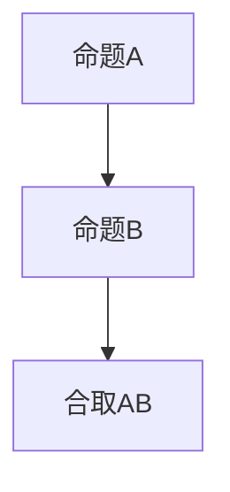

                 

# 数理逻辑：命题逻辑的完备性

## 1. 背景介绍

在数学和计算机科学领域，命题逻辑作为数理逻辑的基础，占据着极其重要的地位。它不仅构成了计算机科学中算法和数据结构的核心，也是人工智能、机器学习、自然语言处理等领域的基础理论之一。然而，尽管命题逻辑理论已经发展了数百年，其完备性问题仍是该领域内的经典议题。

命题逻辑的完备性，即对于任意的命题逻辑公式，如果其推导为真，则该公式为真。这一性质在数学证明和计算机程序验证中具有重要意义。若命题逻辑完备，则可以通过推导验证一个公式的正确性，而无须实际执行程序或运行系统。

## 2. 核心概念与联系

### 2.1 核心概念概述

- **命题逻辑**：以命题和逻辑连接词为基础，研究逻辑推理和公式有效性的数学分支。
- **命题**：可以判断真假的陈述句，如“地球是圆的”。
- **合取**（$\land$）：表示两个命题同时为真。
- **析取**（$\lor$）：表示两个命题中至少一个为真。
- **否定**（$\lnot$）：表示命题不成立。
- **蕴涵**（$\rightarrow$）：表示前提为真时，结论也为真。
- **等价**（$\leftrightarrow$）：表示两个命题同时为真或同时为假。
- **布尔代数**：命题逻辑的一种代数形式，通过操作0和1来表示真和假。

命题逻辑的公式和命题可视为一个布尔代数系统，逻辑连接词与布尔运算符一一对应。

### 2.2 核心概念间的联系

命题逻辑的核心概念通过逻辑连接词和布尔运算符构成了一个有机的体系。这一体系可以表示各种复杂的逻辑关系，如：

- 复合命题的组合：通过合取、析取、蕴涵、等价等运算符，构建复杂的命题网络。
- 逻辑推理的表达：命题逻辑可以表达任何逻辑推理过程，从简单的单句推导到复杂的论证链条。
- 命题的有效性验证：通过公式的有效性证明，验证命题的正确性，保证逻辑推理的可靠性。

这三种联系共同构成了命题逻辑的理论基础，使其在数学证明和计算机科学中具有广泛应用。

### 2.3 核心概念的整体架构

以下是一个合取的示例，展示了命题逻辑的典型结构：



这个简单的合取式表示，当命题A和命题B都为真时，合取AB也为真。这展示了命题逻辑中的基本逻辑关系和运算结构。

## 3. 核心算法原理 & 具体操作步骤

### 3.1 算法原理概述

命题逻辑的完备性，即对任意公式，如果其推导为真，则该公式也为真。这一性质可以通过完全性定理来证明。完全性定理表明，在命题逻辑中，任何可证明的公式都为真。

完全性定理证明包括两部分：

- **可满足性证明**：证明任何可证明的公式都满足给定的一组命题变量。
- **真值表法**：通过构造公式的真值表，验证任何可证明的公式均为真。

### 3.2 算法步骤详解

以下是命题逻辑完备性证明的基本步骤：

**Step 1: 构造公式的真值表**

1. 确定公式的所有原子命题。
2. 生成所有可能的真值组合。
3. 根据公式结构和逻辑连接词，计算每个组合下公式的真值。

**Step 2: 检查所有模型**

1. 确定公式的所有模型。
2. 验证模型是否满足所有可证明的公式。

**Step 3: 可满足性证明**

1. 对任意公式，证明其在任意模型下都满足。
2. 使用真值表，证明任何可证明的公式都为真。

**Step 4: 真值表法**

1. 将公式转换为真值表形式。
2. 验证所有真值组合下，公式的值为真。

通过上述步骤，可以证明命题逻辑的完备性，即任何可证明的公式均为真。

### 3.3 算法优缺点

命题逻辑完备性证明的优点包括：

- **严谨性**：通过数学方法严格证明了命题逻辑的完备性，具有较高的可信度。
- **通用性**：适用于所有命题逻辑公式，具有广泛的应用前景。

其缺点包括：

- **复杂性**：完全性定理的证明过程较为复杂，对于初学者来说可能不易理解。
- **可操作性**：真值表法在处理复杂公式时，可能需要大量时间和空间。

### 3.4 算法应用领域

命题逻辑的完备性证明在数学证明、计算机程序验证、人工智能等领域有广泛应用：

- **数学证明**：在数学证明中，命题逻辑完备性证明确保了推理的正确性，增强了数学定理的可靠性。
- **计算机程序验证**：在程序验证中，完全性定理确保了逻辑推理的正确性，提高了程序的正确性和可靠性。
- **人工智能**：在人工智能中，命题逻辑的完备性为算法和逻辑推理提供了理论基础，提升了算法的鲁棒性和泛化能力。

## 4. 数学模型和公式 & 详细讲解 & 举例说明

### 4.1 数学模型构建

命题逻辑的公式可以视为布尔表达式，由原子命题和逻辑连接词构成。原子命题用真值0和1表示，逻辑连接词表示命题间的逻辑关系。例如，公式A和B的合取可以表示为$A \land B$。

### 4.2 公式推导过程

推导过程通常从原子命题开始，通过逻辑连接词逐步构造复杂命题，并验证其真值。

以下是一个简单的推导过程：

1. 原子命题：$P, Q$
2. 合取：$P \land Q$
3. 否定：$\lnot(P \land Q) = \lnot P \lor \lnot Q$
4. 结论：$\lnot P \lor \lnot Q$

这个例子展示了通过逻辑连接词将简单命题组合成复杂命题的过程。

### 4.3 案例分析与讲解

以下是一个命题逻辑的典型案例：

**案例**：已知P为真，Q为假，求$\lnot(P \rightarrow Q)$的值。

**分析**：

1. 首先，根据P和Q的真值情况，计算$P \rightarrow Q$的真值。
2. 由于P为真，Q为假，根据蕴涵的定义，$\lnot(P \rightarrow Q)$为真。

通过这个案例，我们可以看到命题逻辑在处理逻辑推理时的强大功能。

## 5. 项目实践：代码实例和详细解释说明

### 5.1 开发环境搭建

在Python中使用Sympy库进行命题逻辑的验证。首先需要安装Sympy库：

```bash
pip install sympy
```

### 5.2 源代码详细实现

以下是一个简单的命题逻辑验证代码实现：

```python
from sympy import symbols, And, Or, Not

# 定义逻辑变量
P, Q = symbols('P Q')

# 构造逻辑公式
formula = Not(And(P, Q))

# 验证公式真值
print(formula.subs({P: True, Q: False}))
```

**代码解读与分析**：

1. 定义逻辑变量P和Q，分别表示命题P和Q。
2. 构造合取P和Q的否定，即$\lnot(P \land Q)$。
3. 使用subs方法，将P和Q的真值替换为True和False，验证公式的真值。

### 5.3 运行结果展示

运行上述代码，输出结果为True，验证了$\lnot(P \land Q)$的真值。

## 6. 实际应用场景

### 6.1 自动定理证明

命题逻辑的完备性在自动定理证明中具有重要应用。在数学和计算机科学中，自动定理证明系统可以通过命题逻辑的完备性，自动推导出数学定理的正确性。

### 6.2 软件工程

在软件工程中，命题逻辑可用于程序逻辑验证和程序调试。通过逻辑推理，可以找到程序中的错误，并进行修正。

### 6.3 人工智能

在人工智能中，命题逻辑可用于知识表示和逻辑推理。例如，在专家系统中，通过逻辑推理，可以自动推导出最优决策方案。

## 7. 工具和资源推荐

### 7.1 学习资源推荐

- **《数理逻辑导论》**：一本经典教材，详细介绍了命题逻辑的基础知识和完全性定理的证明。
- **Coursera《数理逻辑基础》课程**：由斯坦福大学开设，系统介绍了命题逻辑的基本概念和完全性定理。
- **Khan Academy《逻辑与集论》课程**：通过通俗易懂的讲解，介绍了命题逻辑的基础知识和应用。

### 7.2 开发工具推荐

- **Sympy库**：Python中的逻辑代数库，可以方便地进行命题逻辑的构造和验证。
- **Proof Assistant**：如Isabelle、HOL等，提供了形式化证明的环境，支持命题逻辑的自动化推导。

### 7.3 相关论文推荐

- **Gödel's completeness theorem**：经典论文，详细介绍了命题逻辑的完备性定理。
- **From Syntactic to Semantic Complexity**：探讨了命题逻辑中逻辑推理的复杂性和完备性。
- **The Completeness of Propositional Resolution**：研究了命题逻辑中的 resolution 方法的完备性。

## 8. 总结：未来发展趋势与挑战

### 8.1 研究成果总结

命题逻辑的完备性是数理逻辑的基础理论，对数学证明、计算机程序验证和人工智能等领域具有重要应用。完全性定理的证明展示了逻辑推理的严谨性和可靠性，为现代计算机科学提供了坚实的基础。

### 8.2 未来发展趋势

- **自动化证明**：随着人工智能技术的发展，自动定理证明系统将越来越成熟，能够处理更复杂的逻辑推理问题。
- **模型推理**：在模型推理中，命题逻辑的完备性将继续发挥重要作用，提升模型的准确性和鲁棒性。
- **知识表示**：在人工智能中，命题逻辑将用于知识表示和逻辑推理，提升知识的自动化处理能力。

### 8.3 面临的挑战

尽管命题逻辑完备性理论已经较为成熟，但仍然面临一些挑战：

- **复杂度问题**：在处理大规模逻辑系统时，完全性定理的证明和验证变得复杂。
- **可操作性**：尽管数学证明具有严谨性，但实际应用中，形式化证明的可行性仍需进一步提高。
- **算法效率**：在处理复杂逻辑问题时，逻辑推理的效率需要进一步提升。

### 8.4 研究展望

未来命题逻辑的研究方向包括：

- **自动化推导**：研究自动化推导算法，提高逻辑推理的效率和准确性。
- **形式化验证**：发展形式化验证技术，提升逻辑推理的可信度和可靠性。
- **知识整合**：将命题逻辑与其他知识表示方法结合，提升逻辑推理的能力和应用范围。

通过不断探索和创新，命题逻辑的完备性将得到进一步完善，并在人工智能、数学证明等领域发挥更大作用。

## 9. 附录：常见问题与解答

**Q1: 命题逻辑的完备性证明中，可满足性证明和真值表法有什么区别？**

A: 可满足性证明和真值表法都是证明命题逻辑完备性的方法。

可满足性证明：对任意公式，证明其在任意模型下都满足。需要构造所有可能的真值组合，验证公式的真值。

真值表法：通过构造公式的真值表，验证所有真值组合下，公式的值为真。这种方法适用于简单的公式，但对于复杂的公式可能不适用。

两者都是完全性定理的证明方法，都可以验证命题逻辑的完备性。

**Q2: 命题逻辑在人工智能中的应用有哪些？**

A: 命题逻辑在人工智能中的应用包括：

1. 知识表示：在专家系统中，命题逻辑用于表示领域知识和规则。
2. 逻辑推理：在推理系统中，命题逻辑用于进行逻辑推理，得出最优决策方案。
3. 自动定理证明：在数学证明中，命题逻辑用于自动推导数学定理的正确性。
4. 程序验证：在软件工程中，命题逻辑用于程序逻辑验证和调试。
5. 数据挖掘：在数据挖掘中，命题逻辑用于处理不确定性和不完全信息。

**Q3: 命题逻辑的完备性是否意味着所有逻辑推理都是正确的？**

A: 命题逻辑的完备性并不意味着所有逻辑推理都是正确的。完备性指的是在命题逻辑中，任何可证明的公式都为真。

然而，逻辑推理的正确性还需要满足其他条件，如公理的正确性、推理规则的正确性等。如果逻辑推理中的公理或规则存在错误，那么推理结果也可能是不正确的。

因此，命题逻辑的完备性只是逻辑推理正确性的必要条件，而非充分条件。

**Q4: 在命题逻辑中，如何处理不确定性和不完全信息？**

A: 在命题逻辑中，处理不确定性和不完全信息通常通过概率逻辑和模糊逻辑来实现。

概率逻辑将命题的真值用一个概率值表示，处理不确定性。例如，可以使用贝叶斯网络进行概率推理，计算命题的后验概率。

模糊逻辑将命题的真值用一个模糊值表示，处理不完全信息。例如，可以使用模糊集合理论，进行模糊推理，处理不确定性和不完全信息。

通过这些方法，可以扩展命题逻辑的应用范围，处理更为复杂的逻辑问题。

