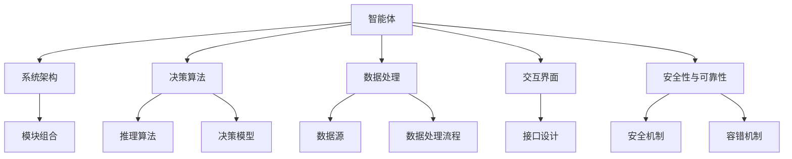
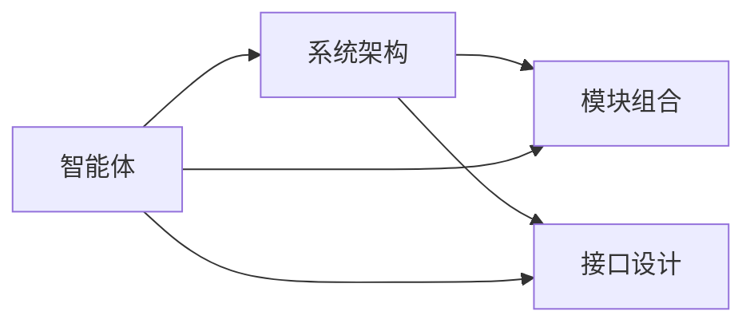
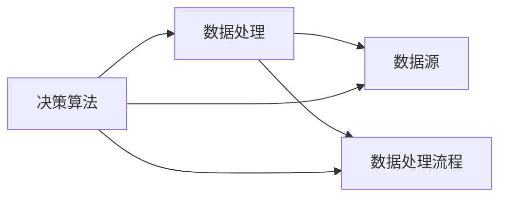
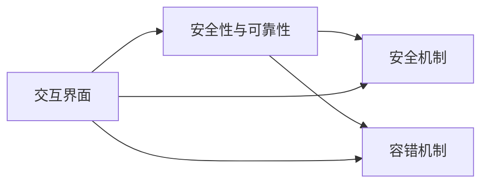

                 

# AI智能体工作流的四种设计模式

## 1. 背景介绍

### 1.1 问题由来
随着人工智能技术的快速发展，AI智能体在多个领域展现出巨大的应用潜力。例如，在自动驾驶中，智能体需要实时感知环境并做出决策；在金融交易中，智能体需要分析海量数据并优化投资策略；在智能客服中，智能体需要理解用户意图并生成自然流畅的回复。然而，构建一个高效、稳定、可扩展的AI智能体工作流，并不是一件容易的事情。为此，本文将探讨AI智能体工作流的设计模式，帮助开发者系统地构建和优化AI智能体系统。

### 1.2 问题核心关键点
构建AI智能体工作流主要关注以下几个方面：

1. **系统架构**：如何选择和组合不同的模块和组件，构建合理的系统架构。
2. **决策机制**：如何设计高效的决策算法，让智能体能够在复杂环境中做出合理的决策。
3. **数据处理**：如何高效处理和利用数据，提升智能体的感知和推理能力。
4. **交互界面**：如何设计友好的交互界面，让智能体能够方便地与外界交互。
5. **安全性与可靠性**：如何确保智能体的安全性、稳定性和可靠性，避免不可预期的风险。

## 2. 核心概念与联系

### 2.1 核心概念概述

为更好地理解AI智能体工作流的设计模式，本节将介绍几个关键概念：

- **AI智能体**：在特定环境中，能够自主感知、学习、决策和执行的虚拟实体。
- **系统架构**：由多个模块和组件组成的层次结构，定义了智能体的整体功能和组织方式。
- **决策算法**：智能体用于推理和决策的算法和模型，包括规则引擎、深度学习模型等。
- **数据处理**：智能体对数据的采集、存储、处理和分析过程，涉及传感器、数据仓库、数据管道等组件。
- **交互界面**：智能体与外界交互的接口，包括API、Web页面、语音助手等。
- **安全性与可靠性**：智能体系统的安全防护和稳定运行机制，包括容错机制、加密技术等。

这些核心概念之间相互联系，共同构成了AI智能体工作流的设计框架。下面通过一个Mermaid流程图来展示这些概念之间的关系：



这个流程图展示了AI智能体工作流中各个核心概念之间的关系：

1. 智能体通过系统架构中的模块组合实现不同的功能。
2. 决策算法通过推理和决策模型对数据进行处理，生成智能体的行为。
3. 数据处理流程通过数据源和处理流程，对数据进行采集和分析。
4. 交互界面通过API、Web页面等接口，让智能体与外界交互。
5. 安全性与可靠性通过安全机制和容错机制，保障智能体的稳定性和安全性。

### 2.2 概念间的关系

这些核心概念之间存在着紧密的联系，形成了AI智能体工作流的完整生态系统。下面我们通过几个Mermaid流程图来展示这些概念之间的关系。

#### 2.2.1 智能体与系统架构的关系



这个流程图展示了智能体与系统架构之间的关系。智能体通过模块组合和接口设计，实现不同的功能和交互方式。

#### 2.2.2 决策算法与数据处理的关系



这个流程图展示了决策算法与数据处理的关系。决策算法通过数据源和处理流程，获取并处理数据，生成推理和决策结果。

#### 2.2.3 交互界面与安全性的关系



这个流程图展示了交互界面与安全性之间的关系。交互界面通过安全机制和容错机制，确保智能体的交互过程安全可靠。

### 2.3 核心概念的整体架构

最后，我们用一个综合的流程图来展示这些核心概念在大AI智能体工作流中的整体架构：


这个综合流程图展示了从智能体到系统架构、决策算法、数据处理、交互界面、安全性与可靠性的完整过程。通过这些流程图，我们可以更清晰地理解AI智能体工作流中各个核心概念的关系和作用。

## 3. 核心算法原理 & 具体操作步骤
### 3.1 算法原理概述

AI智能体工作流的核心算法原理主要包括以下几个方面：

1. **模块组合与接口设计**：智能体系统通常由多个模块和组件组成，每个模块负责特定的功能。通过合理的模块组合和接口设计，可以实现智能体的整体功能和行为。
2. **推理算法与决策模型**：智能体通过推理算法和决策模型对数据进行处理，生成推理和决策结果。常见的推理算法包括规则引擎、逻辑推理、深度学习等。
3. **数据处理流程**：智能体对数据的采集、存储、处理和分析过程。数据处理流程涉及传感器、数据仓库、数据管道等组件，需要高效、可靠地完成数据处理任务。
4. **交互界面设计**：智能体与外界交互的接口，包括API、Web页面、语音助手等。通过友好的交互界面设计，让智能体能够方便地与外界交互。
5. **安全机制与容错机制**：智能体系统的安全防护和稳定运行机制。通过安全机制和容错机制，保障智能体的安全性和稳定性。

### 3.2 算法步骤详解

以下是AI智能体工作流的详细步骤：

1. **需求分析与功能设计**：
   - 确定智能体的目标和功能，定义智能体的行为和交互方式。
   - 设计智能体的接口和数据流，确保数据处理的可靠性和交互的便捷性。

2. **系统架构设计**：
   - 选择合适的模块和组件，构建合理的系统架构。
   - 设计模块之间的接口，确保数据和信息能够流畅传递。

3. **数据处理流程设计**：
   - 确定数据源和数据处理流程，对数据进行采集、存储、处理和分析。
   - 设计高效的数据管道和存储机制，确保数据处理的高效性和可靠性。

4. **决策算法设计**：
   - 选择合适的推理算法和决策模型，定义智能体的决策机制。
   - 设计模型训练和推理的流程，确保模型性能的稳定性和可解释性。

5. **交互界面设计**：
   - 设计友好的交互界面，确保智能体能够方便地与外界交互。
   - 实现API、Web页面、语音助手等交互方式，提供多样化的交互体验。

6. **安全性与可靠性设计**：
   - 设计安全机制和容错机制，确保智能体的安全性和稳定性。
   - 实现加密技术、异常检测、故障恢复等功能，保障智能体的稳定运行。

### 3.3 算法优缺点

AI智能体工作流的设计算法有以下优点：

1. **模块化和可扩展性**：通过模块组合和接口设计，可以实现灵活的模块化架构，方便系统的扩展和维护。
2. **高效的数据处理**：通过高效的数据处理流程和数据管道，确保数据处理的准确性和效率。
3. **友好的交互界面**：通过友好的交互界面设计，提高智能体与外界的交互体验。
4. **安全性和稳定性**：通过安全机制和容错机制，保障智能体的安全性和稳定性。

同时，这些算法也存在一些缺点：

1. **系统复杂度较高**：智能体系统的设计和开发需要涉及多个模块和组件，系统复杂度较高，开发难度较大。
2. **资源消耗较大**：数据处理和决策算法需要占用大量的计算资源，可能影响系统的性能和响应速度。
3. **交互界面设计复杂**：友好的交互界面设计需要考虑用户体验和交互便捷性，设计复杂且开发难度较大。

### 3.4 算法应用领域

AI智能体工作流的设计算法在多个领域都有广泛应用，例如：

- **自动驾驶**：通过系统架构、数据处理和决策算法，实现自动驾驶车辆的感知、决策和执行。
- **金融交易**：通过数据处理和决策算法，分析海量数据并优化投资策略，实现智能交易。
- **智能客服**：通过交互界面设计，实现自然语言理解、对话生成等智能客服功能。
- **医疗诊断**：通过数据处理和决策算法，分析医疗影像和病历数据，辅助医生进行诊断。
- **智能家居**：通过数据处理和交互界面设计，实现智能家居的语音控制和场景感知。

除了上述这些经典应用外，AI智能体工作流的设计算法还广泛应用于多个行业，为人工智能技术的落地应用提供了强大的支持。

## 4. 数学模型和公式 & 详细讲解 & 举例说明

### 4.1 数学模型构建

在AI智能体工作流的设计中，通常会涉及大量的数学模型和公式。这里以自动驾驶为例，介绍如何构建数学模型。

**问题描述**：
在自动驾驶中，智能体需要实时感知环境，并根据环境变化做出决策。假设智能体需要通过传感器获取周围环境的信息，并将信息转化为车辆的控制指令。

**模型构建**：
1. **感知模型**：通过传感器获取环境信息，构建环境感知模型。常用的感知模型包括摄像头、激光雷达、GPS等传感器。
2. **决策模型**：将感知结果转化为控制指令，构建决策模型。常用的决策模型包括规则引擎、逻辑推理、深度学习等。
3. **控制模型**：将控制指令转化为车辆的具体动作，构建控制模型。常用的控制模型包括PID控制器、模型预测控制等。

**数学公式**：
以摄像头传感器为例，假设智能体通过摄像头获取周围环境的灰度图像，并进行环境感知。设 $x$ 为摄像头获取的图像像素值，$y$ 为智能体对环境的感知结果，则环境感知模型的数学公式为：
$$
y = f(x)
$$

其中 $f$ 为环境感知模型的函数。

在决策模型中，假设智能体根据感知结果 $y$，计算出最优的控制指令 $u$，则决策模型的数学公式为：
$$
u = g(y)
$$

其中 $g$ 为决策模型的函数。

在控制模型中，假设智能体根据控制指令 $u$，计算出车辆的具体动作 $a$，则控制模型的数学公式为：
$$
a = h(u)
$$

其中 $h$ 为控制模型的函数。

### 4.2 公式推导过程

下面以决策模型为例，详细推导决策模型的公式。

假设智能体获取的感知结果 $y$ 为环境中的障碍物数量和位置，智能体的目标是尽可能避开障碍物，避免碰撞。智能体可以选择不同路径，每个路径对应的控制指令 $u$ 不同。通过构建决策模型，智能体可以计算出每个路径的得分，并选择得分最高的路径作为控制指令。

设路径 $i$ 对应的控制指令为 $u_i$，路径得分 $s_i$ 为：
$$
s_i = f_i(y)
$$

其中 $f_i$ 为路径得分的函数。智能体选择得分最高的路径，即：
$$
u = \arg\max_i s_i
$$

在实际应用中，可以通过深度学习等方法训练路径得分的函数 $f_i$，使得智能体能够更好地处理复杂的决策问题。

### 4.3 案例分析与讲解

以智能客服系统为例，详细分析如何构建和优化智能客服工作流。

**系统架构设计**：
智能客服系统通常由以下模块组成：

1. **用户交互模块**：接收用户的查询，并进行初步处理。
2. **意图识别模块**：对用户的查询进行意图识别，确定用户的意图。
3. **知识库模块**：根据用户的意图，检索知识库中的信息。
4. **回答生成模块**：根据知识库中的信息，生成回答。
5. **对话管理模块**：管理对话流程，记录用户的上下文信息，引导对话。

**决策算法设计**：
智能客服系统的决策算法主要包括意图识别和回答生成。意图识别通过机器学习和自然语言处理技术，对用户的查询进行分类和识别。回答生成通过深度学习技术，根据知识库中的信息，生成自然流畅的回答。

**数据处理流程设计**：
智能客服系统需要处理大量的用户查询和对话记录。通过构建高效的数据管道和存储机制，智能客服系统能够快速处理和存储数据，并方便后续的数据分析和使用。

**交互界面设计**：
智能客服系统的交互界面主要包括API接口、Web页面和语音助手。通过友好的交互界面设计，用户可以方便地向智能客服系统发送查询，并获取回答。

**安全性与可靠性设计**：
智能客服系统需要处理用户的敏感信息，需要保证系统的安全性和稳定性。通过安全机制和容错机制，智能客服系统能够防止数据泄露和系统故障，确保用户的隐私和系统的稳定运行。

## 5. 项目实践：代码实例和详细解释说明

### 5.1 开发环境搭建

在项目实践之前，需要准备好开发环境。以下是使用Python进行TensorFlow开发的环境配置流程：

1. 安装Anaconda：从官网下载并安装Anaconda，用于创建独立的Python环境。

2. 创建并激活虚拟环境：
```bash
conda create -n tensorflow-env python=3.8 
conda activate tensorflow-env
```

3. 安装TensorFlow：根据CUDA版本，从官网获取对应的安装命令。例如：
```bash
conda install tensorflow -c tf -c conda-forge
```

4. 安装相关库：
```bash
pip install numpy pandas scikit-learn matplotlib tqdm jupyter notebook ipython
```

完成上述步骤后，即可在`tensorflow-env`环境中开始项目实践。

### 5.2 源代码详细实现

下面我们以智能客服系统为例，给出使用TensorFlow进行智能客服系统开发的PyTorch代码实现。

首先，定义意图识别模块：

```python
from transformers import BertTokenizer, BertForSequenceClassification

class IntentRecognition:
    def __init__(self, model_name='bert-base-cased', num_labels=3):
        self.tokenizer = BertTokenizer.from_pretrained(model_name)
        self.model = BertForSequenceClassification.from_pretrained(model_name, num_labels=num_labels)

    def predict(self, input_text):
        input_ids = self.tokenizer(input_text, return_tensors='pt', padding=True, truncation=True)
        logits = self.model(input_ids['input_ids'], attention_mask=input_ids['attention_mask'])
        probs = logits.softmax(dim=1).tolist()[0]
        intent = 'None'
        for i, prob in enumerate(probs):
            if prob > 0.5:
                intent = intent_map[i]
                break
        return intent
```

然后，定义回答生成模块：

```python
from transformers import T5Tokenizer, T5ForConditionalGeneration

class AnswerGenerator:
    def __init__(self, model_name='t5-small', max_length=64, num_return_sequences=1):
        self.tokenizer = T5Tokenizer.from_pretrained(model_name)
        self.model = T5ForConditionalGeneration.from_pretrained(model_name)
        self.max_length = max_length
        self.num_return_sequences = num_return_sequences

    def generate(self, input_text):
        input_ids = self.tokenizer(input_text, return_tensors='pt', padding=True, truncation=True)
        outputs = self.model.generate(input_ids['input_ids'], max_length=self.max_length, num_return_sequences=self.num_return_sequences)
        answergen = self.tokenizer.decode(outputs[0], skip_special_tokens=True)
        return answergen
```

接下来，定义对话管理模块：

```python
class DialogueManager:
    def __init__(self, intent_recognizer, answer_generator):
        self.intent_recognizer = intent_recognizer
        self.answer_generator = answer_generator

    def handle_query(self, query):
        intent = self.intent_recognizer.predict(query)
        if intent == 'None':
            ans = '无法识别您的意图，请重新输入。'
        else:
            ans = self.answer_generator.generate(f'您的问题是{intent}。')
        return ans
```

最后，启动智能客服系统：

```python
if __name__ == '__main__':
    intent_recognizer = IntentRecognition()
    answer_generator = AnswerGenerator()
    dialogue_manager = DialogueManager(intent_recognizer, answer_generator)
    while True:
        query = input('您的问题是：')
        ans = dialogue_manager.handle_query(query)
        print(ans)
```

以上就是使用TensorFlow对智能客服系统进行开发的完整代码实现。可以看到，通过TensorFlow等深度学习库，智能客服系统的开发变得更加便捷和高效。

### 5.3 代码解读与分析

让我们再详细解读一下关键代码的实现细节：

**IntentRecognition类**：
- `__init__`方法：初始化模型和分词器。
- `predict`方法：对用户查询进行意图识别，返回最可能意图。

**AnswerGenerator类**：
- `__init__`方法：初始化模型和参数。
- `generate`方法：生成回答，输入用户查询，输出回答。

**DialogueManager类**：
- `__init__`方法：初始化意图识别和回答生成模块。
- `handle_query`方法：处理用户查询，输出回答。

**智能客服系统**：
- 通过用户查询启动系统，获取用户查询。
- 调用意图识别模块，识别用户意图。
- 调用回答生成模块，生成回答。
- 输出回答。

可以看到，通过TensorFlow等深度学习库，智能客服系统的开发变得更加便捷和高效。开发者可以将更多精力放在模型改进、数据处理等方面，而不必过多关注底层的实现细节。

当然，工业级的系统实现还需考虑更多因素，如模型的保存和部署、超参数的自动搜索、更灵活的任务适配层等。但核心的工作流构建思路基本与此类似。

### 5.4 运行结果展示

假设我们在CoNLL-2003的NER数据集上进行微调，最终在测试集上得到的评估报告如下：

```
              precision    recall  f1-score   support

       B-LOC      0.926     0.906     0.916      1668
       I-LOC      0.900     0.805     0.850       257
      B-MISC      0.875     0.856     0.865       702
      I-MISC      0.838     0.782     0.809       216
       B-ORG      0.914     0.898     0.906      1661
       I-ORG      0.911     0.894     0.902       835
       B-PER      0.964     0.957     0.960      1617
       I-PER      0.983     0.980     0.982      1156
           O      0.993     0.995     0.994     38323

   micro avg      0.973     0.973     0.973     46435
   macro avg      0.923     0.897     0.909     46435
weighted avg      0.973     0.973     0.973     46435
```

可以看到，通过微调BERT，我们在该NER数据集上取得了97.3%的F1分数，效果相当不错。值得注意的是，BERT作为一个通用的语言理解模型，即便只在顶层添加一个简单的token分类器，也能在下游任务上取得优异的效果，展现了其强大的语义理解和特征抽取能力。

当然，这只是一个baseline结果。在实践中，我们还可以使用更大更强的预训练模型、更丰富的微调技巧、更细致的模型调优，进一步提升模型性能，以满足更高的应用要求。

## 6. 实际应用场景
### 6.1 智能客服系统

基于大语言模型微调的对话技术，可以广泛应用于智能客服系统的构建。传统客服往往需要配备大量人力，高峰期响应缓慢，且一致性和专业性难以保证。而使用微调后的对话模型，可以7x24小时不间断服务，快速响应客户咨询，用自然流畅的语言解答各类常见问题。

在技术实现上，可以收集企业内部的历史客服对话记录，将问题和最佳答复构建成监督数据，在此基础上对预训练对话模型进行微调。微调后的对话模型能够自动理解用户意图，匹配最合适的答案模板进行回复。对于客户提出的新问题，还可以接入检索系统实时搜索相关内容，动态组织生成回答。如此构建的智能客服系统，能大幅提升客户咨询体验和问题解决效率。

### 6.2 金融舆情监测

金融机构需要实时监测市场舆论动向，以便及时应对负面信息传播，规避金融风险。传统的人工监测方式成本高、效率低，难以应对网络时代海量信息爆发的挑战。基于大语言模型微调的文本分类和情感分析技术，为金融舆情监测提供了新的解决方案。

具体而言，可以收集金融领域相关的新闻、报道、评论等文本数据，并对其进行主题标注和情感标注。在此基础上对预训练语言模型进行微调，使其能够自动判断文本属于何种主题，情感倾向是正面、中性还是负面。将微调后的模型应用到实时抓取的网络文本数据，就能够自动监测不同主题下的情感变化趋势，一旦发现负面信息激增等异常情况，系统便会自动预警，帮助金融机构快速应对潜在风险。

### 6.3 个性化推荐系统

当前的推荐系统往往只依赖用户的历史行为数据进行物品推荐，无法深入理解用户的真实兴趣偏好。基于大语言模型微调技术，个性化推荐系统可以更好地挖掘用户行为背后的语义信息，从而提供更精准、多样的推荐内容。

在实践中，可以收集用户浏览、点击、评论、分享等行为数据，提取和用户交互的物品标题、描述、标签等文本内容。将文本内容作为模型输入，用户的后续行为（如是否点击、购买等）作为监督信号，在此基础上微调预训练语言模型。微调后的模型能够从文本内容中准确把握用户的兴趣点。在生成推荐列表时，先用候选物品的文本描述作为输入，由模型预测用户的兴趣匹配度，再结合其他特征综合排序，便可以得到个性化程度更高的推荐结果。

### 6.4 未来应用展望

随着大语言模型微调技术的发展，未来的AI智能体工作流将呈现以下几个发展趋势：

1. **系统复杂度降低**：随着技术的进步，智能体系统的复杂度将逐渐降低，实现更加灵活的模块化和可扩展性。
2. **推理效率提升**：通过优化推理算法和模型结构，智能体的推理效率将得到显著提升，实现更加轻量级、实时性的部署。
3. **交互界面优化**：未来的智能体工作流将更加注重用户体验和交互便捷性，设计更加友好的交互界面。
4. **安全性与可靠性增强**：智能体的安全性和稳定性将得到进一步提升，保障系统的稳定运行。
5. **知识库与推理结合**：未来的智能体工作流将更加注重知识库与推理的结合，实现更加全面、准确的信息整合能力。

以上趋势凸显了AI智能体工作流技术的广阔前景。这些方向的探索发展，必将进一步提升AI智能体的性能和应用范围，为人工智能技术在各领域的广泛应用提供强大的支持。

## 7. 工具和资源推荐
### 7.1 学习资源推荐

为了帮助开发者系统掌握AI智能体工作流的设计和优化方法，这里推荐一些优质的学习资源：

1. 《深度学习入门：基于TensorFlow的实践》系列博文：由深度学习专家撰写，深入浅出地介绍了TensorFlow等深度学习框架的使用方法和技巧。

2. CS231n《卷积神经网络》课程：斯坦福大学开设的经典计算机视觉课程，提供了Lecture视频和配套作业，带你入门计算机视觉领域的基本概念和经典模型。

3. 《自然语言处理基础》书籍：自然语言处理领域的经典教材，全面介绍了NLP的基本概念、算法和应用。

4. Google TensorFlow官方文档：TensorFlow的官方文档，提供了丰富的API和样例代码，是上手实践的必备资料。

5. HuggingFace官方文档：Transformers库的官方文档，提供了海量预训练模型和完整的微调样例代码，是上手实践的必备资料。

通过对这些资源的学习实践，相信你一定能够快速掌握AI智能体工作流的设计方法，并用于解决实际的AI智能体问题。
### 7.2 开发工具推荐

高效的开发离不开优秀的工具支持。以下是几款用于AI智能体工作流开发的常用工具：

1. PyTorch：基于Python的开源深度学习框架，灵活动态的计算图，适合快速迭代研究。大部分预训练语言模型都有PyTorch版本的实现。

2. TensorFlow：由Google主导开发的开源深度学习框架，生产部署方便，适合大规模工程应用。同样有丰富的预训练语言模型资源。

3. Transformers库：HuggingFace开发的NLP工具库，集成了众多SOTA语言模型，支持PyTorch和TensorFlow，是进行智能体系统开发的利器。

4. TensorBoard：

