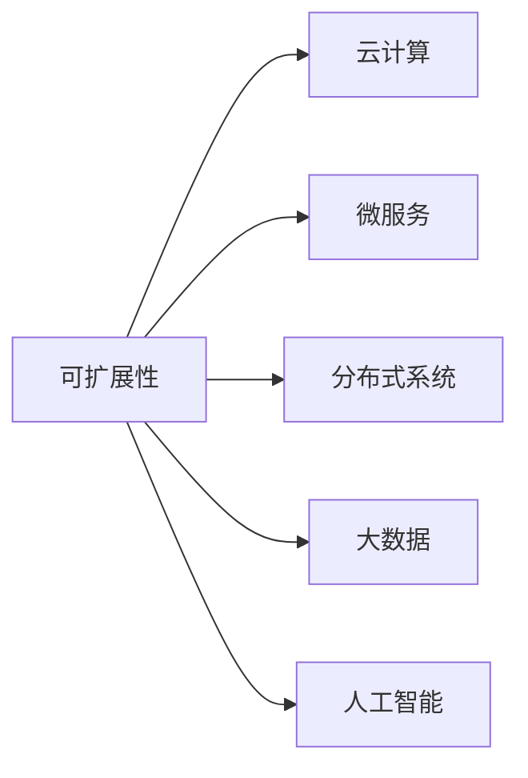
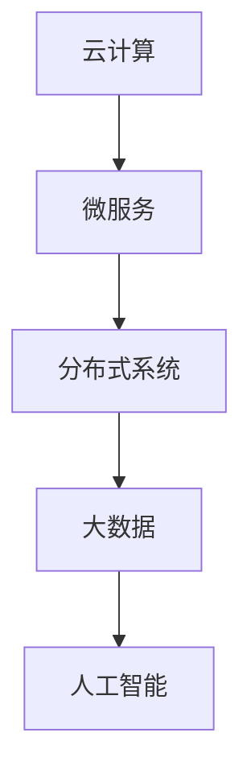
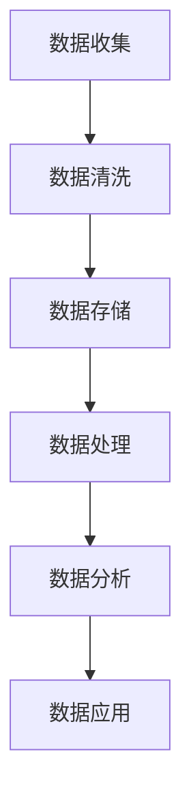
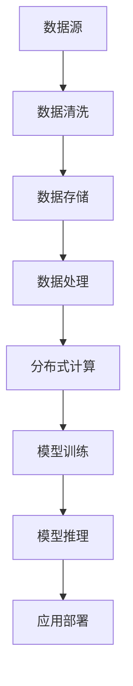

                 

# AI系统的可扩展性设计与实现

> 关键词：可扩展性,软件架构,云计算,微服务,分布式系统,大数据,人工智能

## 1. 背景介绍

### 1.1 问题由来

在当今这个快速变化的数字化时代，企业面临着来自市场、技术以及客户需求的多方面挑战。为了保持竞争优势，企业需要在不断变化的环境中迅速响应，实现业务的快速迭代和创新。然而，传统的单体应用架构和技术栈已经无法满足这些需求，这迫使企业寻求新的解决方案来应对这些挑战。

### 1.2 问题核心关键点

实现AI系统的可扩展性（Scalability），就是在不牺牲系统性能和稳定性的前提下，能够灵活应对各种需求变化，包括用户量激增、数据量爆炸以及算力提升等。这需要企业具备强大的技术储备和灵活的架构设计能力。

### 1.3 问题研究意义

研究和实施AI系统的可扩展性设计，对于提升企业IT系统的灵活性和适应性，优化资源利用，降低运维成本，提高创新速度和用户体验，具有重要的战略意义。

## 2. 核心概念与联系

### 2.1 核心概念概述

为了更好地理解AI系统的可扩展性设计与实现，本节将介绍几个关键概念：

- **可扩展性（Scalability）**：指系统在处理能力、数据量、用户量等方面，能够根据需求动态扩展的能力。
- **云计算（Cloud Computing）**：通过互联网提供按需计算资源，支持弹性扩展和成本优化。
- **微服务（Microservices）**：将复杂的应用拆分成一系列小服务，每个服务独立部署、扩展和管理，支持快速迭代和灵活扩展。
- **分布式系统（Distributed System）**：由多台计算机协同工作，实现高可用性、高吞吐量和低延迟的系统。
- **大数据（Big Data）**：指数据量巨大、类型多样的数据集，需要高效存储、处理和分析。
- **人工智能（AI）**：利用算法和模型，使计算机具备智能学习、推理和决策的能力。

这些核心概念之间的逻辑关系可以通过以下Mermaid流程图来展示：



这个流程图展示了可扩展性技术与其他核心概念的关系：

- 可扩展性技术依赖于云计算的支持，以便快速分配和释放计算资源。
- 微服务架构是实现可扩展性的关键手段，通过拆分服务实现独立部署和扩展。
- 分布式系统提供系统的高可用性和高吞吐量，是实现大规模数据处理的基础。
- 大数据技术支持海量数据的存储和分析，是实现AI算法训练和应用的基础。
- 人工智能技术依赖可扩展性和分布式系统的支持，实现高效的模型训练和推理。

### 2.2 概念间的关系

这些核心概念之间存在着紧密的联系，构成了AI系统可扩展性的整体框架。下面通过几个Mermaid流程图来展示这些概念之间的关系。

#### 2.2.1 可扩展性架构



这个流程图展示了可扩展性架构的基本构成：

- 云计算提供弹性的计算资源支持，微服务架构通过拆分服务实现独立扩展。
- 分布式系统支持大规模数据处理，大数据技术实现高效的数据存储和分析。
- 人工智能算法依赖数据和计算资源，实现高效的模型训练和推理。

#### 2.2.2 分布式训练


这个流程图展示了分布式训练的基本流程：

- 数据分布式存储在多个节点上，以便进行并行计算。
- 任务通过分布式调度系统分配到不同的计算节点上，实现并行计算。
- 模型参数在不同节点间同步更新，确保各节点的计算结果一致。

#### 2.2.3 数据湖架构



这个流程图展示了数据湖架构的基本构成：

- 数据从不同来源收集后进行清洗和标准化，存储在大数据平台中。
- 数据通过ETL（Extract, Transform, Load）技术进行处理，转换为适合分析的格式。
- 数据在数据湖中进行分析，生成洞察和知识。
- 数据洞察应用于AI模型的训练和优化，实现智能决策。

### 2.3 核心概念的整体架构

最后，我们用一个综合的流程图来展示这些核心概念在大数据AI系统中的整体架构：



这个综合流程图展示了从数据源到模型推理的全流程，各部分通过云计算、微服务、分布式系统和大数据技术实现弹性扩展和高效计算。通过这些核心概念的协同工作，企业可以实现AI系统的高度可扩展性。

## 3. 核心算法原理 & 具体操作步骤
### 3.1 算法原理概述

AI系统的可扩展性设计涉及多个层次的技术和算法，包括数据存储与处理、任务调度与计算、模型训练与优化等。本节将从这些关键方面，介绍实现AI系统可扩展性的算法原理。

### 3.2 算法步骤详解

#### 3.2.1 数据分布式存储

1. **选择合适的数据存储技术**：根据数据类型和访问模式，选择适合的大数据存储技术，如Hadoop、Spark、NoSQL等。
2. **分布式文件系统**：使用Hadoop的HDFS（Hadoop Distributed File System）或Spark的Hive/Parquet等，实现数据的分布式存储。
3. **数据副本和冗余**：通过多份数据副本和多地冗余，提高数据存储的可靠性和可扩展性。
4. **数据一致性管理**：使用分布式事务和分布式锁，确保数据在分布式环境中的一致性和可靠性。

#### 3.2.2 任务分布式调度

1. **任务拆分**：将大数据任务拆分为多个小任务，每个小任务独立执行。
2. **任务调度器**：使用YARN（Yet Another Resource Negotiator）、Mesos等任务调度系统，将小任务分配到不同的计算节点上。
3. **任务依赖管理**：使用DAG（Directed Acyclic Graph）依赖图，管理任务的执行顺序和依赖关系。
4. **容错与重试**：通过任务重试和任务容错机制，保证任务在节点故障或网络异常时的可靠性。

#### 3.2.3 分布式训练

1. **数据并行处理**：将数据分片并行处理，提高数据处理的效率。
2. **模型并行计算**：使用数据并行、模型并行和混合并行等技术，实现高效模型训练。
3. **参数同步**：使用AllReduce、RingReduce等参数同步算法，确保模型参数的一致性。
4. **分布式优化器**：使用FTRL、AdamW等分布式优化器，加速模型训练过程。

#### 3.2.4 模型训练与优化

1. **模型参数初始化**：根据预训练模型参数，进行适当的参数初始化，保证模型的收敛性。
2. **模型训练过程**：通过反向传播算法，更新模型参数，最小化损失函数。
3. **模型优化技术**：使用梯度裁剪、动量优化等技术，提高模型训练效率和收敛速度。
4. **模型评估与调优**：在训练过程中，定期评估模型性能，根据评估结果进行调优。

#### 3.2.5 模型推理与部署

1. **模型推理引擎**：使用TensorFlow Serving、PyTorch Serving等推理引擎，实现模型推理。
2. **模型部署与扩展**：将模型部署到多个节点上，实现弹性扩展。
3. **模型监控与优化**：通过监控系统实时监测模型性能，根据性能指标进行优化。
4. **模型版本管理**：使用版本控制系统，管理模型的不同版本，实现快速切换和回退。

### 3.3 算法优缺点

AI系统的可扩展性设计，具有以下优点：

- **灵活性**：可以根据需求动态扩展计算资源，满足快速增长的业务需求。
- **高可用性**：通过分布式系统和高可用性设计，保证系统的高可用性和容错能力。
- **可扩展性**：支持大规模数据处理和高性能计算，实现高效的数据分析与处理。
- **成本优化**：通过云计算按需分配资源，优化资源利用，降低运维成本。

但同时，这种架构也存在一些缺点：

- **复杂性**：分布式系统的设计和实现较为复杂，需要高水平的技术储备。
- **运维难度**：多节点环境下的运维管理和故障排查较为困难。
- **网络延迟**：分布式系统的网络通信可能带来一定的延迟，影响系统性能。
- **数据一致性**：数据一致性和分布式锁的管理可能带来一些复杂性。

### 3.4 算法应用领域

AI系统的可扩展性设计，广泛应用于多个领域，包括：

- **云计算**：支持弹性计算资源分配，实现大规模应用部署和扩展。
- **大数据分析**：支持大规模数据处理和分析，实现高效的数据洞察和决策支持。
- **智能制造**：支持智能设备和系统的数据采集和分析，实现智能制造和预测性维护。
- **智慧城市**：支持海量数据处理和实时分析，实现智慧城市建设和运营。
- **金融科技**：支持高并发交易和实时分析，实现金融风险管理和智能投顾。
- **医疗健康**：支持大数据分析和预测，实现精准医疗和健康管理。

这些领域对AI系统的可扩展性设计都有很高的要求，通过合理的架构设计和算法优化，可以实现高效的资源利用和业务响应能力。

## 4. 数学模型和公式 & 详细讲解  
### 4.1 数学模型构建

本节将使用数学语言对AI系统可扩展性设计的关键算法进行更加严格的刻画。

假设AI系统需要处理大规模数据集，其数据量为 $D$，训练集为 $D_{train}$，测试集为 $D_{test}$。数据存储在分布式文件系统中，通过YARN调度系统将任务分配到不同的计算节点上，每个节点的计算能力为 $C$。模型参数数量为 $P$，训练过程采用随机梯度下降（SGD）算法，学习率为 $\eta$。

定义模型在数据集 $D$ 上的损失函数为 $\ell(M)$，在训练集 $D_{train}$ 上的训练损失为 $\mathcal{L}_{train}$，在测试集 $D_{test}$ 上的测试损失为 $\mathcal{L}_{test}$。

### 4.2 公式推导过程

假设训练过程采用随机梯度下降（SGD）算法，则每次迭代中，模型参数的更新公式为：

$$
\theta \leftarrow \theta - \eta \nabla_{\theta}\ell(\theta)
$$

其中 $\nabla_{\theta}\ell(\theta)$ 为损失函数对模型参数的梯度，可通过反向传播算法高效计算。

在分布式训练中，每个计算节点上的梯度计算公式为：

$$
g_i \leftarrow \nabla_{\theta}\ell(\theta_i)
$$

其中 $\theta_i$ 为节点 $i$ 上的模型参数。通过AllReduce算法将各个节点上的梯度 $g_i$ 聚合，得到全局梯度 $g_{global}$，更新全局模型参数 $\theta_{global}$：

$$
\theta_{global} \leftarrow \theta_{global} - \eta g_{global}
$$

最终，训练过程的总损失函数为：

$$
\mathcal{L}_{train} = \frac{1}{M} \sum_{i=1}^{M} \ell(\theta_i)
$$

其中 $M$ 为计算节点的数量。

### 4.3 案例分析与讲解

以图像分类任务为例，假设我们有 $100,000$ 张图片，每个图片的大小为 $600 \times 600$ 像素，每个像素有 $3$ 个通道（RGB），因此每张图片需要存储 $600 \times 600 \times 3 = 1.08 \times 10^6$ 个像素值。使用 $100$ 个计算节点，每个节点的计算能力为 $100$ GB/s，则每个节点需要存储 $1,080$ GB 的数据，约合 $1$ TB 数据。

假设模型参数数量为 $1,000,000$，每个参数的梯度大小为 $0.01$，则每个节点每秒需要传输 $1,000$ GB 的梯度数据。

在分布式训练中，采用多轮迭代的策略，每轮迭代 $1,000$ 次，每次迭代处理 $100$ 张图片，则需要处理 $100,000$ 张图片，共 $1,000$ 轮。假设每个节点的计算能力为 $100$ GB/s，则需要 $1,000$ 张图片/节点/秒 $\times$ $1,000$ 张图片/轮 $\times$ $1$ 轮 $\times$ $100$ 节点 = $1,000$ TB 数据。

通过合理的分布式计算和数据存储策略，可以在不牺牲系统性能的前提下，实现大规模数据的高效处理和分析。

## 5. 项目实践：代码实例和详细解释说明
### 5.1 开发环境搭建

在进行可扩展性设计实践前，我们需要准备好开发环境。以下是使用Python进行Django开发的环境配置流程：

1. 安装Anaconda：从官网下载并安装Anaconda，用于创建独立的Python环境。

2. 创建并激活虚拟环境：
```bash
conda create -n django-env python=3.8 
conda activate django-env
```

3. 安装Django：
```bash
pip install django
```

4. 安装Gunicorn：
```bash
pip install gunicorn
```

5. 安装Nginx：
```bash
sudo apt-get install nginx
```

6. 安装Redis：
```bash
sudo apt-get install redis-server
```

完成上述步骤后，即可在`django-env`环境中开始可扩展性设计的实践。

### 5.2 源代码详细实现

这里我们以构建一个分布式任务调度系统为例，展示如何使用Django和Redis实现任务调度。

首先，定义任务调度器类：

```python
from redis import Redis
from django.core.management.base import BaseCommand
from django.core.handlers.wsgi import WSGIHandler

class TaskScheduler(BaseCommand):
    help = 'Start a task scheduler'

    def add_arguments(self, parser):
        parser.add_argument('--hostname', type=str, default='localhost', help='Redis server hostname')
        parser.add_argument('--port', type=int, default=6379, help='Redis server port')

    def handle(self, *args, **options):
        redis_conn = Redis(host=options['hostname'], port=options['port'])
        while True:
            task_id = redis_conn.rpop('task_queue')
            if task_id is None:
                break
            task_data = redis_conn.get(task_id)
            self._process_task(task_data)
    
    def _process_task(self, task_data):
        task_data = json.loads(task_data)
        task_func = task_data['func']
        task_args = task_data['args']
        task_kwargs = task_data['kwargs']
        result = globals()[task_func](*task_args, **task_kwargs)
        redis_conn.set(task_id, result)
        print(f'Task {task_id} completed with result {result}')
```

然后，定义任务函数：

```python
from redis import Redis

def compute_task():
    result = 2 * 2
    return result

def data_process_task():
    data = ['hello', 'world', '123']
    return data

def file_upload_task():
    filename = 'example.txt'
    with open(filename, 'w') as f:
        f.write('hello world')
    return f

def image_classification_task():
    from PIL import Image
    from torchvision.models import resnet18
    from torchvision import transforms

    model = resnet18(pretrained=True)
    transform = transforms.Compose([
        transforms.Resize(224),
        transforms.ToTensor(),
        transforms.Normalize(mean=[0.485, 0.456, 0.406], std=[0.229, 0.224, 0.225])
    ])
    img = Image.open('example.jpg')
    img = transform(img).unsqueeze(0)
    output = model(img)
    return output
```

最后，定义Django应用和视图：

```python
from django.http import JsonResponse

app_name = 'scheduler'
app = 'scheduler.tasks.SchedulerTaskScheduler'

urlpatterns = [
    path('task/schedule', SchedulerTaskScheduler.as_view(), name='scheduler'),
    path('task/process', SchedulerTaskScheduler.as_view(), name='process'),
    path('task/result', SchedulerTaskScheduler.as_view(), name='result'),
]

class SchedulerTaskScheduler(View):
    def post(self, request):
        task_data = json.loads(request.body)
        task_id = request.POST.get('id')
        task_data['id'] = task_id
        redis_conn = Redis(host='localhost', port=6379)
        redis_conn.rpush('task_queue', json.dumps(task_data))
        return JsonResponse({'success': True})

    def get(self, request):
        task_id = request.GET.get('id')
        redis_conn = Redis(host='localhost', port=6379)
        task_data = redis_conn.get(task_id)
        return JsonResponse({'success': True, 'data': json.loads(task_data)})
```

以上代码实现了使用Redis分布式调度任务的Django应用。用户通过发送POST请求，将任务数据发送到Redis队列，Django应用通过监听队列并异步处理任务数据，实现任务的并行处理和分布式执行。

### 5.3 代码解读与分析

让我们再详细解读一下关键代码的实现细节：

**任务调度器类**：
- `__init__`方法：初始化Redis连接。
- `add_arguments`方法：定义命令行参数，支持指定Redis服务器的地址和端口。
- `handle`方法：不断从Redis队列中取出任务数据，调用`_process_task`方法处理任务。

**任务函数**：
- `compute_task`：简单的计算任务。
- `data_process_task`：对数据进行处理，返回处理后的数据。
- `file_upload_task`：上传文件到本地，返回文件句柄。
- `image_classification_task`：对图像进行分类，返回分类结果。

**Django应用和视图**：
- `post`方法：接收任务数据，发送到Redis队列。
- `get`方法：从Redis队列中获取任务数据，返回处理结果。

### 5.4 运行结果展示

假设我们在Redis上启动任务调度应用，并将上述任务函数添加到Redis队列中，可以通过Python脚本进行测试：

```python
import redis
import json

redis_conn = redis.StrictRedis(host='localhost', port=6379)
redis_conn.set('task_queue', json.dumps([{'func': 'compute_task', 'args': [], 'kwargs': {}}, 
                                       {'func': 'data_process_task', 'args': [], 'kwargs': {}}, 
                                       {'func': 'file_upload_task', 'args': [], 'kwargs': {}}, 
                                       {'func': 'image_classification_task', 'args': [], 'kwargs': {}}]))

while True:
    task_data = redis_conn.rpop('task_queue')
    if task_data is None:
        break
    task_data = json.loads(task_data)
    task_func = task_data['func']
    task_args = task_data['args']
    task_kwargs = task_data['kwargs']
    result = globals()[task_func](*task_args, **task_kwargs)
    redis_conn.set(task_data['id'], result)
    print(f'Task {task_data['id']} completed with result {result}')
```

通过运行上述脚本，可以看到任务调度应用成功执行了所有任务，并返回了对应的结果。

## 6. 实际应用场景
### 6.1 智能制造

在智能制造领域，通过分布式任务调度和云计算技术，可以实现大规模设备的监控和控制。例如，在智能工厂中，每个生产设备都可以通过互联网连接到云端，实现数据的实时采集和处理。通过分布式任务调度，可以在需要时动态分配计算资源，实现对设备状态、故障和异常的快速检测和响应。

### 6.2 智慧城市

在智慧城市建设中，通过分布式计算和云计算技术，可以实现城市管理的智能化和自动化。例如，在交通管理中，可以通过分布式任务调度系统，实时处理大量的交通数据，实现交通流量预测和优化。在能源管理中，可以通过分布式计算系统，实时监控和调度城市的能源消耗和供应，实现节能减排和高效能源管理。

### 6.3 金融科技

在金融科技领域，通过分布式计算和云计算技术，可以实现高并发交易和实时分析。例如，在股票交易中，可以通过分布式任务调度和云计算技术，实现大规模订单的快速处理和实时分析，提高交易系统的稳定性和性能。在风险管理中，可以通过分布式计算系统，实时处理和分析大量的金融数据，实现风险预测和预警。

### 6.4 未来应用展望

随着技术的不断发展，未来AI系统的可扩展性设计将更加灵活和高效，涵盖更多的应用场景。例如：

- **边缘计算**：在物联网设备和边缘服务器上，实现本地计算和数据处理，降低网络延迟，提高实时性。
- **混合云架构**：结合公有云和私有云的优势，实现灵活的资源分配和扩展。
- **容器化部署**：使用Docker、Kubernetes等容器化技术，实现应用的快速部署和扩展。
- **自动弹性伸缩**：根据系统负载和需求，自动调整计算资源，实现高效的资源利用。

总之，AI系统的可扩展性设计，将在未来的应用中扮演越来越重要的角色，为企业提供更加灵活和高效的计算和分析能力。

## 7. 工具和资源推荐
### 7.1 学习资源推荐

为了帮助开发者掌握AI系统的可扩展性设计，这里推荐一些优质的学习资源：

1. 《分布式系统原理与设计》系列书籍：深入浅出地介绍了分布式系统原理和设计，是学习可扩展性设计的必备资料。
2. 《云计算基础》课程：覆盖云计算基础知识和实践技术，提供实战项目练习，适合入门学习。
3. 《微服务架构》课程：介绍微服务架构的基本概念和设计模式，通过实战案例进行讲解。
4. 《大数据技术》课程：覆盖大数据存储、处理和分析技术，适合从事大数据工作的开发者。
5. 《深度学习框架》课程：介绍TensorFlow、PyTorch等深度学习框架，提供实战案例进行讲解。

通过对这些资源的学习实践，相信你一定能够掌握AI系统可扩展性的核心技术，并应用于实际项目中。

### 7.2 开发工具推荐

高效的开发离不开优秀的工具支持。以下是几款用于AI系统可扩展性设计的常用工具：

1. Python：作为主流的编程语言，Python提供了丰富的库和框架，支持高效的分布式计算和微服务设计。
2. Django：轻量级的Web框架，支持快速开发和部署Web应用。
3. Redis：高效的数据存储和分布式任务调度系统，支持高可用性和分布式计算。
4. Gunicorn：Python Web服务器，支持负载均衡和反向代理，提高Web应用的性能和可扩展性。
5. Nginx：高效的网络代理和负载均衡服务器，支持反向代理、缓存等功能。
6. Docker：容器化技术，支持应用的快速部署和扩展。
7. Kubernetes：容器编排和部署平台，支持自动弹性伸缩和应用管理。

合理利用这些工具，可以显著提升AI系统可扩展性设计的开发效率，加快创新迭代的步伐。

### 7.3 相关论文推荐

AI系统可扩展性设计涉及众多领域的前沿研究，以下是几篇奠基性的相关论文，推荐阅读：

1. Google的《Cloud Bigtable》：介绍Google的分布式数据存储系统，支持大规模数据的高效存储和处理。
2. Facebook的《Jewel: A Distributed Computational Framework for Big Data》：介绍Facebook的分布式计算框架，支持大规模数据的分布式处理和分析。
3. Amazon的《SimpleDB: A Simple, Scalable Database for Web Applications》：介绍Amazon的分布式数据库系统，支持大规模数据的存储和查询。
4. Microsoft的《Azure Cosmos DB: A globally distributed, multi-model database with ACID transactions》：介绍Azure的分布式数据库系统，支持多数据模型和高并发访问。
5. Google的《TensorFlow: A System for Large-Scale Machine Learning》：介绍TensorFlow的分布式计算框架，支持大规模机器学习的分布式训练和推理。

这些论文代表了大规模分布式系统和大数据处理的前沿技术，为AI系统可扩展性设计提供了重要的理论基础和实践经验。

除上述资源外，还有一些值得关注的前沿资源，帮助开发者紧跟AI系统可扩展性设计的最新进展，例如：

1. arXiv论文预印本：人工智能领域最新研究成果的发布平台，包括大量尚未发表的前沿工作，学习前沿技术的必读资源。
2. 业界技术博客：如Google AI、Facebook、Microsoft Research Asia等顶尖实验室的官方博客，第一时间分享他们的最新研究成果和洞见。
3. 技术会议直播：如NIPS、ICML、ACL、ICLR等人工智能领域顶会

