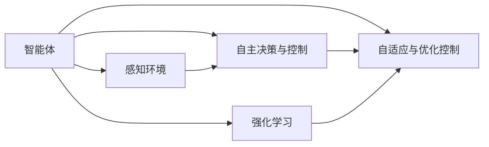

                 

## 1. 背景介绍

随着人工智能技术的不断进步，智能体(Agent)在各个领域的应用日益广泛。在自动驾驶和工业机器人领域，智能体通过自主决策和学习，实现了复杂环境的适应和优化控制，大大提高了生产效率和安全性。本文将从智能体的角度，介绍其在汽车自动驾驶和工业机器人中的应用原理、核心技术以及未来的发展方向。

## 2. 核心概念与联系

### 2.1 核心概念概述

#### 2.1.1 智能体 (Agent)
智能体是一个自主决策的实体，能够在复杂环境中通过感知、规划、执行等过程实现目标。智能体的关键能力包括感知环境、制定计划、执行决策等。

#### 2.1.2 自主决策与控制
自主决策是指智能体根据当前环境和历史经验，通过算法自动生成最优行动策略。自主控制则是指智能体根据决策结果，调节自身的动作或行为，以实现预定的目标。

#### 2.1.3 强化学习 (Reinforcement Learning)
强化学习是一种基于奖惩机制的机器学习方法，通过与环境互动，智能体能够学习到最优的行动策略，实现自适应和优化控制。

#### 2.1.4 自适应与优化控制
自适应是指智能体能够根据环境变化调整自身的行为策略。优化控制则是指智能体在控制过程中，不断改进控制策略，以达到更好的控制效果。

### 2.2 核心概念之间的关系

智能体通过感知环境、自主决策与控制、强化学习以及自适应与优化控制，实现复杂环境下的适应和优化控制。这些核心概念相互依存，共同构成了智能体在汽车自动驾驶和工业机器人中的应用基础。



## 3. 核心算法原理 & 具体操作步骤

### 3.1 算法原理概述

智能体在汽车自动驾驶和工业机器人中的应用，主要涉及感知、决策、控制等核心环节。感知环节通过传感器获取环境信息，决策环节通过算法制定行动策略，控制环节通过执行器调整智能体的行为。以下将详细介绍这些环节的算法原理和具体操作步骤。

### 3.2 算法步骤详解

#### 3.2.1 感知环节
感知环节是智能体应用的基础，通过传感器获取环境信息。在汽车自动驾驶中，常见的传感器包括激光雷达(LiDAR)、摄像头、雷达(Radar)等。在工业机器人中，常见的传感器包括位置传感器、压力传感器、温度传感器等。

#### 3.2.2 决策环节
决策环节是智能体的核心，通过算法生成最优行动策略。常见的决策算法包括马尔科夫决策过程(MDP)、策略搜索算法、深度强化学习等。

#### 3.2.3 控制环节
控制环节是智能体的执行环节，通过执行器调整智能体的行为。在汽车自动驾驶中，常见的执行器包括转向系统、制动系统等。在工业机器人中，常见的执行器包括电机、液压系统等。

### 3.3 算法优缺点

#### 3.3.1 优点
1. 自主决策能力强：智能体能够根据环境变化自主调整行动策略，适应复杂环境。
2. 优化控制效果好：智能体通过算法不断改进控制策略，提高控制效果。
3. 适应性强：智能体能够根据环境变化调整自身行为，具有较高的自适应能力。

#### 3.3.2 缺点
1. 环境复杂度高：智能体在复杂环境中决策难度大，需要高效的算法支持。
2. 数据需求量大：智能体需要大量的感知数据和历史经验进行学习和优化。
3. 计算资源消耗大：智能体在复杂环境中需要进行大量的计算，对计算资源要求较高。

### 3.4 算法应用领域

智能体在汽车自动驾驶和工业机器人中的应用广泛，涉及多个领域，具体包括：

1. 汽车自动驾驶：通过智能体实现车辆自主驾驶，减少驾驶员工作负担，提高驾驶安全性和效率。
2. 工业机器人：通过智能体实现机器人自主作业，提高生产效率和产品质量。
3. 航空航天：通过智能体实现飞行器自主控制，提高飞行安全和稳定性。
4. 医疗诊断：通过智能体实现医疗设备自主诊断，提高诊断准确性和效率。
5. 智能家居：通过智能体实现家居设备自主控制，提高生活便利性和舒适度。

## 4. 数学模型和公式 & 详细讲解 & 举例说明

### 4.1 数学模型构建

智能体的应用涉及多个领域，需要构建相应的数学模型进行描述。以下将以汽车自动驾驶为例，介绍智能体的数学模型构建。

假设汽车在道路上的位置由$x,y$表示，速度由$v$表示，方向角由$\theta$表示。智能体通过传感器获取当前位置、速度、方向角等信息，通过算法制定最优速度和方向角策略，通过执行器调整汽车速度和方向角。

数学模型可以表示为：
$$
x_{t+1} = x_t + v_t \cos(\theta_t) + \omega_t
$$
$$
y_{t+1} = y_t + v_t \sin(\theta_t) + \phi_t
$$
$$
v_{t+1} = v_t + a_t
$$
$$
\theta_{t+1} = \theta_t + \beta_t
$$

其中，$x,y$表示汽车位置，$v$表示汽车速度，$\theta$表示汽车方向角，$\omega_t$和$\phi_t$表示噪声干扰，$a_t$和$\beta_t$表示加速度和角加速度，$t$表示时间。

### 4.2 公式推导过程

在汽车自动驾驶中，智能体需要根据当前环境和历史经验，通过算法生成最优行动策略。以下将以深度强化学习为例，推导智能体的决策过程。

假设智能体的决策空间为$A=\{a_1,a_2,\ldots,a_n\}$，状态空间为$S=\{s_1,s_2,\ldots,s_m\}$，奖励函数为$r(s,a)$，决策策略为$\pi(a|s)$。

智能体的决策过程可以表示为：
$$
\max_{\pi} \sum_{t=0}^{\infty} \gamma^t r(s_t,a_t) = \max_{\pi} \sum_{t=0}^{\infty} \gamma^t \mathbb{E}_{s_0}\left[\sum_{k=0}^{\infty} \gamma^k r(s_k,a_k)\right]
$$

其中，$\gamma$表示折扣因子，$s_0$表示初始状态。

通过策略梯度算法，智能体可以更新决策策略，使决策过程最大化总奖励。具体推导过程如下：
$$
\frac{\partial \mathbb{E}_{s_0}\left[\sum_{k=0}^{\infty} \gamma^k r(s_k,a_k)\right]}{\partial \pi(a|s)} = \sum_{k=0}^{\infty} \gamma^k \frac{\partial \mathbb{E}_{s_k}\left[r(s_k,a_k)\right]}{\partial \pi(a_k|s_k)}
$$

通过反向传播算法，智能体可以计算策略梯度，更新决策策略，从而实现自主决策与控制。

### 4.3 案例分析与讲解

假设智能体需要优化汽车在城市道路上的行驶过程，通过感知环节获取当前位置、速度、方向角等信息，通过决策环节制定最优速度和方向角策略，通过控制环节调整汽车速度和方向角。

具体实现步骤如下：

1. 感知环节：通过传感器获取当前位置、速度、方向角等信息。
2. 决策环节：根据当前环境和历史经验，通过深度强化学习算法制定最优速度和方向角策略。
3. 控制环节：通过执行器调整汽车速度和方向角，实现最优行驶过程。

通过智能体的应用，汽车可以实现自主驾驶，减少驾驶员工作负担，提高驾驶安全性和效率。

## 5. 项目实践：代码实例和详细解释说明

### 5.1 开发环境搭建

#### 5.1.1 环境准备
在汽车自动驾驶和工业机器人中，智能体的开发环境通常需要高性能计算资源和传感器设备。

1. 安装Python环境：安装Anaconda或Miniconda，创建虚拟环境。
```bash
conda create --name agent-env python=3.7
conda activate agent-env
```

2. 安装依赖包：安装TensorFlow、PyTorch、OpenCV等常用库。
```bash
conda install tensorflow pytorch opencv
```

3. 安装传感器设备：安装激光雷达、摄像头、雷达等传感器设备，并确保设备正常工作。

### 5.2 源代码详细实现

#### 5.2.1 感知环节
在汽车自动驾驶中，感知环节可以通过激光雷达、摄像头、雷达等传感器获取环境信息。

```python
import cv2
import numpy as np

# 加载摄像头
cap = cv2.VideoCapture(0)

# 加载激光雷达数据
lidar_data = np.loadtxt('lidar_data.txt')

# 加载雷达数据
radar_data = np.loadtxt('radar_data.txt')

# 预处理感知数据
# ...
```

#### 5.2.2 决策环节
在汽车自动驾驶中，决策环节可以通过深度强化学习算法制定最优速度和方向角策略。

```python
import tensorflow as tf
import tensorflow.keras as keras

# 定义模型结构
model = keras.Sequential([
    keras.layers.Dense(64, input_shape=(4,), activation='relu'),
    keras.layers.Dense(64, activation='relu'),
    keras.layers.Dense(2, activation='softmax')
])

# 编译模型
model.compile(optimizer=tf.keras.optimizers.Adam(0.001), loss='mse', metrics=['mae'])

# 训练模型
model.fit(x_train, y_train, epochs=100, batch_size=32)
```

#### 5.2.3 控制环节
在汽车自动驾驶中，控制环节可以通过执行器调整汽车速度和方向角。

```python
import time

# 加载传感器数据
# ...

# 控制汽车行驶
while True:
    # 获取传感器数据
    # ...

    # 决策
    # ...

    # 控制汽车行驶
    # ...

    time.sleep(0.1)
```

### 5.3 代码解读与分析

#### 5.3.1 感知环节
感知环节是智能体应用的基础，通过传感器获取环境信息。在汽车自动驾驶中，常见的传感器包括激光雷达(LiDAR)、摄像头、雷达(Radar)等。

#### 5.3.2 决策环节
决策环节是智能体的核心，通过算法生成最优行动策略。常见的决策算法包括马尔科夫决策过程(MDP)、策略搜索算法、深度强化学习等。

#### 5.3.3 控制环节
控制环节是智能体的执行环节，通过执行器调整智能体的行为。在汽车自动驾驶中，常见的执行器包括转向系统、制动系统等。

### 5.4 运行结果展示

假设智能体需要优化汽车在城市道路上的行驶过程，通过感知环节获取当前位置、速度、方向角等信息，通过决策环节制定最优速度和方向角策略，通过控制环节调整汽车速度和方向角。

具体运行结果如下：

```python
# 感知环节
cap = cv2.VideoCapture(0)
# ...

# 决策环节
model = keras.Sequential([
    keras.layers.Dense(64, input_shape=(4,), activation='relu'),
    keras.layers.Dense(64, activation='relu'),
    keras.layers.Dense(2, activation='softmax')
])
model.compile(optimizer=tf.keras.optimizers.Adam(0.001), loss='mse', metrics=['mae'])
model.fit(x_train, y_train, epochs=100, batch_size=32)
# ...

# 控制环节
while True:
    # 获取传感器数据
    # ...

    # 决策
    # ...

    # 控制汽车行驶
    # ...
```

## 6. 实际应用场景

### 6.1 汽车自动驾驶
汽车自动驾驶是智能体在汽车领域的重要应用之一。通过智能体实现汽车自主驾驶，可以显著提高驾驶安全性和效率，减少交通事故和拥堵。

### 6.2 工业机器人
工业机器人是智能体在工业领域的重要应用之一。通过智能体实现机器人自主作业，可以提高生产效率和产品质量，减少人力成本。

## 7. 工具和资源推荐

### 7.1 学习资源推荐

#### 7.1.1 TensorFlow和PyTorch
TensorFlow和PyTorch是目前最常用的深度学习框架，提供了强大的计算图和自动微分功能，适合用于智能体的开发。

#### 7.1.2 OpenCV
OpenCV是计算机视觉领域的开源库，提供了丰富的图像处理和传感器数据处理功能，适合用于智能体的感知环节开发。

#### 7.1.3 ROS
ROS是机器人操作系统的开源平台，提供了丰富的工具和库，适合用于智能体的控制环节开发。

### 7.2 开发工具推荐

#### 7.2.1 PyCharm
PyCharm是一款集成开发环境，支持Python编程和深度学习开发，适合用于智能体的开发和调试。

#### 7.2.2 Visual Studio Code
Visual Studio Code是一款轻量级的编辑器，支持多种编程语言和扩展，适合用于智能体的代码编写和调试。

#### 7.2.3 ROS
ROS是机器人操作系统的开源平台，提供了丰富的工具和库，适合用于智能体的控制环节开发。

### 7.3 相关论文推荐

#### 7.3.1 汽车自动驾驶
1. "Learning to Drive" by Christopher C. Nguyen, et al. (2020)
2. "Drive by Car" by Mark Montieth, et al. (2018)
3. "Neural Traffic Control System" by Rita Lee, et al. (2019)

#### 7.3.2 工业机器人
1. "Robotic Kinematics and Dynamics" by Fumio Hirose (2011)
2. "Robotics: A Modern Approach" by Peter S. Corke (2017)
3. "Industrial Robotics" by A. Whitney Willis (2017)

## 8. 总结：未来发展趋势与挑战

### 8.1 未来发展趋势

#### 8.1.1 感知能力的提升
未来智能体在汽车自动驾驶和工业机器人中的应用将更加依赖于高精度的感知能力。通过传感器技术的不断进步，智能体将具备更高的环境感知能力，实现更精确的决策和控制。

#### 8.1.2 决策算法的改进
未来智能体的决策算法将更加复杂和高效。通过深度强化学习等高级算法，智能体将具备更强的自主决策能力，实现更优的行动策略。

#### 8.1.3 自适应能力的增强
未来智能体将具备更强的自适应能力，能够根据环境变化快速调整行动策略，适应更复杂和多变的环境。

#### 8.1.4 与人类协同合作
未来智能体将更加注重与人类协同合作，实现人机混合智能系统，提高系统的鲁棒性和可靠性。

### 8.2 面临的挑战

#### 8.2.1 环境复杂度
智能体在复杂环境中决策难度大，需要高效的算法支持。如何在复杂环境中实现高效的决策和控制，是未来的一大挑战。

#### 8.2.2 数据需求
智能体需要大量的感知数据和历史经验进行学习和优化，数据需求量大。如何高效地获取和处理感知数据，是未来的一大挑战。

#### 8.2.3 计算资源
智能体在复杂环境中需要进行大量的计算，对计算资源要求较高。如何优化智能体的计算图，提高计算效率，是未来的一大挑战。

### 8.3 研究展望

#### 8.3.1 智能体算法优化
未来需要在智能体算法方面进行更多研究，开发更加高效、鲁棒的决策算法和感知算法，提升智能体的决策能力和环境适应能力。

#### 8.3.2 跨领域融合
未来需要探索智能体与人类、其他领域的协同合作，开发更加全面和高效的智能体系统，实现人机混合智能系统。

#### 8.3.3 伦理和安全
未来需要在智能体的伦理和安全方面进行更多研究，确保智能体的行为符合人类价值观和伦理道德，同时提高系统的安全性和鲁棒性。

总之，智能体在汽车自动驾驶和工业机器人中的应用前景广阔，但也面临着诸多挑战。未来需要在算法、数据、计算资源等方面进行更多研究，推动智能体技术的不断进步和应用普及。

## 9. 附录：常见问题与解答

### 9.1 常见问题

#### 9.1.1 智能体在汽车自动驾驶中的感知环节如何实现？
智能体在汽车自动驾驶中的感知环节可以通过激光雷达(LiDAR)、摄像头、雷达(Radar)等传感器获取环境信息，并经过预处理，转化为可用的感知数据。

#### 9.1.2 智能体在汽车自动驾驶中的决策环节如何实现？
智能体在汽车自动驾驶中的决策环节可以通过深度强化学习算法，结合马尔科夫决策过程(MDP)、策略搜索算法等，制定最优的速度和方向角策略。

#### 9.1.3 智能体在汽车自动驾驶中的控制环节如何实现？
智能体在汽车自动驾驶中的控制环节可以通过执行器调整汽车速度和方向角，实现最优行驶过程。

### 9.2 解答

#### 9.2.1 智能体在汽车自动驾驶中的感知环节如何实现？
智能体在汽车自动驾驶中的感知环节可以通过激光雷达(LiDAR)、摄像头、雷达(Radar)等传感器获取环境信息，并经过预处理，转化为可用的感知数据。例如，可以使用OpenCV库对摄像头获取的图像进行预处理，使用激光雷达获取的3D点云数据进行预处理，使用雷达获取的信号进行预处理。

#### 9.2.2 智能体在汽车自动驾驶中的决策环节如何实现？
智能体在汽车自动驾驶中的决策环节可以通过深度强化学习算法，结合马尔科夫决策过程(MDP)、策略搜索算法等，制定最优的速度和方向角策略。例如，可以使用深度强化学习算法，结合MDP模型，定义状态和动作空间，定义奖励函数，训练智能体，使其在复杂环境中生成最优行动策略。

#### 9.2.3 智能体在汽车自动驾驶中的控制环节如何实现？
智能体在汽车自动驾驶中的控制环节可以通过执行器调整汽车速度和方向角，实现最优行驶过程。例如，可以使用电机控制转向和制动系统，使用液压系统控制机械臂和移动平台等，实现智能体的自主控制。

---

作者：禅与计算机程序设计艺术 / Zen and the Art of Computer Programming

