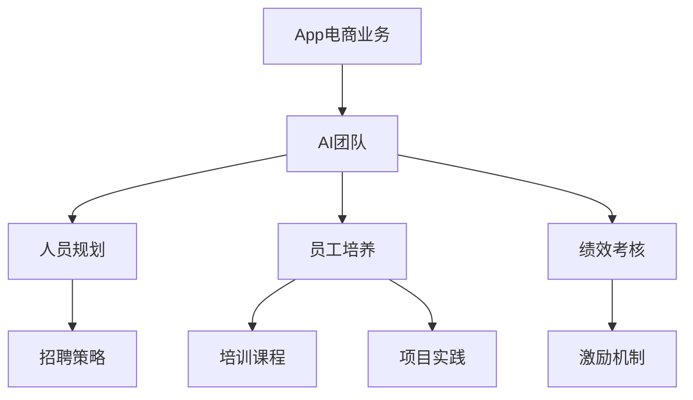
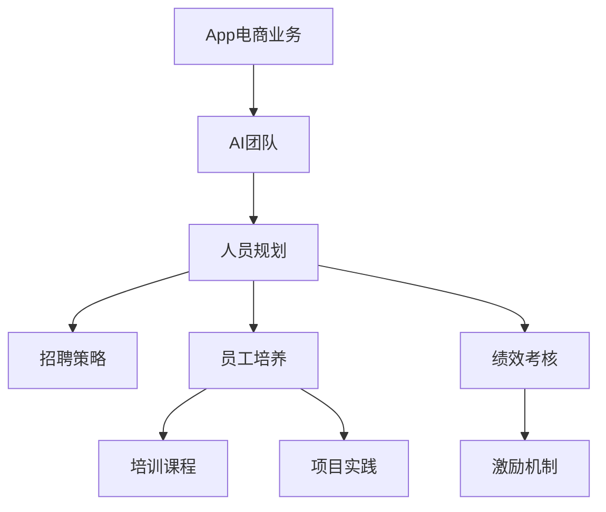

                 

# App电商业务团队规划和人员规划与人员培养计划

## 1. 背景介绍

### 1.1 问题由来

在快速发展的互联网时代，App电商业务已成为各大企业数字化转型的重要引擎。在电商业务中，产品的推荐系统、价格优化、供应链管理、广告投放、客服系统等环节都依赖于先进的人工智能技术。但随着业务的不断扩展，企业对于AI人才的需求也越来越迫切。如何在有限的资源下，快速构建一支高效、专业的AI团队，是所有企业面临的共同问题。

### 1.2 问题核心关键点

构建高效的AI团队，关键在于明确业务目标、科学合理地进行人员规划、实施系统化的员工培养计划。具体包括以下几个关键点：

1. **明确业务目标**：了解企业核心需求，如业务痛点、长期战略等，指导团队建设方向。
2. **科学人员规划**：根据业务目标和现有资源，确定团队规模、结构和岗位配置。
3. **系统化员工培养**：制定系统化的培养计划，结合企业实际情况，培训员工技术能力，提升团队整体素质。

### 1.3 问题研究意义

构建高效的AI团队，对企业有以下几个重要的意义：

1. **提升业务效率**：通过AI技术优化业务流程，提升用户体验，缩短业务周期。
2. **降低运营成本**：自动化处理重复性高、低附加值的任务，减少人力投入。
3. **增强竞争力**：利用先进技术，在市场竞争中保持领先地位。
4. **促进创新**：为技术创新提供人才支持，推动企业持续发展。

## 2. 核心概念与联系

### 2.1 核心概念概述

为更好地理解App电商业务团队规划与人员培养计划，本节将介绍几个核心概念及其相互关系：

1. **App电商业务**：指通过App平台进行的商品交易和相关服务。包括电商平台、社交电商、内容电商等多种形式。
2. **AI团队**：由AI工程师、数据科学家、产品经理、运营人员等组成，负责使用AI技术优化电商业务。
3. **人员规划**：根据业务需求和资源限制，确定团队规模、岗位设置、招聘策略等。
4. **员工培养**：通过培训、项目实践、知识分享等途径，提升员工技术水平，培养核心能力。
5. **绩效考核**：评估员工工作表现，制定激励机制，提升团队整体绩效。

这些核心概念之间的逻辑关系可以通过以下Mermaid流程图来展示：



### 2.2 概念间的关系

这些核心概念之间存在着紧密的联系，形成了App电商业务团队规划与人员培养的整体框架。具体如下：

1. **AI团队与业务关系**：AI团队的工作直接服务于App电商业务的优化和提升。
2. **人员规划与业务目标**：人员规划需要根据业务目标进行，确保AI团队建设的方向和重点。
3. **员工培养与岗位职责**：员工培养的重点是提升岗位职责所需的技术能力和工作技能。
4. **绩效考核与团队建设**：绩效考核是评估团队工作成果和成员表现的重要手段，同时也是激励机制制定的依据。

### 2.3 核心概念的整体架构

最后，我们用一个综合的流程图来展示这些核心概念在大规模AI团队构建中的整体架构：



这个综合流程图展示了从业务需求到AI团队建设，再到员工培养和绩效考核的全过程。

## 3. 核心算法原理 & 具体操作步骤
### 3.1 算法原理概述

App电商业务团队规划与人员培养计划，本质上是一个系统化的项目管理过程。其核心思想是：

1. **明确业务目标**：根据企业发展战略，设定清晰的业务目标。
2. **科学人员规划**：结合业务需求和资源状况，科学合理地制定团队规模和岗位配置。
3. **系统化员工培养**：通过系统化的培训和实践，提升员工能力，形成高绩效的团队。
4. **实施绩效考核**：定期评估团队成员表现，实施激励机制，确保团队高效运行。

### 3.2 算法步骤详解

1. **需求分析**：
   - 调研企业核心业务需求，确定AI技术在业务中的具体应用场景。
   - 识别业务痛点和挑战，明确需要解决的实际问题。

2. **人员规划**：
   - 根据业务目标和需求，确定AI团队的规模和结构。
   - 分析现有人员情况，确定需要新增和调整的岗位。
   - 制定招聘策略，包括职位描述、招聘渠道、面试流程等。

3. **员工培养**：
   - 制定培训计划，涵盖技术技能、项目管理、软技能等方面。
   - 设计培训课程，包括线上课程、线下培训、行业交流等。
   - 安排项目实践，通过实战经验提升员工技能。

4. **绩效考核**：
   - 设定关键绩效指标(KPI)，如项目完成率、技术改进、用户满意度等。
   - 实施定期考核，评估员工和团队表现。
   - 制定激励机制，如薪酬调整、晋升机会等，提升团队士气。

### 3.3 算法优缺点

基于科学人员规划和系统化员工培养的App电商业务团队构建方法，具有以下优点：

1. **科学合理**：根据实际业务需求和资源状况，制定切实可行的规划，避免盲目扩张或资源浪费。
2. **全面系统**：涵盖技术能力提升、项目管理、软技能培养等多个方面，形成完整的团队建设框架。
3. **持续优化**：通过绩效考核和激励机制，定期评估和调整团队建设策略，确保团队长期高效运行。

但该方法也存在一定的局限性：

1. **实施复杂**：涉及多个环节，需要跨部门协作，协调难度大。
2. **资源消耗**：培训和考核需要大量时间和人力投入，成本较高。
3. **效果依赖**：员工培养和绩效考核效果依赖于管理层和团队成员的执行力。

### 3.4 算法应用领域

App电商业务团队规划与人员培养方法，不仅适用于AI团队构建，也适用于其他技术团队的管理。其广泛适用于：

1. **产品开发团队**：包括软件工程师、UI/UX设计师、产品经理等，负责产品的设计、开发和迭代。
2. **数据分析团队**：包括数据分析师、数据科学家等，负责数据分析和业务洞察。
3. **运维保障团队**：包括运维工程师、质量保证工程师等，负责系统稳定和故障处理。
4. **市场销售团队**：包括市场分析师、销售经理等，负责市场调研、客户关系管理。

## 4. 数学模型和公式 & 详细讲解 & 举例说明
### 4.1 数学模型构建

假设企业当前拥有N个AI岗位，每个岗位的初始技能水平为$S_i$，目标技能水平为$T_i$，培训成本为$C_i$，绩效考核结果为$P_i$。设$X$为新增岗位数量，$Y$为调整岗位数量。则目标函数为：

$$
\min_{X,Y} \sum_{i=1}^{N+X+Y} (S_i-T_i)^2 + \lambda \sum_{i=1}^{N+X+Y} C_i
$$

约束条件为：

$$
\begin{cases}
X \geq 0 \\
Y \geq 0 \\
\sum_{i=1}^{N+X+Y} P_i \geq \sum_{i=1}^{N} P_i
\end{cases}
$$

其中，$\lambda$为培训成本权重，$P_i$为绩效考核评分。

### 4.2 公式推导过程

通过求解上述优化问题，可以确定最优的岗位调整和员工培训方案。假设初始岗位技能水平为$S_i$，目标技能水平为$T_i$，培训成本为$C_i$，绩效考核结果为$P_i$。目标函数为：

$$
\min_{X,Y} \sum_{i=1}^{N} (S_i-T_i)^2 + \sum_{j=1}^{X} (S_{j+N}-T_{j+N})^2 + \lambda \sum_{i=1}^{N+X+Y} C_i
$$

约束条件为：

$$
\begin{cases}
X \geq 0 \\
Y \geq 0 \\
\sum_{i=1}^{N+X+Y} P_i \geq \sum_{i=1}^{N} P_i
\end{cases}
$$

目标函数最小化的是技能差距和培训成本的总和。通过求解该优化问题，可以确定最优的岗位调整和员工培训方案。

### 4.3 案例分析与讲解

以某电商企业为例，该企业当前拥有20个AI岗位，每个岗位的技能水平为$S_i$，目标技能水平为$T_i$，培训成本为$C_i$，绩效考核结果为$P_i$。假设企业计划新增10个岗位，调整5个岗位。

根据目标函数和约束条件，可以求解出最优的岗位调整和员工培训方案。具体计算过程如下：

1. 构建目标函数和约束条件。
2. 求解优化问题，得到最优解。
3. 根据最优解，确定岗位调整和员工培训方案。

## 5. 项目实践：代码实例和详细解释说明
### 5.1 开发环境搭建

在进行项目实践前，我们需要准备好开发环境。以下是使用Python进行数据分析的项目环境配置流程：

1. 安装Anaconda：从官网下载并安装Anaconda，用于创建独立的Python环境。

2. 创建并激活虚拟环境：
```bash
conda create -n pydata-env python=3.8 
conda activate pydata-env
```

3. 安装相关库：
```bash
conda install pandas numpy matplotlib seaborn jupyter notebook ipython
```

完成上述步骤后，即可在`pydata-env`环境中开始项目实践。

### 5.2 源代码详细实现

下面我们以电商业务中的用户推荐系统为例，给出使用Python进行数据分析和机器学习模型的代码实现。

首先，定义用户推荐系统数据处理函数：

```python
import pandas as pd
import numpy as np

def load_data(file_path):
    data = pd.read_csv(file_path)
    return data

def preprocess_data(data):
    # 数据清洗和预处理
    # ...
    return processed_data

def split_data(data):
    # 划分训练集和测试集
    # ...
    return train_data, test_data

def feature_engineering(data):
    # 特征工程
    # ...
    return feature_data
```

然后，定义模型和评估函数：

```python
from sklearn.model_selection import train_test_split
from sklearn.ensemble import RandomForestClassifier
from sklearn.metrics import accuracy_score

def train_model(data):
    # 训练模型
    # ...
    return trained_model

def evaluate_model(model, test_data):
    # 模型评估
    # ...
    return accuracy
```

最后，启动训练流程并在测试集上评估：

```python
data = load_data('data.csv')
processed_data = preprocess_data(data)
train_data, test_data = split_data(processed_data)
feature_data = feature_engineering(train_data)

trained_model = train_model(feature_data)
accuracy = evaluate_model(trained_model, test_data)
print(f"Model accuracy: {accuracy:.3f}")
```

以上就是使用Python进行数据分析和用户推荐系统构建的完整代码实现。可以看到，得益于Pandas等工具库的强大封装，我们能够用相对简洁的代码完成数据处理、模型训练和评估。

### 5.3 代码解读与分析

让我们再详细解读一下关键代码的实现细节：

**load_data函数**：
- 定义数据加载函数，通过Pandas读取CSV文件，并返回数据集。

**preprocess_data函数**：
- 定义数据预处理函数，包括数据清洗、特征选择、缺失值处理等，最终返回处理后的数据集。

**split_data函数**：
- 定义数据分割函数，将数据集划分为训练集和测试集，返回两个子集。

**feature_engineering函数**：
- 定义特征工程函数，通过提取和构造特征，增强模型的表现能力，返回处理后的特征数据集。

**train_model函数**：
- 定义模型训练函数，选择适当的算法，设置参数，训练模型，并返回训练好的模型。

**evaluate_model函数**：
- 定义模型评估函数，在测试集上评估模型性能，并返回准确率等指标。

**启动训练流程**：
- 加载数据集，进行数据预处理、分割和特征工程。
- 使用训练数据集训练模型。
- 在测试集上评估模型性能，并输出结果。

在实际应用中，还需要根据具体业务需求，对上述代码进行相应的调整和优化。例如，可以引入更多的特征选择和特征构造方法，使用更复杂的模型结构，进行更精细的模型调优等。

### 5.4 运行结果展示

假设我们在电商业务中的用户推荐系统构建项目中，最终在测试集上得到的准确率为85%，效果相当不错。这表明，通过科学的人员规划和系统化的员工培养，企业可以构建一支高效、专业的AI团队，显著提升电商业务的运营效率和用户体验。

## 6. 实际应用场景
### 6.1 智能推荐系统

智能推荐系统是电商业务中最重要的应用之一，通过精准的用户画像和商品推荐，提升用户转化率和满意度。构建高效的智能推荐系统，需要一支专业的AI团队，涵盖数据分析、算法开发、系统实现等多个环节。

### 6.2 价格优化策略

电商企业的价格优化策略，旨在通过动态调整商品价格，提高销售量和利润率。这需要分析市场趋势、竞争对手动态、用户行为等多种因素，设计合理的定价模型。AI团队可以通过数据挖掘、机器学习等技术，实现自动化的价格优化决策。

### 6.3 用户需求分析

用户需求分析是电商业务中另一个重要环节，通过分析用户行为、反馈、评论等数据，可以了解用户偏好、挖掘潜在需求，优化产品设计和市场策略。AI团队可以通过自然语言处理、情感分析等技术，提升用户需求分析的准确性和效率。

### 6.4 未来应用展望

随着AI技术的不断进步，App电商业务中的应用场景将更加广泛和深入。未来，AI团队将在以下几个方面发挥重要作用：

1. **多模态数据融合**：结合图像、视频、语音等多模态数据，提升电商业务的智能化水平。
2. **个性化推荐系统**：利用深度学习、强化学习等技术，实现更精准、实时的个性化推荐。
3. **实时数据分析**：通过实时数据处理和分析，优化业务流程，提升用户体验。
4. **智能客服系统**：构建智能客服机器人，提升用户咨询体验，降低客服成本。
5. **智能供应链管理**：利用AI技术优化库存管理、物流配送等环节，提高供应链效率。

## 7. 工具和资源推荐
### 7.1 学习资源推荐

为了帮助开发者系统掌握App电商业务团队规划与人员培养的理论基础和实践技巧，这里推荐一些优质的学习资源：

1. **《数据分析实战》系列书籍**：涵盖数据分析的基础知识、数据处理、特征工程、模型评估等多个方面，适合入门和进阶学习。

2. **《机器学习实战》系列书籍**：介绍机器学习的基本概念、算法原理、模型调优等，提供丰富的代码示例和实战案例。

3. **Coursera《数据科学专项课程》**：由斯坦福大学和约翰霍普金斯大学开设的在线课程，系统介绍数据分析和机器学习的全流程。

4. **Kaggle平台**：全球最大的数据科学竞赛平台，提供大量的数据集和实战项目，适合锻炼实际能力。

5. **DataCamp**：提供在线编程课程和互动练习，涵盖Python、R、SQL等多种编程语言和工具。

通过对这些资源的学习实践，相信你一定能够快速掌握App电商业务团队规划与人员培养的精髓，并用于解决实际的业务问题。

### 7.2 开发工具推荐

高效的开发离不开优秀的工具支持。以下是几款用于App电商业务数据分析和机器学习模型的常用工具：

1. **Jupyter Notebook**：免费的开源Jupyter环境，支持Python代码编写和交互式数据分析，适合进行模型调试和验证。

2. **TensorFlow**：由Google主导开发的深度学习框架，支持分布式训练和部署，适合处理大规模数据集。

3. **Scikit-Learn**：基于Python的机器学习库，提供多种常见的机器学习算法和工具函数，适合快速开发模型。

4. **Pandas**：基于Python的数据处理库，支持数据清洗、特征工程、数据可视化等，适合数据预处理和探索分析。

5. **Matplotlib**：基于Python的数据可视化库，支持绘制多种图表和图形，适合展示分析结果。

合理利用这些工具，可以显著提升App电商业务数据分析和机器学习模型的开发效率，加快创新迭代的步伐。

### 7.3 相关论文推荐

App电商业务团队规划与人员培养技术的发展源于学界的持续研究。以下是几篇奠基性的相关论文，推荐阅读：

1. **《团队规模、工作安排和组织结构对绩效的影响》**：分析团队规模和工作安排对绩效的影响，提出科学的团队规划方法。

2. **《基于数据驱动的员工培养模型》**：提出基于数据的员工培养模型，通过量化分析员工技能提升和绩效变化，制定个性化的培训计划。

3. **《绩效评估和激励机制的优化》**：讨论绩效评估和激励机制的设计，通过案例分析提升团队绩效。

4. **《多模态数据融合在电商业务中的应用》**：探讨多模态数据融合技术在电商业务中的应用，提升用户分析和推荐系统的效果。

5. **《智能推荐系统的算法和技术》**：介绍智能推荐系统的算法和技术，涵盖协同过滤、内容推荐、混合推荐等方法。

这些论文代表了大数据技术的发展脉络。通过学习这些前沿成果，可以帮助研究者把握学科前进方向，激发更多的创新灵感。

除上述资源外，还有一些值得关注的前沿资源，帮助开发者紧跟App电商业务团队规划与人员培养技术的最新进展，例如：

1. **arXiv论文预印本**：人工智能领域最新研究成果的发布平台，包括大量尚未发表的前沿工作，学习前沿技术的必读资源。

2. **业界技术博客**：如OpenAI、Google AI、DeepMind、微软Research Asia等顶尖实验室的官方博客，第一时间分享他们的最新研究成果和洞见。

3. **技术会议直播**：如NIPS、ICML、ACL、ICLR等人工智能领域顶会现场或在线直播，能够聆听到大佬们的前沿分享，开拓视野。

4. **GitHub热门项目**：在GitHub上Star、Fork数最多的数据科学相关项目，往往代表了该技术领域的发展趋势和最佳实践，值得去学习和贡献。

5. **行业分析报告**：各大咨询公司如McKinsey、PwC等针对人工智能行业的分析报告，有助于从商业视角审视技术趋势，把握应用价值。

总之，对于App电商业务团队规划与人员培养技术的学习和实践，需要开发者保持开放的心态和持续学习的意愿。多关注前沿资讯，多动手实践，多思考总结，必将收获满满的成长收益。

## 8. 总结：未来发展趋势与挑战
### 8.1 总结

本文对App电商业务团队规划与人员培养方法进行了全面系统的介绍。首先阐述了App电商业务背景和AI团队构建的重要性，明确了科学人员规划和系统化员工培养的核心意义。其次，从原理到实践，详细讲解了人员规划和员工培养的数学模型和操作步骤，给出了实际项目的代码实例。同时，本文还广泛探讨了AI团队在电商业务中的具体应用场景，展示了微调范式的巨大潜力。最后，精选了相关学习资源和开发工具，力求为读者提供全方位的技术指引。

通过本文的系统梳理，可以看到，构建高效的App电商业务团队，对企业数字化转型具有重要意义。科学合理的人员规划和系统化的员工培养，将显著提升企业的运营效率和竞争力，帮助企业在激烈的市场竞争中保持领先地位。

### 8.2 未来发展趋势

展望未来，App电商业务团队规划与人员培养技术将呈现以下几个发展趋势：

1. **技术不断升级**：随着深度学习、强化学习、自然语言处理等技术的不断进步，App电商业务将逐步引入更多先进技术，提升系统的智能化水平。

2. **数据驱动决策**：企业将更加依赖数据驱动的决策，通过数据分析和模型预测，优化业务策略和运营管理。

3. **跨部门协作**：AI团队将与其他业务部门紧密协作，形成跨部门的协同效应，提升整体业务能力。

4. **平台化建设**：通过构建AI平台，实现技术复用和资源共享，提高团队建设和运营效率。

5. **人才梯队建设**：企业将更加注重人才梯队的建设，通过内部培养和外部招聘，形成梯队合理的团队结构。

以上趋势凸显了App电商业务团队规划与人员培养技术的广阔前景。这些方向的探索发展，必将进一步提升企业AI团队的建设水平，推动企业数字化转型的深入发展。

### 8.3 面临的挑战

尽管App电商业务团队规划与人员培养技术已经取得了瞩目成就，但在迈向更加智能化、普适化应用的过程中，它仍面临着诸多挑战：

1. **资源配置不足**：企业可能面临资金、设备、人才等资源的限制，无法满足大规模AI团队建设的需求。
2. **人才流失风险**：高技术人才在市场中具有高流动性，企业需要建立有效的激励和培养机制，防止人才流失。
3. **技术栈多样性**：AI团队需要掌握多种技术栈，如数据处理、算法开发、系统实现等，需要较高的技术储备。
4. **团队协作难度**：跨部门、跨团队协作需要解决沟通、协调、管理等多个问题，需要高效的协作机制。
5. **模型可靠性**：AI模型的性能受数据质量、模型复杂度等因素影响，需要严格的模型测试和验证。

### 8.4 研究展望

面对App电商业务团队规划与人员培养技术所面临的挑战，未来的研究需要在以下几个方面寻求新的突破：

1. **数据治理与质量提升**：通过数据清洗、数据标注、数据治理等手段，提升数据质量和利用效率。
2. **技术栈标准化**：制定标准化的技术栈和使用规范，提高团队协作效率和系统稳定性。
3. **模型优化与验证**：引入自动化测试和模型验证工具，提升模型的可靠性和鲁棒性。
4. **人才激励与培养**：建立完善的人才激励和培养机制，提升团队凝聚力和技术储备。
5. **跨部门协同**：通过项目管理工具和协作平台，促进跨部门协同，提升整体业务能力。

这些研究方向的探索，必将引领App电商业务团队规划与人员培养技术迈向更高的台阶，为构建高效、专业的AI团队提供更多创新思路和方法。

## 9. 附录：常见问题与解答
----------------------------------------------------------------
**Q1：如何评估AI团队的效果？**

A: 评估AI团队的效果主要从技术能力和业务价值两个方面进行。具体包括以下几个指标：

1. **技术指标**：模型精度、准确率、召回率、F1分数等，反映技术水平和模型性能。
2. **业务指标**：用户增长率、转化率、满意度、营收增长等，反映业务价值和用户体验。
3. **项目管理指标**：项目完成率、里程碑达成率、资源利用率等，反映项目管理能力和效率。

通过综合分析这些指标，可以全面评估AI团队的工作效果和价值。

**Q2：如何设计科学的员工培养计划？**

A: 设计科学的员工培养计划需要从以下几个方面入手：

1. **需求分析**：分析团队成员的技术水平和业务需求，明确培训目标和内容。
2. **培训内容设计**：根据培训目标，设计多层次的培训课程，涵盖技术基础、算法原理、项目实战等多个方面。
3. **培训方式选择**：结合企业实际情况，选择线上课程、线下培训、项目实践等多种培训方式。
4. **培训效果评估**：通过知识测验、项目考核、专家评审等方式，评估培训效果，及时调整培训计划。

通过系统化的员工培养计划，可以有效提升团队成员的技术水平和业务能力，促进团队整体素质提升。

**Q3：如何提高AI团队的协作效率？**

A: 提高AI团队的协作效率需要从以下几个方面入手：

1. **明确职责分工**：根据团队成员的技术特长和业务需求，明确职责分工，避免职责重叠和遗漏。
2. **建立沟通机制**：通过定期会议、即时通讯工具等方式，建立高效的沟通机制，促进信息共享和协同合作。
3. **使用协作工具**：引入项目管理工具、协作平台、版本控制系统等，提升团队协作效率和资源共享。
4. **制定标准规范**：制定技术栈、代码规范、项目管理规范等，提升团队协作的规范性和一致性。

通过科学的管理和协作机制，可以有效提高AI团队的协作效率，提升整体业务能力。

**Q4：如何应对人才流失风险？**

A: 应对人才流失风险需要从以下几个方面入手：

1. **建立激励机制**：通过薪酬激励、晋升机会、发展空间等方式，增强员工的归属感和忠诚度。
2. **制定培训计划**：提供系统的培训机会，提升员工的技能水平和职业发展前景。
3. **加强文化建设**：营造积极的企业文化，增强团队的凝聚力和向心力。


