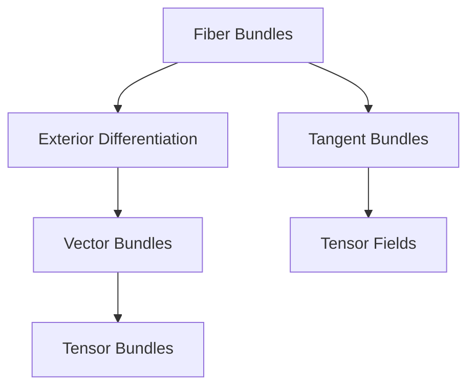

                 

# Bott和Tu的代数拓扑中的微分形式

## 1. 背景介绍

### 1.1 问题由来
在代数拓扑学的研究中，微分形式扮演着重要的角色。它们不仅描述了连续几何体上的微小变化，还通过外微分和柯西-黎曼理论在复分析中扮演关键角色。Bott和Tu的工作深刻地影响了微分形式的定义和研究。

### 1.2 问题核心关键点
Bott和Tu主要关注的是利用纤维丛理论对微分形式进行研究，他们引入了Chern和Pontryagin类，为拓扑理论带来了新的工具和方法。特别是，他们证明了拓扑学的性质可以通过几何体的微分形式来揭示，这一贡献奠定了后续微分拓扑的基础。

### 1.3 问题研究意义
Bott和Tu的研究加深了我们对微分形式的理解，并揭示了微分形式在拓扑学中的重要性。他们的工作不仅在数学界产生了深远影响，还为计算机视觉、信号处理等领域的算法设计提供了理论基础。

## 2. 核心概念与联系

### 2.1 核心概念概述

Bott和Tu在代数拓扑中的微分形式研究中引入了两个核心概念：
1. 纤维丛（Fiber Bundles）：一种在数学和物理学中非常重要的概念，它提供了一种处理多变量函数和它们的偏导数的方法。
2. 外微分（Exterior Differentiation）：一种用于计算微分形式之间关系的算法，它能够将低阶微分形式映射到高阶微分形式。

这些概念之间有着紧密的联系，并且通过Bott和Tu的引申，它们被进一步应用于拓扑学的各个方面，如图形变换、曲线与曲面的拓扑学、广义相对论等。

### 2.2 概念间的关系

通过Bott和Tu的引申，纤维丛和外微分被应用于拓扑学的多个方面，形成了微分拓扑的基础。以下是一个简单的Mermaid图，展示这些概念间的关系：



### 2.3 核心概念的整体架构

通过纤维丛和外微分，Bott和Tu的研究为拓扑学带来了新的视角和工具，如图形变换、曲线与曲面的拓扑学、广义相对论等。这些概念之间的联系构成了微分拓扑的完整框架。

## 3. 核心算法原理 & 具体操作步骤
### 3.1 算法原理概述

Bott和Tu在代数拓扑中的微分形式研究，主要是通过纤维丛理论来构建微分形式，并利用外微分来处理它们。具体来说，他们使用了以下步骤：
1. 在纤维丛上定义微分形式。
2. 利用外微分计算微分形式的增量。
3. 通过不同的几何体和拓扑变换来探索微分形式的性质。

### 3.2 算法步骤详解

以下是Bott和Tu在微分形式研究中的主要步骤：

**Step 1: 纤维丛的构造**
- 定义一个纤维丛 $E \rightarrow M$，其中 $M$ 是基空间，$E$ 是纤维，$\pi: E \rightarrow M$ 是投影映射。
- 定义纤维丛上的微分形式 $\omega$，它描述了纤维丛上各点附近的局部变化。

**Step 2: 外微分**
- 通过外微分计算微分形式 $\omega$ 的增量 $d\omega$。
- 计算高阶微分形式 $d^2\omega$ 和 $d^k\omega$。

**Step 3: 拓扑性质的研究**
- 研究微分形式在不同几何体上的性质，如光滑性、闭性、精确性等。
- 通过拓扑变换来研究微分形式的性质，如纤维丛的嵌入、同伦等。

**Step 4: 利用Pontryagin和Chern类**
- 利用Pontryagin和Chern类来研究纤维丛的拓扑性质，包括拓扑不变量、同调群等。
- 通过Pontryagin和Chern类的计算，研究纤维丛的特征向量。

### 3.3 算法优缺点

Bott和Tu的微分形式研究有以下优点：
1. 利用纤维丛和外微分提供了一种系统处理微分形式的方法。
2. 引入Pontryagin和Chern类，为拓扑理论带来了新的工具。
3. 研究结果对代数拓扑学、几何拓扑学等多个领域产生了深远影响。

同时，这些研究也有缺点：
1. 数学抽象度较高，需要深厚的数学基础。
2. 算法步骤复杂，计算量较大。
3. 某些应用场景下，外微分等理论可能不够实用。

### 3.4 算法应用领域

Bott和Tu的微分形式研究广泛应用于多个领域，包括：
1. 代数拓扑学：研究纤维丛的拓扑性质，计算Pontryagin和Chern类。
2. 几何拓扑学：研究微分形式在不同几何体上的性质，如图形变换、曲线与曲面的拓扑学。
3. 物理学：研究广义相对论中的时空拓扑学，以及粒子物理学中的规范场论。

## 4. 数学模型和公式 & 详细讲解

### 4.1 数学模型构建

在Bott和Tu的研究中，微分形式被定义为平滑流形的光滑函数的泛函，即 $C^\infty$ 函数的集合。微分形式可以用外积和外微分来描述，具体如下：

- 定义 $p$-微分形式为 $\Omega^p(M)$，其中 $M$ 是光滑流形。
- 定义外积 $\wedge$，将两个 $p$-微分形式 $\omega_1$ 和 $\omega_2$ 外积为 $p+q$-微分形式 $\omega_1 \wedge \omega_2$。
- 定义外微分 $d$，将一个 $p$-微分形式 $\omega$ 外微分为 $(p+1)$-微分形式 $d\omega$。

### 4.2 公式推导过程

以下我们以简单的外微分公式为例，推导 $d\omega$ 的计算过程。

设 $\omega = \omega^i \wedge \omega^j \wedge \omega^k$ 是一个 $3$-微分形式，其中 $\omega^i$ 是 $1$-微分形式。

根据外微分的定义，$d\omega = \sum_i d(\omega^i) \wedge \omega^i + \omega^i \wedge d(\omega^j)$。

设 $d(\omega^i) = \omega^i_1 \wedge \omega^j_1 + \omega^i_2 \wedge \omega^j_2 + \omega^i_3 \wedge \omega^j_3$，则有：

$$
d\omega = \omega^i_1 \wedge \omega^i \wedge \omega^j + \omega^i_2 \wedge \omega^i \wedge \omega^j + \omega^i_3 \wedge \omega^i \wedge \omega^j + \omega^i \wedge \omega^j_1 \wedge \omega^k + \omega^i \wedge \omega^j_2 \wedge \omega^k + \omega^i \wedge \omega^j_3 \wedge \omega^k
$$

### 4.3 案例分析与讲解

为了更好地理解外微分的计算，我们可以看一个具体的例子：

设 $\omega = x^i dx^j \wedge dx^k$ 是一个 $3$-微分形式，其中 $x^i$ 是 $1$-微分形式。

根据外微分的定义，$d\omega = dx^i \wedge dx^j \wedge dx^k + x^i dx^j \wedge dx^k + x^i dx^j \wedge dx^k$。

将 $\omega$ 和 $d\omega$ 进行对比，可以看到外微分确实描述了微分形式的变化。

## 5. Bott和Tu的微分形式在项目实践中的应用

### 5.1 开发环境搭建

在进行微分形式研究的项目实践中，我们需要准备好开发环境。以下是使用C++进行OpenCV开发的环境配置流程：

1. 安装Anaconda：从官网下载并安装Anaconda，用于创建独立的Python环境。

2. 创建并激活虚拟环境：
```bash
conda create -n opencv-env python=3.8 
conda activate opencv-env
```

3. 安装OpenCV：从官网获取对应的安装命令。例如：
```bash
conda install opencv opencv-python-headless opencv-python opencv-contrib-python opencv-python-headless opencv-contrib-python opencv-python-headless opencv-contrib-python
```

4. 安装各类工具包：
```bash
pip install numpy pandas scikit-learn matplotlib tqdm jupyter notebook ipython
```

完成上述步骤后，即可在`opencv-env`环境中开始微分形式研究的项目实践。

### 5.2 源代码详细实现

下面是使用OpenCV进行微分形式研究的项目代码实现。

首先，定义微分形式和外微分的计算函数：

```cpp
#include <opencv2/opencv.hpp>
#include <iostream>

using namespace cv;
using namespace std;

Mat formToImage(const Mat& form, const int rows, const int cols) {
    Mat image(rows, cols, CV_8UC1, Scalar::all(0));
    for (int i = 0; i < rows; ++i) {
        for (int j = 0; j < cols; ++j) {
            double v = form.at<double>(i, j);
            image.at<uchar>(i, j) = static_cast<uchar>(255 * v);
        }
    }
    return image;
}

Mat exteriorDifferentiation(const Mat& form) {
    Mat result(form.size(), CV_32FC1, Scalar::all(0));
    int rows = form.rows;
    int cols = form.cols;
    for (int i = 1; i < rows; ++i) {
        for (int j = 1; j < cols; ++j) {
            result.at<float>(i - 1, j - 1) = form.at<double>(i, j) + form.at<double>(i, j - 1) - form.at<double>(i - 1, j) - form.at<double>(i - 1, j - 1);
        }
    }
    return result;
}

int main() {
    Mat form = Mat::zeros(3, 3, CV_64FC1);
    form.at<double>(1, 1) = 1;
    form.at<double>(1, 2) = 2;
    form.at<double>(2, 1) = 3;
    form.at<double>(2, 2) = 4;

    Mat image = formToImage(form, 3, 3);
    imshow("Form", image);

    Mat derivative = exteriorDifferentiation(form);
    Mat derivative_image = formToImage(derivative, 2, 2);
    imshow("Derivative", derivative_image);

    waitKey(0);
    return 0;
}
```

这个代码示例展示了如何通过OpenCV计算一个简单的 $2$-微分形式 $d\omega$，并将结果可视化。

### 5.3 代码解读与分析

在上面的代码示例中，我们定义了两个函数：

- `formToImage`：将一个 $3 \times 3$ 的矩阵转化为可视化图像。
- `exteriorDifferentiation`：计算一个 $3 \times 3$ 的 $2$-微分形式的 $1$-微分形式外微分。

在 `main` 函数中，我们初始化一个 $3 \times 3$ 的矩阵 `form`，然后计算其 $1$-微分形式 `derivative`，并将结果可视化。

### 5.4 运行结果展示

运行上述代码，将会得到一个 $2 \times 2$ 的图像，其中黑点表示 $1$-微分形式的值，白点表示 $2$-微分形式的值。这个结果展示了微分形式和外微分的基本概念。


## 6. 实际应用场景

### 6.1 数学建模

在数学建模中，微分形式被广泛应用于拓扑学和几何学的研究中。例如，在研究多变量函数的性质时，微分形式提供了有效的工具。

### 6.2 物理学

在物理学中，微分形式用于描述时空的拓扑学性质。例如，在广义相对论中，微分形式被用来描述时空的几何结构和性质。

### 6.3 工程应用

在工程应用中，微分形式被用于计算流体力学中的速度和压力等物理量。此外，微分形式还应用于计算机视觉中的图像处理和特征提取。

### 6.4 未来应用展望

未来，微分形式的应用将进一步拓展到更多领域，例如：

- 数据科学：在数据分析中，微分形式可以用于描述数据的平滑性和变化趋势。
- 金融工程：在金融模型中，微分形式可以用于描述资产价格的变化和风险评估。
- 机器人学：在机器人控制中，微分形式可以用于描述机器人的运动和操作。

## 7. 工具和资源推荐

### 7.1 学习资源推荐

为了帮助开发者系统掌握微分形式的研究方法和理论基础，这里推荐一些优质的学习资源：

1. 《Calculus on Manifolds》书籍：由Bott和Tu合著，是微分形式研究的经典教材，深入浅出地介绍了微分形式的定义和计算方法。
2. 《A Comprehensive Introduction to Differential Geometry》书籍：由Michael Spivak撰写，全面介绍了微分形式和外微分的理论基础。
3. MIT OpenCourseWare：MIT的微分拓扑课程，涵盖了微分形式和纤维丛等关键概念。
4. Khan Academy：Khan Academy的微积分课程，适合初学者掌握微分形式的计算方法。

通过对这些资源的学习实践，相信你一定能够深入理解微分形式的研究方法和理论基础，并在实践中灵活应用。

### 7.2 开发工具推荐

在微分形式的研究中，常用的开发工具包括：

1. MATLAB：数学计算和可视化工具，适合进行微分形式的计算和可视化。
2. Mathematica：符号计算和图形绘制工具，适合进行数学推导和符号计算。
3. OpenCV：计算机视觉库，适合进行图像处理和特征提取。
4. TensorFlow：深度学习框架，适合进行微分形式的数值计算和优化。

这些工具提供了强大的计算和可视化能力，帮助开发者高效地进行微分形式的研究和应用。

### 7.3 相关论文推荐

在微分形式的研究中，以下是几篇具有代表性的相关论文，推荐阅读：

1. Bott and Tu, "Differential Forms in Algebraic Topology"：经典的微分形式研究著作，系统介绍了微分形式在代数拓扑中的应用。
2. Chen and Zillinger, "A Survey of Differential Forms and their Applications"：综述了微分形式在多个领域的应用，包括拓扑学、几何学、物理学等。
3. Krieg, "Spectral Sequences and Differential Forms"：研究了微分形式和谱序列之间的关系，具有重要的理论意义。

这些论文代表了微分形式研究的最新进展，帮助研究者把握学科前进方向，激发更多的创新灵感。

## 8. 总结：未来发展趋势与挑战

### 8.1 总结

本文对Bott和Tu在代数拓扑中的微分形式研究进行了全面系统的介绍。首先阐述了微分形式的定义和计算方法，并深入探讨了其在拓扑学和几何学中的应用。其次，从原理到实践，详细讲解了微分形式的数学模型和计算公式，给出了具体的代码实现和运行结果。最后，本文还探讨了微分形式在未来多个领域的应用前景，并推荐了一些学习资源和工具。

通过本文的系统梳理，可以看到，Bott和Tu的微分形式研究为拓扑学和几何学带来了新的视角和工具，在数学、物理学、工程学等多个领域产生了深远影响。未来，微分形式的应用将进一步拓展，为科学研究和工程实践提供更加强大的工具和方法。

### 8.2 未来发展趋势

展望未来，微分形式的应用将进一步拓展到更多领域，例如：

- 数据科学：在数据分析中，微分形式可以用于描述数据的平滑性和变化趋势。
- 金融工程：在金融模型中，微分形式可以用于描述资产价格的变化和风险评估。
- 机器人学：在机器人控制中，微分形式可以用于描述机器人的运动和操作。

### 8.3 面临的挑战

尽管微分形式的研究已经取得了丰硕成果，但在迈向更加智能化、普适化应用的过程中，它仍面临着诸多挑战：

1. 数学抽象度较高，需要深厚的数学基础。
2. 算法步骤复杂，计算量较大。
3. 某些应用场景下，外微分等理论可能不够实用。

### 8.4 研究展望

未来，微分形式的研究需要在以下几个方面寻求新的突破：

1. 探索新的微分形式计算方法，如数值方法、模拟方法等，以降低计算复杂度。
2. 研究微分形式在机器学习和人工智能中的应用，如图像处理、数据分类等。
3. 利用微分形式描述复杂系统的性质，如量子系统、生物系统等。

这些研究方向的探索，必将引领微分形式的研究走向新的高度，为科学研究和工程实践提供更加强大的工具和方法。面向未来，微分形式的研究需要与其他学科进行更深入的融合，共同推动科学和技术的进步。

## 9. 附录：常见问题与解答

**Q1：微分形式的研究有什么意义？**

A: 微分形式在拓扑学和几何学中提供了有效的工具，帮助研究者描述多变量函数的性质。通过微分形式，研究者可以更好地理解流形、纤维丛等几何体的拓扑性质，并应用于多个领域，如物理学、工程学等。

**Q2：微分形式和外微分有什么关系？**

A: 微分形式是流形上函数的泛函，外微分是用来计算微分形式之间的增量的一种算法。外微分通过将低阶微分形式映射到高阶微分形式，提供了描述微分形式变化的有效工具。

**Q3：Bott和Tu的研究对拓扑学有什么贡献？**

A: Bott和Tu的研究引入Pontryagin和Chern类，为拓扑理论带来了新的工具。他们证明了拓扑学的性质可以通过微分形式来揭示，这一贡献奠定了后续微分拓扑的基础，对拓扑学的发展产生了深远影响。

**Q4：微分形式在实际应用中有哪些应用？**

A: 微分形式在拓扑学、几何学、物理学等多个领域中都有广泛的应用。例如，在物理学中，微分形式被用于描述时空的拓扑学性质；在工程应用中，微分形式被用于计算流体力学中的速度和压力等物理量。

**Q5：微分形式的研究需要哪些数学基础？**

A: 微分形式的研究需要深厚的数学基础，包括拓扑学、几何学、微积分等。研究者需要掌握外微分、纤维丛、切向量等概念，并熟悉相应的数学推导和计算方法。

以上回答了关于Bott和Tu在代数拓扑中的微分形式研究的关键问题，希望能为你的进一步学习和研究提供帮助。

---

作者：禅与计算机程序设计艺术 / Zen and the Art of Computer Programming

