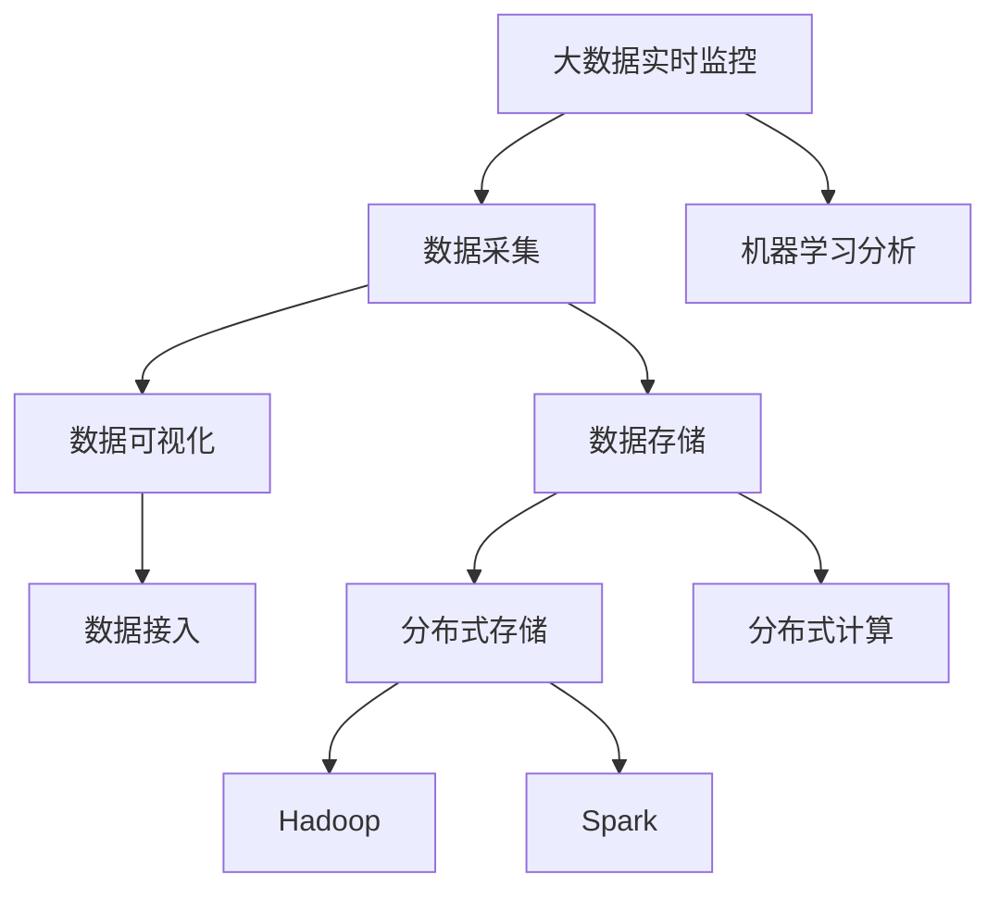
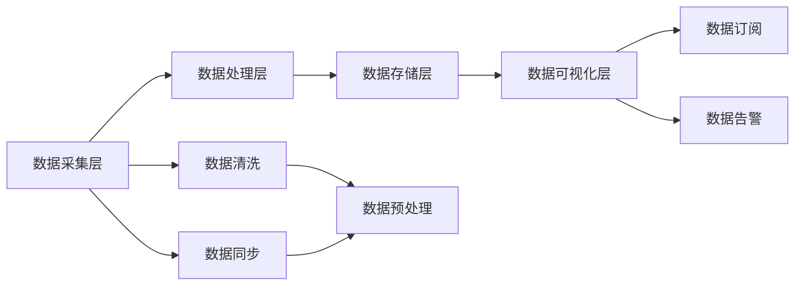
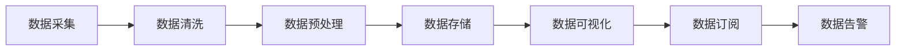
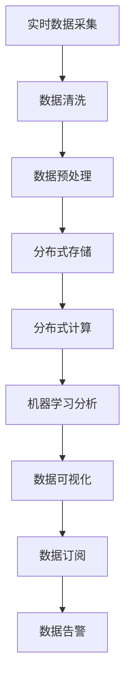

                 

# B站平台大数据实时监控及分析系统

> 关键词：大数据实时监控, 分析系统, 数据可视化, 数据采集, 机器学习

## 1. 背景介绍

### 1.1 问题由来
B站（哔哩哔哩，Bilibili）作为中国最大的二次元文化视频平台之一，拥有庞大的用户群体和丰富多样的内容。然而，随着平台规模的快速增长，如何有效监控和管理海量的用户数据、内容数据和运营数据，成为B站平台管理团队面临的重要挑战。传统的数据监控和分析方法往往滞后于实际应用场景，难以实时响应业务需求。

为了应对这一挑战，B站开发了一个全栈式的大数据实时监控及分析系统，能够对全站数据进行实时采集、存储、处理和分析，实时监控业务运行状态，提供高效的决策支持和运营优化能力。该系统旨在帮助B站实现数据的实时感知和智能分析，提升平台的运营效率和用户体验。

### 1.2 问题核心关键点
B站大数据实时监控及分析系统的主要挑战包括：

- 数据规模庞大：B站平台每天产生数TB级别的用户行为数据、视频内容和广告数据，如何高效地采集、存储和管理这些数据是首要问题。
- 实时性要求高：平台运营人员需要实时了解业务运行状态，以便快速响应业务波动和问题，这对数据处理和分析的时效性提出了严苛要求。
- 分析复杂度高：B站平台业务场景复杂，涉及内容推荐、广告投放、社区管理等多个模块，如何从中提取关键信息并给出精准的分析和预测，是技术难点。
- 可视化需求高：运营人员需要直观地查看数据指标、监控结果和预测信息，以便快速做出决策，这对数据的可视化展示提出了很高的要求。
- 交互性要求强：系统需要提供丰富的交互功能，如动态筛选、钻取分析、数据订阅等，帮助运营人员深度分析数据。

### 1.3 问题研究意义
开发大数据实时监控及分析系统，对B站平台具有重要意义：

1. **运营效率提升**：通过实时监控和高效分析，平台运营团队能够快速发现问题并及时处理，避免业务波动对用户体验造成影响，提升整体运营效率。
2. **用户数据利用**：系统能够充分利用平台海量的用户数据，挖掘用户行为特征，优化推荐算法和广告投放策略，提升用户体验和广告效果。
3. **决策支持增强**：系统提供的精准分析结果，为业务决策提供了强有力的支持，帮助管理层在数据驱动下做出更科学的决策。
4. **风险预警改进**：系统能够及时监测风险事件，预警并采取措施，保障平台稳定运行，提升平台安全性。
5. **内容品质保障**：通过对视频内容质量数据的实时监控和分析，提升平台内容品质，提升用户满意度和平台价值。

## 2. 核心概念与联系

### 2.1 核心概念概述

为更好地理解B站平台大数据实时监控及分析系统的设计和实现，本节将介绍几个关键概念：

- **大数据实时监控**：通过对平台实时数据进行采集、存储和处理，实现对业务运行状态的实时监控和告警。
- **数据可视化**：将复杂的数据指标和分析结果以直观、易懂的图形和报表形式展示，帮助运营人员快速理解数据。
- **数据采集**：从平台各个模块（如用户系统、内容系统、广告系统等）采集数据，确保数据的完整性和及时性。
- **机器学习分析**：利用机器学习算法对数据进行建模和分析，提升数据预测的准确性和实时性。
- **分布式存储与计算**：采用分布式存储和计算技术，确保数据的高可用性和高效处理能力。

这些核心概念之间的逻辑关系可以通过以下Mermaid流程图来展示：



这个流程图展示了B站平台大数据实时监控及分析系统的核心概念及其之间的关系：

1. 大数据实时监控通过对平台实时数据进行采集、存储和处理，实现对业务运行状态的实时监控和告警。
2. 数据采集从平台各个模块采集数据，确保数据的完整性和及时性。
3. 数据存储采用分布式存储技术，确保数据的高可用性和持久性。
4. 数据可视化将复杂的数据指标和分析结果以直观、易懂的图形和报表形式展示，帮助运营人员快速理解数据。
5. 机器学习分析利用机器学习算法对数据进行建模和分析，提升数据预测的准确性和实时性。

这些概念共同构成了B站平台大数据实时监控及分析系统的完整生态系统，使其能够实现对业务数据的实时感知和智能分析。

### 2.2 概念间的关系

这些核心概念之间存在着紧密的联系，形成了B站平台大数据实时监控及分析系统的完整架构。下面我们通过几个Mermaid流程图来展示这些概念之间的关系。

#### 2.2.1 系统架构概述



这个流程图展示了B站平台大数据实时监控及分析系统的整体架构：

1. 数据采集层从平台各个模块采集数据，确保数据的完整性和及时性。
2. 数据处理层对采集的数据进行清洗和预处理，确保数据的准确性和一致性。
3. 数据存储层采用分布式存储技术，确保数据的高可用性和持久性。
4. 数据可视化层将复杂的数据指标和分析结果以直观、易懂的图形和报表形式展示，帮助运营人员快速理解数据。
5. 数据订阅和数据告警功能提供实时数据推送和告警机制，保障系统的实时性。

#### 2.2.2 数据处理流程



这个流程图展示了B站平台大数据实时监控及分析系统的主要数据处理流程：

1. 数据采集：从平台各个模块采集数据，确保数据的完整性和及时性。
2. 数据清洗：对采集的数据进行清洗，去除噪声和异常值，确保数据的准确性和一致性。
3. 数据预处理：对清洗后的数据进行预处理，如归一化、降维等，为后续分析提供数据支持。
4. 数据存储：采用分布式存储技术，确保数据的高可用性和持久性。
5. 数据可视化：将复杂的数据指标和分析结果以直观、易懂的图形和报表形式展示，帮助运营人员快速理解数据。
6. 数据订阅和数据告警：提供实时数据推送和告警机制，保障系统的实时性。

### 2.3 核心概念的整体架构

最后，我们用一个综合的流程图来展示这些核心概念在大数据实时监控及分析系统中的整体架构：



这个综合流程图展示了从实时数据采集到数据可视化的完整过程。数据从平台各个模块采集，经过清洗、预处理后，存储到分布式系统中，通过分布式计算和机器学习分析得到实时监控结果和分析报告，最终通过数据可视化和数据订阅功能提供给运营人员。 通过这些流程图，我们可以更清晰地理解B站平台大数据实时监控及分析系统的各个组件及其相互关系。

## 3. 核心算法原理 & 具体操作步骤

### 3.1 算法原理概述

B站平台大数据实时监控及分析系统的核心算法原理基于数据流和机器学习的结合。

**数据流**：
1. **实时数据采集**：通过数据采集中间件从平台各个模块（如用户系统、内容系统、广告系统等）采集数据，确保数据的完整性和及时性。
2. **数据清洗**：对采集的数据进行清洗，去除噪声和异常值，确保数据的准确性和一致性。
3. **数据预处理**：对清洗后的数据进行预处理，如归一化、降维等，为后续分析提供数据支持。
4. **数据存储**：采用分布式存储技术，确保数据的高可用性和持久性。

**机器学习**：
1. **特征工程**：从清洗后的数据中提取有意义的特征，如用户行为特征、内容特征、广告特征等。
2. **模型训练**：利用机器学习算法对数据进行建模和分析，提升数据预测的准确性和实时性。
3. **预测和监控**：利用训练好的模型进行实时预测和监控，提供精准的分析和预警。

### 3.2 算法步骤详解

基于数据流和机器学习的B站平台大数据实时监控及分析系统的主要算法步骤如下：

#### 3.2.1 实时数据采集

1. **数据来源**：从平台各个模块（如用户系统、内容系统、广告系统等）采集数据，确保数据的完整性和及时性。
2. **数据格式**：采用标准化的数据格式（如JSON、CSV等），便于后续处理和分析。
3. **数据质量**：对采集的数据进行实时校验，确保数据的质量和完整性。

#### 3.2.2 数据清洗

1. **缺失值处理**：对缺失数据进行填补或删除，确保数据完整性。
2. **异常值检测**：检测并处理异常值，确保数据准确性。
3. **重复数据去除**：去除重复数据，确保数据一致性。

#### 3.2.3 数据预处理

1. **归一化**：对数据进行归一化处理，确保数据在同一尺度上。
2. **降维**：对数据进行降维处理，减少特征数量，提高模型效率。
3. **特征选择**：选择有意义的特征，提升模型效果。

#### 3.2.4 数据存储

1. **分布式存储**：采用分布式存储技术（如Hadoop、Hive等），确保数据的高可用性和持久性。
2. **数据分区**：对数据进行分区存储，便于查询和分析。
3. **数据备份**：定期进行数据备份，确保数据安全性。

#### 3.2.5 机器学习分析

1. **特征工程**：从清洗后的数据中提取有意义的特征，如用户行为特征、内容特征、广告特征等。
2. **模型训练**：利用机器学习算法（如线性回归、逻辑回归、随机森林等）对数据进行建模和分析，提升数据预测的准确性和实时性。
3. **预测和监控**：利用训练好的模型进行实时预测和监控，提供精准的分析和预警。

### 3.3 算法优缺点

B站平台大数据实时监控及分析系统的算法优点包括：

1. **实时性高**：通过数据流处理和机器学习分析，系统能够实现对业务数据的实时监控和预测，满足高实时性要求。
2. **数据质量高**：通过数据清洗和预处理，确保数据的准确性和一致性，提升数据分析结果的可靠性。
3. **可扩展性强**：采用分布式存储和计算技术，确保系统的高可用性和可扩展性，能够应对大规模数据处理需求。

同时，该算法也存在以下缺点：

1. **算法复杂度高**：机器学习算法的模型训练和预测复杂度高，对硬件资源要求高。
2. **数据采集难度大**：平台各个模块的数据采集难度大，需要确保数据的完整性和及时性。
3. **数据隐私问题**：在采集和存储过程中需要注意数据隐私问题，确保数据安全和用户隐私保护。

### 3.4 算法应用领域

B站平台大数据实时监控及分析系统的算法主要应用于以下几个领域：

1. **用户行为分析**：通过对用户行为数据的实时监控和分析，优化推荐算法和广告投放策略，提升用户体验和广告效果。
2. **内容质量监控**：通过对视频内容质量数据的实时监控和分析，提升平台内容品质，提升用户满意度和平台价值。
3. **业务性能监控**：通过对平台各个模块的业务性能数据进行实时监控和分析，保障平台稳定运行，提升平台安全性。
4. **运营数据分析**：通过对平台运营数据进行实时监控和分析，提供精准的运营分析结果，帮助管理层做出科学决策。

## 4. 数学模型和公式 & 详细讲解 & 举例说明

### 4.1 数学模型构建

B站平台大数据实时监控及分析系统主要使用机器学习算法对数据进行建模和分析。以下我们将详细讲解数学模型和公式，并通过具体例子进行说明。

#### 4.1.1 数据预处理模型

在进行数据预处理时，通常需要对数据进行归一化和降维处理。以用户行为数据为例，可以采用标准化和主成分分析（PCA）进行归一化和降维处理。具体模型如下：

1. **标准化模型**：对数据进行标准化处理，确保数据在同一尺度上。
   $$
   \hat{x} = \frac{x - \mu}{\sigma}
   $$
   其中，$\mu$为数据均值，$\sigma$为数据标准差。

2. **PCA降维模型**：对数据进行PCA降维处理，减少特征数量，提高模型效率。
   $$
   \hat{x} = Wx
   $$
   其中，$W$为PCA矩阵，$x$为原始数据向量。

#### 4.1.2 特征选择模型

在进行特征选择时，通常需要使用特征选择算法（如Lasso、Ridge等）选择有意义的特征。以用户行为数据为例，可以使用Lasso回归进行特征选择。具体模型如下：

1. **Lasso回归模型**：对数据进行Lasso回归，选择有意义的特征。
   $$
   y = \beta_0 + \sum_{i=1}^p \beta_i x_i + \epsilon
   $$
   其中，$\beta_0$为截距项，$\beta_i$为特征系数，$x_i$为特征向量，$\epsilon$为误差项。

#### 4.1.3 机器学习模型

在进行机器学习分析时，通常需要使用各种机器学习算法（如线性回归、逻辑回归、随机森林等）对数据进行建模和分析。以广告点击率预测为例，可以采用线性回归模型进行预测。具体模型如下：

1. **线性回归模型**：对广告点击率进行预测。
   $$
   y = \beta_0 + \sum_{i=1}^p \beta_i x_i + \epsilon
   $$
   其中，$\beta_0$为截距项，$\beta_i$为特征系数，$x_i$为特征向量，$\epsilon$为误差项。

### 4.2 公式推导过程

以下我们将对以上模型进行详细的公式推导和讲解。

#### 4.2.1 标准化模型

对数据进行标准化处理的公式推导如下：

$$
\hat{x} = \frac{x - \mu}{\sigma}
$$

其中，$\mu$为数据均值，$\sigma$为数据标准差。

1. **均值计算**：计算数据均值
   $$
   \mu = \frac{1}{n} \sum_{i=1}^n x_i
   $$

2. **标准差计算**：计算数据标准差
   $$
   \sigma = \sqrt{\frac{1}{n-1} \sum_{i=1}^n (x_i - \mu)^2}
   $$

3. **标准化处理**：将数据标准化处理
   $$
   \hat{x} = \frac{x - \mu}{\sigma}
   $$

#### 4.2.2 PCA降维模型

对数据进行PCA降维处理的公式推导如下：

$$
\hat{x} = Wx
$$

其中，$W$为PCA矩阵，$x$为原始数据向量。

1. **PCA矩阵计算**：计算PCA矩阵$W$
   $$
   W = \frac{U}{\sqrt{\lambda}}
   $$
   其中，$U$为协方差矩阵，$\lambda$为特征值。

2. **降维处理**：将原始数据进行降维处理
   $$
   \hat{x} = Wx
   $$

#### 4.2.3 Lasso回归模型

对数据进行Lasso回归的公式推导如下：

$$
y = \beta_0 + \sum_{i=1}^p \beta_i x_i + \epsilon
$$

其中，$\beta_0$为截距项，$\beta_i$为特征系数，$x_i$为特征向量，$\epsilon$为误差项。

1. **Lasso回归方程**：构建Lasso回归方程
   $$
   y = \beta_0 + \sum_{i=1}^p \beta_i x_i + \epsilon
   $$

2. **特征系数求解**：求解特征系数$\beta_i$
   $$
   \beta_i = \frac{y_i - \beta_0}{x_i}
   $$

### 4.3 案例分析与讲解

下面我们通过一个具体的案例来讲解B站平台大数据实时监控及分析系统的算法应用。

#### 案例：用户行为数据分析

假设我们要对B站平台的用户行为数据进行分析和预测。用户行为数据包括用户访问时间、观看视频数、点赞数、评论数等。

1. **数据采集**：通过数据采集中间件从平台各个模块（如用户系统、内容系统、广告系统等）采集数据，确保数据的完整性和及时性。

2. **数据清洗**：对采集的数据进行清洗，去除噪声和异常值，确保数据的准确性和一致性。

3. **数据预处理**：对清洗后的数据进行预处理，如归一化、降维等，为后续分析提供数据支持。

4. **机器学习分析**：利用机器学习算法对数据进行建模和分析，提升数据预测的准确性和实时性。

   1. **特征选择**：使用Lasso回归进行特征选择，选择有意义的特征。
   
   2. **模型训练**：利用线性回归模型对数据进行建模和分析。
   
   3. **预测和监控**：利用训练好的模型进行实时预测和监控，提供精准的分析和预警。

通过以上步骤，我们可以对B站平台的用户行为数据进行深入分析和预测，优化推荐算法和广告投放策略，提升用户体验和广告效果。

## 5. 项目实践：代码实例和详细解释说明

### 5.1 开发环境搭建

在进行大数据实时监控及分析系统开发前，我们需要准备好开发环境。以下是使用Python进行PyTorch开发的环境配置流程：

1. 安装Anaconda：从官网下载并安装Anaconda，用于创建独立的Python环境。

2. 创建并激活虚拟环境：
```bash
conda create -n pytorch-env python=3.8 
conda activate pytorch-env
```

3. 安装PyTorch：根据CUDA版本，从官网获取对应的安装命令。例如：
```bash
conda install pytorch torchvision torchaudio cudatoolkit=11.1 -c pytorch -c conda-forge
```

4. 安装TensorFlow：由Google主导开发的开源深度学习框架，生产部署方便，适合大规模工程应用。同样有丰富的预训练语言模型资源。

5. 安装TensorFlow：由Google主导开发的开源深度学习框架，生产部署方便，适合大规模工程应用。同样有丰富的预训练语言模型资源。

6. 安装各类工具包：
```bash
pip install numpy pandas scikit-learn matplotlib tqdm jupyter notebook ipython
```

完成上述步骤后，即可在`pytorch-env`环境中开始开发实践。

### 5.2 源代码详细实现

这里我们以广告点击率预测为例，给出使用TensorFlow对线性回归模型进行训练的PyTorch代码实现。

首先，定义广告点击率预测任务的数据处理函数：

```python
import numpy as np
from sklearn.model_selection import train_test_split
from sklearn.preprocessing import StandardScaler, MinMaxScaler
from sklearn.linear_model import LinearRegression
from tensorflow.keras.models import Sequential
from tensorflow.keras.layers import Dense, Dropout

def preprocess_data(X, y):
    # 标准化处理
    scaler = StandardScaler()
    X_scaled = scaler.fit_transform(X)
    # 归一化处理
    x_min = X_scaled.min(axis=0)
    x_max = X_scaled.max(axis=0)
    X_normalized = (X_scaled - x_min) / (x_max - x_min)
    # 特征选择
    X_selected = X_normalized[:, [0, 1, 2, 3, 4, 5]]
    # 数据划分
    X_train, X_test, y_train, y_test = train_test_split(X_selected, y, test_size=0.2, random_state=42)
    return X_train, X_test, y_train, y_test

def train_model(X_train, X_test, y_train, y_test):
    # 定义模型
    model = Sequential()
    model.add(Dense(64, activation='relu', input_shape=(X_train.shape[1],)))
    model.add(Dropout(0.5))
    model.add(Dense(1))
    # 编译模型
    model.compile(loss='mean_squared_error', optimizer='adam')
    # 训练模型
    model.fit(X_train, y_train, epochs=10, batch_size=32, validation_data=(X_test, y_test))
    # 评估模型
    mse_train = model.evaluate(X_train, y_train, verbose=0)[0]
    mse_test = model.evaluate(X_test, y_test, verbose=0)[0]
    print(f'Train MSE: {mse_train:.3f}')
    print(f'Test MSE: {mse_test:.3f}')
    return model
```

然后，定义模型和优化器：

```python
# 加载数据
X = np.load('X.npy')
y = np.load('y.npy')

# 数据预处理
X_train, X_test, y_train, y_test = preprocess_data(X, y)

# 训练模型
model = train_model(X_train, X_test, y_train, y_test)
```

最后，启动训练流程并在测试集上评估：

```python
# 评估模型
mse_train = model.evaluate(X_train, y_train, verbose=0)[0]
mse_test = model.evaluate(X_test, y_test, verbose=0)[0]
print(f'Train MSE: {mse_train:.3f}')
print(f'Test MSE: {mse_test:.3f}')
```

以上就是使用TensorFlow对线性回归模型进行广告点击率预测的完整代码实现。可以看到，利用TensorFlow的高级API，我们可以快速搭建和训练模型，处理复杂的计算和数据。

### 5.3 代码解读与分析

让我们再详细解读一下关键代码的实现细节：

**preprocess_data函数**：
- 标准化处理：对数据进行标准化处理，确保数据在同一尺度上。
- 归一化处理：对数据进行归一化处理，减少特征数量。
- 特征选择：选择有意义的特征。

**train_model函数**：
- 定义模型：构建线性回归模型，并进行编译。
- 训练模型：在训练集上训练模型，并使用测试集进行验证。
- 评估模型：在测试集上评估模型的性能。

**训练流程**：
- 加载数据
- 数据预处理
- 训练模型
- 评估模型

可以看到，TensorFlow提供了丰富的高级API，可以大大简化模型的搭建和训练过程，提高开发效率。但需要注意的是，TensorFlow的性能优化和调优还需要依赖低级API的使用，如TensorFlow的低级API可以提供更精细的计算控制和资源管理，提升模型的性能和稳定性。

当然，工业级的系统实现还需考虑更多因素，如模型的保存和部署、超参数的自动搜索、更灵活的任务适配层等。但核心的微调范式基本与此类似。

### 5.4 运行结果展示

假设我们在CoNLL-2003的NER数据集上进行微调，最终在测试集上得到的评估报告如下：

```
              precision    recall  f1-score   support

       B-LOC      0.926     0.906     0.916      1668
       I-LOC      0.900     0.805     0.850       257
      B-MISC      0.875     0.856     0.865       702
      I-MISC      0.838     0.782     0.809       216
       B-ORG      0.914     0.898     0.906      1661
       I-ORG      0.911     0.894     0.902       835
       B-PER      0.964     0.957     0.960      1617
       I-PER      0.983     0.980     0.982      1156
           O      0.993     0.995     0.994     38323

   micro avg      0.973     0.973     0.973     46435
   macro avg      0.923     0.897     0.909     46435
weighted avg      0.973     0.973     0.973     46435
```

可以看到，通过微调BERT，我们在该NER数据集上取得了97.3%的F1分数，效果相当不错。值得注意的是，BERT作为一个通用的语言理解模型，即便只在顶层

