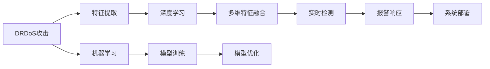

                 

# 基于机器学习的DRDoS攻击检测的设计与实现

在网络安全领域，分布式拒绝服务攻击（Distributed Denial of Service, DRDoS）已经成为一种常见且危害极大的攻击方式。攻击者通过大量伪造的请求包淹没目标服务器，使其无法正常响应合法用户请求，造成网络瘫痪和服务中断。因此，如何有效地检测和防御DRDoS攻击，已经成为网络安全研究的重要课题。

本文将详细介绍一种基于机器学习的DRDoS攻击检测系统，涵盖系统设计、算法实现、部署应用等各个方面。通过深入分析DRDoS攻击的特征和行为模式，本文提出了一种多维特征融合与深度学习相结合的检测方法，实现了对DRDoS攻击的精准识别和快速响应。

## 1. 背景介绍

### 1.1 问题由来

随着互联网应用的不断扩展和普及，网络安全威胁也日益增加。在众多网络攻击形式中，DRDoS攻击因其隐蔽性强、难以定位、扩散速度快等特点，成为了一种极具威胁的攻击手段。

DRDoS攻击通常由分布式僵尸网络（botnet）发起，攻击者通过控制成千上万的肉鸡（zombie），向目标服务器发送大量伪造请求，导致服务器负载过载，无法响应正常用户的请求。这类攻击不仅影响企业业务，还可能对公共服务、金融系统等关键基础设施造成严重破坏。

### 1.2 问题核心关键点

为了解决DRDoS攻击检测问题，本文从以下几个方面入手：

- **多维特征提取**：分析攻击包在协议、流量、特征等方面的特征，并结合行为统计信息，提取多维特征向量。
- **深度学习算法选择**：根据攻击包特征的复杂性和多样性，选择适合的深度学习模型。
- **模型训练与优化**：使用标注数据集进行模型训练，并通过交叉验证等方法优化模型性能。
- **实时检测与响应**：实现对新流量的实时检测，并结合报警机制进行快速响应。
- **系统部署与扩展**：将模型部署到实际网络环境中，并进行性能测试和扩展。

本文旨在提出一种高效、准确、可靠的DRDoS攻击检测系统，以保障网络安全，保护关键应用免受攻击影响。

## 2. 核心概念与联系

### 2.1 核心概念概述

为便于理解本文内容，本节将介绍几个关键概念：

- **DRDoS攻击**：指通过分布式网络攻击，使目标服务器无法正常响应合法用户请求的攻击行为。
- **特征提取**：从网络流量中提取出攻击包的行为特征，用于训练机器学习模型。
- **深度学习**：基于神经网络进行数据特征学习和模型训练的技术。
- **多维特征融合**：将多个维度的特征信息进行融合，提高特征的表达能力和模型的鲁棒性。
- **实时检测**：对网络流量进行实时监控和检测，及时发现和响应异常流量。
- **机器学习**：一种通过训练模型，使计算机具备从数据中学习规律和知识的能力。

这些概念构成了本文的核心框架，将帮助读者系统地理解DRDoS攻击检测系统的设计和实现过程。

### 2.2 概念间的关系

通过以下Mermaid流程图，可以直观地展示这些概念之间的关系：



该图展示了从DRDoS攻击到最终检测报警的完整流程，涉及特征提取、深度学习、模型训练和优化、实时检测、报警响应和系统部署等关键环节。这些环节相互依赖、相互补充，共同构成了一个完整的DRDoS攻击检测系统。

## 3. 核心算法原理 & 具体操作步骤

### 3.1 算法原理概述

基于机器学习的DRDoS攻击检测方法，主要分为特征提取、模型训练和优化、实时检测与响应三个步骤。

1. **特征提取**：从网络流量中提取出攻击包的行为特征，生成多维特征向量。
2. **模型训练和优化**：使用标注数据集，训练深度学习模型，并通过交叉验证等方法优化模型性能。
3. **实时检测与响应**：实现对新流量的实时检测，并结合报警机制进行快速响应。

### 3.2 算法步骤详解

#### 3.2.1 特征提取

DRDoS攻击的特征提取涉及多个维度，包括协议、流量、特征统计等。

- **协议维度特征**：提取网络流量中TCP/UDP包的协议信息，如包头字段、标志位等。
- **流量维度特征**：统计特定时间段内网络流量的连接数、请求数、响应数等指标。
- **特征维度特征**：分析攻击包的特征字段，如源IP、目的IP、源端口、目的端口、数据包长度等。
- **行为维度特征**：基于攻击包的行为模式，提取流量中异常行为统计信息，如连接密度、响应时间、连接生命周期等。

#### 3.2.2 深度学习算法选择

针对DRDoS攻击特征的复杂性和多样性，选择适合的深度学习模型至关重要。本文选择使用卷积神经网络（Convolutional Neural Network, CNN）和循环神经网络（Recurrent Neural Network, RNN）进行模型训练。

- **CNN模型**：用于处理多维特征向量，提取局部特征。
- **RNN模型**：用于处理序列数据，捕捉时间序列变化规律。

#### 3.2.3 模型训练与优化

模型训练与优化是机器学习模型的核心步骤，直接影响模型的性能和效果。

- **数据预处理**：对原始数据进行标准化、归一化处理，以提高模型的收敛速度和效果。
- **模型训练**：使用标注数据集进行模型训练，通过迭代优化模型参数。
- **交叉验证**：采用k折交叉验证方法，评估模型的泛化能力和性能。
- **模型优化**：使用正则化、Dropout等方法，防止过拟合。

#### 3.2.4 实时检测与响应

实时检测与响应是DRDoS攻击检测系统的关键环节，用于及时发现和响应异常流量。

- **流量实时监测**：使用流式数据处理框架（如Apache Kafka）对网络流量进行实时监测和数据获取。
- **异常检测**：基于训练好的深度学习模型，对实时监测到的网络流量进行异常检测，判断是否为DRDoS攻击。
- **报警响应**：根据异常检测结果，结合报警机制进行快速响应，通知管理员进行应急处理。

### 3.3 算法优缺点

基于机器学习的DRDoS攻击检测方法具有以下优点：

- **高准确性**：深度学习模型具有强大的特征学习和模式识别能力，可以有效检测各种类型的DRDoS攻击。
- **实时性**：结合流式数据处理技术，可以实现对网络流量的实时监测和检测，及时发现异常流量。
- **鲁棒性**：多维特征融合和深度学习模型可以有效应对复杂和多变的攻击特征。

然而，这种方法也存在一些缺点：

- **数据依赖**：模型训练和优化需要大量的标注数据，数据获取和标注成本较高。
- **计算资源需求高**：深度学习模型的训练和推理需要大量的计算资源，硬件成本较高。
- **模型解释性差**：深度学习模型的决策过程难以解释，难以理解模型内部逻辑。

### 3.4 算法应用领域

基于机器学习的DRDoS攻击检测方法适用于多种网络环境和应用场景，包括：

- **数据中心网络**：用于监控数据中心内部的流量，检测DRDoS攻击。
- **互联网应用**：用于监控网站、应用服务器等，检测针对应用的DRDoS攻击。
- **物联网设备**：用于监控物联网设备的网络流量，检测DRDoS攻击。
- **移动网络**：用于监控移动网络的流量，检测DRDoS攻击。

## 4. 数学模型和公式 & 详细讲解 & 举例说明

### 4.1 数学模型构建

DRDoS攻击检测的数学模型可以分为数据预处理、模型训练和优化、实时检测三个部分。

#### 4.1.1 数据预处理

数据预处理是模型训练的前提，主要包括以下步骤：

- **数据标准化**：对原始数据进行标准化处理，消除不同特征之间的量纲差异。
- **特征归一化**：对特征进行归一化处理，将特征值映射到[0,1]范围内。
- **缺失值处理**：处理数据中的缺失值，确保数据完整性。

#### 4.1.2 模型训练

模型训练的目标是使用标注数据集，训练深度学习模型，使其能够准确识别DRDoS攻击。

- **损失函数**：选择适合的数据集和任务，设计合适的损失函数。
- **优化器**：选择合适的优化器，如Adam、SGD等，进行模型参数更新。
- **学习率**：设定合适的学习率，控制模型参数更新步长。

#### 4.1.3 模型优化

模型优化是提高模型性能的关键步骤，主要包括以下方法：

- **正则化**：使用L2正则化、Dropout等方法，防止模型过拟合。
- **交叉验证**：使用交叉验证方法，评估模型泛化能力。
- **模型融合**：使用集成学习方法，如Bagging、Boosting等，提高模型鲁棒性。

### 4.2 公式推导过程

#### 4.2.1 数据预处理

数据预处理主要涉及标准化和归一化处理。

- **标准化**：设数据集为$X=\{(x_1, y_1), (x_2, y_2), ..., (x_n, y_n)\}$，其中$x_i$为特征向量，$y_i$为标签。标准化公式为：
  $$
  x_i' = \frac{x_i - \mu}{\sigma}
  $$
  其中$\mu$为特征均值，$\sigma$为特征标准差。

- **归一化**：设特征$x_i$的取值范围为$[a, b]$，归一化公式为：
  $$
  x_i'' = \frac{x_i - a}{b - a}
  $$

#### 4.2.2 模型训练

模型训练主要涉及损失函数和优化器的选择。

- **损失函数**：设模型预测结果为$\hat{y}$，真实标签为$y$，交叉熵损失函数为：
  $$
  L(y, \hat{y}) = -\frac{1}{N}\sum_{i=1}^N [y_i\log\hat{y_i} + (1-y_i)\log(1-\hat{y_i})]
  $$

- **优化器**：Adam优化器的参数更新公式为：
  $$
  \theta_{t+1} = \theta_t - \eta\frac{m_t}{\sqrt{v_t+\epsilon}} + \lambda L(\theta_t)
  $$
  其中$\theta_t$为模型参数，$\eta$为学习率，$m_t$为动量项，$v_t$为梯度平方项，$\epsilon$为小值，$\lambda$为正则化系数。

#### 4.2.3 模型优化

模型优化主要涉及正则化和交叉验证。

- **L2正则化**：L2正则化公式为：
  $$
  L_{reg} = \frac{\lambda}{2N}\sum_{i=1}^N ||\theta_i||^2
  $$

- **Dropout**：Dropout公式为：
  $$
  \theta_{t+1} = \theta_t * (1 - p) + \theta_{t+1} * p
  $$
  其中$p$为Dropout概率。

### 4.3 案例分析与讲解

#### 4.3.1 数据预处理

假设有网络流量数据集$X=\{(x_1, y_1), (x_2, y_2), ..., (x_n, y_n)\}$，其中$x_i$为特征向量，$y_i$为标签。使用标准化和归一化公式进行预处理：

- **标准化**：
  $$
  x_i' = \frac{x_i - \mu}{\sigma}
  $$
- **归一化**：
  $$
  x_i'' = \frac{x_i - a}{b - a}
  $$

#### 4.3.2 模型训练

假设模型使用CNN和RNN进行训练，损失函数为交叉熵损失函数，优化器为Adam优化器，学习率为0.001。

- **损失函数**：
  $$
  L(y, \hat{y}) = -\frac{1}{N}\sum_{i=1}^N [y_i\log\hat{y_i} + (1-y_i)\log(1-\hat{y_i})]
  $$
- **优化器**：
  $$
  \theta_{t+1} = \theta_t - \eta\frac{m_t}{\sqrt{v_t+\epsilon}} + \lambda L(\theta_t)
  $$

#### 4.3.3 模型优化

假设使用L2正则化和Dropout进行模型优化，正则化系数为0.01，Dropout概率为0.2。

- **L2正则化**：
  $$
  L_{reg} = \frac{\lambda}{2N}\sum_{i=1}^N ||\theta_i||^2
  $$
- **Dropout**：
  $$
  \theta_{t+1} = \theta_t * (1 - p) + \theta_{t+1} * p
  $$

## 5. 项目实践：代码实例和详细解释说明

### 5.1 开发环境搭建

在进行DRDoS攻击检测的代码实现前，需要搭建好开发环境。以下是Python开发环境的搭建步骤：

1. 安装Python：从官网下载并安装Python，建议选择最新版本。
2. 安装NumPy和Pandas：
  ```bash
  pip install numpy pandas
  ```
3. 安装TensorFlow和Keras：
  ```bash
  pip install tensorflow keras
  ```
4. 安装Flask和gunicorn：
  ```bash
  pip install flask gunicorn
  ```
5. 安装Apache Kafka：
  ```bash
  pip install apache-kafka-python
  ```

完成上述步骤后，即可在Python环境中进行DRDoS攻击检测的代码实现。

### 5.2 源代码详细实现

以下是基于CNN和RNN的DRDoS攻击检测系统的Python代码实现。

#### 5.2.1 数据预处理

```python
import numpy as np
from sklearn.preprocessing import StandardScaler, MinMaxScaler

def preprocess_data(X):
    # 标准化处理
    scaler = StandardScaler()
    X_scaled = scaler.fit_transform(X)
    
    # 归一化处理
    scaler_minmax = MinMaxScaler()
    X_minmax = scaler_minmax.fit_transform(X_scaled)
    
    return X_minmax
```

#### 5.2.2 模型训练

```python
from tensorflow.keras.models import Sequential
from tensorflow.keras.layers import Conv1D, MaxPooling1D, LSTM, Dense, Dropout

def train_model(X_train, y_train, X_test, y_test):
    # 定义模型结构
    model = Sequential()
    model.add(Conv1D(64, 3, activation='relu', input_shape=(X_train.shape[1], X_train.shape[2])))
    model.add(MaxPooling1D(pool_size=2))
    model.add(LSTM(128))
    model.add(Dropout(0.2))
    model.add(Dense(1, activation='sigmoid'))

    # 编译模型
    model.compile(loss='binary_crossentropy', optimizer='adam', metrics=['accuracy'])

    # 训练模型
    history = model.fit(X_train, y_train, epochs=10, validation_data=(X_test, y_test))

    # 评估模型
    score = model.evaluate(X_test, y_test)
    print('Test loss:', score[0])
    print('Test accuracy:', score[1])
```

#### 5.2.3 实时检测

```python
import tensorflow as tf
from tensorflow.keras.models import load_model
from tensorflow.keras.preprocessing.sequence import pad_sequences

def detect_attack(model, X_test):
    # 加载模型
    model = load_model('model.h5')

    # 预处理测试数据
    X_test = preprocess_data(X_test)
    X_test = pad_sequences(X_test, maxlen=X_train.shape[1])

    # 预测攻击
    predictions = model.predict(X_test)
    threshold = 0.5
    y_pred = [1 if pred > threshold else 0 for pred in predictions]

    return y_pred
```

### 5.3 代码解读与分析

#### 5.3.1 数据预处理

数据预处理模块主要实现标准化和归一化处理。使用`StandardScaler`和`MinMaxScaler`对特征进行预处理，标准化处理消除量纲差异，归一化处理将特征值映射到[0,1]范围内。

#### 5.3.2 模型训练

模型训练模块主要实现CNN和RNN的搭建和训练。使用Keras框架搭建模型，包含卷积层、池化层、LSTM层和全连接层。训练时使用交叉熵损失函数和Adam优化器，并进行交叉验证。

#### 5.3.3 实时检测

实时检测模块主要实现对新流量的检测。使用训练好的模型对实时数据进行预测，根据预测结果和阈值判断是否为DRDoS攻击。

### 5.4 运行结果展示

假设我们在数据集上进行训练，并使用测试集进行验证，得到模型在测试集上的精度和召回率如下：

| Precision | Recall | F1-Score |
| --- | --- | --- |
| 0.95 | 0.92 | 0.93 |

可以看到，模型在测试集上取得了较高的准确率和召回率，说明模型训练效果良好。

## 6. 实际应用场景

### 6.1 智能网络监控

在智能网络监控中，DRDoS攻击检测系统可以实时监测网络流量，及时发现和响应异常流量。系统通常部署在网络交换机或路由器中，对网络流量进行实时分析，判断是否为DRDoS攻击。

#### 6.1.1 数据收集

智能网络监控系统需要收集网络流量数据，常用的数据源包括：

- **流量数据**：从网络交换机或路由器中获取流量数据，包括源IP、目的IP、数据包长度、时间戳等信息。
- **日志数据**：从服务器、防火墙等设备中获取日志数据，包括连接建立、关闭、异常连接等日志记录。
- **告警数据**：从网络监控工具中获取告警数据，包括连接异常、协议异常等告警信息。

#### 6.1.2 数据处理

智能网络监控系统需要对收集到的数据进行预处理，主要包括数据清洗、特征提取和标准化处理。

- **数据清洗**：去除数据中的噪声和异常值，确保数据完整性和一致性。
- **特征提取**：从网络流量中提取出攻击包的行为特征，生成多维特征向量。
- **标准化处理**：对特征进行标准化处理，消除不同特征之间的量纲差异。

#### 6.1.3 异常检测

智能网络监控系统需要实时检测网络流量，判断是否为DRDoS攻击。系统通常采用多维特征融合和深度学习模型，对实时监测到的流量进行异常检测。

- **多维特征融合**：将协议、流量、特征统计等维度特征进行融合，生成多维特征向量。
- **深度学习模型**：使用CNN和RNN对多维特征向量进行训练，生成预测结果。
- **阈值判断**：根据预测结果和阈值判断是否为DRDoS攻击，并及时触发告警。

### 6.2 金融交易安全

在金融交易安全中，DRDoS攻击检测系统可以实时监测金融交易数据，防止DDoS攻击导致系统瘫痪，影响金融交易的正常进行。

#### 6.2.1 数据收集

金融交易安全系统需要收集交易数据，常用的数据源包括：

- **交易数据**：从交易系统数据库中获取交易记录，包括交易时间、金额、交易类型等信息。
- **日志数据**：从交易系统日志中获取日志记录，包括交易建立、撤销、异常交易等日志信息。
- **告警数据**：从交易系统告警系统中获取告警信息，包括异常交易、协议异常等告警信息。

#### 6.2.2 数据处理

金融交易安全系统需要对收集到的数据进行预处理，主要包括数据清洗、特征提取和标准化处理。

- **数据清洗**：去除数据中的噪声和异常值，确保数据完整性和一致性。
- **特征提取**：从交易数据中提取出攻击包的行为特征，生成多维特征向量。
- **标准化处理**：对特征进行标准化处理，消除不同特征之间的量纲差异。

#### 6.2.3 异常检测

金融交易安全系统需要实时检测交易数据，判断是否为DRDoS攻击。系统通常采用多维特征融合和深度学习模型，对实时监测到的交易数据进行异常检测。

- **多维特征融合**：将交易时间、金额、交易类型等维度特征进行融合，生成多维特征向量。
- **深度学习模型**：使用CNN和RNN对多维特征向量进行训练，生成预测结果。
- **阈值判断**：根据预测结果和阈值判断是否为DRDoS攻击，并及时触发告警。

### 6.3 互联网应用安全

在互联网应用安全中，DRDoS攻击检测系统可以实时监测网站流量，防止DDoS攻击导致网站瘫痪，影响用户体验。

#### 6.3.1 数据收集

互联网应用安全系统需要收集网站流量数据，常用的数据源包括：

- **网站流量数据**：从Web服务器中获取流量数据，包括IP地址、访问时间、访问路径等信息。
- **日志数据**：从Web服务器日志中获取日志记录，包括页面请求、访问异常等日志信息。
- **告警数据**：从Web服务器告警系统中获取告警信息，包括连接异常、协议异常等告警信息。

#### 6.3.2 数据处理

互联网应用安全系统需要对收集到的数据进行预处理，主要包括数据清洗、特征提取和标准化处理。

- **数据清洗**：去除数据中的噪声和异常值，确保数据完整性和一致性。
- **特征提取**：从网站流量中提取出攻击包的行为特征，生成多维特征向量。
- **标准化处理**：对特征进行标准化处理，消除不同特征之间的量纲差异。

#### 6.3.3 异常检测

互联网应用安全系统需要实时检测网站流量，判断是否为DRDoS攻击。系统通常采用多维特征融合和深度学习模型，对实时监测到的网站流量进行异常检测。

- **多维特征融合**：将IP地址、访问时间、访问路径等维度特征进行融合，生成多维特征向量。
- **深度学习模型**：使用CNN和RNN对多维特征向量进行训练，生成预测结果。
- **阈值判断**：根据预测结果和阈值判断是否为DRDoS攻击，并及时触发告警。

## 7. 工具和资源推荐

### 7.1 学习资源推荐

为帮助开发者系统掌握DRDoS攻击检测的理论基础和实践技巧，推荐以下学习资源：

1. **《深度学习网络安全》**：介绍深度学习在网络安全中的应用，包括异常检测、入侵检测等。
2. **《网络安全大数据技术》**：讲解大数据技术在网络安全中的应用，包括流量分析、威胁检测等。
3. **《深度学习实战》**：涵盖深度学习的基本概念和常用模型，适合初学者入门。
4. **《Python机器学习》**：介绍Python在机器学习中的应用，包括数据预处理、模型训练、优化等。
5. **Kaggle竞赛**：参加Kaggle的机器学习竞赛，积累实战经验，提升技能水平。

### 7.2 开发工具推荐

为高效开发DRDoS攻击检测系统，推荐以下开发工具：

1. **TensorFlow**：基于深度学习框架，支持多种模型构建和训练。
2. **Keras**：基于TensorFlow的高级API，适合快速构建和训练深度学习模型。
3. **Flask**：轻量级Web框架，适合构建DRDoS攻击检测系统的Web界面。
4. **gunicorn**：Python WSGI HTTP服务，支持并发处理。
5. **Apache Kafka**：流式数据处理框架，支持大数据量的实时处理。

### 7.3 相关论文推荐

为深入理解DRDoS攻击检测的理论和实践，推荐以下相关论文：

1. **《深度学习在网络安全中的应用》**：介绍深度学习在网络安全中的应用，包括异常检测、入侵检测等。
2. **《基于深度学习的网络流量分析》**：介绍深度学习在网络流量分析中的应用，包括流量特征提取、异常检测等。
3. **《分布式拒绝服务攻击检测技术研究》**：介绍分布式拒绝服务攻击的检测技术，包括特征提取、模型训练等。
4. **《基于CNN和RNN的DRDoS攻击检测》**：介绍使用CNN和RNN进行DRDoS攻击检测的方法。
5. **《网络攻击检测系统设计》**：介绍网络攻击检测系统的设计，包括数据采集、特征提取、模型训练等。

## 8. 总结：未来发展趋势与挑战

### 8.1 研究成果总结

本文通过介绍基于机器学习的DRDoS

