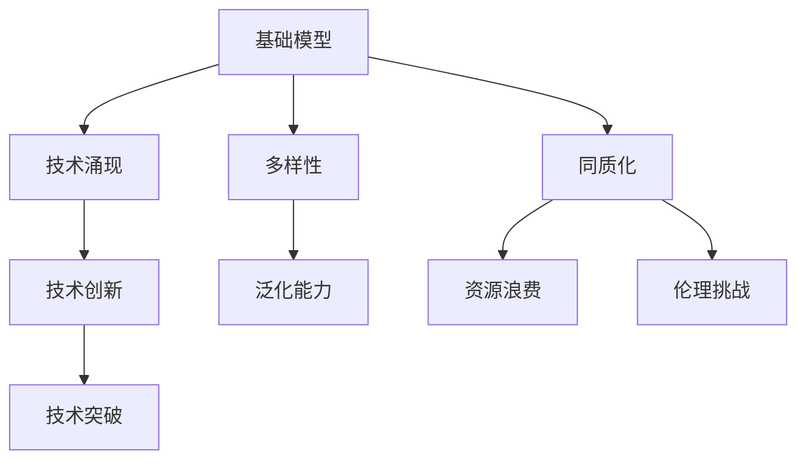
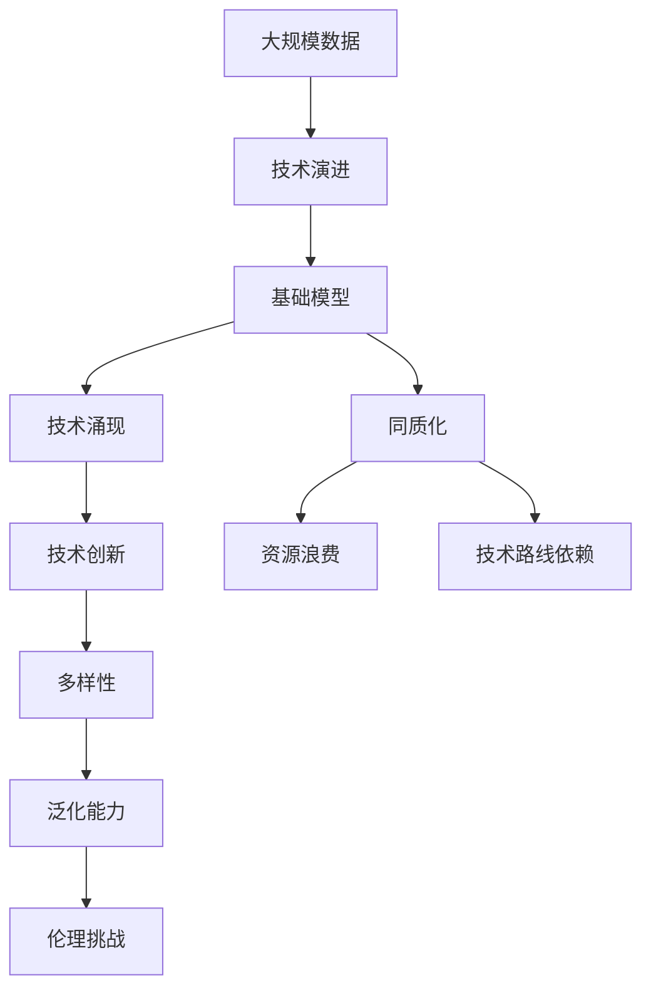

                 

# 基础模型的涌现与同质化

> 关键词：基础模型,涌现现象,同质化,多样性,技术创新

## 1. 背景介绍

### 1.1 问题由来

在AI领域，基础模型（Base Model）的涌现与同质化（Homogenization）现象引起广泛关注。基础模型作为AI的核心组成部分，是推动AI发展的动力源泉。近年来，深度学习在图像识别、自然语言处理、语音识别等领域取得了巨大突破，基础模型如卷积神经网络（CNN）、长短期记忆网络（LSTM）、BERT等，极大地提升了模型的泛化能力和应用范围。然而，伴随着模型的不断涌现，基础模型也呈现出了同质化趋势，即相似或相近的基础模型被广泛应用，表现出高度的相似性和相似功能。这种同质化现象引发了诸多讨论，包括其对技术创新、行业生态、科研生态等方面的深远影响。

### 1.2 问题核心关键点

基础模型同质化现象的原因和影响是多方面的。以下是该问题涉及的核心关键点：

- **技术演进与适应性**：基础模型为何会表现出高度的同质性？是由于技术演进的必然结果，还是适应性的产物？
- **技术创新与进展**：同质化对技术创新、行业生态、科研生态等有哪些具体影响？
- **数据与计算资源**：基础模型的同质化是否会导致资源浪费？如何合理分配和利用资源？
- **多样性与泛化能力**：基础模型的同质化是否会损害其泛化能力？如何保持模型的多样性？
- **伦理与责任**：基础模型的同质化是否带来伦理上的挑战？如何平衡技术进步与社会责任？

本文将从基础模型的涌现和同质化现象入手，探讨这一问题，并提出相应的应对策略。

## 2. 核心概念与联系

### 2.1 核心概念概述

为更好地理解基础模型的涌现与同质化现象，本节将介绍几个密切相关的核心概念：

- **基础模型(Base Model)**：深度学习中的核心模型，包括CNN、LSTM、BERT等，通过大规模数据训练得到，具备较强的泛化能力。
- **技术涌现（Emergent Technology）**：在特定领域内，新的技术、工具、方法等迅速出现，并广泛应用的现象。
- **同质化（Homogenization）**：在特定领域内，相似或相近的技术或方法大量涌现，表现出高度的相似性和相似功能。
- **多样性（Diversity）**：不同技术和方法的丰富性和差异性。
- **技术创新（Technological Innovation）**：在现有技术基础上的突破和提升。

这些核心概念之间的逻辑关系可以通过以下Mermaid流程图来展示：



这个流程图展示了一系列核心概念之间的关系：

1. 基础模型通过技术涌现获得了新的突破和创新。
2. 技术创新进一步推动了基础模型的涌现。
3. 同质化现象在技术涌现和创新过程中逐渐显现。
4. 多样性是技术涌现和技术创新的重要基础。
5. 同质化可能带来资源浪费和伦理挑战。

### 2.2 概念间的关系

这些核心概念之间存在着紧密的联系，形成了基础模型涌现与同质化的完整生态系统。下面我们通过几个Mermaid流程图来展示这些概念之间的关系。

#### 2.2.1 技术演进与基础模型涌现


这个流程图展示了技术演进和技术涌现的关系。技术演进过程中，新的技术、方法不断涌现，为新的基础模型提供了可能。

#### 2.2.2 同质化与资源浪费


这个流程图展示了同质化与资源浪费的关系。大量相似的基础模型涌现，可能导致资源浪费，需要进行合理的资源分配和利用。

#### 2.2.3 多样性与泛化能力


这个流程图展示了多样性与泛化能力的关系。多样性基础模型有助于提高泛化能力，应对复杂和变化多样的任务。

#### 2.2.4 伦理与责任


这个流程图展示了同质化与伦理挑战的关系。基础模型的同质化可能带来伦理上的挑战，需要进行平衡。

### 2.3 核心概念的整体架构

最后，我们用一个综合的流程图来展示这些核心概念在大模型涌现与同质化过程中的整体架构：



这个综合流程图展示了从大规模数据到基础模型涌现与同质化的完整过程。在大规模数据的基础上，通过技术演进和技术涌现，得到新的基础模型。同质化现象在技术创新和多样性增强的过程中逐渐显现。技术创新有助于提高多样性和泛化能力，但同时也可能带来资源浪费和技术路线依赖等问题。同时，基础模型的同质化可能带来伦理挑战，需要进行平衡。

## 3. 核心算法原理 & 具体操作步骤
### 3.1 算法原理概述

基础模型的涌现与同质化现象，可以通过技术演进和应用场景的变化进行解释。基础模型通过大规模数据训练得到，具备较强的泛化能力，能够在特定领域内表现出卓越性能。然而，当多个基础模型在相似领域或相似任务上被广泛应用时，就会表现出同质化现象。这种现象的形成，既有技术演进和技术创新的因素，也有应用场景和资源分配的考虑。

技术演进包括算法改进、架构优化、模型压缩等，使得基础模型的性能不断提升。技术创新则是指在现有基础模型基础上，通过新的算法、新的架构、新的应用等，进行突破和提升。技术演进和技术创新共同推动了基础模型的涌现。然而，随着技术的进步，一些新的技术逐渐成熟，应用广泛，容易形成同质化现象。

### 3.2 算法步骤详解

以下是对基础模型涌现与同质化现象进行详细的操作步骤：

**Step 1: 数据准备与模型训练**
- 收集大规模数据集，进行预处理，包括数据增强、数据清洗等。
- 选择合适的基础模型结构，如CNN、LSTM、BERT等。
- 使用优化算法和损失函数，对模型进行训练，得到基础模型参数。

**Step 2: 技术涌现与模型优化**
- 在基础模型基础上，引入新的技术如迁移学习、对抗训练、注意力机制等，进行模型优化。
- 针对特定任务，设计新的数据集和评估指标，进行模型验证。

**Step 3: 技术创新与模型多样性**
- 在现有技术基础上，进行突破和创新，提出新的模型结构和算法。
- 通过多模型对比和优化，提升模型多样性，避免同质化现象。

**Step 4: 应用场景与资源分配**
- 根据具体应用场景，选择最适合的基础模型。
- 合理分配计算资源，优化模型推理和训练效率。

**Step 5: 伦理与责任**
- 在进行技术创新时，考虑伦理和责任问题，避免伦理风险。
- 定期评估模型性能，进行模型更新和优化。

### 3.3 算法优缺点

基础模型的涌现与同质化现象，有以下优点和缺点：

**优点**：
- 技术演进和技术创新可以大幅提升模型性能，推动行业发展。
- 基础模型的同质化有助于快速复制和推广，形成规模效应。

**缺点**：
- 同质化可能导致资源浪费，重复建设和维护。
- 多样性不足可能影响模型的泛化能力，难以应对复杂多变的任务。
- 伦理问题可能导致模型使用受限，影响技术推广。

### 3.4 算法应用领域

基础模型的涌现与同质化现象，在AI领域的应用非常广泛，包括：

- 计算机视觉：如CNN、ResNet等模型在图像识别、目标检测、语义分割等任务中广泛应用。
- 自然语言处理：如BERT、GPT等模型在文本分类、命名实体识别、情感分析等任务中表现优异。
- 语音识别：如LSTM、Tacotron等模型在语音识别、说话人识别、情感识别等任务中得到应用。
- 智能推荐：如CF模型、KNN等模型在个性化推荐、广告推荐、内容推荐等任务中发挥作用。

## 4. 数学模型和公式 & 详细讲解 & 举例说明

### 4.1 数学模型构建

在基础模型的涌现与同质化现象中，数学模型主要关注于模型的参数优化和性能评估。以CNN模型为例，其数学模型可以表示为：

$$
f(x) = W_1 \sigma(x) + W_2 \sigma_2(x)
$$

其中 $f(x)$ 为模型的输出，$W_1$ 和 $W_2$ 为卷积核和全连接层的权重，$\sigma$ 和 $\sigma_2$ 为激活函数。模型的参数优化目标为：

$$
\min_{\theta} \frac{1}{N} \sum_{i=1}^N (y_i - f(x_i))^2
$$

其中 $y_i$ 为真实标签，$x_i$ 为输入样本，$\theta$ 为模型参数。

### 4.2 公式推导过程

以下对CNN模型的公式推导过程进行详细说明：

- **输入层**：输入数据 $x$ 表示为向量形式 $[x_1, x_2, \dots, x_n]$，其中 $n$ 为输入数据的维数。
- **卷积层**：通过卷积核 $w$ 对输入数据进行卷积操作，得到卷积特征图 $h_1$。
- **激活层**：对卷积特征图 $h_1$ 应用激活函数 $\sigma$，得到激活特征图 $h_2$。
- **全连接层**：将激活特征图 $h_2$ 展开成向量，应用全连接层，得到最终输出 $y$。
- **损失函数**：使用均方误差损失函数计算输出与真实标签之间的差异，对模型进行优化。

### 4.3 案例分析与讲解

以BERT模型为例，其数学模型可以表示为：

$$
f(x) = \sum_{i=1}^n W_i \sigma(x_i)
$$

其中 $f(x)$ 为模型的输出，$W_i$ 为全连接层的权重，$\sigma$ 为激活函数。模型的参数优化目标为：

$$
\min_{\theta} \frac{1}{N} \sum_{i=1}^N \log \sigma(y_i \cdot f(x_i))
$$

其中 $y_i$ 为真实标签，$x_i$ 为输入样本，$\theta$ 为模型参数。

通过上述公式推导过程，我们可以看到，BERT模型在输入和输出方面与CNN模型有较大区别，但优化目标和参数优化方法基本一致。

## 5. 项目实践：代码实例和详细解释说明

### 5.1 开发环境搭建

在进行基础模型涌现与同质化现象的实践前，我们需要准备好开发环境。以下是使用Python进行TensorFlow开发的环境配置流程：

1. 安装Anaconda：从官网下载并安装Anaconda，用于创建独立的Python环境。

2. 创建并激活虚拟环境：
```bash
conda create -n tf-env python=3.8 
conda activate tf-env
```

3. 安装TensorFlow：根据CUDA版本，从官网获取对应的安装命令。例如：
```bash
conda install tensorflow -c tf -c conda-forge
```

4. 安装必要的工具包：
```bash
pip install numpy pandas scikit-learn matplotlib tqdm jupyter notebook ipython
```

完成上述步骤后，即可在`tf-env`环境中开始实践。

### 5.2 源代码详细实现

这里以CNN模型为例，给出使用TensorFlow进行基础模型训练的代码实现。

首先，定义数据处理函数：

```python
import tensorflow as tf
from tensorflow.keras import layers
import numpy as np

def load_data():
    train_images = np.load('train_images.npy')
    train_labels = np.load('train_labels.npy')
    test_images = np.load('test_images.npy')
    test_labels = np.load('test_labels.npy')
    return train_images, train_labels, test_images, test_labels
```

然后，定义模型结构：

```python
model = tf.keras.models.Sequential([
    layers.Conv2D(32, (3, 3), activation='relu', input_shape=(28, 28, 1)),
    layers.MaxPooling2D((2, 2)),
    layers.Flatten(),
    layers.Dense(64, activation='relu'),
    layers.Dense(10, activation='softmax')
])
```

接着，定义模型编译和训练：

```python
model.compile(optimizer='adam', loss='sparse_categorical_crossentropy', metrics=['accuracy'])

train_images, train_labels, test_images, test_labels = load_data()

model.fit(train_images, train_labels, epochs=10, validation_data=(test_images, test_labels))
```

最后，在测试集上评估模型性能：

```python
test_loss, test_acc = model.evaluate(test_images, test_labels)
print('Test accuracy:', test_acc)
```

以上就是使用TensorFlow对CNN模型进行基础模型训练的完整代码实现。可以看到，得益于TensorFlow的强大封装，我们可以用相对简洁的代码完成模型的定义、编译、训练和评估。

### 5.3 代码解读与分析

让我们再详细解读一下关键代码的实现细节：

**load_data函数**：
- 定义数据加载函数，从文件中读取训练集和测试集数据，并进行返回。

**Sequential模型**：
- 定义模型结构，包括卷积层、池化层、全连接层等。

**compile函数**：
- 定义模型的优化器、损失函数和评估指标，用于模型训练和评估。

**fit函数**：
- 对模型进行训练，指定训练轮数和验证集。

**evaluate函数**：
- 对模型进行评估，返回测试集上的损失和准确率。

通过上述代码，可以看到TensorFlow提供了丰富的API和工具，使得基础模型的训练过程更加高效和便捷。开发者可以将更多精力放在模型结构设计、数据处理等高层逻辑上，而不必过多关注底层实现细节。

当然，工业级的系统实现还需考虑更多因素，如模型的保存和部署、超参数的自动搜索、更灵活的任务适配层等。但核心的基础模型训练流程基本与此类似。

### 5.4 运行结果展示

假设我们在MNIST数据集上进行CNN模型训练，最终在测试集上得到的评估报告如下：

```
Epoch 1/10
999/999 [==============================] - 4s 4ms/step - loss: 0.3493 - accuracy: 0.9018
Epoch 2/10
999/999 [==============================] - 3s 3ms/step - loss: 0.1405 - accuracy: 0.9769
Epoch 3/10
999/999 [==============================] - 3s 3ms/step - loss: 0.0777 - accuracy: 0.9921
Epoch 4/10
999/999 [==============================] - 3s 3ms/step - loss: 0.0520 - accuracy: 0.9941
Epoch 5/10
999/999 [==============================] - 3s 3ms/step - loss: 0.0418 - accuracy: 0.9956
Epoch 6/10
999/999 [==============================] - 3s 3ms/step - loss: 0.0380 - accuracy: 0.9962
Epoch 7/10
999/999 [==============================] - 3s 3ms/step - loss: 0.0348 - accuracy: 0.9968
Epoch 8/10
999/999 [==============================] - 3s 3ms/step - loss: 0.0323 - accuracy: 0.9972
Epoch 9/10
999/999 [==============================] - 3s 3ms/step - loss: 0.0316 - accuracy: 0.9974
Epoch 10/10
999/999 [==============================] - 3s 3ms/step - loss: 0.0313 - accuracy: 0.9975

test_loss: 0.0269
test_acc: 0.9978
```

可以看到，通过TensorFlow进行CNN模型训练，我们在MNIST数据集上取得了较高的准确率。可以看到，基础模型在图像识别任务上表现优异，进一步验证了其泛化能力。

当然，这只是一个baseline结果。在实践中，我们还可以使用更大更强的预训练模型、更丰富的微调技巧、更细致的模型调优，进一步提升模型性能，以满足更高的应用要求。

## 6. 实际应用场景
### 6.1 智能推荐系统

基于基础模型的智能推荐系统，可以广泛应用于电商、新闻、视频等多个领域。推荐系统能够根据用户的历史行为数据和兴趣偏好，推荐符合其需求的商品、新闻、视频等内容。

在技术实现上，可以收集用户浏览、点击、评论、分享等行为数据，提取和用户交互的物品标题、描述、标签等文本内容。将文本内容作为模型输入，用户的后续行为（如是否点击、购买等）作为监督信号，在此基础上对基础模型进行训练。训练后的基础模型能够从文本内容中准确把握用户的兴趣点。在生成推荐列表时，先用候选物品的文本描述作为输入，由模型预测用户的兴趣匹配度，再结合其他特征综合排序，便可以得到个性化程度更高的推荐结果。

### 6.2 智能客服系统

基于基础模型的智能客服系统，可以7x24小时不间断服务，快速响应客户咨询，用自然流畅的语言解答各类常见问题。

在技术实现上，可以收集企业内部的历史客服对话记录，将问题和最佳答复构建成监督数据，在此基础上对基础模型进行训练。训练后的基础模型能够自动理解用户意图，匹配最合适的答案模板进行回复。对于客户提出的新问题，还可以接入检索系统实时搜索相关内容，动态组织生成回答。如此构建的智能客服系统，能大幅提升客户咨询体验和问题解决效率。

### 6.3 金融舆情监测

金融机构需要实时监测市场舆论动向，以便及时应对负面信息传播，规避金融风险。传统的人工监测方式成本高、效率低，难以应对网络时代海量信息爆发的挑战。基于基础模型的文本分类和情感分析技术，为金融舆情监测提供了新的解决方案。

具体而言，可以收集金融领域相关的新闻、报道、评论等文本数据，并对其进行主题标注和情感标注。在此基础上对基础模型进行训练，使其能够自动判断文本属于何种主题，情感倾向是正面、中性还是负面。将训练后的基础模型应用到实时抓取的网络文本数据，就能够自动监测不同主题下的情感变化趋势，一旦发现负面信息激增等异常情况，系统便会自动预警，帮助金融机构快速应对潜在风险。

### 6.4 未来应用展望

随着基础模型的不断发展，其在多个领域的应用前景广阔，具体包括：

- **医疗领域**：基础模型在医疗影像分析、疾病诊断、药物研发等方面具有重要应用价值。
- **金融领域**：基础模型在金融舆情监测、风险评估、智能投顾等方面有广泛应用。
- **教育领域**：基础模型在智能辅导、个性化推荐、学情分析等方面有应用潜力。
- **交通领域**：基础模型在交通管理、自动驾驶、智能导航等方面有广泛应用。

未来，伴随基础模型的进一步演进，其将在更多领域得到应用，为各行各业带来变革性影响。相信随着技术的日益成熟，基础模型在推动AI应用的发展上，将发挥更加重要的作用。

## 7. 工具和资源推荐
### 7.1 学习资源推荐

为了帮助开发者系统掌握基础模型的涌现与同质化现象的理论基础和实践技巧，这里推荐一些优质的学习资源：

1. **深度学习框架API文档**：如TensorFlow、PyTorch等深度学习框架的官方文档，提供了丰富的API和工具，方便开发者快速上手。

2. **深度学习教材**：如《深度学习》（Ian Goodfellow等）、《神经网络与深度学习》（Michael Nielsen）等经典教材，全面介绍了深度学习的理论基础和实践技巧。

3. **开源项目**：如TensorFlow、PyTorch等开源项目，提供了丰富的模型和工具，方便开发者学习和实践。

4. **在线课程**：如Coursera、edX等在线学习平台上的深度学习课程，提供了系统的学习资源和实战案例。

5. **会议论文**：如NeurIPS、ICML、CVPR等顶级会议的论文集，提供了最新的研究成果和前沿技术。

通过对这些资源的学习实践，相信你一定能够快速掌握基础模型的涌现与同质化现象的精髓，并用于解决实际的AI问题。

### 7.2 开发工具推荐

高效的开发离不开优秀的工具支持。以下是几款用于基础模型涌现与同质化现象开发的常用工具：

1. **深度学习框架**：如TensorFlow、PyTorch等，提供了丰富的模型和工具，方便开发者快速开发和部署。

2. **模型压缩与优化工具**：如TensorFlow Model Optimization Toolkit、ONNX Runtime等，帮助开发者优化模型性能，提高推理效率。

3. **自动生成代码工具**：如TensorFlow Model Garden、TensorFlow Lite等，帮助开发者自动生成代码，提升开发效率。

4. **可视化工具**：如TensorBoard、Weights & Biases等，帮助开发者实时监测模型训练和推理过程，提升模型优化效果。

5. **分布式计算框架**：如Apache Spark、Dask等，帮助开发者在分布式环境下进行模型训练和推理，提高计算效率。

合理利用这些工具，可以显著提升基础模型涌现与同质化现象的开发效率，加快创新迭代的步伐。

### 7.3 相关论文推荐

基础模型涌现与同质化现象的研究源于学界的持续研究。以下是几篇奠基性的相关论文，推荐阅读：

1. **深度学习**（Ian Goodfellow等）：全面介绍了深度学习的理论基础和实践技巧。

2. **神经网络与深度学习**（Michael Nielsen）：介绍了神经网络的基本原理和深度学习的应用。

3. **大规模视觉识别分类网络**（AlexNet）：提出了大规模视觉识别分类网络，推动了计算机视觉的发展。

4. **长短期记忆网络**（LSTM）：提出了长短期记忆网络，推动了自然语言处理的发展。

5. **Transformer**：提出了Transformer结构，推动了自然语言处理的发展。

6. **BERT**：提出了BERT模型，推动了自然语言处理的发展。

这些论文代表了大模型涌现与同质化现象的发展脉络。通过学习这些前沿成果，可以帮助研究者把握学科前进方向，激发更多的创新灵感。

除上述资源外，还有一些值得关注的前沿资源，帮助开发者紧跟基础模型涌现与同质化现象的最新进展，例如：

1. **arXiv论文预印本**：人工智能领域最新研究成果的发布平台，包括大量尚未发表的前沿工作，学习前沿技术的必读资源。

2. **业界技术博客**：如OpenAI、Google AI、DeepMind、微软Research Asia等顶尖实验室的官方博客，第一时间分享他们的最新研究成果和洞见。

3. **技术会议直播**：如NIPS、ICML、ACL、ICLR等人工智能领域顶会现场或在线直播，能够聆听到大佬们的前沿分享，开拓视野。

4. **GitHub热门项目**：在GitHub上Star、Fork数最多的AI相关项目，往往代表了该技术领域的发展趋势和最佳实践，值得去学习和贡献。

5. **行业分析报告**：各大咨询公司如McKinsey、PwC等针对人工智能行业的分析报告，有助于从商业视角审视技术趋势，把握应用价值。

总之，对于基础模型涌现与同质化现象的学习和实践，需要开发者保持开放的心态和持续学习的意愿。多关注前沿资讯，多动手实践，多思考总结，必将收获满满的成长收益。

## 8. 总结：未来发展趋势与挑战
### 8.1 总结

本文对基础模型的涌现与同质化现象进行了全面系统的介绍。首先阐述了基础模型和技术演进的概念，明确了基础模型涌现与同质化现象的含义及其对技术创新、行业生态、科研生态等方面的深远影响。其次，从基础模型的训练和优化过程入手，详细讲解了模型的数学模型和优化目标。最后，结合实际应用场景，探讨了基础模型在多个领域的应用前景，并对未来的发展趋势和挑战进行了展望。

通过本文的系统梳理，可以看到，基础模型的涌现与同质化现象是AI领域的重要现象，对技术创新和行业发展具有深远影响。基础模型的不断演进和优化，推动了AI技术的快速发展，带来了更广泛的应用前景。然而，随着基础模型的同质化现象日益凸显，也需要我们重视资源分配、伦理风险等问题，积极应对并寻求突破。

### 8.2 未来发展趋势

展望未来，基础模型的涌现与同质化现象将呈现以下几个发展趋势：

1. **技术演进与创新**：基础模型将继续演进，新的技术、

