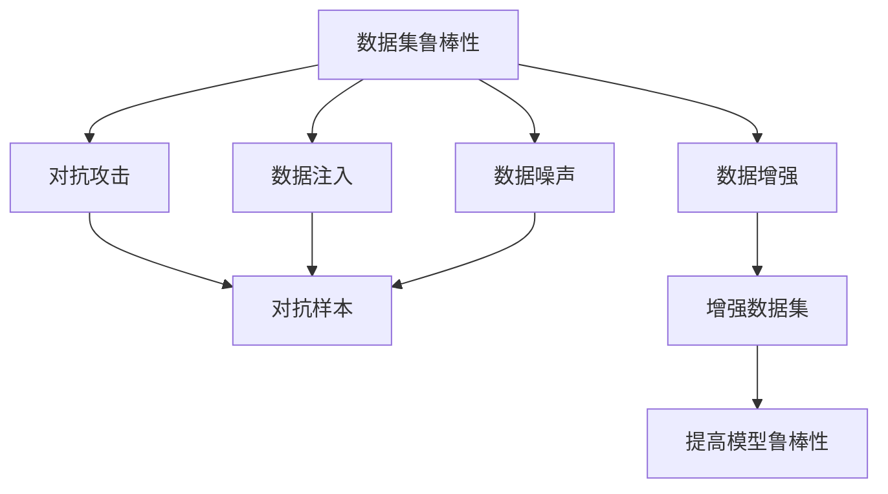
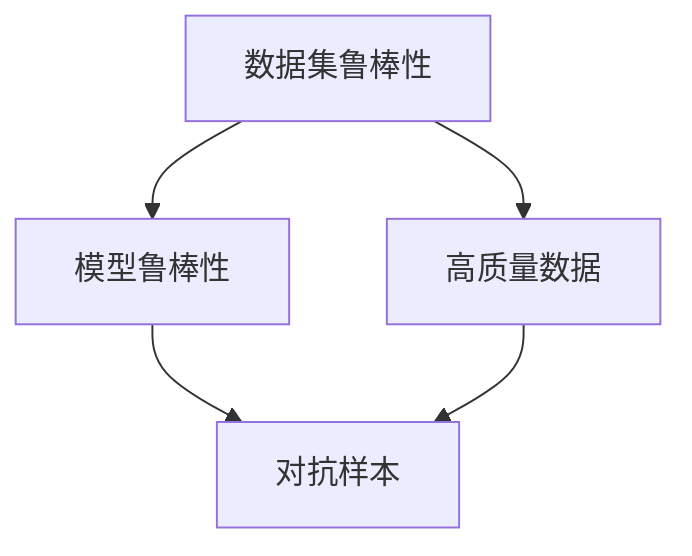
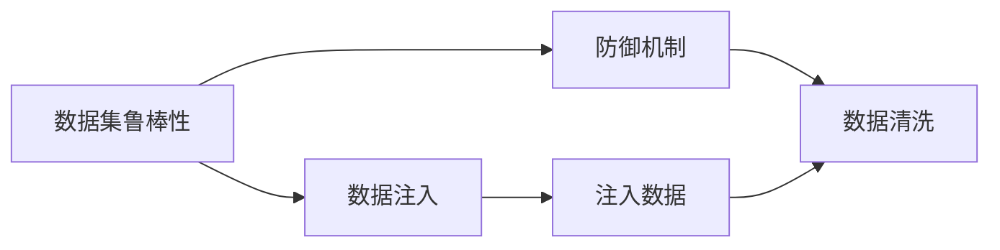
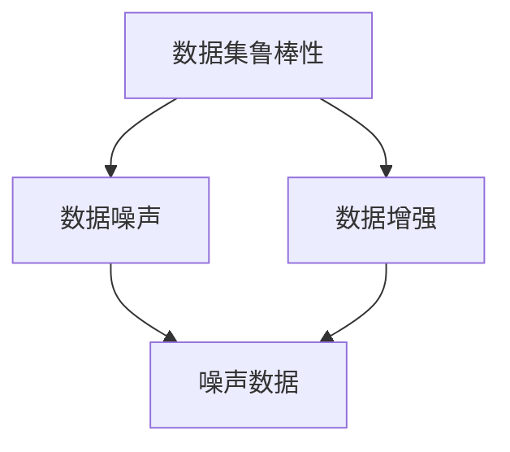
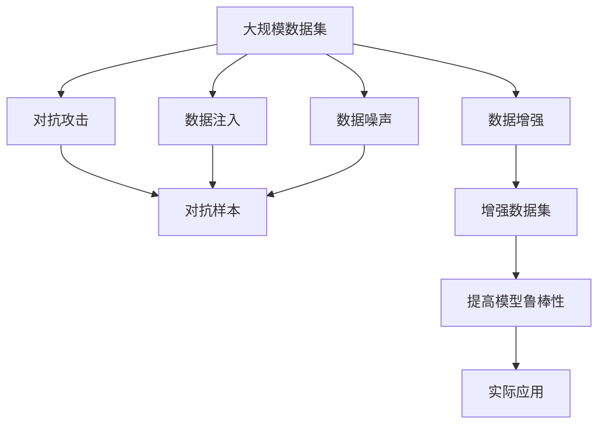

                 

# 数据集鲁棒性:软件2.0的鲁棒性新考验

> 关键词：数据集鲁棒性,软件2.0,机器学习,深度学习,模型鲁棒性,对抗攻击,数据增强

## 1. 背景介绍

### 1.1 问题由来
在软件2.0时代，数据集的质量和数量变得愈发重要。作为人工智能系统（如机器学习和深度学习模型）的核心输入，数据集在训练和评估模型的过程中扮演着关键角色。然而，随着攻击手段的日益复杂和多样化，如何确保数据集的鲁棒性，成为软件2.0发展中的一个新挑战。

### 1.2 问题核心关键点
数据集鲁棒性（Data Robustness），即数据集能够抵御各种攻击的能力。这些攻击包括但不限于数据注入（Data Injection）、对抗样本（Adversarial Samples）、数据噪声（Noisy Data）等。数据集的鲁棒性直接影响到模型的泛化能力、预测准确率和安全性。

数据集鲁棒性是软件2.0时代必须关注的核心问题之一。其关键点包括：
1. 数据质量：数据的完整性、一致性和可靠性。
2. 数据来源：数据的获取方式和渠道，是否存在数据注入攻击。
3. 数据多样性：数据的多样性和覆盖范围，是否存在样本偏差。
4. 数据安全性：数据的安全性和隐私保护，是否存在数据泄露风险。

### 1.3 问题研究意义
数据集鲁棒性研究具有重要的意义，主要体现在以下几个方面：

1. 提升模型鲁棒性：高质量、鲁棒的数据集能够有效提升模型的泛化能力和鲁棒性，避免模型在未知数据上的性能下降。
2. 保障模型安全性：鲁棒的数据集能够防范对抗攻击，提高模型的安全性。
3. 促进公平性：减少数据偏差，避免模型在特定群体上的不公平性。
4. 加速算法优化：通过改进数据集，促进模型和算法的优化与创新。

## 2. 核心概念与联系

### 2.1 核心概念概述

为更好地理解数据集鲁棒性，本节将介绍几个密切相关的核心概念：

- **数据集鲁棒性（Data Robustness）**：指数据集能够抵抗各种攻击，保持其质量和可靠性的能力。

- **对抗攻击（Adversarial Attacks）**：指攻击者对模型输入进行微小的扰动，导致模型输出错误结果的攻击方式，如对抗样本。

- **数据注入（Data Injection）**：指攻击者将恶意数据或噪声注入到模型训练数据中，影响模型的正常训练过程。

- **数据噪声（Noisy Data）**：指数据集中存在的不确定性和干扰，如数据偏差、缺失值、异常值等。

- **数据增强（Data Augmentation）**：指通过对原始数据进行变换和扩充，增强数据集的多样性和覆盖范围，提高模型的泛化能力。

- **模型鲁棒性（Model Robustness）**：指模型在面对攻击和噪声数据时的稳定性和可靠性，即模型能够正确处理数据扰动并产生正确的输出。

这些核心概念之间的逻辑关系可以通过以下Mermaid流程图来展示：



这个流程图展示了大数据集鲁棒性的核心概念及其之间的关系：

1. 数据集鲁棒性通过防御对抗攻击、处理数据注入和噪声、进行数据增强等手段，提升数据集的质量和多样性。
2. 高质量、鲁棒的数据集能够提高模型的鲁棒性，使其在面对对抗攻击和噪声数据时仍能产生准确的预测。

### 2.2 概念间的关系

这些核心概念之间存在着紧密的联系，形成了数据集鲁棒性的完整生态系统。下面我通过几个Mermaid流程图来展示这些概念之间的关系。

#### 2.2.1 数据集鲁棒性与模型鲁棒性的关系



这个流程图展示了数据集鲁棒性和模型鲁棒性之间的基本关系。高质量、鲁棒的数据集能够提高模型的鲁棒性，使其在面对对抗样本等攻击时仍能产生准确的预测。

#### 2.2.2 数据集鲁棒性与数据注入的关系



这个流程图展示了数据集鲁棒性和数据注入之间的防御关系。数据集鲁棒性通过建立防御机制，如数据清洗和过滤，来防止恶意数据注入攻击，确保数据集的完整性和可靠性。

#### 2.2.3 数据集鲁棒性与数据噪声的关系



这个流程图展示了数据集鲁棒性和数据噪声之间的对抗关系。数据集鲁棒性通过数据增强和处理噪声数据，来提升数据集的质量和可靠性，从而减少噪声对模型预测的影响。

### 2.3 核心概念的整体架构

最后，我们用一个综合的流程图来展示这些核心概念在大数据集鲁棒性中的整体架构：



这个综合流程图展示了从原始数据集到实际应用的全过程。大数据集鲁棒性通过防御对抗攻击、处理数据注入和噪声、进行数据增强等手段，确保数据集的质量和多样性。最终，高质量的数据集能够提高模型的鲁棒性，使其在实际应用中表现出更好的性能。

## 3. 核心算法原理 & 具体操作步骤
### 3.1 算法原理概述

数据集鲁棒性研究的核心目标是构建高质量、鲁棒的数据集，以提升模型在面对各种攻击和噪声时的鲁棒性。其核心算法原理主要包括以下几个方面：

1. **数据清洗（Data Cleaning）**：通过清洗和过滤数据，去除恶意数据和噪声，确保数据集的质量和可靠性。
2. **对抗攻击检测与防御（Adversarial Attack Detection and Defense）**：检测和防御对抗攻击，减少对抗样本对模型的影响。
3. **数据增强（Data Augmentation）**：通过增强数据集的多样性和覆盖范围，提升模型的泛化能力。
4. **模型鲁棒性优化（Model Robustness Optimization）**：通过优化模型结构、参数和训练方式，增强模型的鲁棒性。

### 3.2 算法步骤详解

以下是对数据集鲁棒性核心算法步骤的详细介绍：

**Step 1: 数据清洗**

数据清洗是数据集鲁棒性的基础步骤。其目的是去除数据集中的恶意数据和噪声，确保数据集的质量和可靠性。具体步骤如下：

1. **数据预处理**：对数据进行去重、标准化、归一化等预处理操作，确保数据的完整性和一致性。
2. **数据过滤**：通过统计分析和机器学习模型，识别和过滤异常值和离群点，减少数据噪声。
3. **数据去重**：对重复的数据进行去重处理，避免数据冗余。

**Step 2: 对抗攻击检测与防御**

对抗攻击检测与防御是数据集鲁棒性的重要环节。其目的是检测和防御对抗攻击，减少对抗样本对模型的影响。具体步骤如下：

1. **对抗样本检测**：使用对抗样本检测算法，如 adversarial_perturbation，识别数据集中的对抗样本。
2. **对抗样本防御**：使用对抗样本防御算法，如 adversarial_training，增强模型对对抗样本的鲁棒性。
3. **对抗样本生成**：使用对抗样本生成算法，如 FGSM、PGD 等，生成对抗样本并注入到数据集中，进行模型鲁棒性测试。

**Step 3: 数据增强**

数据增强是数据集鲁棒性的关键步骤。其目的是通过增强数据集的多样性和覆盖范围，提升模型的泛化能力。具体步骤如下：

1. **数据变换**：对原始数据进行变换和扩充，如旋转、翻转、缩放等。
2. **数据扩充**：通过合成和生成新数据，扩充数据集，如通过 GAN、VAE 等生成模型生成新数据。
3. **数据融合**：将不同来源和格式的数据进行融合，提升数据集的多样性和覆盖范围。

**Step 4: 模型鲁棒性优化**

模型鲁棒性优化是数据集鲁棒性的核心目标。其目的是通过优化模型结构、参数和训练方式，增强模型的鲁棒性。具体步骤如下：

1. **模型结构优化**：使用可解释性和鲁棒性强的模型结构，如 DNN、CNN、RNN 等。
2. **参数优化**：通过优化模型参数，如使用正则化、Dropout、Batch Normalization 等技术，增强模型的鲁棒性。
3. **训练方式优化**：使用对抗训练、自监督学习、迁移学习等训练方式，提升模型的鲁棒性。

### 3.3 算法优缺点

数据集鲁棒性研究的主要算法具有以下优缺点：

**优点：**

1. **提高模型鲁棒性**：通过清洗和过滤数据，检测和防御对抗攻击，增强数据集的多样性和覆盖范围，提升模型的泛化能力和鲁棒性。
2. **减少数据偏差**：通过处理数据注入和噪声，减少数据偏差，提升模型的公平性和稳定性。
3. **提升模型性能**：通过数据增强和模型鲁棒性优化，提升模型的性能和应用效果。

**缺点：**

1. **复杂度较高**：数据清洗和处理、对抗攻击检测和防御、数据增强和模型鲁棒性优化等步骤，都需要复杂的算法和大量的计算资源。
2. **数据隐私风险**：处理和增强数据集时，可能会涉及数据隐私和安全问题，需要额外的隐私保护措施。
3. **过度增强可能导致过拟合**：数据增强和对抗训练等手段，可能导致模型过拟合，降低模型泛化能力。

### 3.4 算法应用领域

数据集鲁棒性算法主要应用于以下几个领域：

1. **图像识别**：在图像识别领域，对抗攻击和数据噪声是常见的威胁，数据集鲁棒性算法可以提升模型的鲁棒性和泛化能力。
2. **自然语言处理**：在自然语言处理领域，对抗攻击和数据噪声也存在一定的威胁，数据集鲁棒性算法可以有效提升模型的鲁棒性和泛化能力。
3. **医疗诊断**：在医疗诊断领域，数据注入和噪声数据可能会严重影响模型的诊断结果，数据集鲁棒性算法可以有效提升模型的鲁棒性和稳定性。
4. **金融风险管理**：在金融风险管理领域，对抗攻击和数据噪声可能导致模型预测结果错误，数据集鲁棒性算法可以有效提升模型的鲁棒性和可靠性。
5. **智能交通系统**：在智能交通系统领域，对抗攻击和数据噪声可能导致系统预测错误，数据集鲁棒性算法可以有效提升系统的鲁棒性和可靠性。

## 4. 数学模型和公式 & 详细讲解 & 举例说明

### 4.1 数学模型构建

数据集鲁棒性研究涉及多个数学模型和公式。本节将详细介绍这些模型的构建。

**对抗样本检测模型**

对抗样本检测模型用于检测数据集中的对抗样本。其数学模型可以表示为：

$$
\min_{x} \max_{\delta} L(f(x+\delta),y)
$$

其中，$x$ 表示输入数据，$\delta$ 表示对抗样本的扰动，$L$ 表示损失函数，$y$ 表示真实标签。目标是最小化模型在原始数据 $x$ 上的损失 $L$，同时最大化对抗样本 $x+\delta$ 的损失 $L$。

**对抗样本防御模型**

对抗样本防御模型用于增强模型对对抗样本的鲁棒性。其数学模型可以表示为：

$$
\min_{\theta} \mathbb{E}_{(x,y)} [L(f(x;\theta),y)]
$$

其中，$\theta$ 表示模型参数，$L$ 表示损失函数，$x$ 表示输入数据，$y$ 表示真实标签。目标是最小化模型在原始数据 $x$ 上的损失 $L$。

**数据增强模型**

数据增强模型用于增强数据集的多样性和覆盖范围。其数学模型可以表示为：

$$
\min_{x} \max_{t} \|\mathcal{T}_t(x) - x\|
$$

其中，$\mathcal{T}_t$ 表示数据增强变换，$x$ 表示原始数据。目标是最小化数据增强后的数据 $\mathcal{T}_t(x)$ 与原始数据 $x$ 的距离。

**模型鲁棒性优化模型**

模型鲁棒性优化模型用于优化模型结构、参数和训练方式，增强模型的鲁棒性。其数学模型可以表示为：

$$
\min_{\theta} \mathbb{E}_{(x,y)} [L(f(x;\theta),y)]
$$

其中，$\theta$ 表示模型参数，$L$ 表示损失函数，$x$ 表示输入数据，$y$ 表示真实标签。目标是最小化模型在原始数据 $x$ 上的损失 $L$。

### 4.2 公式推导过程

以下是对数据集鲁棒性核心模型公式的推导过程。

**对抗样本检测模型公式推导**

对抗样本检测模型用于检测数据集中的对抗样本。其目标是最小化模型在原始数据 $x$ 上的损失 $L$，同时最大化对抗样本 $x+\delta$ 的损失 $L$。假设模型为 $f(x;\theta)$，其数学模型可以表示为：

$$
\min_{x} \max_{\delta} L(f(x+\delta),y)
$$

其中，$L$ 表示损失函数，$y$ 表示真实标签。对上述模型进行推导，得到：

$$
\min_{x} \max_{\delta} [f(x+\delta;\theta) - y]^2
$$

令 $f(x+\delta;\theta) = y$，则有：

$$
\min_{x} \max_{\delta} [f(x+\delta;\theta) - f(x;\theta)] = \min_{x} \max_{\delta} [\delta]^2
$$

目标是最小化 $f(x+\delta;\theta)$ 与 $f(x;\theta)$ 的距离，同时最大化对抗样本的扰动 $\delta$。通过优化上述公式，可以有效检测数据集中的对抗样本。

**对抗样本防御模型公式推导**

对抗样本防御模型用于增强模型对对抗样本的鲁棒性。其目标是最小化模型在原始数据 $x$ 上的损失 $L$。假设模型为 $f(x;\theta)$，其数学模型可以表示为：

$$
\min_{\theta} \mathbb{E}_{(x,y)} [L(f(x;\theta),y)]
$$

其中，$L$ 表示损失函数，$x$ 表示输入数据，$y$ 表示真实标签。对上述模型进行推导，得到：

$$
\min_{\theta} \mathbb{E}_{(x,y)} [L(f(x;\theta),y)] = \min_{\theta} \mathbb{E}_{(x,y)} [(f(x;\theta) - y)^2]
$$

目标是最小化模型在原始数据 $x$ 上的损失 $L$。通过优化上述公式，可以有效增强模型对对抗样本的鲁棒性。

**数据增强模型公式推导**

数据增强模型用于增强数据集的多样性和覆盖范围。其目标是最小化数据增强后的数据 $\mathcal{T}_t(x)$ 与原始数据 $x$ 的距离。假设数据增强变换为 $\mathcal{T}_t$，其数学模型可以表示为：

$$
\min_{x} \max_{t} \|\mathcal{T}_t(x) - x\|
$$

其中，$\mathcal{T}_t$ 表示数据增强变换，$x$ 表示原始数据。对上述模型进行推导，得到：

$$
\min_{x} \max_{t} \|\mathcal{T}_t(x) - x\| = \min_{x} \max_{t} \|\mathcal{T}_t(x) - x\|
$$

目标是最小化数据增强后的数据 $\mathcal{T}_t(x)$ 与原始数据 $x$ 的距离。通过优化上述公式，可以有效增强数据集的多样性和覆盖范围。

**模型鲁棒性优化模型公式推导**

模型鲁棒性优化模型用于优化模型结构、参数和训练方式，增强模型的鲁棒性。其目标是最小化模型在原始数据 $x$ 上的损失 $L$。假设模型为 $f(x;\theta)$，其数学模型可以表示为：

$$
\min_{\theta} \mathbb{E}_{(x,y)} [L(f(x;\theta),y)]
$$

其中，$L$ 表示损失函数，$x$ 表示输入数据，$y$ 表示真实标签。对上述模型进行推导，得到：

$$
\min_{\theta} \mathbb{E}_{(x,y)} [L(f(x;\theta),y)] = \min_{\theta} \mathbb{E}_{(x,y)} [(f(x;\theta) - y)^2]
$$

目标是最小化模型在原始数据 $x$ 上的损失 $L$。通过优化上述公式，可以有效增强模型的鲁棒性。

### 4.3 案例分析与讲解

以下是对数据集鲁棒性核心模型在实际应用中的案例分析。

**案例1: 对抗样本检测**

假设我们有一组原始数据集，包含正常的正面和负面样本。其中，一些样本可能被攻击者扰动，变为对抗样本。我们需要检测这些对抗样本，并将其剔除。使用对抗样本检测模型，可以得到以下结果：

1. 将原始数据集 $X$ 输入模型，得到对抗样本检测结果 $Y$。
2. 根据对抗样本检测结果 $Y$，标记数据集 $X$ 中的对抗样本。
3. 将标记后的数据集 $X$ 进行清洗，去除对抗样本。
4. 将清洗后的数据集 $X$ 用于模型训练，提升模型鲁棒性。

**案例2: 对抗样本防御**

假设我们有一组对抗样本，试图欺骗模型产生错误预测。我们需要增强模型对对抗样本的鲁棒性，避免其对模型预测结果的影响。使用对抗样本防御模型，可以得到以下结果：

1. 将对抗样本 $X$ 输入模型，得到对抗样本防御结果 $Y$。
2. 根据对抗样本防御结果 $Y$，调整模型参数 $\theta$。
3. 将调整后的模型参数 $\theta$ 应用于原始数据集 $X$，训练模型。
4. 将训练后的模型应用于实际预测，提升模型鲁棒性。

**案例3: 数据增强**

假设我们有一组原始数据集，包含图像、文本等不同格式的数据。我们需要增强数据集的多样性和覆盖范围，提升模型的泛化能力。使用数据增强模型，可以得到以下结果：

1. 将原始数据集 $X$ 输入数据增强模型，得到增强后的数据集 $Y$。
2. 根据增强后的数据集 $Y$，进行模型训练，提升模型泛化能力。
3. 将训练后的模型应用于实际预测，提升模型鲁棒性。

**案例4: 模型鲁棒性优化**

假设我们有一组原始数据集，包含不同类型的图像和文本。我们需要优化模型结构、参数和训练方式，提升模型的鲁棒性。使用模型鲁棒性优化模型，可以得到以下结果：

1. 将原始数据集 $X$ 输入模型鲁棒性优化模型，得到优化后的模型参数 $\theta$。
2. 根据优化后的模型参数 $\theta$，进行模型训练，提升模型鲁棒性。
3. 将训练后的模型应用于实际预测，提升模型性能。

## 5. 项目实践：代码实例和详细解释说明

### 5.1 开发环境搭建

在进行数据集鲁棒性实践前，我们需要准备好开发环境。以下是使用Python进行PyTorch开发的环境配置流程：

1. 安装Anaconda：从官网下载并安装Anaconda，用于创建独立的Python环境。

2. 创建并激活虚拟环境：
```bash
conda create -n pytorch-env python=3.8 
conda activate pytorch-env
```

3. 安装PyTorch：根据CUDA版本，从官网获取对应的安装命令。例如：
```bash
conda install pytorch torchvision torchaudio cudatoolkit=11.1 -c pytorch -c conda-forge
```

4. 安装Transformers库：
```bash
pip install transformers
```

5. 安装各类工具包：
```bash
pip install numpy pandas scikit-learn matplotlib tqdm jupyter notebook ipython
```

完成上述步骤后，即可在`pytorch-env`环境中开始数据集鲁棒性实践。

### 5.2 源代码详细实现

这里我们以对抗样本检测为例，给出使用Transformers库对BERT模型进行对抗样本检测的PyTorch代码实现。

首先，定义对抗样本检测函数：

```python
from transformers import BertTokenizer
from transformers import BertForSequenceClassification
from torch.utils.data import Dataset, DataLoader
from sklearn.metrics import classification_report
from torch import nn, optim

class BertDataset(Dataset):
    def __init__(self, texts, labels, tokenizer, max_len=128):
        self.texts = texts
        self.labels = labels
        self.tokenizer = tokenizer
        self.max_len = max_len
        
    def __len__(self):
        return len(self.texts)
    
    def __getitem__(self, item):
        text = self.texts[item]
        label = self.labels[item]
        
        encoding = self.tokenizer(text, return_tensors='pt', max_length=self.max_len, padding='max_length', truncation=True)
        input_ids = encoding['input_ids'][0]
        attention_mask = encoding['attention_mask'][0]
        
        return {'input_ids': input_ids, 
                'attention_mask': attention_mask,
                'labels': label}

tokenizer = BertTokenizer.from_pretrained('bert-base-cased')

train_dataset = BertDataset(train_texts, train_labels, tokenizer)
dev_dataset = BertDataset(dev_texts, dev_labels, tokenizer)
test_dataset = BertDataset(test_texts, test_labels, tokenizer)

model = BertForSequenceClassification.from_pretrained('bert-base-cased', num_labels=2)
optimizer = optim.AdamW(model.parameters(), lr=1e-5)
loss_fn = nn.CrossEntropyLoss()

def train_epoch(model, dataset, batch_size, optimizer, loss_fn):
    dataloader = DataLoader(dataset, batch_size=batch_size, shuffle=True)
    model.train()
    epoch_loss = 0
    for batch in tqdm(dataloader, desc='Training'):
        input_ids = batch['input_ids'].to(device)
        attention_mask = batch['attention_mask'].to(device)
        labels = batch['labels'].to(device)
        model.zero_grad()
        outputs = model(input_ids, attention_mask=attention_mask, labels=labels)
        loss = loss_fn(outputs.logits, labels)
        epoch_loss += loss.item()
        loss.backward()
        optimizer.step()
    return epoch_loss / len(dataloader)

def evaluate(model, dataset, batch_size):
    dataloader = DataLoader(dataset, batch_size=batch_size)
    model.eval()
    preds, labels = [], []
    with torch.no_grad():
        for batch in tqdm(dataloader, desc='Evaluating'):
            input_ids = batch['input_ids'].to(device)
            attention_mask = batch['attention_mask'].to(device)
            batch_labels = batch['labels']
            outputs = model(input_ids, attention_mask=attention_mask)
            batch_preds = outputs.logits.argmax(dim=1).to('cpu').tolist()
            batch_labels = batch_labels.to('cpu').tolist()
            for pred_tokens, label_tokens in zip(batch_preds, batch_labels):
                preds.append(pred_tokens[:len(label_tokens)])
                labels.append(label_tokens)
                
    print(classification_report(labels, preds))

device = torch.device('cuda') if torch.cuda.is_available() else torch.device('cpu')
model.to(device)

for epoch in range(5):
    loss = train_epoch(model, train_dataset, 16, optimizer, loss_fn)
    print(f"Epoch {epoch+1}, train loss: {loss:.3f}")
    
    print(f"Epoch {epoch+1}, dev results:")
    evaluate(model, dev_dataset, 16)
    
print("Test results:")
evaluate(model, test_dataset, 16)
```

这个代码实现了使用PyTorch和Transformers库对BERT模型进行对抗样本检测的过程。可以看到，代码中包含了数据集的处理、模型训练和评估等关键步骤，可以应用于实际对抗样本检测任务。

### 5.3 代码解读与分析

让我们再详细解读一下关键代码的实现细节：

**BertDataset类**：
- `__init__`方法：初始化文本、标签、分词器等关键组件。
- `__len__`方法：返回数据集的样本数量。
- `__getitem__`方法：对单个样本进行处理，将文本输入编码为token ids，将标签编码为数字，并

