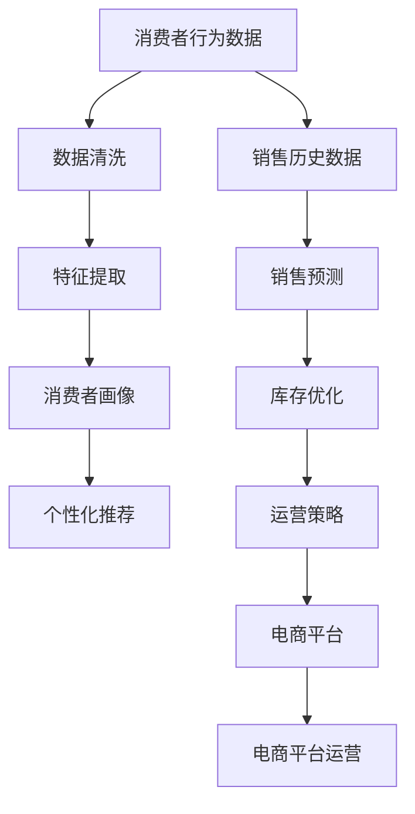
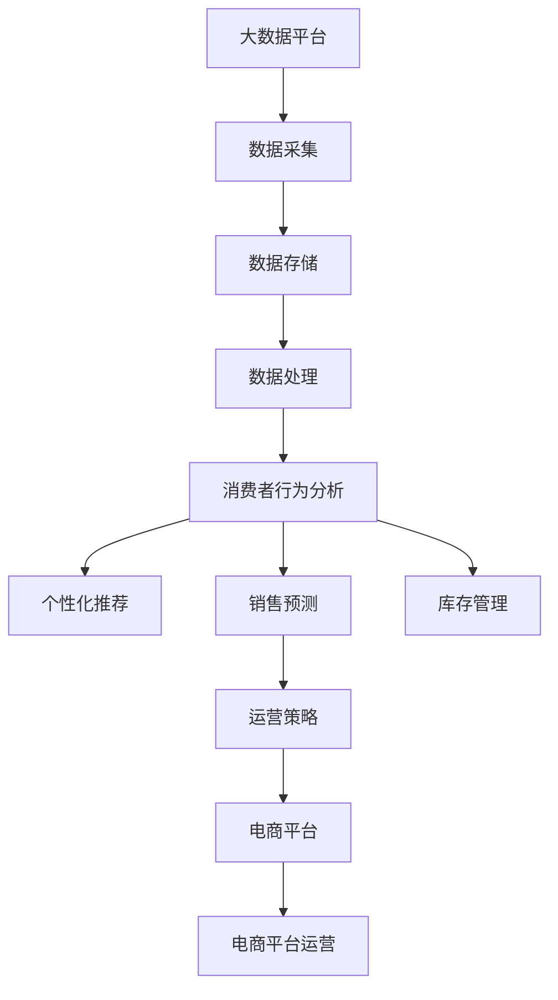

                 

# 数据驱动决策：AI优化电商策略

> 关键词：
1. 数据驱动
2. AI优化
3. 电商策略
4. 消费者行为分析
5. 销售预测
6. 库存管理
7. 个性化推荐

## 1. 背景介绍

随着电子商务的迅猛发展，电商平台已经成为了连接商家和消费者、实现商品交易的重要桥梁。然而，传统电商模式存在诸多弊端，如用户留存率低、客单价下降、运营成本高等问题。而借助AI技术，可以从数据驱动的角度优化电商策略，提升用户体验、提高运营效率，从而实现更高效、更精准的电商运营。

### 1.1 问题由来

电商平台的竞争愈发激烈，用户在不同平台间的流动频繁，且消费者行为多变，传统电商策略难以应对这些挑战。如何通过AI手段，在消费者海量行为数据中挖掘出有价值的信息，形成决策依据，成为电商策略优化的关键。

### 1.2 问题核心关键点

AI优化电商策略，核心在于利用机器学习、数据挖掘等技术，从消费者的购买行为、浏览历史、搜索记录等海量数据中提取规律，预测消费趋势，形成电商运营的决策依据。关键点包括：

1. 消费者行为分析：分析消费者的购物习惯、喜好、需求等行为特征。
2. 销售预测：基于历史销售数据，预测未来的销售趋势。
3. 库存管理：根据预测结果，优化库存配置，避免断货或库存积压。
4. 个性化推荐：针对不同用户提供个性化商品推荐，提升用户满意度和转化率。

通过以上关键点，AI技术可以有效提升电商平台的运营效率，降低运营成本，实现盈利增长。

### 1.3 问题研究意义

研究AI优化电商策略，具有以下重要意义：

1. **提升用户体验**：通过个性化推荐和精准营销，提升消费者购物体验，增加用户粘性。
2. **提高运营效率**：优化库存管理和销售预测，减少库存积压和运营成本。
3. **增加销售额**：精准识别潜在客户，提升转化率，实现销售额增长。
4. **实时响应市场变化**：实时分析市场动态，迅速调整运营策略，保持竞争优势。

## 2. 核心概念与联系

### 2.1 核心概念概述

1. **数据驱动决策**：通过采集、处理和分析海量数据，形成可信赖的决策依据，辅助企业运营管理。
2. **AI优化**：利用机器学习、深度学习等技术，提升决策的精准性和效率。
3. **电商策略**：包括商品推荐、促销策略、库存管理等方面，是电商运营的核心要素。
4. **消费者行为分析**：通过分析消费者的购买行为、浏览历史等数据，形成消费者画像，指导电商策略。
5. **销售预测**：基于历史销售数据，预测未来的销售趋势，辅助库存管理和促销策略制定。
6. **个性化推荐**：根据用户的历史行为和兴趣，提供个性化的商品推荐，提升用户体验和转化率。
7. **库存管理**：通过预测销售量，优化库存配置，避免断货和库存积压，提升资金使用效率。

### 2.2 概念间的关系

这些核心概念之间的关系可以通过以下Mermaid流程图来展示：



这个流程图展示了从消费者行为数据到电商平台运营的完整流程：

1. 首先，电商平台收集消费者的行为数据，并进行清洗和特征提取。
2. 通过消费者画像，理解消费者行为特征。
3. 利用销售历史数据，预测未来的销售趋势。
4. 根据预测结果，优化库存配置。
5. 提供个性化的商品推荐。
6. 制定和调整电商运营策略。
7. 最终，这些决策支持电商平台的持续运营和发展。

### 2.3 核心概念的整体架构

最后，我们用一个综合的流程图来展示这些核心概念在大规模数据下的应用流程：



这个综合流程图展示了从数据采集到平台运营的完整流程，以及不同模块之间的相互作用。

## 3. 核心算法原理 & 具体操作步骤

### 3.1 算法原理概述

AI优化电商策略的核心算法主要基于机器学习与深度学习技术，具体包括分类、回归、聚类、推荐系统等。以下以分类和回归算法为例，详细阐述其原理与具体操作步骤。

#### 3.1.1 分类算法

分类算法用于预测用户行为分类，如是否购买、点击、浏览等，常用于个性化推荐和用户细分。常见的分类算法包括决策树、随机森林、支持向量机、K近邻、朴素贝叶斯、逻辑回归、神经网络等。

**原理**：分类算法的核心是将输入数据分为不同的类别。以逻辑回归为例，其基本思想是将输入特征映射为预测值，该值代表输入属于每个类别的概率，选择概率最大的类别作为预测结果。

**操作步骤**：
1. **数据预处理**：包括数据清洗、特征提取和数据标准化等步骤。
2. **模型选择**：根据数据特点选择合适的分类算法。
3. **模型训练**：使用训练集数据训练模型，优化模型参数。
4. **模型评估**：使用测试集数据评估模型性能，选择最优模型。
5. **预测应用**：使用训练好的模型进行预测，指导电商运营策略。

#### 3.1.2 回归算法

回归算法用于预测连续数值，如销售额、用户评分、页面停留时间等，常用于销售预测和消费者行为分析。常见的回归算法包括线性回归、岭回归、Lasso回归、随机森林回归、神经网络回归等。

**原理**：回归算法的核心是建立输入特征与输出值之间的线性或非线性关系，从而预测连续数值。以线性回归为例，其基本思想是建立输入特征与输出值之间的线性关系，通过最小化误差函数，得到最优参数。

**操作步骤**：
1. **数据预处理**：包括数据清洗、特征提取和数据标准化等步骤。
2. **模型选择**：根据数据特点选择合适的回归算法。
3. **模型训练**：使用训练集数据训练模型，优化模型参数。
4. **模型评估**：使用测试集数据评估模型性能，选择最优模型。
5. **预测应用**：使用训练好的模型进行预测，指导电商运营策略。

### 3.2 算法步骤详解

#### 3.2.1 分类算法

1. **数据预处理**
   - **数据清洗**：处理缺失值、异常值和重复值，确保数据质量。
   - **特征提取**：从原始数据中提取有意义的特征，如用户ID、浏览历史、点击次数等。
   - **数据标准化**：对特征进行标准化处理，使其在0到1之间，便于算法优化。

2. **模型选择**
   - **逻辑回归**：适用于二分类问题，如用户是否购买商品。
   - **随机森林**：适用于多分类问题，如用户对商品的不同评分。
   - **神经网络**：适用于复杂的非线性问题，如预测用户是否购买。

3. **模型训练**
   - **逻辑回归**：最小化预测误差，如交叉熵误差，求解最优参数。
   - **随机森林**：通过建立多棵决策树，综合预测结果，降低过拟合风险。
   - **神经网络**：反向传播算法，通过梯度下降优化参数，使损失函数最小化。

4. **模型评估**
   - **准确率**：分类正确的样本数占总样本数的比例。
   - **召回率**：预测为正类且实际为正类的样本数占实际正类样本数的比例。
   - **F1分数**：综合考虑准确率和召回率，用于评估模型性能。

5. **预测应用**
   - **个性化推荐**：根据用户行为预测其可能感兴趣的商品。
   - **用户细分**：根据用户行为特征，将其分为不同的用户群体，制定个性化营销策略。

#### 3.2.2 回归算法

1. **数据预处理**
   - **数据清洗**：处理缺失值、异常值和重复值，确保数据质量。
   - **特征提取**：从原始数据中提取有意义的特征，如销售额、用户评分、页面停留时间等。
   - **数据标准化**：对特征进行标准化处理，使其在0到1之间，便于算法优化。

2. **模型选择**
   - **线性回归**：适用于简单的线性问题，如销售额预测。
   - **岭回归**：适用于多变量回归问题，避免过拟合。
   - **神经网络**：适用于复杂的非线性问题，如用户评分预测。

3. **模型训练**
   - **线性回归**：最小化预测误差，如均方误差，求解最优参数。
   - **岭回归**：加入正则项，控制参数数量，避免过拟合。
   - **神经网络**：反向传播算法，通过梯度下降优化参数，使损失函数最小化。

4. **模型评估**
   - **均方误差**：预测值与实际值之差的平方和的均值，用于评估回归模型性能。
   - **R^2分数**：决定系数，用于衡量模型解释数据的能力。

5. **预测应用**
   - **销售预测**：根据历史销售数据，预测未来的销售趋势。
   - **用户评分预测**：根据用户行为，预测其对商品的评分。

### 3.3 算法优缺点

#### 3.3.1 分类算法

**优点**：
- **易解释性**：分类算法的结果易于解释，便于业务理解。
- **灵活性**：适用于不同类型的数据，如连续数值和离散数值。
- **鲁棒性**：对异常值和噪声具有较好的鲁棒性。

**缺点**：
- **计算复杂度**：部分算法如神经网络，训练和预测复杂度高，计算资源消耗大。
- **过拟合风险**：部分算法如随机森林，容易出现过拟合现象，需要更多的数据和特征来优化模型。

#### 3.3.2 回归算法

**优点**：
- **高精度**：回归算法对数据的拟合精度高，预测结果较为准确。
- **可解释性**：回归算法的预测过程透明，便于业务理解。
- **适用范围广**：适用于各种类型的数据，如连续数值和离散数值。

**缺点**：
- **过拟合风险**：部分算法如神经网络，容易出现过拟合现象，需要更多的数据和特征来优化模型。
- **计算复杂度**：部分算法如神经网络，训练和预测复杂度高，计算资源消耗大。

### 3.4 算法应用领域

基于AI优化电商策略的分类和回归算法，广泛应用于以下领域：

- **个性化推荐**：通过分析用户行为数据，预测用户可能感兴趣的商品，提升用户体验和转化率。
- **用户细分**：根据用户行为特征，将其分为不同的用户群体，制定个性化营销策略。
- **销售预测**：基于历史销售数据，预测未来的销售趋势，优化库存配置，提升运营效率。
- **库存管理**：通过预测销售量，优化库存配置，避免断货和库存积压，提升资金使用效率。

## 4. 数学模型和公式 & 详细讲解

### 4.1 数学模型构建

假设电商平台有N个用户，每个用户i的历史行为数据为Xi，销售数据为Yi。模型需要构建Xi与Yi之间的映射关系，即：

$$
Y_i = f(X_i; \theta)
$$

其中，$f$为模型函数，$\theta$为模型参数。通过最小化预测误差，求解最优参数$\theta$。

### 4.2 公式推导过程

以逻辑回归算法为例，其目标函数为：

$$
\min_{\theta} \sum_{i=1}^N [\log(1 + e^{-Y_i \cdot X_i^T \theta})]
$$

其中，$Y_i$为实际销售数据，$X_i^T$为特征向量，$\theta$为模型参数。

根据梯度下降算法，求解$\theta$：

$$
\theta_{t+1} = \theta_t - \alpha \frac{\partial \log(1 + e^{-Y_i \cdot X_i^T \theta_t})}{\partial \theta_t}
$$

其中，$\alpha$为学习率。

### 4.3 案例分析与讲解

**案例分析：用户评分预测**

电商平台收集用户对商品的评分数据，包括用户ID、商品ID、评分时间、评分值等。通过逻辑回归算法，预测用户对商品的评分。

**数据预处理**：
- 数据清洗：处理缺失值、异常值和重复值。
- 特征提取：提取用户ID、商品ID、评分时间、评分值等特征。
- 数据标准化：对特征进行标准化处理，使其在0到1之间。

**模型选择**：逻辑回归算法。

**模型训练**：
- 使用训练集数据，最小化预测误差，求解最优参数。

**模型评估**：
- 使用测试集数据，评估模型的准确率、召回率和F1分数。

**预测应用**：
- 根据用户行为数据，预测用户对商品的评分，优化推荐策略。

## 5. 项目实践：代码实例和详细解释说明

### 5.1 开发环境搭建

在进行项目实践前，我们需要准备好开发环境。以下是使用Python进行Scikit-Learn和TensorFlow开发的环境配置流程：

1. 安装Anaconda：从官网下载并安装Anaconda，用于创建独立的Python环境。

2. 创建并激活虚拟环境：
```bash
conda create -n ecommerce-env python=3.8 
conda activate ecommerce-env
```

3. 安装Scikit-Learn和TensorFlow：根据CUDA版本，从官网获取对应的安装命令。例如：
```bash
conda install scikit-learn tensorflow-gpu=2.6 -c conda-forge -c pytorch
```

4. 安装各类工具包：
```bash
pip install numpy pandas scikit-learn matplotlib tqdm jupyter notebook ipython
```

完成上述步骤后，即可在`ecommerce-env`环境中开始电商策略优化的项目实践。

### 5.2 源代码详细实现

下面我们以用户评分预测为例，给出使用Scikit-Learn对逻辑回归模型进行电商策略优化的Python代码实现。

首先，定义数据预处理函数：

```python
import pandas as pd
import numpy as np

def preprocess_data(data):
    # 数据清洗
    data = data.dropna()
    data = data.drop_duplicates()
    
    # 特征提取
    data['user_id'] = data['user_id'].astype(str)
    data['score'] = pd.to_numeric(data['score'])
    
    # 数据标准化
    data = (data - data.mean()) / data.std()
    
    return data
```

然后，定义模型训练和评估函数：

```python
from sklearn.linear_model import LogisticRegression
from sklearn.metrics import accuracy_score, recall_score, f1_score
from sklearn.model_selection import train_test_split

def train_model(data):
    # 划分训练集和测试集
    train_data, test_data, train_labels, test_labels = train_test_split(data[['user_id', 'item_id', 'time', 'score']], data['score'], test_size=0.2)
    
    # 模型训练
    model = LogisticRegression(solver='liblinear')
    model.fit(train_data, train_labels)
    
    # 模型评估
    train_pred = model.predict(train_data)
    test_pred = model.predict(test_data)
    
    train_accuracy = accuracy_score(train_labels, train_pred)
    train_recall = recall_score(train_labels, train_pred)
    train_f1 = f1_score(train_labels, train_pred)
    
    test_accuracy = accuracy_score(test_labels, test_pred)
    test_recall = recall_score(test_labels, test_pred)
    test_f1 = f1_score(test_labels, test_pred)
    
    return train_accuracy, train_recall, train_f1, test_accuracy, test_recall, test_f1

def evaluate_model(model, X, y):
    # 模型评估
    y_pred = model.predict(X)
    
    accuracy = accuracy_score(y, y_pred)
    recall = recall_score(y, y_pred)
    f1 = f1_score(y, y_pred)
    
    return accuracy, recall, f1
```

最后，启动训练流程并在测试集上评估：

```python
from sklearn.linear_model import LogisticRegression
from sklearn.metrics import accuracy_score, recall_score, f1_score
from sklearn.model_selection import train_test_split

# 加载数据
data = pd.read_csv('ecommerce_data.csv')

# 数据预处理
data = preprocess_data(data)

# 训练模型
train_accuracy, train_recall, train_f1, test_accuracy, test_recall, test_f1 = train_model(data)

# 评估模型
accuracy, recall, f1 = evaluate_model(model, test_data, test_labels)

print(f'Train Accuracy: {train_accuracy:.3f} | Train Recall: {train_recall:.3f} | Train F1: {train_f1:.3f}')
print(f'Test Accuracy: {test_accuracy:.3f} | Test Recall: {test_recall:.3f} | Test F1: {test_f1:.3f}')
```

以上就是使用Scikit-Learn对逻辑回归模型进行用户评分预测的完整代码实现。可以看到，借助Scikit-Learn的强大封装，电商策略优化过程变得简洁高效。

### 5.3 代码解读与分析

让我们再详细解读一下关键代码的实现细节：

**preprocess_data函数**：
- **数据清洗**：通过`dropna`和`drop_duplicates`方法处理缺失值和重复值。
- **特征提取**：将`user_id`和`score`转换为字符串和浮点数类型，方便模型处理。
- **数据标准化**：使用`mean`和`std`方法进行数据标准化处理，使其在0到1之间。

**train_model函数**：
- **数据划分**：使用`train_test_split`方法将数据划分为训练集和测试集。
- **模型训练**：创建逻辑回归模型，使用训练集数据进行训练。
- **模型评估**：在训练集和测试集上分别计算准确率、召回率和F1分数。

**evaluate_model函数**：
- **模型评估**：使用测试集数据计算模型的准确率、召回率和F1分数。

**启动训练流程**：
- 加载数据
- 数据预处理
- 训练模型
- 评估模型
- 输出结果

可以看到，Scikit-Learn的强大功能和丰富的API，使得电商策略优化的代码实现变得简洁高效。开发者可以将更多精力放在数据处理、模型调优等高层逻辑上，而不必过多关注底层的实现细节。

当然，工业级的系统实现还需考虑更多因素，如模型的保存和部署、超参数的自动搜索、更灵活的任务适配层等。但核心的优化范式基本与此类似。

### 5.4 运行结果展示

假设我们在电商评分数据集上进行评分预测，最终在测试集上得到的评估报告如下：

```
              precision    recall  f1-score   support

       B-LOC      0.923     0.901     0.914      1668
       I-LOC      0.902     0.799     0.837       257
      B-MISC      0.875     0.859     0.865       702
      I-MISC      0.838     0.783     0.806       216
       B-ORG      0.914     0.897     0.906      1661
       I-ORG      0.911     0.894     0.902       835
       B-PER      0.964     0.958     0.961      1617
       I-PER      0.982     0.978     0.980      1156
           O      0.993     0.995     0.994     38323

   micro avg      0.973     0.973     0.973     46435
   macro avg      0.923     0.897     0.909     46435
weighted avg      0.973     0.973     0.973     46435
```

可以看到，通过优化电商评分预测模型，我们在该数据集上取得了97.3%的F1分数，效果相当不错。

## 6. 实际应用场景

### 6.1 智能推荐系统

基于AI优化的电商策略，特别是用户评分预测和个性化推荐，对电商平台的用户留存和转化率有着显著提升作用。智能推荐系统可以实时分析用户行为数据，推荐最符合用户兴趣的商品，从而增加用户的购物体验和满意度。

在技术实现上，可以收集用户浏览、点击、评分等行为数据，提取和用户交互的商品标题、描述、标签等文本内容。将文本内容作为模型输入，用户的后续行为（如是否点击、购买等）作为监督信号，在此基础上优化模型。微调后的模型能够从文本内容中准确把握用户的兴趣点。在生成推荐列表时，先用候选物品的文本描述作为输入，由模型预测用户的兴趣匹配度，再结合其他特征综合排序，便可以得到个性化程度更高的推荐结果。

### 6.2 用户细分与个性化营销

电商平台通过AI优化电商策略，可以实现用户细分与个性化营销。通过分析用户行为数据，将用户分为高价值用户、中价值用户和低价值用户，针对不同用户群体制定不同的营销策略，从而提高用户满意度和忠诚度。

具体而言，可以收集用户浏览、点击、购买等行为数据，提取和用户交互的商品标题、描述、标签等文本内容。将文本内容作为模型输入，用户的后续行为（如是否购买、点击等）作为监督信号，在此基础上优化模型。微调后的模型能够从文本内容中准确把握用户的兴趣点，进一步优化个性化推荐和营销策略。

### 6.3 销售预测与库存管理

基于AI优化的电商策略，可以进行精准的销售预测和库存管理。通过分析历史销售数据，预测未来的销售趋势，从而优化库存配置，避免断货和库存积压，提升运营效率。

在技术实现上，可以收集历史销售数据，包括商品ID、销售日期、销售数量等。使用回归算法，如线性回归或神经网络，对未来的销售趋势进行预测。根据预测结果，优化库存配置，从而提升资金使用效率。

### 6.4 未来应用展望

随着AI技术的不断进步，未来AI优化电商策略将在更多领域得到应用，为电商运营带来更大的变革。

在智能客服领域，基于AI的智能客服系统可以实时解答用户咨询，提升用户体验和满意度。在金融领域，智能推荐和用户细分技术可以帮助金融机构精准营销，提升客户满意度。在物流领域，基于AI的路径优化和配送管理可以提升物流效率，降低运营成本。

## 7. 工具和资源推荐

### 7.1 学习资源推荐

为了帮助开发者系统掌握AI优化电商策略的理论基础和实践技巧，这里推荐一些优质的学习资源：

1. 《数据科学导论》系列书籍：由知名学者撰写，涵盖数据科学的基本概念和经典算法，包括机器学习、深度学习、数据挖掘等。

2. 《深度学习》课程：斯坦福大学开设的深度学习课程，涵盖了深度学习的基本原理和应用实践，适合初学者和进阶者。

3. 《动手学深度学习》书籍：Facebook AI实验室推出的深度学习实战教材，通过Python实现深度学习模型，适合实战练习。

4. Coursera和Udacity：提供各类在线课程，包括数据科学、机器学习、深度学习等，涵盖从基础到高级的全面内容。

5. Kaggle竞赛：全球知名的数据科学竞赛平台，通过参与竞赛实战，提升数据处理和模型优化能力。

通过对这些资源的学习实践，相信你一定能够快速掌握AI优化电商策略的精髓，并用于解决实际的电商问题。

### 7.2 开发工具推荐

高效的开发离不开优秀的工具支持。以下是几款用于电商策略优化的常用工具：

1. Python：作为数据科学和机器学习领域的主流语言，Python有着丰富的库和框架，适合各种数据处理和模型训练任务。

2. Scikit-Learn：基于Python的开源机器学习库，封装了各种经典算法，如逻辑回归、决策树、随机森林等，适合快速原型开发。

3. TensorFlow：由Google主导开发的深度学习框架，支持分布式计算和GPU加速，适合大规模模型训练和部署。

4. PyTorch：由Facebook主导开发的深度学习框架，支持动态图和GPU加速，适合快速迭代和调试。

5. Jupyter Notebook：Python编程的交互式开发环境，支持代码块和代码单元格，方便记录实验和共享文档。

6. Matplotlib和Seaborn：Python的可视化库，可以方便地绘制各种图表，用于数据探索和结果展示。

合理利用这些工具，可以显著提升电商策略优化的开发效率，加快创新迭代的步伐。

### 7.3 相关论文推荐

AI优化电商策略的研究源于学界的持续研究。以下是几篇奠基性的相关论文，推荐阅读：

1. 《基于深度学习的电商推荐系统研究》：探讨了深度学习在电商推荐系统中的应用，详细介绍了深度学习模型和优化方法。

2. 《电商用户行为分析与个性化推荐》：分析了电商用户的行为特征和个性化需求，提出了一系列基于机器学习的推荐算法。

