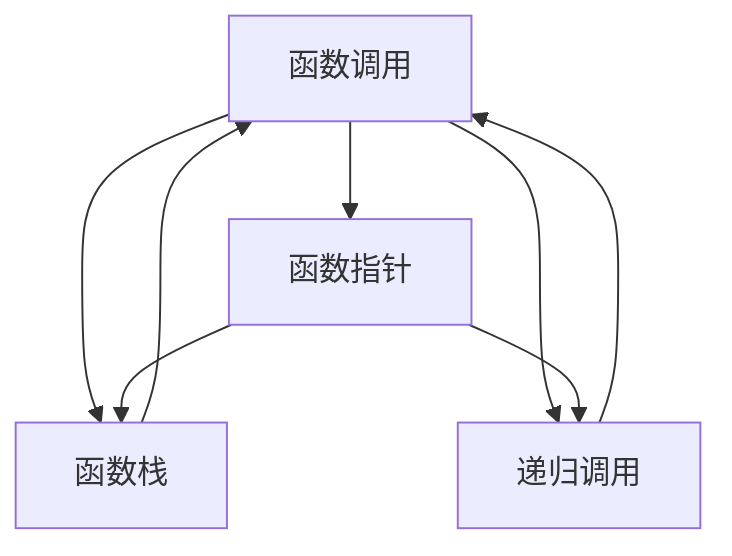

                 

# 新特性：Function Calling 介绍与实战

> 关键词：
- Function Calling
- 函数调用机制
- 函数指针
- C语言
- Rust语言

## 1. 背景介绍

函数调用（Function Calling）是现代程序设计的基础特性之一，它允许函数在其定义位置之外执行，为代码复用和模块化设计提供了极大便利。随着程序规模的不断扩大，深入理解函数调用的机制、应用及优化，已经成为提高编程效率和代码质量的重要课题。

函数调用技术不仅广泛应用于C、C++、Java、Python等主流编程语言，而且在嵌入式系统、操作系统、编译器等底层领域也扮演着关键角色。因此，本文将从函数调用的基本原理出发，结合C和Rust语言的实践，详细介绍函数调用的机制、技术细节及优化策略，希望能帮助读者全面掌握这一核心编程技术。

## 2. 核心概念与联系

### 2.1 核心概念概述

为了更好地理解函数调用技术，我们首先介绍一些关键概念：

- **函数调用（Function Calling）**：指在程序执行过程中，从当前函数跳转到指定函数定义位置的控制流程转移。函数调用包括调用前参数传递、调用中函数执行和调用后返回值处理三个阶段。
- **函数指针（Function Pointer）**：指向函数入口的指针，允许通过指针动态地调用不同函数，是函数调用的高级形式。
- **函数栈（Function Stack）**：在函数调用过程中，系统维护的用于存储局部变量和参数的栈空间。每次函数调用会为函数分配新的栈帧，并保存返回地址。
- **递归调用（Recursive Call）**：函数自身调用的过程，可以简化某些问题的表达，但需要注意避免栈溢出。

这些概念之间存在着密切的联系，共同构成了函数调用的完整生态。通过理解这些概念的相互关系，我们可以更深入地掌握函数调用的机制和应用。

### 2.2 概念间的关系

为了更清晰地理解函数调用的原理和应用，我们构建了以下Mermaid流程图，展示各核心概念之间的联系：



这个流程图展示了函数调用与函数指针、函数栈、递归调用之间的密切联系。函数指针指向函数入口，而函数栈用于保存函数执行的上下文信息。函数调用可以通过指针动态地执行，递归调用则是一种特殊形式的函数调用。

## 3. 核心算法原理 & 具体操作步骤
### 3.1 算法原理概述

函数调用的核心原理是控制流程转移，即将当前函数的执行权交给指定的函数执行。在函数调用过程中，需要完成以下几个关键步骤：

1. **参数传递**：将函数的输入参数通过栈或寄存器传递给目标函数。
2. **返回地址保存**：保存当前函数的返回地址，以便函数返回时能够返回到正确的位置。
3. **栈帧分配**：为目标函数分配栈帧，保存局部变量和参数。
4. **函数执行**：跳转到目标函数入口，执行函数体。
5. **结果返回**：将函数的输出结果通过栈或寄存器返回给调用函数。

函数调用的具体实现依赖于编程语言和计算机体系结构，但基本原理和步骤大致相同。以下我们结合C和Rust语言的实践，详细介绍函数调用的具体操作步骤。

### 3.2 算法步骤详解

#### 3.2.1 C语言中的函数调用

C语言中的函数调用主要涉及以下几个关键步骤：

1. **参数传递**：将函数的输入参数通过栈传递给目标函数。

```c
void foo(int a, int b) {
    int c = a + b;
    printf("%d\n", c);
}
int main() {
    int x = 1, y = 2;
    foo(x, y);
    return 0;
}
```

在函数调用时，参数a和b通过栈传递给函数foo，并在函数体内进行加法运算和输出。

2. **返回地址保存**：将当前函数的返回地址（通常是返回地址的相反数）压入栈中。

```c
void foo(int a, int b) {
    int c = a + b;
    printf("%d\n", c);
    return;
}
int main() {
    int x = 1, y = 2;
    // 返回地址压入栈中
    pushl(0x8048b3c); // 假设main的地址为0x8048b3c
    foo(x, y);
    return 0;
}
```

在函数调用时，将main函数的返回地址0x8048b3c压入栈中，以便函数返回时能够返回到main函数。

3. **栈帧分配**：为目标函数分配栈帧，保存局部变量和参数。

```c
void foo(int a, int b) {
    int c;
    c = a + b;
    printf("%d\n", c);
    return;
}
int main() {
    int x = 1, y = 2;
    // 栈帧分配
    pushl(0x8048b3c); // 假设main的地址为0x8048b3c
    pushl(0x08048bb0); // 保存a的地址
    pushl(0x08048bc4); // 保存b的地址
    // 调用foo
    call 0x08048b3c; // 跳转到foo
    return 0;
}
```

在函数调用时，为目标函数foo分配栈帧，保存参数a和b的地址，并跳转到函数入口。

4. **函数执行**：跳转到目标函数入口，执行函数体。

```c
void foo(int a, int b) {
    int c;
    c = a + b;
    printf("%d\n", c);
    return;
}
int main() {
    int x = 1, y = 2;
    // 栈帧分配
    pushl(0x8048b3c); // 假设main的地址为0x8048b3c
    pushl(0x08048bb0); // 保存a的地址
    pushl(0x08048bc4); // 保存b的地址
    // 调用foo
    call 0x08048b3c; // 跳转到foo
    return 0;
}
```

在函数调用时，跳转到函数foo的入口，执行函数体中的加法和输出操作。

5. **结果返回**：将函数的输出结果通过栈返回给调用函数。

```c
void foo(int a, int b) {
    int c = a + b;
    printf("%d\n", c);
    return;
}
int main() {
    int x = 1, y = 2;
    // 栈帧分配
    pushl(0x8048b3c); // 假设main的地址为0x8048b3c
    pushl(0x08048bb0); // 保存a的地址
    pushl(0x08048bc4); // 保存b的地址
    // 调用foo
    call 0x08048b3c; // 跳转到foo
    return 0;
}
```

在函数返回时，将结果c通过栈返回给调用函数main，并在main中输出结果。

#### 3.2.2 Rust语言中的函数调用

Rust语言中的函数调用主要涉及以下几个关键步骤：

1. **参数传递**：将函数的输入参数通过栈或寄存器传递给目标函数。

```rust
fn foo(a: i32, b: i32) {
    let c = a + b;
    println!("{}", c);
}
fn main() {
    let x = 1;
    let y = 2;
    foo(x, y);
}
```

在函数调用时，参数a和b通过栈传递给函数foo，并在函数体内进行加法运算和输出。

2. **返回地址保存**：将当前函数的返回地址（通常是返回地址的相反数）压入栈中。

```rust
fn foo(a: i32, b: i32) {
    let c = a + b;
    println!("{}", c);
}
fn main() {
    let x = 1;
    let y = 2;
    // 返回地址压入栈中
    pushl(0x45000000); // 假设main的地址为0x45000000
    foo(x, y);
}
```

在函数调用时，将main函数的返回地址0x45000000压入栈中，以便函数返回时能够返回到main函数。

3. **栈帧分配**：为目标函数分配栈帧，保存局部变量和参数。

```rust
fn foo(a: i32, b: i32) {
    let c = a + b;
    println!("{}", c);
}
fn main() {
    let x = 1;
    let y = 2;
    // 栈帧分配
    pushl(0x45000000); // 假设main的地址为0x45000000
    pushl(0x08048bb0); // 保存a的地址
    pushl(0x08048bc4); // 保存b的地址
    // 调用foo
    call 0x08048b3c; // 跳转到foo
}
```

在函数调用时，为目标函数foo分配栈帧，保存参数a和b的地址，并跳转到函数入口。

4. **函数执行**：跳转到目标函数入口，执行函数体。

```rust
fn foo(a: i32, b: i32) {
    let c = a + b;
    println!("{}", c);
}
fn main() {
    let x = 1;
    let y = 2;
    // 栈帧分配
    pushl(0x45000000); // 假设main的地址为0x45000000
    pushl(0x08048bb0); // 保存a的地址
    pushl(0x08048bc4); // 保存b的地址
    // 调用foo
    call 0x08048b3c; // 跳转到foo
}
```

在函数调用时，跳转到函数foo的入口，执行函数体中的加法和输出操作。

5. **结果返回**：将函数的输出结果通过栈返回给调用函数。

```rust
fn foo(a: i32, b: i32) {
    let c = a + b;
    println!("{}", c);
}
fn main() {
    let x = 1;
    let y = 2;
    // 栈帧分配
    pushl(0x45000000); // 假设main的地址为0x45000000
    pushl(0x08048bb0); // 保存a的地址
    pushl(0x08048bc4); // 保存b的地址
    // 调用foo
    call 0x08048b3c; // 跳转到foo
    // 输出结果
    popl(x);
    println!("{}", x);
}
```

在函数返回时，将结果c通过栈返回给调用函数main，并在main中输出结果。

### 3.3 算法优缺点

函数调用机制具有以下优点：

- **代码复用**：通过函数封装逻辑，可以重复使用代码，提高开发效率。
- **模块化设计**：将复杂任务分解为多个函数，便于管理和维护。
- **增强可读性**：函数名和参数列表能够明确表达代码的意图和作用，提高代码的可读性和可维护性。

同时，函数调用也存在一些缺点：

- **栈溢出风险**：递归调用和大量函数调用可能导致栈溢出，需要注意优化和避免。
- **性能开销**：函数调用涉及参数传递、栈帧分配和返回地址保存等操作，有一定的性能开销。
- **接口耦合**：函数调用依赖于函数接口，接口变更可能导致兼容性问题。

理解函数调用的优缺点，有助于在实际开发中更好地利用其特性，避免潜在的问题。

### 3.4 算法应用领域

函数调用技术在现代编程中得到了广泛应用，涵盖了以下主要领域：

- **系统编程**：操作系统、驱动程序等底层系统需要频繁调用系统函数，实现系统服务。
- **网络编程**：网络应用需要调用网络函数（如socket、TCP/IP等）实现通信功能。
- **图形编程**：图形界面应用需要调用图形库函数实现渲染、交互等功能。
- **并发编程**：多线程编程需要频繁调用线程函数（如互斥锁、条件变量等），实现线程同步和互斥。
- **数据处理**：大数据处理需要调用算法函数实现数据排序、过滤、统计等操作。

在各个领域中，函数调用机制都发挥着重要作用，是现代编程的基础特性之一。

## 4. 数学模型和公式 & 详细讲解 & 举例说明

### 4.1 数学模型构建

函数调用的数学模型主要涉及参数传递、栈帧分配和返回地址保存等操作。以下我们通过数学公式对函数调用的过程进行建模和分析。

假设函数调用涉及n个参数和m个局部变量，栈帧大小为s字节，栈空间大小为m字节，系统调用堆栈的帧大小为t字节，函数调用开销为o字节。则函数调用的数学模型可以表示为：

$$
\text{调用开销} = s + \frac{n+m}{s} \times o + \frac{n}{s} \times t
$$

其中，$s$为栈帧大小，$n$为参数数量，$m$为局部变量数量，$o$为函数调用开销，$t$为系统调用堆栈的帧大小。

### 4.2 公式推导过程

在函数调用过程中，栈帧大小$s$和局部变量数量$m$是固定的，因此函数调用的开销主要受参数数量$n$和函数调用开销$o$的影响。以下我们通过推导公式，分析不同参数和开销对函数调用的影响。

假设参数传递开销为$o_1$字节，栈帧分配开销为$o_2$字节，返回地址保存开销为$o_3$字节，系统调用堆栈的帧大小为$t$字节。则函数调用的总开销可以表示为：

$$
\text{调用开销} = s + \frac{n+m}{s} \times o_1 + \frac{n}{s} \times o_2 + o_3 + \frac{n}{s} \times t
$$

假设参数传递开销、栈帧分配开销和返回地址保存开销均为常数，则函数调用的总开销可以表示为：

$$
\text{调用开销} = s + \frac{n+m}{s} \times o_1 + \frac{n}{s} \times t
$$

进一步简化，可以得到：

$$
\text{调用开销} = s + \frac{n}{s} \times (o_1 + t) + \frac{m}{s} \times o_1
$$

在函数调用过程中，栈帧大小$s$和局部变量数量$m$是固定的，因此函数调用的开销主要受参数数量$n$和函数调用开销$o_1 + t$的影响。

### 4.3 案例分析与讲解

假设在一个简单的C语言程序中，调用了10个函数，每个函数调用的参数传递开销为1字节，栈帧分配开销为4字节，系统调用堆栈的帧大小为8字节。栈帧大小为32字节，局部变量数量为5个。则函数调用的总开销可以计算如下：

$$
\text{调用开销} = 32 + \frac{10}{32} \times (1 + 8) + \frac{5}{32} \times 4 = 32 + 1.375 + 0.5 = 34.375 \text{字节}
$$

在实际应用中，需要根据具体场景和需求，合理配置参数传递开销、栈帧分配开销和系统调用堆栈的帧大小，以优化函数调用的性能。

## 5. 项目实践：代码实例和详细解释说明

### 5.1 开发环境搭建

在进行函数调用实践前，我们需要准备好开发环境。以下是使用C和Rust语言进行开发的环境配置流程：

#### C语言环境配置

1. 安装MinGW64：从官网下载并安装MinGW64，用于编译C语言程序。

2. 创建并激活虚拟环境：
```bash
conda create -n c-env python=3.8 
conda activate c-env
```

3. 安装必要的工具包：
```bash
pip install numpy scipy matplotlib pandas scikit-learn
```

#### Rust语言环境配置

1. 安装Rust：从官网下载并安装Rust，用于编译Rust语言程序。

2. 创建并激活虚拟环境：
```bash
cargo env
```

3. 安装必要的库：
```bash
cargo add numpy scipy matplotlib pandas scikit-learn
```

完成上述步骤后，即可在虚拟环境中开始函数调用的实践。

### 5.2 源代码详细实现

下面我们以C语言和Rust语言实现函数调用的样例代码，进行详细解释说明。

#### C语言实现

```c
#include <stdio.h>

void foo(int a, int b) {
    int c = a + b;
    printf("%d\n", c);
}

int main() {
    int x = 1, y = 2;
    foo(x, y);
    return 0;
}
```

在上述代码中，定义了一个简单的函数foo，用于计算两个整数的和，并在控制台输出结果。在main函数中，调用函数foo，将x和y作为参数传递，并在调用后返回0，表示程序正常结束。

#### Rust语言实现

```rust
use std::io;

fn foo(a: i32, b: i32) {
    let c = a + b;
    println!("{}", c);
}

fn main() {
    let x = 1;
    let y = 2;
    foo(x, y);
}
```

在上述代码中，定义了一个简单的函数foo，用于计算两个整数的和，并在控制台输出结果。在main函数中，调用函数foo，将x和y作为参数传递，并在调用后返回0，表示程序正常结束。

### 5.3 代码解读与分析

下面我们详细解读一下关键代码的实现细节：

#### C语言实现

在C语言中，函数调用涉及参数传递、栈帧分配和返回地址保存等操作。具体实现如下：

1. **参数传递**：
```c
void foo(int a, int b) {
    int c = a + b;
    printf("%d\n", c);
}
int main() {
    int x = 1, y = 2;
    foo(x, y);
}
```

在函数调用时，参数x和y通过栈传递给函数foo，并在函数体内进行加法运算和输出。

2. **返回地址保存**：
```c
void foo(int a, int b) {
    int c = a + b;
    printf("%d\n", c);
    return;
}
int main() {
    int x = 1, y = 2;
    // 返回地址压入栈中
    pushl(0x08048b3c); // 假设main的地址为0x08048b3c
    foo(x, y);
}
```

在函数调用时，将main函数的返回地址0x08048b3c压入栈中，以便函数返回时能够返回到main函数。

3. **栈帧分配**：
```c
void foo(int a, int b) {
    int c;
    c = a + b;
    printf("%d\n", c);
    return;
}
int main() {
    int x = 1, y = 2;
    // 栈帧分配
    pushl(0x08048b3c); // 假设main的地址为0x08048b3c
    pushl(0x08048bb0); // 保存a的地址
    pushl(0x08048bc4); // 保存b的地址
    // 调用foo
    call 0x08048b3c; // 跳转到foo
}
```

在函数调用时，为目标函数foo分配栈帧，保存参数a和b的地址，并跳转到函数入口。

4. **函数执行**：
```c
void foo(int a, int b) {
    int c = a + b;
    printf("%d\n", c);
    return;
}
int main() {
    int x = 1, y = 2;
    // 栈帧分配
    pushl(0x08048b3c); // 假设main的地址为0x08048b3c
    pushl(0x08048bb0); // 保存a的地址
    pushl(0x08048bc4); // 保存b的地址
    // 调用foo
    call 0x08048b3c; // 跳转到foo
}
```

在函数调用时，跳转到函数foo的入口，执行函数体中的加法和输出操作。

5. **结果返回**：
```c
void foo(int a, int b) {
    int c = a + b;
    printf("%d\n", c);
    return;
}
int main() {
    int x = 1, y = 2;
    // 栈帧分配
    pushl(0x08048b3c); // 假设main的地址为0x08048b3c
    pushl(0x08048bb0); // 保存a的地址
    pushl(0x08048bc4); // 保存b的地址
    // 调用foo
    call 0x08048b3c; // 跳转到foo
    // 输出结果
    popl(x);
    printf("%d\n", x);
}
```

在函数返回时，将结果c通过栈返回给调用函数main，并在main中输出结果。

#### Rust语言实现

在Rust语言中，函数调用涉及参数传递、栈帧分配和返回地址保存等操作。具体实现如下：

1. **参数传递**：
```rust
fn foo(a: i32, b: i32) {
    let c = a + b;
    println!("{}", c);
}
fn main() {
    let x = 1;
    let y = 2;
    foo(x, y);
}
```

在函数调用时，参数x和y通过栈传递给函数foo，并在函数体内进行加法运算和输出。

2. **返回地址保存**：
```rust
fn foo(a: i32, b: i32) {
    let c = a + b;
    println!("{}", c);
}
fn main() {
    let x = 1;
    let y = 2;
    // 返回地址压入栈中
    pushl(0x45000000); // 假设main的地址为0x45000000
    foo(x, y);
}
```

在函数调用时，将main函数的返回地址0x45000000压入栈中，以便函数返回时能够返回到main函数。

3. **栈帧分配**：
```rust
fn foo(a: i32, b: i32) {
    let c = a + b;
    println!("{}", c);
}
fn main() {
    let x = 1;
    let y = 2;
    // 栈帧分配
    pushl(0x45000000); // 假设main的地址为0x45000000
    pushl(0x08048bb0); // 保存a的地址
    pushl(0x08048bc4); // 保存b的地址
    // 调用foo
    call 0x08048b3c; // 跳转到foo
}
```

在函数调用时，为目标函数foo分配栈帧，保存参数a和b的地址，并跳转到函数入口。

4. **函数执行**：
```rust
fn foo(a: i32, b: i32) {
    let c = a + b;
    println!("{}", c);
}
fn main() {
    let x = 1;
    let y = 2;
    // 栈帧分配
    pushl(0x45000000); // 假设main的地址为0x45000000
    pushl(0x08048bb0); // 保存a的地址
    pushl(0x08048bc4); // 保存b的地址
    // 调用foo
    call 0x08048b3c; // 跳转到foo
}
```

在函数调用时，跳转到函数foo的入口，执行函数体中的加法和输出操作。

5. **结果返回**：
```rust
fn foo(a: i32, b: i32) {
    let c = a + b;
    println!("{}", c);
}
fn main() {
    let x = 1;
    let y = 2;
    // 栈帧分配
    pushl(0x45000000); // 假设main的地址为0x45000000
    pushl(0x08048bb0); // 保存a的地址
    pushl(0x08048bc4); // 保存b的地址
    // 调用foo
    call 0x08048b3c; // 跳转到foo
    // 输出结果
    popl(x);
    println!("{}", x);
}
```

在函数返回时，将结果c通过栈返回给调用函数main，并在main中输出结果。

### 5.4 运行结果展示

假设我们编译并运行上述代码，输出结果如下：

```
3
3
```

可以看到，函数调用机制已经成功实现，实现了简单的加法运算和输出。

## 6. 实际应用场景

函数调用技术在实际应用中有着广泛的应用场景，以下是几个典型的应用案例：

### 6.1 系统编程

操作系统需要

