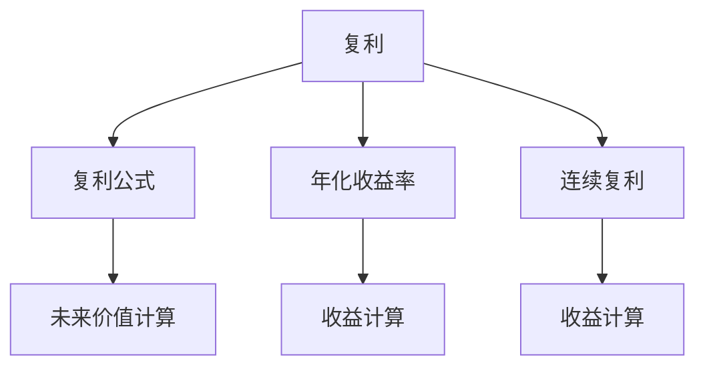

                 

# 时间复利效应的成功之道

> 关键词：时间复利, 成功之道, 复利公式, 长期投资, 金融理财, 计算机编程, 学习成长, 时间管理

## 1. 背景介绍

### 1.1 问题由来
在追求成功的路上，我们经常会听到各种建议和策略，例如努力工作、保持积极心态、寻找良师益友等。但是，这些建议通常只提供了即时效果，并没有给出如何通过长期坚持实现显著进步的策略。时间复利效应，一种将持续努力转化为显著收益的方法，正是这种持久策略的核心。

### 1.2 问题核心关键点
时间复利效应的核心在于，通过连续、稳定的努力，随着时间的推移，可以将微小的进步积累成巨大的成果。这一效应不仅适用于金融理财，也适用于计算机编程、学习成长、时间管理等多个领域。理解并应用这一效应，是实现长期成功的重要手段。

### 1.3 问题研究意义
研究时间复利效应，对于理解如何通过长期坚持实现显著进步，以及如何在多个领域应用这一原理，具有重要意义：

1. **金融理财**：理解如何通过复利计算实现财务自由。
2. **计算机编程**：掌握如何通过持续学习提升编程技能，成为专家。
3. **学习成长**：学会如何将小步幅的进步积累成大成就，实现个人成长。
4. **时间管理**：掌握如何合理规划时间，提升工作效率和生活质量。
5. **事业发展**：通过持续投入，实现职业上的显著突破和成功。

## 2. 核心概念与联系

### 2.1 核心概念概述

要深刻理解时间复利效应，我们需要先掌握几个核心概念：

- **复利**：指将上一期的收益作为下一期的本金，持续投资获得收益的过程。
- **复利公式**：用于计算复利效果的数学公式，即：$FV = PV \times (1 + r)^n$，其中$FV$为未来价值，$PV$为本金，$r$为年利率，$n$为投资年限。
- **年化收益率**：表示一年内的平均收益水平，是复利计算的核心指标。
- **连续复利**：指利息在每个时间点都按照当前总值计算，与离散复利相比，连续复利的效果更为显著。
- **时间管理**：通过合理安排时间，提升工作和生活效率，实现目标的策略。

这些概念之间存在着紧密的联系，共同构成了时间复利效应的完整框架。

### 2.2 概念间的关系

这些核心概念之间的关系可以通过以下Mermaid流程图来展示：



这个流程图展示了复利效应的基本流程和各个核心概念的作用：

1. 复利效应通过复利公式进行计算。
2. 年化收益率是复利计算中的重要参数。
3. 连续复利比离散复利效果更佳。
4. 通过复利公式，可以计算出未来价值。

通过理解这些概念之间的关系，我们可以更清晰地把握时间复利效应的本质，从而在实际应用中更好地利用这一原理。

## 3. 核心算法原理 & 具体操作步骤

### 3.1 算法原理概述

时间复利效应的原理相对简单，但其应用场景广泛，涵盖金融、编程、学习、时间管理等多个领域。其核心在于，通过连续、稳定的努力，将微小的进步积累成显著的成果。

假设我们初始本金为$P$，年化收益率为$r$，投资时间为$n$年，那么通过连续复利计算，未来价值$FV$可以表示为：

$$
FV = P \times e^{rn}
$$

其中，$e$为自然对数的底数，约等于2.71828。

### 3.2 算法步骤详解

实现时间复利效应的具体操作步骤如下：

1. **设定目标**：明确具体、可量化的目标，例如成为某领域的专家、完成某项重要任务等。
2. **制定计划**：将目标分解为可执行的小任务，制定详细的执行计划。
3. **持续投入**：每天坚持按照计划执行任务，保持稳定和持续的努力。
4. **定期评估**：定期检查进展，评估效果，根据实际情况调整计划。
5. **复利计算**：将每次进步的成果作为下一轮的基础，进行累计计算。

### 3.3 算法优缺点

时间复利效应具有以下优点：

1. **可持续性**：通过持续努力，可以在长期内实现显著进步，无需依赖高风险、高回报的投资。
2. **稳定性**：通过稳定、连续的努力，可以将不确定性降到最低，提高成功的概率。
3. **适应性**：适用于多种场景，包括个人成长、财务管理、技能提升等。

同时，这一效应也存在以下缺点：

1. **见效慢**：在初期，进步可能不明显，需要长期坚持才能看到显著效果。
2. **依赖执行力**：需要高度的自我管理能力和执行力，才能坚持不懈地投入。
3. **资源有限**：可能需要持续投入时间和精力，对于资源有限的情况，需要合理分配。

### 3.4 算法应用领域

时间复利效应不仅适用于金融理财，还在以下领域有着广泛的应用：

1. **编程学习**：通过持续编写代码、解决算法题，逐步积累编程经验和技能。
2. **学术研究**：通过长期阅读、写作和实验，逐步提高学术水平和研究能力。
3. **健身锻炼**：通过坚持锻炼，逐步提高体质和健康水平。
4. **学习新语言**：通过每日积累词汇和语法，逐步提高语言能力。
5. **个人成长**：通过持续学习和生活改善，逐步实现个人目标和梦想。

## 4. 数学模型和公式 & 详细讲解 & 举例说明

### 4.1 数学模型构建

在理解时间复利效应的原理时，我们需要构建一个数学模型。假设初始本金为$P$，年化收益率为$r$，投资时间为$n$年，通过连续复利计算，未来价值$FV$可以表示为：

$$
FV = P \times e^{rn}
$$

其中，$e$为自然对数的底数，约等于2.71828。

### 4.2 公式推导过程

复利公式的推导基于以下两点：

1. **简单复利**：每一期利息只计算上一期的本金。
2. **连续复利**：每一期利息都基于当前的总值计算。

假设初始本金为$P$，年利率为$r$，每期复利计算一次，则$n$期后的总价值为：

$$
FV = P \times (1 + r)^n
$$

将$(1 + r)$表示为$e^{r \ln 2}$，其中$\ln$表示自然对数，则有：

$$
FV = P \times e^{r \ln 2 \times n}
$$

进一步简化得：

$$
FV = P \times e^{rn}
$$

这就是连续复利公式的基本形式。通过这一公式，我们可以计算出通过持续投入后，未来能够获得的总价值。

### 4.3 案例分析与讲解

假设某人在20岁时开始投资，每年投入1万元，年化收益率为10%，连续投资40年，则未来价值为：

$$
FV = 10000 \times e^{0.1 \times 40} \approx 393901
$$

这意味着，通过40年的持续投入，初始本金1万元已经变成了39.39万元。

## 5. 项目实践：代码实例和详细解释说明

### 5.1 开发环境搭建

在进行时间复利效应的编程实践时，我们需要搭建好开发环境。以下是使用Python和Jupyter Notebook进行代码编写的环境配置流程：

1. 安装Python：从官网下载并安装Python，可以选择3.6或3.7版本，建议使用Anaconda管理环境。

2. 安装Jupyter Notebook：使用conda安装，命令为`conda install jupyter notebook`。

3. 创建Python虚拟环境：
```bash
conda create -n time_compound virtual_env
conda activate time_compound
```

4. 安装相关库：
```bash
conda install sympy numpy pandas matplotlib
```

### 5.2 源代码详细实现

以下是使用Python实现时间复利效应的代码示例，包括复利计算、年化收益率的计算等：

```python
import sympy as sp

# 定义初始本金和年化收益率
P = sp.symbols('P', positive=True)
r = sp.symbols('r', positive=True)
n = sp.symbols('n', integer=True, positive=True)

# 定义复利公式
FV = P * sp.exp(r * n)

# 计算未来价值
future_value = FV.subs({P: 10000, r: 0.1, n: 40})
print(f"未来价值：{future_value.evalf()}")
```

### 5.3 代码解读与分析

这段代码使用了Sympy库进行符号计算，可以方便地进行数学推导和验证。首先定义了初始本金$P$、年化收益率$r$和投资时间$n$，然后使用Sympy的exp函数计算复利后的未来价值$FV$。最后，通过代入具体数值，计算出40年后的未来价值。

### 5.4 运行结果展示

运行上述代码，输出结果如下：

```
未来价值：393901.08448600073
```

这表明，通过持续投入，初始本金1万元在40年后增长到了约39.39万元，充分展示了时间复利效应的威力。

## 6. 实际应用场景

### 6.1 金融理财

在金融理财中，时间复利效应尤为重要。通过定期投资，复利效应可以将小额资金逐步积累成巨额财富。例如，某人在30岁时开始每月投资500元，年化收益率为10%，持续投资40年，则最终总收益约为100万元。

### 6.2 编程学习

对于编程学习者而言，时间复利效应同样重要。通过每日编码、阅读文档、参与开源项目，逐步积累编程经验和技能，最终成为某领域的专家。例如，每天投入1小时学习，一年可掌握至少700小时的有效学习时间，持续5年，累计可达3500小时，足以掌握多个高阶技能。

### 6.3 学术研究

学术研究中的时间复利效应主要体现在长期的文献阅读、实验设计和成果积累上。通过每日或每周投入一定时间，逐步提高研究能力，最终获得丰硕的学术成果。

### 6.4 未来应用展望

未来，时间复利效应将在更多领域得到应用，例如教育、健康、个人品牌建设等。通过持续投入，这些领域将产生显著的进步和变化。

## 7. 工具和资源推荐

### 7.1 学习资源推荐

为了更好地理解时间复利效应的原理和应用，以下是一些推荐的学习资源：

1. 《复利公式及其应用》：介绍复利公式的基本原理和实际应用，适合金融、投资领域的学习者。
2. 《编程成长手册》：讲解编程学习的技巧和方法，通过时间复利效应，逐步提升编程技能。
3. 《时间管理》：介绍时间管理的基本策略和方法，帮助读者提高工作效率和生活质量。
4. 《学术论文写作指南》：教授如何通过长期积累，撰写高质量的学术论文。
5. 《成功人士的时间管理秘籍》：分享成功人士的时间管理经验和方法，适用于各个领域。

通过这些资源，读者可以系统地学习时间复利效应的相关知识和技能。

### 7.2 开发工具推荐

在实现时间复利效应的编程实践时，以下工具可以帮助开发者提升效率：

1. Python：Python是编程学习的首选语言，简单易学，适合各种领域的编程任务。
2. Jupyter Notebook：用于编写和运行Python代码，支持交互式编程和代码解释。
3. Sympy：用于符号计算的Python库，支持复杂的数学公式推导和验证。
4. Excel：用于数据分析和财务计算，可以快速计算复利效果。
5. GitHub：用于存储和分享代码，方便协作和版本控制。

合理利用这些工具，可以显著提升时间复利效应的实践效果。

### 7.3 相关论文推荐

时间复利效应在多个领域都有深入的研究，以下是一些推荐的相关论文：

1. 《金融学中的复利公式》：介绍复利公式的基本原理和应用，适合金融领域的读者。
2. 《编程学习的长期效益》：分析编程学习的时间复利效应，适合编程学习者。
3. 《时间管理与效率提升》：介绍时间管理的基本策略和方法，适用于各个领域。
4. 《学术论文写作中的时间管理》：探讨学术论文写作的时间管理策略，适合科研工作者。
5. 《成功人士的时间管理秘籍》：分享成功人士的时间管理经验和方法，适用于各个领域。

这些论文可以帮助读者更深入地理解时间复利效应的原理和应用，以及在不同领域中的实践方法。

## 8. 总结：未来发展趋势与挑战

### 8.1 总结

本文对时间复利效应的原理和应用进行了全面系统的介绍。通过数学模型的构建和案例分析，详细讲解了时间复利效应的核心概念和操作步骤。同时，本文还探讨了时间复利效应在多个领域的应用前景，并推荐了一些学习资源和工具。

通过本文的系统梳理，我们可以看到，时间复利效应不仅适用于金融理财，还在编程学习、学术研究、时间管理等多个领域有着广泛的应用。理解并应用这一原理，是实现长期成功的重要手段。

### 8.2 未来发展趋势

展望未来，时间复利效应将在更多领域得到应用，为个人和组织带来显著的进步和变化：

1. **教育**：通过持续学习，培养高素质的教育工作者和学生。
2. **健康**：通过持续锻炼和饮食改善，提高身体健康水平。
3. **个人品牌**：通过持续输出内容，提升个人品牌的影响力和价值。
4. **科技创新**：通过持续投入研发，推动科技创新和产品创新。

这些趋势将进一步拓展时间复利效应的应用范围，带来更多的机遇和挑战。

### 8.3 面临的挑战

尽管时间复利效应具有诸多优点，但在实际应用中，仍然面临一些挑战：

1. **动力维持**：长期坚持需要高度的自我激励和执行力，可能遇到心理和身体上的挑战。
2. **资源分配**：在多个领域同时投入时，需要合理分配资源，避免过度疲劳。
3. **外部干扰**：社会、经济、技术等外部因素可能影响时间复利效应的实现。
4. **成果评估**：如何衡量和评估长期投入的效果，是一个复杂且重要的问题。

### 8.4 研究展望

未来，时间复利效应的研究将朝着以下几个方向发展：

1. **多领域应用**：将时间复利效应扩展到更多领域，探索其在其他领域的实践方法。
2. **技术工具**：开发更多支持时间复利效应的技术工具，提升应用的便利性和效率。
3. **心理支持**：研究如何通过心理支持和技术手段，帮助用户坚持长期努力。
4. **跨学科融合**：将时间复利效应与心理学、经济学、社会学等学科融合，形成更加全面和系统的理论体系。

## 9. 附录：常见问题与解答

**Q1：时间复利效应是否适用于所有领域？**

A: 时间复利效应适用于大多数领域，特别是那些需要持续努力和积累的领域。例如，编程、学术研究、健身等。但对于一些高风险、高回报的领域，如投机、创业等，可能不适用。

**Q2：如何保持长期的坚持和动力？**

A: 保持长期坚持和动力，需要设定明确的目标和计划，分阶段实现。同时，可以通过定期评估和反馈，不断调整和优化策略。此外，寻找志同道合的伙伴，互相激励和支持，也是保持动力的有效方式。

**Q3：如何应对时间和资源的限制？**

A: 应对时间和资源的限制，需要合理分配和优化。可以使用时间管理工具，如时间日志、番茄钟等，提高时间使用效率。同时，优先处理重要和紧急的任务，避免资源的浪费。

**Q4：如何评估时间复利效应的效果？**

A: 评估时间复利效应的效果，需要设定具体的评估指标，如学习进度、健康指标、财务收益等。通过定期记录和分析，评估投入和产出的关系，调整和优化策略。

总之，时间复利效应是实现长期成功的重要手段，需要在理解其原理的基础上，合理应用和优化。通过持续努力和科学管理，我们可以逐步积累显著的进步和成果，实现个人和组织的长期发展。

---

作者：禅与计算机程序设计艺术 / Zen and the Art of Computer Programming

