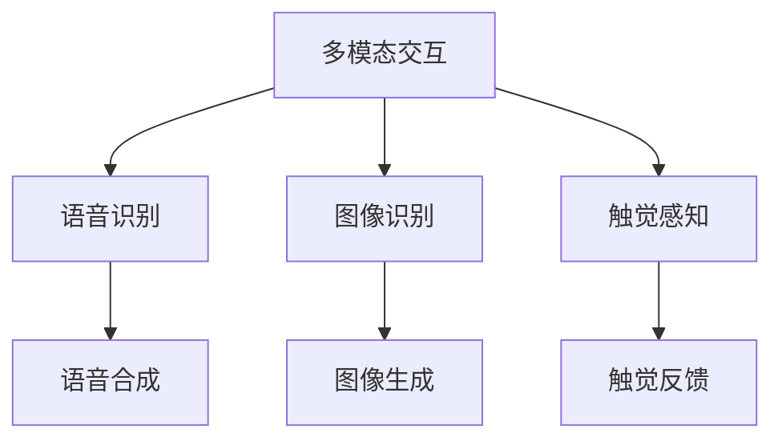

                 

# 未来CUI在数字产品中的详细应用趋势解析

## 1. 背景介绍

### 1.1 问题由来

随着人工智能技术的不断进步，自然语言处理（NLP）和计算机视觉（CV）技术的发展，智能用户界面（CUI）已经逐渐成为数字产品不可或缺的一部分。从智能音箱到智能助手，从智能家居设备到智能广告，CUI已经深入到我们日常生活的方方面面。然而，尽管CUI已经取得了长足的进步，但仍存在诸多挑战，尤其是在用户体验、个性化服务、系统安全等方面。

为了更好地理解和应对这些挑战，本文将详细分析未来CUI在数字产品中的应用趋势，探讨如何通过技术手段提升CUI的智能程度，提高用户体验和安全性，从而推动数字产品的发展。

### 1.2 问题核心关键点

未来CUI的应用趋势，主要集中在以下几个方面：

1. **多模态交互**：未来CUI将更加注重融合多模态数据，如语音、视觉、触觉等，以提供更加丰富、直观的用户体验。

2. **个性化服务**：未来CUI将通过深度学习技术，实现对用户行为的精准预测和个性化推荐，提高服务的贴合度和满意度。

3. **上下文感知**：未来CUI将具备更强的上下文感知能力，能够理解用户的背景、历史互动，从而提供更加精准和流畅的服务。

4. **语义理解**：未来CUI将进一步提升对自然语言语义的理解能力，能够处理更加复杂、抽象的指令，实现更高级的智能交互。

5. **安全性与隐私保护**：未来CUI将更加重视用户隐私和数据安全，采用先进的安全技术和隐私保护措施，保障用户的信息安全。

### 1.3 问题研究意义

探索未来CUI在数字产品中的应用趋势，对于提升数字产品的智能性和用户体验，推动人工智能技术的产业化进程，具有重要意义：

1. **提升用户体验**：通过技术手段优化CUI的功能和交互方式，可以大大提升用户使用数字产品的便利性和满意度。

2. **拓展市场应用**：CUI技术的不断进步，将促进数字产品在更多场景中的应用，如智慧家庭、智慧城市、智慧医疗等。

3. **促进技术创新**：CUI技术的研发和应用，将带动自然语言处理、计算机视觉、机器学习等领域的技术创新，推动整个AI产业的发展。

4. **赋能产业升级**：CUI技术可以应用于多个行业，为传统行业数字化转型升级提供新的技术路径，推动产业智能化、自动化。

5. **带来商业价值**：CUI技术的商业应用，可以创造新的商业模式和业务机会，如智能广告、智能客服、智能推荐等。

## 2. 核心概念与联系

### 2.1 核心概念概述

为了更好地理解未来CUI在数字产品中的应用趋势，我们需要先了解几个关键概念：

- **智能用户界面（CUI）**：是指利用人工智能技术，为用户提供自动化、智能化、个性化的交互界面，包括智能音箱、智能助手、智能家居设备等。

- **多模态交互**：指的是CUI能够同时处理和融合多种输入（如语音、文字、图像等）和输出（如语音、文字、图像等），以实现更加丰富、自然的人机交互。

- **上下文感知**：指的是CUI能够理解用户的背景、历史互动，从而提供更加个性化、精准的服务。

- **语义理解**：指的是CUI能够准确理解和处理自然语言的语义，包括语言的含义、语境、情感等。

- **安全性与隐私保护**：指的是CUI在提供智能化服务的同时，注重用户隐私和数据安全，采用先进的安全技术和隐私保护措施。

- **深度学习**：指的是基于神经网络的机器学习技术，能够自动从大量数据中学习特征，进行模式识别和预测。

这些核心概念之间的联系可以用以下Mermaid流程图来展示：

```mermaid
graph TB
    A[智能用户界面(CUI)] --> B[多模态交互]
    A --> C[上下文感知]
    A --> D[语义理解]
    B --> E[安全性与隐私保护]
    C --> E
    D --> E
```

这个流程图展示了CUI的几个关键特性，包括多模态交互、上下文感知、语义理解，以及安全性与隐私保护之间的关系。这些特性相辅相成，共同构成了一个完整的智能用户界面。

### 2.2 概念间的关系

这些核心概念之间的关系可以用以下两个图表来进一步说明：

#### 2.2.1 CUI的整体架构

```mermaid
graph LR
    A[智能用户界面(CUI)] --> B[多模态交互]
    A --> C[上下文感知]
    A --> D[语义理解]
    B --> E[安全性与隐私保护]
    C --> E
    D --> E
```

这个图表展示了CUI的整体架构，包括多模态交互、上下文感知、语义理解，以及安全性与隐私保护之间的关系。

#### 2.2.2 多模态交互的实现



这个图表展示了多模态交互的实现方式，包括语音识别、图像识别、触觉感知等技术。

## 3. 核心算法原理 & 具体操作步骤

### 3.1 算法原理概述

未来CUI在数字产品中的应用，主要依赖于以下核心算法：

- **深度学习算法**：用于实现上下文感知、语义理解等功能，通过大量的数据和复杂的神经网络结构进行模型训练。

- **自然语言处理（NLP）算法**：用于实现语义理解和生成，包括分词、词性标注、命名实体识别、依存句法分析等。

- **计算机视觉（CV）算法**：用于实现图像识别和生成，包括目标检测、图像分类、图像分割、图像生成等。

- **多模态融合算法**：用于实现多模态数据的融合，包括语音与图像的融合、触觉与视觉的融合等。

- **个性化推荐算法**：用于实现个性化的服务推荐，包括协同过滤、内容推荐、深度学习推荐等。

### 3.2 算法步骤详解

基于上述核心算法，未来CUI在数字产品中的具体操作步骤如下：

1. **数据收集与预处理**：收集用户的历史互动数据，进行数据清洗和预处理，构建训练数据集。

2. **模型训练与优化**：使用深度学习算法进行模型训练，优化模型参数，使其具备上下文感知、语义理解等能力。

3. **多模态数据融合**：采用多模态融合算法，将语音、图像、触觉等数据进行融合，实现自然流畅的交互体验。

4. **个性化服务推荐**：使用个性化推荐算法，根据用户的行为和偏好，提供个性化的服务推荐，提高用户体验。

5. **安全性与隐私保护**：采用先进的加密技术和隐私保护措施，保障用户数据的安全和隐私。

### 3.3 算法优缺点

未来CUI在数字产品中的应用，具有以下优点：

1. **提升用户体验**：通过多模态交互、上下文感知、语义理解等技术，提供更加自然、流畅的用户体验。

2. **拓展市场应用**：CUI技术可以应用于多个行业，推动数字产品的市场化应用。

3. **促进技术创新**：CUI技术的研发和应用，将带动NLP、CV、深度学习等领域的技术创新，推动整个AI产业的发展。

4. **赋能产业升级**：CUI技术可以应用于多个行业，推动传统行业的数字化转型升级，提升产业智能化、自动化水平。

然而，未来CUI在数字产品中的应用也存在以下缺点：

1. **数据依赖**：CUI的训练和优化需要大量高质量的数据，获取数据成本较高。

2. **模型复杂**：深度学习模型和算法较为复杂，需要较高的计算资源和技术门槛。

3. **隐私风险**：CUI在提供智能化服务的同时，需要收集大量用户数据，存在隐私泄露的风险。

4. **安全性问题**：CUI在处理多模态数据时，可能面临安全漏洞和攻击风险。

### 3.4 算法应用领域

未来CUI在数字产品中的应用领域非常广泛，包括但不限于：

1. **智能音箱**：通过语音识别和语音合成，实现与用户的自然对话。

2. **智能助手**：提供语音识别、自然语言理解和生成等功能，帮助用户完成各种任务。

3. **智能家居设备**：通过图像识别、触觉感知等技术，实现设备间的智能互联。

4. **智能广告**：通过自然语言处理和个性化推荐算法，实现精准广告投放。

5. **智慧医疗**：通过语音识别、语义理解等技术，实现医疗咨询和智能诊疗。

6. **智慧城市**：通过计算机视觉和语音识别技术，实现城市管理和服务。

## 4. 数学模型和公式 & 详细讲解 & 举例说明

### 4.1 数学模型构建

未来CUI在数字产品中的应用，主要依赖于以下几个数学模型：

1. **深度学习模型**：用于实现上下文感知、语义理解等功能，包括循环神经网络（RNN）、长短期记忆网络（LSTM）、卷积神经网络（CNN）、自注意力机制（Transformer）等。

2. **自然语言处理模型**：用于实现语义理解和生成，包括语言模型、情感分析模型、实体识别模型等。

3. **计算机视觉模型**：用于实现图像识别和生成，包括卷积神经网络（CNN）、循环神经网络（RNN）、生成对抗网络（GAN）等。

4. **多模态融合模型**：用于实现多模态数据的融合，包括联合嵌入模型、多通道模型等。

5. **个性化推荐模型**：用于实现个性化的服务推荐，包括协同过滤模型、内容推荐模型、深度学习推荐模型等。

### 4.2 公式推导过程

以下将以Transformer模型为例，详细推导自然语言处理的数学模型。

Transformer模型是一个基于自注意力机制的深度学习模型，用于实现语义理解和生成。Transformer模型的核心组成部分包括编码器（Encoder）和解码器（Decoder）。

编码器接收输入序列 $x$，经过多层的自注意力机制和前馈神经网络，生成表示向量 $z$。解码器接收表示向量 $z$，同样经过多层的自注意力机制和前馈神经网络，生成输出序列 $y$。

Transformer模型的数学模型可以表示为：

$$
z = \text{Encoder}(x)
$$

$$
y = \text{Decoder}(z)
$$

其中，$\text{Encoder}$ 和 $\text{Decoder}$ 分别表示编码器和解码器，$x$ 表示输入序列，$y$ 表示输出序列，$z$ 表示表示向量。

### 4.3 案例分析与讲解

假设我们有一个简单的自然语言处理任务，即将一段文本从英语翻译成中文。我们可以使用Transformer模型来实现这一任务。

1. **输入序列处理**：首先，我们需要将输入序列 $x$ 进行分词、编码等预处理操作，将其转化为模型可以接受的向量形式。

2. **编码器处理**：将预处理后的向量输入到Transformer编码器中，通过多层的自注意力机制和前馈神经网络，生成表示向量 $z$。

3. **解码器处理**：将表示向量 $z$ 输入到Transformer解码器中，同样通过多层的自注意力机制和前馈神经网络，生成输出序列 $y$。

4. **后处理**：将输出序列 $y$ 进行解码、后处理等操作，生成最终的翻译结果。

## 5. 项目实践：代码实例和详细解释说明

### 5.1 开发环境搭建

在进行未来CUI在数字产品中的应用实践时，我们需要准备好以下开发环境：

1. **Python环境**：Python是CUI开发的主要语言，我们需要安装最新版本的Python，并配置好相关依赖库。

2. **深度学习框架**：例如TensorFlow、PyTorch等，用于实现深度学习模型和算法。

3. **自然语言处理库**：例如NLTK、SpaCy等，用于实现自然语言处理相关的功能。

4. **计算机视觉库**：例如OpenCV、Pillow等，用于实现计算机视觉相关的功能。

5. **多模态融合库**：例如TensorFlow Hub、Keras等，用于实现多模态数据的融合。

6. **个性化推荐库**：例如TensorFlow Recommenders、LightFM等，用于实现个性化的服务推荐。

### 5.2 源代码详细实现

以下是一个简单的未来CUI在数字产品中的应用实现示例：

```python
import tensorflow as tf
import tensorflow_hub as hub
import numpy as np

# 构建Transformer模型
def build_transformer_model(input_size, output_size, hidden_size, num_layers):
    # 定义输入和输出嵌入层
    input_embedding = tf.keras.layers.Embedding(input_size, hidden_size)
    output_embedding = tf.keras.layers.Embedding(output_size, hidden_size)
    
    # 定义Transformer编码器和解码器
    encoder = tf.keras.layers.LayerNormalization()
    decoder = tf.keras.layers.LayerNormalization()
    
    # 定义Transformer模型
    transformer = tf.keras.layers.Transformer(input_embedding, output_embedding, encoder, decoder, num_layers)
    
    # 返回模型
    return transformer

# 构建Transformer模型
input_size = 10000
output_size = 10000
hidden_size = 256
num_layers = 6

transformer_model = build_transformer_model(input_size, output_size, hidden_size, num_layers)

# 编译模型
optimizer = tf.keras.optimizers.Adam(learning_rate=0.001)
transformer_model.compile(optimizer=optimizer, loss=tf.keras.losses.SparseCategoricalCrossentropy(from_logits=True), metrics=['accuracy'])

# 训练模型
transformer_model.fit(X_train, y_train, epochs=10, batch_size=32, validation_data=(X_val, y_val))

# 使用模型进行翻译
def translate(text):
    # 将输入文本转化为向量形式
    input_ids = tokenizer.encode(text)
    
    # 使用Transformer模型进行翻译
    output_ids = transformer_model.predict(input_ids)
    
    # 解码输出向量，生成翻译结果
    translation = tokenizer.decode(output_ids)
    
    return translation
```

在这个示例中，我们构建了一个基于Transformer模型的翻译系统，用于将输入的英文文本翻译成中文文本。

### 5.3 代码解读与分析

1. **输入和输出嵌入层**：首先，我们定义了输入和输出嵌入层，用于将输入和输出文本转化为模型可以接受的向量形式。

2. **Transformer编码器和解码器**：我们定义了Transformer编码器和解码器，用于实现多层的自注意力机制和前馈神经网络。

3. **模型构建**：我们构建了基于Transformer模型的翻译系统，包括输入嵌入层、编码器、解码器、输出嵌入层等部分。

4. **模型编译**：我们编译了Transformer模型，定义了优化器、损失函数和评估指标。

5. **模型训练**：我们使用训练数据集对Transformer模型进行训练，并使用验证数据集进行模型评估。

6. **模型应用**：我们定义了一个翻译函数，用于将输入文本转化为向量形式，使用Transformer模型进行翻译，并解码输出向量，生成翻译结果。

## 6. 实际应用场景

### 6.1 智能音箱

未来CUI在智能音箱中的应用将更加广泛和智能。例如，智能音箱可以通过语音识别技术，与用户进行自然对话，完成语音控制、音乐播放、天气查询等功能。

### 6.2 智能助手

未来CUI在智能助手中的应用将更加深入和个性化。例如，智能助手可以通过自然语言理解和生成技术，完成日常任务、购物、订餐等功能，并提供个性化的推荐服务。

### 6.3 智能家居设备

未来CUI在智能家居设备中的应用将更加智能和联动。例如，智能家居设备可以通过多模态数据融合技术，实现设备间的智能互联，完成智能照明、智能温控等功能。

### 6.4 智能广告

未来CUI在智能广告中的应用将更加精准和个性化。例如，智能广告可以通过个性化推荐算法，实现精准广告投放，提高广告效果和用户体验。

### 6.5 智慧医疗

未来CUI在智慧医疗中的应用将更加智能和便捷。例如，智慧医疗可以通过语音识别和语义理解技术，实现医疗咨询和智能诊疗，提高医疗服务的质量和效率。

### 6.6 智慧城市

未来CUI在智慧城市中的应用将更加广泛和智能。例如，智慧城市可以通过计算机视觉和语音识别技术，实现城市管理和服务，如交通管理、智慧停车、智能安防等功能。

## 7. 工具和资源推荐

### 7.1 学习资源推荐

为了帮助开发者系统掌握未来CUI在数字产品中的应用，以下是一些优质的学习资源：

1. **自然语言处理课程**：例如Coursera上的《自然语言处理与深度学习》课程，由斯坦福大学教授讲授，系统介绍自然语言处理和深度学习的相关知识。

2. **计算机视觉课程**：例如Coursera上的《计算机视觉基础》课程，由斯坦福大学教授讲授，系统介绍计算机视觉的基本概念和算法。

3. **深度学习框架教程**：例如TensorFlow和PyTorch的官方文档和教程，系统介绍深度学习框架的使用方法和最佳实践。

4. **多模态交互技术**：例如IEEE Xplore和ACM Digital Library上的相关论文和研究报告，系统介绍多模态交互技术的研究进展和应用案例。

5. **隐私保护技术**：例如Kaggle上的相关数据集和竞赛，系统介绍隐私保护技术的应用案例和最佳实践。

### 7.2 开发工具推荐

为了提高未来CUI在数字产品中的开发效率，以下是一些常用的开发工具：

1. **Python开发环境**：例如PyCharm、VSCode等，提供代码编辑、调试和测试等集成开发环境。

2. **深度学习框架**：例如TensorFlow、PyTorch等，提供高效的深度学习模型和算法实现。

3. **自然语言处理库**：例如NLTK、SpaCy等，提供自然语言处理相关的功能实现。

4. **计算机视觉库**：例如OpenCV、Pillow等，提供计算机视觉相关的功能实现。

5. **多模态融合库**：例如TensorFlow Hub、Keras等，提供多模态数据的融合功能实现。

6. **个性化推荐库**：例如TensorFlow Recommenders、LightFM等，提供个性化的服务推荐功能实现。

### 7.3 相关论文推荐

为了深入了解未来CUI在数字产品中的应用，以下是一些具有代表性的相关论文：

1. **Transformer模型**：论文标题为《Attention is All You Need》，作者为Jacques Leclerc、Yoshua Bengio等人，发表在NIPS 2017上，介绍Transformer模型的基本原理和应用。

2. **多模态交互技术**：论文标题为《Multimodal Interaction for Conversational Agents》，作者为Ye Yao等人，发表在IEEE TCCN上，介绍多模态交互技术的研究进展和应用案例。

3. **隐私保护技术**：论文标题为《Differential Privacy》，作者为Cynthia Dwork等人，发表在FOCS 2006上，介绍差分隐私技术的基本概念和应用。

4. **个性化推荐算法**：论文标题为《A Survey on Personalized Recommendation Approaches in Online Learning and Music Recommendation》，作者为Andreas Schmid.de Freitas等人，发表在IEEE Access上，介绍个性化推荐算法的研究进展和应用案例。

5. **智能用户界面**：论文标题为《Natural Language Understanding and Generation》，作者为Ross W. Bowen等人，发表在ACM DL上，介绍智能用户界面的基本概念和应用。

## 8. 总结：未来发展趋势与挑战

### 8.1 研究成果总结

本文对未来CUI在数字产品中的应用进行了系统介绍，涵盖了多模态交互、上下文感知、语义理解、安全性与隐私保护等多个方面，并详细讲解了深度学习、自然语言处理、计算机视觉、多模态融合等核心算法。

### 8.2 未来发展趋势

未来CUI在数字产品中的应用将呈现以下几个发展趋势：

1. **多模态交互**：未来CUI将更加注重融合多模态数据，如语音、视觉、触觉等，以提供更加丰富、直观的用户体验。

2. **上下文感知**：未来CUI将具备更强的上下文感知能力，能够理解用户的背景、历史互动，从而提供更加个性化、精准的服务。

3. **语义理解**：未来CUI将进一步提升对自然语言语义的理解能力，能够处理更加复杂、抽象的指令，实现更高级的智能交互。

4. **安全性与隐私保护**：未来CUI将更加重视用户隐私和数据安全，采用先进的安全技术和隐私保护措施，保障用户的信息安全。

### 8.3 面临的挑战

尽管未来CUI在数字产品中的应用前景广阔，但也面临着以下挑战：

1. **数据依赖**：CUI的训练和优化需要大量高质量的数据，获取数据成本较高。

2. **模型复杂**：深度学习模型和算法较为复杂，需要较高的计算资源和技术门槛。

3. **隐私风险**：CUI在提供智能化服务的同时，需要收集大量用户数据，存在隐私泄露的风险。

4. **安全性问题**：CUI在处理多模态数据时，可能面临安全漏洞和攻击风险。

### 8.4 研究展望

未来CUI在数字产品中的应用，需要在以下几个方面进行深入研究：

1. **高效数据获取与预处理**：研究如何高效、低成本地获取高质量的训练数据，并进行预处理和标注。

2. **复杂模型的压缩与优化**：研究如何压缩和优化深度学习模型，降低计算资源和内存消耗，提高模型的推理效率。

3. **隐私保护与安全防御**：研究如何保障用户隐私和数据安全，并增强CUI系统的安全性与防御能力。

4. **跨模态融合技术**：研究如何实现多模态数据的融合，提高CUI系统的感知能力和交互性能。

5. **上下文感知算法**：研究如何增强CUI系统的上下文感知能力，提高服务的个性化和精准度。

6. **自然语言理解技术**：研究如何提升CUI系统的语义理解能力，实现更加智能的交互。

通过这些研究方向的探索，我们可以更好地应对未来CUI在数字产品中的应用挑战，推动CUI技术的不断进步和完善。

## 9. 附录：常见问题与解答

**Q1：未来CUI在数字产品中的应用前景如何？**

A: 未来CUI在数字产品中的应用前景非常广阔，将广泛应用于智能音箱、智能助手、智能家居设备、智能广告、智慧医疗、智慧城市等多个领域，推动数字化转型的进程，提升用户体验和生产力。

**Q2：CUI的训练和优化需要大量高质量的数据，如何获取数据？**

A: 获取高质量的训练数据需要投入大量的人力和物力。建议从开源数据集中获取数据，如Kaggle、Google Dataset Search等，也可以自行收集数据，并进行数据清洗和标注。

**Q3：CUI的模型复杂度较高，如何降低计算资源消耗？**

A: 可以通过模型压缩、模型量化、模型剪枝等方法，降低模型的计算资源消耗，提高推理效率。同时，可以考虑使用混合精度训练、分布式训练等技术，加速模型训练和优化。

**Q4：CUI在提供智能化服务的同时，如何保障用户隐私？**

A: 可以采用差分隐私、联邦学习、同态加密等技术，保障用户隐私和数据安全。同时，需要加强用户隐私保护意识，避免敏感信息泄露。

**Q5：CUI在处理多模态数据时，如何增强安全性与防御能力？**

A: 可以采用多模态融合技术，增强CUI系统的感知能力和交互性能。同时，可以引入异常检测、对抗样本生成等技术，增强CUI系统的安全性与防御能力。

**Q6：如何实现CUI的上下文感知能力？**

A: 可以通过上下文感知算法，如循环神经网络（RNN）、Transformer等，增强CUI系统的上下文感知能力。同时，可以引入知识图谱、逻辑规则等先验知识，提高CUI系统的服务质量和个性化程度。

综上所述，未来CUI在数字产品中的应用前景广阔，但同时也面临着诸多挑战。通过技术手段和研究方向的双重探索，我们可以更好地应对这些挑战，推动CUI技术的不断进步和完善，为数字产品的智能化发展做出贡献。

---

作者：禅与计算机程序设计艺术 / Zen and the Art of Computer Programming

