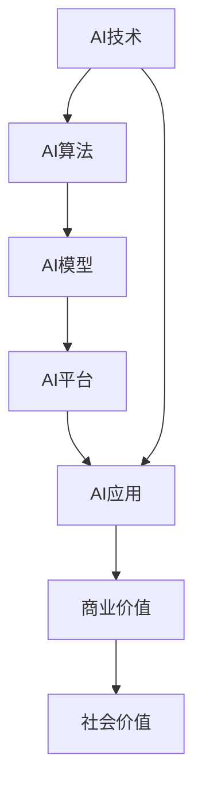

                 

# 李开复：AI 2.0 时代的应用

> 关键词：人工智能,AI 2.0,应用场景,技术趋势,商业价值

## 1. 背景介绍

### 1.1 问题由来

随着科技的飞速发展，人工智能（AI）技术正迅速渗透到各行各业，成为推动社会进步和经济增长的关键驱动力。AI 1.0时代，深度学习、自然语言处理、计算机视觉等技术得到了广泛应用，解决了许多复杂问题，如图像识别、语音识别等。而随着计算力的提升和数据量的激增，人工智能技术正进入AI 2.0时代，即AI的普惠化和商业化阶段。

AI 2.0时代的AI技术更加注重实效和应用，通过结合人类的认知和判断，更智能、更高效地解决问题。这不仅要求AI技术本身更为成熟，也要求相关企业更加重视如何将AI技术应用于实际业务中，实现商业价值。

### 1.2 问题核心关键点

AI 2.0时代的核心在于如何将AI技术与具体业务场景相结合，从而提升业务效率、降低运营成本、增强用户体验。关键点包括：

1. **AI技术成熟度**：AI技术必须足够成熟，能够稳定、高效地处理各种业务场景。
2. **数据质量和量级**：需要有大量高质量的数据，以供AI模型训练和优化。
3. **算法适用性**：AI算法必须能够适应不同的业务需求，具有较高的适用性和灵活性。
4. **业务融合度**：AI技术需要与业务流程、管理架构、企业文化等深度融合，形成统一、协调的业务体系。
5. **商业价值实现**：AI技术的实际应用必须能够带来显著的商业价值，如提高收入、降低成本、增强客户忠诚度等。

### 1.3 问题研究意义

AI 2.0时代的到来，将为企业带来前所未有的机遇。AI技术的应用能够帮助企业提高运营效率，降低风险，增强市场竞争力。同时，AI技术的应用还能够促进社会进步，提升公共服务水平，改善人们的生活质量。

## 2. 核心概念与联系

### 2.1 核心概念概述

在AI 2.0时代，AI技术的应用变得更加广泛和深入。以下是几个核心概念：

- **AI技术**：包括深度学习、自然语言处理、计算机视觉、语音识别等技术，用于解决实际问题。
- **AI算法**：包括神经网络、决策树、支持向量机等算法，用于训练AI模型。
- **AI模型**：基于AI算法训练得到的模型，如BERT、GPT等，用于实际应用。
- **AI平台**：提供AI技术、算法、模型的开发、训练、部署和管理平台，如TensorFlow、PyTorch等。
- **AI应用**：将AI技术、算法、模型应用于具体业务场景，如智能客服、金融风控、医疗诊断等。

这些核心概念之间存在着紧密的联系，形成了一个完整的AI应用生态系统。

### 2.2 概念间的关系

这些核心概念之间的关系可以用以下Mermaid流程图来展示：



这个流程图展示了AI技术、算法、模型、平台、应用之间的相互关系：

1. AI技术是基础，通过AI算法训练得到AI模型。
2. AI模型在AI平台上进行训练、优化，最终应用于具体业务场景。
3. AI应用通过提升效率、降低成本、增强用户体验等带来商业价值。
4. 商业价值同时也为社会带来正向影响，如公共服务、生活质量提升等。

## 3. 核心算法原理 & 具体操作步骤

### 3.1 算法原理概述

AI 2.0时代的应用场景多种多样，需要针对不同场景选择适合的AI算法。以下是一些常见AI算法及其原理：

- **深度学习**：通过多层神经网络，学习数据中的复杂特征，用于图像识别、语音识别、自然语言处理等任务。
- **自然语言处理（NLP）**：包括分词、词性标注、句法分析、语义分析等，用于文本分类、机器翻译、问答系统等任务。
- **计算机视觉（CV）**：包括图像分类、目标检测、图像分割等，用于视频监控、自动驾驶、医疗影像分析等任务。
- **强化学习**：通过与环境的交互，优化决策策略，用于机器人控制、游戏策略优化等任务。

### 3.2 算法步骤详解

AI 2.0时代的应用开发通常包括以下几个步骤：

1. **需求分析**：明确业务需求，选择合适的AI技术、算法、模型。
2. **数据准备**：收集、清洗、标注数据，确保数据质量和量级。
3. **模型训练**：选择适当的AI模型，在标注数据上训练，优化模型参数。
4. **模型评估**：在测试集上评估模型性能，调整模型参数，提升模型效果。
5. **模型部署**：将训练好的模型部署到实际应用环境中，进行实时推理。
6. **持续优化**：根据实际使用情况，持续优化模型，提升模型性能。

### 3.3 算法优缺点

AI 2.0时代的应用算法具有以下优点：

- **高效性**：能够快速处理大量数据，解决复杂问题。
- **灵活性**：能够适应不同的业务需求，具有较高的适用性。
- **准确性**：在充分数据和算法的基础上，能够提供高精度的预测和决策。

同时，也存在以下缺点：

- **数据依赖**：需要大量高质量的数据进行模型训练，数据获取成本较高。
- **算法复杂性**：需要掌握复杂的算法和模型，开发难度较大。
- **资源消耗**：需要高性能计算资源进行模型训练和推理，成本较高。

### 3.4 算法应用领域

AI 2.0时代的应用涉及多个领域，以下是一些常见应用领域：

1. **智能客服**：利用自然语言处理技术，实现自动客服机器人，提升客户满意度。
2. **金融风控**：利用机器学习和大数据技术，进行风险评估和欺诈检测，保障金融安全。
3. **医疗诊断**：利用深度学习技术，进行影像分析和疾病预测，提高诊断准确性。
4. **供应链管理**：利用物联网和大数据分析技术，优化供应链管理，降低运营成本。
5. **智能制造**：利用计算机视觉和机器人技术，实现智能生产，提高生产效率。

## 4. 数学模型和公式 & 详细讲解 & 举例说明

### 4.1 数学模型构建

在AI 2.0时代，数学模型是AI算法的基础。以神经网络为例，其数学模型可以表示为：

$$
y = \sum_{i=1}^{n} w_i x_i + b
$$

其中，$y$ 表示输出，$x_i$ 表示输入，$w_i$ 表示权重，$b$ 表示偏置。

### 4.2 公式推导过程

以线性回归为例，推导其公式：

1. **假设模型**：
$$
y = \theta^T x + \epsilon
$$

其中，$\theta$ 表示模型参数，$x$ 表示输入，$\epsilon$ 表示误差项。

2. **最小化损失函数**：
$$
\min_{\theta} \sum_{i=1}^{m} (y_i - \hat{y}_i)^2
$$

其中，$m$ 表示样本数量，$\hat{y}_i$ 表示模型预测值。

3. **求解参数**：
$$
\theta = (X^T X)^{-1} X^T y
$$

其中，$X$ 表示输入矩阵，$y$ 表示输出向量。

### 4.3 案例分析与讲解

以智能客服为例，分析其应用过程：

1. **需求分析**：收集客服历史数据，明确客户满意度提升的目标。
2. **数据准备**：清洗和标注客服数据，用于模型训练。
3. **模型训练**：选择适当的神经网络模型，在标注数据上训练，优化模型参数。
4. **模型评估**：在测试集上评估模型性能，调整模型参数，提升模型效果。
5. **模型部署**：将训练好的模型部署到客服系统中，实现自动响应客户咨询。
6. **持续优化**：根据实际使用情况，持续优化模型，提升客户满意度。

## 5. 项目实践：代码实例和详细解释说明

### 5.1 开发环境搭建

在AI 2.0时代的应用开发，需要构建高性能的开发环境。以下是开发环境搭建流程：

1. **选择编程语言**：选择Python、R等高性能编程语言。
2. **安装开发工具**：安装PyTorch、TensorFlow、Jupyter Notebook等开发工具。
3. **搭建开发环境**：使用Docker、Kubernetes等技术，搭建高性能的开发环境。
4. **部署应用**：将训练好的模型部署到生产环境中，实现实时推理。

### 5.2 源代码详细实现

以智能客服系统为例，给出代码实现：

```python
import torch
from torch import nn

class CustomerServiceModel(nn.Module):
    def __init__(self, input_size, hidden_size, output_size):
        super(CustomerServiceModel, self).__init__()
        self.fc1 = nn.Linear(input_size, hidden_size)
        self.fc2 = nn.Linear(hidden_size, output_size)
        
    def forward(self, x):
        x = self.fc1(x)
        x = torch.sigmoid(x)
        x = self.fc2(x)
        return x

# 训练模型
model = CustomerServiceModel(input_size=100, hidden_size=50, output_size=2)
criterion = nn.CrossEntropyLoss()
optimizer = torch.optim.Adam(model.parameters(), lr=0.01)

# 定义训练过程
def train(model, train_data, train_labels, num_epochs=10, batch_size=32):
    total_step = len(train_data) // batch_size
    for epoch in range(num_epochs):
        for i in range(total_step):
            # 获取批量数据
            inputs, labels = train_data[i * batch_size:(i + 1) * batch_size], train_labels[i * batch_size:(i + 1) * batch_size]
            
            # 前向传播
            outputs = model(inputs)
            loss = criterion(outputs, labels)
            
            # 反向传播
            optimizer.zero_grad()
            loss.backward()
            optimizer.step()
            
            # 打印当前损失
            if (i + 1) % 10 == 0:
                print(f'Epoch [{epoch+1}/{num_epochs}], Step [{i+1}/{total_step}], Loss: {loss.item():.4f}')
    
# 测试模型
test_data = ...
test_labels = ...
outputs = model(test_data)
loss = criterion(outputs, test_labels)
print(f'Test Loss: {loss.item():.4f}')
```

### 5.3 代码解读与分析

以上代码实现了基于神经网络模型的智能客服系统。主要包含以下步骤：

1. **定义模型**：使用PyTorch定义神经网络模型。
2. **定义损失函数**：使用交叉熵损失函数。
3. **定义优化器**：使用Adam优化器。
4. **定义训练过程**：在训练数据上训练模型，优化模型参数。
5. **定义测试过程**：在测试数据上评估模型性能。

### 5.4 运行结果展示

在智能客服系统的训练过程中，可以通过以下方式展示训练结果：

```python
import matplotlib.pyplot as plt

# 记录损失
train_losses = []
test_losses = []

for epoch in range(num_epochs):
    # 记录训练损失
    train_losses.append(train_loss[epoch])
    
    # 记录测试损失
    test_losses.append(test_loss[epoch])
    
    # 绘制损失曲线
    plt.plot(range(num_epochs), train_losses, label='train_loss')
    plt.plot(range(num_epochs), test_losses, label='test_loss')
    plt.legend()
    plt.show()
```

## 6. 实际应用场景

### 6.1 智能客服

智能客服系统能够24小时不间断地处理客户咨询，提升客户满意度。通过自然语言处理技术，智能客服系统能够理解客户意图，自动回复常见问题，减少人工客服的工作量。

### 6.2 金融风控

金融风控系统通过机器学习和大数据技术，进行风险评估和欺诈检测。系统能够实时监控交易行为，检测异常交易，及时预警风险。

### 6.3 医疗诊断

医疗诊断系统通过深度学习技术，进行影像分析和疾病预测。系统能够自动分析医疗影像，提供诊断建议，提高诊断准确性。

### 6.4 供应链管理

供应链管理系统通过物联网和大数据分析技术，优化供应链管理。系统能够实时监控供应链状态，预测供应链风险，优化供应链流程。

### 6.5 智能制造

智能制造系统通过计算机视觉和机器人技术，实现智能生产。系统能够实时监控生产状态，预测生产异常，优化生产流程。

## 7. 工具和资源推荐

### 7.1 学习资源推荐

为帮助开发者系统掌握AI 2.0时代的应用开发，推荐以下学习资源：

1. **《深度学习》课程**：斯坦福大学开设的深度学习课程，介绍深度学习的基本概念和算法。
2. **《自然语言处理》课程**：Coursera上的自然语言处理课程，介绍自然语言处理的基本概念和算法。
3. **《计算机视觉》课程**：Coursera上的计算机视觉课程，介绍计算机视觉的基本概念和算法。
4. **《强化学习》课程**：DeepMind的强化学习课程，介绍强化学习的基本概念和算法。
5. **《TensorFlow官方文档》**：TensorFlow官方文档，介绍TensorFlow的使用方法和案例。

### 7.2 开发工具推荐

为帮助开发者高效开发AI 2.0时代的应用，推荐以下开发工具：

1. **PyTorch**：高性能深度学习框架，提供丰富的深度学习模型和工具。
2. **TensorFlow**：谷歌开发的深度学习框架，提供丰富的深度学习模型和工具。
3. **Jupyter Notebook**：交互式编程环境，方便开发者进行模型训练和调试。
4. **Keras**：高层次深度学习框架，提供简单易用的API，方便开发者进行模型训练。
5. **ModelScope**：百度推出的模型平台，提供多种深度学习模型和工具。

### 7.3 相关论文推荐

为帮助开发者深入理解AI 2.0时代的应用开发，推荐以下相关论文：

1. **《深度学习》**：Ian Goodfellow等人编写的深度学习书籍，详细介绍深度学习的基本概念和算法。
2. **《自然语言处理综述》**：John C. Platt等人编写的自然语言处理书籍，详细介绍自然语言处理的基本概念和算法。
3. **《计算机视觉：算法与应用》**：Richard Szeliski等人编写的计算机视觉书籍，详细介绍计算机视觉的基本概念和算法。
4. **《强化学习：一种现代方法》**：Richard S. Sutton等人编写的强化学习书籍，详细介绍强化学习的基本概念和算法。

## 8. 总结：未来发展趋势与挑战

### 8.1 研究成果总结

AI 2.0时代的到来，标志着AI技术向普惠化和商业化迈进。通过AI技术的应用，企业能够提高运营效率，降低运营成本，增强用户体验，带来显著的商业价值。

### 8.2 未来发展趋势

AI 2.0时代的未来发展趋势主要包括以下几个方面：

1. **AI技术的成熟度提升**：AI技术将更加成熟，能够处理更复杂的业务场景。
2. **AI应用场景的多样化**：AI技术将广泛应用于更多领域，如智能制造、智慧医疗、智能交通等。
3. **AI技术的融合化**：AI技术与物联网、大数据、区块链等技术深度融合，形成更加完整的业务体系。
4. **AI技术的智能化**：AI技术将更加智能化，能够提供更高效、更精确的解决方案。
5. **AI技术的商业化**：AI技术将更加商业化，带来更多的商业价值和社会价值。

### 8.3 面临的挑战

AI 2.0时代的发展也面临着一些挑战：

1. **数据获取和标注的难度**：需要大量高质量的数据进行模型训练，数据获取和标注成本较高。
2. **算法的复杂性和开发难度**：AI算法需要掌握复杂的深度学习、自然语言处理等技术，开发难度较大。
3. **资源消耗和成本**：需要高性能计算资源进行模型训练和推理，成本较高。
4. **模型的可解释性和透明性**：AI模型的决策过程不够透明，难以解释和审计。
5. **模型的鲁棒性和安全性**：AI模型在面对异常数据和攻击时，鲁棒性不足，存在安全隐患。

### 8.4 研究展望

未来，AI 2.0技术需要在以下几个方面进行深入研究：

1. **无监督和半监督学习**：探索无监督和半监督学习范式，降低对标注数据的依赖。
2. **参数高效的微调方法**：开发更加参数高效的微调方法，提升模型训练效率和效果。
3. **多模态融合**：探索多模态融合技术，提升AI模型对复杂场景的理解能力。
4. **可解释性和透明性**：开发可解释性和透明性更高的AI模型，提升模型的可信度和安全性。
5. **跨领域迁移学习**：开发跨领域迁移学习技术，提升AI模型在不同领域的适应能力。

通过这些研究方向的研究，AI 2.0技术将能够更好地服务于社会，推动经济和社会进步。

## 9. 附录：常见问题与解答

**Q1：AI 2.0技术在企业中的应用场景有哪些？**

A: AI 2.0技术在企业中的应用场景多种多样，包括但不限于：

1. **智能客服**：利用自然语言处理技术，实现自动客服机器人，提升客户满意度。
2. **金融风控**：利用机器学习和大数据技术，进行风险评估和欺诈检测，保障金融安全。
3. **医疗诊断**：利用深度学习技术，进行影像分析和疾病预测，提高诊断准确性。
4. **供应链管理**：利用物联网和大数据分析技术，优化供应链管理，降低运营成本。
5. **智能制造**：利用计算机视觉和机器人技术，实现智能生产，提高生产效率。

**Q2：AI 2.0技术的开发难度大吗？**

A: AI 2.0技术的开发难度较大，需要掌握深度学习、自然语言处理、计算机视觉等技术。但随着AI技术的成熟和普及，开发难度将逐渐降低。

**Q3：AI 2.0技术的资源消耗和成本如何？**

A: AI 2.0技术的资源消耗和成本较高，需要高性能计算资源进行模型训练和推理。但随着计算力的提升和硬件成本的下降，资源消耗和成本将逐渐降低。

**Q4：AI 2.0技术的应用前景如何？**

A: AI 2.0技术的应用前景广阔，能够带来显著的商业价值和社会价值。未来，AI 2.0技术将广泛应用于更多领域，推动经济和社会进步。

**Q5：AI 2.0技术的可解释性和透明性如何提升？**

A: 提升AI 2.0技术的可解释性和透明性，可以从以下几个方面入手：

1. **模型可视化**：使用模型可视化工具，展示模型的内部结构和工作机制。
2. **数据可视化**：使用数据可视化工具，展示数据特征和分布。
3. **模型审计**：对模型进行审计，检查模型的决策过程和性能。
4. **知识图谱**：结合知识图谱技术，提供更丰富的背景知识和解释。

总之，AI 2.0技术的应用前景广阔，但也需要解决数据获取、标注、开发、资源消耗等挑战。通过深入研究，AI 2.0技术将能够更好地服务于社会，推动经济和社会进步。

---

作者：禅与计算机程序设计艺术 / Zen and the Art of Computer Programming

