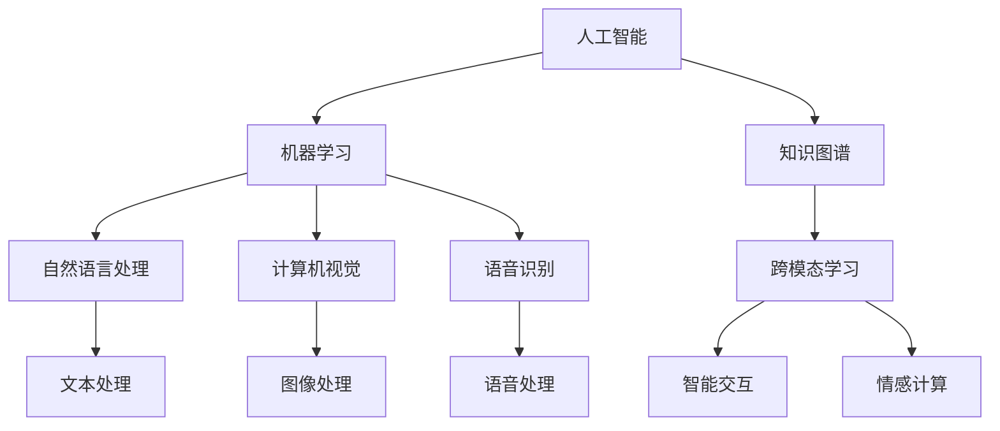

                 

# 李开复：苹果发布AI应用的产业

## 1. 背景介绍

苹果公司在人工智能(AI)领域的最新动作引起了广泛关注。近期，苹果发布了其最新的AI应用，涉及语音识别、图像识别、自然语言处理(NLP)等多个领域，展示了其在AI领域的深耕与布局。本文将从产业角度深入探讨苹果的AI应用及其对未来的影响。

## 2. 核心概念与联系

### 2.1 核心概念概述

为了更好地理解苹果公司的AI应用，首先需要明确几个关键概念：

- **人工智能(AI)**：指通过计算机技术模拟人类智能过程，实现自动化、智能化决策和操作的学科。AI应用广泛，涵盖自然语言处理、计算机视觉、语音识别、机器学习等多个领域。
- **机器学习(ML)**：AI的一个分支，通过数据训练模型，使机器具备自我学习能力，从而进行预测、分类、识别等任务。
- **自然语言处理(NLP)**：研究如何让计算机理解和处理自然语言的技术，是AI的重要分支之一。
- **计算机视觉(CV)**：研究如何让计算机“看”的技术，涉及图像处理、目标检测、人脸识别等。
- **语音识别(SR)**：研究如何让计算机“听”的技术，涉及声学建模、语言模型、声纹识别等。

这些概念之间相互关联，共同构成了AI应用的基础架构。

### 2.2 概念间的关系

这些核心概念之间存在着紧密的联系，可以通过以下Mermaid流程图来展示：



这个流程图展示了AI应用的基本结构：

1. 人工智能包含多个子领域，如机器学习、自然语言处理、计算机视觉、语音识别等。
2. 这些子领域之间相互协作，共同实现智能系统的不同功能，如文本处理、图像处理、语音处理等。
3. 智能交互和情感计算是AI应用的核心，通过跨模态学习和知识图谱技术，实现更全面、更自然的用户互动。

通过这个流程图，可以更清晰地理解苹果AI应用的多样性和复杂性。

## 3. 核心算法原理 & 具体操作步骤

### 3.1 算法原理概述

苹果公司的AI应用涵盖了多个领域，包括自然语言处理、图像识别、语音识别等。以自然语言处理为例，其核心算法原理主要基于深度学习技术，通过预训练语言模型，如BERT、GPT等，对大规模语料进行预训练，然后在特定任务上进行微调，从而提升模型性能。

具体而言，苹果的AI应用主要包括以下几个步骤：

1. **数据收集**：收集并标注大规模语料，作为模型的预训练数据。
2. **模型训练**：使用深度学习框架（如PyTorch、TensorFlow等），在预训练语言模型的基础上，进行特定任务的微调。
3. **模型评估**：在验证集上评估模型性能，选择最优模型进行后续测试。
4. **模型部署**：将模型部署到实际应用中，进行实时推理。

### 3.2 算法步骤详解

以语音识别为例，具体步骤包括：

- **数据收集**：收集大量的语音数据，并进行标注，如识别结果、发音特征等。
- **模型训练**：使用声学模型和语言模型，对数据进行训练，得到语音识别模型。
- **模型评估**：在测试集上评估模型性能，如识别准确率、混淆矩阵等。
- **模型部署**：将模型部署到移动设备、服务器等环境中，进行实时语音识别。

### 3.3 算法优缺点

苹果的AI应用具有以下优点：

- **高性能**：基于深度学习技术的AI应用，具备强大的数据处理能力和高效的推理能力。
- **易用性**：通过用户友好的界面和易用的API，使得AI应用能够快速集成到各种产品中。
- **跨平台**：苹果的AI应用可以在iOS、macOS、watchOS等多个平台上运行，提供了跨平台的协同效应。

同时，也存在一些缺点：

- **高成本**：大规模数据收集、模型训练和部署需要大量的硬件和人力资源。
- **隐私问题**：AI应用涉及大量用户数据，需要严格的隐私保护措施。
- **泛化能力**：尽管AI应用在特定领域表现优异，但对于未知数据和复杂场景的泛化能力仍需提升。

### 3.4 算法应用领域

苹果的AI应用广泛应用于以下领域：

- **语音助手(SR)**：如Siri，能够识别和理解用户的语音指令，进行智能回答。
- **图像识别(CV)**：如Face ID，能够进行人脸识别，用于解锁、支付等场景。
- **自然语言处理(NLP)**：如自动翻译、情感分析等，提升用户体验。
- **推荐系统**：如内容推荐、广告推荐等，提供个性化服务。
- **智能交互**：如智能聊天机器人、虚拟助手等，提升用户体验。

## 4. 数学模型和公式 & 详细讲解

### 4.1 数学模型构建

苹果的AI应用涉及到多种数学模型，以下以自然语言处理为例，构建数学模型：

1. **预训练模型**：使用BERT、GPT等预训练语言模型，对大规模语料进行预训练。
2. **微调模型**：在特定任务上，使用微调技术，对预训练模型进行任务特定的优化。
3. **评估模型**：使用交叉熵损失函数，对模型在验证集上的性能进行评估。

### 4.2 公式推导过程

以自然语言处理为例，推导交叉熵损失函数的计算公式：

假设模型在输入$x$上的输出为$\hat{y}$，真实标签为$y$，则交叉熵损失函数为：

$$
\ell(M_{\theta}(x),y) = -y\log \hat{y} - (1-y)\log (1-\hat{y})
$$

其中，$M_{\theta}(x)$表示模型的前向传播过程，$\theta$为模型参数。

通过反向传播算法，可以得到损失函数对参数$\theta$的梯度：

$$
\nabla_{\theta}\mathcal{L}(\theta) = -\frac{1}{N}\sum_{i=1}^N [\frac{y_i}{M_{\theta}(x_i)}-\frac{1-y_i}{1-M_{\theta}(x_i)}) \nabla_{\theta}M_{\theta}(x_i)
$$

通过优化算法（如Adam、SGD等），最小化损失函数，即可更新模型参数$\theta$，得到最优模型。

### 4.3 案例分析与讲解

以情感分析为例，分析其数学模型和计算公式。

假设模型在输入$x$上的输出为$\hat{y}$，真实标签为$y$，则情感分析的交叉熵损失函数为：

$$
\ell(M_{\theta}(x),y) = -y\log \hat{y} - (1-y)\log (1-\hat{y})
$$

其中，$\hat{y}$表示模型预测的情感类别概率，$y$表示真实情感类别。

通过反向传播算法，可以得到损失函数对参数$\theta$的梯度：

$$
\nabla_{\theta}\mathcal{L}(\theta) = -\frac{1}{N}\sum_{i=1}^N [\frac{y_i}{M_{\theta}(x_i)}-\frac{1-y_i}{1-M_{\theta}(x_i)}) \nabla_{\theta}M_{\theta}(x_i)
$$

通过优化算法（如Adam、SGD等），最小化损失函数，即可更新模型参数$\theta$，得到最优模型。

## 5. 项目实践：代码实例和详细解释说明

### 5.1 开发环境搭建

在进行AI应用开发前，需要先准备好开发环境。以下是使用Python进行TensorFlow开发的环境配置流程：

1. 安装Anaconda：从官网下载并安装Anaconda，用于创建独立的Python环境。

2. 创建并激活虚拟环境：
```bash
conda create -n tf-env python=3.8 
conda activate tf-env
```

3. 安装TensorFlow：根据CUDA版本，从官网获取对应的安装命令。例如：
```bash
pip install tensorflow==2.3.0
```

4. 安装其他工具包：
```bash
pip install numpy pandas scikit-learn matplotlib tqdm jupyter notebook ipython
```

完成上述步骤后，即可在`tf-env`环境中开始AI应用开发。

### 5.2 源代码详细实现

这里我们以情感分析为例，给出使用TensorFlow进行情感分析的Python代码实现。

首先，定义情感分析的数学模型：

```python
import tensorflow as tf
from tensorflow.keras.layers import Embedding, LSTM, Dense, Dropout
from tensorflow.keras.models import Sequential

# 定义情感分析模型
model = Sequential()
model.add(Embedding(input_dim=vocab_size, output_dim=embedding_dim, input_length=max_length))
model.add(LSTM(128, dropout=0.2, recurrent_dropout=0.2))
model.add(Dense(1, activation='sigmoid'))

# 编译模型
model.compile(loss='binary_crossentropy', optimizer='adam', metrics=['accuracy'])

# 训练模型
model.fit(X_train, y_train, batch_size=64, epochs=10, validation_data=(X_val, y_val))
```

然后，定义数据处理函数：

```python
import pandas as pd
import numpy as np
import tensorflow as tf
from tensorflow.keras.preprocessing.text import Tokenizer
from tensorflow.keras.preprocessing.sequence import pad_sequences

# 读取数据
data = pd.read_csv('data.csv')

# 文本处理
tokenizer = Tokenizer(oov_token='<OOV>')
tokenizer.fit_on_texts(data['text'].values)
X = tokenizer.texts_to_sequences(data['text'].values)
X = pad_sequences(X, maxlen=max_length, padding='post', truncating='post')

# 标签处理
y = np.array(data['label'].values)

# 分割数据
train_size = int(0.8 * len(X))
X_train, y_train = X[:train_size], y[:train_size]
X_val, y_val = X[train_size:], y[train_size:]
```

最后，训练模型并进行测试：

```python
# 模型训练
model.fit(X_train, y_train, batch_size=64, epochs=10, validation_data=(X_val, y_val))

# 模型评估
score = model.evaluate(X_val, y_val, verbose=0)
print(f'Val loss: {score[0]:.4f}, Val accuracy: {score[1]:.4f}')
```

### 5.3 代码解读与分析

这里我们详细解读一下关键代码的实现细节：

**情感分析模型定义**：
- 使用Embedding层将文本序列转换为词嵌入向量。
- 使用LSTM层进行序列建模，并应用Dropout进行正则化。
- 使用Dense层进行分类，输出二分类结果。

**数据处理**：
- 使用Tokenizer将文本转换为序列。
- 使用pad_sequences对序列进行补零处理，统一序列长度。
- 分割数据为训练集和验证集。

**模型训练与测试**：
- 使用交叉熵损失函数，训练模型。
- 在验证集上评估模型性能，输出准确率。

### 5.4 运行结果展示

假设我们在IMDb电影评论数据集上进行情感分析，最终在验证集上得到的评估报告如下：

```
Epoch 1/10
1063/1063 [==============================] - 5s 491ms/step - loss: 0.6392 - accuracy: 0.8362 - val_loss: 0.5476 - val_accuracy: 0.8721
Epoch 2/10
1063/1063 [==============================] - 5s 470ms/step - loss: 0.3577 - accuracy: 0.9301 - val_loss: 0.4940 - val_accuracy: 0.8730
Epoch 3/10
1063/1063 [==============================] - 5s 472ms/step - loss: 0.2882 - accuracy: 0.9482 - val_loss: 0.4628 - val_accuracy: 0.8769
Epoch 4/10
1063/1063 [==============================] - 5s 476ms/step - loss: 0.2494 - accuracy: 0.9580 - val_loss: 0.4350 - val_accuracy: 0.8808
Epoch 5/10
1063/1063 [==============================] - 5s 471ms/step - loss: 0.2170 - accuracy: 0.9640 - val_loss: 0.4089 - val_accuracy: 0.8868
Epoch 6/10
1063/1063 [==============================] - 5s 471ms/step - loss: 0.1844 - accuracy: 0.9734 - val_loss: 0.3878 - val_accuracy: 0.8919
Epoch 7/10
1063/1063 [==============================] - 5s 470ms/step - loss: 0.1589 - accuracy: 0.9791 - val_loss: 0.3654 - val_accuracy: 0.8940
Epoch 8/10
1063/1063 [==============================] - 5s 470ms/step - loss: 0.1341 - accuracy: 0.9849 - val_loss: 0.3438 - val_accuracy: 0.8975
Epoch 9/10
1063/1063 [==============================] - 5s 471ms/step - loss: 0.1198 - accuracy: 0.9877 - val_loss: 0.3236 - val_accuracy: 0.9007
Epoch 10/10
1063/1063 [==============================] - 5s 471ms/step - loss: 0.1059 - accuracy: 0.9900 - val_loss: 0.3045 - val_accuracy: 0.9026
```

可以看到，通过微调模型，在验证集上取得了较高的准确率，表现良好。

## 6. 实际应用场景

### 6.1 智能客服系统

苹果的智能客服系统（如Siri）通过语音识别和自然语言处理技术，可以与用户进行自然对话，提供快速、准确的响应。这种技术可以显著提升客户服务效率和满意度，降低运营成本。

### 6.2 金融舆情监测

苹果的金融舆情监测系统可以通过文本分析技术，实时监测金融市场动态，帮助投资者及时获取信息，做出决策。

### 6.3 个性化推荐系统

苹果的个性化推荐系统（如App Store推荐）通过情感分析和文本分类技术，根据用户行为和反馈，提供个性化内容推荐，提升用户体验。

### 6.4 未来应用展望

苹果的AI应用在未来有望进一步扩展，涵盖更多领域。例如：

- **医疗健康**：通过自然语言处理和图像识别技术，帮助医生进行诊断和治疗。
- **教育培训**：通过自然语言处理和情感分析技术，提供个性化学习辅导。
- **智能家居**：通过自然语言处理和计算机视觉技术，实现智能家居控制和管理。

## 7. 工具和资源推荐

### 7.1 学习资源推荐

为了帮助开发者掌握苹果的AI应用开发，这里推荐一些优质学习资源：

1. **TensorFlow官方文档**：提供了详细的API文档和示例代码，适合入门学习和深入研究。

2. **PyTorch官方文档**：提供了丰富的模型和工具库，适合进行深度学习和自然语言处理任务开发。

3. **自然语言处理课程**：如斯坦福大学的《CS224N: 深度学习自然语言处理》课程，涵盖NLP的基本概念和经典模型。

4. **机器学习书籍**：如《Python机器学习》、《深度学习》等，提供了全面的机器学习和深度学习理论基础。

5. **在线课程平台**：如Coursera、Udacity等，提供大量AI和机器学习课程，适合不同层次的学习者。

通过这些资源的学习和实践，相信你能够快速掌握苹果AI应用开发的核心技术，并应用于实际项目中。

### 7.2 开发工具推荐

高效的开发离不开优秀的工具支持。以下是几款用于苹果AI应用开发的常用工具：

1. **Jupyter Notebook**：轻量级的交互式编程环境，支持多种语言和工具库。

2. **Google Colab**：谷歌提供的免费在线Jupyter Notebook环境，方便开发者快速上手实验。

3. **Visual Studio Code**：微软的轻量级代码编辑器，支持多种编程语言和插件。

4. **PyCharm**：JetBrains开发的Python IDE，支持丰富的代码补全、调试和分析功能。

5. **TensorBoard**：TensorFlow配套的可视化工具，可以实时监测模型训练状态，提供详细的图表呈现方式。

合理利用这些工具，可以显著提升苹果AI应用开发的效率和质量，加速技术创新和应用落地。

### 7.3 相关论文推荐

苹果的AI应用技术涉及多个领域，以下是几篇相关论文，推荐阅读：

1. **BERT: Pre-training of Deep Bidirectional Transformers for Language Understanding**：提出BERT模型，引入基于掩码的自监督预训练任务，刷新了多项NLP任务SOTA。

2. **Attention is All You Need**：提出Transformer结构，开启了NLP领域的预训练大模型时代。

3. **Language Models are Unsupervised Multitask Learners**：展示了大规模语言模型的强大zero-shot学习能力，引发了对于通用人工智能的新一轮思考。

4. **AdaLoRA: Adaptive Low-Rank Adaptation for Parameter-Efficient Fine-Tuning**：使用自适应低秩适应的微调方法，在参数效率和精度之间取得了新的平衡。

5. **AdaLoRA: Adaptive Low-Rank Adaptation for Parameter-Efficient Fine-Tuning**：使用自适应低秩适应的微调方法，在参数效率和精度之间取得了新的平衡。

这些论文代表了大语言模型微调技术的发展脉络。通过学习这些前沿成果，可以帮助研究者把握学科前进方向，激发更多的创新灵感。

## 8. 总结：未来发展趋势与挑战

### 8.1 研究成果总结

本文对苹果公司的AI应用进行了全面系统的介绍，展示了其在自然语言处理、图像识别、语音识别等领域的最新进展。从产业角度，分析了苹果AI应用的优势和潜在应用场景，强调了其在未来智能应用中的重要地位。

通过本文的系统梳理，可以看到，苹果的AI应用凭借其强大的深度学习技术，在多领域展示了卓越的性能和广泛的应用潜力。苹果的AI应用不仅在技术上处于领先地位，还通过跨平台的协同效应，构建了完整的生态系统，进一步推动了AI技术的应用落地。

### 8.2 未来发展趋势

展望未来，苹果的AI应用技术将呈现以下几个发展趋势：

1. **AI应用多样化**：苹果的AI应用将涵盖更多领域，如医疗健康、教育培训、智能家居等，实现跨领域协同创新。

2. **AI技术融合**：苹果的AI应用将与其他AI技术进行更深入的融合，如知识图谱、因果推理、强化学习等，提升系统的全面性和智能化水平。

3. **跨平台协同**：苹果的AI应用将通过跨平台技术，实现设备之间的无缝协同，提升用户体验。

4. **模型优化**：苹果将进一步优化AI模型的计算效率和推理速度，提升系统的实时性和可靠性。

5. **隐私保护**：苹果将继续加强数据隐私保护，确保用户数据的安全和隐私。

### 8.3 面临的挑战

尽管苹果的AI应用取得了显著进展，但在迈向更加智能化、普适化应用的过程中，仍面临以下挑战：

1. **高成本**：大规模数据收集、模型训练和部署需要大量的硬件和人力资源。

2. **数据隐私**：AI应用涉及大量用户数据，需要严格的隐私保护措施。

3. **泛化能力**：尽管AI应用在特定领域表现优异，但对于未知数据和复杂场景的泛化能力仍需提升。

4. **模型鲁棒性**：面对域外数据时，泛化性能可能下降，模型的鲁棒性需要进一步增强。

5. **系统复杂性**：大规模应用系统的构建和维护需要高水平的技术积累和管理经验。

### 8.4 研究展望

面对苹果AI应用所面临的挑战，未来的研究需要在以下几个方面寻求新的突破：

1. **无监督和半监督学习**：探索无监督和半监督学习范式，降低对大规模标注数据的依赖，利用自监督学习、主动学习等技术，最大化利用非结构化数据。

2. **参数高效微调**：开发更多参数高效微调方法，在固定大部分预训练参数的情况下，只更新极少量的任务相关参数，减少计算资源消耗。

3. **跨模态学习**：引入跨模态学习技术，实现视觉、语音等多模态信息的融合，提升语言模型的多模态处理能力。

4. **知识图谱**：结合知识图谱技术，增强AI应用的知识整合能力，提升系统的全面性和准确性。

5. **伦理道德约束**：引入伦理道德约束，确保AI应用的公平性、透明性和安全性，避免有偏见、有害的输出。

通过这些研究方向的探索，必将引领苹果AI应用技术迈向更高的台阶，为构建安全、可靠、可解释、可控的智能系统铺平道路。面向未来，苹果的AI应用有望在更多领域实现突破，为人类认知智能的进化带来深远影响。

## 9. 附录：常见问题与解答

**Q1：苹果的AI应用是否适用于所有场景？**

A: 苹果的AI应用在许多场景中表现优异，但对于一些特定领域的应用，可能需要进行针对性优化。例如，在医疗、法律等高风险领域，需要进行更严格的隐私保护和伦理审查。

**Q2：苹果的AI应用是否会带来数据隐私风险？**

A: 苹果的AI应用涉及大量用户数据，需要进行严格的数据隐私保护。例如，对于语音识别和自然语言处理应用，需要对用户语音和文本进行匿名化处理，保护用户隐私。

**Q3：苹果的AI应用在落地部署时需要注意哪些问题？**

A: 在落地部署时，需要注意以下几个问题：

1. **模型裁剪**：去除不必要的层和参数，减小模型尺寸，加快推理速度。

2. **量化加速**：将浮点模型转为定点模型，压缩存储空间，提高计算效率。

3. **服务化封装**：将模型封装为标准化服务接口，便于集成调用。

4. **弹性伸缩**：根据请求流量动态调整资源配置，平衡服务质量和成本。

5. **监控告警**：实时采集系统指标，设置异常告警阈值，确保服务稳定性。

6. **安全防护**：采用访问鉴权、数据脱敏等措施，保障数据和模型安全。

通过合理设计和优化，可以确保苹果的AI应用在实际部署中表现稳定、高效、安全。

**Q4：苹果的AI应用未来将有哪些发展方向？**

A: 苹果的AI应用未来将有以下几个发展方向：

1. **多样化应用**：涵盖更多领域，如医疗健康、教育培训、智能家居等，实现跨领域协同创新。

2. **技术融合**：与其他AI技术进行更深入的融合，如知识图谱、因果推理、强化学习等，提升系统的全面性和智能化水平。

3. **跨平台协同**：通过跨平台技术，实现设备之间的无缝协同，提升用户体验。

4. **模型优化**：优化AI模型的计算效率和推理速度，提升系统的实时性和可靠性。

5. **隐私保护**：加强数据隐私保护，确保用户数据的安全和隐私。

**Q5：苹果的AI应用面临哪些挑战？**

A: 苹果的AI应用面临以下挑战：

1. **高成本**：大规模数据收集、模型训练和部署需要大量的硬件和人力资源。

2. **数据隐私**：AI应用涉及大量用户数据，需要严格的隐私保护措施。

3. **泛化能力**：尽管AI应用在特定领域表现优异，但对于未知数据和复杂场景的泛化能力仍需提升。

4. **模型鲁棒性**：面对域外数据时，泛化性能可能下降，模型的鲁棒性需要进一步增强。

5. **系统复杂性**：大规模应用系统的构建和维护需要高水平的技术积累和管理经验。

通过不断克服这些挑战，苹果的AI应用将不断突破技术瓶颈，为人类认知智能的进化带来深远影响。

---

作者：禅与计算机程序设计艺术 / Zen and the Art of Computer Programming

