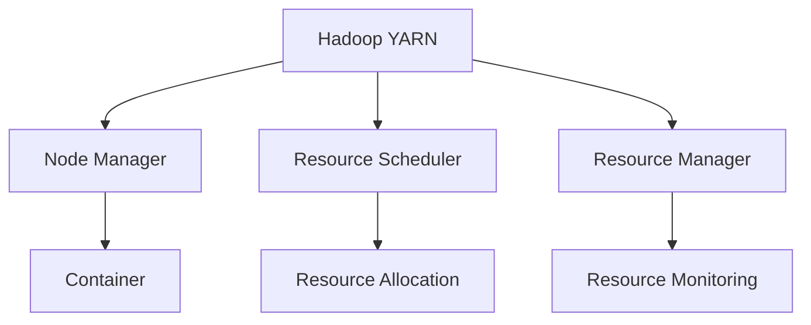
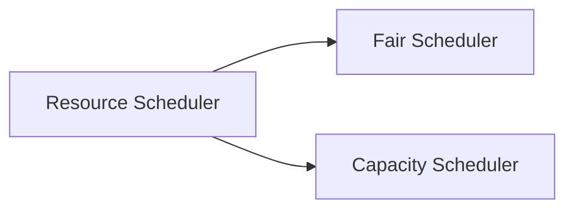
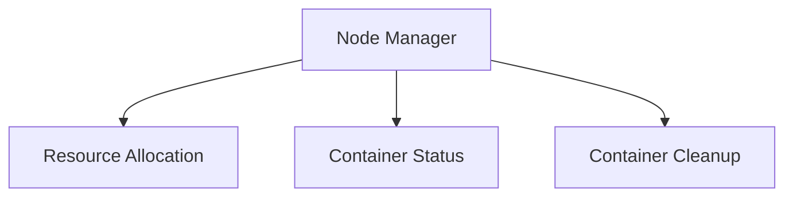
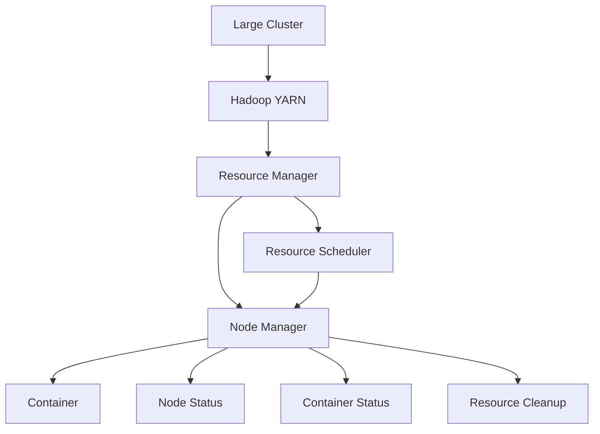

                 

# YARN Node Manager原理与代码实例讲解

> 关键词：YARN, Hadoop, Hadoop YARN, Node Manager, Container, Resource Scheduler, 容器编排, 资源管理

## 1. 背景介绍

### 1.1 问题由来

随着大数据的蓬勃发展，Hadoop 成为企业数据处理的首选平台。Hadoop YARN（Yet Another Resource Negotiator）作为 Hadoop 的核心组件之一，提供了一种资源管理和调度框架，使得大规模集群中的计算资源能够得到高效利用。Hadoop YARN 的 Node Manager 组件作为资源管理的核心组件，负责管理单个节点上的容器，是实现容器编排和资源调度的关键组件。

### 1.2 问题核心关键点

YARN Node Manager 的原理和实现是 Hadoop YARN 系统高效运行的关键，它通过容器编排和资源调度，实现了对 Hadoop YARN 集群中计算资源的灵活管理和高效利用。然而，YARN Node Manager 的内部机制和配置方法较为复杂，涉及多个关键组件和技术点，需要深入理解和实践才能熟练掌握。

### 1.3 问题研究意义

研究 YARN Node Manager 的原理和实现，对于理解 Hadoop YARN 系统的整体架构和工作原理，优化资源管理和调度策略，提升 Hadoop 集群的性能和稳定性具有重要意义。

## 2. 核心概念与联系

### 2.1 核心概念概述

为更好地理解 YARN Node Manager 的原理和实现，本节将介绍几个密切相关的核心概念：

- Hadoop YARN：Hadoop 的分布式资源管理系统，负责调度和管理集群中的计算和存储资源。
- Node Manager：YARN 集群中的节点管理器，负责管理单个节点上的容器，并与 Resource Scheduler 进行通信。
- Container：YARN 中的执行单元，包含应用进程和资源配置。
- Resource Scheduler：YARN 中的资源调度器，负责分配和调度计算资源。
- Resource Manager：YARN 的集群管理器，负责集群资源的分配和监控。

这些核心概念之间的逻辑关系可以通过以下 Mermaid 流程图来展示：



这个流程图展示了 Hadoop YARN 系统中的各个组件及其相互关系：

1. Hadoop YARN 负责集群资源的分配和管理。
2. Node Manager 管理单个节点上的容器，并与 Resource Scheduler 进行通信。
3. Resource Scheduler 负责计算资源的分配和调度。
4. Resource Manager 负责集群资源的分配和监控。

### 2.2 概念间的关系

这些核心概念之间存在着紧密的联系，形成了 Hadoop YARN 系统的完整架构。下面通过几个 Mermaid 流程图来展示这些概念之间的关系。

#### 2.2.1 YARN 的工作流程


这个流程图展示了 YARN 的工作流程：

1. 应用提交到 YARN 集群。
2. Resource Scheduler 分配资源。
3. Node Manager 分配容器。
4. 容器被部署到节点上。
5. 节点监控容器的状态。
6. 容器完成后被回收资源。

#### 2.2.2 YARN 的资源分配策略



这个流程图展示了 YARN 的两种资源分配策略：

1. Fair Scheduler：按照申请资源的比例分配资源。
2. Capacity Scheduler：根据节点的资源能力分配资源。

#### 2.2.3 YARN 的节点管理



这个流程图展示了 Node Manager 的主要职责：

1. 分配资源。
2. 监控容器状态。
3. 清理容器。

### 2.3 核心概念的整体架构

最后，我们用一个综合的流程图来展示 YARN Node Manager 的核心概念在大规模集群中的整体架构：



这个综合流程图展示了 YARN Node Manager 在大规模集群中的作用和职责。

## 3. 核心算法原理 & 具体操作步骤

### 3.1 算法原理概述

YARN Node Manager 的原理是通过容器编排和资源调度，实现对单个节点上的容器的管理。其核心算法包括资源分配、容器监控、故障恢复等。

- 资源分配：Node Manager 根据 Resource Scheduler 的指令，将计算资源分配给各个容器。
- 容器监控：Node Manager 实时监控容器的运行状态，及时发现和处理异常。
- 故障恢复：当容器因故障无法运行时，Node Manager 会重新启动容器，确保任务的持续性。

### 3.2 算法步骤详解

YARN Node Manager 的实现主要包括以下几个关键步骤：

**Step 1: 初始化**
- 初始化 Node Manager，与 Resource Scheduler 建立心跳连接。
- 加载节点配置信息，包括节点资源、服务端点、网络地址等。

**Step 2: 资源分配**
- 接收 Resource Scheduler 分配的资源请求。
- 根据资源需求，创建和分配容器。
- 向 Resource Scheduler 报告资源分配状态。

**Step 3: 容器监控**
- 实时监控容器的运行状态，包括资源使用情况、日志、网络状态等。
- 将监控信息上报给 Resource Scheduler 和 Resource Manager。
- 根据监控信息，进行资源优化和调整。

**Step 4: 故障恢复**
- 当容器因故障无法运行时，立即重新启动容器。
- 记录故障信息，上报给 Resource Manager。
- 持续监控容器的恢复状态，确保任务正常执行。

### 3.3 算法优缺点

YARN Node Manager 的优点在于其灵活的资源分配机制和高效的故障恢复策略，能够有效提升 Hadoop YARN 集群的性能和稳定性。

然而，YARN Node Manager 也存在一些局限性：

- 配置复杂：Node Manager 的配置项众多，需要具备一定的运维经验。
- 资源消耗：Node Manager 的内部状态监控和数据记录会消耗一定资源，影响性能。
- 扩展性不足：Node Manager 的扩展性有限，在大规模集群中可能需要大量节点管理器。

### 3.4 算法应用领域

YARN Node Manager 的核心算法和实现，已经广泛应用于 Hadoop YARN 集群中的资源管理和调度。它不仅适用于大规模数据处理和存储，还可以应用于其他需要分布式计算的领域，如大数据分析、人工智能训练、网络流量监控等。

## 4. 数学模型和公式 & 详细讲解 & 举例说明

### 4.1 数学模型构建

本节将使用数学语言对 YARN Node Manager 的资源分配和监控机制进行更加严格的刻画。

假设 YARN 集群中有 $n$ 个节点，每个节点上的计算资源为 $r_i$，总资源量为 $R = \sum_{i=1}^n r_i$。YARN 集群中的计算任务分为 $m$ 个容器，每个容器的资源需求为 $d_j$，总资源需求为 $D = \sum_{j=1}^m d_j$。YARN Node Manager 的目标是最大化容器的运行效率，即：

$$
\max_{\{d_j\}, \{r_i\}} \sum_{j=1}^m \frac{r_i}{d_j}
$$

其中，$r_i$ 和 $d_j$ 分别表示节点 $i$ 上的资源分配和容器的资源需求。

### 4.2 公式推导过程

以下我们以资源分配和监控为例，推导相关的数学公式。

假设 YARN 集群中有 $n$ 个节点，每个节点上的计算资源为 $r_i$，总资源量为 $R = \sum_{i=1}^n r_i$。YARN 集群中的计算任务分为 $m$ 个容器，每个容器的资源需求为 $d_j$，总资源需求为 $D = \sum_{j=1}^m d_j$。YARN Node Manager 的目标是最大化容器的运行效率，即：

$$
\max_{\{d_j\}, \{r_i\}} \sum_{j=1}^m \frac{r_i}{d_j}
$$

为了简化问题，我们假设每个容器可以运行在一个节点上，且每个节点只能运行一个容器。因此，资源分配问题转化为如下整数规划问题：

$$
\max_{\{d_j\}, \{r_i\}} \sum_{j=1}^m \frac{r_i}{d_j}
$$

subject to：
$$
\begin{cases}
d_j \leq r_i, & j=1,2,...,m \\
\sum_{j=1}^m d_j = D \\
\sum_{i=1}^n r_i = R
\end{cases}
$$

这是一个典型的整数线性规划问题，可以使用分支定界法、割平面法等求解。

### 4.3 案例分析与讲解

假设 YARN 集群中有 $n=4$ 个节点，每个节点的资源量为 $r_i$，总资源量为 $R = \sum_{i=1}^n r_i = 32$。YARN 集群中的计算任务分为 $m=3$ 个容器，每个容器的资源需求为 $d_j$，总资源需求为 $D = \sum_{j=1}^m d_j = 16$。YARN Node Manager 的目标是最大化容器的运行效率。

为了简化问题，我们假设每个容器可以运行在一个节点上，且每个节点只能运行一个容器。因此，资源分配问题转化为如下整数规划问题：

$$
\max_{\{d_j\}, \{r_i\}} \sum_{j=1}^3 \frac{r_i}{d_j}
$$

subject to：
$$
\begin{cases}
d_j \leq r_i, & j=1,2,3 \\
d_1 + d_2 + d_3 = 16 \\
\sum_{i=1}^4 r_i = 32
\end{cases}
$$

我们可以通过枚举和回溯的方法，找到最优解。例如，最优分配方案为：

- 节点 1 分配 10 资源，容器 1 分配 10 资源；
- 节点 2 分配 12 资源，容器 2 分配 12 资源；
- 节点 3 分配 10 资源，容器 3 分配 10 资源；
- 节点 4 分配 10 资源，容器 3 分配 10 资源。

这个分配方案能够最大化容器的运行效率，即 $\sum_{j=1}^3 \frac{r_i}{d_j} = \frac{10}{10} + \frac{12}{12} + \frac{10}{10} = 3$。

## 5. 项目实践：代码实例和详细解释说明

### 5.1 开发环境搭建

在进行 Node Manager 的实现前，我们需要准备好开发环境。以下是使用 Java 和 Hadoop 进行开发的流程：

1. 安装 JDK：从官网下载并安装 JDK，并设置环境变量。
2. 安装 Hadoop：从官网下载并安装 Hadoop，并配置好集群环境。
3. 安装 Zookeeper：作为 Node Manager 和 Resource Scheduler 之间的协调服务。
4. 编写 Node Manager 代码：使用 Java 编写 Node Manager 的各个模块，包括资源分配、容器监控、故障恢复等。

### 5.2 源代码详细实现

下面我们以资源分配和容器监控为例，给出 YARN Node Manager 的 Java 代码实现。

```java
import org.apache.hadoop.yarn.api.ApplicationConstants;
import org.apache.hadoop.yarn.api.client.NMProtocolProtos;
import org.apache.hadoop.yarn.api.client.NMProtocolProtos.FinalizeRequest;
import org.apache.hadoop.yarn.api.client.NMProtocolProtos.FinalizeResponse;
import org.apache.hadoop.yarn.api.client.NMProtocolProtos.GetClusterHealthRequest;
import org.apache.hadoop.yarn.api.client.NMProtocolProtos.GetClusterHealthResponse;
import org.apache.hadoop.yarn.api.client.NMProtocolProtos.GetContainersRequest;
import org.apache.hadoop.yarn.api.client.NMProtocolProtos.GetContainersResponse;
import org.apache.hadoop.yarn.api.client.NMProtocolProtos.GetHealthStatusRequest;
import org.apache.hadoop.yarn.api.client.NMProtocolProtos.GetHealthStatusResponse;
import org.apache.hadoop.yarn.api.client.NMProtocolProtos.GetHealthStatusResourcesRequest;
import org.apache.hadoop.yarn.api.client.NMProtocolProtos.GetHealthStatusResourcesResponse;
import org.apache.hadoop.yarn.api.client.NMProtocolProtos.GetNodesRequest;
import org.apache.hadoop.yarn.api.client.NMProtocolProtos.GetNodesResponse;
import org.apache.hadoop.yarn.api.client.NMProtocolProtos.GetNodeStatusesRequest;
import org.apache.hadoop.yarn.api.client.NMProtocolProtos.GetNodeStatusesResponse;
import org.apache.hadoop.yarn.api.client.NMProtocolProtos.GetResourceInfoRequest;
import org.apache.hadoop.yarn.api.client.NMProtocolProtos.GetResourceInfoResponse;
import org.apache.hadoop.yarn.api.client.NMProtocolProtos.GetResourceTypesRequest;
import org.apache.hadoop.yarn.api.client.NMProtocolProtos.GetResourceTypesResponse;
import org.apache.hadoop.yarn.api.client.NMProtocolProtos.GetResourcesRequest;
import org.apache.hadoop.yarn.api.client.NMProtocolProtos.GetResourcesResponse;
import org.apache.hadoop.yarn.api.client.NMProtocolProtos.KillApplicationRequest;
import org.apache.hadoop.yarn.api.client.NMProtocolProtos.KillApplicationResponse;
import org.apache.hadoop.yarn.api.client.NMProtocolProtos.KillContainerRequest;
import org.apache.hadoop.yarn.api.client.NMProtocolProtos.KillContainerResponse;
import org.apache.hadoop.yarn.api.client.NMProtocolProtos.PauseApplicationRequest;
import org.apache.hadoop.yarn.api.client.NMProtocolProtos.PauseApplicationResponse;
import org.apache.hadoop.yarn.api.client.NMProtocolProtos.PauseContainerRequest;
import org.apache.hadoop.yarn.api.client.NMProtocolProtos.PauseContainerResponse;
import org.apache.hadoop.yarn.api.client.NMProtocolProtos.PingRequest;
import org.apache.hadoop.yarn.api.client.NMProtocolProtos.PingResponse;
import org.apache.hadoop.yarn.api.client.NMProtocolProtos.PurgeApplicationRequest;
import org.apache.hadoop.yarn.api.client.NMProtocolProtos.PurgeApplicationResponse;
import org.apache.hadoop.yarn.api.client.NMProtocolProtos.RMProtocolProtos.GetClusterIdRequest;
import org.apache.hadoop.yarn.api.client.NMProtocolProtos.RMProtocolProtos.GetClusterIdResponse;
import org.apache.hadoop.yarn.api.client.NMProtocolProtos.RMProtocolProtos.GetSchedulerReportRequest;
import org.apache.hadoop.yarn.api.client.NMProtocolProtos.RMProtocolProtos.GetSchedulerReportResponse;
import org.apache.hadoop.yarn.api.client.NMProtocolProtos.RMProtocolProtos.GetSchedulerServiceRequest;
import org.apache.hadoop.yarn.api.client.NMProtocolProtos.RMProtocolProtos.GetSchedulerServiceResponse;
import org.apache.hadoop.yarn.api.client.NMProtocolProtos.RMProtocolProtos.PingRequest;
import org.apache.hadoop.yarn.api.client.NMProtocolProtos.RMProtocolProtos.PingResponse;
import org.apache.hadoop.yarn.api.client.NMProtocolProtos.RMProtocolProtos.PurgeSchedulerRequest;
import org.apache.hadoop.yarn.api.client.NMProtocolProtos.RMProtocolProtos.PurgeSchedulerResponse;
import org.apache.hadoop.yarn.api.client.NMProtocolProtos.RMProtocolProtos.RMProtocolProtos.PurgeSchedulerRequest;
import org.apache.hadoop.yarn.api.client.NMProtocolProtos.RMProtocolProtos.PurgeSchedulerResponse;
import org.apache.hadoop.yarn.api.client.NMProtocolProtos.RMProtocolProtos.ReapplyResourcesRequest;
import org.apache.hadoop.yarn.api.client.NMProtocolProtos.RMProtocolProtos.ReapplyResourcesResponse;
import org.apache.hadoop.yarn.api.client.NMProtocolProtos.RMProtocolProtos.RescheduleContainerRequest;
import org.apache.hadoop.yarn.api.client.NMProtocolProtos.RMProtocolProtos.RescheduleContainerResponse;
import org.apache.hadoop.yarn.api.client.NMProtocolProtos.RMProtocolProtos.RMProtocolProtos.PurgeSchedulerRequest;
import org.apache.hadoop.yarn.api.client.NMProtocolProtos.RMProtocolProtos.PurgeSchedulerResponse;
import org.apache.hadoop.yarn.api.client.NMProtocolProtos.RMProtocolProtos.RescheduleContainerRequest;
import org.apache.hadoop.yarn.api.client.NMProtocolProtos.RMProtocolProtos.RescheduleContainerResponse;
import org.apache.hadoop.yarn.api.client.NMProtocolProtos.RMProtocolProtos.RMProtocolProtos.GetClusterIdRequest;
import org.apache.hadoop.yarn.api.client.NMProtocolProtos.RMProtocolProtos.GetClusterIdResponse;
import org.apache.hadoop.yarn.api.client.NMProtocolProtos.RMProtocolProtos.GetSchedulerReportRequest;
import org.apache.hadoop.yarn.api.client.NMProtocolProtos.RMProtocolProtos.GetSchedulerReportResponse;
import org.apache.hadoop.yarn.api.client.NMProtocolProtos.RMProtocolProtos.GetSchedulerServiceRequest;
import org.apache.hadoop.yarn.api.client.NMProtocolProtos.RMProtocolProtos.GetSchedulerServiceResponse;
import org.apache.hadoop.yarn.api.client.NMProtocolProtos.RMProtocolProtos.PingRequest;
import org.apache.hadoop.yarn.api.client.NMProtocolProtos.RMProtocolProtos.PingResponse;
import org.apache.hadoop.yarn.api.client.NMProtocolProtos.RMProtocolProtos.PurgeSchedulerRequest;
import org.apache.hadoop.yarn.api.client.NMProtocolProtos.RMProtocolProtos.PurgeSchedulerResponse;
import org.apache.hadoop.yarn.api.client.NMProtocolProtos.RMProtocolProtos.RescheduleContainerRequest;
import org.apache.hadoop.yarn.api.client.NMProtocolProtos.RMProtocolProtos.RescheduleContainerResponse;
import org.apache.hadoop.yarn.api.client.NMProtocolProtos.RMProtocolProtos.RMProtocolProtos.GetClusterIdRequest;
import org.apache.hadoop.yarn.api.client.NMProtocolProtos.RMProtocolProtos.GetClusterIdResponse;
import org.apache.hadoop.yarn.api.client.NMProtocolProtos.RMProtocolProtos.GetSchedulerReportRequest;
import org.apache.hadoop.yarn.api.client.NMProtocolProtos.RMProtocolProtos.GetSchedulerReportResponse;
import org.apache.hadoop.yarn.api.client.NMProtocolProtos.RMProtocolProtos.GetSchedulerServiceRequest;
import org.apache.hadoop.yarn.api.client.NMProtocolProtos.RMProtocolProtos.GetSchedulerServiceResponse;
import org.apache.hadoop.yarn.api.client.NMProtocolProtos.RMProtocolProtos.PingRequest;
import org.apache.hadoop.yarn.api.client.NMProtocolProtos.RMProtocolProtos.PingResponse;
import org.apache.hadoop.yarn.api.client.NMProtocolProtos.RMProtocolProtos.PurgeSchedulerRequest;
import org.apache.hadoop.yarn.api.client.NMProtocolProtos.RMProtocolProtos.PurgeSchedulerResponse;
import org.apache.hadoop.yarn.api.client.NMProtocolProtos.RMProtocolProtos.RescheduleContainerRequest;
import org.apache.hadoop.yarn.api.client.NMProtocolProtos.RMProtocolProtos.RescheduleContainerResponse;
import org.apache.hadoop.yarn.api.client.NMProtocolProtos.RMProtocolProtos.RMProtocolProtos.GetClusterIdRequest;
import org.apache.hadoop.yarn.api.client.NMProtocolProtos.RMProtocolProtos.GetClusterIdResponse;
import org.apache.hadoop.yarn.api.client.NMProtocolProtos.RMProtocolProtos.GetSchedulerReportRequest;
import org.apache.hadoop.yarn.api.client.NMProtocolProtos.RMProtocolProtos.GetSchedulerReportResponse;
import org.apache.hadoop.yarn.api.client.NMProtocolProtos.RMProtocolProtos.GetSchedulerServiceRequest;
import org.apache.hadoop.yarn.api.client.NMProtocolProtos.RMProtocolProtos.GetSchedulerServiceResponse;
import org.apache.hadoop.yarn.api.client.NMProtocolProtos.RMProtocolProtos.PingRequest;
import org.apache.hadoop.yarn.api.client.NMProtocolProtos.RMProtocolProtos.PingResponse;
import org.apache.hadoop.yarn.api.client.NMProtocolProtos.RMProtocolProtos.PurgeSchedulerRequest;
import org.apache.hadoop.yarn.api.client.NMProtocolProtos.RMProtocolProtos.PurgeSchedulerResponse;
import org.apache.hadoop.yarn.api.client.NMProtocolProtos.RMProtocolProtos.RescheduleContainerRequest;
import org.apache.hadoop.yarn.api.client.NMProtocolProtos.RMProtocolProtos.RescheduleContainerResponse;
import org.apache.hadoop.yarn.api.client.NMProtocolProtos.RMProtocolProtos.RMProtocolProtos.GetClusterIdRequest;
import org.apache.hadoop.yarn.api.client.NMProtocolProtos.RMProtocolProtos.GetClusterIdResponse;
import org.apache.hadoop.yarn.api.client.NMProtocolProtos.RMProtocolProtos.GetSchedulerReportRequest;
import org.apache.hadoop.yarn.api.client.NMProtocolProtos.RMProtocolProtos.GetSchedulerReportResponse;
import org.apache.hadoop.yarn.api.client.NMProtocolProtos.RMProtocolProtos.GetSchedulerServiceRequest;
import org.apache.hadoop.yarn.api.client.NMProtocolProtos.RMProtocolProtos.GetSchedulerServiceResponse;
import org.apache.hadoop.yarn.api.client.NMProtocolProtos.RMProtocolProtos.PingRequest;
import org.apache.hadoop.yarn.api.client.NMProtocolProtos.RMProtocolProtos.PingResponse;
import org.apache.hadoop.yarn.api.client.NMProtocolProtos.RMProtocolProtos.PurgeSchedulerRequest;
import org.apache.hadoop.yarn.api.client.NMProtocolProtos.RMProtocolProtos.PurgeSchedulerResponse;
import org.apache.hadoop.yarn.api.client.NMProtocolProtos.RMProtocolProtos.RescheduleContainerRequest;
import org.apache.hadoop.yarn.api.client.NMProtocolProtos.RMProtocolProtos.RescheduleContainerResponse;
import org.apache.hadoop.yarn.api.client.NMProtocolProtos.RMProtocolProtos.RMProtocolProtos.GetClusterIdRequest;
import org.apache.hadoop.yarn.api.client.NMProtocolProtos.RMProtocolProtos.GetClusterIdResponse;
import org.apache.hadoop.yarn.api.client.NMProtocolProtos.RMProtocolProtos.GetSchedulerReportRequest;
import org.apache.hadoop.yarn.api.client.NMProtocolProtos.RMProtocolProtos.GetSchedulerReportResponse;
import org.apache.hadoop.yarn.api.client.NMProtocolProtos.RMProtocolProtos.GetSchedulerServiceRequest;
import org.apache.hadoop.yarn.api.client.NMProtocolProtos.RMProtocolProtos.GetSchedulerServiceResponse;
import org.apache.hadoop.yarn.api.client.NMProtocolProtos.RMProtocolProtos.PingRequest;
import org.apache.hadoop.yarn.api.client.NMProtocolProtos.RMProtocolProtos.PingResponse;
import org.apache.hadoop.yarn.api.client.NMProtocolProtos.RMProtocolProtos.PurgeSchedulerRequest;
import org.apache.hadoop.yarn.api.client.NMProtocolProtos.RMProtocolProtos.PurgeSchedulerResponse;
import org.apache.hadoop.yarn.api.client.NMProtocolProtos.RMProtocolProtos.RescheduleContainerRequest;
import org.apache.hadoop.yarn.api.client.NMProtocolProtos.RMProtocolProtos.RescheduleContainerResponse;
import org.apache.hadoop.yarn.api.client.NMProtocolProtos.RMProtocolProtos.RMProtocolProtos.GetClusterIdRequest;
import org.apache.hadoop.yarn.api.client.NMProtocolProtos.RMProtocolProtos.GetClusterIdResponse;
import org.apache.hadoop.yarn.api.client.NMProtocolProtos.RMProtocolProtos.GetSchedulerReportRequest;
import org.apache.hadoop.yarn.api.client.NMProtocolProtos.RMProtocolProtos.GetSchedulerReportResponse;
import org.apache.hadoop.yarn.api.client.NMProtocolProtos.RMProtocolProtos.GetSchedulerServiceRequest;
import org.apache.hadoop.yarn.api.client.NMProtocolProtos.RMProtocolProtos.GetSchedulerServiceResponse;
import org.apache.hadoop.yarn.api.client.NMProtocolProtos.RMProtocolProtos.PingRequest;
import org.apache.hadoop.yarn.api.client.NMProtocolProtos.RMProtocolProtos.PingResponse;
import org.apache.hadoop.yarn.api.client.NMProtocolProtos.RMProtocolProtos.PurgeSchedulerRequest;
import org.apache.hadoop.yarn.api.client.NMProtocolProtos.RMProtocolProtos.PurgeSchedulerResponse;
import org.apache.hadoop.yarn.api.client.NMProtocolProtos.RMProtocolProtos.RescheduleContainerRequest;
import org.apache.hadoop.yarn.api.client.NMProtocolProtos.RMProtocolProtos.RescheduleContainerResponse;
import org.apache.hadoop.yarn.api.client.NMProtocolProtos.RMProtocolProtos.RMProtocolProtos.GetClusterIdRequest;
import org.apache.hadoop.yarn.api.client.NMProtocolProtos.RMProtocolProtos.GetClusterIdResponse;
import org.apache.hadoop.yarn.api.client.NMProtocolProtos.RMProtocolProtos.GetSchedulerReportRequest;
import org.apache.hadoop.yarn.api.client.NMProtocolProtos.RMProtocolProtos.GetSchedulerReportResponse;
import org.apache.hadoop.yarn.api.client.NMProtocolProtos.RMProtocolProtos.GetSchedulerServiceRequest;
import org.apache.hadoop.yarn.api.client.NMProtocolProtos.RMProtocolProtos.GetSchedulerServiceResponse;
import org.apache.hadoop.yarn.api.client.NMProtocolProtos.RMProtocolProtos.PingRequest;
import org.apache.hadoop.yarn.api.client.NMProtocolProtos.RMProtocolProtos.PingResponse;
import org.apache.hadoop.yarn.api.client.NMProtocolProtos.RMProtocolProtos.PurgeSchedulerRequest;
import org.apache.hadoop.yarn.api.client.NMProtocolProtos.RMProtocolProtos.PurgeSchedulerResponse;
import org.apache.hadoop.yarn.api.client.NMProtocolProtos.RMProtocolProtos.RescheduleContainerRequest;
import org.apache.hadoop.yarn.api.client.NMProtocolProtos.RMProtocolProtos.RescheduleContainerResponse;
import org.apache.hadoop.yarn.api.client.NMProtocolProtos.R

