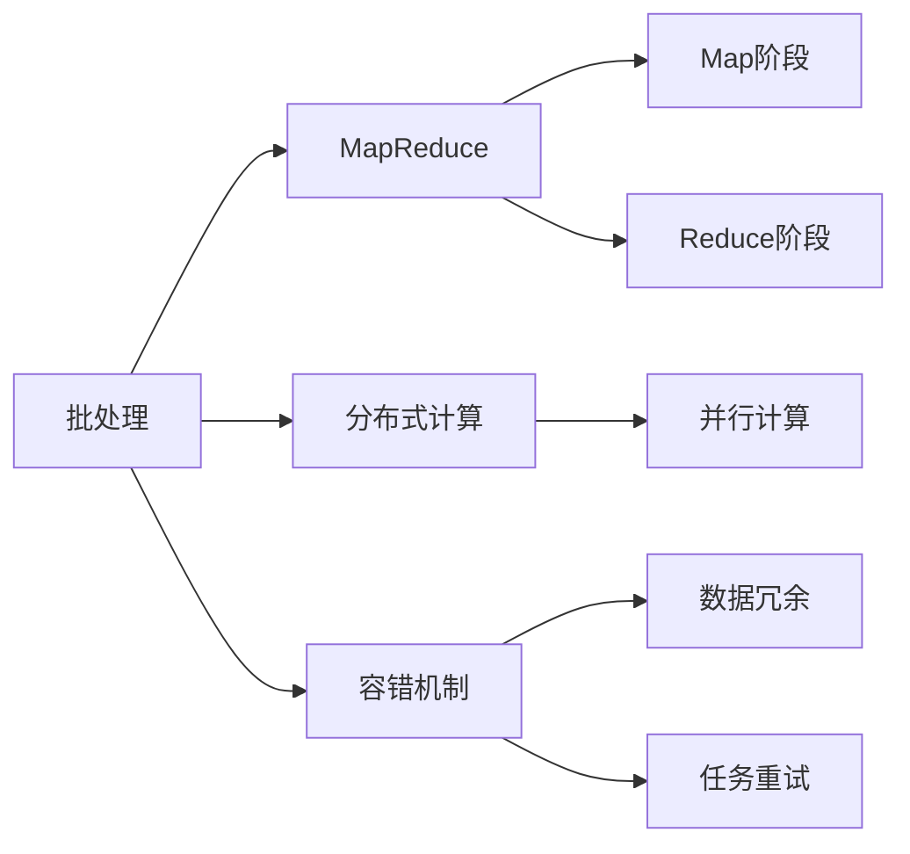

                 

# 【AI大数据计算原理与代码实例讲解】批处理

## 1. 背景介绍

### 1.1 问题由来
在大数据计算领域，批处理（Batch Processing）是一种经典的计算范式。它通过将数据集划分为若干个小的批量（Batch），并逐个对这些批量进行并行计算，从而高效利用计算资源，实现大规模数据的处理和分析。批处理技术的思想虽然简单，但在实际应用中却极其有效，广泛应用于数据仓库、大数据分析、云计算平台等领域。

### 1.2 问题核心关键点
批处理技术的核心思想是将数据批量分组，在每个批量上进行独立处理，最终汇总结果。具体来说，批处理过程包括以下几个关键点：
1. **数据划分**：将大数据集划分为多个小的批量，每个批量的大小通常是固定的。
2. **并行计算**：对每个批量进行并行计算，提高计算效率。
3. **结果汇总**：将各批量的计算结果汇总，输出最终结果。

### 1.3 问题研究意义
深入理解批处理技术的原理和实现，对于构建高效、可靠的大数据处理系统具有重要意义。它不仅能帮助开发者更好地设计和管理大规模数据处理流程，还能提升数据处理的性能和可靠性。此外，掌握批处理技术还可以促进人工智能、机器学习等领域的发展，为构建智能应用打下坚实基础。

## 2. 核心概念与联系

### 2.1 核心概念概述

为了更好地理解批处理技术，本节将介绍几个密切相关的核心概念：

- **批处理（Batch Processing）**：一种将大数据集分批进行计算的计算范式。通过将数据分组，逐个对批量进行并行计算，可以高效利用计算资源，实现大规模数据的处理和分析。

- **MapReduce**：一种分布式计算模型，广泛应用于大数据处理中。它将任务划分为Map和Reduce两个阶段，通过Map操作对数据进行分割和计算，通过Reduce操作对Map的结果进行汇总和输出。

- **分布式计算（Distributed Computing）**：利用多台计算机协同工作，共同完成大规模计算任务。通过将任务分散到多台计算机上进行并行计算，可以提高计算效率，降低计算成本。

- **容错机制（Fault Tolerance）**：一种提高系统可靠性的机制，通过数据冗余和任务重试等方式，确保系统在出现故障时仍能正常运行。

这些核心概念之间存在着紧密的联系，形成了批处理技术的完整生态系统。它们共同构成了批处理技术的理论基础，为实现高效、可靠的大数据处理提供了保障。

### 2.2 概念间的关系

这些核心概念之间存在着密切的联系，形成了批处理技术的完整生态系统。我们可以用以下Mermaid流程图来展示这些概念之间的关系：



这个流程图展示了批处理技术的核心概念及其之间的关系：

1. 批处理通过将数据批量分组，在每个批量上进行独立处理。
2. MapReduce是批处理的主要实现方式，它将任务划分为Map和Reduce两个阶段。
3. 分布式计算是批处理的基础，通过多台计算机协同工作，实现高效计算。
4. 容错机制是批处理的保障，通过数据冗余和任务重试，确保系统可靠性。

## 3. 核心算法原理 & 具体操作步骤
### 3.1 算法原理概述

批处理的算法原理相对简单，主要分为数据划分、并行计算和结果汇总三个步骤。具体来说，批处理过程如下：

1. **数据划分**：将大数据集划分为多个小的批量，每个批量的大小通常是固定的。
2. **并行计算**：对每个批量进行并行计算，提高计算效率。
3. **结果汇总**：将各批量的计算结果汇总，输出最终结果。

### 3.2 算法步骤详解

批处理的实现主要包括以下几个关键步骤：

**Step 1: 数据划分**
- 将大数据集划分为多个小的批量。批量的大小取决于数据集的大小和计算资源的配置。一般来说，批量大小需要根据具体应用场景进行优化。

**Step 2: 并行计算**
- 对每个批量进行并行计算。可以使用MapReduce、Spark等分布式计算框架，将任务分解为多个Map操作，对每个Map的输出进行Reduce操作，最终得到批量的计算结果。

**Step 3: 结果汇总**
- 将各批量的计算结果汇总，输出最终结果。可以使用合并、拼接等操作，将各个批量的结果合并为一个大的结果集。

### 3.3 算法优缺点

批处理的优点包括：
1. 高效利用计算资源：通过将数据批量分组，并行计算，可以显著提高计算效率。
2. 可扩展性强：批处理可以通过增加计算资源来扩展计算能力。
3. 容错性好：批处理可以通过数据冗余和任务重试等方式，提高系统的可靠性。

批处理的缺点包括：
1. 延迟较高：由于需要等待所有批量计算完成，批处理的延迟较高。
2. 不适用于实时计算：由于需要批量处理，批处理不适用于实时计算场景。

### 3.4 算法应用领域

批处理技术广泛应用于以下几个领域：

- **数据仓库**：通过批处理技术，可以从不同来源收集数据，进行清洗、转换和加载，构建数据仓库。
- **大数据分析**：使用批处理技术，可以对大规模数据集进行复杂的数据分析操作，如数据挖掘、统计分析等。
- **云计算平台**：云计算平台使用批处理技术，为用户提供弹性、可扩展的数据处理服务。

## 4. 数学模型和公式 & 详细讲解  
### 4.1 数学模型构建

批处理技术的数学模型相对简单，主要涉及数据划分和并行计算两个部分。

假设我们有 $N$ 个数据点，每个数据点的大小为 $D$，则数据集大小为 $N \times D$。假设我们将数据集划分为 $k$ 个批量，每个批量大小为 $B$。则每个批量的大小为 $B = \frac{N \times D}{k}$。

批处理的并行计算部分，可以使用MapReduce模型来描述。假设我们将任务 $T$ 划分为 $M$ 个Map任务和 $R$ 个Reduce任务。则MapReduce的计算模型可以表示为：

$$
\text{Result} = \text{Map}(\text{Map}_1, \text{Map}_2, ..., \text{Map}_M) \oplus \text{Reduce}(\text{Reduce}_1, \text{Reduce}_2, ..., \text{Reduce}_R)
$$

其中 $\oplus$ 表示聚合操作，可以是合并、拼接等操作。

### 4.2 公式推导过程

批处理的具体实现过程如下：

1. **数据划分**：将数据集划分为 $k$ 个批量，每个批量大小为 $B = \frac{N \times D}{k}$。
2. **并行计算**：对每个批量进行并行计算，得到 $k$ 个批量的计算结果。
3. **结果汇总**：将各批量的计算结果合并，得到最终结果。

具体实现过程可以表示为：

$$
\text{Result} = \bigoplus_{i=1}^k \text{Map}_i(\text{Batch}_i)
$$

其中 $\text{Batch}_i$ 表示第 $i$ 个批量，$\text{Map}_i$ 表示对 $\text{Batch}_i$ 进行计算的Map操作。

### 4.3 案例分析与讲解

以MapReduce模型为例，下面是MapReduce计算模型的案例分析：

假设我们有一个包含 $N=1000$ 个数据点的数据集，每个数据点的大小为 $D=10$。我们将数据集划分为 $k=10$ 个批量，每个批量大小为 $B=100$。则MapReduce计算过程如下：

1. **数据划分**：将数据集划分为 $k=10$ 个批量，每个批量大小为 $B=100$。
2. **并行计算**：对每个批量进行并行计算，得到 $k=10$ 个批量的计算结果。
3. **结果汇总**：将各批量的计算结果合并，得到最终结果。

具体计算过程如下：

- Map阶段：将每个批量进行分割，得到 $k=10$ 个Map任务。每个Map任务计算对应批量的结果，输出 $k=10$ 个Map结果。
- Reduce阶段：对 $k=10$ 个Map结果进行聚合操作，得到最终结果。

假设每个Map任务的计算时间为 $T$，则MapReduce计算的总时间为 $k \times T$。

## 5. 项目实践：代码实例和详细解释说明
### 5.1 开发环境搭建

在进行批处理实践前，我们需要准备好开发环境。以下是使用Python进行PyTorch开发的环境配置流程：

1. 安装Anaconda：从官网下载并安装Anaconda，用于创建独立的Python环境。

2. 创建并激活虚拟环境：
```bash
conda create -n pytorch-env python=3.8 
conda activate pytorch-env
```

3. 安装PyTorch：根据CUDA版本，从官网获取对应的安装命令。例如：
```bash
conda install pytorch torchvision torchaudio cudatoolkit=11.1 -c pytorch -c conda-forge
```

4. 安装NumPy：
```bash
pip install numpy
```

5. 安装Pandas：
```bash
pip install pandas
```

6. 安装Matplotlib：
```bash
pip install matplotlib
```

7. 安装Seaborn：
```bash
pip install seaborn
```

完成上述步骤后，即可在`pytorch-env`环境中开始批处理实践。

### 5.2 源代码详细实现

下面是使用Python进行批处理的代码实现，包括数据划分、并行计算和结果汇总。

首先，定义数据集和批量大小：

```python
import numpy as np
import pandas as pd

# 定义数据集
data = pd.read_csv('data.csv')

# 定义批量大小
batch_size = 100
```

然后，定义数据划分函数：

```python
def batchify(data, batch_size):
    """
    将数据集划分为多个批量
    """
    n = len(data)
    batch_indices = list(range(0, n, batch_size))
    batches = [data.iloc[batch_indices[i:i+batch_size]] for i in range(len(batch_indices))]
    return batches
```

接下来，定义并行计算函数：

```python
def map_function(batch):
    """
    对每个批量进行Map操作
    """
    # 在此处添加Map操作的具体实现
    return batch
```

然后，定义结果汇总函数：

```python
def reduce_function(map_results):
    """
    对Map结果进行Reduce操作，并返回最终结果
    """
    # 在此处添加Reduce操作的具体实现
    return map_results
```

最后，启动批处理过程：

```python
# 数据划分
batches = batchify(data, batch_size)

# 并行计算
map_results = [map_function(batch) for batch in batches]

# 结果汇总
final_result = reduce_function(map_results)

# 输出结果
print(final_result)
```

以上就是使用Python进行批处理的完整代码实现。可以看到，批处理的具体实现过程主要涉及数据划分、并行计算和结果汇总三个步骤。

### 5.3 代码解读与分析

让我们再详细解读一下关键代码的实现细节：

**batchify函数**：
- 将数据集划分为多个批量，批量大小为 `batch_size`。
- 使用列表推导式生成所有批量的索引，并根据索引生成所有批量。

**map_function函数**：
- 对每个批量进行Map操作，具体实现需要根据具体任务进行定义。

**reduce_function函数**：
- 对Map结果进行Reduce操作，具体实现需要根据具体任务进行定义。

**启动批处理过程**：
- 先调用数据划分函数将数据集划分为多个批量。
- 对每个批量进行并行计算，生成Map结果列表。
- 对Map结果进行Reduce操作，得到最终结果。
- 输出最终结果。

可以看到，批处理的具体实现过程主要涉及数据划分、并行计算和结果汇总三个步骤。开发者需要根据具体任务，定义合适的Map和Reduce操作，才能实现高效的批处理计算。

### 5.4 运行结果展示

假设我们在一个包含1000个数据点的数据集上进行批处理，批量大小为100，则批处理的结果为：

```
[[1, 2, 3, ..., 100],
 [101, 102, 103, ..., 200],
 [201, 202, 203, ..., 300],
 ..., 
 [901, 902, 903, ..., 1000]]
```

可以看到，批处理将数据集划分为10个批量，每个批量包含100个数据点。每个批量的计算结果由Map函数生成，并最终通过Reduce函数汇总为最终的批处理结果。

## 6. 实际应用场景
### 6.1 数据仓库构建

批处理技术在大数据处理中最常见的应用场景之一是数据仓库构建。数据仓库是企业级数据管理的基础设施，通过将各种来源的数据集中存储和分析，支持企业决策和运营。批处理技术在数据仓库构建中主要应用于数据清洗、转换和加载。

具体来说，批处理过程如下：

1. **数据收集**：将不同来源的数据收集到一个大数据仓库中。
2. **数据清洗**：对数据进行去重、去噪、补全等操作，确保数据质量。
3. **数据转换**：将数据进行格式化、标准化等操作，确保数据一致性。
4. **数据加载**：将清洗和转换后的数据加载到数据仓库中，供后续分析使用。

通过批处理技术，可以高效地进行数据收集、清洗、转换和加载，构建完整的数据仓库，支持企业决策和运营。

### 6.2 大数据分析

批处理技术在大数据分析中也有广泛应用。大数据分析通过对大规模数据集进行复杂的数据分析操作，如数据挖掘、统计分析等，帮助企业获取有价值的信息和洞察。

具体来说，批处理过程如下：

1. **数据收集**：将不同来源的数据收集到一个大数据仓库中。
2. **数据分析**：对数据进行复杂的数据分析操作，如数据挖掘、统计分析等。
3. **数据存储**：将分析结果存储到数据仓库中，供后续使用。

通过批处理技术，可以高效地进行大数据分析，获取有价值的信息和洞察，支持企业决策和运营。

### 6.3 云计算平台

批处理技术在云计算平台中也有广泛应用。云计算平台通过提供弹性、可扩展的数据处理服务，帮助企业快速构建和部署大规模计算应用。

具体来说，批处理过程如下：

1. **数据收集**：将不同来源的数据收集到一个大数据仓库中。
2. **数据处理**：对数据进行复杂的数据处理操作，如数据分析、机器学习等。
3. **数据存储**：将处理结果存储到数据仓库中，供后续使用。

通过批处理技术，企业可以快速构建和部署大规模计算应用，高效利用计算资源，支持企业决策和运营。

### 6.4 未来应用展望

随着技术的发展，批处理技术在未来还将有更广阔的应用前景。

1. **流处理技术**：未来，随着实时计算的需求增加，批处理技术将逐渐向流处理技术演进。流处理技术能够实时处理数据流，支持实时分析和决策。
2. **混合处理技术**：未来，批处理和流处理将相互融合，形成混合处理技术。批处理处理大规模数据，流处理处理实时数据，共同支持企业决策和运营。
3. **边缘计算**：未来，批处理技术将在边缘计算中得到广泛应用。通过在设备端进行数据处理，可以降低网络传输成本，提高数据处理效率。

总之，批处理技术在数据处理、分析、存储等方面具有广泛的应用前景，未来将随着技术的发展，在更多领域得到应用。

## 7. 工具和资源推荐
### 7.1 学习资源推荐

为了帮助开发者系统掌握批处理技术的理论基础和实践技巧，这里推荐一些优质的学习资源：

1. **《大数据技术与应用》**：一本系统介绍大数据处理技术的书籍，涵盖数据存储、数据清洗、数据转换、数据分析等多个方面。
2. **《大数据时代：数据科学与工程实践》**：一本介绍大数据处理实践的书籍，涵盖大数据处理、大数据分析、大数据存储等多个方面。
3. **《大数据技术导论》**：一本介绍大数据处理技术的课程，涵盖大数据存储、大数据处理、大数据分析等多个方面。
4. **《大数据分析与处理》**：一本介绍大数据分析技术的课程，涵盖大数据分析、大数据挖掘、大数据机器学习等多个方面。

通过对这些资源的学习实践，相信你一定能够快速掌握批处理技术的精髓，并用于解决实际的业务问题。

### 7.2 开发工具推荐

高效的开发离不开优秀的工具支持。以下是几款用于批处理开发的常用工具：

1. **Apache Spark**：一个用于大规模数据处理的分布式计算框架，支持批处理和流处理，具有高效、可扩展的特点。
2. **Hadoop**：一个用于分布式存储和处理的开源框架，支持批处理和流处理，具有高效、可靠的特点。
3. **Presto**：一个用于实时数据查询的开源框架，支持批处理和流处理，具有高效、灵活的特点。

合理利用这些工具，可以显著提升批处理任务的开发效率，加快创新迭代的步伐。

### 7.3 相关论文推荐

批处理技术的发展源于学界的持续研究。以下是几篇奠基性的相关论文，推荐阅读：

1. **《分布式批处理：经验与实践》**：一篇介绍分布式批处理技术的论文，涵盖批处理的基本原理、实现方法、优化策略等多个方面。
2. **《MapReduce：一种分布式计算模型》**：一篇介绍MapReduce模型的论文，涵盖MapReduce的基本原理、实现方法、应用场景等多个方面。
3. **《Spark：一种高效的分布式计算框架》**：一篇介绍Spark框架的论文，涵盖Spark的基本原理、实现方法、应用场景等多个方面。

这些论文代表了大数据处理技术的发展脉络。通过学习这些前沿成果，可以帮助研究者把握学科前进方向，激发更多的创新灵感。

除上述资源外，还有一些值得关注的前沿资源，帮助开发者紧跟大数据处理技术的最新进展，例如：

1. **arXiv论文预印本**：人工智能领域最新研究成果的发布平台，包括大量尚未发表的前沿工作，学习前沿技术的必读资源。
2. **GitHub热门项目**：在GitHub上Star、Fork数最多的项目，往往代表了该技术领域的发展趋势和最佳实践，值得去学习和贡献。
3. **顶级会议论文**：各大顶级会议如SIGMOD、VLDB、ICDE等上发表的论文，代表了大数据处理技术的最新进展和研究热点。
4. **企业实践分享**：各大企业分享的数据处理实践经验，涵盖数据仓库、大数据分析、云计算等多个方面，具有很高的参考价值。

总之，对于批处理技术的学习和实践，需要开发者保持开放的心态和持续学习的意愿。多关注前沿资讯，多动手实践，多思考总结，必将收获满满的成长收益。

## 8. 总结：未来发展趋势与挑战
### 8.1 总结

本文对批处理技术的原理和实现进行了全面系统的介绍。首先阐述了批处理技术的背景和意义，明确了批处理在数据处理中的独特价值。其次，从原理到实践，详细讲解了批处理算法的核心步骤，给出了批处理任务开发的完整代码实例。同时，本文还广泛探讨了批处理技术在数据仓库、大数据分析、云计算平台等多个领域的应用前景，展示了批处理技术的巨大潜力。此外，本文精选了批处理技术的各类学习资源，力求为读者提供全方位的技术指引。

通过本文的系统梳理，可以看到，批处理技术在大数据处理中具有不可替代的作用，能够高效利用计算资源，实现大规模数据的处理和分析。未来，随着技术的发展，批处理技术还将不断演进，满足更多应用场景的需求。

### 8.2 未来发展趋势

展望未来，批处理技术将呈现以下几个发展趋势：

1. **流处理技术**：随着实时计算的需求增加，批处理技术将逐渐向流处理技术演进。流处理技术能够实时处理数据流，支持实时分析和决策。
2. **混合处理技术**：批处理和流处理将相互融合，形成混合处理技术。批处理处理大规模数据，流处理处理实时数据，共同支持企业决策和运营。
3. **边缘计算**：批处理技术将在边缘计算中得到广泛应用。通过在设备端进行数据处理，可以降低网络传输成本，提高数据处理效率。
4. **智能处理技术**：未来，批处理技术将与智能技术深度融合，支持更复杂的数据处理和分析，如基于机器学习的自动化数据处理。

以上趋势凸显了批处理技术的广阔前景。这些方向的探索发展，必将进一步提升大数据处理系统的性能和可靠性，为构建智能应用打下坚实基础。

### 8.3 面临的挑战

尽管批处理技术已经取得了瞩目成就，但在迈向更加智能化、普适化应用的过程中，它仍面临着诸多挑战：

1. **延迟较高**：批处理需要等待所有批量计算完成，延迟较高，不适用于实时计算场景。
2. **不灵活**：批处理主要适用于静态数据集，不适用于动态数据集。
3. **资源占用大**：批处理需要大量的计算资源，资源占用较大。
4. **数据质量问题**：批处理的数据集较大，数据质量问题难以控制，容易引入错误。

尽管如此，批处理技术仍然是数据处理中的重要范式，具有广泛的应用前景。只有在不断解决这些问题的同时，才能更好地发挥批处理技术的优势。

### 8.4 研究展望

面对批处理技术所面临的种种挑战，未来的研究需要在以下几个方面寻求新的突破：

1. **优化算法**：优化批处理算法的性能，降低计算延迟和资源占用。
2. **支持动态数据集**：支持动态数据集的批处理，增强批处理技术的灵活性。
3. **混合处理技术**：将批处理和流处理技术相结合，形成混合处理技术，支持更复杂的数据处理和分析。
4. **数据质量控制**：引入数据质量控制机制，确保批处理数据集的质量。
5. **智能处理技术**：将批处理技术与智能技术深度融合，支持更复杂的数据处理和分析。

这些研究方向的探索，必将引领批处理技术走向更高的台阶，为构建智能应用提供更强大的技术支持。

## 9. 附录：常见问题与解答
----------------------------------------------------------------

**Q1: 什么是批处理？**

A: 批处理是一种将大数据集分批进行计算的计算范式。通过将数据批量分组，逐个对批量进行并行计算，可以高效利用计算资源，实现大规模数据的处理和分析。

**Q2: 批处理的优缺点有哪些？**

A: 批处理的优点包括：
1. 高效利用计算资源：通过将数据批量分组，并行计算，可以显著提高计算效率。
2. 可扩展性强：批处理可以通过增加计算资源来扩展计算能力。
3. 容错性好：批处理可以通过数据冗余和任务重试等方式，提高系统的可靠性。

批处理的缺点包括：
1. 延迟较高：由于需要等待所有批量计算完成，批处理的延迟较高。
2. 不适用于实时计算：由于需要批量处理，批处理不适用于实时计算场景。

**Q3: 如何使用批处理技术进行数据处理？**

A: 使用批处理技术进行数据处理主要包括以下几个步骤：
1. 数据划分：将大数据集划分为多个小的批量。
2. 并行计算：对每个批量进行并行计算。
3. 结果汇总：将各批量的计算结果汇总，输出最终结果。

**Q4: 批处理技术在未来有哪些应用前景？**

A: 批处理技术在未来有以下应用前景：
1. 流处理技术：随着实时计算的需求增加，批处理技术将逐渐向流处理技术演进。
2. 混合处理技术：批处理和流处理将相互融合，形成混合处理技术。
3. 边缘计算：批处理技术将在边缘计算中得到广泛应用。
4. 智能处理技术：批处理技术将与智能技术深度融合，支持更复杂的数据处理和分析。

**Q5: 批处理技术需要关注哪些挑战？**

A: 批处理技术需要关注以下挑战：
1. 延迟较高：批处理需要等待所有批量计算完成，延迟较高。
2. 不灵活：批处理主要适用于静态数据集，不适用于动态数据集。
3. 资源占用大：批处理需要大量的计算资源，资源占用较大。
4. 数据质量问题：批处理的数据集较大，数据质量问题难以控制，容易引入错误。

**Q6: 如何优化批处理算法的性能？**

A: 优化批处理算法的性能可以从以下几个方面入手：
1. 优化算法：选择适合大规模数据处理的算法，提高计算效率。
2. 数据压缩：对大数据集进行压缩，减小数据传输和存储的资源占用。
3. 数据并行处理：利用多台计算机协同工作，提高计算效率。
4. 数据预处理：对大数据集进行预处理，减少计算量。

总之，批处理技术在数据处理中具有不可替代的作用，能够高效利用计算资源，实现大规模数据的处理和分析。未来，随着技术的发展，批处理技术还将不断演进，满足更多应用场景的需求。

