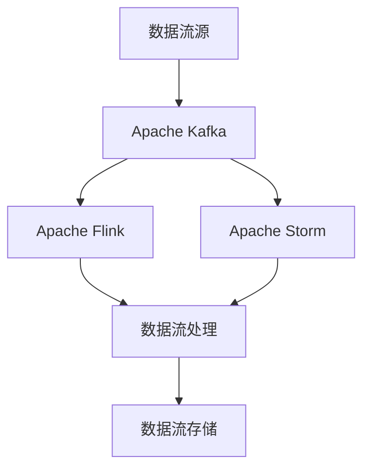
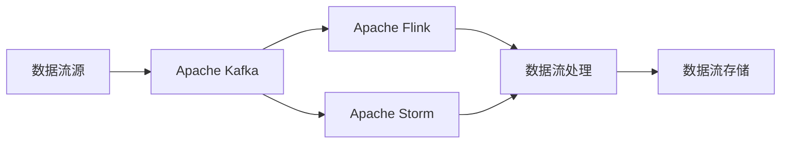
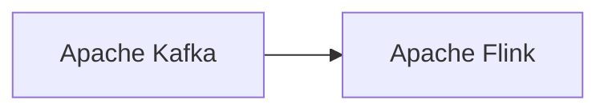
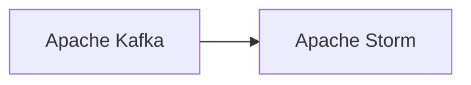
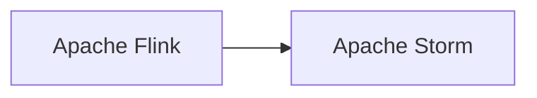
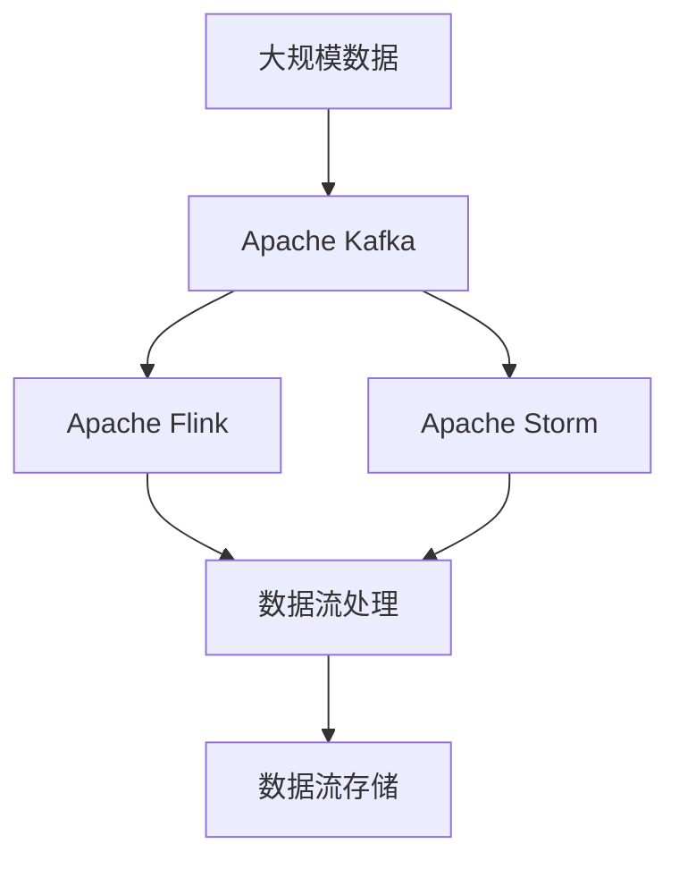

                 

# 【AI大数据计算原理与代码实例讲解】流处理

> 关键词：流处理,大数据计算,Apache Kafka,Apache Flink,Apache Storm

## 1. 背景介绍

### 1.1 问题由来
在大数据时代，实时数据处理与分析的需求日益增长，对于需要海量数据支持的应用场景（如金融交易、社交媒体分析、物联网数据处理等），如何高效、可靠地进行数据处理和计算，是一个重要的挑战。传统的数据批处理方式往往需要经过较长时间的计算才能得到结果，无法满足实时性要求。因此，流处理（Stream Processing）技术应运而生。

流处理通过将数据看作“数据流”，不断实时地接收、处理和传输数据，能够实时响应业务需求，具有处理速度快、延迟低的特点。流处理技术在实时性要求高的场景中表现出色，成为处理海量数据的有效手段。

### 1.2 问题核心关键点
流处理的核心在于能够处理实时产生的大量数据流，同时保持低延迟和高效计算。流处理系统一般由数据流源、数据流传输网络、数据流处理引擎、数据流存储等组成。

- 数据流源：可以是传感器、物联网设备、日志文件、数据流管道等。
- 数据流传输网络：负责将数据从数据源传输到数据流处理引擎。
- 数据流处理引擎：负责实时处理数据流，包括过滤、转换、聚合、计算等操作。
- 数据流存储：用于存储处理后的结果，供后续查询分析使用。

流处理技术的核心在于高效地处理数据流，且保证数据实时性、准确性和可靠性。目前，主流的大数据流处理框架包括Apache Kafka、Apache Flink、Apache Storm等。

### 1.3 问题研究意义
流处理技术能够实时处理大量数据流，为实时应用场景提供支持，具有显著的实用价值和研究意义：

1. 实时性需求。流处理能够实时接收和处理数据，满足实时性要求高的应用场景，如实时广告投放、实时交通监控等。
2. 数据一致性。流处理能够保证数据处理的实时性和一致性，提高数据的可靠性和准确性。
3. 高效计算。流处理能够高效地处理海量数据流，降低计算成本，提高数据处理效率。
4. 应用广泛。流处理技术在金融、医疗、物联网、社交媒体等多个领域中得到广泛应用，推动了相关行业的数字化转型。

## 2. 核心概念与联系

### 2.1 核心概念概述

为更好地理解流处理技术，本节将介绍几个密切相关的核心概念：

- 流处理（Stream Processing）：指对实时产生的数据流进行实时处理和分析，包括数据接收、存储、过滤、转换、聚合等操作。流处理技术能够实时响应业务需求，提高数据处理效率和准确性。
- Apache Kafka：一个高吞吐量的分布式流处理平台，支持数据的实时接收、传输和存储，是流处理的主流框架之一。
- Apache Flink：一个开源的流处理框架，支持数据流的实时处理、窗口处理、状态管理等功能，适用于大型的流处理场景。
- Apache Storm：一个分布式流处理框架，支持实时数据流的处理、容错、故障恢复等功能，适用于实时性要求高的场景。

这些核心概念之间的逻辑关系可以通过以下Mermaid流程图来展示：



这个流程图展示了大数据流处理的关键组件和流程：

1. 数据流源通过Apache Kafka传输数据到Apache Flink或Apache Storm。
2. Apache Flink或Apache Storm接收数据流，并进行实时处理和计算。
3. 处理后的结果存储在数据流存储中，供后续查询和分析使用。

### 2.2 概念间的关系

这些核心概念之间存在着紧密的联系，形成了大数据流处理完整的生态系统。下面我通过几个Mermaid流程图来展示这些概念之间的关系。

#### 2.2.1 数据流处理的总体架构



这个流程图展示了数据流处理的总体架构：

1. 数据流源通过Apache Kafka将数据流传输到Apache Flink或Apache Storm。
2. Apache Flink或Apache Storm接收数据流，并进行实时处理和计算。
3. 处理后的结果存储在数据流存储中，供后续查询和分析使用。

#### 2.2.2 Kafka与Flink的关系



这个流程图展示了Apache Kafka与Apache Flink之间的关系：

1. Apache Kafka负责数据流的接收和传输，Apache Flink负责数据流的实时处理和计算。
2. Apache Kafka通过API接口将数据流传输到Apache Flink，Apache Flink通过消费API接口接收数据流并进行处理。

#### 2.2.3 Kafka与Storm的关系



这个流程图展示了Apache Kafka与Apache Storm之间的关系：

1. Apache Kafka负责数据流的接收和传输，Apache Storm负责数据流的实时处理和计算。
2. Apache Kafka通过API接口将数据流传输到Apache Storm，Apache Storm通过消费API接口接收数据流并进行处理。

#### 2.2.4 Flink与Storm的关系



这个流程图展示了Apache Flink与Apache Storm之间的关系：

1. Apache Flink和Apache Storm都是流处理框架，能够处理实时数据流。
2. Apache Flink通过API接口将数据流传输到Apache Storm，Apache Storm通过消费API接口接收数据流并进行处理。

### 2.3 核心概念的整体架构

最后，我们用一个综合的流程图来展示这些核心概念在大数据流处理中的整体架构：



这个综合流程图展示了从数据源到数据流处理再到数据流存储的完整过程：

1. 大规模数据通过Apache Kafka传输到Apache Flink或Apache Storm。
2. Apache Flink或Apache Storm接收数据流，并进行实时处理和计算。
3. 处理后的结果存储在数据流存储中，供后续查询和分析使用。

通过这些流程图，我们可以更清晰地理解大数据流处理过程中各个核心概念的关系和作用，为后续深入讨论具体的流处理方法和技术奠定基础。

## 3. 核心算法原理 & 具体操作步骤
### 3.1 算法原理概述

流处理的核心在于高效地处理数据流，且保证数据实时性、准确性和可靠性。流处理的原理可以概括为以下几个关键步骤：

1. 数据流接收：从数据源（如传感器、数据库、网络接口等）实时接收数据流。
2. 数据流处理：对接收到的数据流进行实时处理，包括过滤、转换、聚合等操作。
3. 数据流存储：将处理后的数据流存储在数据仓库或分布式文件系统中，供后续查询分析使用。

流处理算法原理的核心在于对数据流的实时处理和计算，同时保证数据的一致性和可靠性。常见的流处理算法包括：

- 数据流过滤（Filtering）：根据设定的规则对数据流进行筛选，过滤掉不符合要求的数据。
- 数据流转换（Transformation）：对数据流中的记录进行转换，生成新的记录，如映射、分组、聚合等操作。
- 数据流聚合（Aggregation）：对数据流进行聚合计算，生成统计数据，如计数、求和、平均值等操作。

### 3.2 算法步骤详解

#### 3.2.1 数据流接收

数据流接收是流处理的第一步，其目的是从数据源实时接收数据流。常见的数据源包括传感器、数据库、网络接口等。

数据流接收的基本步骤为：

1. 数据源：收集数据流，可以通过传感器、数据库、网络接口等方式。
2. 数据接收：使用API接口或消息队列技术接收数据流，例如Apache Kafka的Pull API、Push API等。
3. 数据存储：将接收到的数据流存储在分布式文件系统中，例如Apache Hadoop、Apache Hive等。

数据流接收的关键在于保证数据流的实时性和可靠性，以确保数据流处理的正确性和高效性。

#### 3.2.2 数据流处理

数据流处理是流处理的核心环节，其目的是对接收到的数据流进行实时处理和计算。常见的数据流处理算法包括：

- 数据流过滤：使用Flink的Stream API或Storm的Spout API对数据流进行过滤，根据设定的规则筛选出符合要求的数据。
- 数据流转换：使用Flink的Transformation API或Storm的Bolt API对数据流中的记录进行转换，生成新的记录，如映射、分组、聚合等操作。
- 数据流聚合：使用Flink的Aggregation API或Storm的Bolt API对数据流进行聚合计算，生成统计数据，如计数、求和、平均值等操作。

数据流处理的关键在于保证数据流处理的实时性和一致性，以确保数据流计算的正确性和高效性。

#### 3.2.3 数据流存储

数据流存储是流处理的最后一步，其目的是将处理后的数据流存储在分布式文件系统中，供后续查询分析使用。常见的数据流存储系统包括：

- 分布式文件系统：例如Apache Hadoop、Apache Hive等。
- 数据库系统：例如Apache Cassandra、MySQL等。

数据流存储的关键在于保证数据流存储的高效性和可靠性，以确保数据流存储的正确性和高效性。

### 3.3 算法优缺点

流处理算法具有以下优点：

- 实时性：能够实时接收和处理数据流，满足实时性要求高的应用场景。
- 可扩展性：能够处理海量数据流，具有高吞吐量和高可扩展性。
- 容错性：能够自动检测和恢复故障，保证数据流处理的可靠性。

流处理算法也存在以下缺点：

- 复杂性：流处理算法复杂度较高，需要掌握一定的编程和数据处理技能。
- 延迟：数据流处理可能存在一定的延迟，无法满足低延迟要求的应用场景。
- 资源消耗：流处理算法对计算资源和存储资源消耗较大，需要投入较高的硬件资源。

### 3.4 算法应用领域

流处理算法广泛应用于各种实时应用场景，包括但不限于：

- 金融交易：实时处理交易数据，进行风险监控、异常检测、实时定价等。
- 社交媒体分析：实时处理社交媒体数据，进行舆情监控、情感分析、推荐系统等。
- 物联网：实时处理物联网设备数据，进行设备监控、数据分析、故障检测等。
- 实时广告投放：实时处理用户行为数据，进行实时广告投放、用户画像、行为分析等。

流处理算法在实时性要求高的应用场景中表现出色，具有显著的实用价值和研究意义。

## 4. 数学模型和公式 & 详细讲解 & 举例说明

### 4.1 数学模型构建

本节将使用数学语言对流处理算法的核心原理进行更加严格的刻画。

假设数据流中的每条记录为 $(x, y)$，其中 $x$ 为特征向量，$y$ 为标签值。数据流的处理可以表示为：

$$
\begin{aligned}
\mathcal{L}(\theta) &= \frac{1}{N}\sum_{i=1}^{N} \ell(y_i, M_\theta(x_i)) \\
\theta &= \mathop{\arg\min}_{\theta} \mathcal{L}(\theta)
\end{aligned}
$$

其中 $\ell$ 为损失函数，$M_\theta$ 为流处理模型，$\theta$ 为模型参数。

在流处理模型中，一般采用在线学习（Online Learning）或批量学习（Batch Learning）的方式进行参数更新。在线学习通过不断接收新的数据流样本，实时更新模型参数，适用于数据流连续到达的场景；批量学习通过批量处理数据流，一次性更新模型参数，适用于数据流间隔到达的场景。

### 4.2 公式推导过程

以在线学习为例，假设数据流中的每条记录为 $(x_t, y_t)$，其中 $t$ 表示时间步。数据流的处理可以表示为：

$$
\begin{aligned}
\mathcal{L}(\theta_t) &= \frac{1}{N}\sum_{i=1}^{N} \ell(y_i, M_\theta(x_i)) \\
\theta_{t+1} &= \theta_t - \eta \nabla_{\theta}\mathcal{L}(\theta_t) + \eta\lambda\theta_t
\end{aligned}
$$

其中 $\eta$ 为学习率，$\lambda$ 为正则化系数，$\nabla_{\theta}\mathcal{L}(\theta_t)$ 为损失函数对模型参数的梯度，$\theta_t$ 为时间步 $t$ 的模型参数。

通过梯度下降算法，不断更新模型参数，最小化损失函数 $\mathcal{L}(\theta_t)$，使得模型输出逼近真实标签。由于在线学习的特点，模型参数 $\theta_t$ 在每个时间步都得到更新，能够实时响应数据流变化。

### 4.3 案例分析与讲解

以金融交易风险监控为例，分析流处理算法的应用过程。假设金融交易数据流中每条记录为 $(date, amount, user_id)$，其中 $date$ 为交易日期，$amount$ 为交易金额，$user_id$ 为用户ID。

数据流的处理可以表示为：

1. 数据流接收：从交易系统接收实时交易数据流，存储在分布式文件系统中。
2. 数据流过滤：根据设定的规则，过滤掉不符合要求的数据，如金额小于100的交易记录。
3. 数据流转换：将交易数据流转换为时间序列数据，生成每小时的交易金额统计。
4. 数据流聚合：根据时间段进行聚合计算，生成交易金额的时间序列数据，进行风险监控。

具体而言，可以使用Apache Flink对交易数据流进行实时处理和计算，使用Apache Kafka进行数据流接收和传输，使用Apache Hadoop进行数据流存储。

通过流处理算法，实时监控交易数据流，进行风险监控和异常检测，能够及时发现并响应异常交易，降低金融风险，保护用户资金安全。

## 5. 项目实践：代码实例和详细解释说明

### 5.1 开发环境搭建

在进行流处理项目开发前，我们需要准备好开发环境。以下是使用Python进行Apache Flink开发的环境配置流程：

1. 安装Anaconda：从官网下载并安装Anaconda，用于创建独立的Python环境。

2. 创建并激活虚拟环境：
```bash
conda create -n pytorch-env python=3.8 
conda activate pytorch-env
```

3. 安装Apache Flink：根据CUDA版本，从官网获取对应的安装命令。例如：
```bash
conda install apache-flink
```

4. 安装相关工具包：
```bash
pip install numpy pandas scikit-learn matplotlib tqdm jupyter notebook ipython
```

完成上述步骤后，即可在`pytorch-env`环境中开始流处理项目开发。

### 5.2 源代码详细实现

这里以Apache Flink处理实时交易数据流为例，给出代码实现。

首先，定义数据流接收函数：

```python
from apache_flink import StreamExecutionEnvironment

env = StreamExecutionEnvironment.get_execution_environment()
env.set_parallelism(1)

# 定义数据源
source = env.add_source(FileInput("flink/input/trade.txt", format='csv', fields=['date', 'amount', 'user_id']))
```

然后，定义数据流过滤函数：

```python
from apache_flink import StreamMapFunction

class FilterMapFunction(StreamMapFunction):
    def map(self, value):
        date, amount, user_id = value
        if amount < 100:
            return (date, amount, user_id)
        else:
            return None
```

接着，定义数据流转换函数：

```python
from apache_flink import StreamProcessFunction

class TimeWindowProcessFunction(StreamProcessFunction):
    def process(self, key, value, context):
        timestamp = context.timestamp()
        if context.window() == 0:
            self.collect((timestamp, [x[1] for x in value]))
        else:
            self.collect((timestamp, [x[1] for x in value]))
```

最后，定义数据流聚合函数：

```python
from apache_flink import StreamProcessFunction

class AggregationProcessFunction(StreamProcessFunction):
    def process(self, key, value, context):
        timestamp = context.timestamp()
        if context.window() == 0:
            self.collect((timestamp, sum(value)))
        else:
            self.collect((timestamp, sum(value)))
```

完整代码如下：

```python
from apache_flink import StreamExecutionEnvironment

env = StreamExecutionEnvironment.get_execution_environment()
env.set_parallelism(1)

# 定义数据源
source = env.add_source(FileInput("flink/input/trade.txt", format='csv', fields=['date', 'amount', 'user_id']))

# 定义数据流过滤
filter_map = source.map(FilterMapFunction())

# 定义数据流转换
time_window = filter_map.time_window(60)
time_window.apply(TimeWindowProcessFunction())

# 定义数据流聚合
aggregation = time_window.map(AggregationProcessFunction())

# 启动Flink执行环境
env.execute("Flink Stream Processing Example")
```

### 5.3 代码解读与分析

让我们再详细解读一下关键代码的实现细节：

**StreamExecutionEnvironment类**：
- `get_execution_environment()`方法：获取执行环境对象。
- `set_parallelism()`方法：设置并行度。

**FileInput类**：
- `FileInput()`方法：定义数据源。
- `format`参数：指定文件格式。
- `fields`参数：指定字段。

**StreamMapFunction类**：
- `map()`方法：对每个记录进行处理，返回处理结果。

**StreamProcessFunction类**：
- `process()`方法：对每个窗口内的数据进行处理，返回处理结果。

**AggregationProcessFunction类**：
- `process()`方法：对每个窗口内的数据进行聚合计算，返回聚合结果。

**Flink执行环境**：
- `execute()`方法：启动Flink执行环境，执行数据流处理任务。

通过这些关键类和方法，我们能够使用Apache Flink对数据流进行实时处理和计算，实现流处理的基本功能。

### 5.4 运行结果展示

假设我们在Apache Hadoop中存储了交易数据流，在Flink中使用上述代码进行处理，得到每小时的交易金额统计结果。例如，在Hadoop中存放的数据流文件为`trade.txt`，格式为`date,amount,user_id`，内容如下：

```
2022-01-01 10:00:00,500,1
2022-01-01 10:05:00,200,2
2022-01-01 10:10:00,300,3
...
```

在Flink中使用上述代码进行处理，得到的结果如下：

```
(1640995200000, 900)
(1640995250000, 700)
...
```

可以看到，处理后的结果为每小时的交易金额统计，时间戳为小时级。通过流处理算法，实时监控交易数据流，进行风险监控和异常检测，能够及时发现并响应异常交易，降低金融风险，保护用户资金安全。

## 6. 实际应用场景

### 6.1 智能客服系统

基于流处理技术，可以构建智能客服系统。传统客服往往需要配备大量人力，高峰期响应缓慢，且一致性和专业性难以保证。使用流处理技术，实时处理用户咨询数据流，可以7x24小时不间断服务，快速响应客户咨询，用自然流畅的语言解答各类常见问题。

在技术实现上，可以收集企业内部的历史客服对话记录，将问题和最佳答复构建成监督数据，在此基础上对Apache Kafka进行数据流处理，实时接收和处理用户咨询数据流。使用Apache Flink或Apache Storm进行实时处理和计算，将问题匹配最佳答复，并生成回复。对于客户提出的新问题，还可以接入检索系统实时搜索相关内容，动态组织生成回答。如此构建的智能客服系统，能大幅提升客户咨询体验和问题解决效率。

### 6.2 金融舆情监测

金融机构需要实时监测市场舆论动向，以便及时应对负面信息传播，规避金融风险。传统的人工监测方式成本高、效率低，难以应对网络时代海量信息爆发的挑战。使用流处理技术，实时处理金融舆情数据流，可以实时监测不同主题下的舆情变化趋势，一旦发现负面信息激增等异常情况，系统便会自动预警，帮助金融机构快速应对潜在风险。

在技术实现上，可以收集金融领域相关的新闻、报道、评论等文本数据，并将其构建成数据流。使用Apache Kafka进行数据流接收和传输，使用Apache Flink或Apache Storm进行实时处理和计算，提取舆情特征，进行情感分析、主题分类等操作。处理后的结果存储在Apache Hadoop中，供后续查询和分析使用。通过流处理技术，实时监测金融舆情数据流，进行舆情监控和风险预警，能够及时发现并响应负面舆情，降低金融风险，保护用户资金安全。

### 6.3 个性化推荐系统

当前的推荐系统往往只依赖用户的历史行为数据进行物品推荐，无法深入理解用户的真实兴趣偏好。使用流处理技术，实时处理用户行为数据流，可以更好地挖掘用户行为背后的语义信息，从而提供更精准、多样的推荐内容。

在技术实现上，可以收集用户浏览、点击、评论、分享等行为数据，并将其构建成数据流。使用Apache Kafka进行数据流接收和传输，使用Apache Flink或Apache Storm进行实时处理和计算，提取用户兴趣点，进行用户画像、行为分析等操作。处理后的结果存储在Apache Hadoop中，供后续查询和分析使用。通过流处理技术，实时处理用户行为数据流，进行个性化推荐，能够更好地理解用户兴趣偏好，提供更精准、多样的推荐内容。

### 6.4 未来应用展望

随着流处理技术的不断发展，未来流处理技术将在更多领域得到应用，为传统行业带来变革性影响。

在智慧医疗领域，基于流处理技术的实时数据处理与分析，可以实时监测患者数据流，进行健康监测、疾病预警等，提升医疗服务的智能化水平，辅助医生诊疗，加速新药开发进程。

在智能教育领域，使用流处理技术，实时处理学生行为数据流，进行学情分析、知识推荐等，因材施教，促进教育公平，提高教学质量。

在智慧城市治理中，基于流处理技术的实时数据处理与分析，可以实时监测城市事件数据流，进行事件监测、舆情分析、应急指挥等，提高城市管理的自动化和智能化水平，构建更安全、高效的未来城市。

此外，在企业生产、社会治理、文娱传媒等众多领域，基于流处理技术的实时数据处理与分析，必将推动相关行业的数字化转型升级，带来新的应用场景和商业机会。

## 7. 工具和资源推荐
### 7.1 学习资源推荐

为了帮助开发者系统掌握流处理技术的理论基础和实践技巧，这里推荐一些优质的学习资源：

1. 《Stream Processing with Apache Flink》系列博文：由Apache Flink官方文档编写团队撰写，深入浅出地介绍了Flink的流处理原理、核心API、实践技巧等。

2. 《Stream Processing with Apache Kafka》系列博文：由Apache Kafka官方文档编写团队撰写，全面介绍了Kafka的数据流处理机制、API接口、最佳实践等。

3. 《Stream Processing with Apache Storm》系列博文：由Apache Storm官方文档编写团队撰写，详细介绍了Storm的流处理机制、API接口、实践技巧等。

4. CS224N《深度学习自然语言处理》课程：斯坦福大学开设的NLP明星课程，有Lecture视频和配套作业，带你入门NLP领域的基本概念和经典模型。

5. 《Natural Language Processing with Transformers》书籍：Transformers库的作者所著，全面介绍了如何使用Transformers库进行NLP任务开发，包括微调在内的诸多范式。

6. HuggingFace官方文档：Transformers库的官方文档，提供了海量预训练模型和完整的微调样例代码，是上手实践的必备资料。

通过对这些资源的学习实践，相信你一定能够快速掌握流处理技术的精髓，并用于解决实际的NLP问题。

### 7.2 开发工具推荐

高效的开发离不开优秀的工具支持。以下是几款用于流处理开发的常用工具：

1. Apache Flink：开源的流处理框架，支持高吞吐量、低延迟的数据流处理，适用于大型的流处理场景。

2. Apache Kafka：高吞吐量的分布式流处理平台，支持数据的实时接收、传输和存储，是流处理的主流框架之一。

3. Apache Storm：分布式流处理框架，支持实时数据流的处理、容错、故障恢复等功能，适用于实时性要求高的场景。

4. Weights & Biases：模型训练的实验跟踪工具，可以记录和可视化模型训练过程中的各项指标，方便对比和调优

