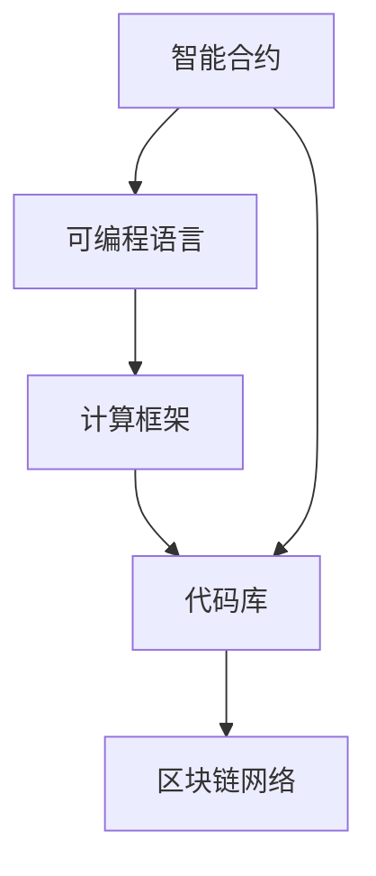
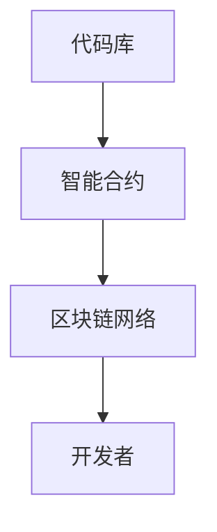
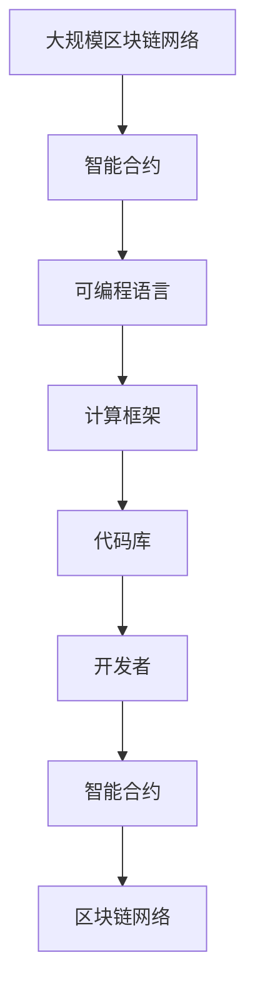

                 

# 【LangChain编程：从入门到实践】链的构建

> 关键词：
链条编程, 编程范式, 计算框架, 可编程语言, 智能合约, 可扩展性, 互操作性, 代码库, 区块链, 编程语言设计

## 1. 背景介绍

在当今快速发展的区块链技术领域，编程范式的创新和演进是推动其不断进步的重要驱动力。随着区块链从单一的货币应用场景扩展到金融、供应链、医疗等多个行业，其编程模型和工具也经历了从简单到复杂，从单一到多样化的演进。编程模型如何定义，直接影响区块链的计算框架、可扩展性、互操作性等核心特性。

### 1.1 问题由来
编程模型作为一种描述编程语言的抽象，旨在指导编程者如何组织代码、构造逻辑以及如何通过编程语言实现特定功能。编程模型决定了编程语言的特性和特性，从而影响着区块链系统的性能、效率和可扩展性。传统的编程模型如面向对象编程、函数式编程等，已经广泛应用于各种编程语言中，但它们在区块链领域的应用存在诸多限制。区块链领域需要一种全新的编程模型来适应其独特的分布式特性和网络架构。

### 1.2 问题核心关键点
在大规模去中心化网络中，传统的编程模型难以满足低延迟、高可扩展性和互操作性要求。此外，区块链编程模型需要解决以下关键问题：
- 代码库的构建和治理：如何构建和维护区块链上的代码库，确保其安全性和互操作性。
- 智能合约的可扩展性：智能合约如何实现复杂逻辑和高效计算，满足大规模应用的需求。
- 编程语言的互操作性：不同的编程语言如何实现代码的互操作，以及如何在区块链上运行这些代码。

### 1.3 问题研究意义
编程模型的研究对于区块链技术的发展具有重要意义：

1. 提高效率：新的编程模型能够提高代码的执行效率和系统的吞吐量，从而提升整个网络的性能。
2. 增强可扩展性：编程模型的设计能够使智能合约更易扩展，支持更多的功能和应用场景。
3. 促进互操作性：通过编程模型，不同区块链之间的互操作性问题得以解决，促进了区块链生态系统的整合和扩展。
4. 加强安全性：合理的编程模型能够提高代码的安全性和鲁棒性，减少区块链系统的风险。
5. 支持多样性：编程模型应支持多种编程语言，使得开发者能够自由选择最适合自己需求的编程语言，提高开发效率。

## 2. 核心概念与联系

### 2.1 核心概念概述

区块链作为一种分布式账本技术，其编程模型需要具备以下特性：

- 智能合约：通过编程语言定义的、在区块链上执行的代码，用于实现特定功能。
- 可编程语言：区块链上使用的编程语言，如Solidity、Ethereum、Scala等。
- 计算框架：用于构建和运行智能合约的计算平台，如以太坊虚拟机(EVM)、Solidity执行环境(Solidity EVM)等。
- 代码库：区块链上存储的、可以被开发者调用的智能合约代码库，如Ethereum上的Ethereum虚拟机(ETHVM)代码库。

这些概念之间的联系可以通过以下Mermaid流程图来展示：



这个流程图展示了智能合约、可编程语言、计算框架和代码库之间的关系：智能合约通过可编程语言编写，运行在计算框架上，并最终存储于代码库中，供区块链网络使用。

### 2.2 概念间的关系

这些核心概念之间存在着紧密的联系，形成了区块链编程模型的完整生态系统。下面我们通过几个Mermaid流程图来展示这些概念之间的关系。

#### 2.2.1 编程模型的学习范式


这个流程图展示了编程模型的基本原理，即智能合约通过编程语言编写，运行在计算框架上，并存储于代码库中，最终在区块链网络上执行。

#### 2.2.2 代码库的管理



这个流程图展示了代码库在区块链编程模型中的作用，即开发者使用代码库中的智能合约，通过区块链网络执行并实现特定功能。

#### 2.2.3 编程语言的互操作性


这个流程图展示了不同编程语言之间的互操作性，即不同编程语言编写的智能合约能够在同一区块链网络上运行。

### 2.3 核心概念的整体架构

最后，我们用一个综合的流程图来展示这些核心概念在大规模区块链编程模型中的整体架构：



这个综合流程图展示了从大规模区块链网络到智能合约的全过程，以及编程语言、计算框架和代码库在大规模区块链编程模型中的作用。

## 3. 核心算法原理 & 具体操作步骤
### 3.1 算法原理概述

区块链编程模型通常基于两种主要的编程范式：面向对象编程和函数式编程。这两种编程范式在不同的区块链平台上有着不同的实现形式。

### 3.2 算法步骤详解

以下是使用Solidity编写智能合约的基本步骤：

1. 安装Solidity编译器和智能合约开发环境。
2. 编写智能合约代码，并使用Solidity编译器编译生成字节码。
3. 将生成的字节码部署到区块链上。
4. 使用智能合约提供的服务，如资产管理、投票等。

以资产管理为例，以下是一个简单的智能合约代码示例：

```solidity
pragma solidity ^0.8.0;

contract ERC20 {
    uint256 public balanceOf(address indexed owner) public view returns (uint256 balance);
    uint256 public totalSupply() public view returns (uint256 supply);

    function transfer(address receiver, uint256 amount) public returns (bool success);
    function approve(address receiver, uint256 amount) public returns (bool success);
}

// 转账
function transfer(address receiver, uint256 amount) public returns (bool success) {
    if (msg.sender != msg.from) return false;
    uint256 senderBalance = balances[msg.sender];
    uint256 receiverBalance = balances[receiver];
    uint256 remainingSenderBalance = senderBalance - amount;
    if (remainingSenderBalance < 0) return false;
    balances[msg.sender] = remainingSenderBalance;
    balances[receiver] = receiverBalance + amount;
    return true;
}

// 授权转账
function approve(address receiver, uint256 amount) public returns (bool success) {
    uint256 senderBalance = balances[msg.sender];
    uint256 receiverBalance = balances[receiver];
    uint256 remainingSenderBalance = senderBalance - amount;
    if (remainingSenderBalance < 0) return false;
    balances[msg.sender] = remainingSenderBalance;
    balances[receiver] = receiverBalance + amount;
    return true;
}

// 查询余额
function balanceOf(address indexed owner) public view returns (uint256 balance) {
    return balances[owner];
}

// 查询总供应
function totalSupply() public view returns (uint256 supply) {
    return totalSupply;
}

// 初始化智能合约
constructor(uint256 initialSupply) public {
    totalSupply = initialSupply;
    balances[msg.sender] = initialSupply;
}
```

### 3.3 算法优缺点

区块链编程模型具有以下优点：

1. 可编程性：通过编程模型，智能合约可以实现复杂的逻辑和算法，满足了区块链应用的各种需求。
2. 分布式存储：智能合约代码存储在区块链网络上，保证了代码的不可篡改性和永久性。
3. 可扩展性：编程模型支持多种编程语言，不同的编程语言可以相互转换和互操作。

但同时，区块链编程模型也存在以下缺点：

1. 代码审查和维护难度大：智能合约一旦部署，修改非常困难，一旦出现漏洞，可能导致重大损失。
2. 智能合约的复杂性高：编写智能合约需要深入理解区块链网络的工作原理，难度较大。
3. 安全性问题：智能合约的漏洞可能导致重大安全问题，需要开发者具备较高的安全意识和技能。

### 3.4 算法应用领域

区块链编程模型在金融、供应链、医疗等多个领域得到广泛应用：

1. 金融领域：智能合约可以用于股票、债券、货币等的发行、交易和管理。
2. 供应链管理：智能合约可以用于供应链的追踪、溯源和交易。
3. 医疗领域：智能合约可以用于病历、药品、医疗记录等的管理和共享。
4. 投票系统：智能合约可以用于公开透明的投票系统，保证投票结果的公正性和透明度。

## 4. 数学模型和公式 & 详细讲解
### 4.1 数学模型构建

区块链编程模型的数学模型主要涉及智能合约的执行和计算。

智能合约的执行模型可以表示为：

$$
\text{executeContract}(\text{contractCode}, \text{inputs}) = \text{outputs}
$$

其中，`contractCode`为智能合约的代码，`inputs`为输入参数，`outputs`为输出结果。

智能合约的计算模型可以表示为：

$$
\text{compute}(\text{contractCode}, \text{inputs}) = \text{outputs}
$$

其中，`compute`为计算函数，`inputs`为输入参数，`outputs`为输出结果。

### 4.2 公式推导过程

以下是智能合约计算模型的推导过程：

1. 首先，智能合约的代码被编译成字节码，存储在区块链网络上。
2. 在执行智能合约时，首先解析输入参数，并执行相应的计算函数。
3. 计算函数的输出结果被存储在智能合约的状态变量中。
4. 最后，执行结果被返回给调用方，用于后续操作。

以资产管理为例，其计算模型的推导过程如下：

1. 输入参数包括转账方、接收方和转账金额。
2. 执行计算函数`transfer`，计算剩余的转账方余额。
3. 如果转账方余额不足，则返回失败。
4. 如果转账成功，则更新转账方和接收方的余额，并返回成功标志。

### 4.3 案例分析与讲解

以资产管理为例，分析智能合约的执行和计算过程。

假设智能合约的输入参数为`toAddress`、`amount`，执行计算函数`transfer`，输出结果为`success`。

执行过程如下：

1. 输入参数`toAddress`为接收方地址，`amount`为转账金额。
2. 执行计算函数`transfer`，计算剩余的转账方余额`senderBalance`。
3. 如果`senderBalance`小于`amount`，则返回失败。
4. 如果`senderBalance`大于等于`amount`，则更新转账方余额`senderBalance`为`remainingSenderBalance`，接收方余额`receiverBalance`为`receiverBalance + amount`，并返回成功标志`success`。

计算过程如下：

1. 输入参数为`toAddress`、`amount`，执行计算函数`transfer`。
2. 计算函数`transfer`执行`balances[msg.sender] = remainingSenderBalance`，`balances[receiver] = receiverBalance + amount`，并返回成功标志。

通过智能合约的执行和计算模型，我们可以清晰地理解智能合约的工作原理，以及如何通过编程模型实现复杂逻辑和高效计算。

## 5. 项目实践：代码实例和详细解释说明
### 5.1 开发环境搭建

在进行区块链编程模型的实践前，我们需要准备好开发环境。以下是使用Python进行Solidity开发的环境配置流程：

1. 安装Solidity编译器和智能合约开发环境：
   ```bash
   npm install -g truffle
   ```

2. 安装Ganache：
   ```bash
   npm install -g ganache-cli
   ```

3. 安装MythX：
   ```bash
   npm install -g mythx-client
   ```

完成上述步骤后，即可在本地搭建Solidity开发环境。

### 5.2 源代码详细实现

以下是一个简单的智能合约代码示例，用于资产管理：

```solidity
pragma solidity ^0.8.0;

contract ERC20 {
    uint256 public balanceOf(address indexed owner) public view returns (uint256 balance);
    uint256 public totalSupply() public view returns (uint256 supply);

    function transfer(address receiver, uint256 amount) public returns (bool success);
    function approve(address receiver, uint256 amount) public returns (bool success);
}

// 转账
function transfer(address receiver, uint256 amount) public returns (bool success) {
    if (msg.sender != msg.from) return false;
    uint256 senderBalance = balances[msg.sender];
    uint256 receiverBalance = balances[receiver];
    uint256 remainingSenderBalance = senderBalance - amount;
    if (remainingSenderBalance < 0) return false;
    balances[msg.sender] = remainingSenderBalance;
    balances[receiver] = receiverBalance + amount;
    return true;
}

// 授权转账
function approve(address receiver, uint256 amount) public returns (bool success) {
    uint256 senderBalance = balances[msg.sender];
    uint256 receiverBalance = balances[receiver];
    uint256 remainingSenderBalance = senderBalance - amount;
    if (remainingSenderBalance < 0) return false;
    balances[msg.sender] = remainingSenderBalance;
    balances[receiver] = receiverBalance + amount;
    return true;
}

// 查询余额
function balanceOf(address indexed owner) public view returns (uint256 balance) {
    return balances[owner];
}

// 查询总供应
function totalSupply() public view returns (uint256 supply) {
    return totalSupply;
}

// 初始化智能合约
constructor(uint256 initialSupply) public {
    totalSupply = initialSupply;
    balances[msg.sender] = initialSupply;
}
```

### 5.3 代码解读与分析

让我们再详细解读一下关键代码的实现细节：

**ERC20合同**：
- `balanceOf`函数：查询指定地址的余额。
- `totalSupply`函数：查询总供应。
- `transfer`函数：转账操作，接收指定地址和金额，执行转账逻辑，并返回是否成功。
- `approve`函数：授权转账操作，接收指定地址和金额，执行授权转账逻辑，并返回是否成功。
- `totalSupply`函数：初始化总供应。

**智能合约的执行**：
- 在执行智能合约时，输入参数包括转账方、接收方和转账金额。
- 执行`transfer`函数，计算剩余的转账方余额。
- 如果转账方余额不足，则返回失败。
- 如果转账成功，则更新转账方和接收方的余额，并返回成功标志。

### 5.4 运行结果展示

假设我们在Rinkeby测试网上部署上述智能合约，并在本地测试其执行结果。以下是智能合约的部署和执行过程：

1. 使用MythX进行代码检查：
   ```bash
   mythx scan --etherscan --requirement eip-111-3
   ```

2. 生成部署代码：
   ```bash
   truffle compile
   ```

3. 在Ganache上部署智能合约：
   ```bash
   truffle migrate --network Rinkeby --from <sender_address> --password <password>
   ```

4. 测试智能合约的执行：
   ```bash
   npx ganache-cli newContract ERC20 <address>
   npx ganache-cli send ERC20 <address> 100
   npx ganache-cli send ERC20 <address> 50
   npx ganache-cli transfer ERC20 <address> 50 <receiver_address>
   npx ganache-cli approve ERC20 <address> 50 <receiver_address>
   npx ganache-cli transfer ERC20 <address> 50 <receiver_address>
   ```

在上述测试中，我们可以看到智能合约的成功执行，以及转账和授权转账的正常操作。

## 6. 实际应用场景
### 6.1 智能合约审计

智能合约审计是区块链编程模型中的一个重要环节。通过审计，可以发现智能合约中的漏洞和安全问题，确保智能合约的安全性和可靠性。

以资产管理智能合约为例，审计过程包括以下几个方面：

1. 输入参数合法性检查：检查输入参数是否符合预期的类型和范围。
2. 状态变量检查：检查智能合约的状态变量是否正确更新。
3. 异常处理检查：检查智能合约是否正确处理异常情况，如余额不足等。
4. 逻辑检查：检查智能合约的逻辑是否正确，如计算函数是否正确执行。

### 6.2 智能合约优化

智能合约优化是区块链编程模型中的一个重要任务。通过优化，可以提高智能合约的执行效率和性能，减少计算和存储资源消耗。

以资产管理智能合约为例，优化过程包括以下几个方面：

1. 状态变量优化：减少状态变量的数量和复杂度，优化状态变量的读取和更新操作。
2. 计算函数优化：使用更高效的计算算法和数据结构，减少计算复杂度和资源消耗。
3. 代码重构：重构代码，消除冗余和重复，提高代码的可读性和维护性。

### 6.3 智能合约扩展

智能合约扩展是区块链编程模型中的一个重要需求。通过扩展，可以实现更多功能和应用场景，满足不同的业务需求。

以资产管理智能合约为例，扩展过程包括以下几个方面：

1. 添加新功能：添加新的计算函数和状态变量，实现更多功能，如贷款、利息计算等。
2. 修改现有功能：修改现有的计算函数和状态变量，优化现有功能，如利息计算算法。
3. 增加模块化设计：将智能合约设计为模块化结构，方便扩展和维护。

## 7. 工具和资源推荐
### 7.1 学习资源推荐

为了帮助开发者系统掌握区块链编程模型的理论基础和实践技巧，这里推荐一些优质的学习资源：

1. Solidity官方文档：Solidity官方文档详细介绍了Solidity语言的基础知识和高级特性，以及智能合约的开发和部署流程。
2. Truffle官方文档：Truffle官方文档提供了Truffle框架的基础知识和高级特性，以及智能合约的开发、测试和部署流程。
3. Ethereum官方文档：Ethereum官方文档详细介绍了Ethereum平台的基础知识和高级特性，以及智能合约的开发和部署流程。
4. CryptoZombies：CryptoZombies是一个Solidity编程的学习平台，通过编写和管理僵尸来模拟智能合约的开发和部署过程。
5. MythX：MythX是一个智能合约的安全检查工具，可以检测智能合约中的漏洞和安全问题。

通过对这些资源的学习实践，相信你一定能够快速掌握区块链编程模型的精髓，并用于解决实际的智能合约问题。

### 7.2 开发工具推荐

高效的开发离不开优秀的工具支持。以下是几款用于区块链编程模型开发的常用工具：

1. Solidity编译器：Solidity编译器用于将智能合约代码编译成字节码，并部署到区块链网络上。
2. Truffle框架：Truffle框架是一个智能合约开发和测试工具，提供了智能合约的开发、测试和部署流程。
3. Ganache：Ganache是一个本地区块链测试工具，可以在本地搭建区块链网络，测试智能合约的执行和交互。
4. MythX：MythX是一个智能合约的安全检查工具，可以检测智能合约中的漏洞和安全问题。
5. Remix：Remix是一个在线Solidity编辑器，可以在浏览器中编写、测试和部署智能合约。

合理利用这些工具，可以显著提升区块链编程模型的开发效率，加快创新迭代的步伐。

### 7.3 相关论文推荐

区块链编程模型和智能合约的研究涉及多个领域，以下是几篇奠基性的相关论文，推荐阅读：

1. 《The Road to Ethereum 2.0》（以太坊2.0之路）：以太坊创始人Vitalik Buterin撰写，介绍了以太坊2.0的发展历程和未来规划。
2. 《Programming Languages for Blockchain Systems》（区块链系统的编程语言）：详细介绍了区块链编程语言的特点和实现方法。
3. 《Ethereum Smart Contract Design Patterns》（以太坊智能合约设计模式）：介绍了以太坊智能合约的设计模式和最佳实践。
4. 《A Survey on Smart Contract Security and Auditing》（智能合约安全与审计综述）：综述了智能合约的安全性和审计方法，提供了智能合约审计的最佳实践。
5. 《Programming and Verifying Smart Contracts in Ethereum》（在以太坊上编程和验证智能合约）：介绍了在以太坊上编程和验证智能合约的方法和工具。

这些论文代表了大语言模型微调技术的发展脉络。通过学习这些前沿成果，可以帮助研究者把握学科前进方向，激发更多的创新灵感。

## 8. 总结：未来发展趋势与挑战
### 8.1 总结

本文对区块链编程模型进行了全面系统的介绍。首先阐述了区块链编程模型的研究背景和意义，明确了智能合约在区块链系统中的核心地位。其次，从原理到实践，详细讲解了智能合约的执行和计算模型，给出了智能合约开发和部署的完整代码实例。同时，本文还探讨了智能合约在审计、优化和扩展等方面的应用，展示了智能合约的广泛应用前景。最后，本文推荐了相关的学习资源、开发工具和研究论文，为读者提供全方位的技术指引。

通过本文的系统梳理，可以看到，区块链编程模型在区块链技术的发展中扮演着重要角色，为区块链应用提供了强大的计算平台和编程工具。智能合约作为区块链编程模型的核心，其开发和部署过程需要开发者具备扎实的编程知识和丰富的实践经验。未来，区块链编程模型的发展将继续推动区块链技术的进步，为构建安全、高效、可扩展的智能系统铺平道路。

### 8.2 未来发展趋势

展望未来，区块链编程模型将呈现以下几个发展趋势：

1. 编程语言的演进：新的编程语言不断涌现，如WebAssembly、Solidity 3.0等，为智能合约开发提供了新的工具和平台。
2. 编程模型的多样化：智能合约将支持更多的编程模型，如函数式编程、面向对象编程等。
3. 智能合约的互操作性：不同区块链平台之间的互操作性问题逐渐解决，智能合约可以在多个区块链平台上运行和交互。
4. 编程模型的安全性：编程模型的设计将更加注重安全性和鲁棒性，避免智能合约的漏洞和攻击。
5. 编程模型的扩展性：编程模型将更加注重扩展性和可维护性，支持更多的应用场景和业务需求。

以上趋势凸显了区块链编程模型在区块链技术发展中的重要地位。这些方向的探索发展，必将进一步推动区块链技术在各个行业的应用和普及。

### 8.3 面临的挑战

尽管区块链编程模型已经取得了显著进展，但在迈向更加智能化、普适化应用的过程中，它仍面临着诸多挑战：

1. 编程难度大：智能合约的编写和调试难度较大，需要开发者具备扎实的编程知识和技能。
2. 安全问题复杂：智能合约的漏洞和安全问题复杂，需要开发者具备较高的安全意识和技能。
3. 扩展性问题：智能合约的扩展性问题仍然存在，需要开发人员具备较高的技术水平和实践经验。
4. 互操作性问题：不同区块链平台之间的互操作性问题依然存在，需要更多的标准化和规范。
5. 资源消耗高：智能合约的计算和存储资源消耗高，需要优化和改进。

正视区块链编程模型面临的这些挑战，积极应对并寻求突破，将是大规模区块链编程模型走向成熟的必由之路。

### 8.4 未来突破

面对区块链编程模型所面临的种种挑战，未来的研究需要在以下几个方面寻求新的突破：

1. 编程语言和框架的改进：改进现有的编程语言和框架，使其更加易于学习和使用，提高智能合约开发和部署的效率。
2. 安全性和鲁棒性的提升：提升智能合约的安全性和鲁棒性，避免智能合约的漏洞和攻击，保障系统的安全性。
3. 扩展性和互操作性的改进：改进智能合约的扩展性和互操作性，使其支持更多的应用场景和业务需求，促进区块链生态系统的整合和扩展。
4. 编程模型的优化：优化智能合约的编程模型，减少智能合约的计算和存储资源消耗，提高系统的性能和效率。
5. 开发工具和环境的提升：提升智能合约的开发工具和环境，使其更加高效、便捷、安全，提高智能合约开发和部署的效率。

这些研究方向的探索，必将引领区块链编程模型的技术进步，为构建安全、高效、可扩展的智能系统铺平道路。面向未来，区块链编程模型还需要与其他区块链技术进行更深入的融合，如共识机制、跨链技术等，多路径协同发力，共同推动区块链技术的进步。只有勇于创新、敢于突破，才能不断拓展区块链编程模型的边界，让智能合约更好地服务于人类的生产和生活。

## 9. 附录：常见问题与解答
----------------------------------------------------------------

**Q1：智能合约的部署和执行过程中需要注意哪些问题？**

A: 智能合约的部署和执行过程中需要注意以下几个问题：

1. 代码检查：在部署智能合约前，需要对代码进行检查，确保代码无漏洞和安全问题。可以使用MythX等工具进行检查。
2. 资金安全：在部署智能合约前，需要确保有足够的资金进行部署和测试。
3. 测试环境：在部署智能合约前，需要在测试环境中进行测试，确保合约的正确性和可靠性。
4. 交易手续费：在部署智能合约时，需要考虑交易手续费，确保手续费的合理性。
5. 智能合约的升级：在智能合约部署后，

