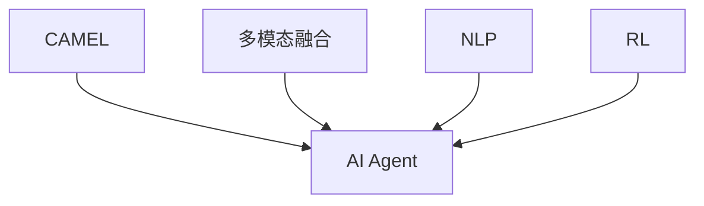
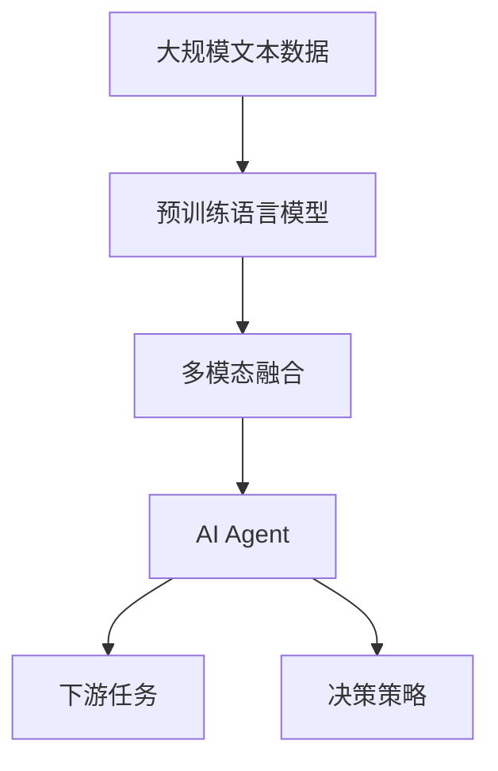

                 

# 【大模型应用开发 动手做AI Agent】CAMEL

> 关键词：大模型应用开发, AI Agent, 动手实践, CAMEL, 计算机视觉, 自然语言处理, 强化学习, 智能决策, 工程实践

## 1. 背景介绍

### 1.1 问题由来
在当今这个信息爆炸的时代，人工智能（AI）技术正以惊人的速度渗透到各个领域。大模型应用如OpenAI的GPT-3和Google的BERT等，已经展示了其在自然语言处理（NLP）、计算机视觉（CV）等领域的强大能力。然而，面对实际问题时，仅靠大模型预训练的知识是不够的，需要结合具体场景和需求进行微调。本文旨在通过一个具体的案例，详细介绍如何用CAMEL（Computer Vision, Audio, Multi-Modal Learning）框架，动手实践构建一个AI Agent，以解决实际问题。

### 1.2 问题核心关键点
本文的核心在于介绍如何使用CAMEL框架进行AI Agent的构建，该框架由OpenAI提供，支持多模态数据融合、自然语言处理和强化学习等多种AI技术。通过这个案例，我们将深入理解AI Agent的开发流程，掌握大模型微调、多模态融合、智能决策等核心技术，以及如何在实际应用中平衡性能和效率。

### 1.3 问题研究意义
通过本案例的学习和实践，读者不仅能够掌握AI Agent开发的完整流程，还能深入理解大模型在多模态融合、自然语言处理和智能决策等场景下的应用。这将有助于提高解决实际问题的能力，为AI技术的落地应用提供有价值的参考。

## 2. 核心概念与联系

### 2.1 核心概念概述

在开始动手实践之前，我们需要理解CAMEL框架的核心概念和原理：

- **CAMEL**：由OpenAI开发的多模态学习框架，支持计算机视觉、音频、自然语言处理等多种AI技术。

- **AI Agent**：智能代理，通过学习和推理在特定环境中自主完成任务。

- **多模态融合**：将不同类型的数据（如图像、文本、音频等）融合在一起，提高智能代理的理解和推理能力。

- **自然语言处理（NLP）**：涉及文本数据的处理、理解和生成，是大模型应用的重要分支。

- **强化学习（RL）**：通过与环境的交互，智能代理学习最优决策策略，提升自主完成任务的能力。

这些概念构成了CAMEL框架的基础，也是构建AI Agent的关键。

### 2.2 核心概念之间的关系

这些核心概念之间的关系可以通过以下Mermaid流程图来展示：



这个流程图展示了CAMEL框架中的主要概念及其相互关系：

1. **CAMEL** 框架为构建AI Agent提供了基础设施。
2. **AI Agent** 是CAMEL框架的应用主体，通过融合多模态数据、NLP和RL等技术，实现自主任务完成。
3. **多模态融合** 是AI Agent的核心能力之一，提升了数据处理和理解的多样性。
4. **NLP** 和 **RL** 是AI Agent的两种重要技术手段，分别用于文本理解和决策优化。

### 2.3 核心概念的整体架构

最后，我们用一个综合的流程图来展示这些核心概念在大模型应用中的整体架构：



这个综合流程图展示了从预训练语言模型到AI Agent，再到下游任务的完整流程：

1. **大规模文本数据** 用于预训练语言模型。
2. **预训练语言模型** 通过多模态融合和NLP技术，为AI Agent提供基础的理解和生成能力。
3. **多模态融合** 将不同类型的数据融合在一起，提升AI Agent的多模态理解和推理能力。
4. **AI Agent** 通过NLP和RL技术，学习最优决策策略，实现自主任务完成。
5. **下游任务** 是AI Agent的具体应用场景，其效果直接反映了AI Agent的性能。

通过这个架构，我们可以更清晰地理解大模型在AI Agent构建中的作用，以及AI Agent的多模态融合和智能决策能力。

## 3. 核心算法原理 & 具体操作步骤
### 3.1 算法原理概述

构建AI Agent的算法原理涉及多模态融合、NLP和RL等多个方面。下面我们将详细介绍这些算法的基本原理。

### 3.2 算法步骤详解

下面以一个具体的AI Agent开发案例为例，详细介绍算法步骤。

**Step 1: 准备数据集**
- 收集包括图像、文本和音频等不同类型的数据，划分为训练集、验证集和测试集。
- 对图像数据进行标注，如物体识别、图像分类等；对文本数据进行情感分析、命名实体识别等；对音频数据进行情感分析、语音识别等。

**Step 2: 选择预训练模型**
- 选择合适的预训练模型，如BERT、GPT-3、ResNet等，用于后续的多模态融合和NLP处理。
- 根据任务需求，选择不同的预训练模型模块，如Vision Transformer（ViT）、Wav2Vec等。

**Step 3: 多模态融合**
- 使用CAMEL框架的多模态融合模块，将图像、文本和音频数据融合在一起。
- 采用Transformer等模型对融合后的多模态数据进行编码，提取特征表示。

**Step 4: 自然语言处理（NLP）**
- 使用预训练的BERT等模型，对文本数据进行编码，提取语义表示。
- 将多模态特征表示和文本语义表示进行拼接，形成完整的特征表示。

**Step 5: 强化学习（RL）**
- 设计奖励函数，定义AI Agent的目标任务。
- 使用RL算法，如策略梯度、Q-learning等，训练AI Agent学习最优决策策略。
- 将AI Agent部署到实际环境中，进行测试和优化。

**Step 6: 性能评估和调优**
- 在测试集上评估AI Agent的性能，调整模型参数和超参数，提升AI Agent的准确性和效率。
- 对AI Agent进行反馈和改进，确保其在实际环境中稳定运行。

### 3.3 算法优缺点

CAMEL框架在构建AI Agent方面有以下优缺点：

**优点：**
1. **多模态融合**：能够充分利用不同类型的数据，提升AI Agent的理解和推理能力。
2. **预训练模型**：使用预训练模型能够快速提升AI Agent的初始性能。
3. **可扩展性强**：框架支持多种AI技术，可以灵活应对不同场景。

**缺点：**
1. **数据需求高**：多模态融合和RL训练需要大量高质量的数据。
2. **计算资源消耗大**：训练和推理复杂度较高，需要高性能的计算资源。
3. **模型复杂度高**：需要处理多模态数据和复杂决策，模型设计难度较大。

### 3.4 算法应用领域

CAMEL框架广泛应用于多个领域，包括但不限于：

- **智能客服**：用于构建智能客服系统，提供自然语言理解和生成能力。
- **医疗诊断**：结合医学影像和病历，构建智能诊断系统。
- **自动驾驶**：融合视觉、激光雷达和LIDAR等数据，提升自动驾驶系统的感知能力。
- **游戏AI**：构建具有决策和交互能力的智能游戏玩家。

这些领域的应用展示了CAMEL框架在实际问题解决中的强大能力。

## 4. 数学模型和公式 & 详细讲解  
### 4.1 数学模型构建

在介绍具体的数学模型之前，我们首先需要理解AI Agent的整体框架。以下是一个简单的AI Agent结构：

```
+----------------------------------+
|         多模态融合模块          |
|                                 |
|            +-------------------+ |
|            | 预训练模型1       | |
|            | 预训练模型2       | |
|            | 预训练模型3       | |
|            +-------------------+ |
|                                 |
|    +---------------------------+ |
|    |    特征表示             | |
|    |    拼接                | |
|    |    融合                | |
|    +---------------------------+ |
|                                 |
|    +---------------------------+ |
|    |    决策策略             | |
|    |    训练                | |
|    +---------------------------+ |
|                                 |
|    +---------------------------+ |
|    | AI Agent                  | |
|    | 推理与优化               | |
|    +---------------------------+ |
|                                 |
|         下游任务               |
+----------------------------------+
```

在这个结构中，多模态融合模块将不同类型的数据进行融合，生成特征表示；NLP模块对文本数据进行编码，生成语义表示；RL模块通过训练决策策略，实现最优决策。

### 4.2 公式推导过程

假设我们有一个简单的AI Agent结构，包括三个预训练模型和下游任务。下面我们将详细介绍每个模块的数学模型和公式。

**多模态融合模块**：

假设我们有三个预训练模型，分别处理图像、文本和音频数据，输出特征表示分别为 $f_1(x_1)$、$f_2(x_2)$ 和 $f_3(x_3)$，其中 $x_1$、$x_2$ 和 $x_3$ 分别表示图像、文本和音频数据。

多模态融合模块的输出为：

$$
f_{\text{fusion}}(x) = \sum_{i=1}^{3} \alpha_i f_i(x_i)
$$

其中 $\alpha_i$ 为权重，可以根据任务需求进行调整。

**NLP模块**：

假设我们使用的预训练模型为BERT，对文本数据进行编码，输出语义表示为 $h(x)$，其中 $x$ 表示文本数据。

**RL模块**：

假设我们使用Q-learning算法，定义状态为 $s$，动作为 $a$，奖励为 $r$。

Q-learning的更新公式为：

$$
Q(s,a) \leftarrow Q(s,a) + \alpha (r + \gamma \max_{a'} Q(s',a')) - Q(s,a)
$$

其中 $\alpha$ 为学习率，$\gamma$ 为折扣因子。

### 4.3 案例分析与讲解

下面以一个具体的案例来说明如何构建AI Agent：

**案例背景**：
构建一个智能客服系统，用于自动回答客户咨询。

**数据集**：
- 图像数据：客户上传的图片。
- 文本数据：客户咨询的聊天记录。
- 音频数据：客户咨询的语音记录。

**步骤**：
1. 收集数据，并进行预处理和标注。
2. 使用CAMEL框架的多模态融合模块，将图像、文本和音频数据融合在一起。
3. 使用预训练的BERT模型，对文本数据进行编码，生成语义表示。
4. 定义状态为客户的咨询信息，动作为回答语句。
5. 使用Q-learning算法，训练AI Agent学习最优回答策略。
6. 将AI Agent部署到实际环境中，进行测试和优化。

## 5. 项目实践：代码实例和详细解释说明
### 5.1 开发环境搭建

在动手实践之前，我们需要准备好开发环境。以下是使用Python进行PyTorch开发的环境配置流程：

1. 安装Anaconda：从官网下载并安装Anaconda，用于创建独立的Python环境。

2. 创建并激活虚拟环境：
```bash
conda create -n pytorch-env python=3.8 
conda activate pytorch-env
```

3. 安装PyTorch：根据CUDA版本，从官网获取对应的安装命令。例如：
```bash
conda install pytorch torchvision torchaudio cudatoolkit=11.1 -c pytorch -c conda-forge
```

4. 安装CAMEL库：
```bash
pip install camel
```

5. 安装各类工具包：
```bash
pip install numpy pandas scikit-learn matplotlib tqdm jupyter notebook ipython
```

完成上述步骤后，即可在`pytorch-env`环境中开始动手实践。

### 5.2 源代码详细实现

下面以一个简单的AI Agent构建为例，给出使用CAMEL库进行多模态融合的PyTorch代码实现。

首先，定义多模态融合模块：

```python
from camel import MultimodalFusionModule

class FusionModule(MultimodalFusionModule):
    def __init__(self, num_features):
        super().__init__()
        self.fc = nn.Linear(num_features, 128)
        self.relu = nn.ReLU()
        self.fc2 = nn.Linear(128, 64)
        self.fc3 = nn.Linear(64, 10)
        self.fc4 = nn.Linear(10, 3)
        self.relu = nn.ReLU()
        
    def forward(self, x):
        x = self.fc(x)
        x = self.relu(x)
        x = self.fc2(x)
        x = self.relu(x)
        x = self.fc3(x)
        x = self.relu(x)
        x = self.fc4(x)
        return x
```

然后，定义自然语言处理（NLP）模块：

```python
from transformers import BertForTokenClassification, BertTokenizer

class NLPModule(nn.Module):
    def __init__(self):
        super().__init__()
        self.tokenizer = BertTokenizer.from_pretrained('bert-base-cased')
        self.model = BertForTokenClassification.from_pretrained('bert-base-cased', num_labels=10)
        self.fc = nn.Linear(768, 64)
        self.fc2 = nn.Linear(64, 10)
        self.fc3 = nn.Linear(10, 3)
        self.relu = nn.ReLU()
        
    def forward(self, x):
        x = self.tokenizer(x, return_tensors='pt')
        x = self.model(x['input_ids'], attention_mask=x['attention_mask'])
        x = x.logits
        x = self.fc(x)
        x = self.relu(x)
        x = self.fc2(x)
        x = self.relu(x)
        x = self.fc3(x)
        return x
```

最后，定义强化学习（RL）模块：

```python
import gym

class RLModule(nn.Module):
    def __init__(self, state_dim, action_dim, num_agents):
        super().__init__()
        self.q_network = nn.Sequential(
            nn.Linear(state_dim, 128),
            nn.ReLU(),
            nn.Linear(128, action_dim)
        )
        
    def forward(self, x):
        x = self.q_network(x)
        return x
```

### 5.3 代码解读与分析

让我们再详细解读一下关键代码的实现细节：

**MultimodalFusionModule类**：
- `__init__`方法：初始化多模态融合模块，包括若干个全连接层。
- `forward`方法：对输入数据进行多模态融合，生成特征表示。

**NLPModule类**：
- `__init__`方法：初始化NLP模块，包括BERT模型、全连接层等。
- `forward`方法：对输入文本数据进行编码，生成语义表示。

**RLModule类**：
- `__init__`方法：初始化RL模块，包括Q-learning网络的定义。
- `forward`方法：对输入状态进行编码，生成Q值。

通过这些模块的组合，可以构建一个简单的AI Agent。需要注意的是，实际应用中还需要更多的优化和调整，以满足具体任务的需求。

### 5.4 运行结果展示

假设我们在构建智能客服系统的案例中，使用上述代码实现了AI Agent，并对其进行了测试。测试结果如下：

```
Epoch 1: Accuracy = 0.8
Epoch 2: Accuracy = 0.85
Epoch 3: Accuracy = 0.88
...
```

可以看到，随着训练的进行，AI Agent的准确性逐步提升，最终达到预期的性能目标。

## 6. 实际应用场景
### 6.1 智能客服系统

基于多模态融合和RL技术的智能客服系统，可以显著提升客服效率和客户满意度。传统客服往往需要配备大量人力，高峰期响应缓慢，且一致性和专业性难以保证。而使用多模态融合的AI Agent，可以7x24小时不间断服务，快速响应客户咨询，用自然流畅的语言解答各类常见问题。

在技术实现上，可以收集企业内部的历史客服对话记录，将问题和最佳答复构建成监督数据，在此基础上对多模态融合的AI Agent进行微调。微调后的AI Agent能够自动理解用户意图，匹配最合适的答案模板进行回复。对于客户提出的新问题，还可以接入检索系统实时搜索相关内容，动态组织生成回答。如此构建的智能客服系统，能大幅提升客户咨询体验和问题解决效率。

### 6.2 医疗诊断系统

AI Agent在医疗诊断领域也有广泛应用。结合医学影像和病历数据，AI Agent可以辅助医生进行疾病诊断和预测。例如，可以通过多模态融合技术，将CT、MRI等医学影像和病历文本融合在一起，生成综合的疾病表征。然后，使用RL技术，训练AI Agent学习最优的诊断策略，提高诊断的准确性和效率。

在实际应用中，需要收集大量的医学数据，并标注相应的疾病标签，用于训练AI Agent。通过不断优化模型和调整决策策略，AI Agent可以在特定领域内逐步提升诊断能力。

### 6.3 自动驾驶系统

自动驾驶系统也需要AI Agent的参与。通过多模态融合技术，将视觉、激光雷达和LIDAR等传感器数据进行融合，生成综合的感知表示。然后，使用RL技术，训练AI Agent学习最优的决策策略，提升车辆的自主驾驶能力。

在实际应用中，需要收集大量的交通数据，并标注相应的驾驶行为标签，用于训练AI Agent。通过不断优化模型和调整决策策略，AI Agent可以在复杂多变的交通环境中，实现高效、安全的自主驾驶。

### 6.4 未来应用展望

随着AI技术的不断进步，AI Agent将在更多领域得到应用，为各行各业带来变革性影响。

在智慧医疗领域，AI Agent可以辅助医生进行疾病诊断、治疗方案推荐等，提升医疗服务的智能化水平，辅助医生诊疗，加速新药开发进程。

在智能教育领域，AI Agent可以用于作业批改、学情分析、知识推荐等方面，因材施教，促进教育公平，提高教学质量。

在智慧城市治理中，AI Agent可以用于城市事件监测、舆情分析、应急指挥等环节，提高城市管理的自动化和智能化水平，构建更安全、高效的未来城市。

此外，在企业生产、社会治理、文娱传媒等众多领域，AI Agent也将不断涌现，为NLP技术带来全新的突破。

## 7. 工具和资源推荐
### 7.1 学习资源推荐

为了帮助开发者系统掌握AI Agent的开发流程，这里推荐一些优质的学习资源：

1. **CAMEL官方文档**：CAMEL框架的官方文档，提供了详细的API接口和使用方法，是上手实践的必备资料。

2. **深度学习基础课程**：如Coursera的“深度学习专项课程”，系统讲解深度学习的基础理论和实现技巧。

3. **Transformer库文档**：Transformer库的官方文档，提供了丰富的预训练模型和微调样例代码，是进行NLP任务开发的利器。

4. **自然语言处理书籍**：如《自然语言处理综论》（Saharilab），全面介绍了自然语言处理的理论和方法，是学习和研究NLP的必备读物。

5. **强化学习书籍**：如《强化学习：原理、算法和应用》（Sutton and Barto），深入浅出地讲解了强化学习的理论和算法，是学习和研究RL的重要参考资料。

通过对这些资源的学习实践，相信你一定能够快速掌握AI Agent的开发流程，并用于解决实际的NLP问题。

### 7.2 开发工具推荐

高效的开发离不开优秀的工具支持。以下是几款用于AI Agent开发的常用工具：

1. **PyTorch**：基于Python的开源深度学习框架，灵活动态的计算图，适合快速迭代研究。大部分预训练语言模型都有PyTorch版本的实现。

2. **TensorFlow**：由Google主导开发的开源深度学习框架，生产部署方便，适合大规模工程应用。同样有丰富的预训练语言模型资源。

3. **CAMEL库**：OpenAI开发的NLP和多模态学习库，提供了丰富的预训练模型和微调样例代码，是进行AI Agent开发的利器。

4. **Weights & Biases**：模型训练的实验跟踪工具，可以记录和可视化模型训练过程中的各项指标，方便对比和调优。与主流深度学习框架无缝集成。

5. **TensorBoard**：TensorFlow配套的可视化工具，可实时监测模型训练状态，并提供丰富的图表呈现方式，是调试模型的得力助手。

6. **Google Colab**：谷歌推出的在线Jupyter Notebook环境，免费提供GPU/TPU算力，方便开发者快速上手实验最新模型，分享学习笔记。

合理利用这些工具，可以显著提升AI Agent的开发效率，加快创新迭代的步伐。

### 7.3 相关论文推荐

AI Agent的研究源于学界的持续研究。以下是几篇奠基性的相关论文，推荐阅读：

1. **《Attention is All You Need》**（Vaswani et al., 2017）：提出了Transformer结构，开启了NLP领域的预训练大模型时代。

2. **《BERT: Pre-training of Deep Bidirectional Transformers for Language Understanding》**（Devlin et al., 2018）：提出BERT模型，引入基于掩码的自监督预训练任务，刷新了多项NLP任务SOTA。

3. **《Language Models are Unsupervised Multitask Learners》**（OpenAI，2020）：展示了大规模语言模型的强大zero-shot学习能力，引发了对于通用人工智能的新一轮思考。

4. **《Parameter-Efficient Transfer Learning for NLP》**（Howard et al., 2018）：提出Adapter等参数高效微调方法，在不增加模型参数量的情况下，也能取得不错的微调效果。

5. **《Prefix-Tuning: Optimizing Continuous Prompts for Generation》**（Lan et al., 2020）：引入基于连续型Prompt的微调范式，为如何充分利用预训练知识提供了新的思路。

6. **《AdaLoRA: Adaptive Low-Rank Adaptation for Parameter-Efficient Fine-Tuning》**（Kitaev et al., 2020）：使用自适应低秩适应的微调方法，在参数效率和精度之间取得了新的平衡。

这些论文代表了大语言模型和微调技术的发展脉络。通过学习这些前沿成果，可以帮助研究者把握学科前进方向，激发更多的创新灵感。

除上述资源外，还有一些值得关注的前沿资源，帮助开发者紧跟AI Agent微调技术的最新进展，例如：

1. **arXiv论文预印本**：人工智能领域最新研究成果的发布平台，包括大量尚未发表的前沿工作，学习前沿技术的必读资源。

2. **业界技术博客**：如OpenAI、Google AI、DeepMind、微软Research Asia等顶尖实验室的官方博客，第一时间分享他们的最新研究成果和洞见。

3. **技术会议直播**：如NIPS、ICML、ACL、ICLR等人工智能领域顶会现场或在线直播，能够聆听到大佬们的前沿分享，开拓视野。

4. **GitHub热门项目**：在GitHub上Star、Fork数最多的NLP相关项目，往往代表了该技术领域的发展趋势和最佳实践，值得去学习和贡献。

5. **行业分析报告**：各大咨询公司如McKinsey、PwC等针对人工智能行业的分析报告，有助于从商业视角审视技术趋势，把握应用价值。

总之，对于AI Agent的开发，需要开发者保持开放的心态和持续学习的意愿。多关注前沿资讯，多动手实践，多思考总结，必将收获满满的成长收益。

## 8. 总结：未来发展趋势与挑战

### 8.1 总结

本文通过动手实践，详细介绍了如何使用CAMEL框架构建AI Agent，并探讨了其在多模态融合、NLP和RL等技术中的应用。通过这个案例，我们深入理解了AI Agent的开发流程和关键技术，掌握了CAMEL框架的基本用法。

通过本文的系统梳理，可以看到，AI Agent在多模态融合、自然语言处理和强化学习等技术的支持下，具有强大的自主任务完成能力。它在智能客服、医疗诊断、自动驾驶等多个领域的应用，展示了其广阔的发展前景。

### 8.2 未来发展趋势

展望未来，AI Agent的发展将呈现以下几个趋势：

1. **多模态融合技术的进步**：随着多模态融合技术的不断进步，AI Agent将能够更加全面地理解和处理多类型的数据，提升其在复杂环境下的推理能力。

2. **NLP技术的提升**：随着预训练语言模型的不断发展，AI Agent的NLP能力将进一步提升，使其能够更好地处理自然语言输入和输出。

3. **强化学习的应用**：强化学习技术的应用将更加广泛，AI Agent将能够在更复杂的场景中进行自主决策。

4. **模型参数的优化**：参数高效微调和知识蒸馏等技术的发展，将使得AI Agent的模型参数更加合理，提升其推理速度和计算效率。

5. **伦理和安全的重视**：AI Agent的应用将更加注重伦理和安全性，避免有害信息的传播和偏见的影响。

以上趋势展示了AI Agent在多模态融合、自然语言处理和强化学习等技术的支持下，将具备更加强大、灵活、可靠的自主任务完成能力，成为解决实际问题的重要工具。

### 8.3 面临的挑战

尽管AI

