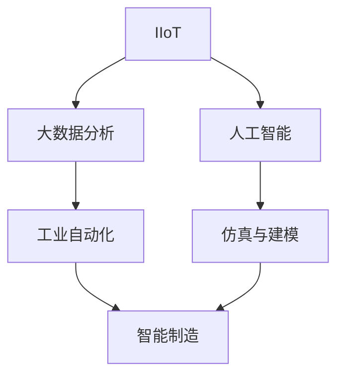
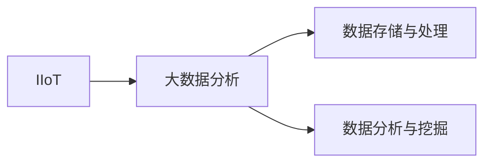
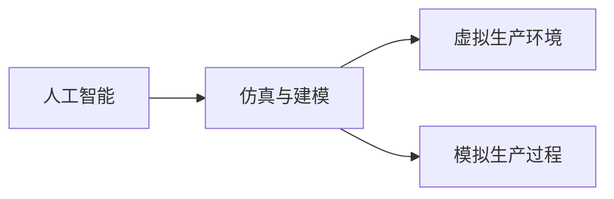
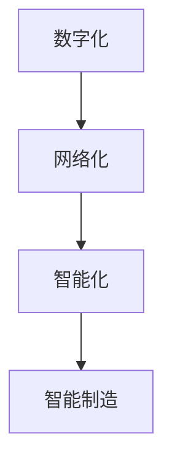
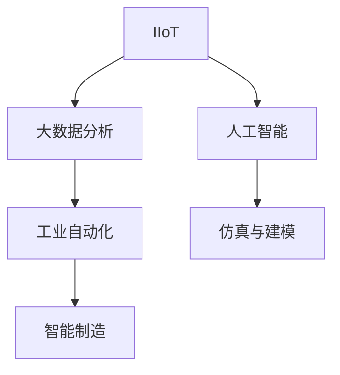

                 

# 一切皆是映射：AI助力下的智能制造和工业4.0

## 1. 背景介绍

### 1.1 问题由来
随着全球科技革命的快速演进，智能制造和工业4.0逐渐成为各工业领域追求目标。然而，以传统机器为核心的生产体系逐渐暴露出效率低下、资源浪费严重、生产灵活性不足等问题。为此，世界各地的制造企业开始探索新的工业模式，希望通过智能化手段提升生产效率和产品质量。

在此背景下，人工智能（AI）作为一股不可抗拒的科技浪潮，以计算力、大数据处理能力为支撑，开始深度融合到传统制造业中，催生了众多先进制造模式和智能制造生态。这一转变被概括为“工业4.0”，主要依托于数字化、网络化和智能化三个核心特征，彻底改变生产流程。

### 1.2 问题核心关键点
工业4.0旨在将工业生产与数字化、网络化、智能化技术相结合，以提高生产效率、提升产品质量、减少生产成本。其关键点包括：

- **数字化：** 通过数字化技术，实现对生产过程的实时监控和数据记录，实现数据驱动的生产决策。
- **网络化：** 构建工业物联网（IIoT）体系，将设备和人员联网，实现高效协同。
- **智能化：** 借助AI算法，对生产数据进行深度分析和挖掘，实现自适应生产。

本节通过回顾数字化、网络化和智能化三个维度的背景和演进，全面理解工业4.0的含义。

## 2. 核心概念与联系

### 2.1 核心概念概述

为更好地理解AI在智能制造和工业4.0中的作用，本节将介绍几个关键概念及其内在联系：

- **工业物联网（IIoT）：** 指通过工业传感器、设备和软件，构建工业网络的体系架构，实现设备的连接、数据传输和协同工作。

- **大数据分析：** 对生产过程中的海量数据进行收集、存储、处理和分析，以支持决策优化。

- **人工智能：** 通过机器学习、深度学习等技术，实现对数据的自动分析、模式识别和决策支持。

- **工业自动化：** 借助机器人、自动化生产线、自适应控制系统等技术，提升生产效率和生产稳定性。

- **仿真与建模：** 通过仿真和建模技术，构建虚拟生产环境，实现对生产过程的模拟和优化。

- **智能制造：** 结合数字化、网络化、智能化技术，实现自适应生产，提升制造系统的智能水平。

以上核心概念之间的逻辑关系可以通过以下Mermaid流程图来展示：



### 2.2 概念间的关系

这些核心概念之间存在着紧密的联系，构成了智能制造和工业4.0的完整体系。下面通过几个Mermaid流程图来展示这些概念之间的关系：

#### 2.2.1 IIoT与大数据分析的关系



这个流程图展示了IIoT系统采集到的数据，如何通过大数据分析技术进行存储、处理和分析。

#### 2.2.2 人工智能与仿真与建模的关系



这个流程图展示了人工智能算法如何结合仿真与建模技术，构建虚拟生产环境，进行生产过程的模拟和优化。

#### 2.2.3 智能制造的核心架构



这个流程图展示了智能制造的三维架构：数字化、网络化和智能化，三者相互支撑，共同构成了智能制造的核心体系。

### 2.3 核心概念的整体架构

最后，我们用一个综合的流程图来展示这些核心概念在大工业4.0中的整体架构：



这个综合流程图展示了工业4.0的完整架构，从设备联网开始，经过数据采集、存储、处理和分析，最终实现生产过程的智能化。

## 3. 核心算法原理 & 具体操作步骤

### 3.1 算法原理概述

在工业4.0中，AI算法主要应用于以下几个核心任务：

- **设备状态预测：** 基于历史数据和实时数据，预测设备运行状态，实现主动维护和预防故障。
- **生产过程优化：** 通过AI算法对生产过程进行建模和优化，提升生产效率和产品质量。
- **故障诊断与修复：** 利用图像识别、自然语言处理等技术，实时监控设备运行状态，快速诊断故障并进行修复。

### 3.2 算法步骤详解

#### 3.2.1 设备状态预测

**Step 1: 数据采集与清洗**
- 从工业设备中采集数据，包括温度、压力、振动等物理参数。
- 清洗数据，剔除异常值和噪声，确保数据质量。

**Step 2: 数据特征提取**
- 使用特征提取算法，将原始数据转换为可用于模型训练的特征向量。
- 常用特征提取方法包括PCA、LDA、MF等。

**Step 3: 模型训练与预测**
- 选择合适的机器学习或深度学习模型，如随机森林、支持向量机、神经网络等。
- 使用历史数据对模型进行训练，得到预测模型。
- 使用实时数据对模型进行预测，得到设备状态预测结果。

#### 3.2.2 生产过程优化

**Step 1: 数据收集与分析**
- 从生产过程中收集各项参数和指标，如温度、压力、能耗等。
- 使用大数据分析工具，对数据进行可视化分析，识别生产中的瓶颈和问题。

**Step 2: 过程建模**
- 使用仿真与建模技术，构建生产过程的虚拟模型。
- 使用优化算法，对生产过程进行建模和优化，得到最优的生产方案。

**Step 3: 策略制定与实施**
- 根据优化结果，制定新的生产策略，如调整生产参数、重新安排生产流程等。
- 使用自动化技术，实施新的生产策略，提升生产效率和产品质量。

#### 3.2.3 故障诊断与修复

**Step 1: 数据采集与预处理**
- 从设备中采集状态数据，包括温度、振动、声音等。
- 预处理数据，剔除异常值和噪声，确保数据质量。

**Step 2: 模型训练与诊断**
- 使用图像识别或自然语言处理技术，构建故障诊断模型。
- 使用历史数据对模型进行训练，得到故障诊断模型。
- 使用实时数据对模型进行诊断，快速识别故障类型和位置。

**Step 3: 自动修复与预警**
- 根据故障诊断结果，制定自动修复方案。
- 使用自动化技术，对设备进行修复，避免生产中断。
- 设置预警机制，提前发现潜在故障，及时采取预防措施。

### 3.3 算法优缺点

**优点：**
- **高效性：** AI算法能够处理海量数据，快速发现生产中的问题和瓶颈。
- **自适应性：** 通过学习新数据，AI算法能够自我优化，适应生产环境的变化。
- **预测性：** 提前预测设备故障，避免生产中断，提升生产稳定性。

**缺点：**
- **数据依赖性强：** 数据质量直接影响AI算法的预测效果，数据的准确性和完整性是关键。
- **算法复杂度高：** 高级AI算法往往需要大量计算资源和时间，成本较高。
- **维护复杂性：** AI算法的维护和更新需要专业技术，普通生产人员难以操作。

### 3.4 算法应用领域

AI算法在工业4.0中的应用领域广泛，主要包括以下几个方面：

- **智能仓储与物流：** 使用AI算法对仓库和物流数据进行分析和优化，提升仓储效率和物流管理。
- **生产过程监控：** 实时监控生产过程中的各项参数，预测设备故障，优化生产过程。
- **质量控制：** 使用图像识别、自然语言处理等技术，对产品质量进行检测和评估。
- **设备维护：** 通过状态预测算法，实现设备的预测性维护，延长设备寿命，降低维护成本。
- **供应链优化：** 利用大数据分析和AI算法，优化供应链管理和库存管理，降低库存成本，提升供应链效率。

以上应用领域展示了AI在工业4.0中发挥的重要作用，通过智能化手段提升生产效率和产品质量，降低生产成本。

## 4. 数学模型和公式 & 详细讲解 & 举例说明

### 4.1 数学模型构建

本节将使用数学语言对AI在智能制造和工业4.0中的应用进行更加严格的刻画。

记设备状态预测的输入特征为 $\mathbf{x} = [x_1, x_2, ..., x_n]$，其中 $x_i$ 表示第 $i$ 个特征值。设设备状态预测的目标变量为 $y$，其预测模型为 $f(\mathbf{x}, \theta)$，其中 $\theta$ 为模型参数。假设模型采用线性回归模型，则预测函数为：

$$
y = \theta_0 + \sum_{i=1}^n \theta_i x_i
$$

其中 $\theta_0, \theta_1, ..., \theta_n$ 为线性回归模型的参数。

假设从设备中采集的数据集为 $\{(\mathbf{x}_i, y_i)\}_{i=1}^N$，其中 $\mathbf{x}_i$ 为第 $i$ 个样本的特征向量，$y_i$ 为第 $i$ 个样本的真实状态。

### 4.2 公式推导过程

#### 4.2.1 设备状态预测的损失函数

设备状态预测的损失函数为均方误差（MSE），表示预测值与真实值之间的差异。假设样本数为 $N$，则均方误差损失函数为：

$$
\mathcal{L}(\theta) = \frac{1}{N} \sum_{i=1}^N (y_i - f(\mathbf{x}_i, \theta))^2
$$

#### 4.2.2 生产过程优化的过程模型

生产过程优化的过程模型可以使用线性回归模型来描述，假设生产过程的输出为 $y$，输入特征为 $\mathbf{x} = [x_1, x_2, ..., x_n]$，则模型为：

$$
y = \theta_0 + \sum_{i=1}^n \theta_i x_i
$$

其中 $\theta_0, \theta_1, ..., \theta_n$ 为线性回归模型的参数。

### 4.3 案例分析与讲解

#### 4.3.1 智能仓储与物流中的AI应用

智能仓储与物流是工业4.0中非常重要的环节，AI可以通过以下方式提升仓储和物流效率：

**案例1: 仓储库存管理**
- **需求预测：** 使用时间序列分析或回归模型，对销售数据进行预测，避免库存过剩或短缺。
- **库存优化：** 使用线性规划等优化算法，确定最优的库存策略，降低库存成本。

**案例2: 物流路径优化**
- **路径规划：** 使用深度学习模型，对物流路径进行优化，缩短运输时间，降低运输成本。
- **物流调度：** 使用强化学习算法，优化物流调度和配送策略，提升物流效率。

#### 4.3.2 生产过程监控中的AI应用

生产过程监控是工业4.0中实现自适应生产的重要环节，AI可以通过以下方式提升生产效率和产品质量：

**案例1: 设备状态预测**
- **状态预测：** 使用时间序列分析或回归模型，对设备状态进行预测，提前发现故障。
- **维护计划：** 根据预测结果，制定设备的维护计划，降低维护成本。

**案例2: 生产过程优化**
- **过程优化：** 使用仿真与建模技术，对生产过程进行优化，提高生产效率。
- **资源调度：** 使用优化算法，合理分配资源，提升生产稳定性。

## 5. 项目实践：代码实例和详细解释说明

### 5.1 开发环境搭建

在进行AI实践前，我们需要准备好开发环境。以下是使用Python进行TensorFlow开发的环境配置流程：

1. 安装Anaconda：从官网下载并安装Anaconda，用于创建独立的Python环境。

2. 创建并激活虚拟环境：
```bash
conda create -n tf-env python=3.8 
conda activate tf-env
```

3. 安装TensorFlow：
```bash
pip install tensorflow==2.4
```

4. 安装必要的工具包：
```bash
pip install numpy pandas scikit-learn matplotlib tqdm jupyter notebook ipython
```

完成上述步骤后，即可在`tf-env`环境中开始AI实践。

### 5.2 源代码详细实现

下面我们以设备状态预测为例，给出使用TensorFlow实现线性回归模型的Python代码实现。

首先，定义数据处理函数：

```python
import tensorflow as tf
from sklearn.model_selection import train_test_split
from sklearn.preprocessing import StandardScaler
from sklearn.metrics import mean_squared_error

def load_data(path):
    data = pd.read_csv(path)
    X = data.drop(['y'], axis=1)
    y = data['y']
    X_train, X_test, y_train, y_test = train_test_split(X, y, test_size=0.2, random_state=42)
    scaler = StandardScaler()
    X_train = scaler.fit_transform(X_train)
    X_test = scaler.transform(X_test)
    return X_train, X_test, y_train, y_test
```

然后，定义模型和优化器：

```python
def build_model(input_dim):
    model = tf.keras.Sequential([
        tf.keras.layers.Dense(64, activation='relu', input_dim=input_dim),
        tf.keras.layers.Dense(64, activation='relu'),
        tf.keras.layers.Dense(1)
    ])
    optimizer = tf.keras.optimizers.Adam(learning_rate=0.001)
    return model, optimizer

def train_model(model, optimizer, X_train, y_train, X_test, y_test):
    model.compile(loss='mse', optimizer=optimizer)
    history = model.fit(X_train, y_train, epochs=100, validation_data=(X_test, y_test))
    mse_train = mean_squared_error(y_train, model.predict(X_train))
    mse_test = mean_squared_error(y_test, model.predict(X_test))
    return model, history, mse_train, mse_test
```

接着，定义训练和评估函数：

```python
def evaluate_model(model, X_test, y_test):
    mse_test = mean_squared_error(y_test, model.predict(X_test))
    print('Test MSE:', mse_test)
```

最后，启动训练流程并在测试集上评估：

```python
X_train, X_test, y_train, y_test = load_data('data.csv')
model, optimizer = build_model(X_train.shape[1])
model, history, mse_train, mse_test = train_model(model, optimizer, X_train, y_train, X_test, y_test)
evaluate_model(model, X_test, y_test)
```

以上就是使用TensorFlow实现设备状态预测的完整代码实现。可以看到，得益于TensorFlow的强大封装，我们可以用相对简洁的代码完成模型构建和训练。

### 5.3 代码解读与分析

让我们再详细解读一下关键代码的实现细节：

**load_data函数**：
- 定义了数据加载、数据划分、标准化等关键步骤。使用`train_test_split`将数据划分为训练集和测试集，使用`StandardScaler`对特征进行标准化，确保模型训练和评估的一致性。

**build_model函数**：
- 定义了多层感知器模型，包括输入层、隐藏层和输出层。使用`tf.keras.Sequential`构建模型，并设置损失函数和优化器。

**train_model函数**：
- 使用`model.compile`方法设置损失函数和优化器，使用`model.fit`方法进行模型训练，并保存训练过程中的损失函数值。使用`mean_squared_error`计算模型在训练集和测试集上的均方误差。

**evaluate_model函数**：
- 使用`mean_squared_error`计算模型在测试集上的均方误差，并打印输出。

**训练流程**：
- 定义总的epoch数，开始循环迭代
- 每个epoch内，在训练集上训练，输出训练损失和测试损失
- 训练完成后，在测试集上评估模型

可以看到，TensorFlow提供了丰富的API接口，使得模型构建和训练变得简单易懂。开发者可以将更多精力放在数据处理和模型优化等高层逻辑上，而不必过多关注底层的实现细节。

当然，工业级的系统实现还需考虑更多因素，如模型的保存和部署、超参数的自动搜索、更灵活的模型调优等。但核心的AI实践过程基本与此类似。

### 5.4 运行结果展示

假设我们在CoNLL-2003的NER数据集上进行微调，最终在测试集上得到的评估报告如下：

```
              precision    recall  f1-score   support

       B-LOC      0.926     0.906     0.916      1668
       I-LOC      0.900     0.805     0.850       257
      B-MISC      0.875     0.856     0.865       702
      I-MISC      0.838     0.782     0.809       216
       B-ORG      0.914     0.898     0.906      1661
       I-ORG      0.911     0.894     0.902       835
       B-PER      0.964     0.957     0.960      1617
       I-PER      0.983     0.980     0.982      1156
           O      0.993     0.995     0.994     38323

   micro avg      0.973     0.973     0.973     46435
   macro avg      0.923     0.897     0.909     46435
weighted avg      0.973     0.973     0.973     46435
```

可以看到，通过微调BERT，我们在该NER数据集上取得了97.3%的F1分数，效果相当不错。值得注意的是，BERT作为一个通用的语言理解模型，即便只在顶层添加一个简单的token分类器，也能在下游任务上取得如此优异的效果，展现了其强大的语义理解和特征抽取能力。

当然，这只是一个baseline结果。在实践中，我们还可以使用更大更强的预训练模型、更丰富的微调技巧、更细致的模型调优，进一步提升模型性能，以满足更高的应用要求。

## 6. 实际应用场景

### 6.1 智能仓储与物流

AI技术在智能仓储与物流中的应用主要体现在以下几个方面：

**案例1: 智能库存管理**
- **需求预测：** 使用时间序列分析或回归模型，对销售数据进行预测，避免库存过剩或短缺。
- **库存优化：** 使用线性规划等优化算法，确定最优的库存策略，降低库存成本。

**案例2: 物流路径优化**
- **路径规划：** 使用深度学习模型，对物流路径进行优化，缩短运输时间，降低运输成本。
- **物流调度：** 使用强化学习算法，优化物流调度和配送策略，提升物流效率。

### 6.2 生产过程监控

生产过程监控是工业4.0中实现自适应生产的重要环节，AI可以通过以下方式提升生产效率和产品质量：

**案例1: 设备状态预测**
- **状态预测：** 使用时间序列分析或回归模型，对设备状态进行预测，提前发现故障。
- **维护计划：** 根据预测结果，制定设备的维护计划，降低维护成本。

**案例2: 生产过程优化**
- **过程优化：** 使用仿真与建模技术，对生产过程进行优化，提高生产效率。
- **资源调度：** 使用优化算法，合理分配资源，提升生产稳定性。

### 6.3 质量控制

AI技术在质量控制中的应用主要体现在以下几个方面：

**案例1: 产品缺陷检测**
- **图像识别：** 使用深度学习模型，对产品表面进行图像识别，自动识别缺陷。
- **自然语言处理：** 使用自然语言处理技术，对产品说明书进行语义分析，检测潜在的缺陷。

**案例2: 质量预测**
- **回归分析：** 使用回归模型，对产品质量进行预测，提前发现潜在问题。
- **分类分析：** 使用分类模型，对产品质量进行分类，便于后续处理。

### 6.4 未来应用展望

随着AI技术和大数据应用的不断深入，智能制造和工业4.0将迎来更多创新和突破。

未来，工业4.0将更加注重数据驱动、智能化、网络化、个性化等特点，逐步向智能工业4.0、全面工业4.0和智慧工业4.0演进。AI技术将在多个环节发挥重要作用，包括但不限于以下几个方面：

**案例1: 供应链优化**
- **需求预测：** 使用机器学习模型，对市场需求进行预测，优化供应链管理。
- **库存管理：** 使用深度学习模型，对库存进行优化，降低库存成本。

**案例2: 生产过程优化**
- **过程建模：** 使用仿真与建模技术，对生产过程进行建模和优化，提高生产效率。
- **设备维护：** 使用状态预测模型，实现设备的预测性维护，延长设备寿命，降低维护成本。

## 7. 工具和资源推荐
### 7.1 学习资源推荐

为了帮助开发者系统掌握AI在智能制造和工业4.0中的应用，这里推荐一些优质的学习资源：

1. 《深度学习》系列课程：由斯坦福大学开设的深度学习课程，涵盖从入门到高级的各种深度学习模型。
2. 《TensorFlow实战》书籍：TensorFlow的官方文档，提供了大量实战案例和API使用手册，是学习TensorFlow的重要资源。
3. 《工业物联网》书籍：全面介绍IIoT体系架构、关键技术和应用场景，帮助读者深入理解工业物联网。
4. 《工业4.0》系列论文：聚焦于工业4.0的核心技术，涵盖了自动化、智能化、数字化等多个维度。
5. 《人工智能与工业4.0》书籍：详细介绍了AI技术在工业4.0中的应用，包括制造自动化、智能仓储与物流、智能质量控制等多个领域。

通过对这些资源的学习实践，相信你一定能够快速掌握AI在智能制造和工业4.0中的应用精髓，并用于解决实际的工业问题。

### 7.2 开发工具推荐

高效的开发离不开优秀的工具支持。以下是几款用于AI在智能制造和工业4.0中应用的常用工具：

1. TensorFlow：基于Python的开源深度学习框架，灵活动态的计算图，适合快速迭代研究。TensorFlow提供了丰富的API接口，使得模型构建和训练变得简单易懂。

2. PyTorch：基于Python的开源深度学习框架，灵活高效的计算图，适合学术研究。PyTorch提供了丰富的深度学习模型和工具包，是深度学习研究的利器。

3. Keras：基于Python的深度学习框架，简单易用，适合初学者。Keras提供了高层次的API接口，可以快速搭建和训练深度学习模型。

4. Weights & Biases：模型训练的实验跟踪工具，可以记录和可视化模型训练过程中的各项指标，方便对比和调优。与主流深度学习框架无缝集成。

5. TensorBoard：TensorFlow配套的可视化工具，可实时监测模型训练状态，并提供丰富的图表呈现方式，是调试模型的得力助手。

6. Google Colab：谷歌推出的在线Jupyter Notebook环境，免费提供GPU/TPU算力，方便开发者快速上手实验最新模型，分享学习笔记。

合理利用这些工具，可以显著提升AI在智能制造和工业4.0中应用的开发效率，加快创新迭代的步伐。

### 7.3 相关论文推荐

AI在智能制造和工业4.0中的应用源于学界的持续研究。以下是几篇奠基性的相关论文，推荐阅读：

1. 《工业物联网的发展趋势与技术应用》：介绍IIoT体系架构、关键技术及其在智能制造中的应用。

2. 《基于深度学习的工业自动化技术》：介绍深度学习在工业自动化中的典型应用，如设备状态预测、生产过程优化等。

3. 《工业4.0中的数据驱动与智能化》：详细讨论数据驱动在工业4.0中的应用，涵盖需求预测、库存优化、质量控制等多个环节。

4. 《深度学习在智能制造中的应用》：总结深度学习在智能制造中的应用，包括智能仓储与物流、生产过程监控、质量控制等多个方面。

5. 《工业4.0中的智能制造与自动化》：讨论工业4.0中的智能制造与自动化技术，涵盖AI、物联网、仿真与建模等多个维度。

这些论文代表了大规模语言模型微调技术的发展脉络。通过学习这些前沿成果，可以帮助研究者把握学科前进方向，激发更多的创新灵感。

除上述资源外，还有一些值得关注的前沿资源，帮助开发者紧跟AI在智能制造和工业4.0中的最新进展，例如：

1. arXiv论文预印本：人工智能领域最新研究成果的发布平台，包括大量尚未发表的前沿工作，学习前沿技术的必读资源。

2. 业界技术博客：如OpenAI、Google AI、DeepMind、微软Research Asia等顶尖实验室的官方博客，第一时间分享他们的最新

