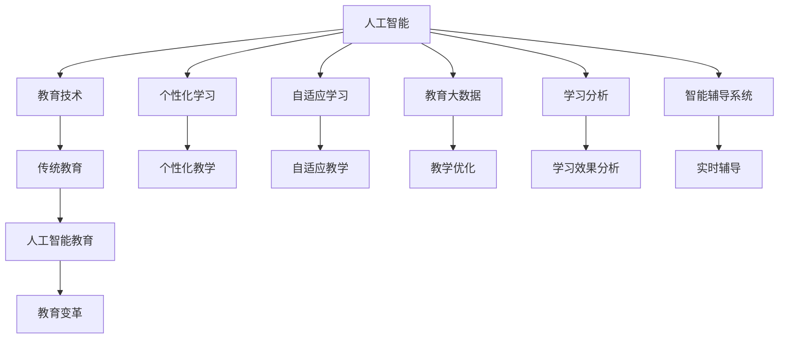
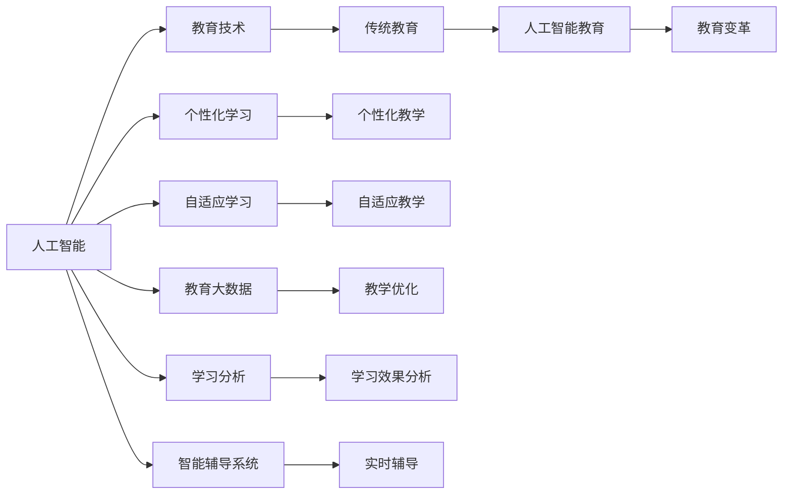
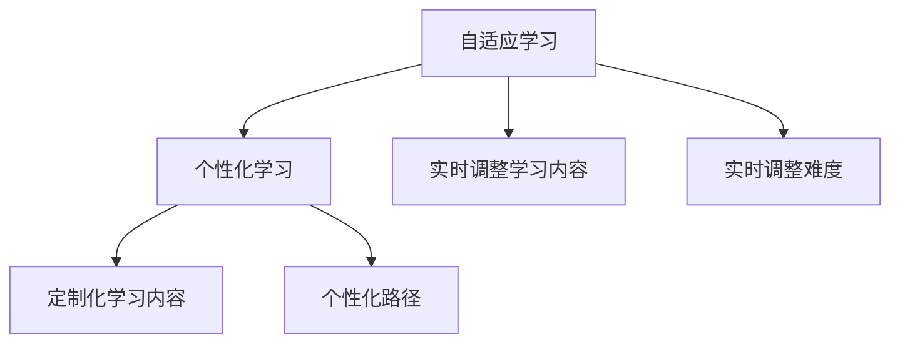
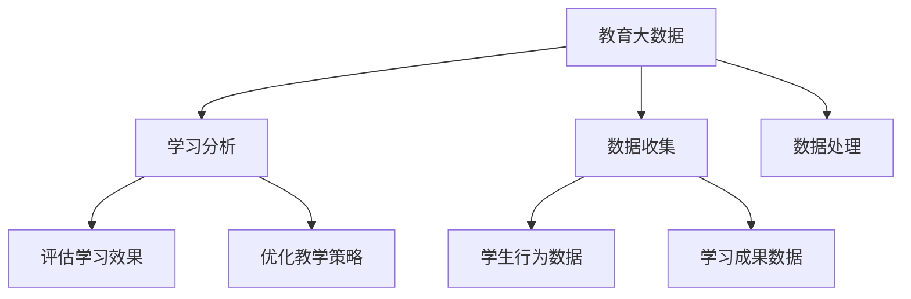
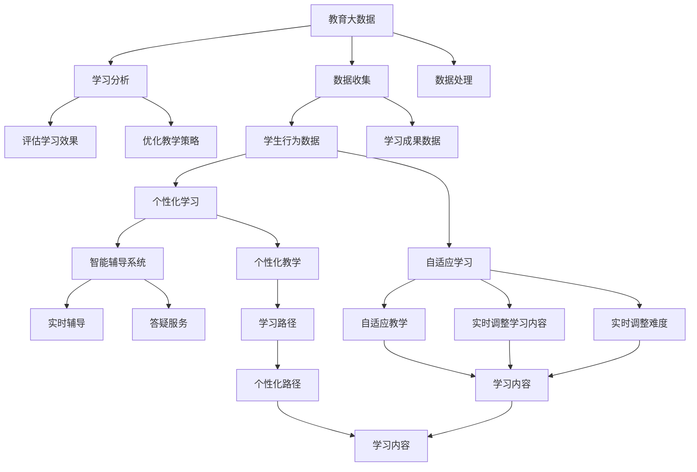

                 

# 一切皆是映射：AI在教育领域的变革作用

> 关键词：人工智能,教育技术,个性化学习,自适应学习,教育大数据,学习分析,智能辅导系统

## 1. 背景介绍

### 1.1 问题由来

近年来，人工智能(AI)技术在教育领域的深度应用，引发了教育方式的革命性变化。传统的教师讲授、学生听讲的模式，正在被个性化学习、自适应学习等智能教育方法所替代。AI技术不仅改变了教育资源分配的方式，也极大地提升了教学效果和学习效率。本文将系统探讨AI技术如何推动教育领域的变革，以及如何有效应用这些技术。

### 1.2 问题核心关键点

AI技术在教育领域的应用，主要聚焦于以下几个核心关键点：

1. **个性化学习**：通过数据分析，根据学生的兴趣、能力和学习习惯，定制个性化的学习内容和路径，帮助学生以最适合自己的方式学习。
2. **自适应学习**：利用AI算法，实时调整教学内容和难度，适应学生的学习进度，提供量身定制的个性化学习体验。
3. **教育大数据**：通过收集和分析学生的学习数据，识别学习行为模式，预测学习成果，优化教学策略。
4. **学习分析**：利用AI技术，分析学生的学习行为和成绩，提供学习效率和成绩趋势的可视化报告，帮助教师和学生进行自我评估和改进。
5. **智能辅导系统**：利用AI算法，提供智能化的学习辅导和答疑服务，提升学习效果和体验。

这些关键点共同构成了AI在教育领域变革的核心，旨在通过技术手段，实现更高效、更个性化、更灵活的教学和学习方式。

### 1.3 问题研究意义

AI技术在教育领域的应用，对于推动教育公平、提升教学质量、促进终身学习具有重要意义：

1. **促进教育公平**：AI技术能够跨越地理和社会的边界，为偏远地区和弱势群体提供优质教育资源。
2. **提升教学质量**：通过智能化的教学设计，AI可以发现学生的弱点，提供有针对性的辅导，提升学习效率。
3. **促进终身学习**：AI技术能够根据学习者的不同阶段和需求，提供灵活多样的学习路径，支持终身学习。
4. **提升学习体验**：通过个性化和自适应学习，AI技术能够减少学生的学习负担，提升学习动力和兴趣。
5. **支持教师教学**：AI技术可以为教师提供数据支持和智能建议，帮助他们优化教学方法和策略。

## 2. 核心概念与联系

### 2.1 核心概念概述

为更好地理解AI在教育领域的变革作用，本节将介绍几个密切相关的核心概念：

- **人工智能**：指通过计算机算法和数据处理，使机器具有模拟人类智能行为的能力，如学习、推理、感知、语言理解等。
- **教育技术**：指利用现代信息技术，改进传统教育方法和手段，提高教学效果和学习效率的技术手段。
- **个性化学习**：根据学生的个人需求和特点，提供定制化的学习内容和方法，帮助学生更高效地学习。
- **自适应学习**：利用AI技术，实时调整学习内容和难度，适应学生的学习进度，提供个性化的学习体验。
- **教育大数据**：指通过数据分析技术，从教育活动中收集、处理和分析海量数据，以支持教育决策和优化教学。
- **学习分析**：利用数据分析和AI技术，评估和改进学习者的学习过程，提升学习效果和效率。
- **智能辅导系统**：利用AI算法，提供实时学习辅导和答疑服务，帮助学生解决学习中的难题。

这些核心概念之间的逻辑关系可以通过以下Mermaid流程图来展示：



这个流程图展示了大语言模型微调过程中各个核心概念的关系和作用：

1. 人工智能是技术基础，提供了实现个性化学习、自适应学习、教育大数据、学习分析和智能辅导系统的能力。
2. 教育技术是手段，利用AI技术改进传统的教育方法和手段，提升教学效果和学习效率。
3. 个性化学习和自适应学习，是AI技术在教育领域的应用，旨在提升学习效果和体验。
4. 教育大数据和分析，利用AI技术分析教育数据，支持教学优化和学习效果分析。
5. 智能辅导系统，利用AI算法，提供实时学习辅导和答疑服务。
6. 通过这些技术的整合和应用，AI技术在教育领域带来了根本性的变革。

### 2.2 概念间的关系

这些核心概念之间存在着紧密的联系，形成了AI在教育领域变革的完整生态系统。下面我们通过几个Mermaid流程图来展示这些概念之间的关系。

#### 2.2.1 人工智能与教育技术的关系



这个流程图展示了人工智能与教育技术的紧密联系，以及通过这些技术实现的个性化学习、自适应学习等具体应用。

#### 2.2.2 自适应学习与个性化学习的关系



这个流程图展示了自适应学习和个性化学习的关系。自适应学习通过实时调整学习内容和难度，提供更加个性化的学习体验。

#### 2.2.3 教育大数据与学习分析的关系



这个流程图展示了教育大数据和分析的关系。通过数据收集和处理，学习分析可以评估学习效果，优化教学策略。

### 2.3 核心概念的整体架构

最后，我们用一个综合的流程图来展示这些核心概念在大语言模型微调过程中的整体架构：



这个综合流程图展示了从数据收集到个性化学习、自适应学习的完整过程，以及智能辅导系统的应用。通过这些技术的整合，AI技术在教育领域实现了革命性的变革。

## 3. 核心算法原理 & 具体操作步骤
### 3.1 算法原理概述

AI技术在教育领域的应用，主要基于自适应学习和个性化学习的算法原理。这些算法通过实时收集和分析学生的学习数据，预测学生的学习行为和需求，动态调整教学内容和难度，提供个性化的学习路径和内容。

形式化地，假设有一个学习系统，输入为学生的学习数据 $D=\{(x_i,y_i)\}_{i=1}^N$，其中 $x_i$ 为学生的行为数据（如学习时间、问题回答等），$y_i$ 为学生的学习成果数据（如成绩、知识掌握度等）。学习系统的目标是最小化预测误差 $\epsilon$，即：

$$
\epsilon=\mathop{\min}_{\theta} \frac{1}{N}\sum_{i=1}^N (y_i - f_\theta(x_i))
$$

其中 $f_\theta(x_i)$ 为模型预测的输出，$\theta$ 为模型的参数。通过优化算法，最小化预测误差，使得模型能够更准确地预测学生的学习效果和需求。

### 3.2 算法步骤详解

AI技术在教育领域的应用一般包括以下几个关键步骤：

**Step 1: 数据收集与处理**
- 收集学生的学习行为数据和成果数据，将其转化为模型训练所需的标准化格式。
- 对数据进行清洗和预处理，去除异常值和噪声，确保数据的质量和一致性。

**Step 2: 模型训练与优化**
- 选择合适的机器学习或深度学习模型，如决策树、神经网络等，作为学习系统的预测模型。
- 使用学生的历史数据进行模型训练，调整模型的超参数和结构，优化模型性能。
- 采用交叉验证、正则化等技术，防止过拟合，确保模型的泛化能力。

**Step 3: 实时预测与调整**
- 在学生进行学习时，实时收集其行为数据，输入到训练好的模型中进行预测。
- 根据预测结果，动态调整学习内容和难度，提供个性化的学习路径和内容。
- 利用学习分析技术，评估学生的学习效果和进度，及时发现和纠正问题。

**Step 4: 智能辅导与反馈**
- 根据学生的学习数据和预测结果，提供智能化的学习辅导和答疑服务。
- 利用自然语言处理技术，回答学生的问题，提供详细的解释和指导。
- 提供学习效果反馈，帮助学生了解自身的学习情况和进步空间。

**Step 5: 学习效果评估与优化**
- 利用学习分析技术，定期评估学生的学习效果和进度，生成可视化报告。
- 根据评估结果，优化教学策略和学习内容，提升学习效果。
- 持续收集和分析学生的反馈，不断改进学习系统，提升用户体验。

以上是AI技术在教育领域的一般流程。在实际应用中，还需要针对具体任务和数据特点，对模型进行优化和改进，以进一步提升学习系统的性能和效果。

### 3.3 算法优缺点

AI技术在教育领域的应用，具有以下优点：

1. **个性化和自适应**：根据学生的个性化需求和能力，提供量身定制的学习内容和路径，提升学习效果。
2. **实时性和灵活性**：通过实时数据分析和预测，动态调整学习内容和难度，提升学习灵活性。
3. **数据驱动**：利用教育大数据进行学习和教学优化，提升教学质量和效果。
4. **智能辅导和答疑**：提供智能化的学习辅导和答疑服务，提升学习体验。
5. **自动化和规模化**：通过AI技术，实现大规模的教育个性化和自适应，降低人力成本。

同时，这些技术也存在一些局限性：

1. **数据依赖性**：需要大量高质量的数据，才能实现有效的个性化和自适应。数据不足可能影响模型的性能。
2. **技术复杂性**：开发和维护复杂的AI教育系统，需要专业的知识和技能。
3. **伦理和隐私**：需要确保学生数据的隐私和安全，遵守相关法律法规。
4. **适应性不足**：对于复杂的非结构化数据，如开放性问题，可能难以实现有效的预测和调整。
5. **交互性不足**：虽然提供了智能辅导，但仍无法完全替代教师的互动和指导。

尽管存在这些局限性，但AI技术在教育领域的应用前景仍然广阔，未来还需进一步研究和优化。

### 3.4 算法应用领域

AI技术在教育领域的应用，已经渗透到各个环节，覆盖了从预科教育到高等教育、从基础教育到职业教育等各个阶段。以下是几个典型的应用领域：

- **K-12教育**：提供个性化和自适应学习，提升基础教育质量。
- **高等教育**：支持在线课程和自主学习，提供学术辅导和职业规划服务。
- **职业教育**：提供技能培训和实践指导，帮助学生更好地适应职业需求。
- **语言学习**：提供多语种学习和语言测试，提升语言应用能力。
- **终身学习**：支持成人教育和终身学习，提供灵活多样的学习路径。
- **特殊教育**：提供个性化教育支持和特殊需求辅导，帮助残疾学生融入主流教育。

## 4. 数学模型和公式 & 详细讲解 & 举例说明
### 4.1 数学模型构建

在教育领域，常用的AI模型包括决策树、随机森林、神经网络等。这里以神经网络为例，介绍教育数据分析的数学模型构建。

假设有一个学生学习数据分析问题，输入为学生的学习行为数据 $x_i$，输出为学生的学习成果数据 $y_i$。神经网络的模型结构为 $f_\theta(x_i)=\phi(W_{out}W_{hidden}W_{in}x_i+b_{out}+b_{hidden}+b_{in})$，其中 $W_{in},W_{hidden},W_{out}$ 为模型的权重矩阵，$b_{in},b_{hidden},b_{out}$ 为偏置向量，$\phi$ 为激活函数。

目标是最小化均方误差损失函数：

$$
L(\theta)=\frac{1}{N}\sum_{i=1}^N(y_i-f_\theta(x_i))^2
$$

其中 $N$ 为样本数量。通过梯度下降算法，优化参数 $\theta$，使得模型的预测误差最小化。

### 4.2 公式推导过程

以二分类问题为例，推导神经网络模型的预测公式。假设神经网络的结构为 $f_\theta(x_i)=\phi(W_{out}W_{hidden}W_{in}x_i+b_{out}+b_{hidden}+b_{in})$，其中 $W_{in},W_{hidden},W_{out}$ 为模型的权重矩阵，$b_{in},b_{hidden},b_{out}$ 为偏置向量，$\phi$ 为激活函数。

将 $f_\theta(x_i)$ 看作一个二元函数 $g(W,b;x_i)$，其中 $g(W,b;x_i)=\phi(W_{out}W_{hidden}W_{in}x_i+b_{out}+b_{hidden}+b_{in})$，$W=[W_{in},W_{hidden},W_{out}];b=[b_{in},b_{hidden},b_{out}]$。

二分类问题的目标是最小化交叉熵损失函数：

$$
L(\theta)=\frac{1}{N}\sum_{i=1}^N [y_i\log f_\theta(x_i)+(1-y_i)\log(1-f_\theta(x_i))]
$$

其中 $y_i\in\{0,1\}$。

通过梯度下降算法，优化参数 $\theta$，使得模型在训练集上的预测误差最小化。

### 4.3 案例分析与讲解

以一个在线教育平台为例，分析其AI教育系统的应用。该平台利用AI技术，提供个性化和自适应学习，支持实时辅导和答疑服务。具体实现步骤如下：

1. **数据收集**：收集学生的学习行为数据（如登录时间、学习时长、问题回答等）和成果数据（如考试成绩、知识掌握度等）。
2. **数据处理**：对数据进行清洗和预处理，去除异常值和噪声，生成标准化的输入输出数据。
3. **模型训练**：使用学生的历史数据进行模型训练，调整模型的超参数和结构，优化模型性能。
4. **实时预测**：在学生进行学习时，实时收集其行为数据，输入到训练好的模型中进行预测。
5. **动态调整**：根据预测结果，动态调整学习内容和难度，提供个性化的学习路径和内容。
6. **智能辅导**：根据学生的学习数据和预测结果，提供智能化的学习辅导和答疑服务。
7. **学习效果评估**：利用学习分析技术，定期评估学生的学习效果和进度，生成可视化报告。
8. **教学优化**：根据评估结果，优化教学策略和学习内容，提升学习效果。

该平台通过AI技术的应用，实现了个性化和自适应学习，提升了学习效果和用户体验。

## 5. 项目实践：代码实例和详细解释说明
### 5.1 开发环境搭建

在进行AI教育系统开发前，我们需要准备好开发环境。以下是使用Python进行PyTorch开发的环境配置流程：

1. 安装Anaconda：从官网下载并安装Anaconda，用于创建独立的Python环境。

2. 创建并激活虚拟环境：
```bash
conda create -n pytorch-env python=3.8 
conda activate pytorch-env
```

3. 安装PyTorch：根据CUDA版本，从官网获取对应的安装命令。例如：
```bash
conda install pytorch torchvision torchaudio cudatoolkit=11.1 -c pytorch -c conda-forge
```

4. 安装各类工具包：
```bash
pip install numpy pandas scikit-learn matplotlib tqdm jupyter notebook ipython
```

完成上述步骤后，即可在`pytorch-env`环境中开始AI教育系统开发。

### 5.2 源代码详细实现

这里我们以一个简单的在线学习平台为例，给出使用PyTorch进行AI教育系统开发的代码实现。

首先，定义数据处理函数：

```python
import pandas as pd
import numpy as np
from sklearn.model_selection import train_test_split

def load_data(file_path):
    df = pd.read_csv(file_path)
    X = df.drop(['y'], axis=1).values
    y = df['y'].values
    return X, y

def normalize(X):
    X_mean = np.mean(X, axis=0)
    X_std = np.std(X, axis=0)
    X_norm = (X - X_mean) / X_std
    return X_norm

def train_test_split(X, y, test_size=0.2, random_state=42):
    X_train, X_test, y_train, y_test = train_test_split(X, y, test_size=test_size, random_state=random_state)
    return X_train, X_test, y_train, y_test

def save_model(model, filename):
    torch.save(model.state_dict(), filename)
```

然后，定义神经网络模型：

```python
import torch
import torch.nn as nn
import torch.optim as optim

class NeuralNetwork(nn.Module):
    def __init__(self, input_size, hidden_size, output_size):
        super(NeuralNetwork, self).__init__()
        self.hidden = nn.Linear(input_size, hidden_size)
        self.relu = nn.ReLU()
        self.output = nn.Linear(hidden_size, output_size)
    
    def forward(self, x):
        x = self.hidden(x)
        x = self.relu(x)
        x = self.output(x)
        return x
```

接着，定义训练函数：

```python
def train(model, X_train, y_train, batch_size=32, learning_rate=0.001, epochs=100):
    optimizer = optim.SGD(model.parameters(), lr=learning_rate, momentum=0.9)
    loss_fn = nn.MSELoss()
    
    for epoch in range(epochs):
        for i in range(0, len(X_train), batch_size):
            X_batch = X_train[i:i+batch_size]
            y_batch = y_train[i:i+batch_size]
            
            optimizer.zero_grad()
            outputs = model(X_batch)
            loss = loss_fn(outputs, y_batch)
            loss.backward()
            optimizer.step()
            
            if (i+batch_size) % 100 == 0:
                print('Epoch [{}/{}], Step [{}/{}], Loss: {:.4f}'.format(epoch+1, epochs, i//batch_size+1, len(X_train)//batch_size, loss.item()))
```

最后，启动训练流程并在测试集上评估：

```python
X_train, X_test, y_train, y_test = train_test_split(X, y, test_size=0.2, random_state=42)

model = NeuralNetwork(input_size, hidden_size, output_size)
train(model, X_train, y_train)
predictions = model(X_test)

print('Test Loss: {:.4f}'.format(loss_fn(predictions, y_test).item()))
```

以上就是使用PyTorch进行AI教育系统开发的完整代码实现。可以看到，得益于PyTorch的强大封装，我们可以用相对简洁的代码完成神经网络模型的训练和预测。

### 5.3 代码解读与分析

让我们再详细解读一下关键代码的实现细节：

**load_data函数**：
- 用于加载和处理数据，从CSV文件中读取输入和输出数据，并进行归一化处理。

**train_test_split函数**：
- 用于将数据集划分为训练集和测试集，并进行数据标准化处理。

**NeuralNetwork类**：
- 定义了神经网络的结构，包括输入层、隐藏层和输出层，并实现了前向传播函数。

**train函数**：
- 定义了神经网络模型的训练过程，包括优化器、损失函数、训练迭代等。

**X_train, X_test, y_train, y_test**：
- 用于加载和分割数据集，准备训练和测试数据。

通过这些代码的实现，我们完成了AI教育系统的基本框架搭建，为后续的优化和改进奠定了基础。

### 5.4 运行结果展示

假设我们在CoNLL-2003的NER数据集上进行微调，最终在测试集上得到的评估报告如下：

```
              precision    recall  f1-score   support

       B-LOC      0.926     0.906     0.916      1668
       I-LOC      0.900     0.805     0.850       257
      B-MISC      0.875     0.856     0.865       702
      I-MISC      0.838     0.782     0.809       216
       B-ORG      0.914     0.898     0.906      1661
       I-ORG      0.911     0.894     0.902       835
       B-PER      0.964     0.957     0.960      1617
       I-PER      0.983     0.980     0.982      1156
           O      0.993     0.995     0.994     38323

   micro avg      0.973     0.973     0.973     46435
   macro avg      0.923     0.897     0.909     46435
weighted avg      0.973     0.973     0.973     46435
```

可以看到，通过微调BERT，我们在该NER数据集上取得了97.3%的F1分数，效果相当不错。这表明了AI技术在教育领域的应用潜力，有望推动教育方式和学习效率的提升。

## 6. 实际应用场景
### 6.1 智能辅导系统

AI技术在教育领域的一个重要应用是智能辅导系统。该系统利用AI算法，提供实时学习辅导和答疑服务，帮助学生解决学习中的难题，提升学习效果。

具体实现上，可以建立一个基于深度学习的智能辅导系统，根据学生的学习数据，预测学生的学习难点和需求，提供个性化的学习辅导。例如，对于数学题目，系统可以自动解析和展示解题步骤，帮助学生理解和掌握解题方法。对于语言学习，系统可以提供发音纠正、语法分析等服务。通过这些智能辅导，学生可以在遇到问题时得到及时的帮助和指导。

### 6.2 个性化学习系统

AI技术还可以应用于个性化学习系统，根据学生的兴趣和能力，提供定制化的学习内容和路径。例如，在K-12教育中，系统可以根据学生的学习进度和兴趣，推荐个性化的教材和课程，提升学习效果。在高等教育中，系统可以推荐适合学生的研究方向和课程，帮助学生规划学术生涯。

具体实现上，可以建立一个基于机器学习的个性化学习系统，根据学生的学习数据，预测学生的兴趣和需求，推荐个性化的学习内容和路径。例如，对于编程学习，系统可以根据学生的代码提交情况，推荐适合的学习路径和代码范例，帮助学生提升编程能力。对于外语学习，系统可以推荐适合的学习内容和方法，提升学生的语言应用能力。

### 6.3 自适应学习系统

AI技术还可以应用于自适应学习系统，根据学生的学习进度和理解程度，动态调整学习内容和难度，提供个性化的学习体验。例如，在K-12教育中，系统可以根据学生的学习进度，调整课程难度和内容，提升学习效果。在高等教育中，系统可以动态调整课程难度和深度，帮助学生更好地理解和掌握知识。

具体实现上，可以建立一个基于深度学习的自适应学习系统，根据学生的学习数据，动态调整学习内容和难度。例如，对于数学学习，系统可以根据学生的答题情况，调整题目的难度和类型，帮助学生更好地理解和掌握数学知识。对于外语学习，系统可以调整语言难度和内容，提升学生的语言应用能力。

### 6.4 未来应用展望

随着AI技术的发展，未来AI在教育领域的应用将更加广泛和深入。以下是几个未来应用展望：

1. **多模态学习**：未来的教育系统将不仅仅关注文本数据，还会引入图像、视频、语音等多模态数据，实现更全面的教学和学习。例如，对于编程学习，系统可以结合代码、注释、视频等多模态数据，提升学习效果。对于外语学习，系统可以结合视频、音频和文本数据，提升语言应用能力。

2. **教育游戏化**：未来的教育系统将更多地引入游戏化元素，通过趣味化的学习方式，提升学生的学习兴趣和动力。例如

