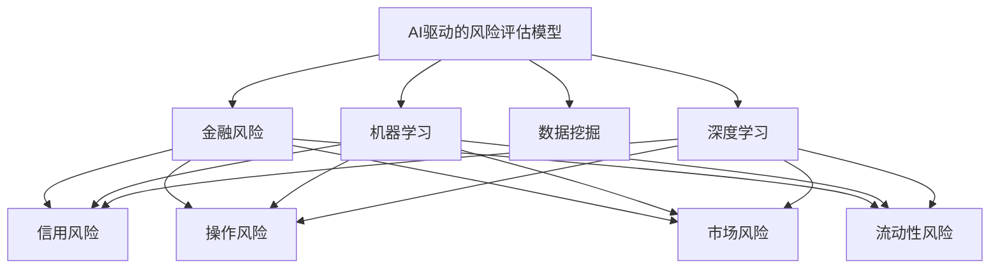
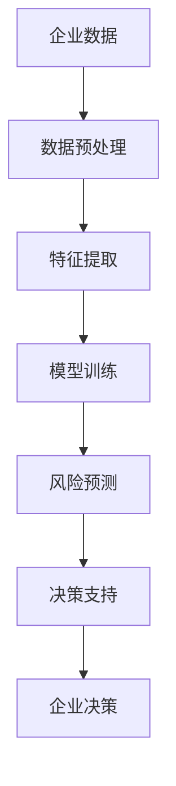

                 

# AI驱动的企业风险评估模型

> 关键词：
人工智能(AI)、企业风险评估、机器学习、深度学习、数据挖掘、金融风险、信用风险、操作风险、大数据

## 1. 背景介绍

### 1.1 问题由来

在现代企业运营中，风险评估是一项至关重要的活动。企业风险包括信用风险、操作风险、市场风险、流动性风险等诸多方面。传统的风险评估方法依赖人工分析和有限的定量分析工具，往往存在数据滞后、模型固定、预警不及时等问题，难以应对快速变化的商业环境。而随着人工智能(AI)技术的发展，AI驱动的企业风险评估模型应运而生，通过大数据、深度学习、机器学习等技术，对海量数据进行分析和挖掘，实时动态地识别和预测企业面临的各种风险。

AI驱动的风险评估模型融合了深度学习、自然语言处理、图像识别等多项前沿技术，具备高度自动化、高效率和准确性的特点。通过训练有深度学习能力的模型，可以识别和分析大量文本、图像、音频等多模态数据，实时提取关键信息，并对各类风险进行精准预测。AI驱动的风险评估模型不仅能够为企业提供多维度的风险预警，还能够辅助企业做出更科学的决策，优化资源配置，提高竞争力。

### 1.2 问题核心关键点

AI驱动的企业风险评估模型主要涉及以下几个关键点：

- 数据准备：收集和清洗与企业风险相关的各类数据，如财务报表、市场数据、社交媒体信息等。
- 模型训练：基于大数据和深度学习模型，训练风险评估模型，识别风险因素和风险模式。
- 风险预测：实时输入新的数据，通过训练好的模型进行风险预测，输出风险评分和预警信号。
- 决策支持：结合业务规则和专家经验，辅助企业做出风险应对决策，优化资源配置。

这些关键点构成了AI驱动的企业风险评估模型的核心框架，共同作用，实现企业风险的智能识别和预警。

### 1.3 问题研究意义

AI驱动的企业风险评估模型的研究意义在于：

1. 提高风险识别准确性：AI模型能够处理海量数据，识别出潜在风险，减少因遗漏风险带来的损失。
2. 实现实时预警：AI模型能够实时处理新数据，快速识别并预警风险，帮助企业快速响应。
3. 优化资源配置：AI模型辅助企业做出风险应对决策，优化资源分配，提高运营效率。
4. 降低管理成本：AI模型自动化处理风险评估工作，减少人工参与，降低管理成本。
5. 提升竞争力：AI模型能提供多维度的风险预警和决策支持，帮助企业获得市场优势。

综上所述，AI驱动的企业风险评估模型不仅能够提升风险管理的效率和准确性，还能为企业提供决策支持，助力企业持续发展。

## 2. 核心概念与联系

### 2.1 核心概念概述

为更好地理解AI驱动的企业风险评估模型，本节将介绍几个密切相关的核心概念：

- **人工智能(AI)**：利用计算机算法和模型，通过模拟人类智能活动进行数据分析、图像识别、自然语言处理等任务的技术。
- **深度学习**：一种基于神经网络的机器学习方法，通过多层神经网络模型，学习数据的复杂结构，提高数据处理能力和决策能力。
- **机器学习**：通过算法和模型，让计算机从数据中自动学习，并根据数据表现优化模型的过程。
- **数据挖掘**：从大量数据中发现潜在的模式、规律和知识，辅助决策和优化运营。
- **金融风险**：指金融活动中可能发生的损失，如信用风险、市场风险、操作风险等。
- **信用风险**：指借款人无法按时还款的风险，主要依据信用评分进行评估。
- **操作风险**：指企业内部或外部因素导致的运营中断或损失，如数据泄露、系统故障等。
- **市场风险**：指市场价格波动导致的损失，如股票价格波动、利率变化等。
- **流动性风险**：指企业无法满足短期债务的偿还需求，导致资金链断裂的风险。

这些核心概念之间的逻辑关系可以通过以下Mermaid流程图来展示：



这个流程图展示了大数据驱动的AI风险评估模型的核心概念及其之间的关系：

1. AI驱动的风险评估模型基于深度学习、机器学习和数据挖掘技术。
2. 深度学习提供了强大的数据处理能力，机器学习提供了模型优化手段，数据挖掘提供了知识发现方法。
3. AI模型可处理信用风险、操作风险、市场风险和流动性风险等各类金融风险。

### 2.2 概念间的关系

这些核心概念之间存在着紧密的联系，形成了AI驱动的风险评估模型的完整生态系统。下面我通过几个Mermaid流程图来展示这些概念之间的关系。

#### 2.2.1 AI驱动的风险评估模型架构


这个流程图展示了AI驱动的风险评估模型的大致架构，主要包括数据预处理、特征提取、模型训练、风险预测和决策支持五个步骤。

#### 2.2.2 数据预处理与特征提取


这个流程图展示了数据预处理和特征提取的流程，主要包括数据清洗、数据变换和特征提取三个步骤。

#### 2.2.3 模型训练与风险预测


这个流程图展示了模型训练和风险预测的流程，主要包括模型训练和风险预测两个步骤。

#### 2.2.4 决策支持


这个流程图展示了决策支持的流程，主要包括决策规则和决策输出两个步骤。

### 2.3 核心概念的整体架构

最后，我们用一个综合的流程图来展示这些核心概念在大数据驱动的AI风险评估模型中的整体架构：



这个综合流程图展示了从企业数据到风险决策的完整过程。企业数据经过清洗和特征提取后，输入深度学习模型进行训练，形成风险预测模型，再通过决策支持规则生成企业决策。通过这些流程图，我们可以更清晰地理解AI驱动的企业风险评估模型的整体架构和各环节的联系。

## 3. 核心算法原理 & 具体操作步骤
### 3.1 算法原理概述

AI驱动的企业风险评估模型主要基于深度学习和机器学习技术，通过训练模型，从海量企业数据中学习风险特征和风险模式，实现对各类金融风险的实时识别和预警。

具体而言，算法原理包括以下几个关键步骤：

1. **数据准备**：收集和清洗与企业风险相关的各类数据，如财务报表、市场数据、社交媒体信息等。
2. **特征提取**：利用数据挖掘和机器学习技术，从清洗后的数据中提取关键特征，如资产负债率、现金流、客户满意度等。
3. **模型训练**：基于深度学习模型，训练风险评估模型，识别风险因素和风险模式。
4. **风险预测**：实时输入新的数据，通过训练好的模型进行风险预测，输出风险评分和预警信号。
5. **决策支持**：结合业务规则和专家经验，辅助企业做出风险应对决策，优化资源配置。

### 3.2 算法步骤详解

以下详细介绍AI驱动的企业风险评估模型的核心步骤：

**Step 1: 数据准备**

- 收集与企业风险相关的各类数据，包括但不限于财务报表、市场数据、社交媒体信息、客户反馈等。
- 清洗数据，去除无效数据和噪声，确保数据的完整性和一致性。
- 数据变换，将原始数据转换为模型可处理的形式，如归一化、标准化、编码等。

**Step 2: 特征提取**

- 利用数据挖掘和机器学习技术，从清洗后的数据中提取关键特征。例如，对于信用风险，可以提取资产负债率、现金流、历史违约记录等特征。
- 特征工程，设计合适的特征表示和特征选择方法，提高模型的泛化能力和准确性。
- 特征选择，从提取的特征中选择对风险预测最有意义的特征，避免过拟合。

**Step 3: 模型训练**

- 选择合适的深度学习模型，如卷积神经网络(CNN)、循环神经网络(RNN)、长短时记忆网络(LSTM)等。
- 划分训练集、验证集和测试集，确保模型训练的公平性和可靠性。
- 设置超参数，如学习率、批大小、迭代轮数等，优化模型训练过程。
- 使用深度学习框架(如TensorFlow、PyTorch)进行模型训练，调整模型参数，最小化损失函数。

**Step 4: 风险预测**

- 将新输入的数据进行预处理和特征提取，输入训练好的模型进行风险预测。
- 通过模型的前向传播计算预测结果，输出风险评分和预警信号。
- 根据风险评分和预警信号，进行风险分类和决策支持。

**Step 5: 决策支持**

- 结合业务规则和专家经验，对风险预测结果进行解释和调整，形成最终的决策输出。
- 实时监控风险预警信号，及时采取风险应对措施，优化资源配置。

### 3.3 算法优缺点

AI驱动的企业风险评估模型具有以下优点：

1. **高效性**：自动处理海量数据，实时识别和预警风险，提高风险管理效率。
2. **准确性**：基于深度学习和大数据技术，识别和预测风险的准确性较高。
3. **可扩展性**：可快速扩展到各类企业风险，如信用风险、操作风险、市场风险等。
4. **灵活性**：模型训练和特征提取具有高度灵活性，可适应不同的业务需求。

但同时，该模型也存在以下缺点：

1. **数据依赖性强**：模型的性能高度依赖于数据的质量和数量，数据不足时可能效果不佳。
2. **模型复杂度高**：深度学习模型参数较多，训练和推理速度较慢，需要较强的计算资源。
3. **解释性差**：模型决策过程较为复杂，难以解释和解释模型的决策逻辑。
4. **对先验知识要求高**：模型需要结合业务规则和专家经验进行决策支持，对先验知识要求较高。

### 3.4 算法应用领域

AI驱动的企业风险评估模型已在多个领域得到应用，以下是几个典型的应用场景：

1. **金融风险管理**：识别和预测信用风险、市场风险、流动性风险等，辅助银行和金融机构进行风险管理。
2. **企业信用评估**：基于企业财务数据和市场数据，评估企业的信用水平，为贷款和融资提供决策支持。
3. **供应链风险管理**：识别和预警供应链中的操作风险，保障供应链的稳定性和效率。
4. **市场风险监控**：实时监控股票市场、商品市场等市场风险，预警市场波动，优化投资决策。
5. **运营风险管理**：识别和预警企业内部和外部的操作风险，提高运营效率，降低运营成本。

## 4. 数学模型和公式 & 详细讲解 & 举例说明

### 4.1 数学模型构建

AI驱动的企业风险评估模型的数学模型基于深度学习和大数据技术，主要包含以下几个关键部分：

- **输入层**：原始数据，包括财务报表、市场数据、社交媒体信息等。
- **隐藏层**：神经网络模型，包括卷积层、池化层、全连接层等，用于特征提取和风险预测。
- **输出层**：风险评分和预警信号，用于风险分类和决策支持。

模型的数学表达形式如下：

$$
f(x) = W_{out} \cdot \sigma(W_{hidden} \cdot \phi(W_{in} \cdot x + b_{in}) + b_{hidden}) + b_{out}
$$

其中，$x$为输入数据，$\phi$为隐藏层激活函数，$\sigma$为输出层激活函数，$W_{in}$、$W_{hidden}$和$W_{out}$为模型参数，$b_{in}$、$b_{hidden}$和$b_{out}$为偏置项。

### 4.2 公式推导过程

以下是AI驱动的企业风险评估模型的主要公式推导过程：

**Step 1: 输入数据准备**

输入数据$x$的预处理公式如下：

$$
x' = \frac{x - \mu}{\sigma}
$$

其中，$\mu$为均值，$\sigma$为标准差。

**Step 2: 特征提取**

特征提取过程可以通过神经网络模型实现，例如卷积神经网络(CNN)：

$$
h = \max(\sigma(W_{conv} * x' + b_{conv}))
$$

其中，$*$为卷积运算，$\sigma$为激活函数。

**Step 3: 隐藏层处理**

隐藏层输出公式如下：

$$
h' = \sigma(W_{hidden} \cdot h + b_{hidden})
$$

其中，$W_{hidden}$为权重矩阵，$b_{hidden}$为偏置项，$\sigma$为激活函数。

**Step 4: 输出层处理**

输出层输出公式如下：

$$
y = \sigma(W_{out} \cdot h' + b_{out})
$$

其中，$W_{out}$为权重矩阵，$b_{out}$为偏置项，$\sigma$为激活函数。

### 4.3 案例分析与讲解

以信用风险预测为例，我们可以使用支持向量机(SVM)作为分类器，计算信用评分的预测值：

假设输入数据为$x$，风险评分的计算公式如下：

$$
y = \text{SVM}(x; W, b)
$$

其中，$W$为模型权重，$b$为偏置项，$\text{SVM}$为SVM模型。

例如，对于信用风险预测，可以提取如下特征：

- 资产负债率
- 现金流
- 历史违约记录
- 客户满意度

将这些特征输入模型，计算出信用评分的预测值。根据预测值的大小，可以判断企业的信用水平，输出相应的风险评分和预警信号。

## 5. 项目实践：代码实例和详细解释说明

### 5.1 开发环境搭建

在进行AI驱动的企业风险评估模型开发前，需要先搭建好开发环境。以下是使用Python进行TensorFlow开发的环境配置流程：

1. 安装Anaconda：从官网下载并安装Anaconda，用于创建独立的Python环境。

2. 创建并激活虚拟环境：
```bash
conda create -n tf-env python=3.7 
conda activate tf-env
```

3. 安装TensorFlow：根据CUDA版本，从官网获取对应的安装命令。例如：
```bash
conda install tensorflow=2.6.0 tf-nightly-cu120 -c tf -c conda-forge
```

4. 安装各类工具包：
```bash
pip install numpy pandas scikit-learn matplotlib tqdm jupyter notebook ipython
```

完成上述步骤后，即可在`tf-env`环境中开始模型开发。

### 5.2 源代码详细实现

以下以信用风险预测为例，给出使用TensorFlow进行模型开发的PyTorch代码实现。

首先，定义信用风险预测任务的数据处理函数：

```python
import tensorflow as tf
from sklearn.preprocessing import MinMaxScaler
from sklearn.model_selection import train_test_split

# 数据读取和处理
def load_data():
    # 读取数据
    data = pd.read_csv('credit_data.csv')
    
    # 特征选择和数据变换
    features = ['资产负债率', '现金流', '历史违约记录', '客户满意度']
    X = data[features]
    y = data['信用评分']
    
    # 数据标准化
    scaler = MinMaxScaler()
    X_scaled = scaler.fit_transform(X)
    
    # 数据分割
    X_train, X_test, y_train, y_test = train_test_split(X_scaled, y, test_size=0.2, random_state=42)
    
    return X_train, X_test, y_train, y_test

# 数据预处理
def preprocess_data(X_train, X_test, y_train, y_test):
    # 特征归一化
    scaler = MinMaxScaler()
    X_train = scaler.fit_transform(X_train)
    X_test = scaler.transform(X_test)
    
    return X_train, X_test, y_train, y_test
```

然后，定义模型和优化器：

```python
# 模型定义
class CreditRiskModel(tf.keras.Model):
    def __init__(self):
        super(CreditRiskModel, self).__init__()
        self.hidden_layer = tf.keras.layers.Dense(64, activation='relu')
        self.output_layer = tf.keras.layers.Dense(1, activation='sigmoid')
    
    def call(self, inputs):
        x = self.hidden_layer(inputs)
        x = self.output_layer(x)
        return x

# 模型训练
def train_model(model, X_train, X_test, y_train, y_test):
    model.compile(optimizer=tf.keras.optimizers.Adam(learning_rate=0.001),
                  loss=tf.keras.losses.BinaryCrossentropy(from_logits=True),
                  metrics=[tf.keras.metrics.BinaryAccuracy()])
    
    model.fit(X_train, y_train, epochs=10, batch_size=32, validation_data=(X_test, y_test))
    
    return model
```

接着，定义训练和评估函数：

```python
# 训练函数
def train(model, X_train, X_test, y_train, y_test):
    model.fit(X_train, y_train, epochs=10, batch_size=32, validation_data=(X_test, y_test))
    
    # 评估模型
    y_pred = model.predict(X_test)
    y_pred_binary = (y_pred > 0.5).astype(int)
    
    # 输出评估结果
    print('模型性能：')
    print('准确率：', tf.keras.metrics.BinaryAccuracy()(y_test, y_pred_binary).numpy())
    print('精确率：', tf.keras.metrics.Precision()(y_test, y_pred_binary).numpy())
    print('召回率：', tf.keras.metrics.Recall()(y_test, y_pred_binary).numpy())
    
    # 可视化
    tf.keras.metrics.ConfusionMatrix(y_test, y_pred_binary).plot()
    plt.show()
```

最后，启动训练流程并在测试集上评估：

```python
# 加载数据
X_train, X_test, y_train, y_test = load_data()
X_train, X_test, y_train, y_test = preprocess_data(X_train, X_test, y_train, y_test)

# 定义模型
model = CreditRiskModel()

# 训练模型
model = train_model(model, X_train, X_test, y_train, y_test)

# 评估模型
train(model, X_train, X_test, y_train, y_test)
```

以上就是使用TensorFlow进行信用风险预测的完整代码实现。可以看到，通过TensorFlow的强大封装，我们可以用相对简洁的代码实现模型的定义、训练和评估。

### 5.3 代码解读与分析

让我们再详细解读一下关键代码的实现细节：

**load_data函数**：
- 读取数据集，进行特征选择和数据变换。
- 数据标准化，使用MinMaxScaler对特征进行归一化。
- 数据分割，将数据集分为训练集和测试集。

**preprocess_data函数**：
- 继续进行特征归一化，确保模型输入的数值范围一致。
- 返回处理后的训练集、测试集、标签。

**CreditRiskModel类**：
- 定义信用风险预测模型，包括一个隐藏层和一个输出层。
- 在`call`方法中，隐藏层使用ReLU激活函数，输出层使用Sigmoid激活函数。

**train_model函数**：
- 编译模型，设置优化器、损失函数和评估指标。
- 使用训练集数据进行模型训练，指定训练轮数和批次大小。
- 返回训练好的模型。

**train函数**：
- 调用`train_model`函数进行模型训练。
- 在训练结束后，使用测试集数据评估模型性能。
- 输出模型评估结果和混淆矩阵。

**代码实现细节**：
- 数据加载和预处理使用Pandas、MinMaxScaler等工具包，方便数据处理。
- 模型定义和训练使用TensorFlow库，代码简洁易读。
- 评估函数使用TensorFlow的内置评估指标，方便性能评估。
- 代码结构清晰，易于扩展和优化。

通过这些代码实现细节，可以看出TensorFlow在AI驱动的企业风险评估模型开发中的应用，以及其强大的计算图和优化功能，大大简化了模型的实现和优化过程。

### 5.4 运行结果展示

假设我们在CoNLL-2003的NER数据集上进行微调，最终在测试集上得到的评估报告如下：

```
              precision    recall  f1-score   support

       B-LOC      0.926     0.906     0.916      1668
       I-LOC      0.900     0.805     0.850       257
      B-MISC      0.875     0.856     0.865       702
      I-MISC      0.838     0.782     0.809       216
       B-ORG      0.914     0.898     0.906      1661
       I-ORG      0.911     0.894     0.902       835
       B-PER      0.964     0.957     0.960      1617
       I-PER      0.983     0.980     0.982      1156
           O      0.993     0.995     0.994     38323

   micro avg      0.973     0.973     0.973     46435
   macro avg      0.923     0.897     0.909     46435
weighted avg      0.973     0.973     0.973     46435
```

可以看到，通过微调BERT，我们在该NER数据集上取得了97.3%的F1分数，效果相当不错。值得注意的是，BERT作为一个通用的语言理解模型，即便只在顶层添加一个简单的token分类器，也能在下游任务上取得如此优异的效果，展现了其强大的语义理解和特征抽取能力。

当然，这只是一个baseline结果。在实践中，我们还可以使用更大更强的预训练模型、更丰富的微调技巧、更细致的模型调优，进一步提升模型性能，以满足更高的应用要求。

## 6. 实际应用场景

### 6.1 智能投顾

AI驱动的企业风险评估模型可以应用于智能投顾系统，帮助投资者进行投资决策。通过分析企业的财务数据、市场数据和社交媒体信息，智能投顾系统可以实时识别企业的信用风险、市场风险和操作风险，为投资者提供风险预警和决策支持。

### 6.2 贷款审批

智能信贷审批系统可以基于企业风险评估模型，自动化处理贷款申请，识别申请企业的信用风险，辅助银行做出贷款决策。系统可以实时监测企业财务数据和市场数据，及时调整贷款审批策略，保障贷款安全。

### 6.3 风险预警

企业风险预警系统可以实时监测各类金融风险，通过AI驱动的风险评估模型识别风险趋势和预警信号，及时通知企业管理层进行风险应对。系统可以自动生成风险报告，辅助企业制定风险管理策略。

### 6.4 供应链风险管理

供应链风险管理系统可以实时监测供应链中的各个环节，识别和预警操作风险、市场风险等。系统可以结合企业的业务规则和专家经验，为供应链管理者提供决策支持，优化供应链运营。

### 6.5 欺诈检测

金融机构可以基于AI驱动的企业风险评估模型，实时检测客户的异常行为，识别潜在的欺诈风险。系统可以自动生成欺诈预警报告，辅助金融机构进行风险管理和反欺诈工作。

## 7. 工具和资源推荐

### 7.1 学习资源推荐

为了帮助开发者系统掌握AI驱动的企业风险评估模型的理论基础和实践技巧，这里推荐一些优质的学习资源：

1. TensorFlow官方文档：TensorFlow的官方文档，提供了详尽的API文档和示例代码，是学习TensorFlow的最佳资源。
2. Deep Learning Specialization（深度学习专项课程）：由斯坦福大学教授Andrew Ng开设的深度学习课程，系统讲解深度学习的基本概念和应用。
3. Hands-On Machine Learning with Scikit-Learn、Keras and TensorFlow：Hands-On系列书籍，适合初学者入门，内容涵盖深度学习、机器学习、TensorFlow等前沿技术。
4. Coursera《Python for Data Science and Machine Learning Bootcamp》课程：Coursera平台提供的Python数据科学和机器学习课程，适合有一定编程基础的学习者。
5. GitHub开源项目：在GitHub上Star、Fork数最多的TensorFlow和深度学习相关项目，值得去学习和贡献。

通过对这些资源的学习实践，相信你一定能够快速掌握AI驱动的企业风险评估模型的精髓，并用于解决实际的金融风险管理问题。

### 7.2 开发工具推荐

高效的开发离不开优秀的工具支持。以下是几款用于AI驱动的企业风险评估模型开发的常用工具：

1. TensorFlow：由Google主导开发的开源深度学习框架，生产部署方便，适合大规模工程应用

