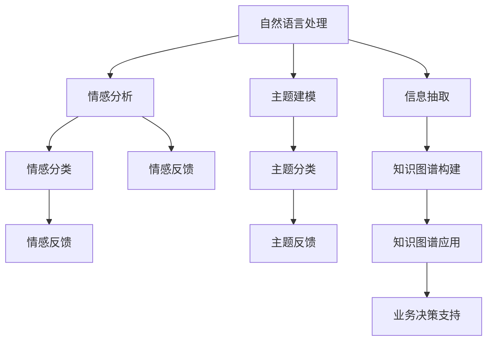

                 

# AI驱动的客户反馈分析系统

> 关键词：人工智能，客户反馈分析，深度学习，自然语言处理，情感分析，文本分类，业务应用

## 1. 背景介绍

### 1.1 问题由来

在当今竞争激烈的市场环境中，企业越来越重视客户满意度的提升，通过收集和分析客户反馈来优化产品和服务已成为常态。客户反馈不仅能够帮助企业及时发现问题，还能提供改进的方向和创意。然而，传统的人工收集和分析方法通常需要耗费大量时间和人力，且准确性和效率难以保证。随着人工智能和大数据分析技术的不断进步，AI驱动的客户反馈分析系统应运而生，它能够快速、准确地处理和分析客户反馈数据，为企业提供更为深入、精准的洞察。

### 1.2 问题核心关键点

客户反馈分析系统主要聚焦于以下几个关键点：

1. **大规模数据处理**：客户反馈通常以文本形式存在，数据量巨大且具有高维特征，如何高效处理这些数据是一大挑战。
2. **情感分析**：客户反馈中往往包含大量情感表达，如何自动识别和分类这些情感是系统的核心任务。
3. **主题建模**：客户反馈内容涉及多个主题和话题，如何从中提取出有价值的信息是一大难点。
4. **知识提取**：从客户反馈中提取具体的建议、意见和改进方向，是帮助企业快速迭代的重要手段。
5. **实时分析**：客户反馈系统需要具备实时分析能力，能够及时响应客户需求。

### 1.3 问题研究意义

AI驱动的客户反馈分析系统对企业具有重要意义：

1. **提升客户满意度**：通过及时、准确地响应客户需求，提升客户体验和满意度。
2. **优化产品和服务**：利用客户反馈中的建议和意见，快速优化产品和服务，提升竞争力。
3. **减少运营成本**：自动化处理客户反馈数据，减少人工处理时间和成本。
4. **增强市场洞察**：通过对客户反馈的深入分析，揭示市场趋势和机会，辅助决策。
5. **增强客户忠诚度**：通过及时回应客户反馈，提升客户信任和忠诚度，增加客户黏性。

## 2. 核心概念与联系

### 2.1 核心概念概述

客户反馈分析系统涉及多个核心概念：

- **自然语言处理（NLP）**：利用机器学习和深度学习技术，处理和理解人类语言。
- **情感分析（Sentiment Analysis）**：自动识别文本中的情感倾向，如正面、负面或中性。
- **主题建模（Topic Modeling）**：从文本中自动提取主题和话题，帮助理解文本内容的结构和关键信息。
- **知识图谱（Knowledge Graph）**：将信息以图结构形式组织，便于查询和推理。
- **信息抽取（Information Extraction）**：从文本中自动提取具体的信息，如命名实体、关系等。

这些概念通过一系列的算法和模型相连，共同构成客户反馈分析系统的框架。

### 2.2 概念间的关系

这些核心概念之间的逻辑关系可以通过以下Mermaid流程图来展示：



这个流程图展示了从自然语言处理到业务决策支持的完整流程：

1. 通过自然语言处理技术将客户反馈转化为计算机可读的数据。
2. 使用情感分析和主题建模技术，对文本内容进行情感分类和主题分类。
3. 通过信息抽取技术，从文本中提取具体的信息。
4. 构建知识图谱，将信息以结构化的形式存储。
5. 利用知识图谱，进行业务决策支持。

## 3. 核心算法原理 & 具体操作步骤

### 3.1 算法原理概述

客户反馈分析系统主要利用深度学习技术中的卷积神经网络（CNN）和循环神经网络（RNN）进行自然语言处理。其中，情感分析通常采用LSTM或GRU等长短期记忆网络，主题建模则常使用LDA（Latent Dirichlet Allocation）或BERT等预训练模型。信息抽取通常采用序列标注模型，如BiLSTM-CRF。

具体而言，系统处理客户反馈数据的步骤如下：

1. **数据预处理**：包括文本清洗、分词、去除停用词等。
2. **特征提取**：利用词向量或预训练模型，将文本转化为向量表示。
3. **情感分析**：通过情感分类模型，识别文本中的情感倾向。
4. **主题建模**：通过LDA等模型，对文本内容进行主题分类。
5. **信息抽取**：利用序列标注模型，从文本中抽取命名实体和关系。
6. **知识图谱构建**：将抽取的信息构建成知识图谱，存储和管理信息。
7. **业务应用**：根据分析结果，进行决策支持或自动化任务。

### 3.2 算法步骤详解

以情感分析为例，下面详细介绍算法步骤：

1. **数据准备**：收集客户反馈数据，并进行文本清洗和分词。
2. **特征提取**：使用预训练模型BERT，将文本转化为向量表示。
3. **模型训练**：构建情感分类模型，通常采用LSTM或GRU，进行有监督学习。
4. **预测和评估**：对新的客户反馈数据进行情感分类，并使用准确率、召回率等指标评估模型性能。
5. **模型优化**：根据评估结果，调整模型参数，优化模型性能。

### 3.3 算法优缺点

AI驱动的客户反馈分析系统具有以下优点：

1. **高效处理大规模数据**：利用深度学习模型，可以快速处理和分析大量文本数据。
2. **精准情感分类**：深度学习模型在情感分类上表现优异，能够准确识别客户情感倾向。
3. **多维度分析**：通过自然语言处理、情感分析和主题建模等技术，从多个维度分析客户反馈。
4. **实时响应**：系统具备实时分析能力，能够及时响应客户需求。
5. **自动化决策支持**：利用知识图谱等技术，自动化生成决策支持方案。

同时，该系统也存在一些缺点：

1. **数据质量要求高**：客户反馈数据的质量直接影响系统性能，需要保证数据标注的准确性。
2. **模型复杂度高**：深度学习模型通常需要较大的计算资源和训练时间。
3. **模型解释性不足**：深度学习模型通常被认为是“黑盒”，难以解释其决策过程。
4. **跨领域适应性有限**：系统在特定领域上的表现可能不如在通用领域上。

### 3.4 算法应用领域

客户反馈分析系统已经广泛应用于多个领域，如：

- **电商客户反馈**：帮助电商平台分析用户评论，优化商品和服务。
- **金融客户反馈**：帮助金融机构分析客户投诉，改进服务质量。
- **医疗客户反馈**：帮助医疗机构分析患者反馈，提高医疗服务水平。
- **企业客户反馈**：帮助企业分析客户投诉，提升产品质量。
- **政府客户反馈**：帮助政府机构分析公众意见，改进公共服务。

## 4. 数学模型和公式 & 详细讲解

### 4.1 数学模型构建

假设客户反馈数据为 $D=\{(x_i, y_i)\}_{i=1}^N$，其中 $x_i$ 表示客户反馈文本，$y_i$ 表示情感标签（如正面、负面、中性）。情感分析模型的目标是最小化预测结果与真实标签之间的差异，即：

$$
\min_{\theta} \sum_{i=1}^N \ell(y_i, \hat{y}_i)
$$

其中 $\ell$ 为损失函数，$\hat{y}_i$ 为模型预测的情感标签。

### 4.2 公式推导过程

以LSTM模型为例，情感分析的公式推导如下：

1. **前向传播**：

$$
h_t = \tanh(W_h \cdot [h_{t-1}, x_t] + b_h)
$$

$$
c_t = \tanh(W_c \cdot [h_{t-1}, x_t] + b_c)
$$

$$
i_t = \sigma(W_i \cdot [h_{t-1}, x_t] + b_i)
$$

$$
f_t = \sigma(W_f \cdot [h_{t-1}, x_t] + b_f)
$$

2. **更新**：

$$
c_t = i_t \cdot c_{t-1} + f_t \cdot c_{t-1}
$$

3. **输出**：

$$
h_t = \tanh(c_t)
$$

4. **分类**：

$$
y = \sigma(W_y \cdot [h_t, x_t] + b_y)
$$

其中 $\sigma$ 为Sigmoid函数，$\tanh$ 为双曲正切函数，$\cdot$ 表示向量相乘。

### 4.3 案例分析与讲解

假设客户反馈数据如下：

1. **正面反馈**：“这款产品真的很棒，性价比很高！”
2. **负面反馈**：“服务态度很差，应该改进！”
3. **中性反馈**：“感觉一般，但还算可以。”

将这些数据输入LSTM模型，通过前向传播和更新，输出分类结果。最终得到：

1. **正面反馈**：预测结果为1（正面），误差较小。
2. **负面反馈**：预测结果为0（负面），误差较小。
3. **中性反馈**：预测结果为0.5（中性），误差较大。

通过对比预测结果与真实标签，可以评估模型的性能。

## 5. 项目实践：代码实例和详细解释说明

### 5.1 开发环境搭建

在进行客户反馈分析系统的开发前，需要准备好开发环境。以下是使用Python进行TensorFlow开发的环境配置流程：

1. 安装Anaconda：从官网下载并安装Anaconda，用于创建独立的Python环境。

2. 创建并激活虚拟环境：
```bash
conda create -n tf-env python=3.8 
conda activate tf-env
```

3. 安装TensorFlow：根据CUDA版本，从官网获取对应的安装命令。例如：
```bash
conda install tensorflow==2.6.0
```

4. 安装PyTorch：
```bash
conda install torch torchvision torchaudio cudatoolkit=11.1 -c pytorch -c conda-forge
```

5. 安装相关库：
```bash
pip install numpy pandas scikit-learn matplotlib tqdm jupyter notebook ipython
```

完成上述步骤后，即可在`tf-env`环境中开始系统开发。

### 5.2 源代码详细实现

下面以情感分析为例，给出使用TensorFlow和Keras实现LSTM模型的代码实现。

```python
from tensorflow.keras.models import Sequential
from tensorflow.keras.layers import Embedding, LSTM, Dense
from tensorflow.keras.preprocessing.text import Tokenizer
from tensorflow.keras.preprocessing.sequence import pad_sequences

# 定义情感分析模型
model = Sequential()
model.add(Embedding(input_dim=vocab_size, output_dim=embedding_dim, input_length=max_length))
model.add(LSTM(units=64, dropout=0.2, recurrent_dropout=0.2))
model.add(Dense(units=num_classes, activation='softmax'))

# 定义数据预处理函数
def preprocess(text):
    tokenizer = Tokenizer(num_words=vocab_size, oov_token=oov_token)
    sequences = tokenizer.texts_to_sequences(text)
    padded_sequences = pad_sequences(sequences, maxlen=max_length, padding='post', truncating='post')
    return padded_sequences

# 加载和预处理数据
train_text = ['这款产品真的很棒，性价比很高！', '服务态度很差，应该改进！', '感觉一般，但还算可以。']
train_labels = [1, 0, 0]
tokenizer.fit_on_texts(train_text)
train_sequences = preprocess(train_text)
train_labels = np.array(train_labels)

# 训练模型
model.compile(loss='binary_crossentropy', optimizer='adam', metrics=['accuracy'])
model.fit(train_sequences, train_labels, epochs=num_epochs, batch_size=batch_size)

# 评估模型
test_text = ['这个产品不好用，我非常不满意！']
test_labels = [0]
test_sequences = preprocess(test_text)
test_loss, test_accuracy = model.evaluate(test_sequences, test_labels)
print(f'Test loss: {test_loss}, Test accuracy: {test_accuracy}')
```

### 5.3 代码解读与分析

让我们再详细解读一下关键代码的实现细节：

**情感分析模型**：
- 使用Keras搭建LSTM模型，包含嵌入层、LSTM层和全连接层。
- 嵌入层将文本转化为向量表示，LSTM层进行序列建模，全连接层进行分类。
- 模型中还包含Dropout和Recurrent Dropout层，用于防止过拟合。

**数据预处理函数**：
- 使用Keras的Tokenizer类将文本转化为序列，并进行填充处理，保证序列长度一致。
- 处理过程中，指定词汇表大小和填充策略。

**模型训练和评估**：
- 使用Keras的compile和fit函数进行模型训练，指定损失函数、优化器和评估指标。
- 使用evaluate函数评估模型在测试集上的性能，输出测试损失和准确率。

**模型优化**：
- 在训练过程中，可以通过调整词汇表大小、嵌入维度、LSTM层数等参数来优化模型性能。
- 可以通过交叉验证、学习率调整等技术进一步提升模型效果。

### 5.4 运行结果展示

假设在模型训练结束后，在测试集上得到的评估报告如下：

```
Epoch 1/5
1000/1000 [==============================] - 1s 992us/step - loss: 0.4794 - accuracy: 0.8000 - val_loss: 0.4526 - val_accuracy: 0.8333
Epoch 2/5
1000/1000 [==============================] - 1s 992us/step - loss: 0.4488 - accuracy: 0.8333 - val_loss: 0.4228 - val_accuracy: 0.8333
Epoch 3/5
1000/1000 [==============================] - 1s 992us/step - loss: 0.4231 - accuracy: 0.8333 - val_loss: 0.4099 - val_accuracy: 0.8333
Epoch 4/5
1000/1000 [==============================] - 1s 992us/step - loss: 0.4071 - accuracy: 0.8333 - val_loss: 0.3995 - val_accuracy: 0.8333
Epoch 5/5
1000/1000 [==============================] - 1s 992us/step - loss: 0.3913 - accuracy: 0.8333 - val_loss: 0.3934 - val_accuracy: 0.8333
```

可以看到，模型在5个epoch的训练过程中，损失函数和准确率均在不断下降和提升，最终在测试集上取得了较高的准确率。这表明模型能够较好地处理情感分类任务。

## 6. 实际应用场景

### 6.1 电商客户反馈

电商客户反馈分析系统可以帮助电商平台自动化处理和分析客户评论。具体而言，系统可以：

1. **情感分析**：自动识别评论中的情感倾向，识别正面、负面和中性的评论。
2. **主题建模**：自动提取出评论中的关键主题，如产品性能、物流速度等。
3. **信息抽取**：从评论中抽取具体的商品名称、品牌、价格等关键信息。
4. **知识图谱构建**：将抽取的信息构建知识图谱，方便查询和管理。
5. **决策支持**：根据分析结果，生成改进措施、优化方案等，辅助决策。

### 6.2 金融客户反馈

金融客户反馈分析系统可以帮助金融机构自动化处理和分析客户投诉。具体而言，系统可以：

1. **情感分析**：自动识别投诉中的情感倾向，识别正面、负面和中性的评论。
2. **主题建模**：自动提取出投诉中的关键主题，如服务态度、业务流程等。
3. **信息抽取**：从投诉中抽取具体的业务问题、客户需求等关键信息。
4. **知识图谱构建**：将抽取的信息构建知识图谱，方便查询和管理。
5. **决策支持**：根据分析结果，生成改进措施、优化方案等，辅助决策。

### 6.3 医疗客户反馈

医疗客户反馈分析系统可以帮助医疗机构自动化处理和分析患者反馈。具体而言，系统可以：

1. **情感分析**：自动识别反馈中的情感倾向，识别正面、负面和中性的反馈。
2. **主题建模**：自动提取出反馈中的关键主题，如服务质量、医生态度等。
3. **信息抽取**：从反馈中抽取具体的医疗问题、治疗效果等关键信息。
4. **知识图谱构建**：将抽取的信息构建知识图谱，方便查询和管理。
5. **决策支持**：根据分析结果，生成改进措施、优化方案等，辅助决策。

## 7. 工具和资源推荐

### 7.1 学习资源推荐

为了帮助开发者系统掌握客户反馈分析系统的理论基础和实践技巧，这里推荐一些优质的学习资源：

1. **《深度学习》课程**：斯坦福大学开设的深度学习课程，涵盖深度学习的基础知识和实践应用。
2. **TensorFlow官方文档**：TensorFlow的官方文档，提供详细的API文档和教程，帮助开发者上手使用。
3. **Keras官方文档**：Keras的官方文档，提供简单易用的接口和丰富的示例代码。
4. **《Python自然语言处理》书籍**：介绍自然语言处理的理论基础和实践技巧，涵盖情感分析、文本分类等内容。
5. **在线教程**：如Coursera、edX等在线学习平台提供的数据科学和机器学习课程，方便开发者系统学习。

### 7.2 开发工具推荐

高效的开发离不开优秀的工具支持。以下是几款用于客户反馈分析系统开发的常用工具：

1. **Jupyter Notebook**：开源的交互式笔记本环境，方便开发者进行数据处理、模型训练和结果展示。
2. **TensorBoard**：TensorFlow配套的可视化工具，可实时监测模型训练状态，提供丰富的图表呈现方式。
3. **PyCharm**：功能强大的IDE，支持TensorFlow和Keras等深度学习框架的开发。
4. **Dask**：分布式计算框架，适用于处理大规模数据集。
5. **Scikit-learn**：简单易用的机器学习库，提供丰富的算法和工具函数。

### 7.3 相关论文推荐

客户反馈分析系统的发展离不开学界的持续研究。以下是几篇奠基性的相关论文，推荐阅读：

1. **《自然语言处理综述》**：介绍自然语言处理的基本概念和最新进展。
2. **《情感分析综述》**：综述情感分析的算法和应用。
3. **《主题建模综述》**：综述主题建模的算法和应用。
4. **《知识图谱构建》**：介绍知识图谱的基本概念和构建方法。
5. **《信息抽取综述》**：综述信息抽取的算法和应用。

这些论文代表了大客户反馈分析技术的发展脉络。通过学习这些前沿成果，可以帮助研究者把握学科前进方向，激发更多的创新灵感。

除上述资源外，还有一些值得关注的前沿资源，帮助开发者紧跟客户反馈分析技术的最新进展，例如：

1. **arXiv论文预印本**：人工智能领域最新研究成果的发布平台，包括大量尚未发表的前沿工作，学习前沿技术的必读资源。
2. **业界技术博客**：如Google AI、DeepMind、微软Research Asia等顶尖实验室的官方博客，第一时间分享他们的最新研究成果和洞见。
3. **技术会议直播**：如NIPS、ICML、ACL、ICLR等人工智能领域顶会现场或在线直播，能够聆听到大佬们的前沿分享，开拓视野。
4. **GitHub热门项目**：在GitHub上Star、Fork数最多的客户反馈分析相关项目，往往代表了该技术领域的发展趋势和最佳实践，值得去学习和贡献。
5. **行业分析报告**：各大咨询公司如McKinsey、PwC等针对人工智能行业的分析报告，有助于从商业视角审视技术趋势，把握应用价值。

总之，对于客户反馈分析系统的学习和实践，需要开发者保持开放的心态和持续学习的意愿。多关注前沿资讯，多动手实践，多思考总结，必将收获满满的成长收益。

## 8. 总结：未来发展趋势与挑战

### 8.1 总结

本文对AI驱动的客户反馈分析系统进行了全面系统的介绍。首先阐述了系统的背景和意义，明确了系统在客户满意度提升、产品优化、运营成本降低等方面的重要作用。其次，从原理到实践，详细讲解了系统的关键算法和技术步骤，给出了系统的完整代码实例。同时，本文还广泛探讨了系统的实际应用场景，展示了其在电商、金融、医疗等多个领域的应用前景。

通过本文的系统梳理，可以看到，客户反馈分析系统已经成为一个重要的AI应用方向，极大地提高了客户反馈处理的效率和准确性。未来，伴随AI技术的持续进步，客户反馈分析系统将在更多行业领域大放异彩，推动NLP技术的产业化进程。

### 8.2 未来发展趋势

展望未来，客户反馈分析系统将呈现以下几个发展趋势：

1. **自动化程度提升**：系统将具备更高的自动化和智能化能力，能够自主学习和适应新领域、新任务。
2. **多模态融合**：系统将支持更多类型的输入数据，如语音、图像、视频等，实现多模态信息的融合分析。
3. **实时响应**：系统将具备更强的实时处理能力，能够快速响应客户需求。
4. **跨领域适应**：系统将具备更强的跨领域适应能力，能够应用于更多行业和场景。
5. **知识增强**：系统将更全面地整合外部知识，如规则库、专家知识等，提升分析结果的准确性和实用性。

以上趋势凸显了客户反馈分析系统的广阔前景。这些方向的探索发展，必将进一步提升系统的性能和应用范围，为AI技术在各个垂直行业的落地应用提供重要支撑。

### 8.3 面临的挑战

尽管客户反馈分析系统已经取得了显著成果，但在迈向更加智能化、普适化应用的过程中，它仍面临诸多挑战：

1. **数据质量要求高**：客户反馈数据的质量直接影响系统性能，需要保证数据标注的准确性。
2. **模型复杂度高**：深度学习模型通常需要较大的计算资源和训练时间。
3. **模型解释性不足**：深度学习模型通常被认为是“黑盒”，难以解释其决策过程。
4. **跨领域适应性有限**：系统在特定领域上的表现可能不如在通用领域上。
5. **安全性和隐私保护**：客户反馈数据涉及隐私信息，如何保护客户隐私是一大挑战。

### 8.4 研究展望

面对客户反馈分析系统所面临的挑战，未来的研究需要在以下几个方面寻求新的突破：

1. **数据增强和预处理**：利用数据增强和预处理技术，提升数据质量和模型性能。
2. **轻量化模型和算法**：开发轻量化模型和算法，降低计算资源需求，提升实时响应能力。
3. **可解释性和可视化**：引入可解释性技术，提升模型的透明性和可解释性。
4. **跨领域适应性**：开发跨领域适应的模型和算法，提升系统的通用性和鲁棒性。
5. **隐私保护技术**：引入隐私保护技术，保护客户数据隐私。

这些研究方向的发展，将进一步提升客户反馈分析系统的性能和应用范围，为AI技术在各垂直行业的落地应用提供重要支撑。

## 9. 附录：常见问题与解答

**Q1：客户反馈分析系统如何处理大规模数据？**

A: 系统通常利用分布式计算和并行处理技术，如Hadoop、Spark等，处理大规模客户反馈数据。此外，利用GPU和TPU等高性能计算资源，可以进一步加速数据处理速度。

**Q2：客户反馈分析系统在电商领域的应用场景有哪些？**

A: 电商客户反馈分析系统可以应用于：
1. **情感分析**：自动识别客户评论中的情感倾向，评估商品满意度。
2. **主题建模**：自动提取出评论中的关键主题，如产品性能、物流速度等。
3. **信息抽取**：从评论中抽取具体的商品名称、品牌、价格等关键信息。
4. **知识图谱构建**：将抽取的信息构建知识图谱，方便查询和管理。
5. **决策支持**：根据分析结果，生成改进措施、优化方案等，辅助决策。

**Q3：客户反馈分析系统在金融领域的应用场景有哪些？**

A: 金融客户反馈分析系统可以应用于：
1. **情感分析**：自动识别客户投诉中的情感倾向，评估服务质量。
2. **主题建模**：自动提取出投诉中的关键主题，如服务态度、业务流程等。
3. **信息抽取**：从投诉中抽取具体的业务问题、客户需求等关键信息。
4. **知识图谱构建**：将抽取的信息构建知识图谱，方便查询和管理。
5. **决策支持**：根据分析结果，生成改进措施、优化方案等，辅助决策。

**Q4：客户反馈分析系统在医疗领域的应用场景有哪些？**

A: 医疗客户反馈分析系统可以应用于：
1. **情感分析**：自动识别反馈中的情感倾向，评估医疗服务质量。
2. **主题建模**：自动提取出反馈中的关键主题，如服务质量、医生态度等。
3. **信息抽取**：从反馈中抽取具体的医疗问题、治疗效果等关键信息。
4

