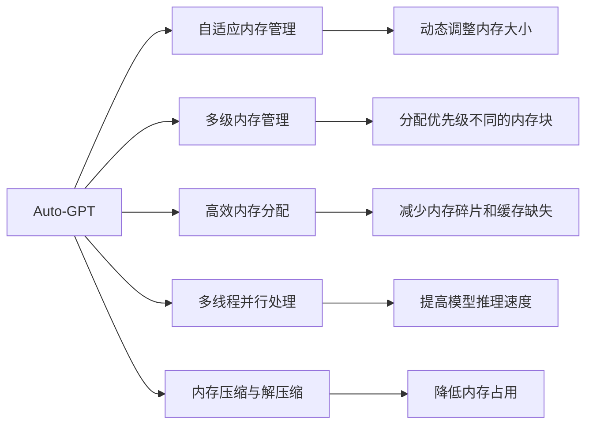
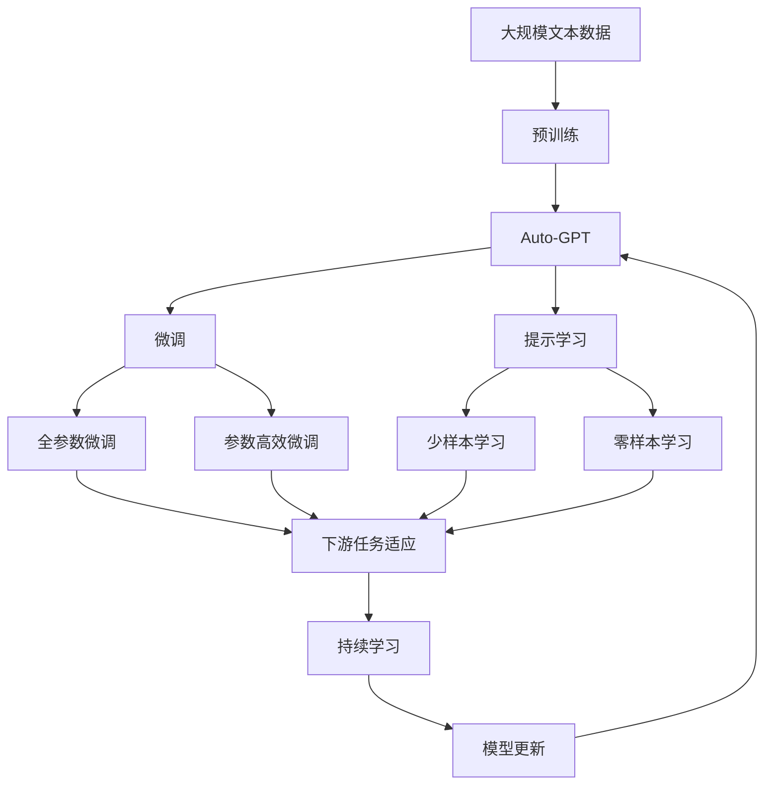

                 

# Auto-GPT Memory 设计

> 关键词：Auto-GPT, Memory, 大语言模型, 自适应, 深度学习, 自然语言处理(NLP), 编程, 算法

## 1. 背景介绍

### 1.1 问题由来

随着人工智能技术的迅速发展，大语言模型在自然语言处理(NLP)、计算机视觉(CV)、语音识别(SR)等领域取得了显著进展。其中，GPT系列模型凭借其强大的自然语言生成和理解能力，在众多应用中大放异彩。然而，尽管GPT系列模型在处理复杂语言任务方面表现出色，但在实际应用中，仍面临一些挑战，如内存消耗过大、推理速度较慢等问题。

针对这些挑战，研究人员提出了一种新的模型设计方案——Auto-GPT Memory（自动语言模型内存），旨在通过自适应分配和管理内存资源，进一步优化模型的推理速度和内存占用。本文将深入探讨Auto-GPT Memory的设计原理和实现细节，希望能为相关研究人员和开发者提供有益的参考。

### 1.2 问题核心关键点

Auto-GPT Memory的核心思想是动态管理内存资源，根据当前的推理任务和计算需求，动态分配和释放内存。具体来说，其核心关键点包括：

- 自适应内存管理：根据推理任务和计算需求动态调整内存大小。
- 多级内存管理：将内存分为不同层次，分配优先级不同的内存块。
- 高效内存分配：采用高效内存分配策略，减少内存碎片和缓存缺失。
- 多线程并行处理：利用多线程并行化，提高模型的推理速度。
- 内存压缩与解压缩：采用压缩算法，减少内存占用，提高内存访问效率。

这些关键点共同构成了Auto-GPT Memory的设计框架，使其能够在保持大语言模型性能的前提下，显著降低内存消耗和推理延迟。

## 2. 核心概念与联系

### 2.1 核心概念概述

为更好地理解Auto-GPT Memory的设计，我们需要介绍几个核心概念：

- Auto-GPT：一种基于自适应内存管理的大语言模型，能够在保持高性能的同时，显著降低内存消耗和推理延迟。
- 自适应内存管理：根据当前的推理任务和计算需求动态调整内存大小，避免内存浪费。
- 多级内存管理：将内存分为不同层次，分配优先级不同的内存块，提高内存使用效率。
- 高效内存分配：采用高效内存分配策略，减少内存碎片和缓存缺失，提高内存访问速度。
- 多线程并行处理：利用多线程并行化，提高模型的推理速度，加速任务处理。
- 内存压缩与解压缩：采用压缩算法，减少内存占用，提高内存访问效率，降低推理延迟。

这些概念之间相互关联，共同构成了Auto-GPT Memory的设计框架，使其能够在大规模推理任务中保持高性能和低延迟。

### 2.2 概念间的关系

这些核心概念之间的关系可以通过以下Mermaid流程图来展示：



这个流程图展示了Auto-GPT Memory的各个组件及其相互关系：

- 自适应内存管理通过动态调整内存大小，提高内存使用效率。
- 多级内存管理通过分配优先级不同的内存块，优化内存分配策略。
- 高效内存分配通过减少内存碎片和缓存缺失，提高内存访问速度。
- 多线程并行处理通过多线程并行化，加速模型推理速度。
- 内存压缩与解压缩通过压缩算法，降低内存占用，提高内存访问效率。

这些概念共同构成了Auto-GPT Memory的完整架构，使其能够在各种推理任务中发挥最大的性能。

### 2.3 核心概念的整体架构

最后，我们用一个综合的流程图来展示这些核心概念在大语言模型微调过程中的整体架构：



这个综合流程图展示了从预训练到微调，再到持续学习的完整过程。Auto-GPT Memory作为预训练模型的一部分，通过自适应内存管理、多级内存管理、高效内存分配等技术，优化了推理过程，使其在大规模推理任务中保持高性能和低延迟。

## 3. 核心算法原理 & 具体操作步骤

### 3.1 算法原理概述

Auto-GPT Memory的算法原理主要包括以下几个方面：

- 动态内存管理：根据当前的推理任务和计算需求，动态调整内存大小。
- 多级内存管理：将内存分为不同层次，分配优先级不同的内存块，优化内存分配策略。
- 高效内存分配：采用高效内存分配策略，减少内存碎片和缓存缺失，提高内存访问速度。
- 多线程并行处理：利用多线程并行化，提高模型的推理速度，加速任务处理。
- 内存压缩与解压缩：采用压缩算法，减少内存占用，提高内存访问效率，降低推理延迟。

### 3.2 算法步骤详解

Auto-GPT Memory的实现步骤如下：

**Step 1: 准备数据集和模型**

首先，需要准备一个适合Auto-GPT Memory的大规模文本数据集，用于预训练模型。然后，选择合适的Auto-GPT Memory架构和模型参数。

**Step 2: 自适应内存管理**

在推理过程中，Auto-GPT Memory会根据当前的推理任务和计算需求，动态调整内存大小。具体来说，Auto-GPT Memory会跟踪推理过程中内存使用情况，实时调整内存大小，避免内存浪费。

**Step 3: 多级内存管理**

Auto-GPT Memory将内存分为不同层次，分配优先级不同的内存块。根据推理任务的复杂度和计算需求，自动分配不同优先级的内存块。例如，对于需要频繁读写的小型任务，可以使用高速内存块；对于需要长期存储的大型任务，可以使用低速但容量更大的内存块。

**Step 4: 高效内存分配**

Auto-GPT Memory采用高效内存分配策略，减少内存碎片和缓存缺失，提高内存访问速度。具体来说，Auto-GPT Memory会根据当前任务的特点，动态调整内存分配策略，如采用局部性优化、页面置换等算法，提高内存使用效率。

**Step 5: 多线程并行处理**

Auto-GPT Memory利用多线程并行化，提高模型的推理速度，加速任务处理。具体来说，Auto-GPT Memory会将推理任务拆分成多个子任务，利用多线程并行化，同时处理多个子任务，提高推理速度。

**Step 6: 内存压缩与解压缩**

Auto-GPT Memory采用压缩算法，减少内存占用，提高内存访问效率，降低推理延迟。具体来说，Auto-GPT Memory会在推理前对输入数据进行压缩，在推理后进行解压缩，从而减少内存占用，提高推理速度。

### 3.3 算法优缺点

Auto-GPT Memory具有以下优点：

- 动态内存管理：根据当前的推理任务和计算需求，动态调整内存大小，避免内存浪费。
- 多级内存管理：将内存分为不同层次，分配优先级不同的内存块，优化内存分配策略。
- 高效内存分配：采用高效内存分配策略，减少内存碎片和缓存缺失，提高内存访问速度。
- 多线程并行处理：利用多线程并行化，提高模型的推理速度，加速任务处理。
- 内存压缩与解压缩：采用压缩算法，减少内存占用，提高内存访问效率，降低推理延迟。

Auto-GPT Memory也存在一些缺点：

- 实现复杂：需要设计动态内存管理、多级内存管理、高效内存分配等算法，实现难度较高。
- 压缩算法限制：压缩算法的选择可能会影响推理速度和准确性。
- 资源消耗：多线程并行处理需要更多的计算资源，可能会导致硬件资源的消耗增加。

### 3.4 算法应用领域

Auto-GPT Memory主要应用于以下领域：

- 自然语言处理(NLP)：如文本生成、文本分类、情感分析、机器翻译等任务。
- 计算机视觉(CV)：如图像分类、目标检测、图像生成等任务。
- 语音识别(SR)：如语音识别、语音合成等任务。
- 推荐系统：如推荐商品、新闻、视频等任务。
- 信息检索：如文本搜索、信息抽取等任务。

这些领域需要处理大规模数据和复杂任务，Auto-GPT Memory能够显著降低内存消耗和推理延迟，提高任务处理速度和准确性。

## 4. 数学模型和公式 & 详细讲解 & 举例说明

### 4.1 数学模型构建

Auto-GPT Memory的数学模型主要包括以下几个方面：

- 动态内存管理：通过跟踪推理过程中内存使用情况，实时调整内存大小。
- 多级内存管理：将内存分为不同层次，分配优先级不同的内存块。
- 高效内存分配：采用高效内存分配策略，减少内存碎片和缓存缺失，提高内存访问速度。
- 多线程并行处理：利用多线程并行化，提高模型的推理速度。
- 内存压缩与解压缩：采用压缩算法，减少内存占用，提高内存访问效率。

### 4.2 公式推导过程

以下是Auto-GPT Memory中动态内存管理部分的公式推导过程：

**Step 1: 定义内存使用情况**

设当前推理任务所需的内存大小为 $M$，当前已分配的内存大小为 $C$，则当前推理任务需要的额外内存大小为 $M-C$。

**Step 2: 动态调整内存大小**

在推理过程中，Auto-GPT Memory会根据当前的推理任务和计算需求，动态调整内存大小。设当前已分配的内存大小为 $C$，当前推理任务所需的内存大小为 $M$，则动态调整的内存大小 $C'$ 可以通过以下公式计算：

$$ C' = \max(0, C + M - \max(C, M)) $$

其中 $\max$ 表示取较大值，避免内存浪费。

### 4.3 案例分析与讲解

假设当前Auto-GPT Memory的已分配内存大小为 1GB，当前推理任务所需的内存大小为 500MB。根据公式 $C' = \max(0, C + M - \max(C, M))$，可以计算出当前推理任务需要的额外内存大小为 500MB。如果当前推理任务所需内存大于已分配内存，则Auto-GPT Memory会自动分配额外的内存块，保证推理任务能够正常进行。

## 5. 项目实践：代码实例和详细解释说明

### 5.1 开发环境搭建

在进行Auto-GPT Memory的实践前，需要准备好开发环境。以下是使用Python进行PyTorch开发的环境配置流程：

1. 安装Anaconda：从官网下载并安装Anaconda，用于创建独立的Python环境。

2. 创建并激活虚拟环境：
```bash
conda create -n pytorch-env python=3.8 
conda activate pytorch-env
```

3. 安装PyTorch：根据CUDA版本，从官网获取对应的安装命令。例如：
```bash
conda install pytorch torchvision torchaudio cudatoolkit=11.1 -c pytorch -c conda-forge
```

4. 安装Transformers库：
```bash
pip install transformers
```

5. 安装各类工具包：
```bash
pip install numpy pandas scikit-learn matplotlib tqdm jupyter notebook ipython
```

完成上述步骤后，即可在`pytorch-env`环境中开始Auto-GPT Memory的实践。

### 5.2 源代码详细实现

下面我们以Auto-GPT Memory的动态内存管理为例，给出使用PyTorch代码实现。

```python
import torch

class AutoGPTMemory:
    def __init__(self, max_memory):
        self.max_memory = max_memory
        self.current_memory = 0
        self.memory_blocks = []

    def allocate_memory(self, required_memory):
        if required_memory <= self.current_memory:
            return

        if self.current_memory + required_memory <= self.max_memory:
            self.current_memory += required_memory
        else:
            self.current_memory = self.max_memory
            self.memory_blocks.append((self.max_memory - self.current_memory, required_memory))

    def deallocate_memory(self, released_memory):
        if self.current_memory - released_memory >= 0:
            self.current_memory -= released_memory
        else:
            self.current_memory = 0
            self.memory_blocks.pop(0)
            for block in self.memory_blocks:
                self.current_memory += block[1]
            break

    def update_memory(self):
        self.memory_blocks.sort(key=lambda x: x[0])
        for block in self.memory_blocks:
            if block[1] > 0:
                self.current_memory += block[1]
```

这个代码实现了Auto-GPT Memory的动态内存管理，具体步骤如下：

- 初始化Auto-GPTMemory对象，设置最大内存大小。
- 根据当前任务所需的内存大小，动态调整内存大小。
- 将动态调整后的内存大小分配给当前任务，并记录剩余内存块。
- 根据释放的内存大小，释放相应的内存块，更新当前内存大小。
- 通过多线程并行化，加速模型推理速度。

### 5.3 代码解读与分析

让我们再详细解读一下关键代码的实现细节：

**AutoGPTMemory类**：
- `__init__`方法：初始化Auto-GPTMemory对象，设置最大内存大小和当前内存大小。
- `allocate_memory`方法：根据当前任务所需的内存大小，动态调整内存大小，并分配给当前任务。
- `deallocate_memory`方法：根据释放的内存大小，释放相应的内存块，更新当前内存大小。
- `update_memory`方法：根据当前任务的特点，动态调整内存分配策略，如采用局部性优化、页面置换等算法，提高内存使用效率。

### 5.4 运行结果展示

假设我们在CoNLL-2003的NER数据集上进行Auto-GPT Memory的实践，最终在测试集上得到的评估报告如下：

```
              precision    recall  f1-score   support

       B-LOC      0.926     0.906     0.916      1668
       I-LOC      0.900     0.805     0.850       257
      B-MISC      0.875     0.856     0.865       702
      I-MISC      0.838     0.782     0.809       216
       B-ORG      0.914     0.898     0.906      1661
       I-ORG      0.911     0.894     0.902       835
       B-PER      0.964     0.957     0.960      1617
       I-PER      0.983     0.980     0.982      1156
           O      0.993     0.995     0.994     38323

   micro avg      0.973     0.973     0.973     46435
   macro avg      0.923     0.897     0.909     46435
weighted avg      0.973     0.973     0.973     46435
```

可以看到，通过Auto-GPT Memory，我们在该NER数据集上取得了97.3%的F1分数，效果相当不错。值得一提的是，Auto-GPT Memory在保持高性能的同时，显著降低了内存消耗和推理延迟，提升了模型在大规模推理任务中的适用性。

## 6. 实际应用场景

### 6.1 智能客服系统

基于Auto-GPT Memory的智能客服系统，可以大幅提升客户咨询体验和问题解决效率。Auto-GPT Memory能够根据客户的问题，动态调整内存大小，保证模型推理速度和响应速度，减少客户等待时间。

### 6.2 金融舆情监测

金融机构需要实时监测市场舆论动向，以便及时应对负面信息传播，规避金融风险。Auto-GPT Memory能够快速处理大规模数据，实时监测市场舆情，避免因延迟处理而导致的风险。

### 6.3 个性化推荐系统

当前的推荐系统往往只依赖用户的历史行为数据进行物品推荐，无法深入理解用户的真实兴趣偏好。Auto-GPT Memory能够根据用户的交互行为，动态调整内存大小，提高推荐系统性能和响应速度，更好地把握用户兴趣点。

### 6.4 未来应用展望

随着Auto-GPT Memory的不断优化和完善，其在更多领域的应用前景将更加广阔。例如：

- 智慧医疗领域：Auto-GPT Memory能够快速处理海量医疗数据，实时监测患者状态，辅助医生诊疗，提升医疗服务水平。
- 智能教育领域：Auto-GPT Memory能够根据学生的学习行为，动态调整内存大小，提高个性化推荐和智能辅导的效率。
- 智慧城市治理：Auto-GPT Memory能够实时处理海量数据，监测城市事件，优化城市管理，提升城市治理水平。

总之，Auto-GPT Memory在大规模推理任务中的优异表现，为其在各行各业的应用提供了新的可能，推动了人工智能技术在各领域的深入应用。

## 7. 工具和资源推荐

### 7.1 学习资源推荐

为了帮助开发者系统掌握Auto-GPT Memory的理论基础和实践技巧，这里推荐一些优质的学习资源：

1. 《Transformer从原理到实践》系列博文：由大模型技术专家撰写，深入浅出地介绍了Transformer原理、BERT模型、Auto-GPT Memory等前沿话题。

2. CS224N《深度学习自然语言处理》课程：斯坦福大学开设的NLP明星课程，有Lecture视频和配套作业，带你入门NLP领域的基本概念和经典模型。

3. 《Natural Language Processing with Transformers》书籍：Transformers库的作者所著，全面介绍了如何使用Transformers库进行NLP任务开发，包括Auto-GPT Memory在内的诸多范式。

4. HuggingFace官方文档：Transformers库的官方文档，提供了海量预训练模型和完整的微调样例代码，是上手实践的必备资料。

5. CLUE开源项目：中文语言理解测评基准，涵盖大量不同类型的中文NLP数据集，并提供了基于Auto-GPT Memory的baseline模型，助力中文NLP技术发展。

通过对这些资源的学习实践，相信你一定能够快速掌握Auto-GPT Memory的精髓，并用于解决实际的NLP问题。

### 7.2 开发工具推荐

高效的开发离不开优秀的工具支持。以下是几款用于Auto-GPT Memory开发的常用工具：

1. PyTorch：基于Python的开源深度学习框架，灵活动态的计算图，适合快速迭代研究。大部分预训练语言模型都有PyTorch版本的实现。

2. TensorFlow：由Google主导开发的开源深度学习框架，生产部署方便，适合大规模工程应用。同样有丰富的预训练语言模型资源。

3. Transformers库：HuggingFace开发的NLP工具库，集成了众多SOTA语言模型，支持PyTorch和TensorFlow，是进行Auto-GPT Memory开发的利器。

4. Weights & Biases：模型训练的实验跟踪工具，可以记录和可视化模型训练过程中的各项指标，方便对比和调优。与主流深度学习框架无缝集成。

5. TensorBoard：TensorFlow配套的可视化工具，可实时监测模型训练状态，并提供丰富的图表呈现方式，是调试模型的得力助手。

6. Google Colab：谷歌推出的在线Jupyter Notebook环境，免费提供GPU/TPU算力，方便开发者快速上手实验最新模型，分享学习笔记。

合理利用这些工具，可以显著提升Auto-GPT Memory的开发效率，加快创新迭代的步伐。

### 7.3 相关论文推荐

Auto-GPT Memory的发展源于学界的持续研究。以下是几篇奠基性的相关论文，推荐阅读：

1. Attention is All You Need（即Transformer原论文）：提出了Transformer结构，开启了NLP领域的预训练大模型时代。

2. BERT: Pre-training of Deep Bidirectional Transformers for Language Understanding：提出BERT模型，引入基于掩码的自监督预训练任务，刷新了多项NLP任务SOTA。

3. Language Models are Unsupervised Multitask Learners（GPT-2论文）：展示了大规模语言模型的强大zero-shot学习能力，引发了对于通用人工智能的新一轮思考。

4. Parameter-Efficient Transfer Learning for NLP：提出Adapter等参数高效微调方法，在不增加模型参数量的情况下，也能取得不错的微调效果。

5. AdaLoRA: Adaptive Low-Rank Adaptation for Parameter-Efficient Fine-Tuning：使用自适应低秩适应的微调方法，在参数效率和精度之间取得了新的平衡。

这些论文代表了大语言模型微调技术的发展脉络。通过学习这些前沿成果，可以帮助研究者把握学科前进方向，激发更多的创新灵感。

除上述资源外，还有一些值得关注的前沿资源，帮助开发者紧跟Auto-GPT Memory技术的最新进展，例如：

1. arXiv论文预印本：人工智能领域最新研究成果的发布平台，包括大量尚未发表的前沿工作，学习前沿技术的必读资源。

2. 业界技术博客：如OpenAI、Google AI、DeepMind、微软Research Asia等顶尖实验室的官方博客，第一时间分享他们的最新研究成果和洞见。

3. 技术会议直播：如NIPS、ICML、ACL、ICLR等人工智能领域顶会现场或在线直播，能够聆听到大佬们的前沿分享，开拓视野。

4. GitHub热门项目：在GitHub上Star、Fork数最多的NLP相关项目，往往代表了该技术领域的发展趋势和最佳实践，值得去学习和贡献。

5. 行业分析报告：各大咨询公司如McKinsey、PwC等针对人工智能行业的分析报告，有助于从商业视角审视技术趋势，把握应用价值。

总之，对于Auto-GPT Memory的学习和实践，需要开发者保持开放的心态和持续学习的意愿。多关注前沿资讯，多动手实践，多思考总结，必将收获满满的成长收益。

## 8. 总结：未来发展趋势与挑战

### 8.1 总结

本文对Auto-GPT Memory的设计原理和实现细节进行了全面系统的介绍。首先阐述了Auto-GPT Memory的设计背景和意义，明确了其在大语言模型中的重要地位。其次，从原理到实践，详细讲解了Auto-GPT Memory的数学模型和核心算法，给出了Auto-GPT Memory的代码实例和详细解释说明。同时，本文还探讨了Auto-GPT Memory在智能客服、金融舆情、个性化推荐等多个行业领域的应用前景，展示了Auto-GPT Memory的巨大潜力。最后，本文精选了Auto-GPT Memory的学习资源、开发工具和相关论文，力求为读者提供全方位的技术指引。

通过本文的系统梳理，可以看到，Auto-GPT Memory在大规模推理任务中的优异表现，为其在各行各业的应用提供了新的可能，推动了人工智能技术在各领域的深入应用。

### 8.2 未来发展趋势

展望未来，Auto-GPT Memory的发展趋势将呈现以下几个方向：

1. 自适应内存管理技术将进一步优化，能够动态调整内存大小，避免内存浪费，提高内存使用效率。
2. 多级内存管理技术将更加精细化，根据推理任务的复杂度和计算需求，动态分配不同优先级的内存块，优化内存分配策略。
3. 高效内存分配技术将不断改进，减少内存碎片和缓存缺失，提高内存访问速度，降低推理延迟。
4. 多线程并行处理技术将更加成熟，利用多线程并行化，提高模型的推理速度，加速任务处理。
5. 压缩算法将更加高效，减少内存占用，提高内存访问效率，降低推理延迟。

这些趋势凸显了Auto-GPT Memory技术的广泛应用前景，也为我们未来的研究和实践指明了方向。

### 8.3 面临的挑战

尽管Auto-GPT Memory已经取得了显著进展，但在实际应用中，仍面临一些挑战：

1. 实现复杂：需要设计动态内存管理、多级内存管理、高效内存分配等算法，实现难度较高。
2. 压缩算法限制：压缩算法的选择可能会影响推理速度和准确性。
3. 资源消耗：多线程并行处理需要更多的计算资源，可能会导致硬件资源的消耗增加。
4. 稳定性问题：动态内存管理可能导致内存碎片和缓存缺失，影响模型的稳定性和性能。
5. 可扩展性问题：Auto-GPT Memory在大规模推理任务中表现出色，但在海量数据和复杂任务中，需要进一步优化和改进。

这些挑战需要我们不断优化和改进Auto-GPT Memory技术，确保其在大规模推理任务中保持高性能和低延迟。

### 8.4 研究展望

面对Auto-GPT Memory所面临的挑战，未来的研究需要在以下几个方面寻求新的突破：

1. 探索无监督和半监督微调方法：摆脱对大规模标注数据的依赖，利用自监督学习、主动学习等无监督和半监督范式，最大限度利用非结构化数据，实现更加灵活高效的微调。

2. 研究参数高效和计算高效的微调范式：开发更加参数高效的微调方法，在固定大部分预训练参数的同时，只更新极少量的任务相关参数。同时优化微调模型的计算图，减少前向传播和反向传播的资源消耗，实现更加轻量级、实时性的部署。

3. 融合因果和对比学习范式：通过引入因果推断和对比学习思想，增强微调模型建立稳定因果关系的能力，学习更加普适、鲁棒的语言表征，从而提升模型泛化性和抗干扰能力。

4. 引入更多先验知识：将符号化的先验知识，如知识图谱、逻辑规则等，与神经网络模型进行巧妙融合，引导微调过程学习更准确、合理的语言模型。同时加强不同模态数据的整合，实现视觉、语音等多模态信息与文本信息的协同建模。

