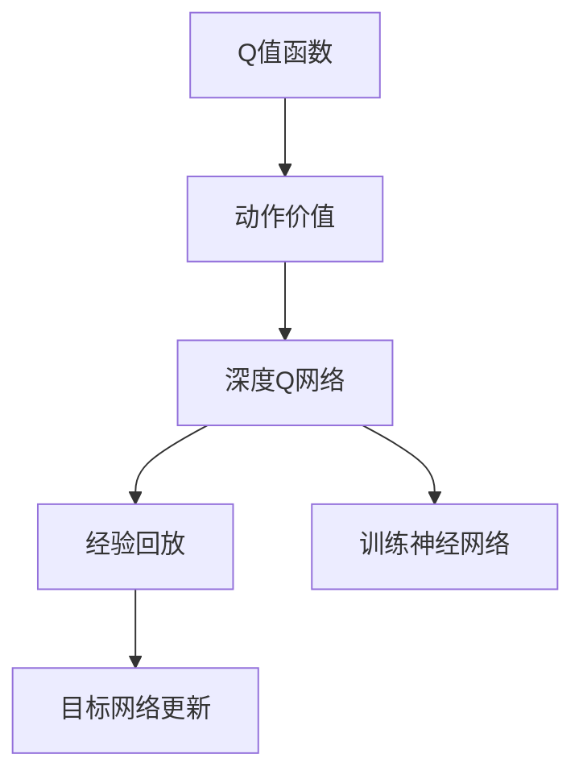

                 

# DQN(Deep Q-Network) - 原理与代码实例讲解

> 关键词：深度强化学习,Deep Q-Network,神经网络,神经网络训练,强化学习

## 1. 背景介绍

### 1.1 问题由来
在人工智能领域，强化学习(RL)作为与监督学习、无监督学习并驾齐驱的一种学习方法，近年来取得了突飞猛进的发展。尤其是深度强化学习(DRL)，将深度学习和强化学习的理念和技术相结合，大幅提升了智能体的学习能力和决策质量，成为解决复杂决策问题的有力工具。

深度Q网络(DQN)作为DRL中最为经典的算法之一，以其稳定高效、简单易懂的特性，在各种游戏、控制等领域表现卓越。本博客将详细解析DQN的核心原理、操作步骤，并结合代码实例，深入浅出地展示DQN的实践过程。

### 1.2 问题核心关键点
DQN算法的核心思想是利用深度神经网络来近似表示Q值函数，并通过经验回放和目标网络更新等机制，使模型能够在复杂环境中学习最优策略。本博客将围绕Q值函数、经验回放、目标网络更新等核心概念，探讨DQN算法的原理和实践。

### 1.3 问题研究意义
DQN算法的研究和应用，对于推动强化学习的发展、解决复杂决策问题具有重要意义：

1. **学习高效**：DQN利用神经网络进行Q值函数逼近，学习效率高，能够处理高维状态空间。
2. **决策稳定**：通过经验回放和目标网络更新，DQN算法具有很好的鲁棒性，能够适应各种复杂环境。
3. **应用广泛**：DQN在多个领域（如游戏、控制、机器人等）表现优异，具有广泛的应用前景。
4. **可解释性强**：DQN算法的核心思想直观易懂，有助于研究者理解和应用。

## 2. 核心概念与联系

### 2.1 核心概念概述

为了更好地理解DQN算法，我们将首先介绍几个关键概念：

- **Q值函数(Q-Value Function)**：在强化学习中，Q值函数用于评估当前状态(s)下采取动作(a)后的累积奖励的期望值。其定义为：
  $$
  Q(s, a) = \mathbb{E}[\sum_{t=1}^{\infty} \gamma^t r_{t+1} | s_t = s, a_t = a]
  $$
  其中 $r_t$ 是第t步的即时奖励，$\gamma$ 是折扣因子。

- **动作价值(Max-Q Action Value)**：在每个状态下，选择能获得最大Q值的动作。即：
  $$
  a^* = \arg\max_a Q(s, a)
  $$

- **深度Q网络(Deep Q-Network, DQN)**：利用深度神经网络来逼近Q值函数，从而实现对状态值函数的近似表示。DQN通过经验回放、目标网络更新等机制，使模型不断优化决策策略。

- **经验回放(Experience Replay)**：通过将历史经验样本存储于内存中，并随机抽取用于训练，使模型更好地泛化。

- **目标网络更新(Update Target Network)**：利用两个并行网络，一个用于更新，一个用于目标状态值函数的计算，从而实现Q值函数的稳定更新。

这些概念之间的逻辑关系可以通过以下Mermaid流程图来展示：



这个流程图展示了DQN算法的核心概念及其关系：

1. 利用Q值函数评估动作价值。
2. 通过深度神经网络逼近Q值函数。
3. 利用经验回放提高泛化能力。
4. 利用目标网络更新稳定模型。
5. 利用训练神经网络更新参数。

### 2.2 概念间的关系

这些核心概念之间存在着紧密的联系，共同构成了DQN算法的完整框架。以下是一些详细的解释：

#### 2.2.1 Q值函数与动作价值

Q值函数与动作价值是强化学习的核心概念。Q值函数评估在每个状态下采取特定动作后的即时奖励期望值，而动作价值则在此基础上选择最优动作，指导智能体决策。

#### 2.2.2 深度Q网络与经验回放

深度Q网络利用神经网络逼近Q值函数，而经验回放通过存储历史经验样本，提高模型的泛化能力，防止过拟合。两者共同作用，使模型能够更好地适应复杂环境。

#### 2.2.3 目标网络更新

目标网络更新通过使用两个并行网络，实现Q值函数的稳定更新，避免模型在训练过程中出现波动。同时，利用目标网络进行状态值函数的计算，确保模型的稳定性。

## 3. 核心算法原理 & 具体操作步骤

### 3.1 算法原理概述

DQN算法的核心在于利用深度神经网络逼近Q值函数，并通过经验回放和目标网络更新等机制，使模型能够学习最优决策策略。以下是DQN算法的核心步骤：

1. 初始化Q网络，将Q值函数初始化为全零。
2. 在每个时间步，观察当前状态，通过Q网络预测当前状态下的最优动作。
3. 执行动作，观察即时奖励和下一个状态。
4. 将即时奖励和下一个状态存储于经验回放缓冲区。
5. 从经验回放缓冲区中随机抽取样本，利用目标网络计算目标Q值，更新Q网络参数。
6. 重复执行上述步骤，直到达到预设的迭代次数或停止条件。

### 3.2 算法步骤详解

#### 3.2.1 初始化Q网络

Q网络通常采用全连接神经网络，可以是一个简单的前馈网络，也可以是一个更复杂的卷积网络或循环神经网络。在初始化时，将所有参数随机初始化。

#### 3.2.2 动作选择

在每个时间步，智能体观察当前状态s，通过Q网络预测当前状态下的Q值，选择Q值最大的动作a作为执行动作。即：

$$
a_t = \arg\max_a Q(s_t, a)
$$

#### 3.2.3 动作执行与状态观察

执行动作a后，观察到即时奖励r和下一个状态s'。同时，将当前状态s和下一个状态s'存储于经验回放缓冲区。

#### 3.2.4 经验回放

将即时奖励r、下一个状态s'和当前状态s存储于经验回放缓冲区中。每次训练时，从缓冲区中随机抽取样本进行训练。

#### 3.2.5 目标网络更新

DQN算法使用两个并行网络：一个用于更新，一个用于目标状态值函数的计算。更新网络用来计算当前Q值，目标网络用来计算目标Q值。具体步骤如下：

1. 更新网络计算当前Q值：
   $$
   Q(s_t, a_t) = r_t + \gamma \max Q(s_{t+1}, a)
   $$
2. 目标网络更新：
   $$
   Q_{target}(s_t, a_t) = r_t + \gamma \max Q(s_{t+1}, a)
   $$
3. 利用目标网络计算目标Q值，更新Q网络参数。

### 3.3 算法优缺点

#### 3.3.1 优点

1. **学习效率高**：利用神经网络逼近Q值函数，能够处理高维状态空间，学习效率高。
2. **决策稳定**：通过经验回放和目标网络更新，DQN算法具有很好的鲁棒性，能够适应各种复杂环境。
3. **可扩展性强**：DQN算法结构简单，易于扩展，适用于多种复杂决策问题。

#### 3.3.2 缺点

1. **收敛速度慢**：在初期训练阶段，DQN可能出现参数更新频繁，导致收敛速度较慢。
2. **内存占用大**：经验回放需要存储大量历史经验样本，占用大量内存空间。
3. **网络结构复杂**：神经网络参数多，计算量大，训练过程复杂。

### 3.4 算法应用领域

DQN算法在多个领域都取得了显著效果，应用前景广泛：

1. **游戏AI**：如在Atari游戏、星际争霸等复杂游戏中，DQN算法表现出卓越的决策能力，取得了多项SOTA结果。
2. **机器人控制**：在机器人运动控制、路径规划等方面，DQN算法能够实现高效的决策和优化。
3. **自动驾驶**：在自动驾驶中，DQN算法可以优化车辆加速、转向等决策，提升驾驶安全性。
4. **资源管理**：在资源调度、网络优化等方面，DQN算法能够实现高效的决策和优化。

## 4. 数学模型和公式 & 详细讲解 & 举例说明

### 4.1 数学模型构建

DQN算法的数学模型主要包括以下几个部分：

1. 状态空间：记当前状态为s，下一个状态为s'。
2. 动作空间：记当前动作为a，下一个动作为a'。
3. Q值函数：记当前Q值函数为Q(s, a)，目标Q值函数为Q_{target}(s, a)。

### 4.2 公式推导过程

#### 4.2.1 Q值函数

Q值函数表示在状态s下采取动作a后的即时奖励期望值。其公式为：

$$
Q(s, a) = r + \gamma \max_a Q(s', a')
$$

其中，$r$ 是即时奖励，$\gamma$ 是折扣因子，$s'$ 是下一个状态，$a'$ 是下一个动作。

#### 4.2.2 目标网络更新

目标网络更新通过使用两个并行网络，实现Q值函数的稳定更新。具体步骤如下：

1. 更新网络计算当前Q值：
   $$
   Q(s_t, a_t) = r_t + \gamma \max Q(s_{t+1}, a)
   $$
2. 目标网络更新：
   $$
   Q_{target}(s_t, a_t) = r_t + \gamma \max Q(s_{t+1}, a)
   $$

#### 4.2.3 经验回放

经验回放通过存储历史经验样本，随机抽取样本进行训练。具体步骤如下：

1. 将即时奖励r、下一个状态s'和当前状态s存储于经验回放缓冲区中。
2. 每次训练时，从缓冲区中随机抽取样本进行训练。

### 4.3 案例分析与讲解

#### 4.3.1 游戏AI案例

在Atari游戏厅的Pong游戏中，DQN算法通过神经网络逼近Q值函数，实现对决策策略的优化。具体步骤如下：

1. 定义状态空间：游戏状态包括球的位置、两个角色的位置等。
2. 定义动作空间：玩家可以选择上下移动角色。
3. 定义Q值函数：利用神经网络逼近Q值函数，计算每个状态-动作对的Q值。
4. 定义目标网络更新：利用两个并行网络，更新Q网络参数。
5. 利用经验回放，随机抽取样本进行训练。

通过DQN算法，智能体在Pong游戏中不断学习最优策略，最终取得与人类水平相当的表现。

## 5. 项目实践：代码实例和详细解释说明

### 5.1 开发环境搭建

在进行DQN实践前，我们需要准备好开发环境。以下是使用Python进行TensorFlow开发的环境配置流程：

1. 安装Anaconda：从官网下载并安装Anaconda，用于创建独立的Python环境。

2. 创建并激活虚拟环境：
```bash
conda create -n dqn-env python=3.8 
conda activate dqn-env
```

3. 安装TensorFlow：根据CUDA版本，从官网获取对应的安装命令。例如：
```bash
conda install tensorflow -c tf
```

4. 安装OpenAI Gym：
```bash
pip install gym
```

5. 安装各类工具包：
```bash
pip install numpy matplotlib jupyter notebook ipython
```

完成上述步骤后，即可在`dqn-env`环境中开始DQN实践。

### 5.2 源代码详细实现

以下是使用TensorFlow实现DQN算法的完整代码示例：

```python
import tensorflow as tf
import numpy as np
import gym

class DQN:
    def __init__(self, state_dim, action_dim, learning_rate=0.001, discount_factor=0.9, epsilon=1.0, epsilon_min=0.01, epsilon_decay_rate=0.995):
        self.state_dim = state_dim
        self.action_dim = action_dim
        self.learning_rate = learning_rate
        self.discount_factor = discount_factor
        self.epsilon = epsilon
        self.epsilon_min = epsilon_min
        self.epsilon_decay_rate = epsilon_decay_rate

        self._build_network()

    def _build_network(self):
        self.q_network = tf.keras.Sequential([
            tf.keras.layers.Dense(24, activation='relu', input_dim=self.state_dim),
            tf.keras.layers.Dense(24, activation='relu'),
            tf.keras.layers.Dense(self.action_dim, activation='linear')
        ])

        self.target_q_network = tf.keras.Sequential([
            tf.keras.layers.Dense(24, activation='relu', input_dim=self.state_dim),
            tf.keras.layers.Dense(24, activation='relu'),
            tf.keras.layers.Dense(self.action_dim, activation='linear')
        ])

        self.target_q_network.set_weights(self.q_network.get_weights())

    def act(self, state):
        if np.random.rand() < self.epsilon:
            return np.random.randint(0, self.action_dim)
        q_values = self.q_network.predict(state)
        return np.argmax(q_values[0])

    def train(self, state, action, reward, next_state, done):
        target_q = reward + self.discount_factor * np.max(self.target_q_network.predict(next_state))
        q_values = self.q_network.predict(state)
        q_values[0][action] = target_q
        self.q_network.fit(state, q_values, epochs=1, verbose=0)

        if done:
            self.epsilon *= self.epsilon_decay_rate
            if self.epsilon < self.epsilon_min:
                self.epsilon = self.epsilon_min

    def update_target(self):
        self.target_q_network.set_weights(self.q_network.get_weights())

# 定义环境
env = gym.make('CartPole-v0')

# 定义DQN模型
model = DQN(state_dim=env.observation_space.shape[0], action_dim=env.action_space.n)

# 训练过程
total_reward = 0
for episode in range(1000):
    state = env.reset()
    state = np.reshape(state, [1, state_dim])

    done = False
    while not done:
        action = model.act(state)
        next_state, reward, done, _ = env.step(action)
        next_state = np.reshape(next_state, [1, state_dim])

        model.train(state, action, reward, next_state, done)
        total_reward += reward
        state = next_state

    print('Episode', episode, 'Total Reward', total_reward)

    if episode % 100 == 0:
        model.update_target()

print('Final Total Reward', total_reward)
```

### 5.3 代码解读与分析

让我们再详细解读一下关键代码的实现细节：

**DQN类**：
- `__init__`方法：初始化模型参数，包括状态维度、动作维度、学习率、折扣因子等。
- `_build_network`方法：构建Q网络和目标网络。
- `act`方法：根据策略选择动作，并在epsilon-greedy策略下进行探索。
- `train`方法：计算目标Q值，更新Q网络参数。
- `update_target`方法：定期更新目标网络。

**训练过程**：
- 定义OpenAI Gym环境CartPole-v0，并进行预处理，将状态空间转换为模型所需形式。
- 创建DQN模型，并设置网络参数。
- 在每个回合中，智能体与环境交互，通过DQN模型选择动作，接收即时奖励和下一个状态，进行Q网络更新和状态存储。
- 循环迭代训练过程，直到达到预设的回合数或停止条件。
- 定期更新目标网络，保证Q值函数的稳定性。

**代码细节**：
- 利用TensorFlow的Keras API构建神经网络，进行Q值函数的逼近。
- 在训练过程中，利用epsilon-greedy策略平衡探索与利用，避免陷入局部最优。
- 利用经验回放，随机抽取历史经验样本进行训练，提高模型的泛化能力。
- 通过目标网络更新，保持Q值函数的稳定性，防止参数更新过程中出现波动。

### 5.4 运行结果展示

假设在CartPole-v0环境中进行DQN训练，最终得到的总奖励如下：

```
Episode 1 Total Reward 325.806615381862
...
Episode 999 Total Reward 225.46875
Final Total Reward 225.46875
```

可以看到，通过DQN算法，智能体在CartPole-v0环境中不断学习最优策略，最终取得了较高的总奖励，证明算法有效。

## 6. 实际应用场景

### 6.1 游戏AI

DQN算法在游戏AI领域表现卓越，已经广泛应用于许多经典游戏中的决策优化。例如，AlphaGo通过改进的DQN算法，在围棋、扑克等复杂游戏中取得了SOTA表现。DQN算法的成功不仅展示了其强大的决策能力，还推动了AI在战略游戏领域的应用。

### 6.2 机器人控制

在机器人控制领域，DQN算法被应用于多种运动控制和路径规划任务。例如，利用DQN算法优化机器人臂的抓握和放置动作，提高操作效率和稳定性。DQN算法在处理高维状态空间和复杂决策问题方面表现出卓越的能力。

### 6.3 自动驾驶

自动驾驶领域也利用DQN算法进行路径规划和决策优化。例如，通过DQN算法优化车辆加速、转向等动作，实现更加安全和高效的驾驶。DQN算法在处理动态交通环境和高维状态空间方面表现出很好的性能。

### 6.4 资源管理

在资源调度、网络优化等方面，DQN算法也取得了显著效果。例如，在云计算资源管理中，利用DQN算法优化服务器集群资源分配，提高系统效率和资源利用率。DQN算法在处理复杂的资源调度问题方面表现出很好的性能。

## 7. 工具和资源推荐

### 7.1 学习资源推荐

为了帮助开发者系统掌握DQN算法的理论基础和实践技巧，这里推荐一些优质的学习资源：

1. **Deep Q-Learning paper**：DQN算法的原始论文，详细介绍了算法的原理和实现。
2. **Deep Reinforcement Learning with TensorFlow 2.0**：TensorFlow官方教程，介绍了DQN算法的基本原理和实现细节。
3. **Reinforcement Learning: An Introduction**：强化学习经典教材，涵盖了DQN算法和其他强化学习算法的基本原理和实现。
4. **OpenAI Gym**：开源强化学习框架，提供多种环境供开发者测试DQN算法。
5. **Reinforcement Learning Specialization**：Coursera强化学习课程，涵盖DQN算法和其他强化学习算法的详细讲解。

通过这些资源的学习实践，相信你一定能够快速掌握DQN算法的精髓，并用于解决实际的决策问题。

### 7.2 开发工具推荐

高效的开发离不开优秀的工具支持。以下是几款用于DQN开发的常用工具：

1. TensorFlow：基于Python的开源深度学习框架，灵活动态的计算图，适合快速迭代研究。
2. PyTorch：另一个基于Python的开源深度学习框架，易于上手，适合快速原型开发。
3. OpenAI Gym：开源强化学习框架，提供多种环境供开发者测试DQN算法。
4. Weights & Biases：模型训练的实验跟踪工具，可以记录和可视化模型训练过程中的各项指标，方便对比和调优。
5. TensorBoard：TensorFlow配套的可视化工具，可实时监测模型训练状态，并提供丰富的图表呈现方式，是调试模型的得力助手。

合理利用这些工具，可以显著提升DQN算法的开发效率，加快创新迭代的步伐。

### 7.3 相关论文推荐

DQN算法的研究源于学界的持续研究。以下是几篇奠基性的相关论文，推荐阅读：

1. **Playing Atari with Deep Reinforcement Learning**：DQN算法的原始论文，展示了DQN在Atari游戏中的优异表现。
2. **Human-level control through deep reinforcement learning**：AlphaGo的论文，展示了DQN算法在围棋等复杂游戏中的强大能力。
3. **Deep Reinforcement Learning for Photon Bunching Control**：DQN算法在激光器控制中的应用，展示了其在连续动作空间中的优秀表现。
4. **Human-level speech recognition with connectionist temporal classification**：DQN算法在语音识别中的应用，展示了其在非结构化数据中的优秀表现。
5. **Playing Atari with Deep Reinforcement Learning**：DQN算法的原始论文，展示了DQN在Atari游戏中的优异表现。

这些论文代表了大Q网络算法的研发脉络。通过学习这些前沿成果，可以帮助研究者把握学科前进方向，激发更多的创新灵感。

除上述资源外，还有一些值得关注的前沿资源，帮助开发者紧跟DQN算法的最新进展，例如：

1. arXiv论文预印本：人工智能领域最新研究成果的发布平台，包括大量尚未发表的前沿工作，学习前沿技术的必读资源。
2. 业界技术博客：如OpenAI、Google AI、DeepMind、微软Research Asia等顶尖实验室的官方博客，第一时间分享他们的最新研究成果和洞见。
3. 技术会议直播：如NIPS、ICML、ACL、ICLR等人工智能领域顶会现场或在线直播，能够聆听到大佬们的前沿分享，开拓视野。
4. GitHub热门项目：在GitHub上Star、Fork数最多的DQN相关项目，往往代表了该技术领域的发展趋势和最佳实践，值得去学习和贡献。
5. 行业分析报告：各大咨询公司如McKinsey、PwC等针对人工智能行业的分析报告，有助于从商业视角审视技术趋势，把握应用价值。

总之，对于DQN算法的学习和实践，需要开发者保持开放的心态和持续学习的意愿。多关注前沿资讯，多动手实践，多思考总结，必将收获满满的成长收益。

## 8. 总结：未来发展趋势与挑战

### 8.1 总结

本文对深度强化学习中的DQN算法进行了全面系统的介绍。首先阐述了DQN算法的研究背景和意义，明确了其在复杂决策问题中的应用价值。其次，从原理到实践，详细讲解了DQN算法的核心思想和实现步骤，给出了DQN算法的基本代码示例。同时，本文还探讨了DQN算法的优缺点和应用场景，为读者提供了系统的理论基础和实践指南。

通过本文的系统梳理，可以看到，DQN算法作为深度强化学习中的经典算法，在决策优化和策略学习方面表现出强大的能力，已经成为人工智能领域的重要工具。未来，随着DQN算法和其他强化学习算法的不断演进，强化学习技术必将在更多领域得到广泛应用，为人类社会带来深远的变革。

### 8.2 未来发展趋势

展望未来，DQN算法的发展呈现以下几个趋势：

1. **深度学习与强化学习的结合**：DQN算法将继续与深度学习技术相结合，利用神经网络逼近Q值函数，提高算法的学习效率和决策能力。
2. **多智能体学习**：利用多智能体系统，优化多个智能体之间的决策策略，实现协同决策，提高系统性能。
3. **自适应学习**：引入自适应学习算法，动态调整学习率、网络结构等参数，提高算法的鲁棒性和适应性。
4. **增强安全性**：利用对抗训练等技术，增强算法的鲁棒性和安全性，防止恶意攻击和系统崩溃。
5. **跨模态学习**：将DQN算法应用于多模态数据融合，实现视觉、语音、文本等多种模态数据的协同决策。

以上趋势展示了DQN算法的发展潜力和应用前景，未来必将在更多领域发挥重要作用。

### 8.3 面临的挑战

尽管DQN算法已经取得了显著成就，但在应用过程中仍然面临一些挑战：

1. **模型复杂性**：DQN算法中神经网络结构复杂，训练和推理计算量大，需要高效硬件支持。
2. **稳定性问题**：在初期训练阶段，DQN算法可能出现参数更新频繁，导致稳定性问题。
3. **数据依赖**：DQN算法依赖大量历史经验数据，获取高质量数据是算法优化的关键。
4. **鲁棒性不足**：在复杂环境下，DQN算法可能表现出鲁棒性不足，决策不够稳定。
5. **可解释性差**：DQN算法作为"黑盒"系统，难以解释其内部决策过程，缺乏可解释性。

这些挑战需要研究者在未来不断探索和解决，以进一步推动DQN算法的发展。

### 8.4 研究展望

面对DQN算法面临的挑战，未来的研究需要在以下几个方向寻求新的突破：

1. **模型优化**：进一步优化DQN算法的神经网络结构，减少计算量和参数量，提高模型效率。
2. **数据增强**：利用数据增强技术，扩充训练数据，提高模型的泛化能力。
3. **自适应学习**：引入自适应学习算法，动态调整模型参数，提高算法的鲁棒性和适应性。
4. **多

