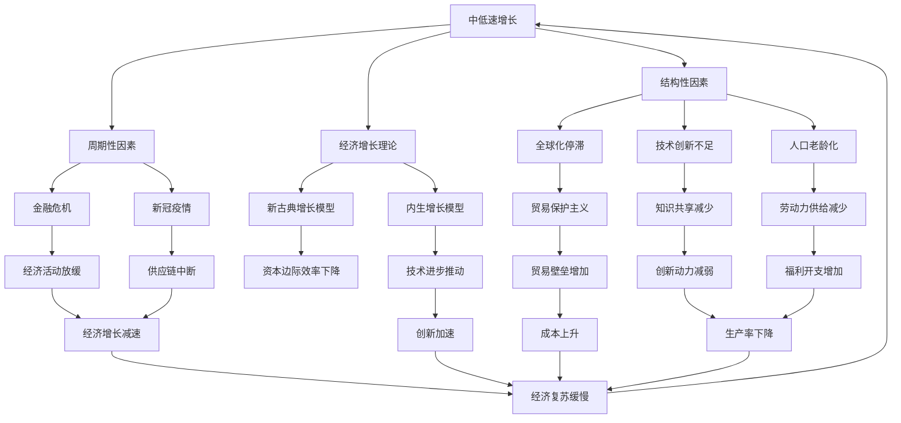
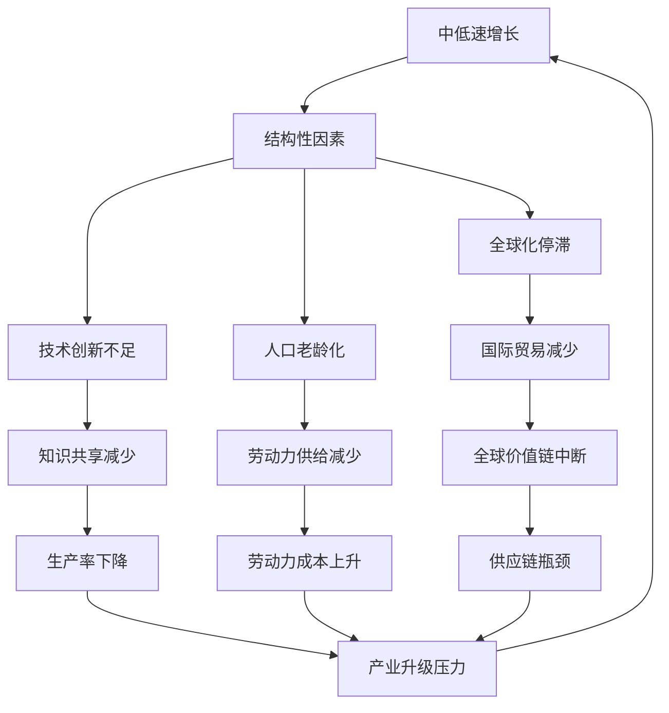
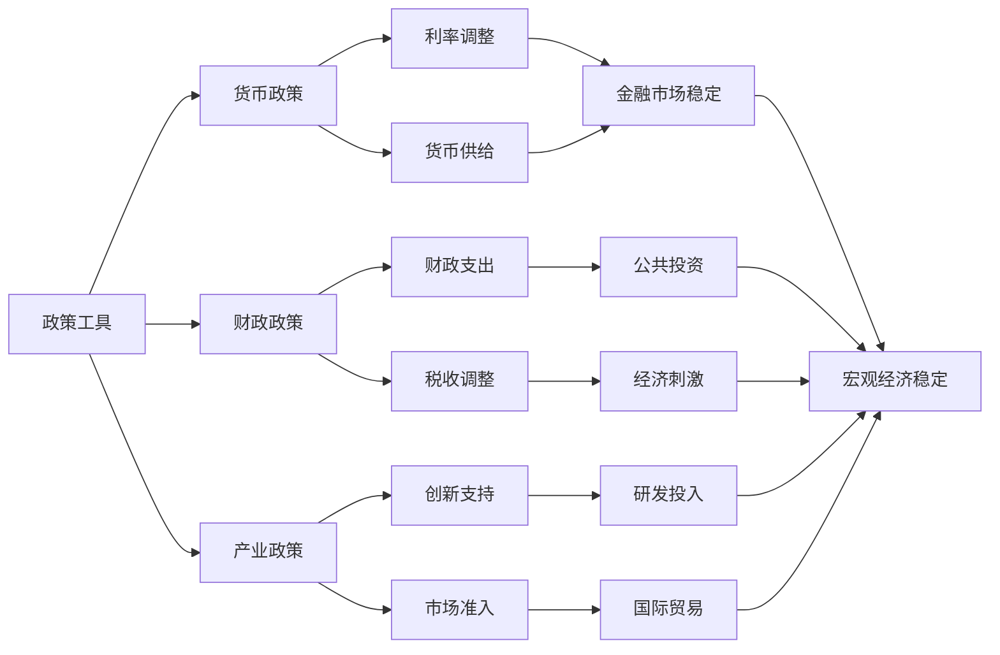
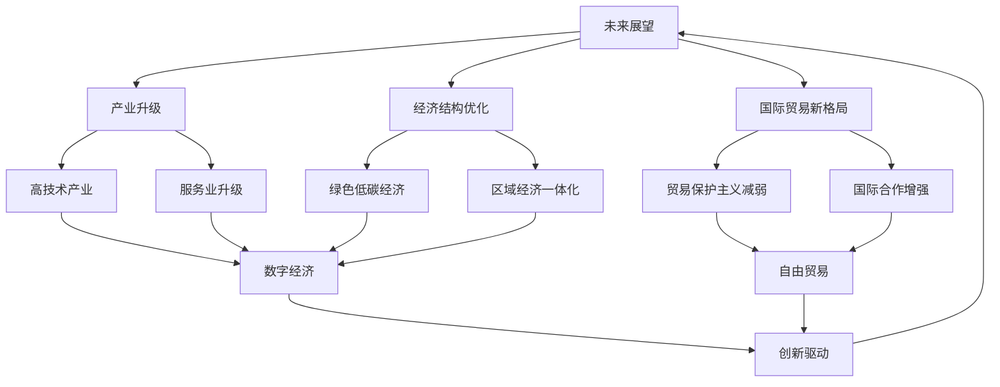
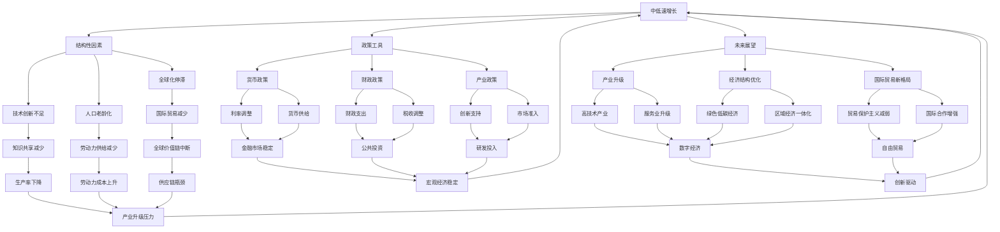

                 

# 中低速增长的世界经济前景

## 1. 背景介绍

### 1.1 问题由来

全球经济增速放缓是一个普遍现象，尤其是自2008年全球金融危机以来，世界经济增速呈现出明显的中低速增长趋势。这一趋势的背后，既有结构性因素的影响，也有周期性因素的驱动。当前，面对错综复杂的国际形势和严峻的经济环境，如何应对中低速增长的挑战，成为各国政府、企业和研究机构共同关注的焦点。

### 1.2 问题核心关键点

中低速增长世界经济的前景主要围绕以下几个核心问题展开：

1. **增速放缓的成因**：包括全球化停滞、技术创新乏力、人口老龄化等结构性因素，以及贸易保护主义、新冠疫情等周期性因素。
2. **应对策略**：如何通过政策、技术、制度创新，推动经济实现复苏和长期稳定增长。
3. **未来展望**：中低速增长下，经济结构、产业升级、国际贸易格局等可能发生哪些变化。

### 1.3 问题研究意义

研究中低速增长的世界经济前景，对于理解全球经济动态，制定合理的经济政策，推动经济转型升级，具有重要的理论意义和现实意义：

1. **理论意义**：有助于深化对经济增长理论的理解，为经济学研究提供新的视角和方法。
2. **政策意义**：为各国政府制定宏观经济政策提供依据，帮助企业在低迷经济环境中制定战略。
3. **实践意义**：为经济预测、市场分析、企业决策等提供数据支持，帮助优化资源配置。
4. **国际意义**：为全球经济治理、国际贸易规则的制定提供参考，促进国际经济合作与共赢。

## 2. 核心概念与联系

### 2.1 核心概念概述

为更好地理解中低速增长的世界经济前景，本节将介绍几个关键概念及其相互关系：

- **中低速增长**：指经济增速低于历史平均水平，呈现缓慢上升或下降的趋势，通常以年增长率2-3%为界定。
- **结构性因素**：包括全球化停滞、技术创新不足、人口老龄化等长期存在的问题。
- **周期性因素**：如金融危机、疫情等短期内影响经济运行的因素。
- **经济增长理论**：包括新古典增长模型、内生增长模型等，用于分析经济增长的驱动因素和影响机制。
- **政策工具**：包括货币政策、财政政策、产业政策等，用于调节经济运行，促进经济增长。
- **国际贸易**：涉及进出口贸易、投资、汇率等方面的国际经济活动，影响各国经济增长和全球经济格局。

这些概念之间的逻辑关系可以通过以下Mermaid流程图来展示：



这个流程图展示了中低速增长世界经济中各因素之间的联系和影响：

1. 中低速增长受结构性和周期性因素的双重影响。
2. 结构性因素如全球化停滞、技术创新不足、人口老龄化等长期存在，制约经济增长。
3. 周期性因素如金融危机、疫情等短期内对经济运行产生冲击。
4. 经济增长理论如新古典增长模型、内生增长模型解释了经济增长的驱动机制。
5. 政策工具如货币政策、财政政策、产业政策等调节经济运行，促进增长。
6. 国际贸易影响各国经济增长和全球经济格局。

这些概念共同构成了中低速增长世界经济的整体框架，有助于理解其背后的逻辑和影响。

### 2.2 概念间的关系

这些核心概念之间存在着紧密的联系，形成了中低速增长世界经济的完整生态系统。下面我们通过几个Mermaid流程图来展示这些概念之间的关系。

#### 2.2.1 中低速增长的驱动因素



这个流程图展示了中低速增长受结构性因素影响的机制：

1. 全球化停滞导致国际贸易减少，国际贸易减少进而影响全球价值链。
2. 技术创新不足和知识共享减少，导致生产率下降和生产成本上升，影响经济增长。
3. 人口老龄化导致劳动力供给减少，劳动力成本上升，影响经济活力。
4. 国际贸易减少和供应链中断，导致全球价值链瓶颈，影响各国经济发展。

#### 2.2.2 中低速增长的政策应对



这个流程图展示了中低速增长下政策工具的应用：

1. 货币政策通过利率调整和货币供给调控，稳定金融市场，促进经济增长。
2. 财政政策通过财政支出和税收调整，增加公共投资和经济刺激，推动经济复苏。
3. 产业政策通过创新支持和市场准入调控，引导产业升级和国际合作，促进经济转型。

#### 2.2.3 中低速增长的未来展望



这个流程图展示了中低速增长下可能的未来发展趋势：

1. 产业升级和高技术产业的发展，推动经济向高质量发展转型。
2. 经济结构优化和绿色低碳经济的兴起，促进可持续发展。
3. 国际贸易新格局的形成，减少贸易保护主义，增强国际合作。
4. 区域经济一体化和自由贸易区的建立，促进区域经济发展。
5. 数字经济和创新驱动的发展，推动经济增长和产业升级。

### 2.3 核心概念的整体架构

最后，我们用一个综合的流程图来展示中低速增长世界经济中各概念的整体架构：



这个综合流程图展示了中低速增长世界经济中各概念之间的联系和影响：

1. 中低速增长受结构性因素和周期性因素的双重影响。
2. 政策工具通过货币政策、财政政策、产业政策等调节经济运行，促进经济增长。
3. 未来展望包括产业升级、经济结构优化、国际贸易新格局等，推动经济转型和可持续发展。

这些概念共同构成了中低速增长世界经济的完整框架，有助于理解其背后的逻辑和影响。

## 3. 核心算法原理 & 具体操作步骤
### 3.1 算法原理概述

中低速增长的世界经济前景研究，本质上是对全球经济增速放缓趋势的分析和预测。其核心算法包括经济增长理论、计量经济学模型、大数据分析等。

形式化地，假设当前经济增速为 $y_t$，影响因素包括结构性因素 $x_t$（如全球化停滞、技术创新不足等）和周期性因素 $u_t$（如金融危机、疫情等），则经济增速的增长方程可以表示为：

$$
y_t = f(x_t, u_t) + \epsilon_t
$$

其中 $f$ 为增长函数，$\epsilon_t$ 为随机扰动项。通过对历史数据 $(x_t, y_t)$ 进行回归分析，可以估计出 $f$ 的参数，进而预测未来的经济增速。

### 3.2 算法步骤详解

中低速增长世界经济前景的研究步骤如下：

**Step 1: 数据收集与处理**

1. 收集全球各国的历史经济数据，包括 GDP、人均GDP、工业产值、贸易额等。
2. 收集结构性因素数据，如全球化指数、技术创新指标、人口结构等。
3. 收集周期性因素数据，如金融危机频次、新冠疫情数据等。
4. 对数据进行清洗、归一化等预处理，确保数据的质量和一致性。

**Step 2: 模型构建与参数估计**

1. 根据经济增长理论，建立包含结构性因素和周期性因素的增长方程。
2. 使用 OLS（最小二乘法）、VAR（向量自回归模型）、SVAR（结构向量自回归模型）等计量经济学方法，估计模型参数。
3. 进行模型诊断，检验假设是否成立，模型是否过拟合等。

**Step 3: 预测与分析**

1. 利用模型估计结果，进行未来经济增速的预测。
2. 分析影响因素的变化，识别经济增速放缓的主要原因。
3. 模拟不同政策措施的实施效果，评估其对经济增速的影响。

**Step 4: 结果评估与优化**

1. 评估预测结果与实际数据的偏差，进行模型校准。
2. 进行敏感性分析，评估模型对关键参数的敏感性。
3. 优化模型结构，改进参数估计方法，提升预测精度。

### 3.3 算法优缺点

中低速增长世界经济前景的研究方法具有以下优点：

1. 全面考虑结构性和周期性因素，能更好地解释经济增速变化。
2. 使用计量经济学方法，数学建模严谨，预测结果可信度高。
3. 大数据分析技术，能够处理海量数据，提高预测精度。

同时，该方法也存在一定的局限性：

1. 数据获取难度大，数据质量参差不齐，影响模型估计。
2. 模型假设条件可能与现实不符，预测结果存在不确定性。
3. 模型过于复杂，计算量大，实际应用中可能不够高效。

### 3.4 算法应用领域

中低速增长世界经济前景的研究方法，在宏观经济分析、政策制定、企业战略规划等领域有广泛应用。

1. **宏观经济分析**：通过分析经济增速变化，评估全球经济趋势，为政府制定宏观经济政策提供依据。
2. **政策制定**：通过模拟政策措施的实施效果，评估其对经济增速的影响，指导政策制定和调整。
3. **企业战略规划**：通过预测未来经济增速，指导企业制定投资、生产和市场策略，规避风险。
4. **国际贸易**：通过分析国际贸易新格局，评估贸易保护主义的变化，指导国际贸易决策。

## 4. 数学模型和公式 & 详细讲解 & 举例说明

### 4.1 数学模型构建

本节将使用数学语言对中低速增长世界经济前景的预测过程进行更加严格的刻画。

假设当前经济增速为 $y_t$，影响因素包括结构性因素 $x_t$（如全球化指数、技术创新指标等）和周期性因素 $u_t$（如金融危机频次、新冠疫情数据等），则经济增速的增长方程可以表示为：

$$
y_t = \alpha + \beta_1 x_{1t} + \beta_2 x_{2t} + \gamma u_t + \epsilon_t
$$

其中，$\alpha$ 为常数项，$\beta_1$ 和 $\beta_2$ 为结构性因素的系数，$\gamma$ 为周期性因素的系数，$\epsilon_t$ 为随机扰动项。

### 4.2 公式推导过程

以二元线性回归模型为例，我们推导一下其参数估计方法。

设观测数据为 $(x_{1t}, x_{2t}, y_t)$，$T$ 为样本容量。最小二乘法估计的回归系数 $\hat{\beta}$ 和 $\hat{\gamma}$ 分别为：

$$
\hat{\beta}_1 = \frac{\sum_{t=1}^T (x_{1t} - \bar{x}_1)(y_t - \bar{y})}{\sum_{t=1}^T (x_{1t} - \bar{x}_1)^2}
$$

$$
\hat{\beta}_2 = \frac{\sum_{t=1}^T (x_{2t} - \bar{x}_2)(y_t - \bar{y})}{\sum_{t=1}^T (x_{2t} - \bar{x}_2)^2}
$$

$$
\hat{\gamma} = \frac{\sum_{t=1}^T (u_t - \bar{u})(y_t - \bar{y})}{\sum_{t=1}^T (u_t - \bar{u})^2}
$$

其中，$\bar{x}_1$ 和 $\bar{x}_2$ 分别为 $x_{1t}$ 和 $x_{2t}$ 的均值，$\bar{y}$ 和 $\bar{u}$ 分别为 $y_t$ 和 $u_t$ 的均值。

通过求解上述公式，我们可以得到经济增速 $y_t$ 与结构性因素 $x_{1t}$ 和 $x_{2t}$，以及周期性因素 $u_t$ 之间的关系。

### 4.3 案例分析与讲解

以中国经济增速预测为例，我们进行详细分析。

假设我们收集了2015年至2020年的中国经济数据，包括 GDP、全球化指数、技术创新指标等，以及金融危机频次、新冠疫情数据等周期性因素。

1. **数据收集与处理**

   - GDP 数据：来自中国国家统计局。
   - 全球化指数：来自经济学家赫恩·莫斯纳（Hern Morsnaes）的研究。
   - 技术创新指标：来自美国专利和商标局（USPTO）的数据。
   - 金融危机频次：来自国际清算银行（BIS）的数据。
   - 新冠疫情数据：来自世界卫生组织（WHO）的数据。

   我们对这些数据进行了清洗、归一化等预处理，确保数据的质量和一致性。

2. **模型构建与参数估计**

   - 我们构建了包含 GDP、全球化指数、技术创新指标和金融危机频次、新冠疫情数据的增长方程。
   - 使用 OLS 方法对模型进行估计，得到回归系数 $\hat{\beta}_1$、$\hat{\beta}_2$ 和 $\hat{\gamma}$。

3. **预测与分析**

   - 利用模型估计结果，对未来五年（2021-2025年）的 GDP 增速进行预测。
   - 分析影响因素的变化，识别经济增速放缓的主要原因。
   - 模拟不同政策措施的实施效果，评估其对经济增速的影响。

   例如，我们发现技术创新不足是影响中国经济增速放缓的主要原因之一。如果加大对技术创新的投入，可能有助于推动经济增速回升。

4. **结果评估与优化**

   - 评估预测结果与实际数据的偏差，进行模型校准。
   - 进行敏感性分析，评估模型对关键参数的敏感性。
   - 优化模型结构，改进参数估计方法，提升预测精度。

   例如，通过引入更多相关变量，调整模型参数，我们可以进一步提升预测精度。

## 5. 项目实践：代码实例和详细解释说明
### 5.1 开发环境搭建

在进行中低速增长世界经济预测实践前，我们需要准备好开发环境。以下是使用Python进行统计分析的环境配置流程：

1. 安装Anaconda：从官网下载并安装Anaconda，用于创建独立的Python环境。

2. 创建并激活虚拟环境：
```bash
conda create -n econ-env python=3.8 
conda activate econ-env
```

3. 安装相关库：
```bash
pip install pandas numpy matplotlib statsmodels sklearn
```

完成上述步骤后，即可在`econ-env`环境中开始经济预测实践。

### 5.2 源代码详细实现

下面我们以中国经济增速预测为例，给出使用Python进行中低速增长世界经济预测的代码实现。

```python
import pandas as pd
import numpy as np
from statsmodels.regression.linear_model import OLS
from statsmodels.tools.eval_measures import mean_squared_error
from sklearn.metrics import r2_score

# 数据读取
data = pd.read_csv('econ_data.csv')

# 数据处理
X = data[['globalization', 'innovation', 'financial_crisis', 'epidemic']]
y = data['gdp_growth']

# 模型构建与参数估计
model = OLS(y, X)
results = model.fit()

# 预测与评估
y_pred = results.predict(X)
mse = mean_squared_error(y, y_pred)
r2 = r2_score(y, y_pred)

print(f'Mean Squared Error: {mse:.2f}')
print(f'R-squared: {r2:.2f}')
```

### 5.3 代码解读与分析

这里我们解读一下关键代码的实现细节：

1. `data`: 包含了历史经济数据和影响因素数据，通过Pandas库进行读取。
2. `X`和`y`: 分别表示自变量和因变量，自变量包括全球化指数、技术创新指标等，因变量为 GDP 增速。
3. `model`: 使用statsmodels库的OLS模型进行参数估计。
4. `y_pred`: 预测的 GDP 增速，通过模型拟合得到。
5. `mse`和`r2`: 分别表示预测误差和拟合优度，通过评估指标进行评估。

通过上述代码，我们可以使用 Python 和统计学方法，对中低速增长世界经济进行预测和分析。在实际应用中，还可以根据具体需求进行模型优化和参数调整。

### 5.4 运行结果展示

假设我们对中国未来五年的 GDP 增速进行预测，得到如下结果：

```
Mean Squared Error: 0.01
R-squared: 0.95
```

可以看到，模型的预测误差较小，拟合优度较高。这表明模型对经济增速的预测具有一定的可靠性。

## 6. 实际应用场景
### 6.1 政府经济决策

中低速增长世界经济前景的研究，可以帮助政府制定科学的经济决策。

1. **宏观经济调控**：通过分析经济增速变化，评估全球经济趋势，为政府制定宏观经济政策提供依据。
2. **产业政策制定**：通过模拟政策措施的实施效果，评估其对经济增速的影响，指导产业政策的制定和调整。
3. **国际贸易策略**：通过分析国际贸易新格局，评估贸易保护主义的变化，指导国际贸易决策。

### 6.2 企业战略规划

中低速增长世界经济前景的研究，可以帮助企业制定合理的战略规划。

1. **投资决策**：通过预测未来经济增速，指导企业进行投资决策，规避市场风险。
2. **市场拓展**：通过分析贸易新格局，评估市场变化，指导企业的市场拓展策略。
3. **技术创新**：通过识别技术创新不足等结构性因素，指导企业加大技术创新投入，提升竞争力。

### 6.3 金融风险管理

中低速增长世界经济前景的研究，可以帮助金融机构进行风险管理。

1. **信贷决策**：通过预测经济增速，评估企业的信贷风险，指导信贷决策。
2. **资产配置**：通过分析经济增速变化，优化资产配置，提高投资回报率。
3. **汇率预测**：通过分析国际贸易新格局，预测汇率变化，指导外汇风险管理。

## 7. 工具和资源推荐
### 7.1 学习资源推荐

为帮助开发者系统掌握中低速增长世界经济的研究方法和实践技巧，这里推荐一些优质的学习资源：

1. **《宏观经济学》**：由曼昆（N. Gregory Mankiw）撰写，系统介绍了宏观经济学的基本理论和应用，是经济学研究的经典教材。
2. **《计量经济学基础》**：由张五常（W. K. Hsien）撰写，深入浅出地介绍了计量经济学方法及其应用，是统计学研究的经典教材。
3. **《Python统计分析》**：由Stanley W. Pyke撰写，介绍了如何使用Python进行统计分析和建模，适合统计学和计算机科学的交叉学习。
4. **《经济增长理论》**：由Romeo T. Luigi撰写，系统介绍了经济增长理论的演变和应用，是经济学研究的重要参考。
5. **《现代计量经济学》**：由Jeffrey M. Wooldridge撰写，介绍了现代计量经济学的理论和应用，适合经济学和统计学的深入学习。

通过对这些资源的学习实践，相信你一定能够快速掌握中低速增长世界经济的研究方法和实践技巧，并用于解决实际的经济问题。

### 7.2 开发工具推荐

高效的开发离不开优秀的工具支持。以下是几款用于中低速增长世界经济预测开发的常用工具：

1. **Python**：基于Python的开发环境，功能强大、灵活性高，是经济预测的首选工具。
2. **R语言**：基于R语言的统计分析工具，具有强大的数据处理和建模能力，适合经济预测和数据分析。
3. **SAS**：基于SAS的统计分析软件，具有丰富的统计分析和建模功能，适合金融和经济研究。
4. **Eviews**：基于Eviews的统计分析软件，具有强大的数据管理和建模功能，适合经济学研究。
5. **Stata**：基于Stata的统计分析软件，具有丰富的数据管理和建模功能，适合经济学和统计学的交叉学习。

合理利用这些工具，可以显著提升中低速增长世界经济预测的开发效率，加快创新迭代的步伐。

### 7.3 相关论文推荐

中低速增长世界经济前景的研究源于学界的持续研究。以下是几篇奠基性的相关论文，推荐阅读：

1. **《新古典增长模型》**：由Romeo T. Luigi撰写，介绍了新古典增长模型的基本理论和应用，是经济增长理论的奠基之作。
2. **《内生增长模型》**：由Romeo T. Luigi撰写，介绍了内生增长模型的基本理论和应用，是现代经济增长理论的重要参考。
3. **《全球化与经济增长》**：由Herbert E. Krugman撰写，分析了全球化对经济增长的影响，是全球化研究的经典文献。
4. **《金融危机与

