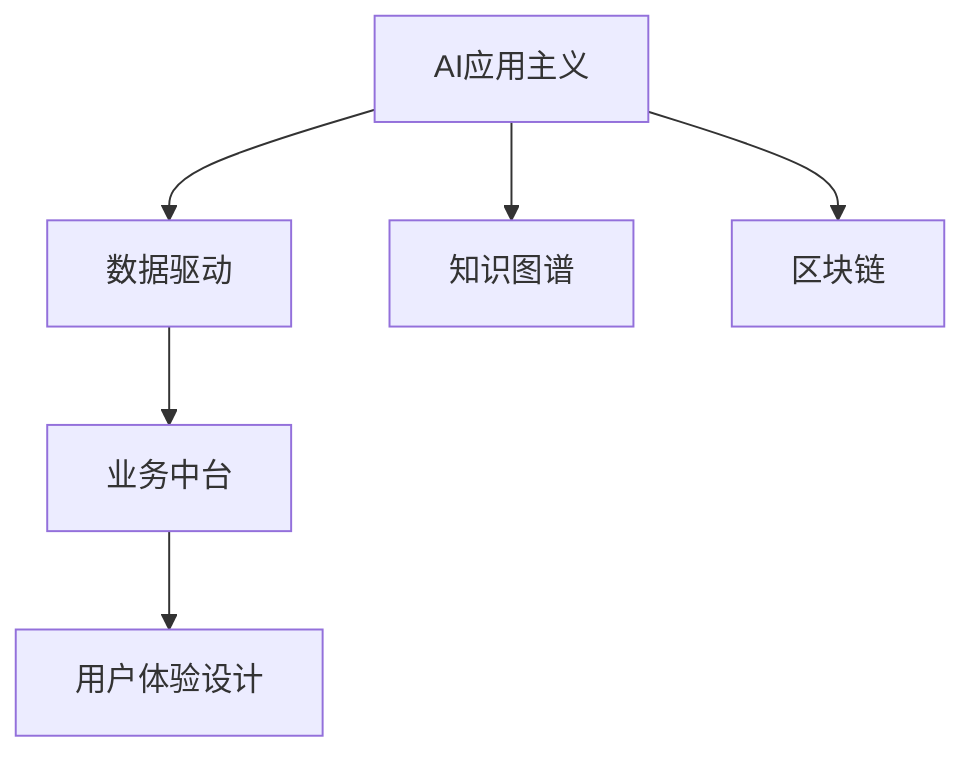
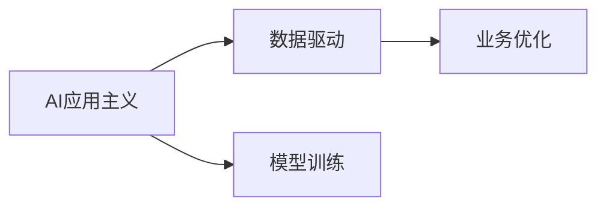
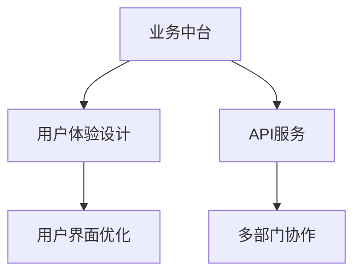
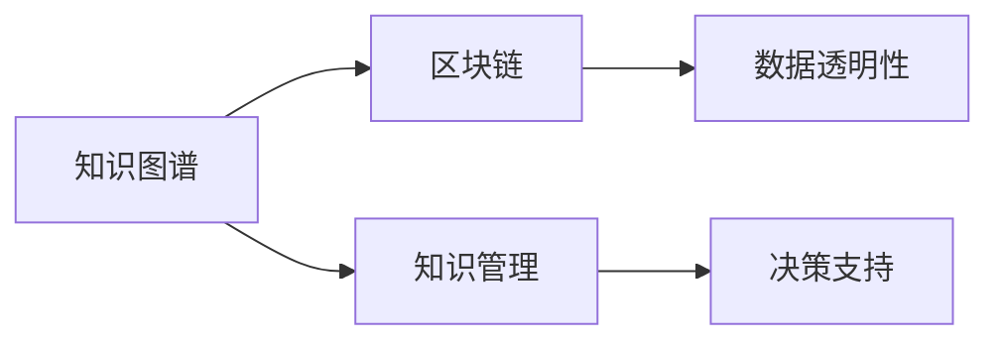
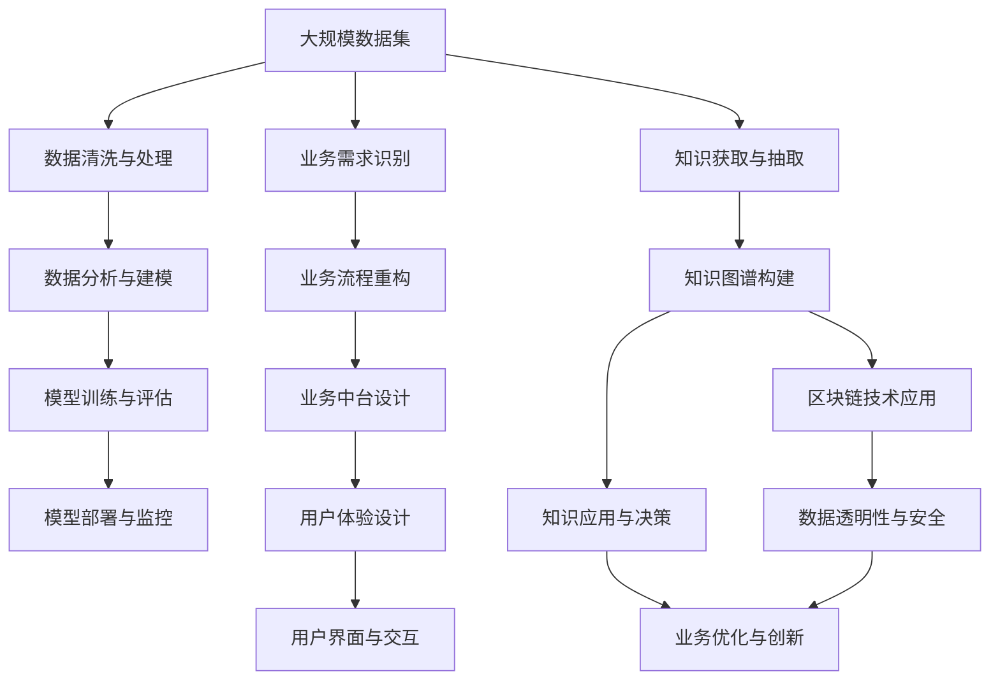

                 

# 中国企业的AI应用主义

## 1. 背景介绍

### 1.1 问题由来
在全球化竞争日益激烈的背景下，中国企业面临巨大的市场压力和转型需求。为提升企业的数字化水平和市场竞争力，越来越多的企业开始将人工智能(AI)技术引入核心业务流程中。AI应用已经成为推动中国企业转型升级的重要力量，帮助企业实现效率提升、成本降低和创新突破。

AI在中国的应用主要集中在制造业、金融、零售、医疗、交通等传统行业。在制造业，AI技术被用于智能制造、质量控制和供应链优化；在金融领域，AI被用于风险管理、客户服务和反欺诈；在零售行业，AI被用于个性化推荐、库存管理和物流优化；在医疗行业，AI被用于疾病预测、影像诊断和治疗方案推荐；在交通领域，AI被用于自动驾驶、车联网和智能交通管理。

### 1.2 问题核心关键点
中国企业在引入AI技术时，面临诸多挑战，如数据隐私保护、人才培养、技术适配和业务落地等。为了应对这些挑战，企业需要构建以应用为导向的AI战略，形成一套系统的AI应用主义方法论，以推动AI技术与业务深度融合。

本文将从背景、核心概念、算法原理、项目实践、实际应用场景和未来展望等方面，探讨中国企业如何构建AI应用主义，帮助企业实现数字化转型和智能化升级。

## 2. 核心概念与联系

### 2.1 核心概念概述

为更好地理解AI在中国企业的应用，本节将介绍几个密切相关的核心概念：

- **AI应用主义(AI Applicationism)**：强调AI技术的应用价值，从业务需求出发，设计AI解决方案，实现技术赋能和业务增值。
- **数据驱动**：指企业以数据为支撑，通过数据分析和处理，驱动业务决策和运营优化。
- **业务中台**：指将企业的业务能力封装成可复用的服务，帮助各部门共享和集成业务资源，提升业务效率。
- **用户体验设计(UXD)**：指设计符合用户需求和心理的UI/UX界面，提升用户满意度。
- **知识图谱**：指通过语义分析和关系抽取，构建知识结构化的图谱，辅助企业进行知识管理和决策。
- **区块链**：指一种去中心化的分布式账本技术，保证数据安全和透明性，被用于供应链管理和金融领域。

这些核心概念之间的逻辑关系可以通过以下Mermaid流程图来展示：



这个流程图展示了中国企业AI应用的核心概念及其之间的关系：AI应用主义驱动数据驱动，提升业务中台的灵活性和用户体验，结合知识图谱进行知识管理和决策，同时借助区块链技术保障数据安全和透明性。通过理解这些核心概念，我们可以更好地把握AI在中国企业的应用框架，为后续深入讨论提供基础。

### 2.2 概念间的关系

这些核心概念之间存在着紧密的联系，形成了中国企业AI应用的完整生态系统。下面我通过几个Mermaid流程图来展示这些概念之间的关系。

#### 2.2.1 AI应用主义与数据驱动


这个流程图展示了AI应用主义如何通过数据驱动提升业务能力。AI应用主义首先通过数据驱动确定业务需求，然后通过模型训练和优化，提升业务效率和竞争力。

#### 2.2.2 业务中台与用户体验设计


这个流程图展示了业务中台如何通过用户体验设计提升用户满意度。业务中台通过API服务封装业务能力，各部门共享和集成资源，从而提升用户体验。用户体验设计则通过优化用户界面和交互方式，提升用户的使用体验。

#### 2.2.3 知识图谱与区块链


这个流程图展示了知识图谱和区块链技术如何共同作用于企业的知识管理和决策支持。知识图谱通过语义分析和关系抽取，构建知识结构化的图谱，辅助决策支持。区块链技术则通过去中心化的分布式账本，保障数据透明性和安全性，提升企业的知识管理能力。

### 2.3 核心概念的整体架构

最后，我们用一个综合的流程图来展示这些核心概念在中国企业AI应用中的整体架构：



这个综合流程图展示了从数据采集到模型部署的完整流程，以及各个环节如何与业务需求、流程重构和知识图谱等概念紧密联系。通过这些核心概念的有机结合，企业可以更好地实现AI技术与业务融合，推动企业智能化转型。

## 3. 核心算法原理 & 具体操作步骤

### 3.1 算法原理概述

中国企业的AI应用主义，核心在于将AI技术融入企业业务流程，实现技术赋能和业务增值。这包括数据驱动的业务优化、业务中台的构建、用户体验设计的提升、知识图谱的构建与应用、区块链技术的应用等方面。

以数据驱动为例，AI应用主义主要通过以下步骤：
1. **数据收集与清洗**：通过多种方式收集企业的业务数据，并对其进行清洗和预处理。
2. **数据分析与建模**：使用统计学和机器学习技术，对数据进行分析建模，提取有用的信息和规律。
3. **模型训练与评估**：使用训练数据对模型进行训练，并通过评估指标（如精度、召回率等）评估模型性能。
4. **业务优化与创新**：将模型应用到业务流程中，优化业务流程，提升业务效率和竞争力。

### 3.2 算法步骤详解

以下是AI应用主义在数据驱动中的应用步骤：

**Step 1: 数据收集与清洗**
- 确定业务需求和数据来源，使用API、爬虫等手段收集数据。
- 对数据进行初步清洗，去除噪声和异常值，填补缺失值。

**Step 2: 数据分析与建模**
- 使用统计学和机器学习技术，对数据进行特征工程和模型选择。
- 使用监督学习、无监督学习、强化学习等算法，建立模型并进行训练。

**Step 3: 模型训练与评估**
- 使用训练数据对模型进行训练，并通过验证集评估模型性能。
- 调整模型超参数，优化模型结构，提高模型精度和泛化能力。

**Step 4: 业务优化与创新**
- 将模型应用到实际业务流程中，优化决策过程。
- 结合业务反馈，不断迭代优化模型，提升业务效率和创新能力。

### 3.3 算法优缺点

AI应用主义的优点包括：
- 数据驱动，能够根据实际业务需求和数据特点，定制化模型和算法。
- 业务中台设计，提升业务的灵活性和复用性。
- 用户体验设计，提升用户满意度和忠诚度。
- 知识图谱构建，辅助企业进行知识管理和决策。
- 区块链技术应用，保障数据透明性和安全性。

但AI应用主义也存在一些缺点：
- 数据隐私保护。在数据驱动的过程中，如何保护用户隐私和数据安全，是一个重要挑战。
- 人才培养。AI应用需要大量数据科学家和工程师，但这些人才的培养周期较长，成本较高。
- 技术适配。不同企业的业务流程和数据特点各异，AI技术如何适配这些差异，是另一个挑战。
- 业务落地。AI模型在业务场景中的落地应用，需要考虑模型解释性、用户体验、系统集成等问题。

### 3.4 算法应用领域

AI应用主义主要应用于以下几个领域：

**制造行业**
- 智能制造：通过机器学习和数据分析，优化生产流程，提升生产效率和质量。
- 质量控制：使用图像识别和深度学习技术，进行产品质量检测和缺陷分析。
- 供应链优化：使用预测分析，优化供应链管理，降低库存和运输成本。

**金融行业**
- 风险管理：使用机器学习和大数据技术，预测金融风险，进行风险控制。
- 客户服务：使用自然语言处理和聊天机器人，提升客户服务效率和满意度。
- 反欺诈：使用异常检测和分类算法，识别和防范金融欺诈行为。

**零售行业**
- 个性化推荐：使用协同过滤和推荐算法，提供个性化购物推荐。
- 库存管理：使用预测分析和优化算法，优化库存管理和补货策略。
- 物流优化：使用路线规划和调度算法，优化物流配送和运输路线。

**医疗行业**
- 疾病预测：使用机器学习和数据分析，预测疾病风险，提供个性化医疗建议。
- 影像诊断：使用深度学习和图像处理技术，进行医学影像分析。
- 治疗方案推荐：使用知识图谱和推荐算法，提供个性化治疗方案。

**交通行业**
- 自动驾驶：使用计算机视觉和深度学习技术，实现自动驾驶和车辆控制。
- 车联网：使用物联网和数据分析技术，优化车辆运行和物流管理。
- 智能交通管理：使用交通数据分析和预测，优化交通流量和路网管理。

## 4. 数学模型和公式 & 详细讲解  
### 4.1 数学模型构建

假设企业的业务数据为 $D=\{(x_i,y_i)\}_{i=1}^N$，其中 $x_i$ 为输入特征，$y_i$ 为输出标签。AI应用主义的目标是通过数据驱动的方式，训练模型 $M_{\theta}$，使得模型输出 $M_{\theta}(x_i)$ 逼近真实标签 $y_i$。

定义模型的损失函数为 $\ell(M_{\theta}(x_i),y_i)$，在数据集 $D$ 上的经验风险为：

$$
\mathcal{L}(\theta) = \frac{1}{N}\sum_{i=1}^N \ell(M_{\theta}(x_i),y_i)
$$

在训练过程中，我们使用梯度下降等优化算法，不断更新模型参数 $\theta$，最小化损失函数 $\mathcal{L}(\theta)$，直到模型收敛或达到预设迭代次数。

### 4.2 公式推导过程

以下我们以回归问题为例，推导最小二乘法的损失函数及其梯度计算公式。

假设模型 $M_{\theta}$ 为线性回归模型，输出为 $M_{\theta}(x_i) = \theta^T\phi(x_i)$，其中 $\phi(x_i)$ 为输入 $x_i$ 的特征映射。定义损失函数为均方误差损失：

$$
\ell(M_{\theta}(x_i),y_i) = \frac{1}{2}(y_i - M_{\theta}(x_i))^2
$$

则经验风险为：

$$
\mathcal{L}(\theta) = \frac{1}{N}\sum_{i=1}^N \frac{1}{2}(y_i - M_{\theta}(x_i))^2
$$

对该损失函数求梯度，得到参数 $\theta$ 的梯度：

$$
\nabla_{\theta}\mathcal{L}(\theta) = -\frac{1}{N}\sum_{i=1}^N (y_i - M_{\theta}(x_i))\phi(x_i)
$$

在训练过程中，使用梯度下降算法更新模型参数：

$$
\theta \leftarrow \theta - \eta \nabla_{\theta}\mathcal{L}(\theta)
$$

其中 $\eta$ 为学习率。通过上述公式，模型不断迭代优化，直至收敛。

### 4.3 案例分析与讲解

以制造业的质量控制为例，企业收集了生产线的传感器数据和历史质量报告，使用机器学习技术建立预测模型，用于预测生产过程中的异常情况和产品质量缺陷。

**Step 1: 数据收集与清洗**
- 收集生产线的传感器数据和历史质量报告，去除噪声和异常值。

**Step 2: 数据分析与建模**
- 对传感器数据进行特征工程，提取有用特征。
- 使用随机森林或支持向量机等算法，建立预测模型。

**Step 3: 模型训练与评估**
- 使用历史数据对模型进行训练，并通过验证集评估模型性能。
- 调整模型超参数，优化模型结构，提高模型精度和泛化能力。

**Step 4: 业务优化与创新**
- 将模型应用到实际生产流程中，实时预测产品质量，优化生产参数。
- 结合生产反馈，不断迭代优化模型，提升产品质量和生产效率。

## 5. 项目实践：代码实例和详细解释说明

### 5.1 开发环境搭建

在进行AI应用主义实践前，我们需要准备好开发环境。以下是使用Python进行Scikit-learn开发的开发环境配置流程：

1. 安装Anaconda：从官网下载并安装Anaconda，用于创建独立的Python环境。

2. 创建并激活虚拟环境：
```bash
conda create -n sklearn-env python=3.7 
conda activate sklearn-env
```

3. 安装Scikit-learn：
```bash
pip install scikit-learn
```

4. 安装其他必要工具：
```bash
pip install numpy pandas matplotlib seaborn jupyter notebook
```

完成上述步骤后，即可在`sklearn-env`环境中开始AI应用主义的实践。

### 5.2 源代码详细实现

以下是一个使用Scikit-learn进行回归问题建模的代码实现：

```python
import numpy as np
import pandas as pd
from sklearn.model_selection import train_test_split
from sklearn.linear_model import LinearRegression
from sklearn.metrics import mean_squared_error

# 加载数据
data = pd.read_csv('data.csv')

# 特征工程
X = data[['feature1', 'feature2', 'feature3']]
y = data['target']

# 数据划分
X_train, X_test, y_train, y_test = train_test_split(X, y, test_size=0.2, random_state=42)

# 模型训练
model = LinearRegression()
model.fit(X_train, y_train)

# 模型评估
y_pred = model.predict(X_test)
mse = mean_squared_error(y_test, y_pred)
print(f'MSE: {mse:.2f}')
```

在这个代码示例中，我们使用了Scikit-learn的线性回归模型进行回归问题的建模。首先加载数据并进行特征工程，然后使用train_test_split函数将数据划分为训练集和测试集。接着使用LinearRegression模型进行训练，并通过mean_squared_error函数计算模型在测试集上的均方误差。

### 5.3 代码解读与分析

让我们再详细解读一下关键代码的实现细节：

**数据加载与预处理**
- `pd.read_csv('data.csv')`：使用pandas库加载数据文件。
- `X = data[['feature1', 'feature2', 'feature3']]`：提取输入特征。
- `y = data['target']`：提取输出标签。

**模型训练**
- `model = LinearRegression()`：初始化线性回归模型。
- `model.fit(X_train, y_train)`：使用训练数据对模型进行训练。

**模型评估**
- `y_pred = model.predict(X_test)`：使用训练好的模型对测试集进行预测。
- `mean_squared_error(y_test, y_pred)`：计算均方误差。

**输出结果**
- `print(f'MSE: {mse:.2f}')`：输出模型在测试集上的均方误差。

可以看到，Scikit-learn库的API简单易用，能够快速实现回归问题的建模和评估。但实际的AI应用主义实践往往比这复杂得多，需要考虑数据清洗、特征工程、模型选择、超参数调优等多个环节。

## 6. 实际应用场景

### 6.1 智能制造
在制造业，AI应用主义被广泛应用于智能制造、质量控制和供应链优化等方面。

以智能制造为例，企业通过传感器、摄像头等设备收集生产数据，使用机器学习和数据分析技术，实时监控生产流程，预测设备故障和生产异常，优化生产参数，提升生产效率和质量。例如，通过预测设备故障，企业可以提前进行维护，避免生产中断；通过预测生产异常，企业可以及时调整生产流程，提高产品良率。

### 6.2 金融风险管理
在金融领域，AI应用主义被用于风险管理、客户服务和反欺诈等方面。

以风险管理为例，企业收集金融数据，使用机器学习和大数据分析技术，预测金融风险，进行风险控制。例如，通过预测信用风险，企业可以识别高风险客户，进行风险预警和信用评估；通过预测市场风险，企业可以调整投资组合，降低投资风险。

### 6.3 零售个性化推荐
在零售行业，AI应用主义被用于个性化推荐、库存管理和物流优化等方面。

以个性化推荐为例，企业收集用户浏览、购买、评价等数据，使用协同过滤和推荐算法，提供个性化购物推荐。例如，通过分析用户历史行为，企业可以推荐用户可能感兴趣的商品，提升用户购买率和满意度；通过实时更新推荐算法，企业可以动态调整推荐策略，提高推荐效果。

### 6.4 医疗疾病预测
在医疗行业，AI应用主义被用于疾病预测、影像诊断和治疗方案推荐等方面。

以疾病预测为例，企业收集患者数据，使用机器学习和数据分析技术，预测疾病风险，提供个性化医疗建议。例如，通过预测疾病风险，企业可以识别高风险患者，进行早期干预和预防；通过预测疾病发展趋势，企业可以制定个性化的治疗方案，提高治疗效果。

### 6.5 交通智能交通管理
在交通领域，AI应用主义被用于自动驾驶、车联网和智能交通管理等方面。

以智能交通管理为例，企业收集交通数据，使用交通数据分析和预测技术，优化交通流量和路网管理。例如，通过预测交通流量，企业可以调整交通信号灯，优化交通流量；通过预测交通拥堵，企业可以调整道路施工，缓解交通压力。

## 7. 工具和资源推荐
### 7.1 学习资源推荐

为了帮助开发者系统掌握AI应用主义的理论基础和实践技巧，这里推荐一些优质的学习资源：

1. 《深度学习》系列书籍：由Ian Goodfellow等作者撰写，详细介绍了深度学习的基本概念和前沿技术，是AI学习的必读书籍。

2. 《Python机器学习》书籍：由Sebastian Raschka撰写，介绍了机器学习算法和Python编程，适合初学者入门。

3. 《数据科学与机器学习》课程：由Johns Hopkins大学提供，通过大规模在线课程(MOOC)的形式，系统讲解数据科学与机器学习的基本概念和实践技巧。

4. Kaggle数据科学竞赛：Kaggle是一个数据科学竞赛平台，提供大量数据集和模型竞赛，适合学习者锻炼实战能力。

5. Coursera深度学习课程：由Coursera提供，由Ian Goodfellow等知名专家授课，介绍深度学习的前沿技术，适合进阶学习。

通过对这些资源的学习实践，相信你一定能够快速掌握AI应用主义的精髓，并用于解决实际的AI问题。

### 7.2 开发工具推荐

高效的开发离不开优秀的工具支持。以下是几款用于AI应用主义开发的常用工具：

1. PyTorch：基于Python的开源深度学习框架，灵活动态的计算图，适合快速迭代研究。

2. TensorFlow：由Google主导开发的开源深度学习框架，生产部署方便，适合大规模工程应用。

3. Scikit-learn：基于Python的机器学习库，提供了丰富的算法和模型，适合快速实现和评估。

4. Jupyter Notebook：一个交互式的笔记本环境，支持Python、R等多种编程语言，适合数据科学和机器学习任务。

5. Apache Spark：一个分布式计算框架，支持大数据处理和机器学习算法，适合大规模数据集的分析和建模。

6. Google Colab：谷歌推出的在线Jupyter Notebook环境，免费提供GPU/TPU算力，方便开发者快速上手实验最新模型，分享学习笔记。

合理利用这些工具，可以显著提升AI应用主义的开发效率，加快创新迭代的步伐。

### 7.3 相关论文推荐

AI应用主义的研究源于学界的持续研究。以下是几篇奠基性的相关论文，推荐阅读：

1. 《深度学习》(Deep Learning)：Ian Goodfellow等作者，介绍了深度学习的基本概念和前沿技术，是AI学习的必读书籍。

2. 《机器学习》(Machine Learning)：Tom Mitchell撰写，介绍了机器学习算法和应用，是AI学习的重要参考。

3. 《Python机器学习》(Python Machine Learning)：Sebastian Raschka撰写，介绍了机器学习算法和Python编程，适合初学者入门。

4. 《数据分析与统计学习》(Statistical Learning)：Peter Flom和Gary King撰写，介绍了统计学习的基本概念和应用，适合统计学和机器学习交叉领域的学习。

5. 《机器学习实战》(Machine Learning in Action)：Peter Harrington撰写，介绍了机器学习算法的实现和应用，适合实践操作。

这些论文代表了大数据和机器学习技术的发展脉络。通过学习这些前沿成果，可以帮助研究者把握学科前进方向，激发更多的创新灵感。

除上述资源外，还有一些值得关注的前沿资源，帮助开发者紧跟AI应用主义技术的最新进展，例如：

1. arXiv论文预印本：人工智能领域最新研究成果的发布平台，包括大量尚未发表的前沿工作，学习前沿技术的必读资源。

2. 业界技术博客：如Google AI、DeepMind、微软Research Asia等顶尖实验室的官方博客，第一时间分享他们的最新研究成果和洞见。

3. 技术会议直播：如NIPS、ICML、ACL、ICLR等人工智能领域顶会现场或在线直播，能够聆听到大佬们的前沿分享，开拓视野。

4. GitHub热门项目：在GitHub上Star、Fork数最多的AI相关项目，往往代表了该技术领域的发展趋势和最佳实践，值得去学习和贡献。

5. 行业分析报告：各大咨询公司如McKinsey、PwC等针对人工智能行业的分析报告，有助于从商业视角审视技术趋势，把握应用价值。

总之，对于AI应用主义的学习和实践，需要开发者保持开放的心态和持续学习的意愿。多关注前沿资讯，多动手实践，多思考总结，必将收获满满的成长收益。

## 8. 总结：未来发展趋势与挑战

### 8.1 总结

本文对AI应用主义进行了全面系统的介绍。首先阐述了AI应用主义在中国企业的应用背景和意义，明确了AI技术的应用价值和业务赋能目标。其次，从原理到实践，详细讲解了AI应用主义的基本步骤和关键技术，给出了AI应用主义的代码实现和案例分析。同时，本文还广泛探讨了AI应用主义在智能制造、金融风险管理、零售个性化推荐、医疗疾病预测和交通智能交通管理等多个领域的应用前景，展示了AI应用主义的巨大潜力。此外，本文精选了AI应用主义的各类学习资源，力求为读者提供全方位的技术指引。

通过本文的系统梳理，可以看到，AI应用主义在中国企业中的应用前景广阔，有助于企业实现数字化转型和智能化升级。但同时也需要企业面临数据隐私保护、人才培养、技术适配和业务落地等诸多挑战，需要从数据、算法、工程、业务等多个维度协同发力，才能真正实现AI技术在垂直行业的规模化落地。

### 8.2 未来发展趋势

展望未来，AI应用主义在中国企业中的应用将呈现以下几个发展趋势：

1. 数据驱动的深度融合。AI应用主义将更加注重数据驱动，通过数据驱动业务优化，实现技术赋能和业务增值。

2. 业务中台的广泛应用。随着AI应用主义的普及，业务中台将广泛应用于各个行业，提升业务灵活性和复用性。

3. 用户体验设计的优化提升。AI应用主义将进一步提升用户体验设计的水平，提升用户满意度和忠诚度。

4. 知识图谱的广泛应用。AI应用主义将广泛应用知识图谱技术，辅助企业进行知识管理和决策。

5. 区块链技术的应用推广。AI应用主义将更多地应用区块链技术，保障数据透明性和安全性。

以上趋势凸显了AI应用主义在中国企业的应用前景。这些方向的探索发展，必将进一步提升AI技术与业务融合的深度，推动企业智能化转型和数字化升级。

### 8.3 面临的挑战

尽管AI应用主义已经取得了诸多进展，但在迈向更加智能化、普适化应用的过程中，它仍面临着诸多挑战：

1. 数据隐私保护。在数据驱动的过程中，如何保护用户隐私和数据安全，是一个重要挑战。

2. 人才培养。AI应用主义需要大量数据科学家和工程师，但这些人才的培养周期较长，成本较高。

3. 技术适配。不同企业的业务流程和数据特点各异，AI技术如何适配这些差异，是另一个挑战。

4. 业务落地。AI模型在业务场景中的落地应用，需要考虑模型解释性、用户体验、系统集成等问题。

5. 数据治理。AI应用主义需要大量高质量的数据，如何获取和管理这些数据，是一个重要挑战。

6. 模型解释性。AI应用主义需要具备较强的模型解释性，如何提高模型的可解释性和透明性，是一个重要研究方向。

7. 安全防护。AI应用主义需要具备较强的安全防护能力，如何防范模型攻击和数据泄漏，是一个重要研究方向。

8. 伦理道德。AI应用主义需要具备较强的伦理道德约束，如何避免偏见

