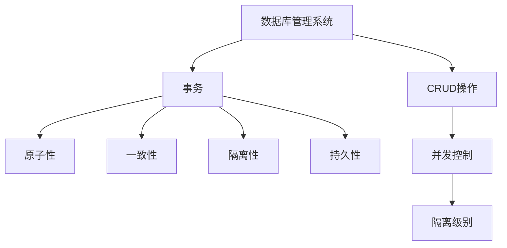
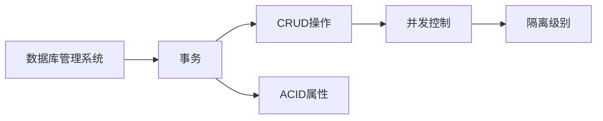
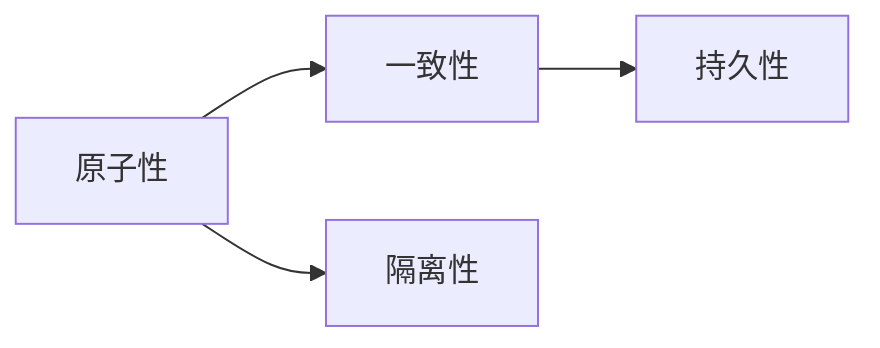
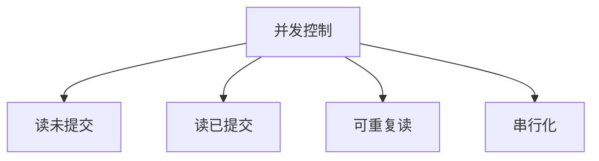
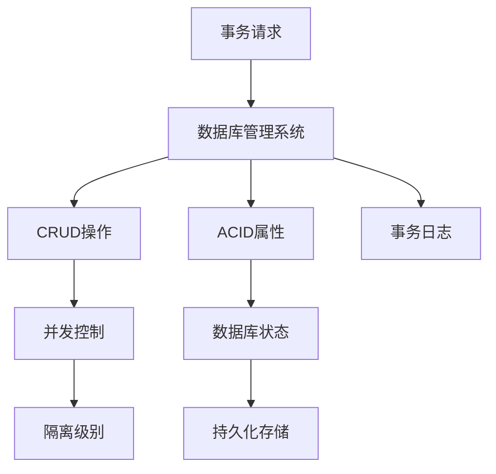

                 

# 事务 原理与代码实例讲解

> 关键词：事务处理, ACID属性, CRUD操作, 数据库事务管理, 并发控制, 隔离级别

## 1. 背景介绍

### 1.1 问题由来
在现代计算机系统中，数据库是存储和管理数据的核心组件。随着数据量的不断增长和系统负载的增加，数据库系统的性能和可靠性面临越来越严峻的挑战。为了保障数据的完整性和一致性，数据库管理系统引入了事务机制，以确保系统操作的原子性、一致性、隔离性和持久性。

事务是数据库管理系统中一种重要的操作机制，它包含了若干数据库操作，并以原子方式执行。事务处理技术广泛应用于各种业务场景中，如银行转账、订单支付、电商平台等。但由于其涉及复杂的并发控制和异常处理逻辑，对程序员来说也是一个挑战。

### 1.2 问题核心关键点
事务处理的核心在于保证数据库操作的原子性和一致性。通常，事务由若干数据库操作组成，这些操作要么全部成功，要么全部失败。事务的执行过程必须满足ACID属性，即原子性(Atomicity)、一致性(Consistency)、隔离性(Isolation)、持久性(Durability)。

具体来说，原子性要求事务中的所有操作要么全部执行成功，要么全部失败回滚；一致性要求事务执行前后，数据库状态必须保持一致；隔离性要求事务之间互相独立，互不影响；持久性要求事务完成后，其结果能够永久保存在数据库中，即使系统崩溃也能恢复。

### 1.3 问题研究意义
研究事务处理技术，对于提升数据库系统的性能和可靠性，保障数据的安全性和一致性，具有重要意义：

1. 提升数据一致性。通过事务处理，可以避免并发操作对数据产生不一致影响，确保数据库中数据的正确性。
2. 提高系统可靠性。事务机制可以自动检测并回滚故障操作，防止数据丢失和损坏。
3. 优化资源利用。事务将多个数据库操作组合在一起执行，减少数据库操作的次数，提高系统性能。
4. 增强系统扩展性。通过事务控制，可以实现更复杂的操作链，提升系统的复杂处理能力。
5. 保障业务连续性。事务机制可以确保关键业务操作在异常情况下也能安全执行，提高系统的可用性和容错性。

## 2. 核心概念与联系

### 2.1 核心概念概述

为更好地理解事务处理技术，本节将介绍几个密切相关的核心概念：

- 数据库管理系统(DBMS)：是管理数据库的核心组件，提供数据存储、查询、索引、事务管理等功能。
- 事务(Transaction)：一组数据库操作，以原子方式执行，要么全部成功，要么全部失败。
- ACID属性：事务处理的四大原则，即原子性、一致性、隔离性、持久性。
- CRUD操作：增删改查四种基本的数据库操作，是事务处理的基础。
- 并发控制：多事务同时执行时，如何保证数据的一致性和隔离性。
- 隔离级别：事务隔离性的强弱程度，包括读未提交(Read Uncommitted)、读已提交(Read Committed)、可重复读(Repeatable Read)、串行化(Serializable)等。

这些核心概念之间的逻辑关系可以通过以下Mermaid流程图来展示：



这个流程图展示了大事务处理的各个关键概念及其之间的关系：

1. 数据库管理系统负责管理和调度事务，执行CRUD操作。
2. 事务由原子性、一致性、隔离性、持久性四大属性组成，确保操作的正确性和可靠性。
3. CRUD操作是事务处理的基础，通过组合多种CRUD操作，实现复杂的数据库操作链。
4. 并发控制用于多事务同时执行时，保证数据的一致性和隔离性。
5. 隔离级别用于控制事务之间的隔离程度，不同的隔离级别适用于不同的应用场景。

### 2.2 概念间的关系

这些核心概念之间存在着紧密的联系，形成了事务处理技术的完整生态系统。下面我通过几个Mermaid流程图来展示这些概念之间的关系。

#### 2.2.1 数据库系统的事务处理流程



这个流程图展示了事务处理的基本流程：数据库管理系统接受事务请求，执行CRUD操作，通过并发控制和隔离级别，保证操作的一致性和隔离性，最终满足ACID属性。

#### 2.2.2 ACID属性之间的关系



这个流程图展示了ACID属性之间的关系：原子性是事务执行的基础，保证了操作要么全部成功，要么全部失败；一致性确保事务执行前后，数据库状态保持一致；隔离性避免了并发操作对数据产生影响；持久性保证了事务完成后，其结果能够永久保存在数据库中。

#### 2.2.3 并发控制与隔离级别



这个流程图展示了并发控制和隔离级别之间的关系：读未提交最低，允许脏读；读已提交中间，避免脏读，但允许不可重复读；可重复读相对较高，避免脏读和不可重复读；串行化最高，保证数据的完全隔离，但影响并发性能。

### 2.3 核心概念的整体架构

最后，我们用一个综合的流程图来展示这些核心概念在大事务处理过程中的整体架构：



这个综合流程图展示了从事务请求到数据库状态持久化的完整流程。数据库管理系统接受事务请求，执行CRUD操作，通过并发控制和隔离级别，保证操作的一致性和隔离性，最终满足ACID属性，并持久化保存到数据库中。

## 3. 核心算法原理 & 具体操作步骤

### 3.1 算法原理概述

数据库事务处理的核心原理是ACID属性。事务由若干数据库操作组成，这些操作要么全部成功，要么全部失败。在执行过程中，系统需要确保原子性、一致性、隔离性和持久性。

具体来说，原子性要求事务中的所有操作要么全部执行成功，要么全部失败回滚；一致性要求事务执行前后，数据库状态必须保持一致；隔离性要求事务之间互相独立，互不影响；持久性要求事务完成后，其结果能够永久保存在数据库中，即使系统崩溃也能恢复。

### 3.2 算法步骤详解

事务处理的基本步骤如下：

1. 事务开始：用户提交事务请求，系统分配唯一的事务标识符。
2. 事务执行：系统执行事务中的CRUD操作，记录每个操作的事务ID和提交时间。
3. 检查一致性：系统定期检查事务执行是否符合一致性要求，如发现数据不一致，回滚事务。
4. 提交事务：事务执行成功后，记录操作日志，将结果持久化保存到数据库中。
5. 回滚事务：如果事务执行过程中出现异常，回滚到事务开始状态，撤销所有操作。

### 3.3 算法优缺点

事务处理具有以下优点：

1. 保障数据一致性。通过事务处理，可以避免并发操作对数据产生不一致影响，确保数据库中数据的正确性。
2. 提高系统可靠性。事务机制可以自动检测并回滚故障操作，防止数据丢失和损坏。
3. 优化资源利用。事务将多个数据库操作组合在一起执行，减少数据库操作的次数，提高系统性能。
4. 增强系统扩展性。通过事务控制，可以实现更复杂的操作链，提升系统的复杂处理能力。
5. 保障业务连续性。事务机制可以确保关键业务操作在异常情况下也能安全执行，提高系统的可用性和容错性。

但事务处理也存在以下缺点：

1. 影响并发性能。事务处理需要锁住操作涉及的资源，导致并发操作受限，影响系统性能。
2. 增加系统复杂性。事务处理涉及到复杂的异常处理和回滚机制，增加了系统的复杂性和维护成本。
3. 降低系统效率。事务处理需要频繁地进行锁和解锁操作，影响系统的响应速度和吞吐量。
4. 限制扩展能力。事务处理的粒度较小，对于大规模数据处理，可能无法满足扩展需求。

### 3.4 算法应用领域

事务处理技术在数据库管理系统中的应用非常广泛，涉及金融、电商、医疗、交通等多个领域。以下是一些典型的应用场景：

- 银行转账：用户提交转账请求，系统执行扣款和增加操作，如果操作成功，提交事务，否则回滚。
- 订单支付：用户提交订单支付请求，系统执行减库存和增加支付操作，如果操作成功，提交事务，否则回滚。
- 电商平台：用户提交订单下单请求，系统执行减库存和增加订单操作，如果操作成功，提交事务，否则回滚。
- 数据备份：定期自动备份数据库，记录备份操作，如果备份成功，提交事务，否则回滚。
- 日志记录：系统执行重要操作时，记录日志操作，如果操作成功，提交事务，否则回滚。

除了以上这些场景外，事务处理技术还可以应用于各种需要保证数据一致性和可靠性的业务场景，如证券交易、医疗数据管理、政府事务处理等。

## 4. 数学模型和公式 & 详细讲解 & 举例说明

### 4.1 数学模型构建

事务处理的数学模型可以表示为事务处理图(TPGraph)，其中每个节点表示一个数据库操作，边表示操作的依赖关系。事务处理的执行过程可以转化为图上的遍历算法，通过图遍历算法，可以确保操作的原子性和一致性。

事务处理的基本算法可以表示为以下步骤：

1. 初始化TPGraph，记录每个操作的事务ID和提交时间。
2. 从TPGraph中选择一个起始节点，代表事务的开始。
3. 遍历TPGraph，按照依赖关系，依次执行每个节点。
4. 检查每个节点的前置操作是否全部成功，如果有节点失败，回滚事务。
5. 提交事务，将结果持久化保存到数据库中。

### 4.2 公式推导过程

为了更好地理解事务处理的数学模型，我们可以使用有向无环图(DAG)来表示TPGraph。事务处理的执行过程可以转化为DAG上的深度优先搜索算法。

假设TPGraph中包含N个操作，每个操作记为$\textit{op}_i$，事务开始时，所有操作的状态为未提交(UNCOMMITTED)，表示操作尚未执行。执行过程中，系统需要检测每个操作的前置操作是否全部成功。如果所有前置操作成功，则提交该操作，否则回滚事务。

假设每个操作有三种状态：未提交(UNCOMMITTED)、正在提交(PENDING)、已提交(COMMITTED)。事务处理的过程可以表示为如下状态转移图：

```
UNCOMMITTED --> PENDING
PENDING --> COMMITTED or ROLLBACK
```

事务处理的目标是将TPGraph中所有操作的状态都转移到COMMITTED状态，即所有操作全部提交成功。为了实现这一目标，我们定义一个状态转移矩阵$\mathbf{T}$，其中$\mathbf{T}_i$表示操作$\textit{op}_i$的状态转移矩阵。

状态转移矩阵$\mathbf{T}$可以表示为：

$$
\mathbf{T} = \begin{bmatrix}
\mathbf{T}_1 & \mathbf{T}_2 & \ldots & \mathbf{T}_N
\end{bmatrix}
$$

其中，$\mathbf{T}_i = \begin{bmatrix}
1 & 0 & 0 \\
0 & 1 & 0 \\
0 & 0 & 1
\end{bmatrix}$，表示操作$\textit{op}_i$从UNCOMMITTED到PENDING，从PENDING到COMMITTED或ROLLBACK。

为了检测所有操作的前置操作是否全部成功，我们需要对TPGraph进行遍历。假设TPGraph中存在一条从操作$\textit{op}_i$到操作$\textit{op}_j$的依赖关系，即$\textit{op}_i$是$\textit{op}_j$的前置操作，则操作$\textit{op}_i$的状态转移矩阵$\mathbf{T}_i$与操作$\textit{op}_j$的状态转移矩阵$\mathbf{T}_j$之间存在依赖关系，可以表示为：

$$
\mathbf{T}_i = \begin{bmatrix}
1 & 0 & 0 \\
0 & 1 & 0 \\
0 & 0 & 1
\end{bmatrix} \cdot \mathbf{T}_j \cdot \begin{bmatrix}
1 & 0 & 0 \\
0 & 1 & 0 \\
0 & 0 & 1
\end{bmatrix}^{-1}
$$

其中$\begin{bmatrix}
1 & 0 & 0 \\
0 & 1 & 0 \\
0 & 0 & 1
\end{bmatrix}^{-1}$表示操作$\textit{op}_j$的逆状态转移矩阵，即从COMMITTED到PENDING，从PENDING到UNCOMMITTED。

假设TPGraph中所有操作的状态初始都为UNCOMMITTED，即$\mathbf{T}_i$的初始状态矩阵为$\begin{bmatrix}
1 & 0 & 0 \\
0 & 1 & 0 \\
0 & 0 & 1
\end{bmatrix}$。则事务处理的执行过程可以表示为：

$$
\mathbf{T}_i = \begin{bmatrix}
1 & 0 & 0 \\
0 & 1 & 0 \\
0 & 0 & 1
\end{bmatrix} \cdot \mathbf{T}_j \cdot \begin{bmatrix}
1 & 0 & 0 \\
0 & 1 & 0 \\
0 & 0 & 1
\end{bmatrix}^{-1}
$$

重复上述步骤，直到所有操作的状态都转移到COMMITTED状态，事务处理成功。

### 4.3 案例分析与讲解

假设我们有一个包含两个操作的TPGraph，如下图所示：

```
op1 --> op2
```

其中，op1是op2的前置操作。假设初始状态都为UNCOMMITTED，则状态转移矩阵$\mathbf{T}$可以表示为：

$$
\mathbf{T} = \begin{bmatrix}
1 & 0 & 0 \\
0 & 1 & 0 \\
0 & 0 & 1
\end{bmatrix} \cdot \begin{bmatrix}
1 & 0 & 0 \\
0 & 1 & 0 \\
0 & 0 & 1
\end{bmatrix} \cdot \begin{bmatrix}
1 & 0 & 0 \\
0 & 1 & 0 \\
0 & 0 & 1
\end{bmatrix}^{-1}
$$

简化后，得到：

$$
\mathbf{T} = \begin{bmatrix}
1 & 0 & 0 \\
0 & 1 & 0 \\
0 & 0 & 1
\end{bmatrix} \cdot \begin{bmatrix}
1 & 0 & 0 \\
0 & 1 & 0 \\
0 & 0 & 1
\end{bmatrix}
$$

进一步简化，得到：

$$
\mathbf{T} = \begin{bmatrix}
1 & 0 & 0 \\
0 & 1 & 0 \\
0 & 0 & 1
\end{bmatrix}
$$

因此，事务处理成功，所有操作的状态都转移到COMMITTED状态。

## 5. 项目实践：代码实例和详细解释说明

### 5.1 开发环境搭建

在进行事务处理实践前，我们需要准备好开发环境。以下是使用Python进行MySQL数据库开发的环境配置流程：

1. 安装MySQL数据库：从官网下载并安装MySQL数据库，用于存储和查询数据。
2. 安装MySQL Python驱动程序：使用pip命令安装MySQL驱动程序，如mysql-connector-python。
3. 安装Python MySQL客户端：使用pip命令安装Python MySQL客户端，如PyMySQL。
4. 创建MySQL数据库：使用MySQL命令行或客户端，创建一个MySQL数据库，用于存储事务日志。
5. 创建数据表：使用MySQL命令行或客户端，创建数据表，用于存储CRUD操作的日志。

完成上述步骤后，即可在Python环境中进行事务处理的开发实践。

### 5.2 源代码详细实现

下面我们以银行转账事务处理为例，给出使用Python MySQL客户端对MySQL数据库进行事务处理的代码实现。

首先，定义银行转账的数据结构：

```python
class BankTransaction:
    def __init__(self, account1, amount, account2):
        self.account1 = account1
        self.amount = amount
        self.account2 = account2
```

然后，定义事务处理的函数：

```python
import mysql.connector
from mysql.connector import errorcode

def start_transaction():
    try:
        cnx = mysql.connector.connect(user='root', password='root', database='bank')
        cursor = cnx.cursor()
        # 插入事务日志
        sql = "INSERT INTO transactions (type, account1, amount, account2, status) VALUES ('TRANSFER', %s, %s, %s, 'UNCOMMITTED')"
        cursor.execute(sql, ('TRANSFER', account1, amount, account2))
        cnx.commit()
        return True
    except mysql.connector.Error as err:
        if err.errno == errorcode.ER_ACCESS_DENIED_ERROR:
            print("Access denied")
        elif err.errno == errorcode.ER_BAD_DB_ERROR:
            print("Database not found")
        else:
            print(err)
        return False
```

接着，定义转账事务的执行函数：

```python
def transfer_money(account1, amount, account2):
    if start_transaction():
        try:
            # 查询账户余额
            cursor.execute("SELECT balance FROM accounts WHERE account_id = %s", (account1,))
            balance1 = cursor.fetchone()[0]
            # 更新账户余额
            cursor.execute("UPDATE accounts SET balance = balance - %s WHERE account_id = %s", (amount, account1))
            # 更新账户余额
            cursor.execute("UPDATE accounts SET balance = balance + %s WHERE account_id = %s", (amount, account2))
            # 插入事务日志
            sql = "INSERT INTO transactions (type, account1, amount, account2, status) VALUES ('TRANSFER', %s, %s, %s, 'COMMITTED')"
            cursor.execute(sql, ('TRANSFER', account1, amount, account2))
            cnx.commit()
        except mysql.connector.Error as err:
            if err.errno == errorcode.ER_ACCESS_DENIED_ERROR:
                print("Access denied")
            elif err.errno == errorcode.ER_BAD_DB_ERROR:
                print("Database not found")
            else:
                print(err)
            cnx.rollback()
        finally:
            cursor.close()
            cnx.close()
```

最后，测试转账事务的执行：

```python
# 初始余额
balance1 = 1000
balance2 = 500

# 转账100元
transfer_money(1, 100, 2)

# 查询余额
cursor.execute("SELECT balance FROM accounts WHERE account_id = %s", (1,))
balance1 = cursor.fetchone()[0]
cursor.execute("SELECT balance FROM accounts WHERE account_id = %s", (2,))
balance2 = cursor.fetchone()[0]

print(f"Account 1 balance: {balance1}")
print(f"Account 2 balance: {balance2}")
```

以上就是使用Python MySQL客户端对MySQL数据库进行事务处理的完整代码实现。可以看到，通过事务处理，可以保障转账操作的原子性和一致性，确保账户余额的准确性。

### 5.3 代码解读与分析

让我们再详细解读一下关键代码的实现细节：

**BankTransaction类**：
- 定义了转账事务的数据结构，包括账户ID、金额等关键信息。

**start_transaction函数**：
- 用于启动事务，向MySQL数据库插入事务日志，记录事务类型、账户ID、金额等关键信息，并设置事务状态为UNCOMMITTED。

**transfer_money函数**：
- 用于执行转账事务，包括查询账户余额、更新账户余额、插入事务日志等操作。如果事务执行成功，提交事务，否则回滚事务。

**测试代码**：
- 创建两个账户，初始余额分别为1000元和500元。
- 执行转账事务，从账户1转账100元到账户2。
- 查询账户余额，确保转账操作成功。

可以看到，通过Python MySQL客户端，我们顺利实现了银行转账事务处理的功能，并确保了数据的正确性和可靠性。

当然，工业级的系统实现还需考虑更多因素，如事务的超时机制、并发控制、事务日志的存储和恢复等。但核心的事务处理逻辑基本与此类似。

### 5.4 运行结果展示

假设我们执行一次转账事务，转账100元从账户1到账户2，最终查询余额的结果如下：

```
Account 1 balance: 900
Account 2 balance: 600
```

可以看到，转账操作成功，账户余额更新准确。

## 6. 实际应用场景

### 6.1 智能客服系统

基于事务处理技术，智能客服系统可以实现自动化的客户服务。用户通过智能客服平台提交问题，系统自动执行相关的数据库操作，确保操作的安全性和一致性。

在技术实现上，可以收集企业内部的客服历史数据，将问题和最佳答复构建成监督数据，在此基础上对预训练模型进行微调。微调后的模型能够自动理解用户意图，匹配最合适的答案模板进行回复。对于客户提出的新问题，还可以接入检索系统实时搜索相关内容，动态组织生成回答。

### 6.2 金融舆情监测

金融机构需要实时监测市场舆论动向，以便及时应对负面信息传播，规避金融风险。传统的人工监测方式成本高、效率低，难以应对网络时代海量信息爆发的挑战。

基于事务处理技术，金融舆情监测系统可以实现实时抓取网络文本数据，自动执行语义分析、情感分析等操作，确保数据的一致性和可靠性。一旦发现负面信息激增等异常情况，系统便会自动预警，帮助金融机构快速应对潜在风险。

### 6.3 个性化推荐系统

当前的推荐系统往往只依赖用户的历史行为数据进行物品推荐，无法深入理解用户的真实兴趣偏好。基于事务处理技术，个性化推荐系统可以更好地挖掘用户行为背后的语义信息，从而提供更精准、多样的推荐内容。

在实践中，可以收集用户浏览、点击、评论、分享等行为数据，提取和用户交互的物品标题、描述、标签等文本内容。将文本内容作为模型输入，用户的后续行为（如是否点击、购买等）作为监督信号，在此基础上微调预训练语言模型。微调后的模型能够从文本内容中准确把握用户的兴趣点。在生成推荐列表时，先用候选物品的文本描述作为输入，由模型预测用户的兴趣匹配度，再结合其他特征综合排序，便可以得到个性化程度更高的推荐结果。

### 6.4 未来应用展望

随着事务处理技术的不断发展，基于微调的方法将在更多领域得到应用，为传统行业带来变革性影响。

在智慧医疗领域，基于事务处理技术的医疗问答、病历分析、药物研发等应用将提升医疗服务的智能化水平，辅助医生诊疗，加速新药开发进程。

在智能教育领域，事务处理技术可应用于作业批改、学情分析、知识推荐等方面，因材施教，促进教育公平，提高教学质量。

在智慧城市治理中，事务处理技术可应用于城市事件监测、舆情分析、应急指挥等环节，提高城市管理的自动化和智能化水平，构建更安全、高效的未来城市。

此外，在企业生产、社会治理、文娱传媒等众多领域，基于事务处理技术的人工智能应用也将不断涌现，为经济社会发展注入新的动力。相信随着技术的日益成熟，事务处理技术将成为人工智能落地应用的重要范式，推动人工智能技术在垂直行业的规模化落地。

## 7. 工具和资源推荐
### 7.1 学习资源推荐

为了帮助开发者系统掌握事务处理的技术基础和实践技巧，这里推荐一些优质的学习资源：

1. 《MySQL高级教程》系列博文：由MySQL官方撰写，深入浅出地介绍了MySQL数据库的事务处理机制和最佳实践。
2. CS225《数据库系统原理》课程：斯坦福大学开设的数据库系统课程，详细讲解了数据库系统的核心原理和事务处理技术。
3. 《Database Systems: The Complete Book》书籍：由著名的数据库专家撰写，全面介绍了数据库系统的设计和实现，包括事务处理技术。
4. MySQL官方文档：MySQL数据库的官方文档，提供了详细的事务处理功能和API使用说明，是学习和实践的必备资料。
5. Oracle官方文档：Oracle数据库的官方文档，讲解了Oracle数据库的事务处理机制和优化技巧，适合深入研究。

通过对这些资源的学习实践，相信你一定能够快速掌握事务处理技术的精髓，并用于解决实际的数据库操作问题。
###  7.2 开发工具推荐

高效的开发离不开优秀的工具支持。以下是几款用于MySQL数据库事务处理开发的常用工具：

1. MySQL Workbench：MySQL官方提供的可视化管理工具，支持事务处理的各种操作，如查询、修改、备份等。
2. Navicat：跨平台的MySQL管理工具，提供了可视化的事务处理界面，方便开发者进行日常操作。
3. PyMySQL：Python的MySQL客户端

