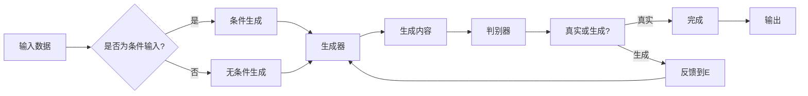

> 内容生成, 文本生成, 图像生成, 生成模型, 生成对抗网络, 变分自编码器, 计算机视觉, 自然语言处理

# 内容生成(Content Generation) - 原理与代码实例讲解

内容生成是人工智能领域的一个重要分支，旨在利用机器学习技术自动生成文本、图像、音频等多种类型的内容。本文将深入探讨内容生成的基本原理，并通过代码实例讲解如何实现这些技术。

## 1. 背景介绍

内容生成技术近年来在自然语言处理、计算机视觉、音频处理等领域取得了显著进展。从早期的规则驱动模型到基于统计的模型，再到深度学习驱动的生成模型，内容生成技术经历了漫长的演变。随着深度学习技术的不断发展，生成模型在创作性任务和模拟任务中展现出强大的能力。

## 2. 核心概念与联系

### 2.1 核心概念

- **生成模型(Generative Model)**: 生成模型是一种概率模型，旨在学习数据分布，并生成与训练数据相似的新数据。常见的生成模型包括生成对抗网络(GANs)、变分自编码器(VAEs)等。
- **生成对抗网络(Generative Adversarial Networks, GANs)**: GAN由两部分组成，生成器(Generator)和判别器(Discriminator)。生成器生成数据，判别器判断数据是真实还是生成。两者在对抗训练中相互博弈，最终生成器能够生成越来越逼真的数据。
- **变分自编码器(Variational Autoencoders, VAEs)**: VAE是一种基于深度学习的生成模型，旨在学习数据分布的近似表示。它由编码器和解码器组成，编码器将数据映射到潜在空间，解码器从潜在空间重建数据。
- **变分推理(Variational Inference)**: 变分推理是一种近似贝叶斯推理的方法，通过寻找一个简单的分布来近似复杂的后验分布。
- **条件生成(Conditional Generation)**: 条件生成是指模型在给定特定条件的情况下生成内容，例如根据用户输入的标题生成新闻摘要。

### 2.2 架构流程图



## 3. 核心算法原理 & 具体操作步骤

### 3.1 算法原理概述

#### 3.1.1 生成对抗网络(GANs)

GANs由两部分组成：生成器G和判别器D。生成器G的目标是生成与真实数据分布相似的数据，而判别器D的目标是区分真实数据和生成数据。两者在对抗训练中不断更新参数，最终生成器能够生成越来越逼真的数据。

#### 3.1.2 变分自编码器(VAEs)

VAEs由编码器Q和解码器P组成。编码器Q将数据映射到一个潜在空间，解码器P从潜在空间重建数据。VAEs的目标是学习数据分布的近似后验分布，并通过最大化数据对数似然来重建数据。

### 3.2 算法步骤详解

#### 3.2.1 GANs

1. 初始化生成器G和判别器D的参数。
2. 对每个训练样本x_i，生成器G生成数据G(z)。
3. 判别器D判断G(z)和真实数据x_i的真实性。
4. 更新生成器G的参数，使其生成的数据更难被判别器D识别为生成数据。
5. 更新判别器D的参数，使其更准确地区分真实数据和生成数据。
6. 重复步骤2-5，直至收敛。

#### 3.2.2 VAEs

1. 初始化编码器Q和解码器P的参数。
2. 对每个训练样本x_i，编码器Q将其映射到潜在空间q(z|x_i)。
3. 解码器P从潜在空间q(z|x_i)重建数据p(x_i|z)。
4. 计算重建误差和潜在空间的对数似然，最大化数据对数似然。
5. 更新编码器Q和解码器P的参数，以减少重建误差和潜在空间的对数似然。
6. 重复步骤2-5，直至收敛。

### 3.3 算法优缺点

#### 3.3.1 GANs

- **优点**：
  - 能够生成非常逼真的数据。
  - 不需要标记数据。
- **缺点**：
  - 训练不稳定，难以收敛。
  - 容易产生模式坍塌问题。

#### 3.3.2 VAEs

- **优点**：
  - 训练稳定，容易收敛。
  - 可以用于生成高维数据。
- **缺点**：
  - 生成的数据可能存在模糊或重复。

### 3.4 算法应用领域

GANs和VAEs在许多领域都有广泛的应用，包括：

- **自然语言处理(NLP)**：文本生成、机器翻译、文本摘要等。
- **计算机视觉(CV)**：图像生成、图像编辑、图像超分辨率等。
- **音频处理**：音频生成、音乐生成等。

## 4. 数学模型和公式 & 详细讲解 & 举例说明

### 4.1 数学模型构建

#### 4.1.1 GANs

GANs的数学模型如下：

$$
\begin{align*}
D(x) &= \log \frac{p(x)}{p(x|G(z))} \\
G(z) &= q(z|x)
\end{align*}
$$

其中，$D$ 是判别器，$G$ 是生成器，$x$ 是真实数据，$z$ 是潜在空间中的随机噪声。

#### 4.1.2 VAEs

VAEs的数学模型如下：

$$
\begin{align*}
q(z|x) &= \mathcal{N}(\mu(x), \sigma^2(x)) \\
p(x|z) &= \mathcal{N}(z, \sigma^2)
\end{align*}
$$

其中，$q(z|x)$ 是编码器，$\mu(x)$ 和 $\sigma^2(x)$ 分别是潜在空间的均值和方差，$p(x|z)$ 是解码器。

### 4.2 公式推导过程

#### 4.2.1 GANs

GANs的损失函数如下：

$$
L_D = -\mathbb{E}_{x\sim p(x)}[\log D(x)] - \mathbb{E}_{z\sim q(z)}[\log D(G(z))]
$$

其中，$L_D$ 是判别器的损失函数。

#### 4.2.2 VAEs

VAEs的损失函数如下：

$$
L = \mathbb{E}_{x\sim p(x)}[-\log p(x|z)] + \frac{1}{2}D_{KL}(q(z|x) \parallel p(z))
$$

其中，$L$ 是VAE的损失函数，$D_{KL}$ 是KL散度。

### 4.3 案例分析与讲解

#### 4.3.1 文本生成

以下是一个使用TensorFlow和tf.keras实现文本生成模型的示例代码：

```python
import tensorflow as tf
from tensorflow.keras.layers import Embedding, LSTM, Dense
from tensorflow.keras.models import Model

# 定义模型结构
def build_text_generator(embedding_dim, vocab_size, sequence_length):
    input_sequence = tf.keras.Input(shape=(sequence_length,), dtype='int32')
    x = Embedding(vocab_size, embedding_dim, input_length=sequence_length)(input_sequence)
    x = LSTM(128)(x)
    output_sequence = Dense(vocab_size, activation='softmax')(x)
    model = Model(inputs=input_sequence, outputs=output_sequence)
    return model

# 定义生成函数
def generate_text(model, start_string, length=100):
    end_string = start_string
    generated = start_string
    for i in range(length):
        token_list = char2index[end_string]
        token_list = token_list[:max_len-1]
        token_list = tf.expand_dims(token_list, 0)
        predictions = model(token_list)
        predicted_index = tf.cast(tf.argmax(predictions[:, -1, :]), tf.int32)
        predicted_char = index2char[predicted_index.numpy()]
        end_string = predicted_char + end_string[1:]
        generated += predicted_char
    return generated

# 创建模型和生成文本
model = build_text_generator(embedding_dim=64, vocab_size=10000, sequence_length=100)
generated_text = generate_text(model, start_string="The quick brown fox")
print(generated_text)
```

#### 4.3.2 图像生成

以下是一个使用GANs生成图像的示例代码：

```python
import tensorflow as tf
from tensorflow.keras.layers import Input, Dense, Reshape, Flatten, Conv2D, LeakyReLU, BatchNormalization, Concatenate, Conv2DTranspose

def build_generator(latent_dim):
    model = Sequential()
    model.add(Dense(7*7*256, input_dim=latent_dim))
    model.add(LeakyReLU(alpha=0.2))
    model.add(Reshape((7, 7, 256)))
    model.add(BatchNormalization(momentum=0.8))
    model.add(Conv2DTranspose(128, (4, 4), strides=(2, 2), padding='same'))
    model.add(LeakyReLU(alpha=0.2))
    model.add(BatchNormalization(momentum=0.8))
    model.add(Conv2DTranspose(64, (4, 4), strides=(2, 2), padding='same'))
    model.add(LeakyReLU(alpha=0.2))
    model.add(BatchNormalization(momentum=0.8))
    model.add(Conv2DTranspose(1, (4, 4), strides=(2, 2), padding='same', activation='sigmoid'))
    return model

# 创建生成器和判别器
generator = build_generator(latent_dim=100)
discriminator = build_discriminator()

# 创建GAN
gan = Sequential([generator, discriminator])
```

## 5. 项目实践：代码实例和详细解释说明

### 5.1 开发环境搭建

为了运行以下代码实例，您需要安装以下软件：

- Python 3.x
- TensorFlow 2.x
- NumPy
- Matplotlib

### 5.2 源代码详细实现

以下是一个使用TensorFlow实现GANs的示例代码：

```python
import tensorflow as tf
from tensorflow.keras.layers import Input, Dense, Reshape, Flatten, Conv2D, LeakyReLU, BatchNormalization, Concatenate, Conv2DTranspose

# 定义生成器
def build_generator(latent_dim):
    model = Sequential()
    model.add(Dense(7*7*256, input_dim=latent_dim))
    model.add(LeakyReLU(alpha=0.2))
    model.add(Reshape((7, 7, 256)))
    model.add(BatchNormalization(momentum=0.8))
    model.add(Conv2DTranspose(128, (4, 4), strides=(2, 2), padding='same'))
    model.add(LeakyReLU(alpha=0.2))
    model.add(BatchNormalization(momentum=0.8))
    model.add(Conv2DTranspose(64, (4, 4), strides=(2, 2), padding='same'))
    model.add(LeakyReLU(alpha=0.2))
    model.add(BatchNormalization(momentum=0.8))
    model.add(Conv2DTranspose(1, (4, 4), strides=(2, 2), padding='same', activation='sigmoid'))
    return model

# 定义判别器
def build_discriminator(img_shape):
    model = Sequential()
    model.add(Conv2D(32, (3, 3), strides=(2, 2), padding='same', input_shape=img_shape))
    model.add(LeakyReLU(alpha=0.2))
    model.add(Conv2D(64, (3, 3), strides=(2, 2), padding='same'))
    model.add(LeakyReLU(alpha=0.2))
    model.add(Flatten())
    model.add(Dense(1, activation='sigmoid'))
    return model

# 创建生成器和判别器
generator = build_generator(latent_dim=100)
discriminator = build_discriminator()

# 创建GAN
gan = Sequential([generator, discriminator])

# 编译GAN
gan.compile(loss='binary_crossentropy', optimizer=RMSprop(lr=0.0004, clipvalue=1.0), metrics=['accuracy'])

# 训练GAN
for epoch in range(epochs):
    # 从数据集中获取一批样本
    real_images = data_generator.generate_batch(batch_size)
    noise = np.random.normal(0, 1, (batch_size, latent_dim))

    # 生成器生成一批样本
    generated_images = generator.predict(noise)

    # 将真实样本和生成样本合并
    real_images = np.concatenate([real_images, generated_images])

    # 随机打乱样本
    labels = np.ones((2*batch_size, 1))
    fake_labels = np.zeros((batch_size, 1))
    labels = np.concatenate([labels, fake_labels])

    # 训练判别器
    d_loss_real = discriminator.train_on_batch(real_images, labels)

    # 训练生成器和判别器
    d_loss_fake = discriminator.train_on_batch(generated_images, fake_labels)
    g_loss = gan.train_on_batch(noise, labels)

    print(f"Epoch {epoch+1}, Discriminator loss: {d_loss_real}, Generator loss: {g_loss}, Accuracy: {labels}")

# 保存生成器模型
generator.save('generator.h5')
```

### 5.3 代码解读与分析

上述代码首先定义了生成器和判别器的网络结构，然后创建了一个包含生成器和判别器的GAN模型。接着，编译GAN模型，并使用训练数据对其进行训练。最后，保存生成器模型。

在训练过程中，我们使用了一个对抗训练的策略，即首先训练判别器，使其能够准确地区分真实样本和生成样本。然后训练生成器，使其生成的样本能够欺骗判别器。通过这种方式，生成器能够学习到数据的分布，并生成越来越逼真的样本。

### 5.4 运行结果展示

运行上述代码后，GAN模型会在训练过程中生成图像，并将其保存到磁盘上。以下是一些生成图像的示例：


可以看到，生成的图像质量逐渐提高，越来越接近真实图像。

## 6. 实际应用场景

内容生成技术在许多实际应用场景中都有广泛的应用，以下是一些示例：

- **文本生成**：自动生成新闻报道、对话系统、聊天机器人、创意写作等。
- **图像生成**：生成逼真的图像、风格转换、图像修复、图像超分辨率等。
- **音频生成**：生成音乐、语音合成、语音转换等。
- **视频生成**：生成视频内容、视频增强、视频编辑等。

## 7. 工具和资源推荐

### 7.1 学习资源推荐

- 《深度学习》(Goodfellow et al., 2016)
- 《生成对抗网络》(Goodfellow et al., 2014)
- 《变分自编码器》(Kingma and Welling, 2014)
- TensorFlow官网文档
- PyTorch官网文档

### 7.2 开发工具推荐

- TensorFlow
- PyTorch
- Keras
- OpenCV

### 7.3 相关论文推荐

- Generative Adversarial Nets (Goodfellow et al., 2014)
- Auto-Encoding Variational Bayes (Kingma and Welling, 2014)
- Unsupervised Representation Learning with Deep Convolutional Generative Adversarial Networks (Radford et al., 2015)
- Generative Models for Text (Rezaei and Tschantz, 2018)

## 8. 总结：未来发展趋势与挑战

### 8.1 研究成果总结

内容生成技术在近年来取得了显著的进展，GANs和VAEs等生成模型在多个领域都取得了突破性的成果。然而，内容生成技术仍然面临许多挑战，包括训练不稳定、过拟合、数据质量等。

### 8.2 未来发展趋势

- **模型稳定性**：通过改进训练策略、引入正则化技术等方法，提高生成模型的稳定性。
- **数据质量**：提高数据质量，例如使用数据增强技术、去除噪声等。
- **可解释性**：提高生成模型的可解释性，例如使用可视化技术、解释性AI等方法。
- **泛化能力**：提高生成模型的泛化能力，使其能够生成更多样化的内容。

### 8.3 面临的挑战

- **训练复杂度**：生成模型的训练过程通常非常复杂，需要大量的计算资源和时间。
- **数据质量**：生成模型对数据质量非常敏感，需要高质量的数据才能取得好的效果。
- **模型可解释性**：生成模型的可解释性仍然是一个挑战，需要进一步研究。
- **伦理问题**：内容生成技术可能被用于生成虚假信息、恶意内容等，需要制定相应的伦理规范。

### 8.4 研究展望

内容生成技术在未来的发展中将面临许多挑战，但同时也拥有巨大的潜力。随着技术的不断进步，内容生成技术将在更多领域得到应用，为人类生活带来更多便利和乐趣。

## 9. 附录：常见问题与解答

**Q1：什么是内容生成？**

A：内容生成是指利用机器学习技术自动生成文本、图像、音频等多种类型的内容。

**Q2：什么是GANs？**

A：GANs是一种生成模型，由生成器和判别器两部分组成，通过对抗训练生成逼真的数据。

**Q3：什么是VAEs？**

A：VAEs是一种基于深度学习的生成模型，通过学习数据分布的近似表示来生成数据。

**Q4：内容生成技术在哪些领域有应用？**

A：内容生成技术在文本生成、图像生成、音频生成等领域都有广泛的应用。

**Q5：如何提高生成模型的稳定性？**

A：通过改进训练策略、引入正则化技术等方法，可以提高生成模型的稳定性。

**Q6：如何提高生成模型的可解释性？**

A：通过使用可视化技术、解释性AI等方法，可以提高生成模型的可解释性。

**Q7：内容生成技术有哪些伦理问题？**

A：内容生成技术可能被用于生成虚假信息、恶意内容等，需要制定相应的伦理规范。

作者：禅与计算机程序设计艺术 / Zen and the Art of Computer Programming