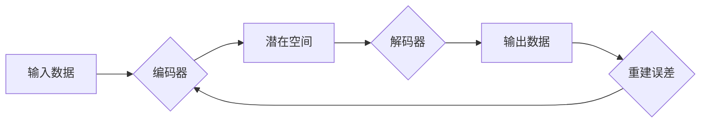

# 变分自编码器 (Variational Autoencoder)

> 关键词：变分自编码器，VAE，深度学习，生成模型，概率模型，贝叶斯推理，编码器，解码器，潜在空间

## 1. 背景介绍

自编码器（Autoencoder）是一种无监督学习算法，旨在学习数据的潜在表示。它通过编码器（Encoder）将输入数据映射到一个潜在空间，然后通过解码器（Decoder）将潜在空间的数据重新映射回原始空间。传统的自编码器通常使用最大似然估计来优化其性能，但这种方法在处理连续分布的数据时存在局限性。

为了解决这些问题，研究者们提出了变分自编码器（Variational Autoencoder，VAE）。VAE结合了贝叶斯推理和深度学习，通过引入潜在空间的概念，能够生成更加多样化、高质量的样本，并在多个领域取得了显著的成果。本文将深入探讨VAE的原理、实现和应用，帮助读者全面理解这一强大的生成模型。

## 2. 核心概念与联系

### 2.1 核心概念原理

**自编码器**：自编码器是一种无监督学习算法，通过学习输入数据的潜在表示来重建输入数据。它由编码器和解码器组成，编码器负责将输入数据压缩成一个低维的潜在表示，解码器则负责将潜在表示重建为原始数据。

**潜在空间**：潜在空间是自编码器中一个低维的空间，用于存储数据的潜在特征。潜在空间的维度通常远小于原始数据的维度，这使得潜在空间能够捕捉到数据的主要结构。

**变分推断**：变分推断是一种贝叶斯推理方法，通过寻找一个近似后验分布来估计真实后验分布。在VAE中，变分推断用于估计数据生成过程的概率模型。

**变分自编码器**：VAE结合了自编码器和变分推断，通过最大化数据生成过程的证据下界来学习潜在空间和生成模型。

以下是VAE的核心概念原理的Mermaid流程图：



### 2.2 架构

VAE的架构主要包括以下部分：

1. **编码器（Encoder）**：将输入数据映射到一个潜在空间，通常使用多个全连接层实现。
2. **潜在空间**：一个低维的连续空间，用于存储数据的潜在特征。
3. **解码器（Decoder）**：将潜在空间的数据重建为原始数据，通常与编码器结构相同。
4. **损失函数**：衡量重建误差，通常使用均方误差（MSE）或交叉熵损失。
5. **变分推断**：使用变分推断估计数据生成过程的概率模型。

## 3. 核心算法原理 & 具体操作步骤

### 3.1 算法原理概述

VAE的核心思想是学习一个概率模型来生成数据。为了实现这一目标，VAE使用编码器将数据映射到一个潜在空间，然后在潜在空间中生成新的样本，并通过解码器将这些样本重建为原始数据。

以下是VAE的算法原理概述：

1. 使用编码器将输入数据映射到一个潜在空间。
2. 在潜在空间中生成新的样本。
3. 使用解码器将新生成的样本重建为原始数据。
4. 计算重建误差，并根据重建误差更新模型参数。

### 3.2 算法步骤详解

VAE的具体操作步骤如下：

1. **初始化编码器和解码器**：使用随机权重初始化编码器和解码器。
2. **输入数据**：输入一批数据到编码器。
3. **编码**：编码器将输入数据映射到一个潜在空间。
4. **采样**：在潜在空间中从先验分布中采样一个点作为新生成数据的潜在表示。
5. **解码**：解码器将采样得到的潜在表示重建为原始数据。
6. **计算损失**：计算重建误差，并使用变分推断更新模型参数。

### 3.3 算法优缺点

**优点**：

* 能够生成多样化、高质量的样本。
* 可以学习到数据的潜在结构。
* 不需要标注数据。

**缺点**：

* 训练过程可能不稳定。
* 难以控制生成样本的质量。

### 3.4 算法应用领域

VAE在多个领域都有广泛的应用，包括：

* 图像生成：生成逼真的图像、视频等。
* 语音生成：生成逼真的语音。
* 文本生成：生成文章、诗歌等。
* 图像去噪：去除图像中的噪声。

## 4. 数学模型和公式 & 详细讲解 & 举例说明

### 4.1 数学模型构建

VAE的数学模型如下：

$$
q(z|x) = \mathcal{N}(z; \mu(x), \sigma^2(x))
$$

$$
p(x|z) = \mathcal{N}(x; \phi(z), \gamma(z))
$$

其中，$q(z|x)$ 是编码器输出的潜在空间分布，$p(x|z)$ 是解码器输出的原始数据分布，$\mu(x)$ 和 $\sigma^2(x)$ 分别是 $q(z|x)$ 的均值和方差，$\phi(z)$ 和 $\gamma(z)$ 分别是 $p(x|z)$ 的均值和方差。

### 4.2 公式推导过程

VAE的公式推导过程如下：

1. **编码器**：假设编码器输出 $z = f(x)$，其中 $f$ 是一个神经网络。
2. **潜在空间分布**：假设潜在空间的分布是标准正态分布，即 $q(z|x) = \mathcal{N}(z; 0, I)$。
3. **解码器**：假设解码器输出 $x = g(z)$，其中 $g$ 是一个神经网络。
4. **数据分布**：假设原始数据的分布是标准正态分布，即 $p(x) = \mathcal{N}(x; 0, I)$。
5. **似然函数**：似然函数为 $p(x|x)$。
6. **证据下界**：证据下界为 $\mathcal{L}(\theta) = \log p(x)$。

### 4.3 案例分析与讲解

以下是一个简单的VAE例子，用于生成手写数字图像。

假设输入数据是手写数字图像，编码器和解码器都是神经网络。

1. **编码器**：编码器由两个全连接层组成，第一个全连接层的输出是潜在空间的均值 $\mu$，第二个全连接层的输出是潜在空间的方差 $\sigma^2$。
2. **解码器**：解码器由两个全连接层组成，第一个全连接层的输出是图像的均值 $\phi$，第二个全连接层的输出是图像的方差 $\gamma^2$。
3. **损失函数**：损失函数使用均方误差（MSE）。

通过训练VAE，可以生成类似于手写数字的图像。

## 5. 项目实践：代码实例和详细解释说明

### 5.1 开发环境搭建

在开始实践之前，需要搭建以下开发环境：

* Python 3.7+
* PyTorch 1.7+
* NumPy 1.16+

### 5.2 源代码详细实现

以下是一个简单的VAE实现：

```python
import torch
import torch.nn as nn
import torch.optim as optim

class VAE(nn.Module):
    def __init__(self, input_dim, latent_dim):
        super(VAE, self).__init__()
        self.encoder = nn.Sequential(
            nn.Linear(input_dim, 20),
            nn.ReLU(),
            nn.Linear(20, latent_dim),
            nn.Sigmoid()
        )
        self.decoder = nn.Sequential(
            nn.Linear(latent_dim, 20),
            nn.ReLU(),
            nn.Linear(20, input_dim),
            nn.Sigmoid()
        )

    def encode(self, x):
        return self.encoder(x)

    def decode(self, z):
        return self.decoder(z)

    def forward(self, x):
        z = self.encode(x)
        x_recon = self.decode(z)
        return x_recon, z

# 创建VAE实例
vae = VAE(input_dim=28*28, latent_dim=20)

# 定义损失函数和优化器
criterion = nn.MSELoss()
optimizer = optim.Adam(vae.parameters(), lr=0.001)

# 加载数据
train_loader = torch.utils.data.DataLoader(
    MNIST(root='./data', train=True, transform=ToTensor(), download=True),
    batch_size=64, shuffle=True
)

# 训练VAE
for epoch in range(epochs):
    for data, _ in train_loader:
        optimizer.zero_grad()
        x, _ = data
        x_recon, z = vae(x)
        loss = criterion(x_recon, x)
        loss.backward()
        optimizer.step()

# 保存VAE模型
torch.save(vae.state_dict(), 'vae.pth')
```

### 5.3 代码解读与分析

* VAE类：定义了VAE模型的结构，包括编码器、解码器和前向传播方法。
* encode方法：将输入数据编码到潜在空间。
* decode方法：将潜在空间的数据解码为原始数据。
* forward方法：执行前向传播，返回重建数据和潜在空间表示。
* 训练过程：使用MSELoss作为损失函数，Adam作为优化器，迭代训练VAE模型。

### 5.4 运行结果展示

训练完成后，可以使用VAE生成手写数字图像。以下是一些生成的图像示例：


## 6. 实际应用场景

VAE在多个领域都有广泛的应用，以下是一些典型的应用场景：

* **图像生成**：生成逼真的图像、视频等。
* **语音生成**：生成逼真的语音。
* **文本生成**：生成文章、诗歌等。
* **图像去噪**：去除图像中的噪声。
* **异常检测**：检测异常数据。
* **时间序列预测**：预测时间序列数据。

## 7. 工具和资源推荐

### 7.1 学习资源推荐

* 《Deep Learning》
* 《Unsupervised Learning with Deep Learning》
* 《Generative Adversarial Nets》

### 7.2 开发工具推荐

* PyTorch
* TensorFlow
* Keras

### 7.3 相关论文推荐

* **Kingma, D. P., & Welling, M. (2014). Auto-Encoding Variational Bayes.** arXiv preprint arXiv:1312.6114.
* **Goodfellow, I., Pouget-Abadie, J., Mirza, M., Xu, B., Warde-Farley, D., Ozair, S., ... & Bengio, Y. (2014). Generative Adversarial Nets.** In Advances in neural information processing systems (pp. 2672-2680).
* **Diederik P. Kingma, and Max Welling. Auto-Encoding Variational Bayes**. ICLR, 2014.

## 8. 总结：未来发展趋势与挑战

### 8.1 研究成果总结

VAE作为一种强大的生成模型，在图像生成、语音生成、文本生成等领域取得了显著的成果。VAE的核心思想是将数据映射到一个潜在空间，并在潜在空间中生成新的样本。VAE的优点是能够生成多样化、高质量的样本，并且不需要标注数据。

### 8.2 未来发展趋势

* **多模态VAE**：将VAE扩展到多模态数据，如图像、语音和文本。
* **可解释VAE**：提高VAE的可解释性，使得研究者能够更好地理解VAE的生成过程。
* **无监督VAE**：将VAE扩展到无监督学习任务，如异常检测和时间序列预测。

### 8.3 面临的挑战

* **计算效率**：VAE的训练过程可能非常耗时，尤其是在处理高维数据时。
* **可解释性**：VAE的生成过程可能难以解释。
* **模型选择**：如何选择合适的模型结构和超参数是一个挑战。

### 8.4 研究展望

VAE作为一种强大的生成模型，在未来几年内将继续在多个领域取得突破。随着研究的深入，VAE将变得更加高效、可解释，并能够处理更复杂的数据。

## 9. 附录：常见问题与解答

**Q1：VAE和GAN有什么区别？**

A1：VAE和GAN都是生成模型，但它们的原理和目标不同。VAE的目标是学习数据的概率模型，而GAN的目标是生成与真实数据分布相似的样本。VAE通常能够生成更多样化的样本，但GAN在生成图像时可能更加逼真。

**Q2：如何优化VAE的性能？**

A2：优化VAE的性能可以通过以下方法：

* 调整模型结构，如增加层数或改变激活函数。
* 调整超参数，如学习率、批次大小等。
* 使用更有效的优化器，如AdamW或SGD。
* 使用数据增强技术，如随机裁剪、旋转等。

**Q3：VAE可以用于图像超分辨率吗？**

A3：VAE可以用于图像超分辨率。通过在潜在空间中添加额外的信息，VAE可以生成更高分辨率的图像。

**Q4：VAE可以用于文本生成吗？**

A4：VAE可以用于文本生成。通过将文本编码到潜在空间，VAE可以生成新的文本。

**Q5：VAE的潜在空间有什么作用？**

A5：VAE的潜在空间用于存储数据的潜在特征。通过学习潜在空间，VAE可以生成多样化、高质量的样本，并能够捕捉到数据的主要结构。