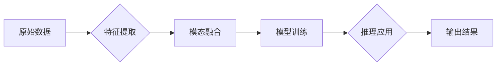

# 多模态AI未来发展方向预测

> 关键词：多模态AI，融合，自然语言处理，计算机视觉，机器学习，人机交互，认知计算

## 1. 背景介绍

随着人工智能技术的飞速发展，多模态AI作为一项融合多种感官信息的技术，正日益成为研究的热点。多模态AI能够同时处理文本、图像、声音、视频等多种类型的数据，从而实现对复杂场景的更全面理解和更准确的决策。本文将探讨多模态AI的未来发展方向，分析其面临的挑战，并展望其应用前景。

### 1.1 问题的由来

人类的感知系统是一个典型的多模态系统，能够从视觉、听觉、触觉等多种感官中获取信息，并通过大脑进行整合，形成对世界的全面认知。然而，传统的AI系统往往只专注于单一模态的数据处理，导致其应用场景受限。多模态AI的兴起，正是为了弥补这一不足，实现更智能、更人性化的智能系统。

### 1.2 研究现状

近年来，多模态AI在学术界和工业界都取得了显著的进展。以下是一些典型的多模态AI应用：

- **人机交互**：通过语音、图像、文字等多种方式实现人与机器的自然交流。
- **情感计算**：通过分析用户的表情、语调、肢体语言等，识别和评估用户的情绪状态。
- **视频分析**：通过视频数据识别场景、动作、人物等，实现智能监控、安全防范等功能。
- **自动驾驶**：结合视觉、雷达、激光雷达等多种传感器数据，实现自动驾驶汽车的感知、决策和执行。

### 1.3 研究意义

多模态AI的研究具有重要的理论意义和应用价值：

- **理论研究**：推动机器学习、认知计算等领域的发展，丰富人工智能的理论体系。
- **应用价值**：提升AI系统的智能水平，拓展AI的应用场景，改善人们的生活。

## 2. 核心概念与联系

### 2.1 多模态AI的核心概念

- **模态**：指信息的不同表现形式，如文本、图像、声音等。
- **多模态融合**：指将多种模态信息进行整合，形成更全面、更准确的认知。
- **特征提取**：从原始数据中提取具有区分性的特征，用于后续处理。
- **模型训练**：使用训练数据对模型进行训练，提高模型的性能。
- **推理应用**：将训练好的模型应用于实际问题，实现智能决策。

### 2.2 核心概念原理和架构的 Mermaid 流程图



## 3. 核心算法原理 & 具体操作步骤

### 3.1 算法原理概述

多模态AI的算法原理主要包括以下步骤：

1. **数据预处理**：对多模态数据进行清洗、去噪、标准化等操作。
2. **特征提取**：从不同模态的数据中提取具有区分性的特征。
3. **模态融合**：将不同模态的特征进行整合，形成统一的特征空间。
4. **模型训练**：使用整合后的特征数据对模型进行训练。
5. **推理应用**：将训练好的模型应用于实际问题，实现智能决策。

### 3.2 算法步骤详解

1. **数据预处理**：根据不同的模态数据，采用不同的预处理方法。例如，对于文本数据，可以使用分词、词性标注等方法；对于图像数据，可以使用图像分割、特征提取等方法。
2. **特征提取**：使用深度学习、传统机器学习等方法，从不同模态的数据中提取特征。例如，可以使用卷积神经网络（CNN）提取图像特征，使用循环神经网络（RNN）提取文本特征。
3. **模态融合**：将提取的特征进行整合，形成统一的特征空间。常用的融合方法包括加权平均、拼接、注意力机制等。
4. **模型训练**：使用整合后的特征数据对模型进行训练。常用的模型包括卷积神经网络（CNN）、循环神经网络（RNN）、Transformer等。
5. **推理应用**：将训练好的模型应用于实际问题，实现智能决策。例如，在图像识别任务中，将图像数据输入模型，得到图像的类别标签。

### 3.3 算法优缺点

多模态AI算法的优点包括：

- 能够整合多种感官信息，提高模型的性能。
- 能够处理复杂场景，实现更智能的决策。
- 能够拓展AI的应用场景。

多模态AI算法的缺点包括：

- 模型复杂度高，训练和推理成本高。
- 模型可解释性差，难以理解模型的决策过程。
- 数据标注困难，需要大量标注数据。

### 3.4 算法应用领域

多模态AI算法在以下领域有着广泛的应用：

- **人机交互**：如图像识别、语音识别、自然语言处理等。
- **计算机视觉**：如图像分类、目标检测、人脸识别等。
- **语音处理**：如语音识别、语音合成、说话人识别等。
- **智能机器人**：如自动驾驶、智能导航等。

## 4. 数学模型和公式 & 详细讲解 & 举例说明

### 4.1 数学模型构建

多模态AI的数学模型主要包括以下部分：

- **特征提取模型**：如CNN、RNN、Transformer等。
- **模态融合模型**：如加权平均、拼接、注意力机制等。
- **输出层模型**：如softmax、sigmoid等。

### 4.2 公式推导过程

以下以CNN和softmax为例，进行公式推导：

**CNN公式**：

$$
h^{(l)} = \sigma(W^{(l)} \cdot h^{(l-1)} + b^{(l)})
$$

其中，$h^{(l)}$表示第l层的特征向量，$W^{(l)}$表示第l层的权重矩阵，$b^{(l)}$表示第l层的偏置向量，$\sigma$表示激活函数。

**softmax公式**：

$$
P(y = i) = \frac{e^{z_i}}{\sum_{j=1}^{K} e^{z_j}}
$$

其中，$y$表示输出类别，$i$表示第i个类别，$z_i$表示第i个类别的预测值，$K$表示类别总数。

### 4.3 案例分析与讲解

以下以人脸识别为例，讲解多模态AI的应用：

1. **数据预处理**：收集人脸图像、年龄、性别等数据。
2. **特征提取**：使用CNN提取人脸图像特征，使用RNN提取文本特征。
3. **模态融合**：将图像特征和文本特征进行拼接，形成统一的特征空间。
4. **模型训练**：使用整合后的特征数据对模型进行训练。
5. **推理应用**：将图像和文本数据输入模型，得到人脸识别结果。

## 5. 项目实践：代码实例和详细解释说明

### 5.1 开发环境搭建

由于篇幅限制，此处不提供具体代码实现，但以下列出项目实践所需的基本环境：

- Python
- TensorFlow或PyTorch
- OpenCV
- NLTK

### 5.2 源代码详细实现

以下以使用TensorFlow和OpenCV实现人脸识别为例，给出代码实现：

```python
import tensorflow as tf
import cv2
import numpy as np

# 加载预训练的人脸识别模型
model = tf.keras.models.load_model('face_recognition_model.h5')

# 读取图像
image = cv2.imread('example.jpg')

# 人脸检测
face_cascade = cv2.CascadeClassifier('haarcascade_frontalface_default.xml')
faces = face_cascade.detectMultiScale(image, 1.1, 4)

# 识别人脸
for (x, y, w, h) in faces:
    face_image = image[y:y+h, x:x+w]
    face_image = cv2.resize(face_image, (64, 64))
    face_image = np.expand_dims(face_image, axis=0)
    face_image = face_image / 255.0
    pred = model.predict(face_image)
    print(f'Person: {pred.argmax()}')

# 显示图像
cv2.imshow('Image', image)
cv2.waitKey(0)
cv2.destroyAllWindows()
```

### 5.3 代码解读与分析

以上代码首先加载预训练的人脸识别模型，然后读取图像并使用人脸检测算法检测图像中的人脸。接着，对检测到的人脸进行特征提取和识别，并输出识别结果。最后，显示识别后的图像。

### 5.4 运行结果展示

运行上述代码后，将显示识别后的图像，并输出识别结果。

## 6. 实际应用场景

多模态AI在以下场景有着广泛的应用：

- **智能客服**：通过语音、图像、文字等多种方式，提供更加人性化的服务。
- **智能医疗**：通过分析医学影像、病历、基因数据等，辅助医生进行诊断和治疗。
- **智能交通**：通过分析交通图像、传感器数据等，实现智能交通管理。
- **智能家居**：通过分析家庭环境、用户行为等，提供更加智能化的家居服务。

## 7. 工具和资源推荐

### 7.1 学习资源推荐

- 《深度学习：原理与算法》
- 《计算机视觉：算法与应用》
- 《自然语言处理：理论与实践》

### 7.2 开发工具推荐

- TensorFlow
- PyTorch
- OpenCV
- NLTK

### 7.3 相关论文推荐

- “Deep Learning for Human-Computer Interaction”
- “Multimodal Learning for Human-Computer Interaction”
- “Deep Learning in Medical Image Analysis”

## 8. 总结：未来发展趋势与挑战

### 8.1 研究成果总结

多模态AI作为人工智能领域的一个热点方向，在近年来取得了显著的进展。通过整合多种感官信息，多模态AI能够实现更智能、更人性化的智能系统。

### 8.2 未来发展趋势

- 模型轻量化：通过模型压缩、量化等方法，降低模型复杂度和计算成本。
- 跨模态融合：探索更加有效的跨模态融合方法，实现不同模态信息的深度融合。
- 个性化应用：针对不同用户的需求，提供个性化的多模态服务。
- 可解释性研究：提高模型的可解释性，增强用户对AI系统的信任。

### 8.3 面临的挑战

- 模型复杂度高：多模态模型通常比单一模态模型更复杂，训练和推理成本更高。
- 数据标注困难：多模态数据标注需要大量人工，成本高、效率低。
- 可解释性差：多模态模型的可解释性较差，难以理解模型的决策过程。

### 8.4 研究展望

未来，多模态AI技术将在以下方面取得突破：

- 开发更轻量化的多模态模型，降低计算成本。
- 研究更加有效的跨模态融合方法，实现不同模态信息的深度融合。
- 探索个性化多模态服务，满足不同用户的需求。
- 提高模型的可解释性，增强用户对AI系统的信任。

## 9. 附录：常见问题与解答

**Q1：多模态AI与单一模态AI相比，有哪些优势？**

A：多模态AI能够整合多种感官信息，提高模型的性能，实现更智能、更人性化的智能系统。

**Q2：多模态AI在哪些领域有着广泛的应用？**

A：多模态AI在智能客服、智能医疗、智能交通、智能家居等领域有着广泛的应用。

**Q3：多模态AI面临的挑战有哪些？**

A：多模态AI面临的挑战包括模型复杂度高、数据标注困难、可解释性差等。

**Q4：如何提高多模态AI的可解释性？**

A：提高多模态AI的可解释性需要从模型设计、数据标注、算法优化等多个方面进行改进。

作者：禅与计算机程序设计艺术 / Zen and the Art of Computer Programming