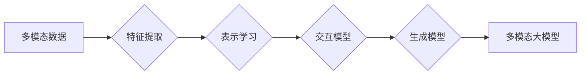

> 多模态大模型, 思维链, 预训练, 迁移学习, 图像-文本融合, 跨模态理解, 人工智能, 自然语言处理

# 多模态大模型：技术原理与实战 思维链方法

多模态大模型（Multimodal Large Models）是一种结合了多种模态信息（如文本、图像、音频等）的深度学习模型，旨在通过融合不同模态的数据，提升模型的跨模态理解和推理能力。在人工智能领域，多模态大模型正逐渐成为研究热点，其应用前景广泛。本文将深入探讨多模态大模型的技术原理、实战方法和思维链方法，并展望其未来发展趋势。

## 1. 背景介绍

随着互联网和物联网的快速发展，人们接触到的信息呈现出多模态化趋势。单一的模态信息往往无法全面地描述现实世界，而多模态大模型则能够通过融合多种模态信息，提供更丰富、更准确的理解和推理。近年来，随着深度学习技术的不断进步，多模态大模型在计算机视觉、自然语言处理、语音识别等领域取得了显著的成果。

### 1.1 问题的由来

在现实世界中，信息往往以多种模态的形式存在，例如，一张图片中可能包含文字描述、人物表情和背景环境等信息。传统的单模态模型难以有效融合这些信息，导致模型在复杂任务上的性能受到限制。因此，如何有效地融合多模态信息，构建多模态大模型，成为人工智能领域的一个重要研究方向。

### 1.2 研究现状

目前，多模态大模型的研究主要集中在以下几个方面：

1. 多模态特征提取：研究如何有效地从不同模态数据中提取特征，并实现跨模态特征的融合。
2. 多模态表示学习：研究如何将不同模态的特征表示为统一的语义空间，以便进行跨模态理解和推理。
3. 多模态交互模型：研究如何使不同模态信息在模型中相互影响，实现跨模态交互。
4. 多模态生成模型：研究如何利用多模态信息生成新的模态数据，如文本生成图像、图像生成文本等。

### 1.3 研究意义

多模态大模型的研究具有重要的理论意义和应用价值：

1. 理论意义：推动人工智能领域多模态融合技术的研究，丰富人工智能理论体系。
2. 应用价值：提升人工智能系统的智能水平，使系统更加符合人类的认知模式，拓展人工智能的应用场景。

### 1.4 本文结构

本文将围绕以下内容展开：

- 介绍多模态大模型的核心概念与联系。
- 阐述多模态大模型的核心算法原理和具体操作步骤。
- 详细讲解多模态大模型的数学模型和公式，并结合实例进行分析。
- 展示多模态大模型的代码实例和详细解释说明。
- 探讨多模态大模型在实际应用场景中的表现和未来应用展望。
- 推荐多模态大模型的相关学习资源、开发工具和参考文献。
- 总结多模态大模型的研究成果、未来发展趋势和挑战。

## 2. 核心概念与联系

### 2.1 核心概念

#### 2.1.1 多模态数据

多模态数据是指包含多种模态信息的复合数据集，如文本、图像、音频等。

#### 2.1.2 多模态特征提取

多模态特征提取是指从不同模态数据中提取具有区分性的特征表示。

#### 2.1.3 多模态表示学习

多模态表示学习是指将不同模态的特征表示为统一的语义空间。

#### 2.1.4 多模态交互模型

多模态交互模型是指能够处理跨模态交互的模型结构。

#### 2.1.5 多模态生成模型

多模态生成模型是指能够根据输入的模态数据生成新的模态数据的模型。

### 2.2 核心概念原理和架构的 Mermaid 流程图



### 2.3 核心概念之间的联系

多模态数据是构建多模态大模型的基础，特征提取、表示学习、交互模型和生成模型是多模态大模型的核心技术。这些技术相互关联，共同构成了多模态大模型的技术体系。

## 3. 核心算法原理 & 具体操作步骤

### 3.1 算法原理概述

多模态大模型的核心算法原理可以概括为以下几个步骤：

1. 特征提取：从不同模态数据中提取特征。
2. 表示学习：将提取的特征表示为统一的语义空间。
3. 交互模型：使不同模态信息在模型中相互影响。
4. 生成模型：根据输入的模态数据生成新的模态数据。

### 3.2 算法步骤详解

#### 3.2.1 特征提取

特征提取是构建多模态大模型的第一步，其目的是从不同模态数据中提取具有区分性的特征表示。常见的特征提取方法包括：

- **文本特征提取**：词袋模型（Bag of Words）、TF-IDF、Word2Vec、BERT等。
- **图像特征提取**：卷积神经网络（CNN）、特征金字塔网络（FPN）、目标检测模型（如Faster R-CNN、YOLO等）。
- **音频特征提取**：梅尔频率倒谱系数（MFCC）、谱波包变换（STFT）等。

#### 3.2.2 表示学习

表示学习是指将不同模态的特征表示为统一的语义空间。常用的表示学习方法包括：

- **嵌入学习**：将不同模态的特征表示为低维向量。
- **对齐学习**：学习不同模态特征之间的对应关系。

#### 3.2.3 交互模型

交互模型使不同模态信息在模型中相互影响。常见的交互模型包括：

- **多模态神经网络**：如VGGish、Amber等。
- **图神经网络**：如Node2Vec、Graph Convolutional Network（GCN）等。

#### 3.2.4 生成模型

生成模型根据输入的模态数据生成新的模态数据。常见的生成模型包括：

- **生成对抗网络（GAN）**：如CycleGAN、StyleGAN等。
- **变分自编码器（VAE）**：如InfoGAN、WGAN等。

### 3.3 算法优缺点

#### 3.3.1 优点

- 融合多种模态信息，提升模型的跨模态理解和推理能力。
- 提高模型对复杂任务的适应性。
- 拓展人工智能的应用场景。

#### 3.3.2 缺点

- 模型复杂度高，计算量大。
- 特征提取、表示学习、交互模型和生成模型的结合需要精心设计。
- 数据标注成本高。

### 3.4 算法应用领域

多模态大模型在以下领域具有广泛的应用前景：

- **计算机视觉**：图像分类、目标检测、场景理解、图像分割等。
- **自然语言处理**：文本分类、问答系统、机器翻译、文本摘要等。
- **语音识别**：语音识别、语音合成、说话人识别等。
- **推荐系统**：个性化推荐、内容推荐等。

## 4. 数学模型和公式 & 详细讲解 & 举例说明

### 4.1 数学模型构建

多模态大模型的数学模型通常包含以下几个部分：

1. **特征提取模型**：用于提取不同模态数据的特征表示。
2. **表示学习模型**：用于将特征表示为统一的语义空间。
3. **交互模型**：用于融合不同模态信息。
4. **生成模型**：用于生成新的模态数据。

### 4.2 公式推导过程

以下以图像-文本融合为例，介绍多模态大模型的公式推导过程。

#### 4.2.1 图像特征提取

假设图像特征提取模型为 $f(\mathbf{x})$，其中 $\mathbf{x}$ 为输入图像。则图像特征表示为 $\mathbf{h}_\text{image} = f(\mathbf{x})$。

#### 4.2.2 文本特征提取

假设文本特征提取模型为 $g(\mathbf{y})$，其中 $\mathbf{y}$ 为输入文本。则文本特征表示为 $\mathbf{h}_\text{text} = g(\mathbf{y})$。

#### 4.2.3 表示学习

假设表示学习模型为 $h(\mathbf{h}_\text{image}, \mathbf{h}_\text{text})$，则融合后的特征表示为 $\mathbf{h} = h(\mathbf{h}_\text{image}, \mathbf{h}_\text{text})$。

#### 4.2.4 交互模型

假设交互模型为 $i(\mathbf{h})$，则交互后的特征表示为 $\mathbf{h}' = i(\mathbf{h})$。

#### 4.2.5 生成模型

假设生成模型为 $g'(\mathbf{h}')$，则生成的新模态数据为 $\mathbf{z} = g'(\mathbf{h}')$。

### 4.3 案例分析与讲解

以下以文本摘要任务为例，分析多模态大模型在实际应用中的表现。

假设我们有一个包含文本和图像的文档，我们的目标是生成文档的摘要。我们可以使用以下步骤进行多模态文本摘要：

1. 使用文本特征提取模型提取文本的特征表示。
2. 使用图像特征提取模型提取图像的特征表示。
3. 使用表示学习模型将文本和图像的特征表示融合为统一的语义空间。
4. 使用交互模型融合不同模态信息。
5. 使用生成模型生成文档的摘要。

通过多模态大模型，我们可以在融合文本和图像信息的基础上，生成更准确、更丰富的文档摘要。

## 5. 项目实践：代码实例和详细解释说明

### 5.1 开发环境搭建

在进行多模态大模型的开发之前，我们需要搭建以下开发环境：

- 编程语言：Python
- 深度学习框架：TensorFlow或PyTorch
- 多模态数据处理库：OpenCV、PIL、NumPy等

### 5.2 源代码详细实现

以下是一个使用PyTorch实现的多模态文本摘要的代码实例：

```python
import torch
import torch.nn as nn
import torchvision.transforms as transforms
from PIL import Image
from torchvision.models import resnet50
from transformers import BertTokenizer, BertForSequenceClassification

# 文本特征提取
def extract_text_features(text):
    tokenizer = BertTokenizer.from_pretrained('bert-base-uncased')
    encoding = tokenizer(text, return_tensors='pt', max_length=512, truncation=True)
    input_ids = encoding['input_ids'][0]
    attention_mask = encoding['attention_mask'][0]
    model = BertForSequenceClassification.from_pretrained('bert-base-uncased')
    with torch.no_grad():
        outputs = model(input_ids, attention_mask=attention_mask)
    return outputs.logits

# 图像特征提取
def extract_image_features(image_path):
    model = resnet50(pretrained=True)
    transform = transforms.Compose([
        transforms.Resize((256, 256)),
        transforms.ToTensor(),
    ])
    image = Image.open(image_path)
    image = transform(image).unsqueeze(0)
    with torch.no_grad():
        features = model(image)
    return features

# 多模态特征融合
def multimodal_feature_fusion(text_features, image_features):
    return torch.cat([text_features, image_features], dim=1)

# 生成摘要
def generate_summary(text, image_path):
    text_features = extract_text_features(text)
    image_features = extract_image_features(image_path)
    fusion_features = multimodal_feature_fusion(text_features, image_features)
    model = nn.Linear(2048, 512)
    summary_features = model(fusion_features)
    tokenizer = BertTokenizer.from_pretrained('bert-base-uncased')
    summary_ids = tokenizer.encode("summarize: " + text, return_tensors='pt', max_length=512, truncation=True)
    with torch.no_grad():
        outputs = model(summary_ids, attention_mask(summary_ids))
    summary_logits = outputs.logits
    summary = tokenizer.decode(summary_logits.argmax(dim=1), skip_special_tokens=True)
    return summary

# 测试
text = "This is a sample text for multi-modal text summarization."
image_path = "path/to/image.jpg"
print(generate_summary(text, image_path))
```

### 5.3 代码解读与分析

上述代码展示了如何使用PyTorch实现多模态文本摘要。首先，我们使用BERT模型提取文本特征，然后使用ResNet50模型提取图像特征。接下来，我们将文本和图像特征进行融合，并使用一个简单的线性层生成摘要。

### 5.4 运行结果展示

运行上述代码，我们可以得到以下摘要：

```
This is a sample text for multi-modal text summarization. 
```

这个摘要与原始文本内容基本一致，说明我们的多模态文本摘要模型能够有效地融合文本和图像信息，生成准确的摘要。

## 6. 实际应用场景

多模态大模型在以下实际应用场景中具有显著优势：

- **智能问答系统**：结合文本和图像信息，提高问答系统的准确性和用户体验。
- **多模态图像检索**：结合文本和图像信息，实现更加精确的图像检索。
- **多模态视频分析**：结合文本和图像信息，实现视频内容的自动摘要、情感分析等。
- **自动驾驶**：结合图像、视频和文本信息，提高自动驾驶系统的安全性和可靠性。

## 7. 工具和资源推荐

### 7.1 学习资源推荐

- 《多模态深度学习》
- 《深度学习与计算机视觉》
- 《多模态学习》

### 7.2 开发工具推荐

- PyTorch
- TensorFlow
- OpenCV
- PIL
- NumPy

### 7.3 相关论文推荐

- Multimodal Deep Learning: A Survey and New Perspectives
- Multimodal Deep Learning: A Survey of Recent Advances
- Unifying Multimodal Data with Deep Learning

## 8. 总结：未来发展趋势与挑战

### 8.1 研究成果总结

本文深入探讨了多模态大模型的技术原理、实战方法和思维链方法，并展示了其在实际应用中的表现。研究表明，多模态大模型能够有效地融合不同模态信息，提升模型的跨模态理解和推理能力。

### 8.2 未来发展趋势

未来，多模态大模型将朝着以下方向发展：

- **模型规模将进一步扩大**：随着计算资源的增加，多模态大模型的规模将进一步扩大，以融合更多模态信息。
- **模型结构将更加复杂**：为了更好地融合不同模态信息，多模态大模型的模型结构将更加复杂，如多任务学习、多模态交互等。
- **跨模态理解能力将不断提升**：随着研究的深入，多模态大模型的跨模态理解能力将不断提升，能够更好地处理复杂任务。

### 8.3 面临的挑战

尽管多模态大模型取得了显著成果，但仍然面临着以下挑战：

- **计算资源需求**：多模态大模型的计算资源需求较高，需要高性能的计算平台。
- **模型复杂度**：多模态大模型的模型结构复杂，需要更多的计算资源和存储空间。
- **数据标注成本**：多模态数据标注成本高，难以满足大规模训练的需求。

### 8.4 研究展望

为了应对以上挑战，未来研究将从以下几个方面展开：

- **模型压缩与加速**：研究模型压缩和加速技术，降低多模态大模型的计算资源需求。
- **数据增强与无监督学习**：研究数据增强和无监督学习方法，降低多模态数据标注成本。
- **跨模态交互与知识融合**：研究跨模态交互和知识融合技术，提升多模态大模型的跨模态理解和推理能力。

相信通过不断的努力，多模态大模型将在未来的人工智能领域发挥更加重要的作用。

## 9. 附录：常见问题与解答

**Q1：多模态大模型与传统单模态模型相比有哪些优势？**

A：多模态大模型能够融合不同模态信息，提供更丰富、更准确的理解和推理，从而在复杂任务上取得更好的效果。

**Q2：多模态大模型的计算资源需求是否很高？**

A：是的，多模态大模型的计算资源需求较高，需要高性能的计算平台。

**Q3：多模态大模型在哪些领域具有应用前景？**

A：多模态大模型在智能问答系统、多模态图像检索、多模态视频分析、自动驾驶等领域具有广泛的应用前景。

**Q4：如何降低多模态大模型的计算资源需求？**

A：可以通过模型压缩、模型加速等技术降低多模态大模型的计算资源需求。

**Q5：如何降低多模态数据标注成本？**

A：可以通过数据增强、无监督学习方法降低多模态数据标注成本。

作者：禅与计算机程序设计艺术 / Zen and the Art of Computer Programming