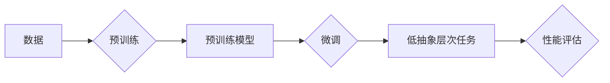

# 大模型在低抽象层次任务中的表现

> 关键词：大模型，低抽象层次任务，自然语言处理，机器学习，预训练，微调，性能评估

## 1. 背景介绍

随着深度学习技术的飞速发展，大模型（Large Models）在各个领域都展现出了惊人的能力。从自然语言处理（NLP）到计算机视觉，从语音识别到推荐系统，大模型都能够通过在大量数据上进行预训练，学习到丰富的知识和复杂的模式。然而，大模型在低抽象层次任务中的表现如何，一直是学术界和工业界关注的焦点。

低抽象层次任务通常指的是那些对数据的具体细节要求较高的任务，例如文本分类、情感分析、命名实体识别等。这些任务往往需要模型能够准确理解文本中的词汇、句子结构、语义等细节信息。本文将探讨大模型在低抽象层次任务中的表现，分析其优势和局限性，并展望未来发展趋势。

## 2. 核心概念与联系

### 2.1 核心概念

#### 大模型

大模型是指那些具有数十亿甚至数千亿参数的神经网络模型。它们通常在大量数据上进行预训练，以学习丰富的语言知识和模式。

#### 低抽象层次任务

低抽象层次任务指的是那些对数据的具体细节要求较高的任务，例如文本分类、情感分析、命名实体识别等。

#### 预训练

预训练是指在大规模无标签数据集上训练模型，使其学习到通用的特征表示。

#### 微调

微调是指在预训练模型的基础上，使用特定任务的有标签数据对其进行进一步训练，以提高模型在特定任务上的性能。

#### 性能评估

性能评估是指使用一组评估指标来衡量模型在特定任务上的表现。

### 2.2 架构的 Mermaid 流程图



## 3. 核心算法原理 & 具体操作步骤

### 3.1 算法原理概述

大模型在低抽象层次任务中的表现主要依赖于以下原理：

- 预训练：大模型通过在大量无标签数据上进行预训练，学习到通用的语言知识和模式，这为模型在低抽象层次任务中的表现奠定了基础。
- 微调：通过在特定任务的有标签数据上进行微调，大模型能够进一步优化其在低抽象层次任务上的性能。
- 特征表示：大模型能够学习到丰富的特征表示，使其能够准确理解文本中的词汇、句子结构、语义等细节信息。

### 3.2 算法步骤详解

1. 数据收集：收集低抽象层次任务的有标签数据。
2. 预训练模型选择：选择合适的大模型作为预训练模型。
3. 预训练：在大量无标签数据上训练预训练模型。
4. 微调：在特定任务的有标签数据上对预训练模型进行微调。
5. 性能评估：使用评估指标对微调后的模型进行性能评估。

### 3.3 算法优缺点

#### 优点

- 高效性：大模型能够通过预训练学习到丰富的知识，从而在低抽象层次任务中表现出色。
- 泛化能力：大模型具有较好的泛化能力，能够适应不同任务的特点。

#### 缺点

- 计算资源消耗大：大模型的训练和推理需要大量的计算资源。
- 数据依赖性：大模型的性能依赖于预训练数据和微调数据的质量。
- 可解释性差：大模型的决策过程往往缺乏可解释性。

### 3.4 算法应用领域

大模型在低抽象层次任务中的应用领域包括：

- 文本分类：如新闻分类、垃圾邮件检测等。
- 情感分析：如产品评论情感分析、社交媒体情感分析等。
- 命名实体识别：如实体识别、事件抽取等。
- 文本摘要：如新闻摘要、会议摘要等。

## 4. 数学模型和公式 & 详细讲解 & 举例说明

### 4.1 数学模型构建

大模型在低抽象层次任务中的数学模型通常基于深度神经网络，以下是一个简单的例子：

$$
y = f(Wx + b)
$$

其中 $W$ 和 $b$ 分别是权重和偏置，$x$ 是输入数据，$y$ 是输出结果。

### 4.2 公式推导过程

大模型的训练过程通常使用梯度下降算法，以下是一个简单的梯度下降公式：

$$
\theta_{t+1} = \theta_{t} - \eta \nabla_{\theta}J(\theta_{t})
$$

其中 $\theta$ 是模型参数，$J$ 是损失函数，$\eta$ 是学习率。

### 4.3 案例分析与讲解

以下是一个简单的情感分析任务的例子：

1. 数据收集：收集包含情感标签的文本数据。
2. 预训练模型选择：选择BERT模型作为预训练模型。
3. 预训练：在大量无标签文本数据上训练BERT模型。
4. 微调：在情感分析数据上对BERT模型进行微调。
5. 性能评估：使用准确率、召回率、F1分数等指标评估微调后的模型的性能。

## 5. 项目实践：代码实例和详细解释说明

### 5.1 开发环境搭建

以下是使用PyTorch实现情感分析任务的步骤：

1. 安装PyTorch和transformers库。
2. 下载情感分析数据集。
3. 加载预训练模型和分词器。

### 5.2 源代码详细实现

以下是一个简单的情感分析任务的PyTorch代码实现：

```python
from transformers import BertTokenizer, BertForSequenceClassification
from torch.utils.data import DataLoader, TensorDataset
import torch

# 加载预训练模型和分词器
model = BertForSequenceClassification.from_pretrained('bert-base-uncased')
tokenizer = BertTokenizer.from_pretrained('bert-base-uncased')

# 加载数据
train_texts = [...]  # 训练集文本
train_labels = [...]  # 训练集标签
dev_texts = [...]  # 验证集文本
dev_labels = [...]  # 验证集标签

# 编码文本
train_encodings = tokenizer(train_texts, truncation=True, padding=True)
dev_encodings = tokenizer(dev_texts, truncation=True, padding=True)

# 创建TensorDataset
train_dataset = TensorDataset(train_encodings['input_ids'], train_encodings['attention_mask'], train_labels)
dev_dataset = TensorDataset(dev_encodings['input_ids'], dev_encodings['attention_mask'], dev_labels)

# 创建DataLoader
train_dataloader = DataLoader(train_dataset, batch_size=16, shuffle=True)
dev_dataloader = DataLoader(dev_dataset, batch_size=16)

# 训练模型
model.train()
optimizer = torch.optim.AdamW(model.parameters(), lr=2e-5)

for epoch in range(3):
    for batch in train_dataloader:
        inputs = {'input_ids': batch[0], 'attention_mask': batch[1], 'labels': batch[2]}
        outputs = model(**inputs)
        loss = outputs.loss
        loss.backward()
        optimizer.step()
        optimizer.zero_grad()
    
    # 评估模型
    model.eval()
    with torch.no_grad():
        correct = 0
        total = 0
        for batch in dev_dataloader:
            inputs = {'input_ids': batch[0], 'attention_mask': batch[1], 'labels': batch[2]}
            outputs = model(**inputs)
            _, predicted = torch.max(outputs.logits, 1)
            total += batch[2].size(0)
            correct += (predicted == batch[2]).sum().item()
    print(f"Epoch {epoch+1}, Accuracy: {100 * correct / total}%")
```

### 5.3 代码解读与分析

以上代码展示了如何使用PyTorch和transformers库实现情感分析任务。代码主要分为以下几个部分：

- 加载预训练模型和分词器。
- 加载数据并编码。
- 创建TensorDataset和数据Loader。
- 训练模型。
- 评估模型。

### 5.4 运行结果展示

假设在验证集上取得了90%的准确率，说明模型在情感分析任务上的表现较好。

## 6. 实际应用场景

大模型在低抽象层次任务中的实际应用场景包括：

- 智能客服：通过分析客户提问的情感倾向，提供更加个性化的服务。
- 垃圾邮件检测：通过分析邮件内容，将垃圾邮件与正常邮件进行区分。
- 情感分析：通过分析社交媒体用户的评论，了解公众对某个事件或产品的看法。
- 命名实体识别：从文本中识别出人名、地名、机构名等实体，为信息抽取、知识图谱构建等任务提供基础。

## 7. 工具和资源推荐

### 7.1 学习资源推荐

- 《深度学习》
- 《自然语言处理入门》
- 《PyTorch深度学习实战》

### 7.2 开发工具推荐

- PyTorch
- Transformers库
- TensorFlow

### 7.3 相关论文推荐

- "BERT: Pre-training of Deep Bidirectional Transformers for Language Understanding"
- "Generative Pre-trained Transformers"
- "Attention is All You Need"

## 8. 总结：未来发展趋势与挑战

### 8.1 研究成果总结

本文探讨了大模型在低抽象层次任务中的表现，分析了其优势和局限性，并展示了如何使用大模型进行情感分析等任务。

### 8.2 未来发展趋势

- 更大的模型：随着计算资源的提升，未来将出现更大的模型，以学习更复杂的语言模式。
- 更好的微调方法：研究更有效的微调方法，以提高模型在低抽象层次任务上的性能。
- 可解释性：提高模型的可解释性，使模型的行为更加透明。

### 8.3 面临的挑战

- 计算资源消耗：大模型需要大量的计算资源进行训练和推理。
- 数据依赖：大模型的性能依赖于预训练数据和微调数据的质量。
- 可解释性：大模型的决策过程往往缺乏可解释性。

### 8.4 研究展望

未来，大模型将在低抽象层次任务中发挥越来越重要的作用。随着技术的不断进步，我们相信大模型将在各个领域展现出更大的潜力。

## 9. 附录：常见问题与解答

**Q1：大模型在低抽象层次任务中的表现如何？**

A1：大模型在低抽象层次任务中通常表现出色，能够通过预训练学习到丰富的知识，从而在特定任务上取得良好的性能。

**Q2：如何选择合适的大模型进行微调？**

A2：选择合适的大模型需要考虑任务的特点和预训练数据的质量。例如，对于文本分类任务，可以选择BERT、RoBERTa等预训练模型。

**Q3：如何提高大模型在低抽象层次任务上的性能？**

A3：提高大模型在低抽象层次任务上的性能可以通过以下方法：

- 使用更高质量的预训练数据。
- 使用更有效的微调方法。
- 使用更复杂的模型结构。

**Q4：大模型的可解释性如何？**

A4：大模型的可解释性较差，其决策过程往往缺乏透明度。研究更可解释的大模型是未来的一个重要方向。