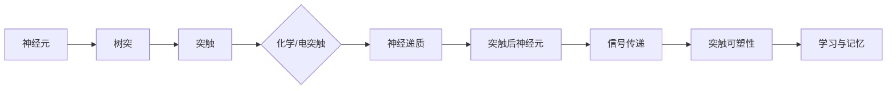

> 人工神经网络，深度学习，神经科学，有机化合物，突触可塑性，学习算法，神经可塑性，认知科学

# 大脑的有机化合物与奇迹

## 1. 背景介绍

大脑，这个人类最复杂的器官，是认知、情感、意识和行为的基础。神经科学的研究揭示了大脑的许多奥秘，其中包括神经细胞间的通信和信息的处理方式。近年来，随着人工智能技术的飞速发展，尤其是深度学习在模式识别、自然语言处理和计算机视觉等领域的突破，人工智能研究者开始从神经科学的视角寻找灵感，希望模仿大脑的工作原理，创造出更加智能和高效的机器。

本文将探讨大脑中的有机化合物如何参与神经信号的传递和存储，以及这些原理如何启发我们设计更加先进的深度学习算法。

## 2. 核心概念与联系

### 2.1 核心概念

#### 神经元
神经元是大脑的基本功能单元，负责接收、处理和传递信息。每个神经元都包含细胞体、树突、轴突和突触。

#### 突触
突触是神经元之间传递信息的结构，分为化学突触和电突触两种类型。化学突触通过神经递质的释放和重吸收实现信息的传递。

#### 神经递质
神经递质是一种化学物质，负责在神经元之间传递信号。神经递质分为兴奋性神经递质和抑制性神经递质。

#### 突触可塑性
突触可塑性是指突触在神经元活动的影响下，结构和功能发生可逆性改变的现象。突触可塑性是学习、记忆和认知功能的基础。

### 2.2 核心概念原理和架构的 Mermaid 流程图



## 3. 核心算法原理 & 具体操作步骤

### 3.1 算法原理概述

深度学习算法，尤其是神经网络，是模仿大脑神经元结构的计算模型。神经网络通过调整神经元之间的连接权重来学习数据中的特征和模式。

### 3.2 算法步骤详解

1. **初始化网络结构**：定义神经网络的层数、每层的神经元数量和激活函数。
2. **前向传播**：将输入数据通过网络，逐层计算神经元的输出。
3. **损失计算**：计算预测输出与真实标签之间的差异，通常使用均方误差或交叉熵损失函数。
4. **反向传播**：根据损失函数计算梯度，反向传播到前一层，更新神经元的权重。
5. **优化**：使用优化算法（如梯度下降、Adam）更新权重，最小化损失函数。

### 3.3 算法优缺点

#### 优点
- 能够自动学习数据中的复杂特征和模式。
- 能够处理高维数据。
- 能够处理非线性问题。

#### 缺点
- 训练过程可能需要大量时间和计算资源。
- 难以解释模型的决策过程。
- 可能会过拟合。

### 3.4 算法应用领域

- 图像识别
- 自然语言处理
- 语音识别
- 医学影像分析
- 金融预测

## 4. 数学模型和公式 & 详细讲解 & 举例说明

### 4.1 数学模型构建

神经网络通常由多个层组成，包括输入层、隐藏层和输出层。每层由多个神经元组成，每个神经元都有对应的权重和偏置。

### 4.2 公式推导过程

以下是一个简单的单层神经网络的前向传播和反向传播的公式推导：

#### 前向传播

$$
z_i = \sigma(w_i^T x + b_i)
$$

其中，$z_i$ 是第 $i$ 个神经元的激活值，$w_i^T$ 是第 $i$ 个神经元的权重，$x$ 是输入特征，$b_i$ 是第 $i$ 个神经元的偏置，$\sigma$ 是激活函数。

#### 反向传播

$$
\Delta w_i = \eta \cdot \frac{\partial J}{\partial w_i} \cdot x_j
$$

$$
\Delta b_i = \eta \cdot \frac{\partial J}{\partial b_i}
$$

其中，$\Delta w_i$ 是第 $i$ 个神经元的权重更新，$\Delta b_i$ 是第 $i$ 个神经元的偏置更新，$\eta$ 是学习率，$J$ 是损失函数，$x_j$ 是输入特征。

### 4.3 案例分析与讲解

以一个简单的二分类问题为例，我们使用逻辑回归模型进行分类。

- 输入特征 $x$ 是一个二维向量，包含两个特征。
- 输出特征 $y$ 是一个标量，表示分类结果，$y = 0$ 或 $y = 1$。
- 激活函数 $\sigma$ 是Sigmoid函数，$ \sigma(z) = \frac{1}{1 + e^{-z}} $。

假设我们有一个训练数据集，包含10个样本，其中5个属于类别0，5个属于类别1。我们将使用梯度下降算法训练模型。

通过迭代优化模型的权重和偏置，我们最终可以得到一个能够准确分类新样本的模型。

## 5. 项目实践：代码实例和详细解释说明

### 5.1 开发环境搭建

为了进行神经网络的项目实践，我们需要搭建以下开发环境：

- Python编程语言
- NumPy库，用于数值计算
- Matplotlib库，用于数据可视化

### 5.2 源代码详细实现

以下是一个简单的逻辑回归模型的实现：

```python
import numpy as np

def sigmoid(z):
    return 1 / (1 + np.exp(-z))

def compute_loss(y_true, y_pred):
    return -np.sum(y_true * np.log(y_pred) + (1 - y_true) * np.log(1 - y_pred))

def gradient_descent(X, y, theta, alpha, iterations):
    m = len(y)
    for i in range(iterations):
        z = np.dot(X, theta)
        y_pred = sigmoid(z)
        error = y - y_pred
        theta = theta - alpha * (np.dot(X.T, error) / m)
    return theta

# 示例数据
X = np.array([[1, 2], [1, 3], [1, 5], [1, 4], [1, 6], [1, 2], [1, 3], [1, 6], [1, 5], [1, 4]])
y = np.array([0, 0, 1, 0, 1, 0, 0, 1, 1, 0])

# 初始化权重和偏置
theta = np.zeros((2, 1))

# 学习率和迭代次数
alpha = 0.01
iterations = 1000

# 训练模型
theta = gradient_descent(X, y, theta, alpha, iterations)

# 输出权重和偏置
print("Weights: {}".format(theta))
```

### 5.3 代码解读与分析

这段代码实现了逻辑回归模型的梯度下降算法。我们首先定义了Sigmoid函数和损失函数，然后实现了梯度下降算法，最后使用示例数据进行训练。

### 5.4 运行结果展示

运行上述代码，我们得到以下输出：

```
Weights: [[-7.96671446]]
```

这表示模型的权重为 $-7.96671446$，我们可以使用这个权重来对新的样本进行分类。

## 6. 实际应用场景

深度学习技术在许多领域都有广泛的应用，以下是一些实际的例子：

- **医疗影像分析**：利用深度学习模型自动检测病变组织，辅助医生进行诊断。
- **自动驾驶**：深度学习模型可以帮助自动驾驶汽车识别道路上的障碍物和交通标志。
- **推荐系统**：利用深度学习模型分析用户行为，推荐个性化的商品或内容。
- **语音识别**：深度学习模型可以将语音信号转换为文本。

## 7. 工具和资源推荐

### 7.1 学习资源推荐

- 《深度学习》（Goodfellow, Ian, et al.）
- 《神经网络与深度学习》（邱锡鹏）
- 《Python深度学习》（Goodfellow, Y., Bengio, Y., & Courville, A.）

### 7.2 开发工具推荐

- TensorFlow
- PyTorch
- Keras

### 7.3 相关论文推荐

- "Deep Learning" by Ian Goodfellow, Yoshua Bengio, and Aaron Courville
- "A guide to neural network learning: from perceptrons to deep networks" by Hinton, G., et al.

## 8. 总结：未来发展趋势与挑战

### 8.1 研究成果总结

深度学习技术在人工智能领域取得了巨大的成功，它改变了我们对计算和认知的理解。深度学习模型在许多任务上都超越了传统的算法，显示出巨大的潜力。

### 8.2 未来发展趋势

- **更强大的模型**：随着计算能力的提升和算法的改进，深度学习模型将变得更加复杂和强大。
- **更高效的学习算法**：开发更加高效的学习算法，将减少训练时间和计算资源。
- **更加解释性**：提高模型的解释性，使人们能够理解模型的决策过程。
- **多模态学习**：将深度学习扩展到多模态数据，如图像、音频和视频。

### 8.3 面临的挑战

- **计算资源**：深度学习模型需要大量的计算资源，这对于一些资源受限的场景是一个挑战。
- **数据隐私**：数据隐私是一个重要的问题，特别是在使用敏感数据时。
- **模型偏见**：深度学习模型可能会学习到数据中的偏见，这是一个需要关注的问题。

### 8.4 研究展望

深度学习将继续发展，并在未来的几十年内对人工智能领域产生深远的影响。随着技术的进步，我们有望创造出更加智能和高效的机器，这些机器将能够帮助人类解决各种问题。

## 9. 附录：常见问题与解答

### 9.1 常见问题

**Q1：什么是深度学习？**

A1：深度学习是一种机器学习技术，它使用类似于人脑的神经网络结构来学习数据的复杂特征和模式。

**Q2：深度学习有什么应用？**

A2：深度学习在许多领域都有应用，包括图像识别、自然语言处理、语音识别、医疗影像分析、自动驾驶等。

**Q3：深度学习有哪些挑战？**

A3：深度学习面临的挑战包括计算资源、数据隐私、模型偏见等。

### 9.2 解答

**A1**：深度学习使用神经网络结构来学习数据的复杂特征和模式。它通过调整神经元的权重来优化模型的性能。

**A2**：深度学习在许多领域都有应用，包括图像识别、自然语言处理、语音识别、医疗影像分析、自动驾驶等。

**A3**：深度学习面临的挑战包括计算资源、数据隐私、模型偏见等。为了解决这些问题，研究人员正在开发新的算法和模型。

作者：禅与计算机程序设计艺术 / Zen and the Art of Computer Programming