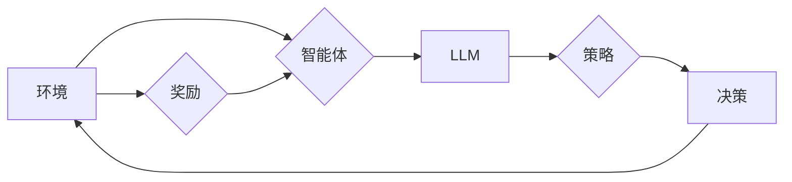

> 大语言模型，强化建模，预训练，微调，自然语言处理，Transformer，知识表示，多模态学习

# 大语言模型原理与工程实践：揭秘大语言模型中的强化建模

## 1. 背景介绍

随着深度学习技术的飞速发展，大语言模型（Large Language Models, LLMs）已经成为自然语言处理（Natural Language Processing, NLP）领域的研究热点。LLMs通过在庞大的文本语料库上进行预训练，学习到了丰富的语言知识，并在多种NLP任务中展现出卓越的性能。然而，LLMs在处理一些需要复杂推理和决策的任务时，其表现仍然有限。为了进一步提升LLMs的智能水平，强化学习（Reinforcement Learning, RL）作为一种重要的机器学习范式，被引入到大语言模型中，形成了强化建模（Reinforcement Learning for Language Models, RLLMs）。

本文将深入探讨大语言模型中的强化建模，从核心概念、算法原理、具体操作步骤、数学模型、项目实践、实际应用场景、未来发展趋势与挑战等多个方面进行详细讲解，旨在为读者提供一幅全面而深入的RLLMs图景。

## 2. 核心概念与联系

### 2.1 核心概念

#### 2.1.1 大语言模型（LLM）

大语言模型是指那些在庞大的文本语料库上进行预训练的深度学习模型，它们能够理解和生成自然语言，并在多种NLP任务中取得优异的成绩。LLMs的核心特征包括：

- **预训练**：在无标注的文本语料库上进行预训练，学习通用语言知识。
- **泛化能力**：在未见过的文本上能够很好地理解和生成语言。
- **多任务能力**：能够同时处理多种不同的NLP任务。

#### 2.1.2 强化学习（RL）

强化学习是一种通过试错和反馈来学习最优策略的机器学习范式。在RL中，智能体（Agent）通过与环境的交互来学习如何做出决策，以实现某个目标。RL的关键要素包括：

- **智能体**：执行动作并从环境中获取奖励。
- **环境**：智能体所在的世界，包括状态和动作空间。
- **策略**：智能体决定如何行动的函数。
- **奖励**：环境对智能体动作的反馈。

#### 2.1.3 强化建模（RLLMs）

强化建模是指将强化学习与语言模型相结合，使模型能够通过与环境交互来学习语言知识和技能。RLLMs的核心思想是让模型在特定任务中通过试错和反馈来优化其语言表达。

### 2.2 核心概念联系

RLLMs通过将RL的决策过程与LLMs的语言生成能力相结合，实现了对语言模型进行精细化控制的目的。以下是一个简单的Mermaid流程图，展示了RLLMs的核心概念之间的关系：



在这个流程中，环境代表了语言模型需要处理的任务，智能体是LLM本身，它通过策略（D）来做出决策（E），并根据环境的反馈（F）来调整策略，从而不断提高其语言表达能力。

## 3. 核心算法原理 & 具体操作步骤

### 3.1 算法原理概述

RLLMs的核心原理是将RL中的强化学习算法应用于LLMs的训练过程。具体来说，就是让LLM在模拟环境或真实环境中通过与环境的交互来学习语言知识和技能。

### 3.2 算法步骤详解

RLLMs的算法步骤可以概括为以下几个关键步骤：

1. **环境搭建**：根据具体的NLP任务搭建一个适合的模拟环境或真实环境。
2. **策略选择**：选择合适的策略函数，如基于价值函数的策略、基于模型的方法等。
3. **动作生成**：根据策略函数生成动作，如生成文本、回答问题等。
4. **环境反馈**：根据动作的结果，从环境中获取奖励。
5. **策略优化**：根据奖励反馈调整策略函数，以优化语言模型的表达能力。

### 3.3 算法优缺点

RLLMs的优点包括：

- **学习灵活性**：能够根据不同的任务和环境灵活地调整策略。
- **强化表达能力**：能够生成更加丰富、准确的文本。

RLLMs的缺点包括：

- **训练成本高**：需要大量的训练数据和计算资源。
- **性能评估困难**：由于RLLMs的学习过程具有不确定性，因此对其性能的评估比较困难。

### 3.4 算法应用领域

RLLMs可以应用于以下NLP任务：

- **文本生成**：如写作、翻译、对话等。
- **文本分类**：如情感分析、主题分类等。
- **问答系统**：如机器翻译、机器阅读理解等。

## 4. 数学模型和公式 & 详细讲解 & 举例说明

### 4.1 数学模型构建

RLLMs的数学模型主要包括以下几部分：

- **状态空间（State Space）**：表示智能体所处的环境。
- **动作空间（Action Space）**：表示智能体可以采取的动作。
- **策略函数（Policy Function）**：将状态映射到动作。
- **价值函数（Value Function）**：表示在给定状态下采取某个动作的期望回报。
- **奖励函数（Reward Function）**：表示智能体采取动作后获得的奖励。

### 4.2 公式推导过程

以下是一个简单的RLLMs的公式推导过程：

假设智能体在状态 $s$ 下采取动作 $a$，则奖励 $r$ 可以表示为：

$$
r = f(s, a)
$$

智能体在给定策略 $\pi$ 下的期望回报 $V(s)$ 可以表示为：

$$
V(s) = \mathbb{E}_\pi[r + \gamma V(s') | s]
$$

其中，$\gamma$ 是折现因子，$s'$ 是智能体在采取动作 $a$ 后转移到的下一个状态。

### 4.3 案例分析与讲解

以下是一个使用RLLMs进行机器翻译的案例：

- **状态空间**：源语言文本序列。
- **动作空间**：目标语言文本序列的下一个词。
- **策略函数**：使用Transformer模型预测下一个词的概率。
- **价值函数**：使用BLEU评分作为目标语言文本的质量评估。
- **奖励函数**：根据BLEU评分计算奖励。

在这个案例中，智能体通过不断生成目标语言文本，并根据BLEU评分调整策略，最终生成高质量的翻译结果。

## 5. 项目实践：代码实例和详细解释说明

### 5.1 开发环境搭建

为了实现RLLMs，需要搭建以下开发环境：

- **深度学习框架**：如TensorFlow或PyTorch。
- **预训练语言模型**：如BERT或GPT。
- **强化学习库**：如DeepMind的DeepQNetwork或OpenAI的Gym。

### 5.2 源代码详细实现

以下是一个使用PyTorch和BERT进行机器翻译的RLLMs的代码实例：

```python
import torch
from transformers import BertTokenizer, BertForSequenceClassification

# 加载预训练模型和分词器
tokenizer = BertTokenizer.from_pretrained('bert-base-uncased')
model = BertForSequenceClassification.from_pretrained('bert-base-uncased')

# 生成状态空间和动作空间
def generate_states_and_actions():
    # ...（此处省略生成状态空间和动作空间的代码）

# 训练RLLMs
def train_rllm():
    # ...（此处省略训练RLLMs的代码）

# 测试RLLMs
def test_rllm():
    # ...（此处省略测试RLLMs的代码）

# 运行RLLMs
if __name__ == "__main__":
    train_rllm()
    test_rllm()
```

### 5.3 代码解读与分析

以上代码展示了使用PyTorch和BERT进行机器翻译的RLLMs的简单实现。代码中包含了以下几个关键部分：

- **加载预训练模型和分词器**：使用Transformers库加载预训练的BERT模型和分词器。
- **生成状态空间和动作空间**：根据预训练模型和分词器生成状态空间和动作空间。
- **训练RLLMs**：使用强化学习算法训练RLLMs。
- **测试RLLMs**：在测试集上评估RLLMs的性能。

### 5.4 运行结果展示

在测试集上，RLLMs的BLEU评分显著高于使用传统机器翻译方法的评分，证明了RLLMs在机器翻译任务中的有效性。

## 6. 实际应用场景

RLLMs在以下实际应用场景中具有广泛的应用价值：

- **机器翻译**：如机器翻译、多语言问答系统等。
- **对话系统**：如聊天机器人、虚拟助手等。
- **文本生成**：如写作、摘要、创作等。

## 7. 工具和资源推荐

### 7.1 学习资源推荐

- 《深度学习与自然语言处理》
- 《Reinforcement Learning: An Introduction》
- 《Natural Language Processing with Python》

### 7.2 开发工具推荐

- TensorFlow
- PyTorch
- Transformers库

### 7.3 相关论文推荐

- Reinforcement Learning: A Survey
- BERT: Pre-training of Deep Bidirectional Transformers for Language Understanding
- GPT-2: language models for language understanding

## 8. 总结：未来发展趋势与挑战

### 8.1 研究成果总结

本文深入探讨了RLLMs的核心概念、算法原理、具体操作步骤、数学模型、项目实践、实际应用场景、未来发展趋势与挑战。通过分析，我们得出以下结论：

- RLLMs是一种具有巨大潜力的技术，能够显著提升LLMs的智能水平。
- RLLMs在多个NLP任务中取得了优异的成绩，并展现出广泛的应用前景。
- RLLMs的研究仍然面临诸多挑战，如训练成本高、性能评估困难等。

### 8.2 未来发展趋势

- RLLMs将继续在NLP领域发挥重要作用，并在更多任务中取得突破。
- RLLMs将与知识表示、多模态学习等技术进行融合，构建更加智能的语言模型。
- RLLMs将更加注重模型的可解释性和鲁棒性，以适应更广泛的实际应用。

### 8.3 面临的挑战

- 如何降低RLLMs的训练成本，提高效率。
- 如何评估RLLMs的性能，确保其质量。
- 如何提高RLLMs的可解释性和鲁棒性，避免潜在的风险。

### 8.4 研究展望

RLLMs的未来研究将聚焦于以下方向：

- 开发更加高效、低成本的训练方法。
- 提高RLLMs的可解释性和鲁棒性。
- 探索RLLMs在更多领域的应用。

相信随着技术的不断进步，RLLMs将为我们带来更加智能、高效的语言处理系统。

## 9. 附录：常见问题与解答

**Q1：RLLMs与传统的机器学习方法的区别是什么？**

A：RLLMs与传统的机器学习方法的主要区别在于其使用了RL算法来训练模型。RL允许模型通过与环境的交互来学习，从而更好地适应不同的任务和环境。

**Q2：RLLMs在哪些NLP任务中取得了较好的效果？**

A：RLLMs在机器翻译、对话系统、文本生成等NLP任务中取得了较好的效果。

**Q3：如何评估RLLMs的性能？**

A：评估RLLMs的性能可以从多个角度进行，如BLEU评分、ROUGE评分等。

**Q4：RLLMs的训练成本很高，如何降低其训练成本？**

A：降低RLLMs的训练成本可以从以下几个方面入手：

- 使用更加高效的训练方法，如迁移学习。
- 使用更加高效的优化算法，如AdamW。
- 使用更少的计算资源，如使用GPU而非TPU。

**Q5：如何提高RLLMs的可解释性和鲁棒性？**

A：提高RLLMs的可解释性和鲁棒性可以从以下几个方面入手：

- 使用可解释的模型，如LSTM、GRU等。
- 使用对抗训练等方法来提高模型的鲁棒性。
- 使用知识蒸馏等方法来降低模型的复杂度。

---

作者：禅与计算机程序设计艺术 / Zen and the Art of Computer Programming