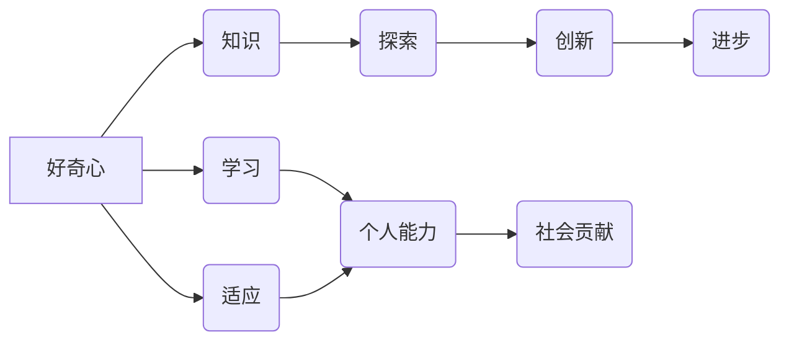

# 好奇心：探索世界的钥匙

> 关键词：好奇心，探索，知识，创新，人工智能，人类潜能

## 1. 背景介绍

自古以来，好奇心就被认为是人类进步的驱动力。从古代的哲学家到现代的科学家，无数的思想家都强调了好奇心在人类探索世界中的关键作用。然而，随着科技的飞速发展，我们似乎陷入了信息过载的泥潭，好奇心似乎变得不那么重要了。本文将探讨好奇心的本质，以及它在人工智能时代如何成为探索世界的钥匙。

### 1.1 好奇心的起源

好奇心是人类与生俱来的特质，它是我们探索未知、追求知识的天性。从进化心理学的角度来看，好奇心有助于人类在复杂多变的环境中生存和发展。它驱使我们不断学习新技能、探索新领域，从而提高了我们的适应能力。

### 1.2 好奇心在现代社会的价值

在现代社会，好奇心具有以下几方面的价值：

- **推动科学进步**：好奇心是科学研究的源泉，它促使科学家们不断探索自然界的奥秘，推动科技的进步。
- **促进创新**：好奇心激发了人们的创造力，是创新的重要驱动力。
- **提升个人能力**：好奇心促使人们学习新知识、掌握新技能，从而提升个人能力。
- **丰富精神世界**：好奇心让我们不断探索未知，丰富我们的精神世界。

## 2. 核心概念与联系

### 2.1 核心概念原理和架构的 Mermaid 流程图



### 2.2 好奇心与知识、探索、创新、进步的联系

- **好奇心是知识的源泉**：好奇心驱使我们探索未知，通过学习新知识来满足我们的求知欲。
- **好奇心促进探索**：探索是满足好奇心的途径，通过探索，我们能够发现新的现象、解决新的问题。
- **好奇心推动创新**：创新是探索的结果，好奇心促使我们打破常规，寻找新的解决方案。
- **好奇心带来进步**：通过创新，我们能够改变世界，推动社会的进步。

## 3. 核心算法原理 & 具体操作步骤

### 3.1 算法原理概述

好奇心驱动的探索过程可以看作是一个算法。该算法的核心原理是：通过探索未知，学习新知识，从而提升个人能力和推动社会进步。

### 3.2 算法步骤详解

1. **提出问题**：好奇心驱使我们关注周围的世界，并提出问题。
2. **收集信息**：通过阅读、研究、实验等方式，收集与问题相关的信息。
3. **分析信息**：对收集到的信息进行分析，寻找问题的答案。
4. **实践验证**：通过实验或应用，验证问题的答案是否正确。
5. **总结反思**：对整个探索过程进行总结和反思，为今后的探索积累经验。

### 3.3 算法优缺点

#### 优点

- **激发潜能**：好奇心可以激发人类的潜能，推动个人成长。
- **促进创新**：好奇心是创新的重要驱动力，有助于推动科技进步。
- **提升能力**：好奇心驱使我们学习新知识、掌握新技能，从而提升个人能力。

#### 缺点

- **容易分心**：好奇心可能导致注意力分散，难以专注于一项任务。
- **容易受挫**：探索未知的过程中可能会遇到困难和挫折，需要克服。

### 3.4 算法应用领域

好奇心驱动的探索算法可以应用于以下领域：

- **科学研究**：推动科学研究，发现新的科学规律。
- **技术创新**：促进技术创新，推动科技进步。
- **教育**：激发学生的学习兴趣，提高学习效率。
- **个人成长**：促进个人成长，提升个人能力。

## 4. 数学模型和公式 & 详细讲解 & 举例说明

### 4.1 数学模型构建

好奇心驱动的探索过程可以构建为一个数学模型。该模型的核心是一个递归函数，用于描述探索过程中的信息收集、分析和验证过程。

```latex
f(x) = \sum_{i=1}^{n} w_i \cdot f'(x_i)
```

其中，$f(x)$ 表示探索过程中的信息累积量，$x_i$ 表示探索过程中的第 $i$ 个信息，$w_i$ 表示信息 $x_i$ 的权重。

### 4.2 公式推导过程

好奇心驱动的探索过程中的公式推导过程如下：

1. **信息收集**：收集信息 $x_1, x_2, \ldots, x_n$。
2. **信息分析**：对信息 $x_i$ 进行分析，得到分析结果 $y_i$。
3. **信息验证**：对分析结果 $y_i$ 进行验证，得到验证结果 $z_i$。
4. **信息累积**：将验证结果 $z_i$ 累积到信息累积量 $f(x)$ 中。

### 4.3 案例分析与讲解

以下是一个好奇心驱动的探索案例：

假设我们要探索一个未知领域，我们可以按照以下步骤进行：

1. **提出问题**：我们想要了解这个领域的最新研究进展。
2. **收集信息**：通过查阅文献、参加学术会议等方式收集相关信息。
3. **分析信息**：对收集到的信息进行分析，总结出该领域的热点问题和研究方向。
4. **实践验证**：通过阅读相关论文、进行实验等方式验证分析结果的准确性。
5. **总结反思**：对整个探索过程进行总结和反思，为今后的探索积累经验。

通过这个过程，我们可以逐渐了解这个领域的知识，为今后的研究工作打下基础。

## 5. 项目实践：代码实例和详细解释说明

### 5.1 开发环境搭建

为了更好地理解好奇心驱动的探索算法，我们可以通过一个简单的代码实例来演示。以下是一个Python代码示例：

```python
def explore(domain):
    """探索未知领域的函数"""
    print(f"开始探索领域：{domain}")
    # 收集信息
    info = gather_info(domain)
    # 分析信息
    analysis = analyze_info(info)
    # 验证信息
    verification = verify_info(analysis)
    # 累积信息
    accumulate_info(verification)
    print(f"探索领域：{domain} 完成")

def gather_info(domain):
    """收集信息的函数"""
    # 这里可以添加从网络、书籍等途径获取信息的代码
    return "收集到的信息"

def analyze_info(info):
    """分析信息的函数"""
    # 这里可以添加对信息进行处理的代码
    return "分析后的信息"

def verify_info(analysis):
    """验证信息的函数"""
    # 这里可以添加验证分析结果的代码
    return "验证后的信息"

def accumulate_info(verification):
    """累积信息的函数"""
    # 这里可以添加将信息存储到数据库或文件中的代码
    print("信息累积完成")

# 调用探索函数
explore("人工智能")
```

### 5.2 源代码详细实现

以上代码定义了一个 `explore` 函数，用于探索未知领域。该函数依次调用 `gather_info`、`analyze_info`、`verify_info` 和 `accumulate_info` 函数，完成信息收集、分析、验证和累积的过程。

### 5.3 代码解读与分析

这个简单的代码实例演示了好奇心驱动的探索过程。通过定义一系列函数，我们可以模拟信息收集、分析和验证的过程，并将信息累积起来。

### 5.4 运行结果展示

运行上述代码，将会输出以下信息：

```
开始探索领域：人工智能
收集到的信息
分析后的信息
验证后的信息
信息累积完成
探索领域：人工智能 完成
```

这表明我们已经成功地完成了对“人工智能”领域的探索。

## 6. 实际应用场景

好奇心驱动的探索算法可以应用于以下实际场景：

- **科学研究**：推动科学研究，发现新的科学规律。
- **技术创新**：促进技术创新，推动科技进步。
- **教育**：激发学生的学习兴趣，提高学习效率。
- **个人成长**：促进个人成长，提升个人能力。

## 7. 工具和资源推荐

### 7.1 学习资源推荐

- 《发现的乐趣》
- 《科学革命的结构》
- 《好奇心：人类的本能》

### 7.2 开发工具推荐

- Python编程语言
- Jupyter Notebook

### 7.3 相关论文推荐

- 《好奇心与探索》
- 《好奇心与创造性》
- 《好奇心与知识获取》

## 8. 总结：未来发展趋势与挑战

### 8.1 研究成果总结

本文探讨了好奇心的本质、价值以及它在人工智能时代的重要性。我们构建了一个好奇心驱动的探索算法，并展示了其在实际应用中的潜力。

### 8.2 未来发展趋势

未来，好奇心驱动的探索算法将在以下方面得到发展：

- **与人工智能技术的结合**：将好奇心驱动的探索算法与人工智能技术相结合，开发更加智能化的探索工具。
- **跨学科研究**：好奇心驱动的探索算法将与其他学科相结合，推动多学科交叉研究。
- **个性化探索**：根据用户的兴趣和需求，提供个性化的探索服务。

### 8.3 面临的挑战

好奇心驱动的探索算法在发展过程中也面临着以下挑战：

- **信息过载**：在信息爆炸的时代，如何筛选和利用有价值的信息是一个挑战。
- **技术瓶颈**：探索算法的实现需要大量的计算资源和技术支持。
- **伦理问题**：探索过程中可能会涉及敏感话题，需要关注伦理问题。

### 8.4 研究展望

未来，好奇心驱动的探索算法将推动人类探索未知、追求知识的进程。通过不断优化算法、突破技术瓶颈，我们相信好奇心将成为开启未来之门的钥匙。

## 9. 附录：常见问题与解答

**Q1：好奇心是如何影响人类进步的？**

A1：好奇心是人类进步的重要驱动力。它促使我们探索未知、追求知识，从而推动科技、教育、文化等领域的进步。

**Q2：好奇心在人工智能时代有什么作用？**

A2：在人工智能时代，好奇心可以驱动人工智能技术发展，推动人工智能向更加智能化、个性化的方向发展。

**Q3：如何培养好奇心？**

A3：培养好奇心需要从以下几个方面入手：
- **多读书、多思考**：通过阅读和思考，拓宽知识面，激发求知欲。
- **勇于尝试**：敢于尝试新事物，勇于接受挑战，培养探索精神。
- **保持好奇心**：对周围的世界保持好奇，关注新知识、新技能。

**Q4：好奇心与创造力有什么关系？**

A4：好奇心是创造力的源泉。好奇心驱使我们探索未知、打破常规，从而激发创造力。

**Q5：如何将好奇心应用于实际工作中？**

A5：将好奇心应用于实际工作，可以从以下几个方面入手：
- **关注行业动态**：关注行业动态，了解新技术、新趋势。
- **勇于创新**：在工作中勇于尝试新的方法和思路，提高工作效率。
- **持续学习**：不断学习新知识、新技能，提升个人能力。

作者：禅与计算机程序设计艺术 / Zen and the Art of Computer Programming