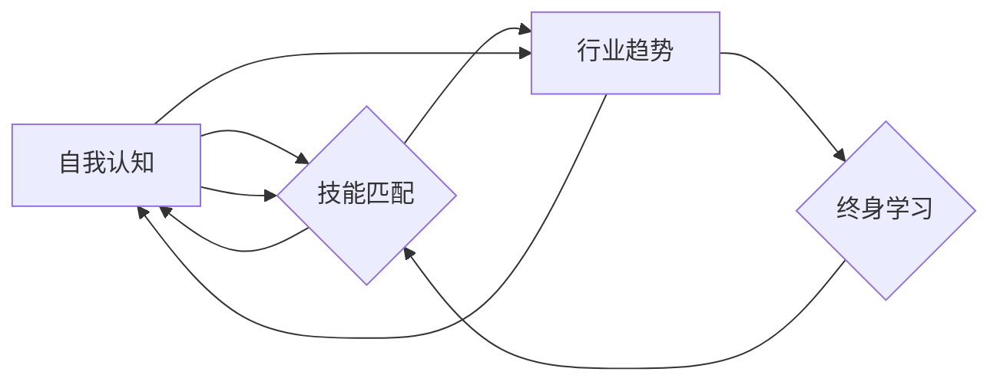

# 如何进行职业规划：如何找到适合自己的职业道路？

> 关键词：职业规划，职业道路，自我认知，技能匹配，行业趋势，终身学习

## 1. 背景介绍

在快节奏的现代社会，职业规划变得尤为重要。随着教育水平的提高和行业变革的加速，人们对于职业发展的期望和挑战也随之增加。如何找到一条既符合个人兴趣和优势，又能适应市场需求和个人成长的职业道路，成为了许多人职业生涯中的首要问题。本文将探讨如何进行有效的职业规划，帮助读者找到适合自己的职业道路。

## 2. 核心概念与联系

### 2.1 职业规划的核心概念

- **自我认知**：了解自己的兴趣、价值观、技能和个性特点。
- **技能匹配**：识别与个人兴趣和价值观相匹配的职业所需的技能。
- **行业趋势**：研究不同行业的发展趋势和就业前景。
- **终身学习**：持续提升个人能力和适应新环境的能力。

### 2.2 职业规划的概念联系 Mermaid 流程图



## 3. 核心算法原理 & 具体操作步骤

### 3.1 算法原理概述

职业规划的原理基于对个人和外部环境的深入分析，通过一系列步骤，最终确定个人职业发展的路径。

### 3.2 算法步骤详解

#### 3.2.1 自我认知

1. **兴趣探索**：通过兴趣测试、职业咨询、实习等方式，了解自己的兴趣所在。
2. **价值观评估**：识别自己的核心价值观，如成就、自由、社会贡献等。
3. **技能分析**：评估自己的技能和优势，包括硬技能（如编程、设计）和软技能（如沟通、团队合作）。
4. **个性特征**：了解自己的个性类型，如内向或外向、分析型或直觉型等。

#### 3.2.2 技能匹配

1. **职业研究**：调查不同职业的技能要求和日常职责。
2. **技能映射**：将个人技能与职业要求进行匹配。
3. **目标设定**：根据技能匹配结果，设定短期和长期的职业目标。

#### 3.2.3 行业趋势

1. **行业分析**：研究不同行业的发展趋势，包括增长速度、技术变革等。
2. **就业前景**：评估不同行业的就业前景和薪资水平。
3. **行业匹配**：根据个人兴趣和行业趋势，选择合适的行业。

#### 3.2.4 终身学习

1. **能力提升**：通过教育、培训、实践等方式提升个人能力。
2. **持续适应**：保持对新技术和新趋势的关注，适应职业发展需求。
3. **职业调整**：根据个人成长和市场变化，适时调整职业方向。

### 3.3 算法优缺点

#### 3.3.1 优点

- 有助于明确职业目标，提高职业发展效率。
- 帮助个人更好地利用自身优势，提高工作满意度。
- 提升对行业的洞察力，更好地适应行业变化。

#### 3.3.2 缺点

- 需要投入时间和精力进行自我认知和行业研究。
- 职业规划是一个持续的过程，需要不断调整和优化。
- 个体差异可能导致规划结果的不确定性。

### 3.4 算法应用领域

职业规划适用于所有希望提高职业发展质量和满意度的个体，特别是在以下领域：

- 求职者
- 在职员工
- 职业转型者
- 学生
- 职业规划师

## 4. 数学模型和公式 & 详细讲解 & 举例说明

### 4.1 数学模型构建

职业规划可以视为一个优化问题，其中目标函数是个人满意度和职业成功度，约束条件包括个人能力、行业需求、时间等。

### 4.2 公式推导过程

职业规划的目标函数可以表示为：

$$
\max_{x} f(x) = \sum_{i=1}^{n} w_i g_i(x)
$$

其中，$x$ 为职业选择，$w_i$ 为权重，$g_i(x)$ 为第 $i$ 个目标的函数，如 $g_1(x)$ 表示个人满意度，$g_2(x)$ 表示职业成功度。

### 4.3 案例分析与讲解

假设小王是一位计算机科学专业的毕业生，他的兴趣在于软件开发，价值观包括创新和成就感。他分析了以下职业选择：

- A. 加入一家初创公司，担任软件开发工程师。
- B. 进入一家大型企业，担任软件工程师。
- C. 成为自由职业者，为客户提供软件开发服务。

根据小王的技能、兴趣和价值观，我们可以构建以下目标函数：

$$
f(x) = 0.5g_1(x) + 0.3g_2(x) + 0.2g_3(x)
$$

其中：

- $g_1(x)$ 为软件开发工程师的满意度，根据小王的兴趣和价值观，取值为 0.8。
- $g_2(x)$ 为软件工程师的职业生涯成功度，根据行业趋势和薪资水平，取值为 0.9。
- $g_3(x)$ 为自由职业者的灵活性和收入稳定性，根据小王的技能和市场需求，取值为 0.6。

计算得到：

$$
f(A) = 0.5 \times 0.8 + 0.3 \times 0.9 + 0.2 \times 0.6 = 0.92
$$

$$
f(B) = 0.5 \times 0.7 + 0.3 \times 0.8 + 0.2 \times 0.7 = 0.79
$$

$$
f(C) = 0.5 \times 0.9 + 0.3 \times 0.7 + 0.2 \times 0.8 = 0.83
$$

根据目标函数的值，小王应该选择 A，即加入一家初创公司担任软件开发工程师。

## 5. 项目实践：代码实例和详细解释说明

### 5.1 开发环境搭建

由于职业规划是一个主观性较强的过程，通常不需要特定的开发环境。

### 5.2 源代码详细实现

以下是使用 Python 实现的简单职业规划工具的代码示例：

```python
def calculate_score(interests, values, skills, job_options):
    scores = {}
    for job, option in job_options.items():
        score = 0
        for i, interest in enumerate(interests):
            score += option['interests'].get(interest, 0)
        for i, value in enumerate(values):
            score += option['values'].get(value, 0)
        for i, skill in enumerate(skills):
            score += option['skills'].get(skill, 0)
        scores[job] = score
    return scores

# 示例数据
interests = ['创新', '团队合作', '挑战']
values = ['成就感', '社会贡献', '自由']
skills = ['编程', '设计', '沟通']
job_options = {
    '初创公司': {'interests': {'创新': 0.8, '挑战': 0.7},
                 'values': {'成就感': 0.9, '自由': 0.6},
                 'skills': {'编程': 0.8, '设计': 0.7, '沟通': 0.8}},
    '大型企业': {'interests': {'团队合作': 0.8, '挑战': 0.6},
                 'values': {'成就感': 0.8, '社会贡献': 0.7},
                 'skills': {'编程': 0.9, '设计': 0.8, '沟通': 0.9}},
    '自由职业者': {'interests': {'自由': 0.9},
                   'values': {'成就感': 0.7, '社会贡献': 0.5},
                   'skills': {'编程': 0.9, '设计': 0.7, '沟通': 0.7}}
}

# 计算得分
scores = calculate_score(interests, values, skills, job_options)
print(scores)
```

### 5.3 代码解读与分析

该代码定义了一个 `calculate_score` 函数，用于计算每个职业选择的得分。函数接收个人兴趣、价值观、技能和职业选项作为输入，返回一个包含每个职业选择得分的字典。

在示例数据中，我们定义了三个职业选项和对应的得分权重。通过调用 `calculate_score` 函数，我们可以得到每个职业选择的得分，并选择得分最高的职业。

## 6. 实际应用场景

职业规划在实际应用中具有广泛的应用场景，以下是一些典型的应用：

- **教育领域**：帮助大学生选择专业和职业方向。
- **招聘领域**：为求职者提供职业规划和职业推荐服务。
- **企业管理**：帮助员工进行职业发展规划和培训。
- **个人发展**：帮助个人制定个人成长计划。

## 7. 工具和资源推荐

### 7.1 学习资源推荐

- 《职业规划与管理》
- 《如何选择你的职业》
- 《职业规划宝典》

### 7.2 开发工具推荐

- 职业规划软件
- 个人技能评估工具
- 行业分析报告

### 7.3 相关论文推荐

- 《职业规划：理论与实践》
- 《职业规划与个人发展》
- 《职业规划的心理动力学》

## 8. 总结：未来发展趋势与挑战

### 8.1 研究成果总结

本文探讨了如何进行有效的职业规划，包括自我认知、技能匹配、行业趋势和终身学习等方面。通过构建数学模型和代码实例，展示了职业规划的原理和操作步骤。

### 8.2 未来发展趋势

随着人工智能和大数据技术的发展，职业规划将更加个性化、智能化和实时化。未来的职业规划工具将能够更好地理解个人需求，提供更加精准的职业建议。

### 8.3 面临的挑战

职业规划面临着个体差异、市场变化和科技发展等挑战。如何应对这些挑战，需要职业规划理论和实践的不断创新。

### 8.4 研究展望

未来，职业规划的研究将更加注重跨学科融合，结合心理学、社会学、经济学等学科的理论和方法，为个人和社会提供更加全面和有效的职业规划服务。

## 9. 附录：常见问题与解答

**Q1：职业规划需要遵循哪些原则？**

A：职业规划需要遵循以下原则：
- 自我认知：了解自己的兴趣、价值观和技能。
- 目标导向：设定明确、可衡量的职业目标。
- 动态调整：根据个人成长和市场变化，适时调整职业规划。

**Q2：如何进行自我认知？**

A：可以通过以下方式进行自我认知：
- 兴趣探索：尝试不同类型的活动，了解自己的兴趣所在。
- 价值观评估：思考自己最看重的是什么，如成就感、社会贡献等。
- 技能分析：评估自己的技能和优势，包括硬技能和软技能。
- 个性特征：了解自己的个性类型，如内向或外向、分析型或直觉型等。

**Q3：如何选择合适的职业？**

A：选择合适的职业需要考虑以下因素：
- 兴趣和价值观：选择与自己兴趣和价值观相匹配的职业。
- 技能和优势：选择自己具备相关技能和优势的职业。
- 行业趋势：选择有良好发展前景和就业机会的职业。
- 个人成长：选择能够帮助自己成长的职业。

**Q4：职业规划是否需要专业人士的帮助？**

A：职业规划是一个复杂的过程，个人可能需要专业人士的帮助，如职业规划师、职业咨询师等。专业人士可以提供专业的指导和建议，帮助个人更好地进行职业规划。

**Q5：如何应对职业规划中的挑战？**

A：应对职业规划中的挑战需要以下策略：
- 保持积极心态：相信自己的能力，勇于面对挑战。
- 持续学习：不断提升自己的技能和知识，适应市场变化。
- 灵活调整：根据个人成长和市场变化，适时调整职业规划。
- 寻求支持：向家人、朋友和专业人士寻求支持和建议。

作者：禅与计算机程序设计艺术 / Zen and the Art of Computer Programming