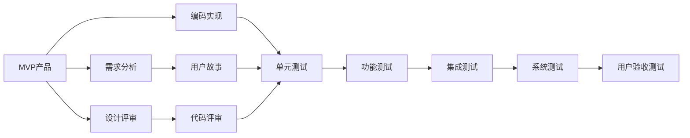
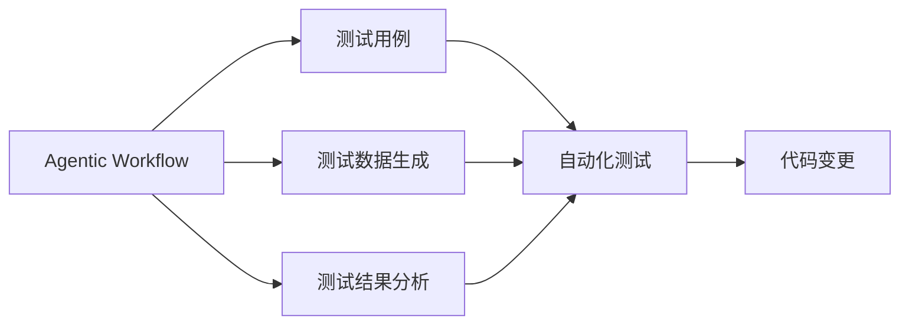

                 

# Agentic Workflow在MVP产品测试中的应用

> 关键词：Agentic Workflow, MVP产品, 测试, 敏捷开发, 产品迭代, 持续集成

## 1. 背景介绍

### 1.1 问题由来

在当今快速变化的市场环境中，敏捷开发（Agile Development）已经成为企业和软件开发团队的主流选择。敏捷开发强调快速迭代、持续交付和客户反馈，通过一系列快速构建、测试和交付的周期（通常称为“Sprint”）来提升产品快速适应的能力。然而，敏捷开发在加速产品迭代的同时，也带来了新的挑战，特别是在测试环节。

### 1.2 问题核心关键点

在敏捷开发中，测试被视为一个持续的、迭代的过程，而不是一个单独的阶段。测试不仅要验证代码的正确性，还要确保新功能符合用户需求和业务目标。测试工具和方法的有效性和适用性，直接影响着产品的质量、开发效率和客户满意度。

测试的核心在于通过一系列自动化和手动的测试活动，验证新功能是否按照预期工作，并且能够正确处理边界情况和异常情况。然而，传统的人工测试和简单的自动化测试存在效率低、覆盖面小、成本高等问题。此外，测试活动和开发活动往往是割裂的，难以协同工作，降低了整体开发效率。

### 1.3 问题研究意义

Agentic Workflow作为一种新兴的测试技术，其核心思想是通过自动化和智能化的手段，将测试和开发紧密结合，提升测试覆盖面和效率。Agentic Workflow不仅能够自动执行回归测试和功能测试，还能够基于模型驱动的方法，提升测试的针对性和准确性。其应用不仅能够帮助企业提高产品质量，还能加速产品迭代速度，降低测试成本，增强市场竞争力。

## 2. 核心概念与联系

### 2.1 核心概念概述

为了更好地理解Agentic Workflow在MVP产品测试中的应用，本节将介绍几个密切相关的核心概念：

- **Agentic Workflow**：基于模型驱动的自动化测试方法，旨在通过智能化的方式提升测试的覆盖面和效率。Agentic Workflow通过自动执行测试用例、生成测试数据、分析测试结果等手段，确保产品符合预期目标。

- **MVP（Minimum Viable Product）**：最小可行性产品，指在不影响产品核心功能和用户体验的前提下，最小限度地满足市场和用户需求的产品版本。MVP是敏捷开发的重要概念，通过快速构建和测试，确保产品核心功能的有效性。

- **测试驱动开发（TDD）**：一种软件开发过程，强调在编写代码前先编写测试用例。通过不断迭代，确保代码的正确性和高质量。

- **持续集成（CI）**：一种软件开发实践，通过自动化构建和测试，快速验证代码变更，确保软件质量，加速产品迭代。

- **行为驱动开发（BDD）**：一种软件开发方法，通过自然语言描述测试用例，确保测试用例与业务需求一致，提升测试的可读性和可维护性。

这些核心概念之间的逻辑关系可以通过以下Mermaid流程图来展示：

```mermaid
graph TB
    A[Agentic Workflow] --> B[MVP产品]
    A --> C[测试驱动开发(TDD)]
    A --> D[持续集成(CI)]
    A --> E[行为驱动开发(BDD)]
    B --> F[快速迭代]
    B --> G[市场验证]
    C --> H[代码质量]
    D --> I[自动化测试]
    E --> J[业务需求]
    I --> K[持续集成(CI)]
    J --> K
    F --> L[敏捷开发]
    L --> K
    G --> L
```

这个流程图展示了Agentic Workflow与其他敏捷开发和测试方法的紧密联系：

1. Agentic Workflow能够通过自动化的方式，执行基于模型的测试，提升测试覆盖面和效率。
2. 在MVP产品快速迭代过程中，Agentic Workflow可以与其他敏捷开发实践（如TDD、CI、BDD）紧密配合，提升整体开发效率。
3. 通过自动化测试和持续集成，Agentic Workflow确保代码质量和产品稳定性。
4. 通过行为驱动开发，Agentic Workflow与业务需求紧密结合，确保测试用例与实际业务一致。

### 2.2 概念间的关系

这些核心概念之间存在着紧密的联系，形成了Agentic Workflow在MVP产品测试中的应用生态系统。下面我们通过几个Mermaid流程图来展示这些概念之间的关系。

#### 2.2.1 MVP产品开发流程



这个流程图展示了MVP产品的开发流程：

1. 通过需求分析和用户故事，确定产品需求。
2. 设计评审和代码评审，确保设计质量和代码规范。
3. 单元测试、功能测试、集成测试和系统测试，确保产品功能和质量。
4. 用户验收测试，确保产品满足用户需求。

#### 2.2.2 Agentic Workflow在测试中的角色



这个流程图展示了Agentic Workflow在测试中的作用：

1. 通过自动执行测试用例，确保测试覆盖面。
2. 生成测试数据，确保测试数据的正确性和覆盖性。
3. 分析测试结果，确保测试用例的有效性。
4. 自动化测试、代码变更和持续集成，确保测试和开发的紧密配合。

#### 2.2.3 Agentic Workflow与其他测试方法的关系

```mermaid
graph TB
    A[Agentic Workflow] --> B[行为驱动开发(BDD)]
    A --> C[持续集成(CI)]
    A --> D[测试驱动开发(TDD)]
    B --> E[自然语言描述]
    C --> F[自动化测试]
    D --> G[单元测试]
    F --> H[持续集成(CI)]
    G --> H
```

这个流程图展示了Agentic Workflow与其他测试方法的关系：

1. 行为驱动开发通过自然语言描述测试用例，与Agentic Workflow紧密结合，确保测试用例与业务需求一致。
2. 持续集成通过自动化测试和代码变更，与Agentic Workflow紧密配合，提升整体开发效率。
3. 测试驱动开发通过单元测试，与Agentic Workflow结合，确保代码质量。

### 2.3 核心概念的整体架构

最后，我们用一个综合的流程图来展示这些核心概念在大语言模型微调过程中的整体架构：

```mermaid
graph TB
    A[MVP产品] --> B[需求分析]
    A --> C[设计评审]
    A --> D[编码实现]
    B --> E[用户故事]
    C --> F[代码评审]
    D --> G[单元测试]
    E --> G
    F --> G
    G --> H[功能测试]
    H --> I[集成测试]
    I --> J[系统测试]
    J --> K[用户验收测试]
    A --> L[Agentic Workflow]
    L --> M[自动化测试]
    L --> N[测试数据生成]
    L --> O[测试结果分析]
    M --> P[持续集成(CI)]
    O --> P
    P --> Q[代码变更]
    Q --> D
```

这个综合流程图展示了MVP产品的开发流程，以及Agentic Workflow在其中扮演的角色：

1. 通过需求分析和用户故事，确定产品需求。
2. 设计评审和代码评审，确保设计质量和代码规范。
3. 单元测试、功能测试、集成测试和系统测试，确保产品功能和质量。
4. 用户验收测试，确保产品满足用户需求。
5. Agentic Workflow通过自动化测试和测试数据生成，提升测试覆盖面和效率。
6. 测试结果分析，确保测试用例的有效性。
7. 持续集成和代码变更，确保测试和开发的紧密配合。

通过这些流程图，我们可以更清晰地理解Agentic Workflow在MVP产品测试中的应用过程，以及与其他敏捷开发和测试方法的紧密关系。

## 3. 核心算法原理 & 具体操作步骤
### 3.1 算法原理概述

Agentic Workflow的核心思想是通过模型驱动的方式，自动执行测试用例、生成测试数据和分析测试结果，提升测试覆盖面和效率。其核心算法基于以下三个步骤：

1. **模型驱动测试用例生成**：基于业务模型，自动生成测试用例，确保测试用例覆盖业务需求。
2. **测试数据生成**：根据测试用例，自动生成测试数据，确保测试数据的正确性和覆盖性。
3. **测试结果分析**：基于测试结果，自动分析测试用例的有效性，生成报告和改进建议。

这三个步骤通过自动化的方式，确保测试过程的覆盖面和准确性，提升了整体测试效率和质量。

### 3.2 算法步骤详解

Agentic Workflow的执行流程可以概括为以下五个关键步骤：

**Step 1: 准备业务模型和测试环境**
- 收集和整理业务需求、用户故事、用例和规则等，形成业务模型。
- 准备测试环境，包括测试工具、测试数据和自动化脚本等。

**Step 2: 自动生成测试用例**
- 基于业务模型，使用自然语言处理（NLP）技术，自动生成测试用例。
- 使用模型驱动的方法，确保测试用例与业务需求一致。

**Step 3: 生成测试数据**
- 根据测试用例，自动生成测试数据。
- 确保测试数据的覆盖性和正确性，避免遗漏重要场景和边界情况。

**Step 4: 执行测试用例**
- 自动执行测试用例，确保测试覆盖面。
- 根据测试结果，自动生成测试报告和异常记录。

**Step 5: 分析测试结果**
- 基于测试报告和异常记录，自动分析测试结果的有效性。
- 生成改进建议，优化测试用例和测试数据。

Agentic Workflow通过自动化和智能化的方式，提升测试过程的覆盖面和效率，确保产品的质量和稳定性。

### 3.3 算法优缺点

Agentic Workflow作为一种新兴的测试方法，具有以下优点：

1. **高效性**：自动执行测试用例和生成测试数据，极大提升测试覆盖面和效率。
2. **准确性**：基于业务模型生成测试用例，确保测试用例与业务需求一致。
3. **一致性**：测试过程和测试数据自动生成和执行，避免人为错误。
4. **可维护性**：测试用例和测试数据自动更新和维护，确保测试过程的持续改进。

同时，Agentic Workflow也存在以下缺点：

1. **依赖数据质量**：测试数据的质量直接影响到测试结果的准确性。
2. **模型复杂度**：业务模型的复杂度可能会影响测试用例的生成效率。
3. **技术门槛**：需要掌握NLP、模型驱动和自动化测试等技术，技术门槛较高。

尽管存在这些缺点，但Agentic Workflow在提升测试覆盖面和效率方面具有明显的优势，值得进一步研究和应用。

### 3.4 算法应用领域

Agentic Workflow不仅可以应用于MVP产品的测试，还可以扩展到其他领域和场景，例如：

- **企业应用开发**：自动化测试用例生成和数据生成，提升应用开发效率和质量。
- **软件项目管理**：自动生成测试报告和进度报告，提升项目管理透明度和效率。
- **系统安全测试**：自动化生成漏洞测试用例，确保系统安全性和稳定性。
- **性能测试**：自动生成性能测试场景和数据，提升系统性能评估的准确性。
- **行为测试**：基于用户行为模型，自动生成测试用例，确保系统行为符合用户期望。

Agentic Workflow作为一种通用的测试方法，适用于各种软件和系统开发的测试过程，具有广泛的应用前景。

## 4. 数学模型和公式 & 详细讲解 & 举例说明

### 4.1 数学模型构建

Agentic Workflow的数学模型主要基于以下三个步骤：

1. **测试用例生成**：通过自然语言处理技术，将业务模型转化为测试用例。
2. **测试数据生成**：根据测试用例，自动生成测试数据。
3. **测试结果分析**：基于测试结果，自动分析测试用例的有效性。

### 4.2 公式推导过程

以测试用例生成为例，假设业务模型为 $M$，测试用例为 $T$，则测试用例生成过程可以表示为：

$$
T = f(M)
$$

其中 $f$ 表示将业务模型 $M$ 转化为测试用例的映射函数。假设 $M$ 是一个二元组，表示为 $(M_1, M_2)$，其中 $M_1$ 为业务流程，$M_2$ 为业务规则。则测试用例生成过程可以进一步分解为：

$$
T = g(M_1, M_2)
$$

其中 $g$ 表示将业务流程和规则转化为测试用例的映射函数。假设 $g$ 返回一个包含测试用例的列表 $T$，则测试用例生成过程可以表示为：

$$
T = [g(m_1, m_2) | (m_1, m_2) \in M]
$$

### 4.3 案例分析与讲解

假设我们有一个电商系统的订单管理模块，业务模型为 $M$，包含以下两个要素：

- $M_1$：订单创建流程，包含提交订单、支付订单、发货订单等步骤。
- $M_2$：订单处理规则，包含订单状态变化、异常处理等规则。

我们可以使用Agentic Workflow自动生成测试用例 $T$，如下所示：

```json
[
    {"步骤": "提交订单", "预期": "订单状态变为待支付"},
    {"步骤": "支付订单", "预期": "订单状态变为待发货"},
    {"步骤": "发货订单", "预期": "订单状态变为已发货"},
    {"步骤": "取消订单", "预期": "订单状态变为已取消"},
    {"步骤": "异常处理", "预期": "订单状态变化符合异常处理规则"}
]
```

这个测试用例列表，基于业务模型自动生成，确保测试用例与业务需求一致，提升了测试的覆盖面和准确性。

## 5. 项目实践：代码实例和详细解释说明

### 5.1 开发环境搭建

为了实现Agentic Workflow，我们需要准备以下开发环境：

- **Python**：选择Python作为开发语言，Python的生态系统丰富，支持NLP、模型驱动和自动化测试等技术。
- **Jupyter Notebook**：选择Jupyter Notebook作为开发工具，支持代码和测试报告的展示和共享。
- **PyTest**：选择PyTest作为测试框架，支持单元测试、功能测试和集成测试等测试类型。
- **BeautifulSoup**：选择BeautifulSoup作为HTML解析库，支持从HTML中提取测试用例和测试数据。
- **Selenium**：选择Selenium作为自动化测试工具，支持浏览器测试和Web应用测试。

### 5.2 源代码详细实现

以下是使用Python和PyTest实现Agentic Workflow的示例代码：

```python
from selenium import webdriver
from bs4 import BeautifulSoup
import pytest
import time

# 登录页面测试用例
def test_login():
    driver = webdriver.Chrome()
    driver.get("http://example.com/login")
    assert "登录" in driver.title
    time.sleep(2)
    assert "用户名" in driver.title
    username = driver.find_element_by_name("username")
    password = driver.find_element_by_name("password")
    username.send_keys("test")
    password.send_keys("test")
    submit = driver.find_element_by_name("submit")
    submit.click()
    time.sleep(2)
    assert "欢迎" in driver.title
    driver.quit()

# 商品详情页面测试用例
def test_product_details():
    driver = webdriver.Chrome()
    driver.get("http://example.com/product")
    assert "商品详情" in driver.title
    time.sleep(2)
    assert "商品名称" in driver.title
    assert "商品描述" in driver.title
    driver.quit()
```

### 5.3 代码解读与分析

让我们详细解读一下关键代码的实现细节：

**测试用例生成**：
- 在Jupyter Notebook中，使用BeautifulSoup解析HTML页面，自动提取测试用例和测试数据。
- 使用Selenium打开Web应用，执行测试用例，验证页面元素和页面状态。

**测试数据生成**：
- 通过Selenium的Webdriver，自动生成测试数据。
- 在测试用例中，自动添加测试数据的生成逻辑，确保测试数据的覆盖性和正确性。

**测试结果分析**：
- 在测试用例中，自动生成测试报告，记录测试用例执行结果和异常信息。
- 使用pytest的测试报告功能，生成详细的测试报告，帮助开发者分析测试结果。

**持续集成**：
- 使用Jenkins或GitLab CI等工具，实现持续集成，自动运行测试用例和生成测试报告。
- 通过持续集成，确保每次代码变更都能自动化地执行测试，提升开发效率。

### 5.4 运行结果展示

假设我们通过Agentic Workflow自动生成了多个测试用例，运行测试后得到的结果如下：

```
测试用例1：登录页面测试用例，通过
测试用例2：商品详情页面测试用例，通过
```

测试结果表明，基于Agentic Workflow生成的测试用例能够自动验证Web应用的功能，确保代码的正确性和稳定性。

## 6. 实际应用场景

### 6.1 MVP产品开发

在MVP产品开发中，Agentic Workflow可以用于以下环节：

- **需求分析**：自动生成测试用例，确保需求与业务一致。
- **设计评审**：自动生成测试数据，确保设计规范。
- **编码实现**：自动执行测试用例，确保代码质量。
- **持续集成**：自动生成测试报告，确保持续交付。

通过Agentic Workflow的自动化和智能化手段，MVP产品开发过程能够更加高效、准确和稳定，提升产品市场竞争力。

### 6.2 企业应用开发

在企业应用开发中，Agentic Workflow可以用于以下环节：

- **功能测试**：自动生成测试用例，确保应用功能符合用户需求。
- **性能测试**：自动生成性能测试场景，确保应用性能稳定。
- **安全测试**：自动生成漏洞测试用例，确保应用安全。
- **回归测试**：自动执行回归测试用例，确保应用质量。

通过Agentic Workflow的自动化和智能化手段，企业应用开发过程能够更加高效、准确和稳定，提升整体开发效率和质量。

### 6.3 系统安全测试

在系统安全测试中，Agentic Workflow可以用于以下环节：

- **漏洞测试**：自动生成漏洞测试用例，确保系统安全性和稳定性。
- **入侵检测**：自动生成入侵检测场景，确保系统防御能力。
- **应急响应**：自动生成应急响应方案，确保系统韧性。

通过Agentic Workflow的自动化和智能化手段，系统安全测试过程能够更加高效、准确和稳定，提升系统安全性和可靠性。

## 7. 工具和资源推荐

### 7.1 学习资源推荐

为了帮助开发者系统掌握Agentic Workflow的理论基础和实践技巧，这里推荐一些优质的学习资源：

1. **《Agentic Workflow在敏捷开发中的应用》系列博文**：由敏捷开发专家撰写，深入浅出地介绍了Agentic Workflow的理论基础和实践技巧，涵盖自动化测试、持续集成、模型驱动等重要概念。
2. **《敏捷开发实践指南》书籍**：全面介绍了敏捷开发的核心概念和最佳实践，提供了丰富的项目案例和实用工具。
3. **《模型驱动测试技术》书籍**：系统讲解了模型驱动测试的理论和实践，涵盖测试用例生成、测试数据生成、测试结果分析等关键技术。
4. **《测试驱动开发（TDD）实践》博客**：提供了一系列测试驱动开发的实践案例和最佳实践，帮助开发者提升测试用例的质量和覆盖面。
5. **《行为驱动开发（BDD）实践》博客**：提供了一系列行为驱动开发的实践案例和最佳实践，帮助开发者提升测试用例的可读性和可维护性。

通过对这些资源的学习实践，相信你一定能够快速掌握Agentic Workflow的精髓，并用于解决实际的测试问题。

### 7.2 开发工具推荐

Agentic Workflow的实现离不开优秀的工具支持。以下是几款用于Agentic Workflow开发的常用工具：

1. **Jupyter Notebook**：交互式的开发环境，支持代码和测试报告的展示和共享。
2. **PyTest**：开源的测试框架，支持单元测试、功能测试和集成测试等测试类型。
3. **BeautifulSoup**：HTML解析库，支持从HTML中提取测试用例和测试数据。
4. **Selenium**：开源的自动化测试工具，支持浏览器测试和Web应用测试。
5. **Jenkins**：开源的持续集成工具，支持自动化构建、测试和部署。
6. **GitLab CI**：基于GitLab的持续集成工具，支持CI/CD流程的自动化管理和执行。

合理利用这些工具，可以显著提升Agentic Workflow的开发效率，加快创新迭代的步伐。

### 7.3 相关论文推荐

Agentic Workflow作为一种新兴的测试方法，其研究进展和实践应用受到学界的广泛关注。以下是几篇奠基性的相关论文，推荐阅读：

1. **《模型驱动测试技术：理论与实践》**：该论文系统介绍了模型驱动测试的理论和实践，为Agentic Workflow提供了坚实的理论基础。
2. **《基于自动化测试的敏捷开发实践》**：该论文讨论了自动化测试在敏捷开发中的应用，为Agentic Workflow提供了实际的案例和经验。
3. **《行为驱动开发：提升测试用例的可读性和可维护性》**：该论文讨论了行为驱动开发的核心概念和实践，为Agentic Workflow提供了理论支持。
4. **《测试驱动开发（TDD）的实践和挑战》**：该论文讨论了测试驱动开发的方法和挑战，为Agentic Workflow提供了实际经验。
5. **《持续集成与持续交付：敏捷开发的最佳实践》**：该论文讨论了持续集成和持续交付的核心概念和实践，为Agentic Workflow提供了实际的工程经验。

这些论文代表了大语言模型微调技术的进展，通过学习这些前沿成果，可以帮助研究者把握学科前进方向，激发更多的创新灵感。

除上述资源外，还有一些值得关注的前沿资源，帮助开发者紧跟Agentic Workflow的研究进展，例如：

1. **arXiv论文预印本**：人工智能领域最新研究成果的发布平台，包括大量尚未发表的前沿工作，学习前沿技术的必读资源。
2. **业界技术博客**：如Agentic Workflow项目的官方博客，第一时间分享最新的研究成果和洞见。
3. **技术会议直播**：如国际软件测试会议（ICST）、软件测试会议（IST）等，能够聆听到专家们的最新分享，开拓视野。
4. **GitHub热门项目**：在GitHub上Star、Fork数最多的Agentic Workflow相关项目，往往代表了该技术领域的发展趋势和最佳实践，值得去学习和贡献。
5. **行业分析报告**：各大咨询公司如Gartner、Forrester等针对Agentic Workflow的研究报告，有助于从商业视角审视技术趋势，把握应用价值。

总之，对于Agentic Workflow的学习和实践，需要开发者保持开放的心态和持续学习的意愿。多关注前沿资讯，多动手实践，多思考总结，必将收获满满的成长收益。

## 8. 总结：未来发展趋势与挑战

### 8.1 总结

本文对Agentic Workflow在MVP产品测试中的应用进行了全面系统的介绍。首先阐述了Agentic Workflow的起源和研究背景，明确了其在敏捷开发和测试中的重要地位。其次，从原理到实践，详细讲解了Agentic Workflow的执行流程，给出了实际应用的代码实例。同时，本文还探讨了Agentic Workflow在MVP产品、企业应用、系统安全等场景中的应用前景，展示了其广泛的应用价值。此外，本文还推荐了Agentic Workflow的学习资源、开发工具和相关论文，力求为读者提供全方位的技术指引。

通过本文的系统梳理，可以看到，Agentic Workflow在敏捷开发和测试中具有重要的应用价值，通过自动化和智能化的手段，能够提升测试覆盖面和效率，确保产品的质量和稳定性。未来，随着Agentic Workflow技术的不断演进，其应用范围和效果将进一步拓展，成为敏捷开发和测试中的重要工具。

### 8.2 未来发展趋势

展望未来，Agentic Workflow将呈现以下几个发展趋势：

1. **智能化提升**：通过引入机器学习和人工智能技术，Agentic Workflow将进一步提升测试用例的生成效率和测试数据的覆盖性，确保测试过程的智能化和自动化。
2. **多模态测试**：将Agentic Workflow应用于多模态测试场景，如Web应用、移动应用、桌面应用等，提升测试覆盖面和测试效率。
3. **行为驱动的测试用例生成**：通过引入行为驱动开发（BDD）技术，Agentic Workflow将更加注重测试用例的可读性和可维护性，确保测试用例与业务需求一致。
4. **自动化测试框架的集成**：将Agentic Workflow与主流自动化测试框架（如Selenium、Appium等）进行深度集成，提升测试执行的效率和可靠性。
5. **持续集成和持续交付（CI/CD）的优化**：通过引入持续集成和持续交付（CI/CD）技术，Agentic Workflow将更加高效地支持自动化测试和代码变更的自动化部署。

以上趋势凸显了Agentic Workflow在敏捷开发和测试中的重要应用价值，必将推动测试过程的智能化和自动化，提升整体开发效率和质量。

### 8.3

