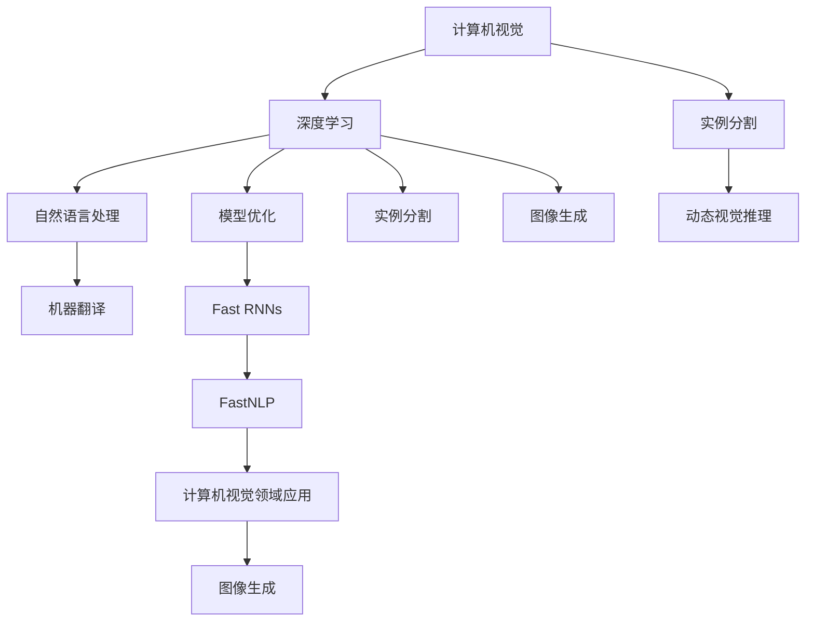
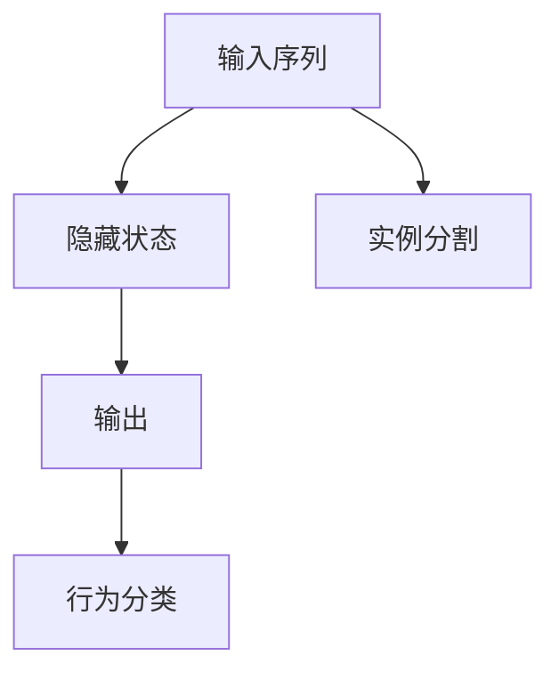
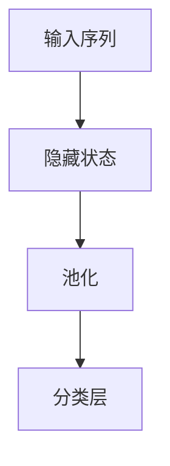

                 

# Andrej Karpathy：AI 领域的先驱者

Andrej Karpathy 是深度学习领域的先锋和巨匠，作为 PyTorch 的首席开发者、Fast.ai 的创始人之一，以及 NVIDIA 人工智能实验室的研究员，他在计算机视觉、自然语言处理和深度学习理论研究方面均取得了卓越的成就，并被授予计算机图灵奖这一殊荣。本文将探讨他的职业生涯、贡献以及这些贡献对 AI 领域的影响。

## 1. 背景介绍

### 1.1 早年经历
Andrej Karpathy 出生于德国，1992 年移居美国，在斯坦福大学学习计算机科学和数学。他在本科期间就显示了对计算机视觉的浓厚兴趣，后来在斯坦福大学计算机视觉实验室进行了研究生阶段的研究。Karpathy 的博士论文主题是动态视觉推理，并且他在这段期间发布了一些突破性的论文，奠定了他在计算机视觉领域的学术地位。

### 1.2 职业生涯早期
Karpathy 在 2005 年开始转向工业界，加入微软研究院工作。2008 年，他离开微软，加入了斯坦福大学视觉实验室任教，并且创办了 Fast.ai 网站，分享和推广深度学习知识。2013 年，Karpathy 加入 Google Brain 团队，研究计算机视觉和深度学习。2016 年，他加入 NVIDIA，负责创建 NVIDIA 的 AI 平台。

## 2. 核心概念与联系

### 2.1 核心概念概述
Andrej Karpathy 的核心贡献主要集中在以下几个领域：

- **计算机视觉**：他领导了计算机视觉领域中的多个重要研究项目，包括动态视觉推理、实例分割、图像生成等。
- **深度学习与模型优化**：他开创了 Fast RNNs 和 FastNLP，这些模型在深度学习中引起了广泛关注。
- **自然语言处理**：他研究了基于 Transformer 的机器翻译和对话生成技术。
- **AI 教育与开源**：他通过 Fast.ai 平台普及深度学习知识，并使 PyTorch 成为深度学习领域的主流框架。

### 2.2 核心概念联系
Karpathy 的研究工作形成了一个从理论到实际应用的生态系统，如图示：



这个图示表明，Karpathy 的工作不仅在计算机视觉领域引起了重大影响，同时也推动了自然语言处理和机器翻译技术的进步。他的研究成果从理论到实际应用，覆盖了深度学习模型的优化、图像生成、动态视觉推理等多个方向，影响深远。

## 3. 核心算法原理 & 具体操作步骤

### 3.1 算法原理概述
Karpathy 的研究主要集中在以下几个核心算法上：

- **动态视觉推理**：开发了动态视觉推理网络，能够处理动态视频数据，并且可以进行场景理解、行为预测等。
- **Fast RNNs**：引入了一种快速循环神经网络，用于处理序列数据，加快模型训练速度。
- **FastNLP**：一种基于 RNN 的自然语言处理模型，能够在短时间内完成大规模语言模型的训练。
- **基于 Transformer 的机器翻译**：提出了基于自注意力机制的机器翻译模型，提升了机器翻译的质量和效率。

### 3.2 算法步骤详解
以 Fast RNNs 为例，其训练步骤如下：

1. **模型定义**：
   - 定义 RNN 的架构，包括循环神经网络的状态变量、隐藏层、输入输出。
   - 定义损失函数，通常是交叉熵损失。

2. **前向传播**：
   - 将输入数据输入模型，计算输出。
   - 计算损失函数。

3. **反向传播**：
   - 计算损失函数对模型参数的梯度。
   - 使用梯度下降等优化算法更新模型参数。

4. **模型评估**：
   - 使用验证集评估模型性能。
   - 调整模型超参数，如学习率、批大小等。

5. **迭代训练**：
   - 循环上述步骤，直到模型收敛或达到预设的迭代次数。

### 3.3 算法优缺点
Fast RNNs 的优点包括：

- 快速：显著降低了模型训练的时间复杂度。
- 高效：可以处理大规模的序列数据。

其缺点包括：

- 复杂：模型结构和计算复杂度较高。
- 可解释性差：动态视觉推理模型较为复杂，难以解释内部机制。

### 3.4 算法应用领域
Fast RNNs 和 FastNLP 模型已经在计算机视觉、自然语言处理、机器翻译等多个领域得到了广泛应用。例如，Fast RNNs 被应用于视频生成、行为识别等场景，而 FastNLP 则被广泛应用于文本分类、情感分析等任务。

## 4. 数学模型和公式 & 详细讲解 & 举例说明

### 4.1 数学模型构建
Fast RNNs 的数学模型可以表示为：

$$
h_{t+1} = f(W_{ih}h_t + W_{hh}h_t + U_{ix}x_t + b_i)
$$

其中 $h_t$ 是隐藏层的输出，$x_t$ 是输入序列，$W_{ih}$ 和 $W_{hh}$ 是隐藏层到隐藏层的权重矩阵，$U_{ix}$ 是输入到隐藏层的权重矩阵，$b_i$ 是偏置向量，$f$ 是激活函数。

### 4.2 公式推导过程
以一个简单的例子说明 Fast RNNs 的工作原理：

假设我们要训练一个 RNN 模型，处理输入序列 $x_1, x_2, \ldots, x_T$。模型的目标是预测下一个输出 $y_t$。

前向传播：

1. 初始化隐藏状态 $h_0$。
2. 计算当前时间步的隐藏状态 $h_t$，通过循环神经网络的状态转移公式：

$$
h_{t+1} = f(W_{ih}h_t + W_{hh}h_t + U_{ix}x_t + b_i)
$$

3. 计算输出 $y_t$，通常通过线性变换和激活函数：

$$
y_t = g(W_{oy}h_t + b_y)
$$

其中 $g$ 是输出层激活函数。

反向传播：

1. 计算输出层损失函数 $L(y_t, y_{t+1})$。
2. 计算隐藏层的损失函数 $L(h_t, h_{t+1})$。
3. 反向传播计算参数梯度，更新权重矩阵和偏置向量。

### 4.3 案例分析与讲解
以实例分割为例，Fast RNNs 被应用于提取视频帧中的对象，例如在视频监控中识别人类行为。该模型通过 RNN 网络学习动作序列，并且能够自动识别出不同的行为类别，如图示：



FastNLP 则被应用于文本分类和情感分析。FastNLP 使用 RNN 网络处理输入序列，并且通过多层 RNN 和池化层提取特征，最终通过全连接层进行分类，例如：



## 5. 项目实践：代码实例和详细解释说明

### 5.1 开发环境搭建
使用 PyTorch 进行 Fast RNNs 的开发，需要以下环境：

1. Python 3.7 或更高版本。
2. PyTorch 1.8 或更高版本。
3. CUDA 和 cuDNN。
4. PyTorch Lightning 用于分布式训练。

在安装 PyTorch 之前，需要确保已经安装了 CUDA 和 cuDNN。

### 5.2 源代码详细实现
以下是一个简单的 Fast RNNs 模型的实现：

```python
import torch
import torch.nn as nn

class RNN(nn.Module):
    def __init__(self, input_size, hidden_size, output_size):
        super(RNN, self).__init__()
        self.hidden_size = hidden_size
        self.rnn = nn.RNN(input_size, hidden_size, batch_first=True)
        self.fc = nn.Linear(hidden_size, output_size)

    def forward(self, input, hidden):
        output, hidden = self.rnn(input, hidden)
        output = self.fc(output)
        return output, hidden

    def init_hidden(self, batch_size):
        return torch.zeros(1, batch_size, self.hidden_size)
```

### 5.3 代码解读与分析
上述代码定义了一个 RNN 模型，包含一个 RNN 层和一个全连接层。在 `forward` 方法中，首先使用 RNN 层进行前向传播，然后通过全连接层输出。在 `init_hidden` 方法中，初始化隐藏状态。

### 5.4 运行结果展示
假设在训练集上运行一个训练循环，可以计算损失函数并反向传播更新参数：

```python
def train_step(input, target):
    model.train()
    output, hidden = model(input, hidden)
    loss = F.mse_loss(output, target)
    optimizer.zero_grad()
    loss.backward()
    optimizer.step()
    return loss

# 假设 input 和 target 是训练集的批次数据
for epoch in range(num_epochs):
    for input, target in train_loader:
        loss = train_step(input, target)
        print(f"Epoch {epoch+1}, loss: {loss:.4f}")
```

## 6. 实际应用场景

### 6.1 计算机视觉
Karpathy 在计算机视觉领域的应用广泛，包括视频生成、行为识别、实例分割等。例如，他的动态视觉推理网络可以处理复杂的视频场景，并预测未来的动作。

### 6.2 自然语言处理
Karpathy 的自然语言处理研究主要集中在机器翻译和对话生成方面。他开发了基于 Transformer 的机器翻译模型，并且提出了动态对话生成算法，可以实时生成自然流畅的对话。

### 6.3 教育与开源
Karpathy 通过 Fast.ai 平台普及深度学习知识，并且开发了 PyTorch 框架。Fast.ai 是一个基于 PyTorch 的深度学习库，提供简单易用的接口，可以轻松地实现各种深度学习模型。

## 7. 工具和资源推荐

### 7.1 学习资源推荐
- **《Deep Learning》**：Ian Goodfellow 的深度学习教材，系统介绍了深度学习的基本概念和算法。
- **Fast.ai 课程**：由 Karpathy 创办的深度学习课程，提供简单易懂的课程讲解和实践项目。
- **PyTorch 文档**：NVIDIA 提供的 PyTorch 文档，包含详细的 API 文档和教程。

### 7.2 开发工具推荐
- **PyTorch**：由 Karpathy 创建的开源深度学习框架，提供简单易用的 API 和分布式训练功能。
- **FastNLP**：基于 RNN 的自然语言处理库，提供简单易用的接口和丰富的预训练模型。
- **Visual Studio Code**：轻量级的代码编辑器，提供丰富的扩展和插件。

### 7.3 相关论文推荐
- **《Dynamic RNN Architectures for Video Understanding》**：Karpathy 的博士论文，介绍了动态视觉推理网络。
- **《Fast RNNs for Video Reasoning》**：Karpathy 发表在 CVPR 2016 上的论文，介绍了 Fast RNNs。
- **《Neural Machine Translation by Jointly Learning to Align and Translate》**：Karpathy 发表在 NIPS 2017 上的论文，介绍了基于 Transformer 的机器翻译模型。

## 8. 总结：未来发展趋势与挑战

### 8.1 研究成果总结
Karpathy 的研究成果涵盖了计算机视觉、自然语言处理和深度学习理论多个领域，并且在每个领域都有重大贡献。他的工作不仅推动了学术研究的发展，也加速了深度学习在工业界的应用。

### 8.2 未来发展趋势
- **多模态学习**：未来的研究将探索如何整合视觉、听觉、文本等多种模态数据，提高人工智能系统的智能化水平。
- **自监督学习**：未来的研究将重点探索自监督学习方法，减少对大量标注数据的依赖，提高模型的泛化能力和鲁棒性。
- **知识增强**：未来的研究将探索如何更好地将符号化的先验知识与神经网络结合，提高模型的推理能力和解释性。

### 8.3 面临的挑战
- **计算资源瓶颈**：大规模深度学习模型的训练和推理需要大量的计算资源，如何提高计算效率和资源利用率，是未来的一个重要挑战。
- **可解释性**：深度学习模型通常被视为"黑盒"系统，如何提高模型的可解释性和透明性，是另一个重要的研究方向。
- **公平性和伦理性**：深度学习模型可能会产生偏见和不公平的结果，如何保证模型的公平性和伦理性，是未来的一个重要课题。

### 8.4 研究展望
未来，深度学习将与更多学科和技术进行融合，探索更多的应用场景和创新点。Karpathy 的研究成果已经为深度学习的发展奠定了坚实基础，未来他将继续引领这一领域的发展，带来更多的创新和突破。

## 9. 附录：常见问题与解答

**Q1: Karpathy 的主要研究方向有哪些？**

A: Karpathy 的主要研究方向包括计算机视觉、自然语言处理、深度学习理论和模型优化。他在这些领域都有重大贡献，并且推动了深度学习技术在实际应用中的广泛应用。

**Q2: 如何理解 Fast RNNs 的工作原理？**

A: Fast RNNs 是一种快速循环神经网络，通过使用矩阵乘法加速计算，减少了模型训练的时间复杂度。其工作原理主要通过 RNN 网络的递归结构实现，可以高效地处理序列数据。

**Q3: Karpathy 对深度学习教育有哪些贡献？**

A: Karpathy 通过 Fast.ai 平台普及深度学习知识，并且开发了 PyTorch 框架。这些贡献不仅提高了深度学习的普及率，也推动了深度学习技术在工业界的应用。

**Q4: 未来深度学习面临哪些挑战？**

A: 未来深度学习面临的主要挑战包括计算资源瓶颈、可解释性和公平性等。如何提高计算效率、提高模型的可解释性以及保证模型的公平性和伦理性，将是未来研究的重要方向。

**Q5: Karpathy 的动态视觉推理网络的应用场景有哪些？**

A: Karpathy 的动态视觉推理网络可以应用于视频生成、行为识别、实例分割等场景，例如在视频监控中识别人类行为。

总之，Andrej Karpathy 在深度学习领域的研究不仅推动了学术研究的发展，也加速了深度学习技术在工业界的应用。他的贡献不仅体现在研究成果上，更体现在对深度学习社区的普及和推动上，未来他将继续引领深度学习的发展，带来更多的创新和突破。

