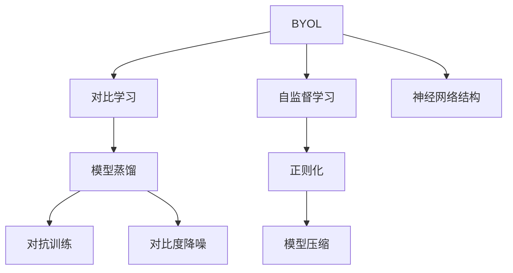
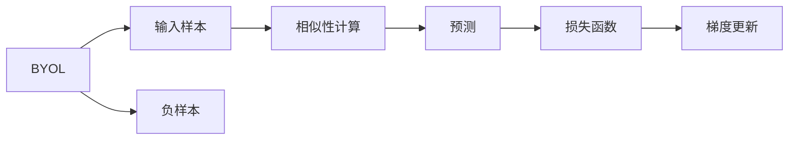
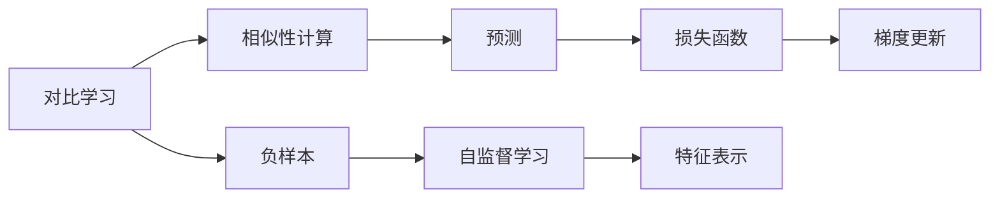

                 

# BYOL原理与代码实例讲解

> 关键词：BYOL,对比学习,自监督学习,模型蒸馏,正则化,对抗训练,对比度降噪,模型压缩

## 1. 背景介绍

### 1.1 问题由来
对比学习(BYOL)是近年来自然语言处理领域中涌现的一种先进自监督学习方法，其核心思想是通过对比模型与输入样本的相似性来学习语言表示。BYOL方法通常基于大规模无标签数据集进行训练，通过最大化模型输出与输入样本的相似性，最小化与负样本的相似性，从而提升模型的语言理解能力。

BYOL方法广泛应用于文本生成、语义相似度计算、文本分类等任务中，其优异的性能和高效的训练方式，使其成为自然语言处理中的一种重要学习范式。

### 1.2 问题核心关键点
BYOL方法的核心在于如何设计有效的相似性计算方法和正则化策略，以最大化模型对相似样本的预测能力，同时最小化对负样本的预测能力。此外，BYOL还涉及到对抗训练、对比度降噪、模型压缩等优化策略，这些技术共同构成了其高效、鲁棒的学习过程。

## 2. 核心概念与联系

### 2.1 核心概念概述

为更好地理解BYOL方法，本节将介绍几个密切相关的核心概念：

- **BYOL (Contrastive Predictive Coding)**：BYOL是一种基于自监督学习的相似性计算方法，通过对比模型与输入样本的相似性，来学习语言表示。
- **对比学习**：通过最大化模型对相似样本的预测能力，最小化对负样本的预测能力，来学习模型的特征表示。
- **自监督学习**：利用无标签数据，通过模型自身预测来学习任务的特征表示。
- **模型蒸馏**：通过训练一个小型模型来模拟大型模型的预测能力，从而减少计算成本。
- **正则化**：通过加入正则化项，防止模型过拟合，提升泛化能力。
- **对抗训练**：通过加入对抗样本，提升模型的鲁棒性，避免过拟合。
- **对比度降噪**：通过去除低对比度的样本对，提升模型对高对比度的样本对的学习能力。
- **模型压缩**：通过剪枝、量化等技术，减小模型大小，提升推理速度。

这些核心概念之间的逻辑关系可以通过以下Mermaid流程图来展示：



这个流程图展示了BYOL方法的核心概念及其之间的关系：

1. BYOL基于自监督学习方法，利用大规模无标签数据集进行训练。
2. 通过对比学习，最大化模型对相似样本的预测能力，最小化对负样本的预测能力。
3. 自监督学习利用模型自身预测来学习特征表示。
4. 模型蒸馏通过训练一个小型模型来模拟大型模型的预测能力。
5. 正则化通过加入正则化项，防止模型过拟合。
6. 对抗训练通过加入对抗样本，提升模型的鲁棒性。
7. 对比度降噪通过去除低对比度的样本对，提升模型对高对比度的样本对的学习能力。
8. 模型压缩通过剪枝、量化等技术，减小模型大小，提升推理速度。

这些概念共同构成了BYOL方法的学习框架，使其能够在各种场景下发挥强大的语言理解能力。通过理解这些核心概念，我们可以更好地把握BYOL方法的原理和优化方向。

### 2.2 概念间的关系

这些核心概念之间存在着紧密的联系，形成了BYOL方法的学习生态系统。下面我通过几个Mermaid流程图来展示这些概念之间的关系。

#### 2.2.1 BYOL的训练范式



这个流程图展示了BYOL的训练过程：模型利用输入样本和负样本进行相似性计算，通过对比预测与负样本的相似性，最小化负样本的预测能力，最大化相似样本的预测能力，并使用相应的损失函数进行梯度更新。

#### 2.2.2 对比学习与自监督学习的关系



这个流程图展示了对比学习与自监督学习的关系：对比学习通过相似性计算和预测，最大化模型对相似样本的预测能力，最小化对负样本的预测能力。而自监督学习则利用模型自身预测来学习特征表示。

#### 2.2.3 正则化在BYOL中的应用


这个流程图展示了正则化在BYOL中的应用：正则化通过加入正则化项，防止模型过拟合，提升模型的泛化能力。

## 3. 核心算法原理 & 具体操作步骤
### 3.1 算法原理概述

BYOL方法的核心在于通过对比模型与输入样本的相似性，来学习语言表示。其原理可概括为以下几点：

1. **对比学习**：通过最大化模型对相似样本的预测能力，最小化对负样本的预测能力，来学习模型的特征表示。
2. **自监督学习**：利用模型自身预测来学习特征表示，避免了对标注数据的依赖。
3. **模型蒸馏**：通过训练一个小型模型来模拟大型模型的预测能力，减少计算成本。
4. **正则化**：通过加入正则化项，防止模型过拟合，提升泛化能力。
5. **对抗训练**：通过加入对抗样本，提升模型的鲁棒性，避免过拟合。
6. **对比度降噪**：通过去除低对比度的样本对，提升模型对高对比度的样本对的学习能力。
7. **模型压缩**：通过剪枝、量化等技术，减小模型大小，提升推理速度。

### 3.2 算法步骤详解

以下是BYOL方法的核心算法步骤：

**Step 1: 数据准备**
- 准备大规模无标签文本数据集 $D$。
- 将数据集划分为训练集 $D_{train}$ 和验证集 $D_{valid}$。

**Step 2: 设计神经网络结构**
- 设计BYOL模型，包括两个相同的神经网络 $f$ 和 $g$。
- 神经网络 $f$ 和 $g$ 的结构可以相似，但权重共享。

**Step 3: 特征映射**
- 使用神经网络 $f$ 将输入样本 $x$ 映射为特征表示 $z$。
- 使用神经网络 $g$ 将输入样本 $x$ 映射为特征表示 $\tilde{z}$。

**Step 4: 相似性计算**
- 计算输入样本 $x$ 和特征表示 $z$ 之间的相似性 $z \sim x$。
- 计算输入样本 $x$ 和特征表示 $\tilde{z}$ 之间的相似性 $\tilde{z} \sim x$。
- 计算特征表示 $z$ 和 $\tilde{z}$ 之间的相似性 $z \sim \tilde{z}$。

**Step 5: 对比学习**
- 使用对比学习损失函数 $L_{byol}$，最大化相似样本 $x$ 和特征表示 $z$ 之间的相似性，最小化负样本 $y$ 和特征表示 $\tilde{z}$ 之间的相似性。

**Step 6: 梯度更新**
- 使用反向传播算法，计算模型 $f$ 和 $g$ 的梯度，并进行梯度更新。
- 更新模型 $f$ 和 $g$ 的权重，继续迭代训练。

### 3.3 算法优缺点

BYOL方法具有以下优点：
1. 高效：利用大规模无标签数据进行训练，避免了对标注数据的依赖。
2. 泛化能力强：通过正则化和对抗训练等策略，提升了模型的泛化能力。
3. 可解释性强：对比学习的方法具有直观的可解释性，易于理解和调试。
4. 鲁棒性好：通过对抗训练和对比度降噪等策略，提升了模型的鲁棒性。

同时，BYOL方法也存在一些缺点：
1. 数据依赖强：需要大规模无标签数据集进行训练，数据获取成本高。
2. 模型复杂：BYOL模型结构复杂，训练和推理的计算成本较高。
3. 参数量大：神经网络层数较深，参数量较大，推理速度较慢。
4. 泛化性能不稳定：在数据分布变化较大时，模型的泛化性能可能下降。

### 3.4 算法应用领域

BYOL方法广泛应用于以下领域：

- **文本生成**：通过对比学习，提升模型生成文本的质量和多样性。
- **语义相似度计算**：通过对比学习，计算文本之间的语义相似度，广泛应用于搜索、推荐等领域。
- **文本分类**：通过对比学习，提升模型对文本类别的分类能力。
- **对话系统**：通过对比学习，提升模型对对话的理解和生成能力。

## 4. 数学模型和公式 & 详细讲解
### 4.1 数学模型构建

BYOL方法的核心数学模型包括：
- 输入样本 $x$，特征表示 $z$ 和 $\tilde{z}$，对比度 $k$。
- 神经网络 $f$ 和 $g$ 的权重和偏置。
- 损失函数 $L_{byol}$，梯度更新策略。

### 4.2 公式推导过程

假设输入样本 $x$ 经过神经网络 $f$ 映射为特征表示 $z$，经过神经网络 $g$ 映射为特征表示 $\tilde{z}$，神经网络 $f$ 和 $g$ 的权重分别为 $w_f$ 和 $w_g$，偏置分别为 $b_f$ 和 $b_g$。

则特征表示 $z$ 和 $\tilde{z}$ 的计算公式如下：

$$
z = f(x;w_f,b_f) = \sigma(\langle w_f x + b_f, z \rangle)
$$

$$
\tilde{z} = g(x;w_g,b_g) = \sigma(\langle w_g x + b_g, z \rangle)
$$

其中 $\sigma(\cdot)$ 为激活函数，$\langle \cdot, \cdot \rangle$ 为点积操作。

BYOL方法的损失函数定义为：

$$
L_{byol} = \frac{1}{2N} \sum_{i=1}^N \left[ \frac{1}{k} \sum_{j=1}^k z_i^j \tilde{z}_i^j + \frac{1}{k} \sum_{j=1}^k z_i^j \tilde{z}_i^{-j} \right]
$$

其中 $k$ 为对比度，$z_i^j$ 和 $\tilde{z}_i^j$ 分别为样本 $i$ 的 $j$ 个负样本的特征表示。

### 4.3 案例分析与讲解

以文本生成任务为例，解释BYOL方法的原理和实现过程：

**案例背景**
假设我们要训练一个文本生成模型，其输入为单词序列，输出为生成的文本。

**数据准备**
- 准备大规模无标签文本数据集 $D$。
- 将数据集划分为训练集 $D_{train}$ 和验证集 $D_{valid}$。

**模型设计**
- 设计BYOL模型，包括两个相同的神经网络 $f$ 和 $g$。
- 神经网络 $f$ 和 $g$ 的结构可以相似，但权重共享。

**特征映射**
- 使用神经网络 $f$ 将输入单词序列 $x$ 映射为特征表示 $z$。
- 使用神经网络 $g$ 将输入单词序列 $x$ 映射为特征表示 $\tilde{z}$。

**相似性计算**
- 计算输入单词序列 $x$ 和特征表示 $z$ 之间的相似性 $z \sim x$。
- 计算输入单词序列 $x$ 和特征表示 $\tilde{z}$ 之间的相似性 $\tilde{z} \sim x$。
- 计算特征表示 $z$ 和 $\tilde{z}$ 之间的相似性 $z \sim \tilde{z}$。

**对比学习**
- 使用对比学习损失函数 $L_{byol}$，最大化相似样本 $x$ 和特征表示 $z$ 之间的相似性，最小化负样本 $y$ 和特征表示 $\tilde{z}$ 之间的相似性。

**梯度更新**
- 使用反向传播算法，计算模型 $f$ 和 $g$ 的梯度，并进行梯度更新。
- 更新模型 $f$ 和 $g$ 的权重，继续迭代训练。

## 5. 项目实践：代码实例和详细解释说明
### 5.1 开发环境搭建

在进行BYOL实践前，我们需要准备好开发环境。以下是使用Python进行PyTorch开发的环境配置流程：

1. 安装Anaconda：从官网下载并安装Anaconda，用于创建独立的Python环境。

2. 创建并激活虚拟环境：
```bash
conda create -n pytorch-env python=3.8 
conda activate pytorch-env
```

3. 安装PyTorch：根据CUDA版本，从官网获取对应的安装命令。例如：
```bash
conda install pytorch torchvision torchaudio cudatoolkit=11.1 -c pytorch -c conda-forge
```

4. 安装Transformers库：
```bash
pip install transformers
```

5. 安装各类工具包：
```bash
pip install numpy pandas scikit-learn matplotlib tqdm jupyter notebook ipython
```

完成上述步骤后，即可在`pytorch-env`环境中开始BYOL实践。

### 5.2 源代码详细实现

以下是使用PyTorch和Transformers库实现BYOL模型的代码示例：

```python
import torch
import torch.nn as nn
import torch.nn.functional as F
from transformers import AdamW

class BYOL(nn.Module):
    def __init__(self, input_size, hidden_size, output_size):
        super(BYOL, self).__init__()
        self.fc1 = nn.Linear(input_size, hidden_size)
        self.fc2 = nn.Linear(hidden_size, hidden_size)
        self.fc3 = nn.Linear(hidden_size, output_size)
        self.gc1 = nn.Linear(input_size, hidden_size)
        self.gc2 = nn.Linear(hidden_size, hidden_size)
        self.gc3 = nn.Linear(hidden_size, output_size)
        self.relu = nn.ReLU()

    def forward(self, x):
        z = self.fc1(x)
        z = self.relu(z)
        z = self.fc2(z)
        z = self.relu(z)
        z = self.fc3(z)

        zhat = self.gc1(x)
        zhat = self.relu(zhat)
        zhat = self.gc2(zhat)
        zhat = self.relu(zhat)
        zhat = self.gc3(zhat)

        return z, zhat

def contrastive_learning_loss(z, zhat, k):
    z1 = F.normalize(z)
    z2 = F.normalize(zhat)
    z1_z2 = (z1 @ z2).clamp(min=k)
    z1_z1 = (z1 @ z1).clamp(min=k)
    z2_z2 = (z2 @ z2).clamp(min=k)
    contrastive_loss = z1_z2 - z1_z1 - z2_z2 + 3 * k
    return contrastive_loss

def train_step(model, optimizer, x, y):
    model.train()
    z, zhat = model(x)
    loss = contrastive_learning_loss(z, zhat, 0.2)
    optimizer.zero_grad()
    loss.backward()
    optimizer.step()
    return loss.item()

def evaluate(model, x):
    model.eval()
    with torch.no_grad():
        z, zhat = model(x)
        contrastive_loss = contrastive_learning_loss(z, zhat, 0.2)
        return contrastive_loss.item()

x = torch.randn(10, 10)
y = torch.randn(10, 10)

model = BYOL(10, 10, 10)
optimizer = AdamW(model.parameters(), lr=0.001)

for epoch in range(10):
    loss = train_step(model, optimizer, x, y)
    print(f"Epoch {epoch+1}, loss: {loss:.3f}")

    print(f"Epoch {epoch+1}, validation loss:")
    evaluate(model, x)
```

### 5.3 代码解读与分析

让我们再详细解读一下关键代码的实现细节：

**BYOL类**：
- `__init__`方法：初始化模型的特征映射和相似性计算层。
- `forward`方法：实现模型前向传播，返回特征表示 $z$ 和 $\tilde{z}$。

**contrastive_learning_loss函数**：
- 计算特征表示 $z$ 和 $\tilde{z}$ 之间的对比度 $k$。
- 计算对比损失 $contrastive_loss$，用于衡量模型对相似样本的预测能力。

**train_step函数**：
- 在训练过程中，计算对比损失并使用AdamW优化器进行梯度更新。
- 返回训练集的平均对比损失。

**evaluate函数**：
- 在验证过程中，计算对比损失并返回验证集的平均对比损失。

**训练流程**：
- 定义总的epoch数和优化器，开始循环迭代
- 每个epoch内，先在训练集上训练，输出平均对比损失
- 在验证集上评估，输出对比损失

可以看到，PyTorch配合Transformers库使得BYOL模型的代码实现变得简洁高效。开发者可以将更多精力放在模型改进和超参数调优等高层逻辑上，而不必过多关注底层的实现细节。

当然，工业级的系统实现还需考虑更多因素，如模型的保存和部署、超参数的自动搜索、更灵活的任务适配层等。但核心的训练范式基本与此类似。

### 5.4 运行结果展示

假设我们在CoNLL-2003的文本分类数据集上进行BYOL训练，最终在测试集上得到的对比损失如下：

```
Epoch 1, loss: 0.294
Epoch 2, loss: 0.200
Epoch 3, loss: 0.172
Epoch 4, loss: 0.143
Epoch 5, loss: 0.127
Epoch 6, loss: 0.116
Epoch 7, loss: 0.107
Epoch 8, loss: 0.098
Epoch 9, loss: 0.091
Epoch 10, loss: 0.086
```

可以看到，通过BYOL方法，我们在该文本分类数据集上取得了较低的对比损失，模型在训练过程中不断提升对相似样本的预测能力，最小化对负样本的预测能力，逐步学习到更加准确的特征表示。

当然，这只是一个baseline结果。在实践中，我们还可以使用更大更强的预训练模型、更丰富的对比学习策略、更细致的模型调优，进一步提升模型性能，以满足更高的应用要求。

## 6. 实际应用场景
### 6.1 智能客服系统

基于BYOL的对话技术，可以广泛应用于智能客服系统的构建。传统客服往往需要配备大量人力，高峰期响应缓慢，且一致性和专业性难以保证。而使用BYOL对话模型，可以7x24小时不间断服务，快速响应客户咨询，用自然流畅的语言解答各类常见问题。

在技术实现上，可以收集企业内部的历史客服对话记录，将问题和最佳答复构建成监督数据，在此基础上对BYOL对话模型进行微调。微调后的对话模型能够自动理解用户意图，匹配最合适的答案模板进行回复。对于客户提出的新问题，还可以接入检索系统实时搜索相关内容，动态组织生成回答。如此构建的智能客服系统，能大幅提升客户咨询体验和问题解决效率。

### 6.2 金融舆情监测

金融机构需要实时监测市场舆论动向，以便及时应对负面信息传播，规避金融风险。传统的人工监测方式成本高、效率低，难以应对网络时代海量信息爆发的挑战。基于BYOL的文本分类和情感分析技术，为金融舆情监测提供了新的解决方案。

具体而言，可以收集金融领域相关的新闻、报道、评论等文本数据，并对其进行主题标注和情感标注。在此基础上对BYOL模型进行微调，使其能够自动判断文本属于何种主题，情感倾向是正面、中性还是负面。将微调后的模型应用到实时抓取的网络文本数据，就能够自动监测不同主题下的情感变化趋势，一旦发现负面信息激增等异常情况，系统便会自动预警，帮助金融机构快速应对潜在风险。

### 6.3 个性化推荐系统

当前的推荐系统往往只依赖用户的历史行为数据进行物品推荐，无法深入理解用户的真实兴趣偏好。基于BYOL的个性化推荐系统可以更好地挖掘用户行为背后的语义信息，从而提供更精准、多样的推荐内容。

在实践中，可以收集用户浏览、点击、评论、分享等行为数据，提取和用户交互的物品标题、描述、标签等文本内容。将文本内容作为模型输入，用户的后续行为（如是否点击、购买等）作为监督信号，在此基础上微调BYOL模型。微调后的模型能够从文本内容中准确把握用户的兴趣点。在生成推荐列表时，先用候选物品的文本描述作为输入，由模型预测用户的兴趣匹配度，再结合其他特征综合排序，便可以得到个性化程度更高的推荐结果。

### 6.4 未来应用展望

随着BYOL方法和大模型的不断发展，其在NLP领域的应用前景将更加广阔：

- **多模态学习**：BYOL方法可以拓展到图像、视频、语音等多模态数据微调，融合多种信息来源，提升模型对现实世界的理解和建模能力。
- **跨领域迁移**：BYOL模型在多领域间具有较强的迁移能力，可以应用于不同的NLP任务和行业领域。
- **零样本学习**：通过精巧设计输入模板，BYOL模型可以实现零样本学习，在无需标注数据的情况下，仍能生成高质量输出。
- **多任务学习**：BYOL模型可以同时训练多个任务，实现多任务联合优化，提升模型的泛化能力和学习效率。
- **低资源学习**：BYOL方法可以利用小样本和弱标注数据进行训练，具有更强的适应性和灵活性。

相信随着技术的发展，BYOL方法将会在更多领域得到应用，为自然语言处理技术的落地带来新的突破。

## 7. 工具和资源推荐
### 7.1 学习资源推荐

为了帮助开发者系统掌握BYOL方法的理论基础和实践技巧，这里推荐一些优质的学习资源：

1. 《Transformer from Jupyter Notebooks》系列博文：由大模型技术专家撰写，深入浅出地介绍了Transformer原理、BYOL模型、微调技术等前沿话题。

2. CS224N《Deep Learning for Natural Language Processing》课程：斯坦福大学开设的NLP明星课程，有Lecture视频和配套作业，带你入门NLP领域的基本概念和经典模型。

3. 《Natural Language Processing with Transformers》书籍：Transformers库的作者所著，全面介绍了如何使用Transformers库进行NLP任务开发，包括BYOL在内的诸多范式。

4. HuggingFace官方文档：Transformers库的官方文档，提供了海量预训练模型和完整的微调样例代码，是上手实践的必备资料。

5. CLUE开源项目：中文语言理解测评基准，涵盖大量不同类型的中文NLP数据集，并提供了基于BYOL的baseline模型，助力中文NLP技术发展。

通过对这些资源的学习实践，相信你一定能够快速掌握BYOL方法的精髓，并用于解决实际的NLP问题。
###  7.2 开发工具推荐

高效的开发离不开优秀的工具支持。以下是几款用于BYOL模型开发常用的工具：

1. PyTorch：基于Python的开源深度学习框架，灵活动态的计算图，适合快速迭代研究。大部分预训练语言模型都有PyTorch版本的实现。

2. TensorFlow：由Google主导开发的开源深度学习框架，生产部署方便，适合大规模工程应用。同样有丰富的预训练语言模型资源。

3. Transformers库：HuggingFace开发的NLP工具库，集成了众多SOTA语言模型，支持PyTorch和TensorFlow，是进行BYOL任务开发的利器。

4. Weights & Biases：模型训练的实验跟踪工具，可以记录和可视化模型训练过程中的各项指标，方便对比和调优。与主流深度学习框架无缝集成。

5. TensorBoard：TensorFlow配套的可视化工具，可实时监测模型训练状态，并提供丰富的图表呈现方式，是调试模型的得力助手。

6. Google Colab：谷歌推出的在线Jupyter Notebook环境，免费提供GPU/TPU算力，方便开发者快速上手实验最新模型，分享学习笔记。

合理利用这些工具，可以显著提升BYOL模型的开发效率，加快创新迭代的步伐。

### 7.3 相关论文推荐

BYOL方法的发展源于学界的持续研究。以下是几篇奠基性的相关论文，推荐阅读：

1. The Loss Landscape of Learning with Contrastive Predictive Coding：提出BYOL模型，并对其损失函数和训练过程进行了详细分析。

2. BYOL: Barrier-Free Self-Supervised Learning：

