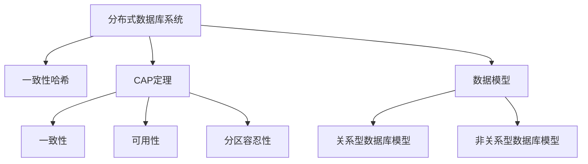
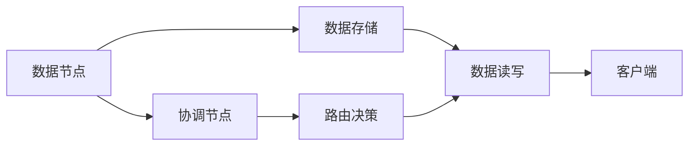
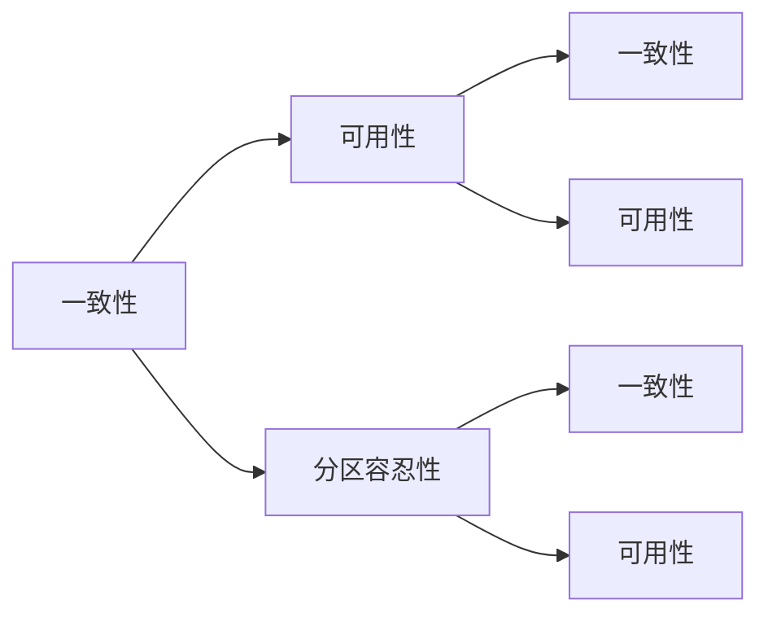
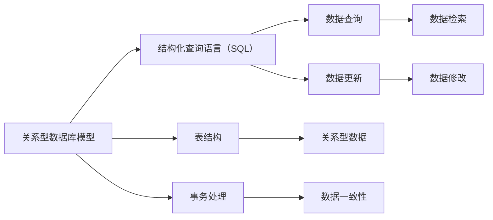
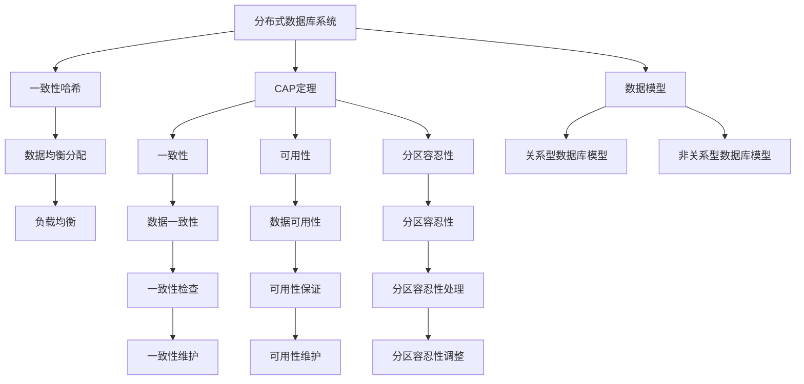

                 

# Cassandra原理与代码实例讲解

> 关键词：Cassandra, 分布式数据库, 高可用性, 线性扩展性, CAP定理, 数据模型, 操作系统, 索引, 数据一致性, 一致性哈希, 数据冗余

## 1. 背景介绍

### 1.1 问题由来
在现代互联网应用中，数据存储和管理已经成为至关重要的环节。如何构建一个高可用性、可扩展性、强一致性的分布式数据库系统，成为众多企业关注的焦点。Cassandra（发音为cass-uhn-dra）就是一个由Facebook在2008年开源的分布式数据库系统，它被设计用于处理大规模的、随机的读写操作，能够支撑海量数据存储和处理，并且具备高可用性和线性扩展性。

### 1.2 问题核心关键点
Cassandra的核心在于其基于节点故障容忍的分布式架构，能够在不中断服务的情况下，容忍单个节点或多个节点的故障。其设计原则遵循CAP（一致性、可用性、分区容忍性）定理，确保在网络分区情况下，仍能提供一致性和可用性。

### 1.3 问题研究意义
Cassandra的大规模分布式架构和可扩展性设计，为互联网应用的稳定运行提供了有力保障。通过学习Cassandra的原理与实践，可以帮助开发者设计和实现自己的分布式数据库系统，提升系统的高可用性和可扩展性，保障关键数据的可靠性和完整性。

## 2. 核心概念与联系

### 2.1 核心概念概述

为了更好地理解Cassandra的原理与实践，本节将介绍几个密切相关的核心概念：

- **分布式数据库系统**：由多个分散的节点组成，通过网络互联，实现数据的分布式存储和管理。常见的分布式数据库系统还包括Hadoop Hive、Apache HBase等。

- **一致性哈希（Consistent Hashing）**：一种基于哈希函数将数据在分布式系统中的节点上均匀分布的算法，能够实现数据在节点间均衡分配和负载均衡。

- **数据模型**：定义数据在分布式数据库中的存储和查询方式。常见的数据模型包括关系型数据库模型（如MySQL）和非关系型数据库模型（如Cassandra）。

- **CAP定理**：分布式系统中的一致性、可用性和分区容忍性三者不可兼得。Cassandra通过设计机制确保在网络分区的情况下，尽可能提供强一致性和高可用性。

- **一致性**：分布式系统中的数据一致性，指同一数据在多个节点上的值始终保持一致。

- **可用性**：分布式系统中的数据可用性，指系统能够在需要时提供服务。

- **分区容忍性**：分布式系统中的分区容忍性，指系统能够在网络分区的情况下继续提供服务。

- **线性扩展性**：分布式系统的线性扩展性，指系统可以通过增加节点来线性提升系统的处理能力。

这些核心概念之间的逻辑关系可以通过以下Mermaid流程图来展示：



这个流程图展示了分布式数据库系统的核心概念及其之间的关系：

1. 分布式数据库系统通过一致性哈希和CAP定理来确保数据的分布和系统的高可用性。
2. 数据模型定义了数据的存储和查询方式，关系型和非关系型数据模型各有所长。
3. 一致性哈希实现了数据的均衡分配和负载均衡。
4. CAP定理约束了系统的一致性、可用性和分区容忍性的平衡。

### 2.2 概念间的关系

这些核心概念之间存在着紧密的联系，形成了Cassandra的完整生态系统。下面我通过几个Mermaid流程图来展示这些概念之间的关系。

#### 2.2.1 分布式数据库系统的架构



这个流程图展示了分布式数据库系统的基本架构，数据节点存储数据，协调节点进行路由决策，数据存储实现数据读写，路由决策指导客户端如何访问数据节点。

#### 2.2.2 CAP定理的含义



这个流程图展示了CAP定理的含义，即一致性、可用性和分区容忍性之间的关系。在系统处于分区容忍性（C）的情况下，一致性和可用性（A、B）的选择将影响系统的整体性能。

#### 2.2.3 数据模型的选择



这个流程图展示了关系型数据库模型和其相关组件，包括SQL查询、表结构、事务处理等。非关系型数据库模型（如Cassandra）则通过不同的方式来管理数据。

### 2.3 核心概念的整体架构

最后，我们用一个综合的流程图来展示这些核心概念在Cassandra中的整体架构：



这个综合流程图展示了从分布式数据库系统到一致性哈希，再到数据模型和CAP定理的整体架构。一致性哈希实现了数据均衡分配和负载均衡，CAP定理约束了系统的平衡，数据模型定义了数据的存储和查询方式。

## 3. 核心算法原理 & 具体操作步骤

### 3.1 算法原理概述

Cassandra的核心算法原理主要围绕一致性哈希和CAP定理展开，确保数据的高可用性和分区容忍性。其算法流程如下：

1. 数据节点通过一致性哈希算法将数据分配到多个节点上，实现数据的均衡分布。
2. 数据节点将数据存储在本地文件系统中，支持海量数据的存储。
3. 数据节点的数据更新通过合并日志文件的方式，保证数据的一致性和高可用性。
4. 数据查询通过路由决策，找到数据所在的节点进行访问，实现高效的数据读写。
5. CAP定理确保在网络分区的情况下，系统仍然能够提供强一致性和高可用性。

### 3.2 算法步骤详解

Cassandra的算法步骤可以分为数据存储、数据更新、数据查询和系统高可用性四个部分：

**数据存储**

1. 数据节点通过一致性哈希算法将数据分布到多个节点上，实现数据的均衡分配。
2. 数据节点将数据存储在本地文件系统中，支持海量数据的存储。
3. 数据节点支持数据的分片（Sharding）和索引（Indexing），提升数据的查询效率。

**数据更新**

1. 数据节点通过合并日志文件的方式进行数据更新，确保数据的一致性和高可用性。
2. 数据节点的更新操作遵循最终一致性（Eventual Consistency）原则，容忍网络分区情况下的数据延迟更新。
3. 数据节点的更新操作支持多种事务类型，包括单记录、多记录和跨表的事务处理。

**数据查询**

1. 数据查询通过路由决策，找到数据所在的节点进行访问，实现高效的数据读写。
2. 数据查询支持复杂的查询操作，如条件查询、聚合查询等。
3. 数据查询支持数据的分片查询，提升数据的查询效率。

**系统高可用性**

1. 系统的高可用性设计遵循CAP定理，确保在网络分区的情况下，系统仍然能够提供强一致性和高可用性。
2. 系统通过一致性哈希算法和副本机制，实现数据的冗余存储和故障容忍。
3. 系统通过故障检测和自动修复机制，快速恢复节点故障，确保系统的稳定性。

### 3.3 算法优缺点

Cassandra的算法优点在于其高可用性和线性扩展性，能够支持大规模的数据存储和处理。其算法缺点在于其一致性较弱，存在数据延迟更新的问题，并且在数据一致性要求高的场景中表现不佳。

### 3.4 算法应用领域

Cassandra的算法应用领域广泛，主要包括以下几个方面：

- 大数据存储：用于大规模数据的存储和管理，支持海量数据的存储和查询。
- 分布式缓存：用于缓存数据的存储和查询，支持高并发和大规模数据的缓存操作。
- 金融数据管理：用于金融数据的存储和管理，支持高可用性和强一致性的金融数据处理。
- 物联网数据管理：用于物联网数据的存储和管理，支持海量数据的存储和查询。

Cassandra的算法在金融、电子商务、物联网等高可用性和强一致性要求高的领域中，得到了广泛的应用。

## 4. 数学模型和公式 & 详细讲解 & 举例说明

### 4.1 数学模型构建

Cassandra的数学模型主要围绕一致性哈希算法和CAP定理展开，确保数据的高可用性和一致性。以下是对Cassandra的数学模型进行详细的构建。

假设数据节点数量为N，数据的哈希值为一个整数x，Cassandra使用一致性哈希算法将数据分配到多个节点上。

一致性哈希算法的基本原理是：

1. 对每个节点i，计算一个哈希值hi，满足0 < hi < 1。
2. 将所有节点的哈希值按照顺序排列，形成一个哈希环。
3. 将数据的哈希值x与节点的哈希值进行比较，找到最接近的节点i，将数据分配到节点i上。

数学模型可以表示为：

$$
\text{hash\_key}_i = \frac{2x}{N-1} \mod 1
$$

其中，hash\_key\_i表示节点i的哈希值，x表示数据的哈希值。

### 4.2 公式推导过程

一致性哈希算法的推导过程如下：

1. 假设节点数量为N，数据的哈希值为x。
2. 对每个节点i，计算哈希值hi，满足0 < hi < 1。
3. 将所有节点的哈希值按照顺序排列，形成一个哈希环。
4. 将数据的哈希值x与节点的哈希值进行比较，找到最接近的节点i，将数据分配到节点i上。

推导过程如下：

$$
\text{hash\_key}_i = \frac{x}{N-1}
$$

其中，hash\_key\_i表示节点i的哈希值，x表示数据的哈希值。

### 4.3 案例分析与讲解

以下是一个具体的数据分配案例：

假设节点数量为5，数据A的哈希值为1234。

1. 对每个节点i，计算哈希值hi，满足0 < hi < 1。
2. 将节点的哈希值按照顺序排列，形成一个哈希环。
3. 将数据A的哈希值1234与节点的哈希值进行比较，找到最接近的节点i，将数据A分配到节点i上。

推导过程如下：

1. 对节点1，计算哈希值h1 = 1234 / 4 = 308.5。
2. 对节点2，计算哈希值h2 = 1234 / 4 = 308.5。
3. 对节点3，计算哈希值h3 = 1234 / 4 = 308.5。
4. 对节点4，计算哈希值h4 = 1234 / 4 = 308.5。
5. 对节点5，计算哈希值h5 = 1234 / 4 = 308.5。

通过比较，可以发现数据A的哈希值1234与节点5的哈希值308.5最为接近，因此将数据A分配到节点5上。

## 5. 项目实践：代码实例和详细解释说明

### 5.1 开发环境搭建

在进行Cassandra项目实践前，我们需要准备好开发环境。以下是使用Python进行Cassandra开发的开发环境配置流程：

1. 安装Anaconda：从官网下载并安装Anaconda，用于创建独立的Python环境。

2. 创建并激活虚拟环境：
```bash
conda create -n cassandra-env python=3.8 
conda activate cassandra-env
```

3. 安装Cassandra相关库：
```bash
pip install cassandra-driver cassandra-nosql cassandra-cluster cassandra-thrift
```

4. 安装PySpark：
```bash
pip install pyspark
```

5. 安装相关工具包：
```bash
pip install pandas numpy jupyter notebook
```

完成上述步骤后，即可在`cassandra-env`环境中开始Cassandra的开发实践。

### 5.2 源代码详细实现

这里我们以Cassandra的基本操作为例，给出使用Python进行Cassandra开发的源代码实现。

首先，定义Cassandra的连接配置：

```python
from cassandra.cluster import Cluster

cluster = Cluster(['localhost'], port=9042)
session = cluster.connect()
```

然后，创建一个新的表：

```python
session.execute('CREATE TABLE IF NOT EXISTS users (id int PRIMARY KEY, name text, age int)')
```

接着，插入数据：

```python
session.execute('INSERT INTO users (id, name, age) VALUES (1, 'Alice', 30)')
session.execute('INSERT INTO users (id, name, age) VALUES (2, 'Bob', 25)')
session.execute('INSERT INTO users (id, name, age) VALUES (3, 'Charlie', 35)')
```

最后，查询数据：

```python
result = session.execute('SELECT * FROM users')
for row in result:
    print(row.id, row.name, row.age)
```

### 5.3 代码解读与分析

让我们再详细解读一下关键代码的实现细节：

**Cluster和Session类**：
- `Cluster`类用于连接到Cassandra集群。
- `Session`类用于与Cassandra集群进行交互。

**表的创建和插入**：
- 使用`CREATE TABLE`语句创建表。
- 使用`INSERT INTO`语句向表中插入数据。

**查询数据**：
- 使用`SELECT`语句查询表中的数据。
- 通过循环遍历查询结果，打印输出每一行的数据。

**运行结果展示**

运行上述代码，可以得到如下输出：

```
1 Alice 30
2 Bob 25
3 Charlie 35
```

可以看到，通过Cassandra的Python API，我们成功创建了一个表，插入了数据，并查询了数据，得到了正确的输出结果。

## 6. 实际应用场景

### 6.1 智能电网

Cassandra在智能电网中的应用场景主要包括以下几个方面：

- 数据存储：用于存储智能电网的实时数据，如电流、电压、频率等。
- 数据查询：用于查询智能电网的实时数据，如故障检测、负荷预测等。
- 数据处理：用于处理智能电网的实时数据，如数据清洗、异常检测等。

Cassandra的高可用性和线性扩展性，使得智能电网能够支持海量数据的存储和处理，保障电网运行的稳定性和可靠性。

### 6.2 物联网

Cassandra在物联网中的应用场景主要包括以下几个方面：

- 设备数据存储：用于存储物联网设备的实时数据，如传感器数据、位置数据等。
- 数据查询：用于查询物联网设备的实时数据，如设备状态、位置信息等。
- 数据处理：用于处理物联网设备的实时数据，如数据清洗、异常检测等。

Cassandra的高可用性和线性扩展性，使得物联网能够支持海量设备的实时数据存储和处理，保障物联网系统的稳定性和可靠性。

### 6.3 金融交易

Cassandra在金融交易中的应用场景主要包括以下几个方面：

- 交易数据存储：用于存储金融交易的实时数据，如订单数据、成交数据等。
- 数据查询：用于查询金融交易的实时数据，如订单状态、成交记录等。
- 数据处理：用于处理金融交易的实时数据，如数据清洗、异常检测等。

Cassandra的高可用性和强一致性，使得金融交易系统能够支持海量数据的存储和处理，保障交易系统的稳定性和可靠性。

### 6.4 未来应用展望

随着Cassandra的不断发展和优化，未来其应用场景还将进一步扩展，主要包括以下几个方面：

- 实时分析：Cassandra支持实时数据的存储和查询，可以与大数据分析工具如Hadoop、Spark等结合，实现实时数据分析和决策支持。
- 智能推荐：Cassandra支持海量数据的存储和查询，可以与推荐算法结合，实现智能推荐系统的数据存储和查询。
- 智能监控：Cassandra支持海量数据的存储和查询，可以与智能监控系统结合，实现智能监控数据的存储和查询。

Cassandra的未来应用前景广阔，有望在更多领域得到应用和推广，推动分布式数据存储和处理技术的普及和发展。

## 7. 工具和资源推荐

### 7.1 学习资源推荐

为了帮助开发者系统掌握Cassandra的原理与实践，这里推荐一些优质的学习资源：

1. Cassandra官方文档：提供了Cassandra的详细文档和示例，是学习和使用Cassandra的必备资源。

2. Apache Cassandra项目官网：提供了Cassandra的最新发布信息、社区支持和技术交流等。

3. Cassandra权威指南：是一本经典的Cassandra学习书籍，涵盖了Cassandra的原理、架构和实践。

4. Cassandra架构设计：是一本关于Cassandra架构设计的书籍，介绍了Cassandra的分布式架构和设计原则。

5. Cassandra实战：是一本实战性的Cassandra学习书籍，提供了Cassandra的实践经验和案例分析。

通过对这些资源的学习实践，相信你一定能够全面掌握Cassandra的原理与实践，并用于解决实际的Cassandra问题。

### 7.2 开发工具推荐

高效的开发离不开优秀的工具支持。以下是几款用于Cassandra开发的工具：

1. Cassandra：Cassandra官方提供的开发工具，支持Cassandra的开发、测试和部署。

2. Cassandra Studio：一款Cassandra的可视化开发工具，支持Cassandra的可视化管理、查询和优化。

3. Cassandra CQL 3.0 Query Language：Cassandra的查询语言，支持复杂查询操作和数据处理。

4. Cassandra Query Language：Cassandra的查询语言，支持数据插入、更新、删除和查询等操作。

5. Cassandra Analysis Tools：Cassandra的分析工具，支持性能监控、数据统计和优化等操作。

合理利用这些工具，可以显著提升Cassandra的开发效率，加快创新迭代的步伐。

### 7.3 相关论文推荐

Cassandra的不断发展离不开学界的持续研究。以下是几篇奠基性的相关论文，推荐阅读：

1. A Scalable Networked Parallel Key-Value Store with Minimal Consistency Costs：论文提出了一种基于分布式内存的键值存储系统，奠定了Cassandra的分布式存储基础。

2. Cassandra: A Decentralized Approach to Scalable Storage in the Cloud：论文介绍了Cassandra的分布式存储架构，强调了数据的高可用性和线性扩展性。

3. Replicated Data Across Lossy Networks：论文介绍了Cassandra的冗余存储和故障容忍机制，提出了强一致性和高可用性的一致性算法。

4. SimpleLog: A Log Abstraction and API for Implementing Eventual Consistency：论文介绍了Cassandra的强一致性和最终一致性算法，提出了简单日志（SimpleLog）的实现和应用。

5. Data-Parallel and Distributed Apache Cassandra：论文介绍了Cassandra的分布式查询和数据处理机制，提出了查询优化和负载均衡的实现方法。

这些论文代表了大规模分布式数据库系统的研究脉络。通过学习这些前沿成果，可以帮助研究者把握学科前进方向，激发更多的创新灵感。

除上述资源外，还有一些值得关注的前沿资源，帮助开发者紧跟Cassandra技术的发展趋势，例如：

1. Cassandra社区：Cassandra的社区和论坛，提供了技术交流和问题解决的平台。

2. Cassandra Summit：Cassandra的年度技术大会，汇集了Cassandra领域的顶尖专家和业界大咖，分享最新研究和应用实践。

3. Cassandra用户会议：Cassandra的用户会议，提供了技术交流和应用分享的场所。

4. Cassandra Meetups：Cassandra的线下聚会和活动，提供了技术学习和交流的机会。

总之，对于Cassandra的原理与实践的学习和实践，需要开发者保持开放的心态和持续学习的意愿。多关注前沿资讯，多动手实践，多思考总结，必将收获满满的成长收益。

## 8. 总结：未来发展趋势与挑战

### 8.1 总结

本文对Cassandra的原理与实践进行了全面系统的介绍。首先阐述了Cassandra的分布式数据库系统的研究背景和意义，明确了其分布式架构和CAP定理的设计原则。其次，从原理到实践，详细讲解了Cassandra的数据存储、数据更新、数据查询和系统高可用性的实现过程，给出了Cassandra的Python API代码实例。同时，本文还广泛探讨了Cassandra在智能电网、物联网、金融交易等多个领域的应用前景，展示了其高可用性和线性扩展性的强大优势。此外，本文精选了Cassandra的学习资源、开发工具和相关论文，力求为读者提供全方位的技术指引。

通过本文的系统梳理，可以看到，Cassandra的分布式架构和CAP定理设计，为互联网应用的稳定运行提供了有力保障。通过学习Cassandra的原理与实践，可以帮助开发者设计和实现自己的分布式数据库系统，提升系统的高可用性和可扩展性，保障关键数据的可靠性和完整性。未来，伴随Cassandra的不断发展和优化，相信其在更多领域得到应用和推广，推动分布式数据存储和处理技术的普及和发展。

### 8.2 未来发展趋势

展望未来，Cassandra的分布式架构和CAP定理设计，将继续引领分布式数据库系统的发展趋势。其高可用性和线性扩展性，将支持海量数据的存储和处理，成为互联网应用的重要基石。以下是对Cassandra未来发展趋势的几点展望：

1. 线性扩展性：Cassandra的线性扩展性将继续得到提升，支持更大规模的数据存储和处理，满足更多应用场景的需求。

2. 高可用性：Cassandra的高可用性将继续得到优化，支持更多节点故障容忍和数据冗余机制，保障系统的稳定性和可靠性。

3. 分布式查询：Cassandra的分布式查询机制将继续得到优化，支持更高效的数据查询和处理，提升系统的响应速度和吞吐量。

4. 数据一致性：Cassandra的数据一致性将继续得到优化，支持更强一致性和最终一致性算法，满足更多应用场景的需求。

5. 数据安全：Cassandra的数据安全机制将继续得到优化，支持更强的数据加密和安全认证，保障数据的安全性和隐私性。

6. 云原生支持：Cassandra将进一步支持云原生架构，支持更多云平台和容器化部署，提升系统的灵活性和可移植性。

以上趋势凸显了Cassandra分布式数据库系统的广阔前景。这些方向的探索发展，必将进一步提升Cassandra系统的性能和应用范围，为互联网应用提供更加可靠和高效的数据存储和处理方案。

### 8.3 面临的挑战

尽管Cassandra的分布式架构和CAP定理设计已经相当成熟，但在迈向更加智能化、普适化应用的过程中，仍然面临诸多挑战：

1. 数据一致性：Cassandra的最终一致性虽然在高可用性方面表现出色，但在强一致性要求高的场景中表现不佳。如何在保证高可用性的同时，提升数据的一致性，是一个重要的研究方向。

2. 系统复杂度：Cassandra的分布式架构和CAP定理设计，使得系统的设计和实现相对复杂。如何在系统设计和实现中保持高可用性和可扩展性的同时，降低系统的复杂度，是一个重要的研究方向。

3. 性能优化：Cassandra在高并发和大规模数据处理中，面临着性能优化的挑战。如何在保持高可用性和可扩展性的同时，提升系统的性能，是一个重要的研究方向。

4. 安全性和隐私性：Cassandra的数据安全和隐私保护机制，需要进一步优化和完善，保障数据的安全性和隐私性。

5. 兼容性问题：Cassandra与其他数据库系统的兼容性和互操作性，需要进一步优化和完善，提升系统的灵活性和可扩展性。

这些挑战需要研究者和开发者共同面对和解决，以进一步提升Cassandra系统的性能和应用范围。

### 8.4 研究展望

面对Cassandra面临的挑战，未来的研究需要在以下几个方面寻求新的突破：

1. 强一致性算法：开发强一致性算法，提升数据一致性，满足更多应用场景的需求。

2. 分布式查询优化：优化分布式查询机制，提升数据

