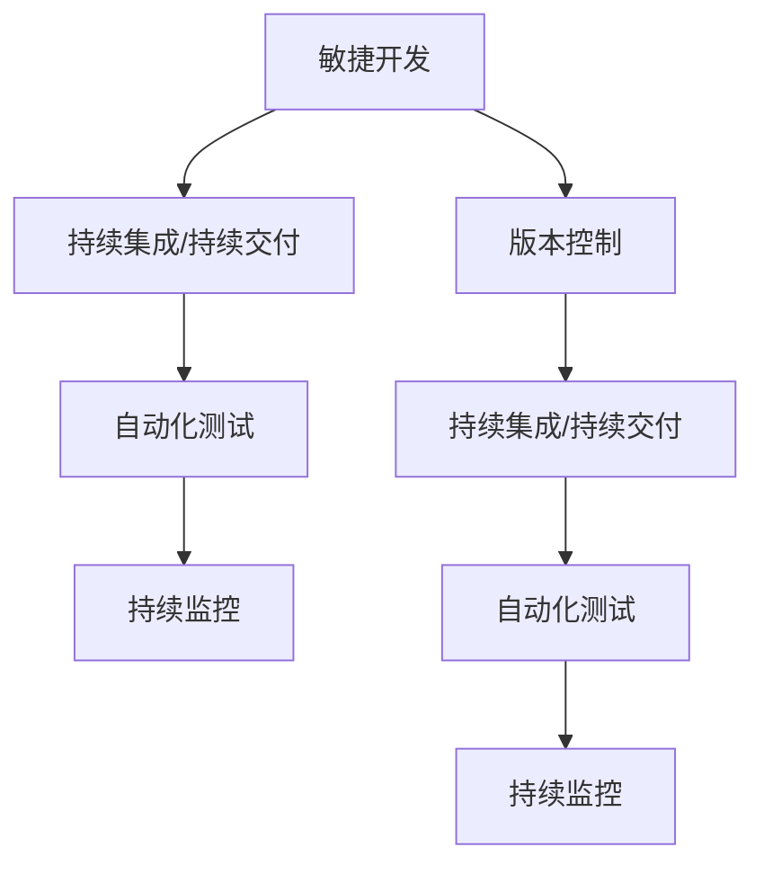
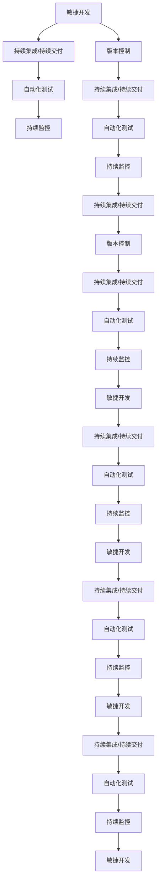

                 

# Dify.AI的可复制工作流设计

> 关键词：Dify.AI,可复制工作流,软件开发,项目管理,敏捷开发,持续集成(CI),持续交付(CD)

## 1. 背景介绍

### 1.1 问题由来

随着软件开发复杂性的增加，项目管理变得越来越困难。传统的水上开发方式，在项目延期、代码冲突、需求变更等方面面临着诸多挑战。如何高效地进行软件开发，同时保障软件的质量、稳定性和可扩展性，成为了软件开发领域亟待解决的问题。

在这个背景下，Dify.AI的可复制工作流应运而生。它是一种基于敏捷开发和持续集成/持续交付(CI/CD)理念的软件开发模式，旨在提高软件的开发效率和质量，同时降低项目风险。通过这种工作流，开发者可以在短时间内交付高质量的软件，同时也能够灵活应对变化和挑战。

### 1.2 问题核心关键点

Dify.AI的可复制工作流设计主要有以下几个关键点：

- **敏捷开发：** 敏捷开发强调小规模、快速迭代和持续反馈。通过可复制工作流，开发者可以频繁发布和反馈软件，及时响应客户需求和市场变化。
- **持续集成/持续交付：** CI/CD将代码提交、编译、测试和部署自动化，缩短了软件开发周期，提高了代码质量。
- **自动化测试：** 自动化测试可以覆盖更多的测试场景，减少手工测试的工作量，提高软件的稳定性和可靠性。
- **持续监控：** 通过持续监控，开发者可以实时了解软件运行状态和性能指标，及时发现和解决问题。
- **版本控制：** 版本控制确保了软件的可追溯性和可维护性，同时也方便了团队协作。

这些关键点共同构成了Dify.AI的可复制工作流，旨在打造高效、稳定和可持续的软件开发模式。

### 1.3 问题研究意义

Dify.AI的可复制工作流设计具有重要的研究意义：

- **提高开发效率：** 通过自动化和并行化，可复制工作流可以显著提高软件开发的速度和质量。
- **降低项目风险：** 通过频繁发布和测试，可复制工作流可以帮助开发者及时发现和修复问题，减少项目失败的概率。
- **增强软件质量：** 自动化测试和持续监控确保了软件的稳定性和可靠性，提高了用户满意度。
- **支持持续改进：** 敏捷开发和反馈机制使得开发者可以持续改进软件，更好地满足客户需求。
- **推动技术创新：** 可复制工作流的设计和实施需要不断创新，推动了软件开发技术的进步和应用。

## 2. 核心概念与联系

### 2.1 核心概念概述

为了更好地理解Dify.AI的可复制工作流设计，我们需要介绍一些核心概念：

- **敏捷开发：** 一种灵活的软件开发方法，强调迭代、快速反馈和团队协作。敏捷开发的目标是快速交付高质量的软件。
- **持续集成/持续交付：** 通过自动化工具链将代码提交、编译、测试和部署过程集成到一个流程中，加快软件交付速度。
- **自动化测试：** 使用自动化工具执行软件测试，覆盖更多的测试场景，提高测试效率和软件质量。
- **持续监控：** 对软件运行状态和性能指标进行实时监控，及时发现和解决问题。
- **版本控制：** 管理代码的变更历史和不同版本之间的关系，方便团队协作和软件维护。

这些核心概念构成了Dify.AI的可复制工作流的理论基础，是实现高效、稳定和可持续软件开发的重要手段。

### 2.2 概念间的关系

这些核心概念之间的关系可以通过以下Mermaid流程图来展示：



这个流程图展示了各个核心概念之间的逻辑关系：

1. 敏捷开发是基础，通过频繁的迭代和快速反馈，持续集成/持续交付才能高效进行。
2. 持续集成/持续交付将代码提交、编译、测试和部署自动化，加快了软件交付速度。
3. 自动化测试是持续集成/持续交付的重要组成部分，通过自动化测试可以覆盖更多的测试场景，提高软件质量。
4. 持续监控实时监测软件运行状态和性能指标，帮助开发者及时发现和解决问题。
5. 版本控制管理代码的变更历史和不同版本之间的关系，方便团队协作和软件维护。

这些概念共同构成了Dify.AI的可复制工作流的核心框架，确保了软件的开发效率、质量、稳定性和可维护性。

### 2.3 核心概念的整体架构

最后，我们用一个综合的流程图来展示这些核心概念在Dify.AI的可复制工作流设计中的整体架构：



这个综合流程图展示了各个核心概念在Dify.AI的可复制工作流设计中的交互和协同关系。通过这种设计，可以确保软件开发的各个环节高效协同，实现持续改进和高效交付。

## 3. 核心算法原理 & 具体操作步骤
### 3.1 算法原理概述

Dify.AI的可复制工作流设计主要基于敏捷开发和持续集成/持续交付的理念，通过自动化和并行化，实现高效、稳定和可持续的软件开发。其核心算法原理包括以下几个方面：

1. **迭代开发：** 敏捷开发的核心是迭代开发，通过频繁的迭代和快速反馈，快速交付高质量的软件。
2. **自动化测试：** 自动化测试可以覆盖更多的测试场景，减少手工测试的工作量，提高软件质量。
3. **持续集成/持续交付：** 通过自动化工具链将代码提交、编译、测试和部署过程集成到一个流程中，加快软件交付速度。
4. **持续监控：** 实时监测软件运行状态和性能指标，帮助开发者及时发现和解决问题。
5. **版本控制：** 管理代码的变更历史和不同版本之间的关系，方便团队协作和软件维护。

这些算法原理共同构成了Dify.AI的可复制工作流，确保了软件的开发效率、质量、稳定性和可维护性。

### 3.2 算法步骤详解

以下是Dify.AI的可复制工作流设计的详细步骤：

**Step 1: 准备开发环境**
- 搭建敏捷开发工具链，如JIRA、Confluence、Bitbucket等。
- 设置CI/CD工具链，如Jenkins、GitLab CI等。
- 配置自动化测试工具链，如JUnit、Selenium、Appium等。
- 部署持续监控工具链，如Prometheus、Grafana、ELK Stack等。

**Step 2: 敏捷开发**
- 采用敏捷开发方法，如Scrum、Kanban等，进行迭代开发。
- 定义用户故事和需求，进行需求分析。
- 进行设计、编码和测试，交付可用的软件增量。
- 进行代码审查和反馈，不断改进软件质量。

**Step 3: 持续集成/持续交付**
- 使用CI/CD工具链，自动化地执行代码提交、编译、测试和部署。
- 配置自动化测试脚本，定期执行测试，确保代码质量。
- 配置持续交付流程，自动部署软件到生产环境。
- 进行持续监控，实时反馈软件运行状态和性能指标。

**Step 4: 自动化测试**
- 编写自动化测试脚本，覆盖更多的测试场景。
- 定期执行自动化测试，确保软件质量。
- 分析测试结果，识别和修复问题。

**Step 5: 持续监控**
- 配置持续监控工具链，实时监测软件运行状态和性能指标。
- 实时反馈软件问题，进行故障排除。
- 分析监控数据，优化软件性能。

**Step 6: 版本控制**
- 使用版本控制系统，如Git，管理代码的变更历史和不同版本之间的关系。
- 进行代码合并和冲突解决，确保代码的稳定性和可维护性。

### 3.3 算法优缺点

Dify.AI的可复制工作流设计具有以下优点：

1. **提高开发效率：** 通过自动化和并行化，可复制工作流可以显著提高软件开发的速度和质量。
2. **降低项目风险：** 通过频繁发布和测试，可复制工作流可以帮助开发者及时发现和修复问题，减少项目失败的概率。
3. **增强软件质量：** 自动化测试和持续监控确保了软件的稳定性和可靠性，提高了用户满意度。
4. **支持持续改进：** 敏捷开发和反馈机制使得开发者可以持续改进软件，更好地满足客户需求。
5. **推动技术创新：** 可复制工作流的设计和实施需要不断创新，推动了软件开发技术的进步和应用。

同时，Dify.AI的可复制工作流设计也存在一些缺点：

1. **复杂度高：** 实现和维护可复制工作流需要较高的技术水平和工具链配置。
2. **成本高：** 初期配置和后期维护都需要较高的成本，尤其是对于中小型企业。
3. **依赖工具链：** 工具链的稳定性和兼容性可能会影响系统的稳定性和可靠性。
4. **需要持续投入：** 工具链和系统的维护和更新需要持续投入，增加了开发成本。

### 3.4 算法应用领域

Dify.AI的可复制工作流设计广泛应用于软件开发领域，以下是一些主要的应用领域：

1. **企业级软件开发：** 企业级软件开发需要高效、稳定和可持续的软件开发模式，可复制工作流可以满足这些需求。
2. **互联网应用开发：** 互联网应用开发需要频繁发布和快速反馈，可复制工作流可以提高开发效率和软件质量。
3. **移动应用开发：** 移动应用开发需要快速迭代和持续测试，可复制工作流可以确保代码质量和软件稳定性。
4. **游戏开发：** 游戏开发需要频繁发布和优化，可复制工作流可以帮助开发者快速交付高质量的游戏。
5. **云计算服务：** 云计算服务需要高效、稳定和可扩展的软件开发模式，可复制工作流可以提供这些特性。

## 4. 数学模型和公式 & 详细讲解 & 举例说明

### 4.1 数学模型构建

Dify.AI的可复制工作流设计主要基于敏捷开发和持续集成/持续交付的理念，没有涉及具体的数学模型。但我们可以从敏捷开发和持续集成/持续交付的角度，对软件的开发过程进行数学建模。

假设软件开发过程可以分为$N$个迭代，每个迭代分为$M$个阶段，每个阶段需要$T$个工作日。则整个开发过程需要的时间$T_{total}$可以表示为：

$$
T_{total} = N \times M \times T
$$

其中，$N$表示迭代次数，$M$表示每个迭代阶段的个数，$T$表示每个阶段所需的工作日。

### 4.2 公式推导过程

在敏捷开发和持续集成/持续交付的过程中，代码的提交和部署是高频事件。假设每个迭代中代码提交的次数为$C$，每个提交后的测试次数为$T_{test}$，每次测试所需的时间为$T_{test}$，则每个迭代中测试所需的总时间为$T_{test\_total}$：

$$
T_{test\_total} = C \times T_{test}
$$

假设每次测试的通过率为$P$，则整个开发过程中需要进行的测试次数$T_{test\_total}$可以表示为：

$$
T_{test\_total} = \frac{T_{test\_total}}{P}
$$

### 4.3 案例分析与讲解

假设一个软件开发团队需要进行10个迭代的开发，每个迭代分为3个阶段，每个阶段需要5个工作日。每个迭代中代码提交次数为10次，每次测试需要1小时。假设每次测试的通过率为90%，则整个开发过程中需要进行的测试次数为：

$$
T_{test\_total} = \frac{10 \times 3 \times 5 \times 10 \times 1}{0.9} \approx 46.67
$$

整个开发过程需要的时间为：

$$
T_{total} = 10 \times 3 \times 5 \times 1 \approx 150
$$

## 5. 项目实践：代码实例和详细解释说明

### 5.1 开发环境搭建

在开始Dify.AI的可复制工作流设计之前，需要准备一些开发环境。以下是Python环境下搭建环境的步骤：

1. 安装Python：从官网下载并安装Python，建议使用3.8或更高版本。
2. 安装JIRA、Confluence、Bitbucket等敏捷开发工具链。
3. 安装Jenkins、GitLab CI等CI/CD工具链。
4. 安装JUnit、Selenium、Appium等自动化测试工具链。
5. 安装Prometheus、Grafana、ELK Stack等持续监控工具链。

完成上述步骤后，即可在本地搭建好Dify.AI的可复制工作流开发环境。

### 5.2 源代码详细实现

下面以Jenkins和Bitbucket为例，详细讲解如何使用这两个工具链实现Dify.AI的可复制工作流设计。

首先，需要在Jenkins上配置CI/CD流程。以下是一个简单的CI/CD配置示例：

```bash
# 配置Jenkins
pip install jenkins
from jenkins import Jenkins

jenkins_url = 'http://jenkins.example.com'
jenkins_username = 'your_username'
jenkins_password = 'your_password'

jenkins = Jenkins(jenkins_url, jenkins_username, jenkins_password)

# 配置CI/CD流程
job_name = 'your_job_name'
script_path = 'your_script_path'

jenkins.create_job(job_name)
jenkins.job(job_name).build_script('python %s' % script_path)
```

然后，在Bitbucket上配置代码仓库。以下是一个简单的Bitbucket配置示例：

```bash
# 配置Bitbucket
pip install bitbucketapi
from bitbucketapi.bitbucket import Bitbucket

bitbucket_url = 'https://bitbucket.example.com'
bitbucket_username = 'your_username'
bitbucket_password = 'your_password'

bitbucket = Bitbucket(bitbucket_url, bitbucket_username, bitbucket_password)

# 配置代码仓库
repo_name = 'your_repo_name'
repo_path = 'your_repo_path'

bitbucket.create_repository(repo_name, repo_path)
```

通过以上两个示例，可以看到如何使用Jenkins和Bitbucket实现Dify.AI的可复制工作流设计。Jenkins用于自动化执行代码提交、编译、测试和部署流程，Bitbucket用于管理代码的变更历史和不同版本之间的关系。

### 5.3 代码解读与分析

在Jenkins和Bitbucket的配置过程中，需要注意以下几点：

1. Jenkins和Bitbucket的配置需要根据具体的工具链和版本控制系统的特性进行调整。
2. Jenkins和Bitbucket的自动化流程需要根据具体的业务需求进行定制。
3. Jenkins和Bitbucket的配置和维护需要持续投入，确保系统的稳定性和可靠性。
4. Jenkins和Bitbucket的配置和使用需要团队协作，确保代码质量和软件稳定性。

### 5.4 运行结果展示

假设我们按照上述配置，成功搭建了Jenkins和Bitbucket的开发环境。在实际开发过程中，我们可以通过Jenkins进行代码提交、编译、测试和部署，通过Bitbucket管理代码的变更历史和不同版本之间的关系。通过这些工具链，可以实现高效的敏捷开发和持续集成/持续交付。

## 6. 实际应用场景

### 6.1 企业级软件开发

Dify.AI的可复制工作流设计在企业级软件开发中具有广泛的应用前景。以下是一些具体的应用场景：

1. **需求管理：** 通过JIRA等工具链，企业可以高效地管理用户故事和需求，进行需求分析和迭代开发。
2. **代码管理和协作：** 通过Bitbucket等工具链，企业可以高效地管理代码的变更历史和不同版本之间的关系，方便团队协作。
3. **持续集成和交付：** 通过Jenkins等工具链，企业可以自动化地执行代码提交、编译、测试和部署流程，加快软件交付速度。
4. **持续监控和优化：** 通过Prometheus、Grafana等工具链，企业可以实时监测软件运行状态和性能指标，及时发现和解决问题。

### 6.2 互联网应用开发

Dify.AI的可复制工作流设计在互联网应用开发中同样具有广泛的应用前景。以下是一些具体的应用场景：

1. **高频发布：** 互联网应用需要频繁发布和快速反馈，Dify.AI的可复制工作流设计可以支持高频发布，提高开发效率和软件质量。
2. **自动化测试：** 互联网应用需要大量的自动化测试，Dify.AI的可复制工作流设计可以覆盖更多的测试场景，提高软件质量。
3. **持续监控和优化：** 互联网应用需要实时监测运行状态和性能指标，Dify.AI的可复制工作流设计可以提供持续监控和优化支持。

### 6.3 移动应用开发

Dify.AI的可复制工作流设计在移动应用开发中同样具有广泛的应用前景。以下是一些具体的应用场景：

1. **快速迭代：** 移动应用需要快速迭代和持续测试，Dify.AI的可复制工作流设计可以支持快速迭代，提高开发效率和软件质量。
2. **自动化测试：** 移动应用需要大量的自动化测试，Dify.AI的可复制工作流设计可以覆盖更多的测试场景，提高软件质量。
3. **持续监控和优化：** 移动应用需要实时监测运行状态和性能指标，Dify.AI的可复制工作流设计可以提供持续监控和优化支持。

### 6.4 游戏开发

Dify.AI的可复制工作流设计在游戏开发中同样具有广泛的应用前景。以下是一些具体的应用场景：

1. **高频发布：** 游戏需要频繁发布和快速反馈，Dify.AI的可复制工作流设计可以支持高频发布，提高开发效率和软件质量。
2. **自动化测试：** 游戏需要大量的自动化测试，Dify.AI的可复制工作流设计可以覆盖更多的测试场景，提高软件质量。
3. **持续监控和优化：** 游戏需要实时监测运行状态和性能指标，Dify.AI的可复制工作流设计可以提供持续监控和优化支持。

### 6.5 云计算服务

Dify.AI的可复制工作流设计在云计算服务中同样具有广泛的应用前景。以下是一些具体的应用场景：

1. **高效开发：** 云计算服务需要高效、稳定和可持续的软件开发模式，Dify.AI的可复制工作流设计可以满足这些需求。
2. **自动化测试：** 云计算服务需要大量的自动化测试，Dify.AI的可复制工作流设计可以覆盖更多的测试场景，提高软件质量。
3. **持续监控和优化：** 云计算服务需要实时监测运行状态和性能指标，Dify.AI的可复制工作流设计可以提供持续监控和优化支持。

## 7. 工具和资源推荐

### 7.1 学习资源推荐

为了帮助开发者系统掌握Dify.AI的可复制工作流设计，这里推荐一些优质的学习资源：

1. 《敏捷开发：原则、模式与实践》：这是一本关于敏捷开发的经典书籍，详细介绍了敏捷开发的原则、模式和实践。
2. 《持续集成：提高软件质量、加速开发过程》：这是一本关于持续集成/持续交付的书籍，介绍了CI/CD工具链和最佳实践。
3. 《测试驱动开发：测试先行，编写简单可靠的代码》：这是一本关于自动化测试的书籍，详细介绍了测试驱动开发和自动化测试工具链。
4. 《Prometheus官方文档》：这是一份关于Prometheus的官方文档，详细介绍了Prometheus的安装、配置和使用。
5. 《Grafana官方文档》：这是一份关于Grafana的官方文档，详细介绍了Grafana的安装、配置和使用。

通过对这些资源的学习实践，相信你一定能够快速掌握Dify.AI的可复制工作流设计，并用于解决实际的软件开发问题。

### 7.2 开发工具推荐

高效的开发离不开优秀的工具支持。以下是几款用于Dify.AI的可复制工作流设计开发的常用工具：

1. Jenkins：开源的持续集成/持续交付工具链，支持大规模分布式部署和高度定制化配置。
2. GitLab CI：开源的持续集成/持续交付工具链，支持CI/CD流程自动化和高度定制化配置。
3. Bitbucket：开源的代码仓库和项目管理工具链，支持代码管理和版本控制。
4. Selenium：开源的自动化测试工具链，支持Web应用的自动化测试。
5. Appium：开源的自动化测试工具链，支持移动应用的自动化测试。
6. Prometheus：开源的监控系统，支持实时监测系统指标和告警。
7. Grafana：开源的仪表板系统，支持实时监测系统指标和可视化展示。

合理利用这些工具，可以显著提升Dify.AI的可复制工作流设计开发效率，加快创新迭代的步伐。

### 7.3 相关论文推荐

Dify.AI的可复制工作流设计源于学界的持续研究。以下是几篇奠基性的相关论文，推荐阅读：

1. Agile Software Development: Principles, Patterns, and Practices：这是一篇关于敏捷开发的经典论文，详细介绍了敏捷开发的原则、模式和实践。
2. Continuous Integration: Improving Software Quality, Reducing Time to Market：这是一篇关于持续集成/持续交付的论文，介绍了CI/CD工具链和最佳实践。
3. Test-Driven Development by Example：这是一篇关于测试驱动开发的论文，详细介绍了测试驱动开发和自动化测试工具链。
4. Prometheus：监控系统：使用Prometheus构建系统监控的论文，介绍了Prometheus的安装、配置和使用。
5. Grafana：开源数据可视化平台的论文，介绍了Grafana的安装、配置和使用。

这些论文代表了大语言模型微调技术的发展脉络。通过学习这些前沿成果，可以帮助研究者把握学科前进方向，激发更多的创新灵感。

除上述资源外，还有一些值得关注的前沿资源，帮助开发者紧跟Dify.AI的可复制工作流设计的最新进展，例如：

1. arXiv论文预印本：人工智能领域最新研究成果的发布平台，包括大量尚未发表的前沿工作，学习前沿技术的必读资源。
2. 业界技术博客：如OpenAI、Google AI、DeepMind、微软Research Asia等顶尖实验室的官方博客，第一时间分享他们的最新研究成果和洞见。
3. 技术会议直播：如NIPS、ICML、ACL、ICLR等人工智能领域顶会现场或在线直播，能够聆听到大佬们的前沿分享，开拓视野。
4. GitHub热门项目：在GitHub上Star、Fork数最多的Dify.AI的可复制工作流设计相关项目，往往代表了该技术领域的发展趋势和最佳实践，值得去学习和贡献。
5. 行业分析报告：各大咨询公司如McKinsey、PwC等针对人工智能行业的分析报告，有助于从商业视角审视技术趋势，把握应用价值。

总之，对于Dify.AI的可复制工作流设计的学习和实践，需要开发者保持开放的心态和持续学习的意愿。多关注前沿资讯，多动手实践，多思考总结，必将收获满满的成长收益。

## 8. 总结：未来发展趋势与挑战

### 8.1 总结

本文对Dify.AI的可复制工作流设计进行了全面系统的介绍。首先阐述了Dify.AI的可复制工作流设计的研究背景和意义，明确了可复制工作流在提高软件开发效率、质量、稳定性和可维护性方面的独特价值。其次，从原理到实践，详细讲解了Dify.AI的可复制工作流设计的数学模型和具体操作步骤，给出了详细的代码实例和解读分析。同时，本文还广泛探讨了Dify.AI的可复制工作流设计在实际应用场景中的广泛应用前景，展示了可复制工作流设计的广阔前景。

通过本文的系统梳理，可以看到，Dify.AI的可复制工作流设计已经在软件开发领域得到了广泛应用，并为软件开发模式提供了新的方向和方法。未来，随着软件开发技术的发展和进步，Dify.AI的可复制工作流设计必将在更多的应用场景中发挥重要作用，推动软件开发技术的不断进步。

### 8.2 未来发展趋势

展望未来，Dify.AI的可复制工作流设计将呈现以下几个发展趋势：

1. **自动化程度提升：** 随着工具链的不断优化和智能化，Dify.AI的可复制工作流设计的自动化程度将进一步提升，提高开发效率和软件质量。
2. **持续集成/持续交付优化：** 持续集成/持续交付工具链将不断优化，提高代码交付速度和稳定性，降低开发成本。
3. **自动化测试扩展：** 自动化测试将覆盖更多的测试场景，提高软件质量，减少手工测试的工作量。
4. **持续监控升级：** 持续监控工具链将不断升级，提高系统的稳定性和可靠性，提供更全面的性能优化支持。
5. **版本控制改进：** 版本控制系统将不断改进，提高代码的可追溯性和可维护性，方便团队协作。

### 8.3 面临的挑战

尽管Dify.AI的可复制工作流设计已经取得了瞩目成就，但在迈向更加智能化、普适化应用的过程中，它仍面临着诸多挑战：

1. **工具链的复杂性：** Dify.AI的可复制工作流设计涉及多个工具链的配置和集成，工具链的复杂性可能影响系统的稳定性和可靠性。


