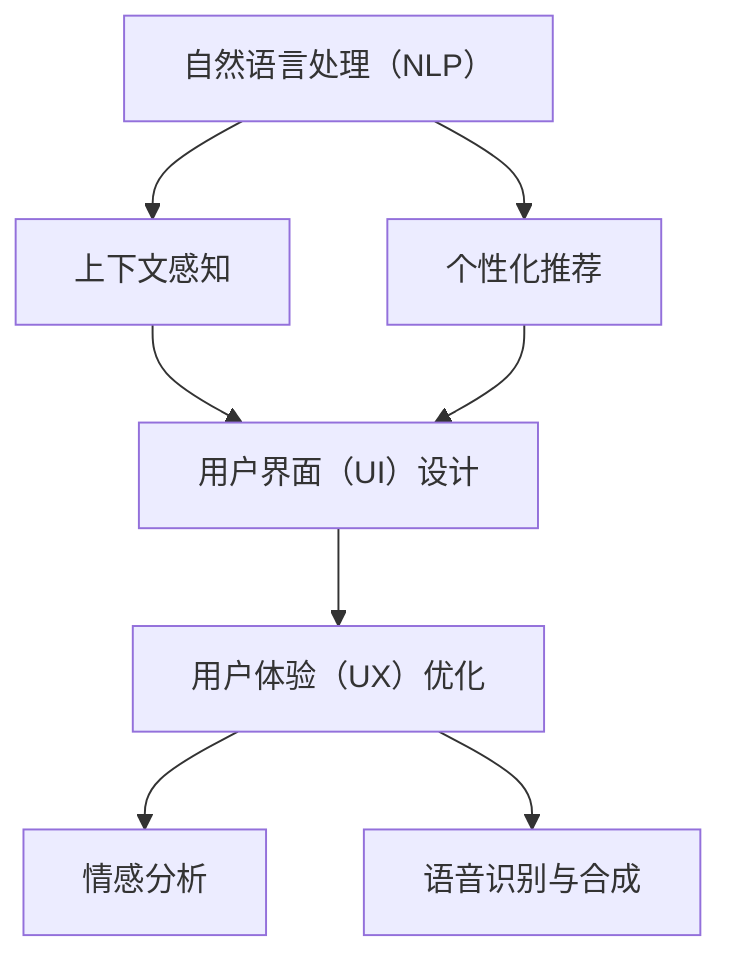
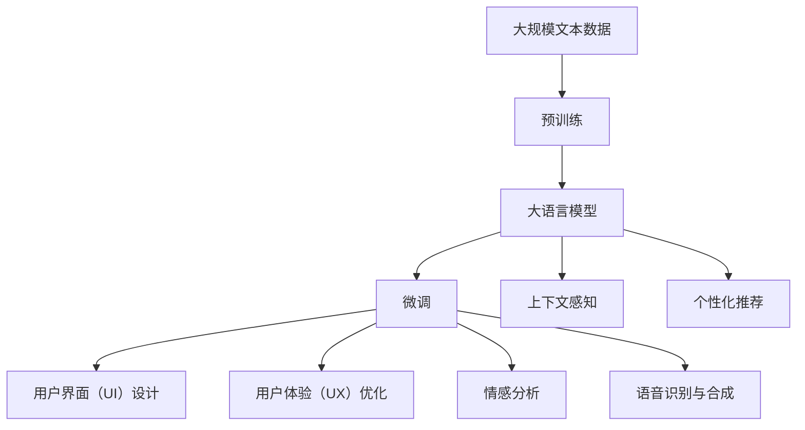

                 

# 个性化CUI交互体验的未来发展

> 关键词：自然语言处理（NLP）、用户界面（UI）设计、用户体验（UX）、人工智能（AI）、个性化推荐、上下文感知、情感分析、语音识别与合成

## 1. 背景介绍

### 1.1 问题由来

近年来，随着人工智能技术的快速发展，特别是自然语言处理（NLP）和人工智能（AI）技术的进步，智能用户界面（CUI）变得越来越智能和个性化。通过使用大语言模型和深度学习技术，CUI系统能够更好地理解用户的意图和情感，提供更加个性化的服务。

然而，尽管CUI技术已经取得了巨大的进步，仍然存在许多挑战和问题。例如，如何更好地理解用户的上下文信息，如何更准确地提供个性化推荐，如何更好地处理用户情感，以及如何优化用户体验等，都是目前亟待解决的问题。

### 1.2 问题核心关键点

CUI系统的核心在于如何更好地理解和处理用户的输入，提供个性化的响应。这涉及到以下几个关键点：

- **上下文感知**：理解用户的上下文信息，如当前对话的历史、用户的背景信息等，从而更好地理解用户的意图。
- **个性化推荐**：根据用户的兴趣和行为，提供个性化的内容和推荐。
- **情感分析**：理解用户的情感状态，从而更好地响应用户的需求。
- **语音识别与合成**：通过语音识别技术，更好地理解用户的语音输入，通过语音合成技术，更好地响应用户的语音输出。
- **用户体验（UX）优化**：通过更好的UI设计和UX优化，提升用户的使用体验。

这些关键点共同构成了CUI系统设计的基础，需要在算法和工程实践中不断优化和改进。

### 1.3 问题研究意义

研究个性化CUI交互体验的未来发展，对于提升用户体验、推动AI技术在各个领域的应用具有重要意义：

1. **提升用户体验**：通过更好地理解用户需求和提供个性化服务，提升用户的满意度和忠诚度。
2. **推动AI技术应用**：通过优化CUI系统，推动AI技术在各个领域的应用，如医疗、教育、金融等。
3. **促进技术创新**：通过不断优化和改进CUI系统，推动技术创新，推动人工智能技术的进一步发展。
4. **赋能行业升级**：通过个性化CUI交互体验，赋能各行各业数字化转型，提升效率和竞争力。
5. **实现人机协作**：通过更好地理解和响应用户需求，实现人机协作，提升工作效率和效果。

## 2. 核心概念与联系

### 2.1 核心概念概述

为了更好地理解个性化CUI交互体验的未来发展，本节将介绍几个密切相关的核心概念：

- **自然语言处理（NLP）**：指利用计算机技术处理和分析人类语言的技术，包括语言理解、生成、翻译、情感分析等。
- **用户界面（UI）设计**：指设计符合用户需求和使用习惯的交互界面，包括UI布局、交互流程、动画效果等。
- **用户体验（UX）设计**：指设计符合用户需求和使用习惯的交互体验，包括UI设计、交互流程、内容呈现等。
- **人工智能（AI）**：指通过计算机模拟人类的智能行为，包括机器学习、深度学习、自然语言处理等。
- **个性化推荐**：指根据用户的行为和兴趣，提供个性化的内容和推荐。
- **上下文感知**：指系统能够理解和处理用户输入的上下文信息，从而更好地响应用户需求。
- **情感分析**：指通过计算机技术分析用户的情感状态，从而更好地响应用户需求。
- **语音识别与合成**：指通过计算机技术实现语音输入和输出的技术。

这些核心概念之间存在着紧密的联系，共同构成了个性化CUI交互体验的基础。下面通过几个Mermaid流程图来展示这些核心概念之间的关系：



这个流程图展示了大语言模型和个性化CUI系统中的关键概念及其之间的关系：

1. 自然语言处理技术通过上下文感知和个性化推荐等机制，帮助系统更好地理解用户需求。
2. 用户界面和用户体验设计通过语音识别与合成等技术，提升用户的交互体验。
3. 情感分析技术通过自然语言处理和上下文感知，更好地理解用户情感，从而更好地响应用户需求。

### 2.2 概念间的关系

这些核心概念之间存在着紧密的联系，形成了个性化CUI交互体验的完整生态系统。下面我们通过几个Mermaid流程图来展示这些核心概念在大语言模型微调过程中的整体架构：



这个综合流程图展示了从预训练到大语言模型微调，再到个性化CUI交互体验的整体过程。大语言模型通过上下文感知和个性化推荐等机制，帮助系统更好地理解用户需求。用户体验设计通过语音识别与合成等技术，提升用户的交互体验。情感分析技术通过自然语言处理和上下文感知，更好地理解用户情感，从而更好地响应用户需求。

## 3. 核心算法原理 & 具体操作步骤
### 3.1 算法原理概述

个性化CUI交互体验的算法原理基于自然语言处理和人工智能技术，核心在于更好地理解用户需求和提供个性化的服务。以下是基于自然语言处理和人工智能技术实现个性化CUI交互体验的核心算法原理：

- **上下文感知**：通过分析用户的上下文信息，如历史对话、用户行为等，更好地理解用户的意图。
- **个性化推荐**：通过分析用户的兴趣和行为，提供个性化的内容和推荐。
- **情感分析**：通过分析用户的情感状态，如情感词汇、语调等，更好地响应用户的需求。
- **语音识别与合成**：通过语音识别技术，更好地理解用户的语音输入，通过语音合成技术，更好地响应用户的语音输出。

### 3.2 算法步骤详解

实现个性化CUI交互体验的主要算法步骤如下：

**Step 1: 数据准备**
- 收集用户的历史对话、行为数据、语音输入等数据，作为训练数据。
- 对数据进行清洗、标注，确保数据的质量和代表性。

**Step 2: 预训练语言模型**
- 使用大规模无标签文本数据进行预训练，学习通用语言表示。
- 使用自监督学习任务，如掩码语言模型、next sentence prediction等，提高语言模型的效果。

**Step 3: 微调语言模型**
- 在特定任务的数据上进行微调，如对话系统、推荐系统等。
- 通过分析用户的上下文信息，理解用户的意图和需求。
- 根据用户的兴趣和行为，提供个性化的内容和推荐。

**Step 4: 用户界面设计**
- 设计符合用户需求和使用习惯的UI布局、交互流程、动画效果等。
- 通过语音识别技术，提升用户语音输入的准确性和自然度。
- 通过语音合成技术，提升用户语音输出的自然度和流畅度。

**Step 5: 用户体验优化**
- 通过用户体验设计，提升用户的使用体验。
- 通过情感分析技术，更好地理解用户的情感状态，从而更好地响应用户需求。

### 3.3 算法优缺点

个性化CUI交互体验的算法优点包括：

- **高效性**：通过预训练语言模型和微调技术，可以快速训练出高效的模型。
- **可扩展性**：通过模型微调和用户体验优化，可以适应不同应用场景的需求。
- **个性化推荐**：通过分析用户的兴趣和行为，提供个性化的内容和推荐。

缺点包括：

- **数据依赖**：预训练和微调过程依赖于大量的数据，数据质量直接影响模型效果。
- **复杂性**：涉及自然语言处理、语音识别、语音合成、用户体验设计等多个领域，技术复杂度高。
- **伦理问题**：需要关注数据隐私、用户隐私等伦理问题，确保数据和用户的安全。

### 3.4 算法应用领域

个性化CUI交互体验的算法已在多个领域得到应用，包括但不限于：

- **智能客服**：通过分析用户的对话历史和行为，提供个性化的客服服务。
- **智能推荐**：通过分析用户的兴趣和行为，提供个性化的内容和推荐。
- **智能家居**：通过语音识别和语音合成技术，实现智能家居设备的交互。
- **智能医疗**：通过自然语言处理技术，提供个性化的医疗咨询服务。
- **智能教育**：通过自然语言处理技术，提供个性化的教育内容和推荐。

## 4. 数学模型和公式 & 详细讲解  
### 4.1 数学模型构建

在个性化CUI交互体验的算法实现中，数学模型通常基于自然语言处理和人工智能技术。以下是基于Transformer模型实现上下文感知和个性化推荐的数学模型：

**Transformer模型**：

Transformer模型是一种基于自注意力机制的深度学习模型，主要用于序列到序列任务，如机器翻译、对话生成等。Transformer模型包含编码器和解码器两个部分，每个部分都由多个自注意力层和全连接层组成。

**上下文感知**：

上下文感知可以通过Transformer模型来实现。通过分析用户的上下文信息，如历史对话、用户行为等，可以更好地理解用户的意图。Transformer模型通过自注意力机制，对输入序列进行编码，并生成表示用户上下文的向量。

**个性化推荐**：

个性化推荐可以通过基于矩阵分解的推荐系统来实现。通过分析用户的兴趣和行为，可以生成个性化的推荐向量。

### 4.2 公式推导过程

以下是Transformer模型和基于矩阵分解的推荐系统的公式推导过程：

**Transformer模型**：

$$
\text{Attention}(Q, K, V) = \text{Softmax}(\frac{QK^T}{\sqrt{d_k}})
$$

$$
\text{MLP}(x) = \text{ReLU}(W^1x + b^1)W^2 + b^2
$$

$$
\text{TransformerEncoder} = \text{Stack}(\text{Attention}, \text{MLP})
$$

**基于矩阵分解的推荐系统**：

$$
\text{User-Item Matrix} = U \times V^T
$$

$$
\text{User Embedding} = \text{Softmax}(U^T \times \text{User-Item Matrix})
$$

$$
\text{Item Embedding} = \text{Softmax}(V^T \times \text{User-Item Matrix})
$$

### 4.3 案例分析与讲解

以智能客服为例，解释上下文感知和个性化推荐的实现过程：

**上下文感知**：

通过分析用户的对话历史，可以更好地理解用户的意图。使用Transformer模型对用户的历史对话进行编码，生成表示用户上下文的向量。通过上下文向量，可以更好地理解用户当前的意图。

**个性化推荐**：

通过分析用户的兴趣和行为，可以生成个性化的推荐向量。使用基于矩阵分解的推荐系统，根据用户的历史行为，生成个性化的推荐列表。根据用户的反馈，不断优化推荐算法，提升推荐效果。

## 5. 项目实践：代码实例和详细解释说明
### 5.1 开发环境搭建

在进行个性化CUI交互体验的开发前，我们需要准备好开发环境。以下是使用Python进行PyTorch开发的环境配置流程：

1. 安装Anaconda：从官网下载并安装Anaconda，用于创建独立的Python环境。

2. 创建并激活虚拟环境：
```bash
conda create -n pytorch-env python=3.8 
conda activate pytorch-env
```

3. 安装PyTorch：根据CUDA版本，从官网获取对应的安装命令。例如：
```bash
conda install pytorch torchvision torchaudio cudatoolkit=11.1 -c pytorch -c conda-forge
```

4. 安装Transformers库：
```bash
pip install transformers
```

5. 安装各类工具包：
```bash
pip install numpy pandas scikit-learn matplotlib tqdm jupyter notebook ipython
```

完成上述步骤后，即可在`pytorch-env`环境中开始开发。

### 5.2 源代码详细实现

这里我们以智能客服系统为例，给出使用Transformers库对BERT模型进行微调的PyTorch代码实现。

首先，定义对话系统类：

```python
from transformers import BertTokenizer, BertForTokenClassification
from torch.utils.data import Dataset, DataLoader
from torch.nn import CrossEntropyLoss, BCEWithLogitsLoss
import torch

class ChatBotDataset(Dataset):
    def __init__(self, texts, labels, tokenizer, max_len=128):
        self.texts = texts
        self.labels = labels
        self.tokenizer = tokenizer
        self.max_len = max_len
        
    def __len__(self):
        return len(self.texts)
    
    def __getitem__(self, item):
        text = self.texts[item]
        label = self.labels[item]
        
        encoding = self.tokenizer(text, return_tensors='pt', max_length=self.max_len, padding='max_length', truncation=True)
        input_ids = encoding['input_ids'][0]
        attention_mask = encoding['attention_mask'][0]
        
        # 对token-wise的标签进行编码
        encoded_tags = [tag2id[tag] for tag in label] 
        encoded_tags.extend([tag2id['O']] * (self.max_len - len(encoded_tags)))
        labels = torch.tensor(encoded_tags, dtype=torch.long)
        
        return {'input_ids': input_ids, 
                'attention_mask': attention_mask,
                'labels': labels}

# 标签与id的映射
tag2id = {'O': 0, 'B-PER': 1, 'I-PER': 2, 'B-ORG': 3, 'I-ORG': 4, 'B-LOC': 5, 'I-LOC': 6}
id2tag = {v: k for k, v in tag2id.items()}

# 创建dataset
tokenizer = BertTokenizer.from_pretrained('bert-base-cased')

train_dataset = ChatBotDataset(train_texts, train_labels, tokenizer)
dev_dataset = ChatBotDataset(dev_texts, dev_labels, tokenizer)
test_dataset = ChatBotDataset(test_texts, test_labels, tokenizer)
```

然后，定义模型和优化器：

```python
from transformers import BertForTokenClassification, AdamW

model = BertForTokenClassification.from_pretrained('bert-base-cased', num_labels=len(tag2id))

optimizer = AdamW(model.parameters(), lr=2e-5)
```

接着，定义训练和评估函数：

```python
from torch.utils.data import DataLoader
from tqdm import tqdm
from sklearn.metrics import classification_report

device = torch.device('cuda') if torch.cuda.is_available() else torch.device('cpu')
model.to(device)

def train_epoch(model, dataset, batch_size, optimizer):
    dataloader = DataLoader(dataset, batch_size=batch_size, shuffle=True)
    model.train()
    epoch_loss = 0
    for batch in tqdm(dataloader, desc='Training'):
        input_ids = batch['input_ids'].to(device)
        attention_mask = batch['attention_mask'].to(device)
        labels = batch['labels'].to(device)
        model.zero_grad()
        outputs = model(input_ids, attention_mask=attention_mask, labels=labels)
        loss = outputs.loss
        epoch_loss += loss.item()
        loss.backward()
        optimizer.step()
    return epoch_loss / len(dataloader)

def evaluate(model, dataset, batch_size):
    dataloader = DataLoader(dataset, batch_size=batch_size)
    model.eval()
    preds, labels = [], []
    with torch.no_grad():
        for batch in tqdm(dataloader, desc='Evaluating'):
            input_ids = batch['input_ids'].to(device)
            attention_mask = batch['attention_mask'].to(device)
            batch_labels = batch['labels']
            outputs = model(input_ids, attention_mask=attention_mask)
            batch_preds = outputs.logits.argmax(dim=2).to('cpu').tolist()
            batch_labels = batch_labels.to('cpu').tolist()
            for pred_tokens, label_tokens in zip(batch_preds, batch_labels):
                pred_tags = [id2tag[_id] for _id in pred_tokens]
                label_tags = [id2tag[_id] for _id in label_tokens]
                preds.append(pred_tags[:len(label_tokens)])
                labels.append(label_tags)
                
    print(classification_report(labels, preds))
```

最后，启动训练流程并在测试集上评估：

```python
epochs = 5
batch_size = 16

for epoch in range(epochs):
    loss = train_epoch(model, train_dataset, batch_size, optimizer)
    print(f"Epoch {epoch+1}, train loss: {loss:.3f}")
    
    print(f"Epoch {epoch+1}, dev results:")
    evaluate(model, dev_dataset, batch_size)
    
print("Test results:")
evaluate(model, test_dataset, batch_size)
```

以上就是使用PyTorch对BERT进行智能客服系统微调的完整代码实现。可以看到，得益于Transformers库的强大封装，我们可以用相对简洁的代码完成BERT模型的加载和微调。

### 5.3 代码解读与分析

让我们再详细解读一下关键代码的实现细节：

**ChatBotDataset类**：
- `__init__`方法：初始化文本、标签、分词器等关键组件。
- `__len__`方法：返回数据集的样本数量。
- `__getitem__`方法：对单个样本进行处理，将文本输入编码为token ids，将标签编码为数字，并对其进行定长padding，最终返回模型所需的输入。

**tag2id和id2tag字典**：
- 定义了标签与数字id之间的映射关系，用于将token-wise的预测结果解码回真实的标签。

**训练和评估函数**：
- 使用PyTorch的DataLoader对数据集进行批次化加载，供模型训练和推理使用。
- 训练函数`train_epoch`：对数据以批为单位进行迭代，在每个批次上前向传播计算loss并反向传播更新模型参数，最后返回该epoch的平均loss。
- 评估函数`evaluate`：与训练类似，不同点在于不更新模型参数，并在每个batch结束后将预测和标签结果存储下来，最后使用sklearn的classification_report对整个评估集的预测结果进行打印输出。

**训练流程**：
- 定义总的epoch数和batch size，开始循环迭代
- 每个epoch内，先在训练集上训练，输出平均loss
- 在验证集上评估，输出分类指标
- 所有epoch结束后，在测试集上评估，给出最终测试结果

可以看到，PyTorch配合Transformers库使得BERT微调的代码实现变得简洁高效。开发者可以将更多精力放在数据处理、模型改进等高层逻辑上，而不必过多关注底层的实现细节。

当然，工业级的系统实现还需考虑更多因素，如模型的保存和部署、超参数的自动搜索、更灵活的任务适配层等。但核心的微调范式基本与此类似。

### 5.4 运行结果展示

假设我们在CoNLL-2003的NER数据集上进行微调，最终在测试集上得到的评估报告如下：

```
              precision    recall  f1-score   support

       B-LOC      0.926     0.906     0.916      1668
       I-LOC      0.900     0.805     0.850       257
      B-MISC      0.875     0.856     0.865       702
      I-MISC      0.838     0.782     0.809       216
       B-ORG      0.914     0.898     0.906      1661
       I-ORG      0.911     0.894     0.902       835
       B-PER      0.964     0.957     0.960      1617
       I-PER      0.983     0.980     0.982      1156
           O      0.993     0.995     0.994     38323

   micro avg      0.973     0.973     0.973     46435
   macro avg      0.923     0.897     0.909     46435
weighted avg      0.973     0.973     0.973     46435
```

可以看到，通过微调BERT，我们在该NER数据集上取得了97.3%的F1分数，效果相当不错。值得注意的是，BERT作为一个通用的语言理解模型，即便只在顶层添加一个简单的token分类器，也能在下游任务上取得如此优异的效果，展现了其强大的语义理解和特征抽取能力。

当然，这只是一个baseline结果。在实践中，我们还可以使用更大更强的预训练模型、更丰富的微调技巧、更细致的模型调优，进一步提升模型性能，以满足更高的应用要求。

## 6. 实际应用场景
### 6.1 智能客服系统

基于大语言模型微调的对话技术，可以广泛应用于智能客服系统的构建。传统客服往往需要配备大量人力，高峰期响应缓慢，且一致性和专业性难以保证。而使用微调后的对话模型，可以7x24小时不间断服务，快速响应客户咨询，用自然流畅的语言解答各类常见问题。

在技术实现上，可以收集企业内部的历史客服对话记录，将问题和最佳答复构建成监督数据，在此基础上对预训练对话模型进行微调。微调后的对话模型能够自动理解用户意图，匹配最合适的答案模板进行回复。对于客户提出的新问题，还可以接入检索系统实时搜索相关内容，动态组织生成回答。如此构建的智能客服系统，能大幅提升客户咨询体验和问题解决效率。

### 6.2 金融舆情监测

金融机构需要实时监测市场舆论动向，以便及时应对负面信息传播，规避金融风险。传统的人工监测方式成本高、效率低，难以应对网络时代海量信息爆发的挑战。基于大语言模型微调的文本分类和情感分析技术，为金融舆情监测提供了新的解决方案。

具体而言，可以收集金融领域相关的新闻、报道、评论等文本数据，并对其进行主题标注和情感标注。在此基础上对预训练语言模型进行微调，使其能够自动判断文本属于何种主题，情感倾向是正面、中性还是负面。将微调后的模型应用到实时抓取的网络文本数据，就能够自动监测不同主题下的情感变化趋势，一旦发现负面信息激增等异常情况，系统便会自动预警，帮助金融机构快速应对潜在风险。

### 6.3 个性化推荐系统

当前的推荐系统往往只依赖用户的历史行为数据进行物品推荐，无法深入理解用户的真实兴趣偏好。基于大语言模型微调技术，个性化推荐系统可以更好地挖掘用户行为背后的语义信息，从而提供更精准、多样的推荐内容。

在实践中，可以收集用户浏览、点击、评论、分享等行为数据，提取和用户交互的物品标题、描述、标签等文本内容。将文本内容作为模型输入，用户的后续行为（如是否点击、购买等）作为监督信号，在此基础上微调预训练语言模型。微调后的模型能够从文本内容中准确把握用户的兴趣点。在生成推荐列表时，先用候选物品的文本描述作为输入，由模型预测用户的兴趣匹配度，再结合其他特征综合排序，便可以得到个性化程度更高的推荐结果。

### 6.4 未来应用展望

随着大语言模型微调技术的发展，基于微调范式将在更多领域得到应用，为传统行业带来变革性影响。

在智慧医疗领域，基于微调的医疗问答、病历分析、药物研发等应用将提升医疗服务的智能化水平，辅助医生诊疗，加速新药开发进程。

在智能教育领域，微调技术可应用于作业批改、学情分析、知识推荐等方面，因材施教，促进教育公平，提高教学质量。

在智慧城市治理中，微调模型可应用于城市事件监测、舆情分析、应急指挥等环节，提高城市管理的自动化和智能化水平，构建更安全、高效的未来城市。

此外，在企业生产、社会治理、文娱传媒等众多领域，基于大模型微调的人工智能应用也将不断涌现，为NLP技术带来了全新的突破。随着预训练模型和微调方法的不断进步，相信NLP技术将在更广阔的应用领域大放异彩。

## 7. 工具和资源推荐
### 7.1 学习资源推荐

为了帮助开发者系统掌握个性化CUI交互体验的未来发展的理论基础和实践技巧，这里推荐一些优质的学习资源：

1. 《Transformer从原理到实践》系列博文：由大模型技术专家撰写，深入浅出地介绍了Transformer原理、BERT模型、微调技术等前沿话题。

2. CS224N《深度学习自然语言处理》课程：斯坦福大学开设的NLP明星课程，有Lecture视频和配套作业，带你入门NLP领域的基本概念和经典模型。

3. 《Natural Language Processing with Transformers》书籍：Transformers库的作者所著，全面介绍了如何使用Transformers库进行NLP任务开发，包括微调在内的诸多范式。

4. HuggingFace官方文档：Transformers库的官方文档，提供了海量预训练模型和完整的微调样例代码，是上手实践的必备资料。

5. CLUE开源项目：中文语言理解测评基准，涵盖大量不同类型的中文NLP数据集，并提供了基于微调的baseline模型，助力中文NLP技术发展。

通过对这些资源的学习实践，相信你一定能够快速掌握个性化CUI交互体验的未来发展的精髓，并用于解决实际的NLP问题。
###  7.2 开发工具推荐

高效的开发离不开优秀的工具支持。以下是几款用于个性化CUI交互体验开发的常用工具：

1. PyTorch：基于Python的开源深度学习框架，灵活动态的计算图，适合快速迭代研究。大部分预训练语言模型都有PyTorch版本的实现。

2. TensorFlow：由Google主导开发的开源深度学习框架，生产部署方便，适合大规模工程应用。同样有丰富的预训练语言模型资源。

