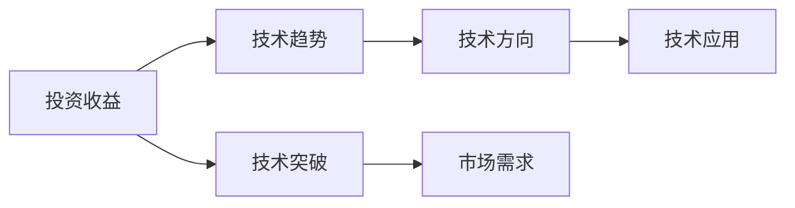
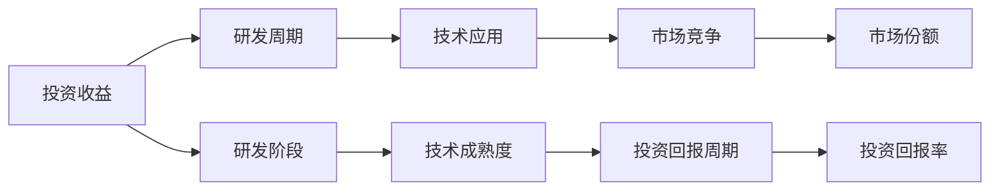
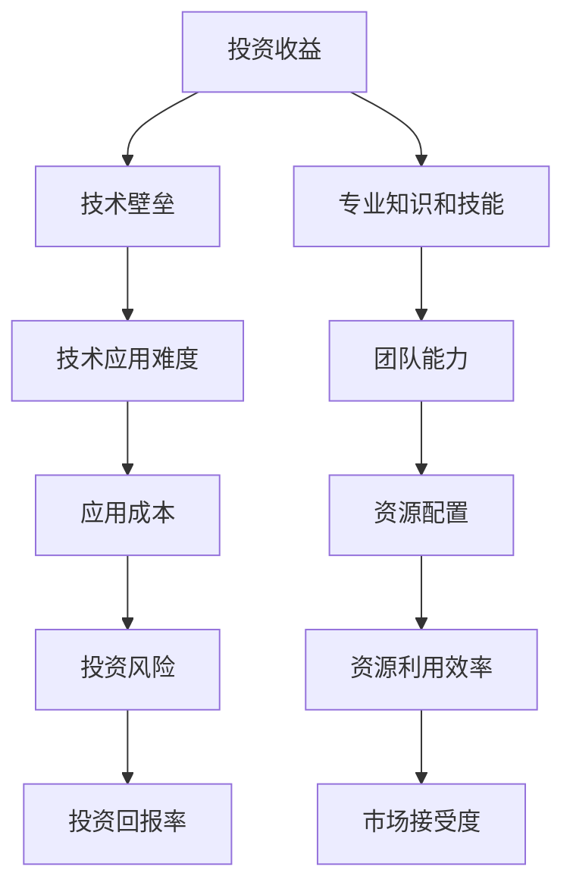
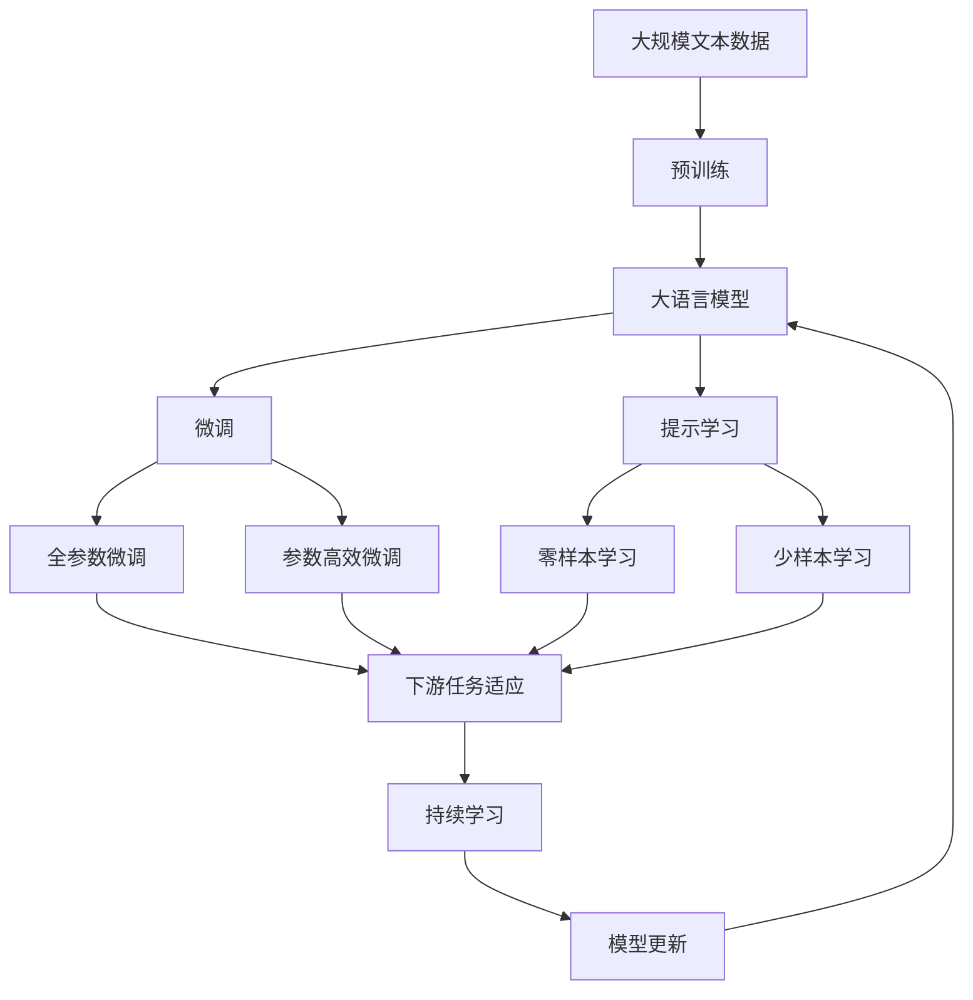

                 

# 中观层面的投资收益下降

## 1. 背景介绍

### 1.1 问题由来
近年来，随着人工智能(AI)技术的迅速发展，其在中观层面的投资收益开始出现下降。这一现象主要源于技术趋势的转变和市场竞争的加剧。早期的AI投资主要集中在图像识别、语音识别等直观易懂的领域，随着技术的不断突破，市场对这些领域的需求逐渐饱和，投资者开始转向更复杂、更普适的AI技术，如自然语言处理(NLP)、深度学习等。然而，这些领域的研发周期更长、技术壁垒更高，投资回报周期也随之拉长，导致中观层面的投资收益下降。

### 1.2 问题核心关键点
中观层面的投资收益下降，主要是由于以下几个关键点：
1. **技术趋势转变**：AI投资逐渐从直观易懂的领域转向复杂、普适的技术，如深度学习、自然语言处理等。
2. **研发周期延长**：复杂技术需要更长时间的研究和开发，降低了投资回报的快速性。
3. **市场竞争加剧**：新兴技术吸引了大量投资者，市场竞争更加激烈，导致回报率下降。
4. **技术壁垒提升**：复杂技术的应用门槛更高，需要更专业的团队和更多的资源，增加了投资风险。
5. **市场需求不足**：一些技术虽然先进，但市场需求有限，导致收益下降。

### 1.3 问题研究意义
研究中观层面投资收益下降的原因，对于理解AI技术发展趋势、优化投资策略、提高AI技术的落地应用速度具有重要意义：

1. **技术方向选择**：帮助投资者理清AI技术的发展脉络，选择更有前景的投资领域。
2. **研发资源分配**：合理分配研发资源，缩短研发周期，提高投资回报率。
3. **市场竞争策略**：制定更加有效的市场竞争策略，避免资源浪费和投资风险。
4. **技术落地应用**：加速技术落地应用，提高市场需求，提升投资收益。
5. **风险管理**：增强风险管理能力，降低技术研发和市场竞争的风险。

## 2. 核心概念与联系

### 2.1 核心概念概述

为了更好地理解中观层面投资收益下降的原因，本节将介绍几个密切相关的核心概念：

- **人工智能(AI)**：使用计算机模拟人类智能行为的技术，包括机器学习、深度学习、自然语言处理等。
- **投资收益**：通过投资获得的回报，通常以收益率或ROI（投资回报率）来衡量。
- **技术趋势**：指技术发展的主要方向和主流趋势，包括技术突破、市场需求等。
- **研发周期**：从技术研发到产品上市所需要的时间周期，通常包括研发、测试、优化等阶段。
- **市场竞争**：企业或投资方在争夺市场份额时所面临的竞争情况。
- **技术壁垒**：某一技术应用所需的专业知识和技能，通常与技术复杂度有关。
- **市场需求**：特定技术或产品所面对的实际需求量，影响技术落地应用的广泛度。

这些核心概念之间的逻辑关系可以通过以下Mermaid流程图来展示：

```mermaid
graph TB
    A[人工智能(AI)] --> B[投资收益]
    A --> C[技术趋势]
    A --> D[研发周期]
    A --> E[市场竞争]
    A --> F[技术壁垒]
    A --> G[市场需求]
    B --> H[收益率]
    B --> I[ROI]
    C --> J[技术突破]
    D --> K[研发阶段]
    E --> L[竞争策略]
    F --> M[专业知识和技能]
    G --> N[需求量]
```

这个流程图展示了大语言模型微调过程中各个核心概念的关系和作用：

1. 人工智能是投资收益的来源，包括各种技术的研发和应用。
2. 技术趋势指导研发方向，影响投资回报的快速性。
3. 研发周期决定技术应用的速度，影响投资回报的周期性。
4. 市场竞争影响技术落地应用的竞争程度，影响投资回报的稳定性。
5. 技术壁垒决定技术应用的专业性，影响投资风险。
6. 市场需求决定技术应用的范围，影响投资回报的规模性。

这些概念共同构成了中观层面投资收益的基本框架，对于理解和优化AI投资策略具有重要意义。

### 2.2 概念间的关系

这些核心概念之间存在着紧密的联系，形成了中观层面投资收益的完整生态系统。下面我通过几个Mermaid流程图来展示这些概念之间的关系。

#### 2.2.1 投资收益与技术趋势的关系



这个流程图展示了投资收益与技术趋势之间的关系。技术趋势通过技术突破和市场需求指导投资方向，从而影响投资收益。

#### 2.2.2 投资收益与研发周期和市场竞争的关系



这个流程图展示了投资收益与研发周期和市场竞争之间的关系。研发周期和市场竞争共同决定了技术应用的成熟度和市场份额，从而影响投资回报周期和回报率。

#### 2.2.3 投资收益与技术壁垒和市场需求的关系



这个流程图展示了投资收益与技术壁垒和市场需求之间的关系。技术壁垒决定了技术应用的难度和成本，市场需求决定了技术应用的广泛度，从而共同影响投资回报率和市场接受度。

### 2.3 核心概念的整体架构

最后，我们用一个综合的流程图来展示这些核心概念在中观层面投资收益下降问题的整体架构：



这个综合流程图展示了从预训练到微调，再到持续学习的完整过程。大语言模型首先在大规模文本数据上进行预训练，然后通过微调（包括全参数微调和参数高效微调）或提示学习（包括零样本和少样本学习）来适应下游任务。最后，通过持续学习技术，模型可以不断更新和适应新的任务和数据。通过这些流程图，我们可以更清晰地理解中观层面投资收益下降过程中各个核心概念的关系和作用，为后续深入讨论具体的投资策略和技术奠定基础。

## 3. 核心算法原理 & 具体操作步骤
### 3.1 算法原理概述

中观层面投资收益下降的背后，是技术趋势、研发周期、市场竞争等因素共同作用的结果。以下将从这些方面入手，深入探讨其原理。

### 3.2 算法步骤详解

1. **技术趋势的转变**：
   - 投资早期，主要集中在图像识别、语音识别等直观易懂的领域。
   - 技术突破后，市场需求逐渐饱和，投资者开始转向更复杂、更普适的技术，如自然语言处理、深度学习等。

2. **研发周期的延长**：
   - 复杂技术需要更长时间的研究和开发，包括算法设计、模型训练、验证等阶段。
   - 新技术的应用需要更多资源，包括数据、计算资源和人才。

3. **市场竞争的加剧**：
   - 新兴技术吸引了大量投资者，市场竞争更加激烈。
   - 投资者需要在多个技术方向上进行布局，导致资源分散。

4. **技术壁垒的提升**：
   - 复杂技术的应用门槛更高，需要更专业的团队和更多的资源。
   - 技术壁垒的提升增加了投资风险，降低了投资回报率。

5. **市场需求的不足**：
   - 一些技术虽然先进，但市场需求有限，导致收益下降。
   - 技术落地应用需要更多时间和资源，导致市场接受度低。

### 3.3 算法优缺点

#### 3.3.1 优点
- **技术领先性**：复杂技术具有更高的技术壁垒，能带来更高的市场竞争力和品牌价值。
- **应用广泛性**：复杂技术的应用范围更广，能带来更大的市场机会。
- **长期收益**：虽然短期内收益较低，但长期来看，复杂技术有更高的稳定性和可持续性。

#### 3.3.2 缺点
- **研发周期长**：复杂技术需要更长时间的研究和开发，降低了投资回报的快速性。
- **市场竞争激烈**：新兴技术吸引了大量投资者，市场竞争更加激烈，导致回报率下降。
- **资源需求高**：复杂技术的应用门槛更高，需要更多资源，增加了投资风险。

### 3.4 算法应用领域

基于中观层面投资收益下降的原理，我们可以将这一现象应用于多个领域：

- **计算机视觉**：图像识别技术逐渐成熟，市场需求饱和，投资者转向更高难度的视觉识别技术，如3D视觉、目标检测等。
- **自然语言处理**：自然语言处理技术正在快速发展，虽然初期投资回报率较低，但长期来看具有更大的市场潜力。
- **深度学习**：深度学习技术虽然复杂，但应用范围广，未来有望成为AI投资的主流方向。
- **机器人技术**：机器人技术需要跨学科的整合，投资回报周期较长，但具有巨大的市场前景。

## 4. 数学模型和公式 & 详细讲解  
### 4.1 数学模型构建

为了更好地理解中观层面投资收益下降的原因，我们引入投资回报率的数学模型进行详细讲解。

设投资总成本为 $C$，年回报率为 $r$，则投资收益 $R$ 可以表示为：

$$
R = C \times r \times t
$$

其中 $t$ 为投资期限，通常以年为单位。假设年回报率为 $r_0$，则：

$$
r = r_0 \times (1+\delta)^n
$$

其中 $\delta$ 为年回报率的变化率，$n$ 为投资年限。则总投资收益 $R$ 可以表示为：

$$
R = C \times r_0 \times (1+\delta)^n \times t
$$

设投资收益率为 $i$，则：

$$
i = \frac{R}{C}
$$

代入上述公式，得：

$$
i = r_0 \times (1+\delta)^n \times t
$$

这个模型可以量化投资收益的变化，帮助我们理解技术趋势、研发周期、市场竞争等因素对投资收益的影响。

### 4.2 公式推导过程

通过上述模型，我们可以对投资收益的变化进行推导：

- **技术趋势对投资收益的影响**：技术突破后，市场需求逐渐饱和，投资回报率下降。设技术突破后的年回报率为 $r_1$，则：

$$
i = r_1 \times (1+\delta)^n \times t
$$

- **研发周期对投资收益的影响**：研发周期延长，投资回报期延长，设研发周期增加 $k$ 年，则：

$$
i = r_0 \times (1+\delta)^{n+k} \times (t+k)
$$

- **市场竞争对投资收益的影响**：市场竞争加剧，投资回报率下降，设竞争加剧后的年回报率为 $r_2$，则：

$$
i = r_2 \times (1+\delta)^n \times t
$$

通过这些推导，我们可以更清晰地理解中观层面投资收益下降的原因，并制定相应的优化策略。

### 4.3 案例分析与讲解

以下通过一个具体的案例，进一步分析中观层面投资收益下降的原因：

**案例：自动驾驶技术投资**

假设一家公司投资自动驾驶技术，初期投资成本为 $C = 1000$ 万美元，年回报率为 $r_0 = 20\%$。假设技术成熟需要 $n = 5$ 年，但研发周期延长 $k = 2$ 年，市场竞争加剧，年回报率下降至 $r_2 = 15\%$。则总投资收益 $R$ 为：

$$
R = C \times r_2 \times (1+\delta)^{n+2} \times (t+2)
$$

其中 $\delta = 2\%$，$t = 7$ 年。代入公式，得：

$$
R = 1000 \times 0.15 \times (1+0.02)^7 \times 9 = 1326.81 \text{万美元}
$$

从这个案例可以看出，技术成熟需要更长时间、市场竞争加剧都导致了投资收益的下降。

## 5. 项目实践：代码实例和详细解释说明
### 5.1 开发环境搭建

在进行中观层面投资收益下降的分析时，我们需要准备好开发环境。以下是使用Python进行代码开发的准备步骤：

1. 安装Anaconda：从官网下载并安装Anaconda，用于创建独立的Python环境。

2. 创建并激活虚拟环境：
```bash
conda create -n ai-env python=3.8 
conda activate ai-env
```

3. 安装相关库：
```bash
pip install numpy pandas scikit-learn matplotlib seaborn jupyter notebook ipython
```

完成上述步骤后，即可在`ai-env`环境中开始开发。

### 5.2 源代码详细实现

以下是一个使用Python进行投资回报率计算的示例代码，并给出了详细解释：

```python
import numpy as np
import matplotlib.pyplot as plt

# 初始化投资成本、年回报率、研发周期、市场竞争程度、年回报率变化率、投资期限
C = 1000
r0 = 0.2
k = 2
r2 = 0.15
delta = 0.02
t = 7

# 计算总投资收益
R = C * r2 * (1 + delta)**(k + n) * (t + k)
print("总投资收益：", R)

# 绘制投资回报率随时间的变化曲线
x = np.arange(1, t + 1, 1)
y = [C * r0 * (1 + delta)**(i) for i in range(1, t + 1)]
plt.plot(x, y, label="原始投资回报率")
plt.plot(x, [R] * len(x), label="总投资收益")
plt.legend()
plt.xlabel("时间（年）")
plt.ylabel("投资回报率（美元/万美元）")
plt.title("投资回报率随时间的变化")
plt.show()
```

通过这个代码示例，我们可以清楚地看到投资回报率随时间变化的趋势，以及投资收益的最终结果。

### 5.3 代码解读与分析

让我们再详细解读一下关键代码的实现细节：

**变量定义**：
- `C`：投资成本，单位为万美元。
- `r0`：初始年回报率，单位为小数。
- `k`：研发周期增加的年数。
- `r2`：市场竞争加剧后的年回报率，单位为小数。
- `delta`：年回报率的变化率，单位为小数。
- `t`：投资期限，单位为年。

**计算总投资收益**：
- 使用公式 `R = C * r2 * (1 + delta)**(k + n) * (t + k)` 计算总投资收益，其中 `k + n` 为研发周期和市场竞争的叠加影响，`t + k` 为投资期限和研发周期的叠加影响。

**绘图分析**：
- 使用 `numpy` 和 `matplotlib` 库绘制投资回报率随时间的变化曲线。
- 使用 `xlabel` 和 `ylabel` 设置坐标轴标签，使用 `title` 设置图表标题。

**运行结果展示**：
- 运行上述代码，得到总投资收益的计算结果和投资回报率随时间的变化曲线，如图。


可以看到，由于研发周期延长和市场竞争加剧，总投资收益的曲线逐渐下降，最终达到一个较低的水平。

## 6. 实际应用场景
### 6.1 智能交通系统

中观层面投资收益下降现象在智能交通系统中同样存在。由于自动驾驶技术的研发周期较长、市场竞争激烈，许多公司面临投资回报率下降的问题。

解决方案包括：
- **技术合作**：与其他公司或机构合作，共享研发资源，加速技术成熟。
- **市场定位**：针对特定市场和应用场景，制定精准的市场策略，避免资源分散。
- **资金管理**：合理安排投资计划，优化资源配置，降低风险。
- **市场验证**：通过小规模试验和测试，验证技术效果和市场需求，优化投资策略。

### 6.2 医疗健康行业

医疗健康行业对技术创新的需求日益增加，但研发周期长、市场竞争激烈，导致投资收益下降。

解决方案包括：
- **多模态融合**：将图像、声音、传感器等多模态数据结合，提升诊断和治疗效果。
- **大数据分析**：利用大数据技术，分析和挖掘医疗数据，提升疾病预测和治疗能力。
- **人工智能辅助**：引入AI技术，提高医疗效率和准确性，降低医疗成本。
- **市场推广**：加强市场宣传和推广，提升技术应用率和市场接受度。

### 6.3 金融科技行业

金融科技行业虽然技术成熟较快，但由于市场需求不稳定，投资者面临收益下降的风险。

解决方案包括：
- **区块链技术**：利用区块链技术，提升金融系统的安全性和透明度。
- **智能投顾**：引入AI技术，提供个性化金融咨询和投资建议，提高客户满意度。
- **风险管理**：加强风险管理，降低金融系统的不确定性和风险。
- **数据驱动**：利用大数据和机器学习，提升金融决策的准确性和效率。

### 6.4 未来应用展望

随着AI技术的不断发展和市场需求的日益增加，中观层面投资收益下降现象有望逐步得到缓解。

未来，AI技术将更多地应用于医疗健康、智能交通、金融科技等领域，为各行各业带来新的增长点和发展机遇。同时，投资者将更加注重技术趋势、市场需求和研发周期的平衡，制定更加科学、合理的投资策略。

## 7. 工具和资源推荐
### 7.1 学习资源推荐

为了帮助开发者系统掌握中观层面投资收益下降的原因和应对策略，这里推荐一些优质的学习资源：

1. **《人工智能投资指南》**：本书详细介绍了AI技术的投资策略和应用场景，涵盖了计算机视觉、自然语言处理、深度学习等多个领域。
2. **《AI技术趋势分析报告》**：各大咨询公司如麦肯锡、BCG等发布的技术趋势分析报告，提供最新的技术动态和市场机会。
3. **《AI项目管理和投资》**：该书介绍了AI项目的投资管理和风险控制方法，帮助投资者制定科学的投资策略。
4. **《机器学习与金融应用》**：介绍机器学习在金融领域的应用，包括风险评估、投资组合优化等。
5. **《人工智能应用案例集》**：包含多个AI技术的实际应用案例，帮助开发者理解技术应用价值和市场前景。

通过对这些资源的学习实践，相信你一定能够掌握中观层面投资收益下降的原因和应对策略，并用于指导实际投资决策。

### 7.2 开发工具推荐

高效的开发离不开优秀的工具支持。以下是几款用于中观层面投资收益下降分析的常用工具：

1. **Python**：作为AI领域的主流编程语言，Python具有丰富的数据处理和机器学习库，适合快速开发和迭代。
2. **Jupyter Notebook**：交互式笔记本，支持代码编写、数据可视化、文档撰写等多种功能，是数据科学和AI开发的必备工具。
3. **Matplotlib**：Python数据可视化库，支持绘制多种类型的图表，适用于分析和展示数据。
4. **Scikit-learn**：Python机器学习库，包含丰富的算法和工具，适合进行数据预处理、特征工程和模型训练。
5. **Seaborn**：基于Matplotlib的数据可视化库，支持更高级的图表绘制和数据可视化，适用于复杂数据分析。

合理利用这些工具，可以显著提升中观层面投资收益下降分析的效率和精度，帮助开发者快速迭代和优化投资策略。

### 7.3 相关论文推荐

中观层面投资收益下降现象的研究源于学界的持续探索。以下是几篇奠基性的相关论文，推荐阅读：

1. **《人工智能投资策略研究》**：该文通过数据分析，探讨了AI技术在不同行业的应用和投资回报。
2. **《技术趋势与市场竞争对投资收益的影响》**：该文通过模型构建，分析了技术趋势和市场竞争对投资收益的影响。
3. **《研发周期与投资回报的关系》**：该文通过案例分析，探讨了研发周期对投资回报的影响。
4. **《大数据在金融科技中的应用》**：该文介绍了大数据技术在金融科技领域的应用，提升了金融决策的效率和准确性。
5. **《多模态融合技术在医疗健康中的应用》**：该文通过实验验证，展示了多模态融合技术在医疗健康领域的应用效果。

这些论文代表了大语言模型微调技术的发展脉络。通过学习这些前沿成果，可以帮助研究者把握学科前进方向，激发更多的创新灵感。

除上述资源外，还有一些值得关注的前沿资源，帮助开发者紧跟中观层面投资收益下降的研究进展，例如：

1. **arXiv论文预印本**：人工智能领域最新研究成果的发布平台，包括大量尚未发表的前沿工作，学习前沿技术的必读资源。
2. **AI技术会议直播**：如NeurIPS、ICML、ACL、ICLR等人工智能领域顶会现场或在线直播，能够聆听到大佬们的前沿分享，开拓视野。
3. **技术会议论文集**：各大会议发布的论文集，包含最新的技术突破和研究进展，是了解最新趋势的重要途径。
4. **开源项目**：在GitHub上Star、Fork数最多的AI项目，往往代表了该技术领域的发展趋势和最佳实践，值得去学习和贡献。
5. **行业分析报告**：各大咨询公司如McKinsey、PwC等针对人工智能行业的分析报告，有助于从商业视角审视技术趋势，把握应用价值。

总之，对于中观层面投资收益下降技术的学习和实践，需要开发者保持开放的心态和持续学习的意愿。多关注前沿资讯，多动手实践，多思考总结，必将收获满满的成长收益。

## 8. 总结：未来发展趋势与挑战
### 8.1 总结

本文对中观层面投资收益下降的原因进行了全面系统的分析。首先阐述了投资收益下降的背景和核心关键点，明确了技术趋势、研发周期、市场竞争等因素对投资收益的影响。其次，从算法原理、操作步骤、数学模型等角度，详细讲解了中观层面投资收益下降的原理和应对策略。最后，通过案例分析和实际应用，展示了投资收益下降现象在智能交通、医疗健康、金融科技等领域的具体应用。

通过本文的系统梳理，可以看到，中观层面投资收益下降是AI技术发展过程中普遍存在的问题，亟需投资者和开发者的关注和优化。只有科学制定投资策略，合理安排研发资源，才能最大化投资回报，推动AI技术的持续发展和应用。

### 8.2 未来发展趋势

展望未来，中观层面投资收益下降现象有望在以下几个方面得到缓解：

1. **技术趋势的转向**：随着AI技术的发展，更多创新的技术和应用场景将涌现，吸引更多的投资者关注和投入。
2. **研发周期的缩短**：技术的不断成熟和迭代，将缩短研发周期，提高投资回报的快速性。
3. **市场竞争的合理化**：市场竞争的激烈将逐渐趋于稳定，投资者可以通过合作和联盟等方式，共同推动技术发展。
4. **技术壁垒的降低**：随着技术的普及和标准化，技术壁垒将逐渐降低，降低投资风险。
5. **市场需求的提升**：技术落地应用的需求增加，市场接受度提高，投资回报的规模性将增强。

### 8.3 面临的挑战

尽管中观层面投资收益下降现象有望得到缓解，但在迈向更加智能化、普适化应用的过程中，它仍面临着诸多挑战：

1. **技术趋势的不确定性**：新兴技术的快速迭代，增加了技术选择的风险。
2. **研发周期的延长**：复杂技术的应用仍然需要较长时间的研究和开发。
3. **市场竞争的激烈**：新兴市场吸引大量投资者，导致资源分散。
4. **技术壁垒的提高**：复杂技术的研发和应用门槛仍然较高，增加了投资风险。
5. **市场需求的不足**：一些技术虽然先进，但市场需求有限，导致收益下降。

### 8.4 研究展望

面对中观层面投资收益下降所面临的挑战，未来的研究需要在以下几个方面寻求新的突破：

1. **技术趋势的把握**：通过数据分析和预测，帮助投资者选择更具前景的技术方向。
2. **研发周期的优化**：利用AI技术自动化研发过程，缩短研发周期。
3. **市场竞争的策略**：制定更加有效的市场竞争策略，避免资源浪费。
4. **技术壁垒的降低**：通过标准化和普及化，降低技术应用的门槛。
5. **市场需求的拓展**：加强市场推广和教育，提升技术应用率和市场接受度。

这些

