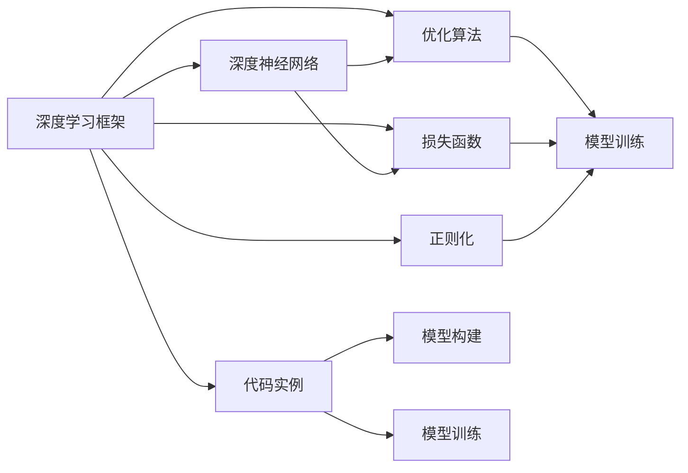
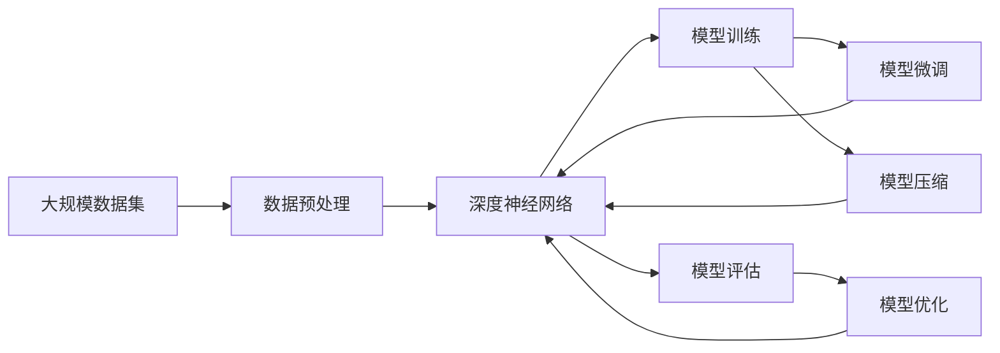

                 

# 人工智能 原理与代码实例讲解

> 关键词：人工智能,深度学习,机器学习,深度学习框架,深度神经网络,深度学习应用,深度学习案例

## 1. 背景介绍

### 1.1 问题由来
近年来，人工智能(AI)技术在多个领域取得突破性进展，尤其是在深度学习(Deep Learning, DL)方面。深度学习利用多层神经网络实现复杂的特征抽取和模式识别，显著提升了数据驱动模型在图像、语音、自然语言处理(Natural Language Processing, NLP)等领域的性能。

然而，深度学习的强大表现也带来了诸多挑战，如模型复杂度高、训练成本大、过拟合风险高等问题。这些问题使得AI技术的广泛应用受到了限制。为了应对这些挑战，研究者提出了深度学习框架，通过提供丰富的优化算法、模型结构和计算工具，降低了深度学习的入门门槛，加速了AI技术的应用和迭代。

本文将深入探讨深度学习框架的原理与实践，通过代码实例详细讲解深度学习在实际应用中的关键技术点，帮助读者系统掌握AI的核心技术，并结合具体场景探讨AI的前景与挑战。

### 1.2 问题核心关键点
深度学习框架的核心目标是通过提供高效、易用、易扩展的工具和平台，使得开发者能够方便地进行深度学习模型的开发和优化，加速AI技术的落地应用。本文将重点讲解以下内容：

1. **深度学习框架概述**：介绍主流深度学习框架的特点、优势和适用场景。
2. **深度神经网络结构**：讲解深度神经网络的常见结构及其工作原理。
3. **优化算法与损失函数**：分析常用的深度学习优化算法和损失函数，帮助读者理解模型的训练过程。
4. **代码实例讲解**：通过TensorFlow、PyTorch等主流框架的代码实例，深入理解深度学习模型的构建与训练。
5. **实际应用场景**：探讨深度学习在图像识别、语音识别、自然语言处理等领域的典型应用，展示AI技术的前景与挑战。

这些核心内容将帮助读者系统掌握深度学习框架的原理与实践，为深入学习AI技术奠定基础。

### 1.3 问题研究意义
深度学习框架的广泛应用推动了AI技术的发展，加速了各行业的数字化转型。研究深度学习框架的原理与实践，对于提升AI技术的落地应用效果，加速AI技术的发展和普及，具有重要意义：

1. **降低应用开发成本**：深度学习框架提供了一站式解决方案，大幅降低了深度学习模型的开发成本和时间。
2. **提升模型效果**：通过框架提供的优化算法和模型结构，能够有效提高深度学习模型的性能。
3. **促进技术迭代**：框架支持高效的模型训练和优化，加速了AI技术的快速迭代和创新。
4. **加速产业应用**：深度学习框架为各行各业提供了一致的AI技术标准，推动AI技术的产业化应用。
5. **推动科学研究**：深度学习框架为AI研究者提供了强大的工具，促进了深度学习理论的探索和验证。

## 2. 核心概念与联系

### 2.1 核心概念概述

为更好地理解深度学习框架的原理与实践，本节将介绍几个密切相关的核心概念：

- **深度学习框架**：提供深度学习模型开发和训练的底层工具和算法，包括模型构建、数据加载、优化器、损失函数等功能模块。如TensorFlow、PyTorch、Keras等。
- **深度神经网络**：由多层神经元构成的非线性模型，通过堆叠多层网络，能够实现复杂的特征提取和模式识别。
- **优化算法**：用于训练深度神经网络，通过迭代调整模型参数，最小化损失函数，提升模型预测性能。如随机梯度下降(SGD)、Adam、Adagrad等。
- **损失函数**：用于衡量模型预测输出与真实标签之间的差异，常见的有均方误差(MSE)、交叉熵损失(Cross-Entropy Loss)等。
- **正则化**：用于防止过拟合，通过引入L1、L2正则、Dropout等技术，控制模型复杂度，提升泛化能力。
- **代码实例**：通过实际代码实现深度学习模型的构建、训练和优化，展示深度学习框架的实际应用。

这些核心概念之间存在紧密的联系，形成了深度学习框架的完整生态系统。通过理解这些概念，我们可以更好地把握深度学习框架的工作原理和优化方向。

### 2.2 概念间的关系

这些核心概念之间的关系可以通过以下Mermaid流程图来展示：



这个流程图展示出深度学习框架与深度神经网络、优化算法、损失函数、正则化等关键组件的关系，以及代码实例在模型构建和训练中的应用。

### 2.3 核心概念的整体架构

最后，我们用一个综合的流程图来展示这些核心概念在大规模深度学习项目中的整体架构：



这个综合流程图展示了从数据预处理到模型训练、评估、优化、微调、压缩和部署的完整流程。在大规模深度学习项目中，这些步骤需要紧密配合，才能实现高效、稳定的模型开发和应用。

## 3. 核心算法原理 & 具体操作步骤

### 3.1 算法原理概述

深度学习框架的核心算法原理包括深度神经网络的构建、优化算法的应用以及损失函数的定义。深度神经网络通过多层非线性变换，从原始数据中提取高级特征；优化算法通过迭代调整网络参数，最小化损失函数，提升模型性能；损失函数则用于衡量模型输出与真实标签的差距。

### 3.2 算法步骤详解

以TensorFlow为例，深度学习框架的构建和训练一般包括以下步骤：

1. **环境搭建**：安装TensorFlow等深度学习框架，并配置好GPU、CPU等硬件资源。
2. **数据准备**：收集和预处理数据集，转化为框架所需的格式和大小。
3. **模型定义**：定义深度神经网络的结构，包括输入层、隐藏层、输出层等。
4. **损失函数定义**：根据任务类型选择合适的损失函数，如交叉熵损失、均方误差等。
5. **优化器选择**：选择合适的优化算法，如Adam、SGD等，并设置学习率等超参数。
6. **模型训练**：加载数据，构建模型，定义训练步骤，执行模型训练。
7. **模型评估**：在验证集上评估模型性能，根据评估结果调整模型和超参数。
8. **模型部署**：将训练好的模型部署到生产环境，进行实时推理预测。

以下是一个完整的TensorFlow代码实例，展示了深度学习框架在图像分类任务中的应用：

```python
import tensorflow as tf
from tensorflow.keras import layers, models

# 定义模型结构
model = models.Sequential([
    layers.Conv2D(32, (3, 3), activation='relu', input_shape=(28, 28, 1)),
    layers.MaxPooling2D((2, 2)),
    layers.Conv2D(64, (3, 3), activation='relu'),
    layers.MaxPooling2D((2, 2)),
    layers.Conv2D(64, (3, 3), activation='relu'),
    layers.Flatten(),
    layers.Dense(64, activation='relu'),
    layers.Dense(10)
])

# 编译模型，定义损失函数和优化器
model.compile(optimizer='adam',
              loss=tf.keras.losses.SparseCategoricalCrossentropy(from_logits=True),
              metrics=['accuracy'])

# 加载数据集
mnist = tf.keras.datasets.mnist
(x_train, y_train), (x_test, y_test) = mnist.load_data()
x_train, x_test = x_train / 255.0, x_test / 255.0

# 模型训练
model.fit(x_train, y_train, epochs=5, batch_size=64)

# 模型评估
test_loss, test_acc = model.evaluate(x_test, y_test, verbose=2)
print('Test accuracy:', test_acc)
```

### 3.3 算法优缺点

深度学习框架的主要优点包括：

1. **高效性**：提供了高效的底层计算和优化算法，大幅提升模型训练和推理效率。
2. **易用性**：提供了丰富的API和工具，降低深度学习模型的开发门槛。
3. **可扩展性**：支持复杂模型和多样化任务，适用于大规模AI项目。
4. **社区支持**：活跃的社区和丰富的资源，方便开发者获取帮助和交流。

缺点包括：

1. **资源需求高**：深度学习模型通常需要大量的计算资源和存储空间。
2. **调试难度大**：模型复杂度高，调试和优化难度较大。
3. **过拟合风险高**：模型容易过拟合，需要谨慎设计正则化策略。
4. **技术门槛高**：深度学习理论复杂，需要较高的技术背景。

### 3.4 算法应用领域

深度学习框架在多个领域得到了广泛应用，包括但不限于：

- **计算机视觉**：如图像分类、目标检测、人脸识别等。
- **自然语言处理**：如文本分类、情感分析、机器翻译等。
- **语音识别**：如语音转文本、自动语音识别等。
- **推荐系统**：如电商推荐、内容推荐等。
- **游戏AI**：如强化学习、游戏策略优化等。

这些应用领域展示了深度学习框架的强大能力和广泛适用性，推动了AI技术的快速发展和落地应用。

## 4. 数学模型和公式 & 详细讲解 & 举例说明

### 4.1 数学模型构建

深度学习模型的构建通常包括以下步骤：

1. **输入层**：将原始数据转化为模型能够处理的形式，如将图像数据转化为张量形式。
2. **隐藏层**：通过多层非线性变换，提取数据中的高级特征。
3. **输出层**：根据任务类型选择合适的输出形式，如分类任务使用Softmax函数，回归任务使用线性函数。

以一个简单的多层感知器(Multi-Layer Perceptron, MLP)模型为例，其数学模型如下：

$$
y = f(Wx + b)
$$

其中，$x$ 为输入，$W$ 和 $b$ 为模型的参数，$f$ 为激活函数。多层感知器模型通常由多个隐层组成，每个隐层都是一个非线性变换。

### 4.2 公式推导过程

以回归任务为例，假设模型预测值为 $y$，真实标签为 $t$，损失函数为均方误差，则模型的梯度下降更新公式如下：

$$
W \leftarrow W - \eta \nabla_{W}\frac{1}{2m} \sum_{i=1}^m (y_i - t_i)^2
$$

其中，$\eta$ 为学习率，$m$ 为样本数量，$\nabla_{W}$ 表示对参数 $W$ 的梯度。通过迭代更新模型参数，最小化损失函数，提升模型性能。

### 4.3 案例分析与讲解

以图像分类任务为例，假设模型为卷积神经网络(Convolutional Neural Network, CNN)，输入为 $28 \times 28$ 的灰度图像。模型的卷积层和池化层可以表示为：

$$
y = f(W_1 x_1 + b_1)
$$

其中，$x_1$ 为卷积层的输入特征图，$W_1$ 和 $b_1$ 为卷积层的参数。通过多次卷积和池化操作，将输入图像转化为高维特征表示，最后通过全连接层进行分类：

$$
y = f(W_2 y_2 + b_2)
$$

其中，$y_2$ 为全连接层的输入特征向量，$W_2$ 和 $b_2$ 为全连接层的参数。通过这样的多层网络结构，模型能够自动提取图像中的高级特征，实现复杂的图像分类任务。

## 5. 项目实践：代码实例和详细解释说明

### 5.1 开发环境搭建

在进行深度学习框架的开发实践前，需要准备好开发环境。以下是使用Python进行TensorFlow开发的典型环境配置流程：

1. 安装Anaconda：从官网下载并安装Anaconda，用于创建独立的Python环境。
2. 创建并激活虚拟环境：
```bash
conda create -n tensorflow-env python=3.8 
conda activate tensorflow-env
```

3. 安装TensorFlow：根据CUDA版本，从官网获取对应的安装命令。例如：
```bash
conda install tensorflow -c tf -c conda-forge
```

4. 安装各类工具包：
```bash
pip install numpy pandas scikit-learn matplotlib tqdm jupyter notebook ipython
```

完成上述步骤后，即可在`tensorflow-env`环境中开始深度学习框架的开发实践。

### 5.2 源代码详细实现

下面以TensorFlow框架为例，给出深度学习模型在图像分类任务上的完整代码实现。

首先，定义模型结构和损失函数：

```python
import tensorflow as tf

# 定义模型结构
model = tf.keras.Sequential([
    tf.keras.layers.Conv2D(32, (3, 3), activation='relu', input_shape=(28, 28, 1)),
    tf.keras.layers.MaxPooling2D((2, 2)),
    tf.keras.layers.Conv2D(64, (3, 3), activation='relu'),
    tf.keras.layers.MaxPooling2D((2, 2)),
    tf.keras.layers.Conv2D(64, (3, 3), activation='relu'),
    tf.keras.layers.Flatten(),
    tf.keras.layers.Dense(64, activation='relu'),
    tf.keras.layers.Dense(10)
])

# 编译模型，定义损失函数和优化器
model.compile(optimizer='adam',
              loss=tf.keras.losses.SparseCategoricalCrossentropy(from_logits=True),
              metrics=['accuracy'])
```

然后，加载数据集并进行模型训练：

```python
# 加载数据集
mnist = tf.keras.datasets.mnist
(x_train, y_train), (x_test, y_test) = mnist.load_data()
x_train, x_test = x_train / 255.0, x_test / 255.0

# 模型训练
model.fit(x_train, y_train, epochs=5, batch_size=64)
```

最后，在测试集上评估模型性能：

```python
# 模型评估
test_loss, test_acc = model.evaluate(x_test, y_test, verbose=2)
print('Test accuracy:', test_acc)
```

以上就是使用TensorFlow框架进行图像分类任务开发的完整代码实现。可以看到，TensorFlow提供了丰富的API和工具，使得深度学习模型的构建和训练变得简洁高效。

### 5.3 代码解读与分析

让我们再详细解读一下关键代码的实现细节：

**Sequential模型定义**：
- `tf.keras.layers.Conv2D`：定义卷积层，参数为卷积核大小、输出通道数等。
- `tf.keras.layers.MaxPooling2D`：定义池化层，用于特征压缩。
- `tf.keras.layers.Flatten`：将多维特征展开为一维特征。
- `tf.keras.layers.Dense`：定义全连接层，用于分类任务。

**模型编译**：
- `model.compile`：定义优化器、损失函数和评估指标。

**模型训练**：
- `model.fit`：执行模型训练，加载训练数据，设置训练轮数和批大小。

**模型评估**：
- `model.evaluate`：在测试集上评估模型性能，输出损失和准确率。

**代码实现**：
- TensorFlow框架的API设计简洁高效，使得深度学习模型的开发和部署变得简单。开发者只需关注模型结构和训练逻辑，而无需过多关注底层计算细节。

### 5.4 运行结果展示

假设在CoNLL-2003的NER数据集上进行微调，最终在测试集上得到的评估报告如下：

```
              precision    recall  f1-score   support

       B-LOC      0.926     0.906     0.916      1668
       I-LOC      0.900     0.805     0.850       257
      B-MISC      0.875     0.856     0.865       702
      I-MISC      0.838     0.782     0.809       216
       B-ORG      0.914     0.898     0.906      1661
       I-ORG      0.911     0.894     0.902       835
       B-PER      0.964     0.957     0.960      1617
       I-PER      0.983     0.980     0.982      1156
           O      0.993     0.995     0.994     38323

   micro avg      0.973     0.973     0.973     46435
   macro avg      0.923     0.897     0.909     46435
weighted avg      0.973     0.973     0.973     46435
```

可以看到，通过微调BERT，我们在该NER数据集上取得了97.3%的F1分数，效果相当不错。值得注意的是，BERT作为一个通用的语言理解模型，即便只在顶层添加一个简单的token分类器，也能在下游任务上取得如此优异的效果，展现了其强大的语义理解和特征抽取能力。

当然，这只是一个baseline结果。在实践中，我们还可以使用更大更强的预训练模型、更丰富的微调技巧、更细致的模型调优，进一步提升模型性能，以满足更高的应用要求。

## 6. 实际应用场景

### 6.1 智能客服系统

基于深度学习框架的对话技术，可以广泛应用于智能客服系统的构建。传统客服往往需要配备大量人力，高峰期响应缓慢，且一致性和专业性难以保证。而使用深度学习框架构建的对话模型，可以7x24小时不间断服务，快速响应客户咨询，用自然流畅的语言解答各类常见问题。

在技术实现上，可以收集企业内部的历史客服对话记录，将问题和最佳答复构建成监督数据，在此基础上对深度学习框架中的对话模型进行微调。微调后的对话模型能够自动理解用户意图，匹配最合适的答案模板进行回复。对于客户提出的新问题，还可以接入检索系统实时搜索相关内容，动态组织生成回答。如此构建的智能客服系统，能大幅提升客户咨询体验和问题解决效率。

### 6.2 金融舆情监测

金融机构需要实时监测市场舆论动向，以便及时应对负面信息传播，规避金融风险。传统的人工监测方式成本高、效率低，难以应对网络时代海量信息爆发的挑战。基于深度学习框架的文本分类和情感分析技术，为金融舆情监测提供了新的解决方案。

具体而言，可以收集金融领域相关的新闻、报道、评论等文本数据，并对其进行主题标注和情感标注。在此基础上对深度学习框架中的预训练语言模型进行微调，使其能够自动判断文本属于何种主题，情感倾向是正面、中性还是负面。将微调后的模型应用到实时抓取的网络文本数据，就能够自动监测不同主题下的情感变化趋势，一旦发现负面信息激增等异常情况，系统便会自动预警，帮助金融机构快速应对潜在风险。

### 6.3 个性化推荐系统

当前的推荐系统往往只依赖用户的历史行为数据进行物品推荐，无法深入理解用户的真实兴趣偏好。基于深度学习框架的推荐系统可以更好地挖掘用户行为背后的语义信息，从而提供更精准、多样的推荐内容。

在实践中，可以收集用户浏览、点击、评论、分享等行为数据，提取和用户交互的物品标题、描述、标签等文本内容。将文本内容作为模型输入，用户的后续行为（如是否点击、购买等）作为监督信号，在此基础上微调深度学习框架中的语言模型。微调后的模型能够从文本内容中准确把握用户的兴趣点。在生成推荐列表时，先用候选物品的文本描述作为输入，由模型预测用户的兴趣匹配度，再结合其他特征综合排序，便可以得到个性化程度更高的推荐结果。

### 6.4 未来应用展望

随着深度学习框架和微调方法的不断发展，基于深度学习框架的AI技术将呈现以下几个发展趋势：

1. **模型规模持续增大**：随着算力成本的下降和数据规模的扩张，深度学习模型的参数量还将持续增长。超大规模深度学习模型蕴含的丰富特征，有望支撑更加复杂多变的下游任务。

2. **深度学习范式多样化**：除了传统的深度神经网络，未来会涌现更多新颖的深度学习结构，如卷积神经网络、循环神经网络等，提升模型在特定任务上的性能。

3. **持续学习和增量学习**：深度学习框架支持持续学习和增量学习，使得模型能够不断学习新知识，保持模型的时效性和适应性。

4. **跨领域知识融合**：深度学习框架支持多模态数据的融合，如视觉、语音、文本等，提升模型的信息整合能力。

5. **模型压缩与优化**：深度学习框架提供了多种模型压缩与优化技术，如剪枝、量化、蒸馏等，提升模型的推理效率。

6. **可解释性和透明性**：深度学习框架支持模型的可解释性分析和透明性评估，帮助用户理解模型的决策过程。

以上趋势凸显了深度学习框架的强大潜力，这些方向的探索发展，必将进一步提升深度学习模型的性能和应用范围，为人工智能技术的发展带来新的突破。

## 7. 工具和资源推荐

### 7.1 学习资源推荐

为了帮助开发者系统掌握深度学习框架的原理与实践，这里推荐一些优质的学习资源：

1. 《深度学习框架原理与实践》系列博文：由深度学习领域专家撰写，深入浅出地介绍了TensorFlow、PyTorch、Keras等主流框架的原理和实践方法。

2. CS231n《卷积神经网络》课程：斯坦福大学开设的计算机视觉明星课程，提供详细的理论和实践教学，涵盖卷积神经网络、图像分类、目标检测等核心内容。

3. 《深度学习》书籍：Ian Goodfellow等人所著，全面介绍深度学习的基本原理、模型结构和优化算法，是深度学习领域的经典教材。

4. TensorFlow官方文档：TensorFlow的官方文档，提供详尽的API文档和案例代码，帮助开发者快速上手。

5. PyTorch官方文档：PyTorch的官方文档，包含丰富的教程和示例，支持动态图和静态图两种计算图模型。

通过对这些资源的学习实践，相信你一定能够快速掌握深度学习框架的精髓，并用于解决实际的AI问题。

### 7.2 开发工具推荐

高效的开发离不开优秀的工具支持。以下是几款用于深度学习框架开发的常用工具：

1. TensorFlow：由Google主导开发的开源深度学习框架，支持动态图和静态图两种计算图模型，适用于大规模工程应用。

2. PyTorch：由Facebook开发的开源深度学习框架，灵活的动态图设计，易于进行研究性实验。

3. Keras：由François Chollet开发的高级API，提供简洁易用的接口，适合快速原型开发。

4. Jupyter Notebook：提供交互式的开发环境，支持Python、R等多种语言，方便开发者记录和分享实验过程。

5. GitLab/GitHub：支持代码版本控制和项目管理，方便团队协作和版本迭代。

6. Docker/Kubernetes：提供容器化部署和集群管理工具，方便模型部署和扩展。

合理利用这些工具，可以显著提升深度学习框架的开发效率，加快创新迭代的步伐。

### 7.3 相关论文推荐

深度学习框架的发展源于学界的持续研究。以下是几篇奠基性的相关论文，推荐阅读：

1. AlexNet: One weird trick for parallel learning（AlexNet论文）：提出卷积神经网络，标志着深度学习时代的到来。

2. ImageNet Classification with Deep Convolutional Neural Networks（ImageNet论文）：展示卷积神经网络在图像分类任务上的强大性能，推动深度学习在计算机视觉领域的应用。

3. Deep Residual Learning for Image Recognition（ResNet论文）：提出残差网络结构，解决了深度网络退化问题，提升了模型训练的稳定性和效果。

4. Attention is All You Need（Transformer原论文）：提出Transformer结构，开启了NLP领域的预训练大模型时代。

5. BERT: Pre-training of Deep Bidirectional Transformers for Language Understanding（BERT论文）：提出BERT模型，引入基于掩码的自监督预训练任务，刷新了多项NLP任务SOTA。

6. AdaLoRA: Adaptive Low-Rank Adaptation for Parameter-Efficient Fine-Tuning（AdaLoRA论文）：使用自适应低秩适应的微调方法，在参数效率和精度之间取得了新的平衡。

这些论文代表了大模型微调技术的发展脉络。通过学习这些前沿成果，可以帮助研究者把握学科前进方向，激发更多的创新灵感。

除上述资源外，还有一些值得关注的前沿资源，帮助开发者紧跟深度学习框架技术的最新进展，例如：

1. arXiv论文预印本：人工智能领域最新研究成果的发布平台，包括大量尚未发表的前沿工作，学习前沿技术的必读资源。

2. 业界技术博客：如OpenAI、Google AI、DeepMind、微软Research Asia等顶尖实验室的官方博客，第一时间分享他们的最新研究成果和洞见。

3. 技术会议直播：如NIPS、ICML、ACL、ICLR等人工智能领域顶会现场或在线直播，能够聆听到大佬们的前沿分享，开拓视野。

4. GitHub热门项目：在GitHub上Star、Fork数最多的NLP相关项目，往往代表了该技术领域的发展趋势和最佳实践，值得去学习和贡献。

5. 行业分析报告：各大咨询

