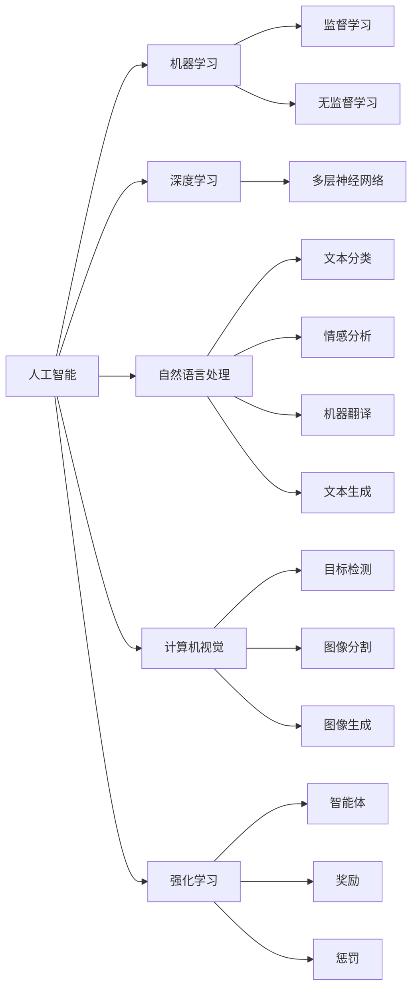

                 

# 人工智能在各行业的应用

## 1. 背景介绍

随着人工智能技术的不断发展和普及，越来越多的行业开始将AI技术融入到其业务中，以提高效率、降低成本和增强竞争力。AI的应用领域几乎涵盖了社会的方方面面，从医疗、金融到教育、制造，再到自动驾驶、智能家居，几乎无所不在。本文将系统介绍AI在各行业中的应用现状、存在的问题和未来发展方向，以期为相关领域的技术从业人员提供参考和启示。

## 2. 核心概念与联系

### 2.1 核心概念概述

在探讨AI在各行业的应用之前，我们需要先了解一些核心的AI概念和技术。以下是几个关键概念及其相互关系：

- **人工智能（AI）**：指由人制造出来的一种智能体，能够执行人类智能任务，如学习、推理、感知、理解、规划、决策等。
- **机器学习（ML）**：通过数据驱动的方式，让机器从经验中学习，从而自动改进性能，通常包括监督学习、无监督学习和强化学习。
- **深度学习（DL）**：一种特殊的机器学习方法，利用多层神经网络模拟人脑结构，通过大量的数据训练模型，实现图像、语音、自然语言等复杂数据的处理。
- **自然语言处理（NLP）**：使计算机能够理解和处理人类语言的技术，包括文本分类、情感分析、机器翻译、文本生成等任务。
- **计算机视觉（CV）**：研究如何让计算机理解和分析图像和视频数据的技术，涉及目标检测、图像分割、图像生成等。
- **强化学习（RL）**：通过智能体与环境的交互，利用奖励和惩罚信号，逐步优化决策策略，以达成特定的目标。

这些核心概念之间相互关联，构成了AI技术的基础。在实际应用中，AI技术的实现往往需要结合多个技术分支，才能发挥最大的效用。

### 2.2 概念间的关系

这些核心概念之间的逻辑关系可以通过以下Mermaid流程图来展示：



这个流程图展示了人工智能技术各分支之间的关系：

1. 人工智能是AI技术的总称，包括机器学习、深度学习、自然语言处理、计算机视觉和强化学习等多个分支。
2. 机器学习是AI技术的基础，包含监督学习、无监督学习和强化学习三种主要形式。
3. 深度学习通过多层神经网络实现复杂的图像、语音、自然语言处理任务。
4. 自然语言处理、计算机视觉和强化学习分别对应文本、图像和决策智能的不同处理需求。

## 3. 核心算法原理 & 具体操作步骤

### 3.1 算法原理概述

AI技术在各行业的应用主要依赖于机器学习、深度学习和强化学习等算法原理。以下是几种核心算法的概述：

- **监督学习（Supervised Learning）**：通过有标签的数据集训练模型，使模型能够预测未见过的数据标签。例如，使用带有标注图片的分类数据集训练图像分类模型。
- **无监督学习（Unsupervised Learning）**：使用无标签的数据集训练模型，自动发现数据的内在结构和规律。例如，使用聚类算法将用户分群，以发现用户行为模式。
- **深度学习（Deep Learning）**：通过多层的神经网络模型，实现对复杂数据的表征学习。例如，使用卷积神经网络（CNN）进行图像识别。
- **强化学习（Reinforcement Learning）**：通过智能体与环境的交互，利用奖励和惩罚信号，逐步优化决策策略。例如，使用Q学习算法训练智能游戏玩家。

### 3.2 算法步骤详解

AI算法在具体应用中通常包括以下步骤：

1. **数据收集**：获取相关的原始数据，如用户行为数据、文本数据、图像数据等。
2. **数据预处理**：对数据进行清洗、归一化、特征工程等预处理操作，以提高模型的训练效果。
3. **模型训练**：选择合适的算法和模型结构，使用预处理后的数据集进行模型训练。
4. **模型评估**：使用测试数据集评估模型性能，调整模型参数以提升效果。
5. **模型部署**：将训练好的模型部署到实际应用中，进行预测和决策。
6. **持续优化**：根据实际应用反馈，不断调整模型和算法，以应对新的业务需求。

### 3.3 算法优缺点

AI算法在各行业应用中既有其优点也有其缺点：

#### 优点

- **高效率**：通过自动化算法，大幅度提高了工作效率，减少了人力成本。
- **准确性**：利用数据驱动的算法，减少了人为错误，提高了决策的准确性。
- **灵活性**：算法可以快速适应新的业务场景和需求，提高了企业的灵活性。

#### 缺点

- **数据依赖**：AI算法的效果高度依赖于数据的质量和数量，数据质量差或数据量不足会影响模型性能。
- **复杂性**：算法设计和调优复杂，需要专业的技术人才和大量实验。
- **可解释性**：一些复杂的AI算法（如深度学习）缺乏可解释性，难以理解模型的决策过程。

### 3.4 算法应用领域

AI算法在各个行业领域有着广泛的应用，以下列举几个典型的应用领域：

#### 医疗行业

- **疾病诊断**：利用图像识别算法分析医学影像，如X光片、CT扫描等，辅助医生进行疾病诊断。
- **药物研发**：使用机器学习分析生物数据，加速新药研发进程。
- **个性化医疗**：通过数据分析，实现个性化治疗方案的设计和推荐。

#### 金融行业

- **信用评分**：利用机器学习算法分析用户历史行为数据，进行信用评分。
- **风险控制**：使用强化学习算法进行欺诈检测和风险评估。
- **投资决策**：应用自然语言处理技术，进行新闻情感分析和舆情监控，辅助投资决策。

#### 教育行业

- **智能辅导**：利用自然语言处理技术，实现智能答疑和个性化辅导。
- **学习分析**：通过数据分析，发现学生的学习行为模式，进行个性化教学。
- **资源推荐**：使用推荐系统，推荐适合学生的学习资源。

#### 制造行业

- **质量控制**：利用计算机视觉技术，进行产品缺陷检测和质量控制。
- **供应链管理**：通过数据分析，优化供应链管理和物流调度。
- **设备维护**：利用机器学习算法，预测设备故障和维护需求。

#### 自动驾驶

- **目标检测**：利用计算机视觉技术，实现对道路环境和行人的目标检测。
- **路径规划**：通过深度学习算法，生成最优驾驶路径。
- **行为决策**：应用强化学习算法，优化智能驾驶行为决策。

#### 智能家居

- **智能控制**：利用自然语言处理技术，实现语音控制和场景智能切换。
- **设备互联**：通过物联网技术，实现不同设备间的互联互通。
- **异常检测**：使用机器学习算法，检测家庭环境中的异常情况。

## 4. 数学模型和公式 & 详细讲解 & 举例说明

### 4.1 数学模型构建

在本节中，我们将以机器学习中的一个经典算法——支持向量机（SVM）为例，介绍数学模型的构建过程。

#### 4.1.1 数据表示

假设我们有一组二分类数据集 $(x_1, y_1), (x_2, y_2), \ldots, (x_n, y_n)$，其中 $x_i \in \mathbb{R}^d$ 表示输入特征，$y_i \in \{+1, -1\}$ 表示类别标签。

#### 4.1.2 模型表示

SVM的目标是找到一个超平面 $\omega x + b = 0$，使得所有正样本点到超平面的距离最大化，同时最大化负样本点到超平面的距离。模型的损失函数为：

$$
\min_{\omega, b} \frac{1}{2} \|\omega\|^2 \quad \text{subject to} \quad y_i (\omega x_i + b) \geq 1, \quad \forall i=1,\ldots,n
$$

其中 $\omega \in \mathbb{R}^d$ 为超平面的法向量，$b \in \mathbb{R}$ 为偏移量。

#### 4.1.3 求解方法

通常使用拉格朗日乘子法求解上述优化问题，得到：

$$
\omega = \sum_{i=1}^n \alpha_i y_i x_i
$$
$$
b = y_i - \sum_{i=1}^n \alpha_i y_i x_i^T x_i
$$

其中 $\alpha_i$ 为拉格朗日乘子。

### 4.2 公式推导过程

接下来，我们通过数学推导过程，详细说明SVM的求解步骤。

#### 4.2.1 拉格朗日乘子法

拉格朗日乘子法是一种求解凸优化问题的常用方法，其基本思想是将原始问题转化为对偶问题，通过求解对偶问题得到原问题的解。对于SVM问题，我们可以将其转化为拉格朗日乘子形式：

$$
\min_{\omega, b, \alpha} \frac{1}{2} \|\omega\|^2 + \sum_{i=1}^n \alpha_i (y_i (\omega x_i + b) - 1)
$$

$$
\text{subject to} \quad \alpha_i \geq 0, \quad \forall i=1,\ldots,n
$$

#### 4.2.2 对偶问题求解

根据拉格朗日乘子法的对偶性质，我们可以得到SVM的对偶问题：

$$
\min_{\alpha} \frac{1}{2} \sum_{i=1}^n \sum_{j=1}^n \alpha_i \alpha_j y_i y_j x_i^T x_j - \sum_{i=1}^n \alpha_i
$$

$$
\text{subject to} \quad \sum_{i=1}^n \alpha_i y_i = 0, \quad \alpha_i \geq 0, \quad \forall i=1,\ldots,n
$$

通过求解上述对偶问题，我们可以得到最优的 $\alpha_i$，进而得到超平面的法向量 $\omega$ 和偏移量 $b$。

### 4.3 案例分析与讲解

假设我们有一组手写数字数据集，使用SVM进行分类。具体步骤如下：

1. **数据预处理**：对图像进行归一化和灰度化处理，将图像转换为向量形式。
2. **模型训练**：使用拉格朗日乘子法求解SVM模型，得到最优的超平面。
3. **模型评估**：使用测试集评估模型性能，计算准确率、召回率和F1分数。
4. **模型调优**：调整模型参数，如正则化系数、核函数等，进一步提升模型性能。

## 5. 项目实践：代码实例和详细解释说明

### 5.1 开发环境搭建

在本节中，我们将介绍如何使用Python进行SVM的实现，包括开发环境的搭建和代码编写。

#### 5.1.1 环境搭建

1. **安装Python**：
   - 下载并安装Python，推荐使用Python 3.8及以上版本。
   - 设置Python环境变量。

2. **安装依赖库**：
   - 使用pip安装NumPy、SciPy、Scikit-learn等依赖库。

```bash
pip install numpy scipy scikit-learn
```

3. **导入库**：
   - 在Python脚本中导入所需的库，如NumPy、SciPy、Scikit-learn等。

### 5.2 源代码详细实现

接下来，我们将介绍如何使用Scikit-learn库实现SVM算法，包括数据加载、模型训练和评估等步骤。

#### 5.2.1 数据加载

使用Scikit-learn库加载手写数字数据集MNIST：

```python
from sklearn.datasets import fetch_openml
from sklearn.model_selection import train_test_split
from sklearn.metrics import accuracy_score

mnist = fetch_openml('mnist_784')
X, y = mnist.data, mnist.target
X_train, X_test, y_train, y_test = train_test_split(X, y, test_size=0.2, random_state=42)
```

#### 5.2.2 模型训练

使用Scikit-learn库中的SVM分类器进行模型训练：

```python
from sklearn.svm import SVC

svm = SVC(kernel='linear', C=1.0)
svm.fit(X_train, y_train)
```

#### 5.2.3 模型评估

使用Scikit-learn库中的评估指标计算模型性能：

```python
y_pred = svm.predict(X_test)
accuracy = accuracy_score(y_test, y_pred)
print('Accuracy:', accuracy)
```

### 5.3 代码解读与分析

在上述代码中，我们首先使用Scikit-learn库加载了MNIST数据集，并将其分为训练集和测试集。然后，使用SVM分类器对训练集进行模型训练，并使用测试集进行模型评估。最后，计算了模型的准确率。

## 6. 实际应用场景

### 6.1 医疗行业

在医疗行业，AI技术主要应用于疾病诊断、药物研发和个性化医疗等方面。例如，IBM的Watson Health利用自然语言处理和机器学习技术，辅助医生进行癌症治疗方案的设计。通过分析患者的病历、基因数据等，Watson Health能够提供个性化的治疗建议，提高治疗效果。

### 6.2 金融行业

在金融行业，AI技术主要应用于信用评分、风险控制和投资决策等方面。例如，JP摩根利用深度学习技术，对大量金融数据进行分析和建模，预测股票价格走势，提供投资建议。同时，JP摩根还应用强化学习技术，进行欺诈检测和风险评估，提高金融安全。

### 6.3 教育行业

在教育行业，AI技术主要应用于智能辅导、学习分析和资源推荐等方面。例如，Coursera利用自然语言处理技术，实现智能答疑和个性化辅导，帮助学生解决学习中的问题。通过分析学生的学习行为数据，Coursera能够提供个性化的学习建议，提升学习效果。

### 6.4 制造行业

在制造行业，AI技术主要应用于质量控制、供应链管理和设备维护等方面。例如，GE利用机器学习技术，进行设备故障预测和维护，减少设备停机时间，提高生产效率。同时，GE还应用计算机视觉技术，进行产品缺陷检测和质量控制，确保产品质量。

### 6.5 自动驾驶

在自动驾驶领域，AI技术主要应用于目标检测、路径规划和行为决策等方面。例如，Waymo利用深度学习技术，实现对道路环境和行人的目标检测，提高自动驾驶的安全性和准确性。通过强化学习技术，Waymo能够优化智能驾驶行为决策，提高自动驾驶的智能化水平。

### 6.6 智能家居

在智能家居领域，AI技术主要应用于智能控制、设备互联和异常检测等方面。例如，Google Home利用自然语言处理技术，实现语音控制和场景智能切换，提高家居的智能化水平。通过物联网技术，Google Home能够实现不同设备间的互联互通，提供一站式的智能家居体验。

## 7. 工具和资源推荐

### 7.1 学习资源推荐

为了帮助开发者系统掌握AI技术的应用，以下是一些优质的学习资源：

1. **《Python数据科学手册》**：介绍Python在数据科学中的应用，包括Numpy、Pandas、Matplotlib等库的使用。
2. **《深度学习入门》**：介绍深度学习的基本原理和应用，包括TensorFlow、Keras等框架的使用。
3. **《自然语言处理综论》**：介绍自然语言处理的基本概念和算法，包括文本分类、情感分析等任务的处理。
4. **Coursera和edX等在线课程**：提供各类AI和机器学习的在线课程，包括监督学习、无监督学习、深度学习等。
5. **Kaggle竞赛平台**：提供各类数据科学和机器学习竞赛，通过实践提升技能。

### 7.2 开发工具推荐

在开发AI项目时，选择合适的开发工具可以大幅提升开发效率。以下是一些常用的开发工具：

1. **Jupyter Notebook**：开源的Python交互式开发环境，支持代码运行、数据可视化等。
2. **TensorFlow和PyTorch**：开源的深度学习框架，支持大规模模型的训练和部署。
3. **Scikit-learn**：开源的机器学习库，提供各类机器学习算法和模型。
4. **Pandas和NumPy**：开源的数据处理库，支持高效的数据处理和分析。
5. **Keras**：基于TensorFlow的高级神经网络API，支持快速构建和训练深度学习模型。

### 7.3 相关论文推荐

以下是几篇经典的AI和机器学习论文，推荐阅读：

1. **《ImageNet Classification with Deep Convolutional Neural Networks》**：介绍深度卷积神经网络在图像分类任务中的应用。
2. **《Natural Language Processing (almost) from Scratch》**：介绍自然语言处理的原理和算法，包括文本分类、情感分析等任务的处理。
3. **《Reinforcement Learning: An Introduction》**：介绍强化学习的原理和算法，包括Q学习、策略梯度等方法。
4. **《Deep Learning》**：介绍深度学习的原理和应用，包括神经网络、卷积神经网络、循环神经网络等。
5. **《Adversarial Machine Learning》**：介绍对抗性机器学习的原理和应用，包括对抗性攻击和防御方法。

## 8. 总结：未来发展趋势与挑战

### 8.1 研究成果总结

AI技术在各行业的应用已经取得了显著的成果，但仍面临许多挑战。在医疗、金融、教育、制造、自动驾驶和智能家居等众多领域，AI技术的应用不断深化，提高了效率和决策的准确性，但也带来了数据隐私、算法透明性和伦理问题等挑战。

### 8.2 未来发展趋势

未来，AI技术将在各行业继续深化应用，呈现以下几个发展趋势：

1. **更加智能化**：AI技术将更加智能化，具备更强的自主决策和推理能力，能够应对更复杂多变的场景。
2. **更加普适化**：AI技术将更加普适化，能够适用于更多的业务场景和应用领域。
3. **更加高效化**：AI技术将更加高效化，通过优化算法和硬件，提高模型的训练和推理速度。
4. **更加人性化**：AI技术将更加人性化，具备更好的用户体验和交互能力。
5. **更加安全化**：AI技术将更加安全化，具备更好的数据隐私保护和算法透明性。

### 8.3 面临的挑战

在AI技术不断发展的过程中，也面临着许多挑战：

1. **数据隐私**：AI技术在应用过程中需要大量的数据支持，如何保护数据隐私和安全是一个重要问题。
2. **算法透明性**：AI算法通常缺乏可解释性，难以理解其内部决策过程，如何提高算法的透明性和可解释性是一个重要挑战。
3. **伦理问题**：AI算法在决策过程中可能会产生偏见和不公平，如何避免算法歧视和伦理问题是一个重要挑战。
4. **技术壁垒**：AI技术的开发和应用需要高水平的技术人员和大量实验，如何降低技术壁垒是一个重要问题。
5. **业务适配**：AI技术在应用过程中需要与业务需求紧密结合，如何实现技术的业务适配是一个重要挑战。

### 8.4 研究展望

未来，AI技术将在各行业继续深化应用，面临诸多挑战。为应对这些挑战，AI研究需要从以下几个方面进行探索：

1. **数据隐私保护**：开发更加安全、高效的加密算法和隐私保护技术，确保数据隐私和安全。
2. **算法透明性**：开发更加透明、可解释的AI算法，增强算法的可解释性和可审计性。
3. **伦理问题规避**：建立伦理导向的算法评估指标，过滤和惩罚有偏见、有害的输出倾向，确保算法的公平性和公正性。
4. **技术壁垒降低**：开发更加易用、易懂的AI开发工具和平台，降低技术门槛，提高开发效率。
5. **业务适配**：紧密结合业务需求，开发更加灵活、高效的AI应用，实现技术的业务适配。

通过以上努力，相信AI技术将在各行业继续深化应用，为经济社会发展注入新的动力，带来更加美好的未来。

## 9. 附录：常见问题与解答

### 9.1 常见问题

#### 9.1.1 如何选择合适的AI算法？

答：在选择AI算法时，需要考虑数据类型、业务需求和模型复杂度等因素。例如，对于文本数据，可以选择自然语言处理算法；对于图像数据，可以选择计算机视觉算法；对于时间序列数据，可以选择强化学习算法。

#### 9.1.2 AI算法是否需要大量数据？

答：AI算法通常需要大量数据进行训练和调优。在数据量不足的情况下，可以使用数据增强、迁移学习等技术，提高模型的泛化能力。

#### 9.1.3 AI算法是否需要高性能计算资源？

答：AI算法通常需要高性能计算资源进行训练和推理。在资源有限的情况下，可以使用模型裁剪、量化加速等技术，优化模型大小和计算效率。

#### 9.1.4 AI算法是否需要专业知识？

答：AI算法需要一定的专业知识进行开发和调优。建议初学者从简单的任务入手，逐步深入学习和实践。

### 9.2 常见解答

#### 9.2.1 如何提高AI算法的性能？

答：提高AI算法性能的方法包括：
1. 数据增强：使用数据增强技术，扩充训练集，提高模型泛化能力。
2. 模型调优：调整模型参数和超参数，优化模型结构，提高模型精度。
3. 正则化：使用正则化技术，避免过拟合，提高模型稳定性。
4. 集成学习：使用集成学习方法，将多个模型进行组合，提高模型性能。

#### 9.2.2 如何确保AI算法的公平性？

答：确保AI算法公平性的方法包括：
1. 数据清洗：清洗数据，消除偏见和歧视，提高数据的公平性。
2. 算法透明性：提高算法的透明性和可解释性，避免算法的歧视和偏见。
3. 公平性评估：建立公平性评估指标，检测和修复算法的偏见和歧视。

#### 9.2.3 如何应对AI算法的伦理问题？

答：应对AI算法伦理问题的方法包括：
1. 算法透明性：提高算法的透明性和可解释性，增强算法的可解释性和可审计性。
2. 伦理导向评估：建立伦理导向的算法评估指标，过滤和惩罚有偏见、有害的输出倾向。
3. 伦理审查：建立伦理审查机制，确保算法符合伦理规范和道德标准。

#### 9.2.4 如何应对AI算法的技术壁垒？

答：应对AI算法技术壁垒的方法包括：
1. 简化算法：简化算法模型和实现，降低技术门槛，提高开发效率。
2. 开源工具：使用开源工具和平台，提高开发效率，降低开发成本。
3. 教育培训：提供技术培训和教育，提升开发人员的技术水平。

综上所述，AI技术在各行业的应用已经取得了显著的成果，但仍面临诸多挑战。未来，AI技术将继续深化应用，为经济社会发展注入新的动力，带来更加美好的未来。

作者：禅与计算机程序设计艺术 / Zen and the Art of Computer Programming

