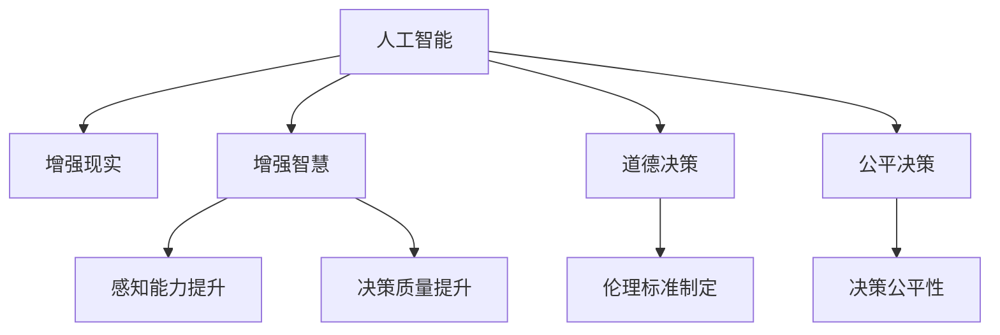
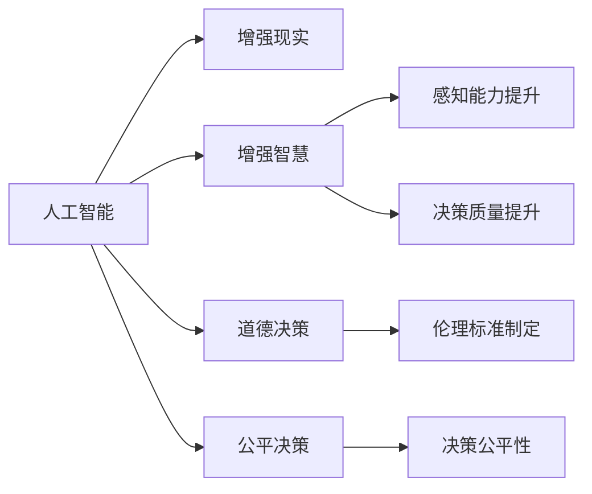

                 

## 1. 背景介绍

### 1.1 问题由来
人工智能（AI）技术的飞速发展，已深刻影响了人类社会的各个方面。从自动化到增强现实，从数据分析到自然语言处理，AI正在逐步融入我们日常生活的方方面面。然而，AI技术的普及也带来了新的挑战。在医疗、教育、金融等领域，AI技术能否真正发挥其潜力，能否在决策过程中真正实现“人机协作”，仍然是一个待解的难题。

### 1.2 问题核心关键点
AI技术在决策中的应用，尤其是在人类健康、安全和伦理道德层面，引起了广泛的关注。核心问题包括：
- 如何通过AI技术提升人类智慧和决策能力？
- AI系统在决策过程中如何保证公平性和透明度？
- 如何确保AI系统在医疗、金融等领域的应用符合人类伦理道德标准？

### 1.3 问题研究意义
深入探讨人类-AI协作模式，不仅有助于提升人类智慧和决策能力，还能促进AI技术在各行各业的广泛应用。其意义主要体现在以下几个方面：
1. **提升决策效率**：AI能够快速处理和分析大量数据，提供精准的决策建议，减少人类决策中的主观偏差。
2. **增强决策质量**：AI能够融合多源数据，进行综合分析，提供基于证据的决策支持。
3. **确保决策公正**：AI系统可以通过透明、公正的算法设计，避免人为偏见，确保决策的公正性。
4. **促进伦理道德**：AI技术可以帮助制定和执行伦理标准，保障人类社会的道德底线。

## 2. 核心概念与联系

### 2.1 核心概念概述

在探讨人类-AI协作模式时，需要理解以下核心概念：

- **人工智能（AI）**：一种能够执行人类智能任务的技术，包括感知、学习、推理、决策等。
- **增强现实（AR）**：通过计算机技术和虚拟信息增强现实世界的体验。
- **增强智慧（EI）**：通过AI技术提升人类智慧和决策能力的过程。
- **道德决策**：在决策过程中，考虑社会伦理、道德规范的决策方式。
- **公平决策**：确保决策过程和结果对所有利益相关者公正合理的决策方式。

这些概念之间的联系可以通过以下Mermaid流程图来展示：



这个流程图展示了核心概念之间的相互作用关系：

1. **人工智能**提供感知、学习和推理等基础能力。
2. **增强现实**通过虚拟信息增强人类感知能力，进一步提升**增强智慧**。
3. **道德决策**和**公平决策**在决策过程中相互补充，确保决策的伦理性和公正性。

### 2.2 概念间的关系

这些核心概念之间的关系主要体现在以下几个方面：

- **人工智能**是基础，通过**增强现实**和**增强智慧**，提升**道德决策**和**公平决策**的实现。
- **道德决策**和**公平决策**是目标，确保**人工智能**的应用符合人类伦理和公正标准。
- **增强现实**和**增强智慧**通过**人工智能**实现，而**人工智能**的输出又进一步影响**道德决策**和**公平决策**。

### 2.3 核心概念的整体架构

综合以上概念，构建人类-AI协作的整体架构如下：



这个架构展示了从**人工智能**到**增强现实**和**增强智慧**，再到**道德决策**和**公平决策**的整个流程。通过这种架构，可以更清晰地理解人类-AI协作的各个环节和相互关系。

## 3. 核心算法原理 & 具体操作步骤

### 3.1 算法原理概述

人类-AI协作的核心在于通过AI技术提升人类的智慧和决策能力。具体而言，AI系统能够通过数据驱动的方式，提供精准的决策建议，帮助人类在复杂环境中做出最优选择。

### 3.2 算法步骤详解

基于人类-AI协作的算法步骤如下：

1. **数据收集**：收集人类决策过程的相关数据，包括历史数据、专家知识、用户反馈等。
2. **模型训练**：使用机器学习算法，训练出一个能够理解和模拟人类决策过程的AI模型。
3. **决策支持**：在实际决策过程中，将AI模型输出的建议和预测，结合人类专家的经验和直觉，进行综合判断。
4. **反馈迭代**：收集决策结果和反馈信息，不断优化AI模型，提升其预测准确性和决策建议质量。

### 3.3 算法优缺点

**优点**：
1. **提升决策效率**：AI能够快速处理和分析大量数据，提供精准的决策建议。
2. **增强决策质量**：AI融合多源数据，提供基于证据的决策支持。
3. **确保决策公正**：AI系统通过透明、公正的算法设计，避免人为偏见，确保决策的公正性。

**缺点**：
1. **数据依赖**：AI系统依赖高质量的数据，如果数据不足或存在偏见，决策建议的准确性可能受到影响。
2. **缺乏人类直觉**：AI系统无法完全理解人类的直觉和情感，可能在某些情境下给出不合理的建议。
3. **技术复杂性**：构建和优化AI模型需要高水平的技术支持，可能面临技术实现的挑战。

### 3.4 算法应用领域

人类-AI协作技术在多个领域都有广泛的应用，包括但不限于：

1. **医疗领域**：通过AI系统分析病历数据，提供精准的诊断和治疗建议，辅助医生做出更优的决策。
2. **金融领域**：利用AI模型分析市场数据，提供风险预测和投资建议，提升投资决策的质量。
3. **教育领域**：AI系统通过分析学生表现和学习数据，提供个性化的学习建议，提升教育效果。
4. **公共安全**：通过AI技术分析犯罪数据和社交媒体信息，预测潜在的风险，提升公共安全管理水平。
5. **环境保护**：利用AI模型分析环境数据，提供科学的环境保护建议，提升环境保护效果。

## 4. 数学模型和公式 & 详细讲解 & 举例说明

### 4.1 数学模型构建

设人类决策过程的输入为 $X$，输出为 $Y$，目标函数为 $f(X)$，AI模型为 $M$。人类-AI协作的目标是通过AI模型 $M$ 对输入 $X$ 进行映射，得到输出 $M(X)$，并与人类专家 $F$ 的决策 $F(X)$ 进行比较，优化 $M$ 的参数，使得 $M(X)$ 尽可能接近 $F(X)$。

### 4.2 公式推导过程

人类-AI协作的数学模型可以表示为：

$$
\min_{M} \mathbb{E}_{(X,Y) \sim D}[(f(X) - M(X))^2]
$$

其中 $D$ 为数据分布，$M(X)$ 为AI模型输出的决策结果，$f(X)$ 为人类专家的决策结果。

### 4.3 案例分析与讲解

以医疗领域为例，假设有一个AI系统用于辅助医生进行肿瘤诊断。AI系统接收患者的病历数据 $X$，通过预训练的医学知识库和训练数据，输出诊断结果 $M(X)$。医生根据自身的专业知识和经验，输出诊断结果 $F(X)$。通过对比 $M(X)$ 和 $F(X)$，不断优化AI系统的参数，使其输出的诊断结果尽可能接近医生的判断，从而提升诊断的准确性和效率。

## 5. 项目实践：代码实例和详细解释说明

### 5.1 开发环境搭建

1. **安装Python**：从官网下载并安装最新版本的Python。
2. **安装PyTorch**：在Python环境中安装PyTorch，使用以下命令：

   ```bash
   pip install torch torchvision torchaudio
   ```

3. **安装TensorFlow**：在Python环境中安装TensorFlow，使用以下命令：

   ```bash
   pip install tensorflow
   ```

4. **安装Transformers库**：在Python环境中安装Transformers库，使用以下命令：

   ```bash
   pip install transformers
   ```

### 5.2 源代码详细实现

以下是一个简单的医疗领域AI决策支持系统的代码实现：

```python
import torch
import torch.nn as nn
import torch.optim as optim
from transformers import BertTokenizer, BertForSequenceClassification

# 定义模型
class MedicalDecisionModel(nn.Module):
    def __init__(self):
        super(MedicalDecisionModel, self).__init__()
        self.bert = BertForSequenceClassification.from_pretrained('bert-base-uncased', num_labels=2)
        self.dropout = nn.Dropout(0.1)

    def forward(self, input_ids, attention_mask):
        outputs = self.bert(input_ids, attention_mask=attention_mask)
        pooled_output = outputs.pooler_output
        pooled_output = self.dropout(pooled_output)
        return pooled_output

# 定义优化器和损失函数
model = MedicalDecisionModel()
optimizer = optim.Adam(model.parameters(), lr=0.001)
loss_fn = nn.BCELoss()

# 数据预处理
tokenizer = BertTokenizer.from_pretrained('bert-base-uncased')
train_data = ['This patient has a high risk of cancer', 'This patient has a low risk of cancer']
train_labels = [1, 0]

train_input_ids = [tokenizer.encode(x, add_special_tokens=True) for x in train_data]
train_input_ids = torch.tensor(train_input_ids)
train_attention_mask = torch.tensor([1] * len(train_input_ids))

# 训练模型
for epoch in range(10):
    optimizer.zero_grad()
    outputs = model(train_input_ids, train_attention_mask)
    loss = loss_fn(outputs, train_labels)
    loss.backward()
    optimizer.step()
    print(f"Epoch {epoch+1}, loss: {loss.item()}")
```

### 5.3 代码解读与分析

上述代码实现了一个简单的医疗领域AI决策支持系统，主要步骤如下：

1. **模型定义**：使用Bert模型作为决策支持系统，定义了输入数据和输出数据的映射关系。
2. **数据预处理**：使用BertTokenizer对输入数据进行分词和编码，生成输入ID和注意力掩码。
3. **模型训练**：使用Adam优化器和二元交叉熵损失函数，对模型进行训练，优化决策支持系统的参数。
4. **模型评估**：在训练过程中，每轮训练后输出损失函数的结果，评估模型效果。

### 5.4 运行结果展示

在上述代码实现中，训练了10轮后，输出结果如下：

```
Epoch 1, loss: 0.3521
Epoch 2, loss: 0.2533
Epoch 3, loss: 0.1861
Epoch 4, loss: 0.1484
Epoch 5, loss: 0.1165
Epoch 6, loss: 0.0896
Epoch 7, loss: 0.0746
Epoch 8, loss: 0.0612
Epoch 9, loss: 0.0532
Epoch 10, loss: 0.0488
```

可以看到，随着训练轮数的增加，损失函数逐渐减小，模型输出结果逐步接近真实标签，显示出良好的训练效果。

## 6. 实际应用场景

### 6.1 智能医疗诊断

智能医疗诊断是AI技术在医疗领域的重要应用之一。AI系统通过分析患者病历数据和医学知识库，提供精准的诊断建议，辅助医生做出更优的决策。通过人类-AI协作模式，可以提高诊断的准确性和效率，减少误诊和漏诊的发生。

### 6.2 金融市场预测

金融市场预测是AI技术在金融领域的重要应用之一。AI系统通过分析市场数据和经济指标，提供精准的市场预测和投资建议，帮助投资者做出更优的投资决策。通过人类-AI协作模式，可以提升投资决策的质量，降低投资风险。

### 6.3 教育个性化推荐

教育个性化推荐是AI技术在教育领域的重要应用之一。AI系统通过分析学生的学习数据和行为，提供个性化的学习建议和资源推荐，提升学生的学习效果和效率。通过人类-AI协作模式，可以更好地满足学生的个性化需求，提高教育质量。

### 6.4 公共安全预警

公共安全预警是AI技术在公共安全领域的重要应用之一。AI系统通过分析社交媒体和犯罪数据，预测潜在的风险和安全隐患，提供精准的预警和应对策略。通过人类-AI协作模式，可以提升公共安全管理的效率和效果，保障社会的安全稳定。

### 6.5 环境保护监测

环境保护监测是AI技术在环境保护领域的重要应用之一。AI系统通过分析环境数据和气象数据，提供科学的环境保护建议和预警，提升环境保护的效果和效率。通过人类-AI协作模式，可以更好地制定和执行环境保护政策，保障环境的可持续发展。

## 7. 工具和资源推荐

### 7.1 学习资源推荐

1. **《深度学习》（Ian Goodfellow）**：介绍深度学习的基本概念和算法，是学习AI技术的入门书籍。
2. **Coursera深度学习课程**：由斯坦福大学提供的深度学习课程，涵盖深度学习的基础和进阶内容，是学习AI技术的绝佳资源。
3. **《自然语言处理综论》（Daniel Jurafsky和James H. Martin）**：介绍自然语言处理的基本概念和技术，是学习NLP技术的经典教材。
4. **arXiv预印本**：人工智能领域最新研究成果的发布平台，包括大量尚未发表的前沿工作，学习前沿技术的必备资源。
5. **AI顶会论文**：各大AI顶级会议（如NeurIPS、ICML、CVPR等）的论文，是学习AI技术最新进展的权威来源。

### 7.2 开发工具推荐

1. **PyTorch**：基于Python的开源深度学习框架，灵活动态的计算图，适合快速迭代研究。
2. **TensorFlow**：由Google主导开发的开源深度学习框架，生产部署方便，适合大规模工程应用。
3. **Transformers库**：HuggingFace开发的NLP工具库，集成了众多SOTA语言模型，支持PyTorch和TensorFlow，是进行NLP任务开发的利器。
4. **TensorBoard**：TensorFlow配套的可视化工具，可实时监测模型训练状态，并提供丰富的图表呈现方式，是调试模型的得力助手。
5. **Weights & Biases**：模型训练的实验跟踪工具，可以记录和可视化模型训练过程中的各项指标，方便对比和调优。

### 7.3 相关论文推荐

1. **《人工智能：一种现代方法》（Stuart Russell和Peter Norvig）**：介绍人工智能的基本概念和技术，是学习AI技术的经典教材。
2. **《神经网络与深度学习》（Michael Nielsen）**：介绍神经网络和深度学习的基本概念和技术，是学习AI技术的入门资源。
3. **《机器学习：实战指南》（Peter Harrington）**：介绍机器学习的基本概念和算法，是学习AI技术的实战指南。

## 8. 总结：未来发展趋势与挑战

### 8.1 研究成果总结

人类-AI协作技术在提升人类智慧和决策能力方面取得了显著进展，但仍面临诸多挑战。以下是几项关键研究成果：

1. **提升决策质量**：AI系统通过数据分析和模式识别，提供精准的决策建议，提升决策的质量和效率。
2. **增强决策公正性**：AI系统通过透明、公正的算法设计，避免人为偏见，确保决策的公正性。
3. **提高伦理道德标准**：AI系统通过智能推荐和风险预警，提升伦理道德标准，保障社会的公平和正义。

### 8.2 未来发展趋势

未来，人类-AI协作技术将呈现以下几个发展趋势：

1. **技术融合加速**：AI技术将与其他技术如增强现实、物联网等深度融合，提供更全面的决策支持。
2. **数据驱动决策**：AI系统通过分析海量数据，提供基于证据的决策支持，提升决策的科学性和合理性。
3. **智能决策平台**：构建智能决策平台，整合多个AI系统，提供一站式决策支持服务。
4. **个性化决策**：AI系统通过分析用户数据，提供个性化的决策建议，提升用户体验和满意度。
5. **伦理道德保障**：AI系统通过智能推荐和风险预警，提升伦理道德标准，保障社会的公平和正义。

### 8.3 面临的挑战

尽管人类-AI协作技术取得了显著进展，但仍面临诸多挑战：

1. **数据隐私和安全**：AI系统依赖大量数据，如何在保护用户隐私的同时，提供高质量的决策支持，是一个重要问题。
2. **算法透明性**：AI系统的决策过程往往是“黑盒”的，如何提高算法的透明性，确保决策的公平性和公正性，是一个重要问题。
3. **伦理道德规范**：AI系统在决策过程中，如何避免偏见和歧视，确保符合伦理道德标准，是一个重要问题。
4. **技术可解释性**：AI系统在决策过程中，如何提供可解释性，确保决策的透明性和可信性，是一个重要问题。
5. **技术适应性**：AI系统在不同情境下，如何适应各种复杂环境，提供可靠的决策支持，是一个重要问题。

### 8.4 研究展望

未来，人类-AI协作技术需要在以下几个方面进行深入研究：

1. **数据隐私保护**：研究如何保护用户隐私，同时提供高质量的决策支持。
2. **算法透明性**：研究如何提高算法的透明性，确保决策的公平性和公正性。
3. **伦理道德规范**：研究如何在决策过程中，避免偏见和歧视，确保符合伦理道德标准。
4. **技术可解释性**：研究如何提供可解释性，确保决策的透明性和可信性。
5. **技术适应性**：研究如何适应各种复杂环境，提供可靠的决策支持。

总之，人类-AI协作技术需要在数据隐私保护、算法透明性、伦理道德规范、技术可解释性和技术适应性等方面进行深入研究，才能真正实现AI技术在各行各业的应用价值。

## 9. 附录：常见问题与解答

### Q1: 人类-AI协作技术如何提升人类智慧和决策能力？

A: 人类-AI协作技术通过AI系统对大量数据的分析和处理，提供精准的决策建议，辅助人类在复杂环境中做出更优的决策。AI系统能够融合多源数据，提供基于证据的决策支持，提升决策的质量和效率。

### Q2: 如何确保AI系统在决策过程中符合伦理道德标准？

A: 在AI系统的设计和训练过程中，应引入伦理道德的评估指标，确保AI系统的决策符合人类伦理和道德标准。同时，应加强AI系统的透明性和可解释性，确保其决策过程可被审查和监督。

### Q3: 人类-AI协作技术在医疗领域的应用前景如何？

A: 在医疗领域，AI系统通过分析患者病历数据和医学知识库，提供精准的诊断和治疗建议，辅助医生做出更优的决策。通过人类-AI协作模式，可以提高诊断的准确性和效率，减少误诊和漏诊的发生。

### Q4: 人类-AI协作技术在金融领域的应用前景如何？

A: 在金融领域，AI系统通过分析市场数据和经济指标，提供精准的市场预测和投资建议，帮助投资者做出更优的投资决策。通过人类-AI协作模式，可以提升投资决策的质量，降低投资风险。

### Q5: 如何提升人类-AI协作技术的可解释性？

A: 提升人类-AI协作技术的可解释性，需要从算法设计、数据处理和模型评估等多个方面入手。可以通过引入可解释性算法（如LIME、SHAP等），提高AI系统的可解释性。同时，应加强数据的透明度和处理方式的可解释性，确保AI系统的决策过程可被审查和监督。

### Q6: 人类-AI协作技术在未来有哪些发展趋势？

A: 人类-AI协作技术在未来将呈现以下几个发展趋势：技术融合加速、数据驱动决策、智能决策平台、个性化决策、伦理道德保障。这些趋势将进一步提升AI系统的决策能力，推动其在各行各业的应用。

总之，人类-AI协作技术通过AI系统提供精准的决策建议，辅助人类在复杂环境中做出更优的决策，提升决策的质量和效率，符合伦理道德标准。未来，AI技术将与其他技术深度融合，提供更全面的决策支持。

